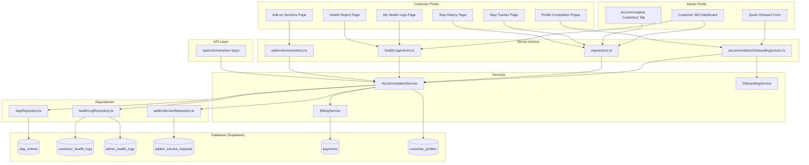

# Design Document: Accommodation Customer Flow

## Overview

This design extends the ArogyaDiet modular monolith to fully support the ACCOMMODATION customer category with a complete lifecycle: admin onboarding with accommodation-specific fields, stay management, customer-facing health tracking pages, and admin monitoring tools. The design follows existing project patterns — Server Components by default, Server Actions for mutations, Supabase with RLS, Zod validation schemas, and the established portal isolation boundaries.

### Key Design Decisions

1. **New `stay_entries` table** as the central domain entity — decoupled from `subscriptions` to keep the meal subscription lifecycle separate from accommodation stays.
2. **Shared payment via foreign key** — a `payment_host_profile_id` column on `stay_entries` linking to the paying guest's `customer_profiles.id`, with business logic skipping invoice generation when set.
3. **Daily cron for status transitions** — mirrors the existing `expire-kits` pattern at `/api/cron/transition-stays`.
4. **Customer sidebar as a branching conditional** — extends the existing `customerCategory` prop already threaded through the layout.
5. **Accommodation Service** as a dedicated business logic layer in `src/services/AccommodationService.ts`, keeping Server Actions thin.

---

## Architecture



### Layer Responsibilities

| Layer | Responsibility |
|-------|---------------|
| **Pages (RSC)** | Data fetching via server-side Supabase, render UI components |
| **Client Components** | Interactive forms (React Hook Form + Zod), state via Zustand/React Query |
| **Server Actions** | Authentication, input validation, delegation to service layer |
| **Services** | Business rules (GST calculation, status transitions, shared payment logic) |
| **Repositories** | Pure data access — queries and inserts against Supabase tables |
| **Cron Routes** | Scheduled batch operations (stay status transitions) |

---

## Components and Interfaces

### Server Actions

#### `src/actions/accommodationOnboardingActions.ts`
Handles accommodation-specific onboarding and profile completion.

```typescript
// Extends the existing Quick Onboard flow for ACCOMMODATION category
export async function onboardAccommodationCustomerAction(
  input: AccommodationOnboardingInput
): Promise<ActionResult<{ customerId: string; stayId: string }>>

// Profile completion with medical history for accommodation customers
export async function completeAccommodationProfileAction(
  input: AccommodationProfileCompletionInput
): Promise<ProfileCompletionActionResult>
```

#### `src/actions/stayActions.ts`
Stay lifecycle management actions.

```typescript
export async function extendStayAction(
  stayId: string,
  input: ExtendStayInput
): Promise<ActionResult<{ newEndDate: string }>>

export async function createNewStayAction(
  customerProfileId: string,
  input: CreateStayInput
): Promise<ActionResult<{ stayId: string }>>

export async function markStayExpiredAction(
  stayId: string
): Promise<ActionResult<void>>

export async function getActiveStayAction(
  customerProfileId: string
): Promise<ActionResult<StayEntry | null>>

export async function getStayHistoryAction(
  customerProfileId: string
): Promise<ActionResult<StayEntry[]>>
```

#### `src/actions/healthLogActions.ts`
Health log entry actions for both customer and admin.

```typescript
export async function submitCustomerHealthLogAction(
  input: CustomerHealthLogInput
): Promise<ActionResult<void>>

export async function submitAdminHealthLogAction(
  stayId: string,
  input: AdminHealthLogInput
): Promise<ActionResult<void>>

export async function getCustomerHealthLogsAction(
  stayId: string
): Promise<ActionResult<CustomerHealthLog[]>>

export async function getAdminHealthLogsAction(
  stayId: string
): Promise<ActionResult<AdminHealthLog[]>>
```

#### `src/actions/addonServiceActions.ts`
Add-on service request management.

```typescript
export async function requestAddonServiceAction(
  input: AddonServiceRequestInput
): Promise<ActionResult<{ requestId: string }>>

export async function getAddonServiceRequestsAction(
  customerProfileId: string
): Promise<ActionResult<AddonServiceRequest[]>>

export async function updateAddonServiceStatusAction(
  requestId: string,
  status: "CONFIRMED" | "COMPLETED"
): Promise<ActionResult<void>>
```

### Customer Portal Pages

| Route | Component | Type |
|-------|-----------|------|
| `/stay-tracker` | `StayTrackerPage` | RSC + Client interactive |
| `/stay-history` | `StayHistoryPage` | RSC |
| `/health-logs` | `HealthLogsPage` | RSC + Client form |
| `/health-report` | `HealthReportPage` | RSC |
| `/addon-services` | `AddonServicesPage` | RSC + Client interactive |

### Admin Portal Components

| Location | Component | Purpose |
|----------|-----------|---------|
| Customer List | `AccommodationCustomersTab` | Dedicated tab for accommodation guests |
| Customer 360 | `AccommodationTab` | Stay overview, health logs, stay management |
| Customer 360 | `AdminHealthLogForm` | Daily health metrics entry |
| Customer 360 | `StayExtensionDialog` | Extend active stay |
| Customer 360 | `NewStayDialog` | Create new stay for returning guests |

### Sidebar Extension

The existing `CustomerSidebar` component will be extended with an `isAccommodation` branch (mirroring the existing `isKit` pattern) that renders accommodation-specific navigation items.

---

## Data Models

### `stay_entries` Table

```sql
CREATE TABLE stay_entries (
  id UUID PRIMARY KEY DEFAULT gen_random_uuid(),
  customer_profile_id UUID NOT NULL REFERENCES customer_profiles(id),
  start_date DATE NOT NULL,
  total_nights INTEGER NOT NULL CHECK (total_nights >= 1 AND total_nights <= 365),
  stay_type TEXT NOT NULL CHECK (stay_type IN ('AC Villa', 'Village Style Hut')),
  occupancy_type TEXT NOT NULL CHECK (occupancy_type IN ('Single', 'Double')),
  status TEXT NOT NULL DEFAULT 'PENDING' CHECK (status IN ('PENDING', 'ACTIVE', 'FINISHED', 'EXPIRED')),
  payment_amount NUMERIC(10,2),
  base_amount NUMERIC(10,2),
  tax_amount NUMERIC(10,2),
  tax_percentage NUMERIC(4,2) DEFAULT 18.00,
  payment_host_profile_id UUID REFERENCES customer_profiles(id),
  meal_preference TEXT CHECK (meal_preference IN ('VEG', 'EGG', 'CHICKEN')),
  created_at TIMESTAMPTZ DEFAULT now(),
  updated_at TIMESTAMPTZ DEFAULT now()
);

-- Indexes
CREATE INDEX idx_stay_entries_customer ON stay_entries(customer_profile_id);
CREATE INDEX idx_stay_entries_status ON stay_entries(status);
CREATE INDEX idx_stay_entries_dates ON stay_entries(start_date, status);
```

### `customer_health_logs` Table

```sql
CREATE TABLE customer_health_logs (
  id UUID PRIMARY KEY DEFAULT gen_random_uuid(),
  stay_entry_id UUID NOT NULL REFERENCES stay_entries(id),
  customer_profile_id UUID NOT NULL REFERENCES customer_profiles(id),
  log_date DATE NOT NULL,
  water_intake_liters NUMERIC(4,1) CHECK (water_intake_liters >= 0.1 AND water_intake_liters <= 15.0),
  activity_name VARCHAR(100),
  activity_duration_minutes INTEGER CHECK (activity_duration_minutes >= 1 AND activity_duration_minutes <= 1440),
  created_at TIMESTAMPTZ DEFAULT now(),
  updated_at TIMESTAMPTZ DEFAULT now(),
  UNIQUE(stay_entry_id, log_date)
);
```

### `admin_health_logs` Table

```sql
CREATE TABLE admin_health_logs (
  id UUID PRIMARY KEY DEFAULT gen_random_uuid(),
  stay_entry_id UUID NOT NULL REFERENCES stay_entries(id),
  customer_profile_id UUID NOT NULL REFERENCES customer_profiles(id),
  log_date DATE NOT NULL,
  weight_kg NUMERIC(5,1) CHECK (weight_kg >= 30.0 AND weight_kg <= 300.0),
  bp_systolic INTEGER CHECK (bp_systolic >= 60 AND bp_systolic <= 250),
  bp_diastolic INTEGER CHECK (bp_diastolic >= 40 AND bp_diastolic <= 150),
  sugar_level_mgdl INTEGER CHECK (sugar_level_mgdl >= 30 AND sugar_level_mgdl <= 600),
  notes VARCHAR(500),
  created_at TIMESTAMPTZ DEFAULT now(),
  updated_at TIMESTAMPTZ DEFAULT now()
);

CREATE INDEX idx_admin_health_logs_stay ON admin_health_logs(stay_entry_id, log_date);
```

### `addon_service_requests` Table

```sql
CREATE TABLE addon_service_requests (
  id UUID PRIMARY KEY DEFAULT gen_random_uuid(),
  customer_profile_id UUID NOT NULL REFERENCES customer_profiles(id),
  stay_entry_id UUID NOT NULL REFERENCES stay_entries(id),
  service_type TEXT NOT NULL,
  status TEXT NOT NULL DEFAULT 'PENDING' CHECK (status IN ('PENDING', 'CONFIRMED', 'COMPLETED')),
  requested_at TIMESTAMPTZ DEFAULT now(),
  updated_at TIMESTAMPTZ DEFAULT now()
);

CREATE INDEX idx_addon_requests_customer ON addon_service_requests(customer_profile_id);
```

### `customer_profiles` Extensions

```sql
ALTER TABLE customer_profiles
  ADD COLUMN medical_history_notes TEXT,
  ADD COLUMN medical_history_confirmed BOOLEAN DEFAULT false,
  ADD COLUMN medical_documents JSONB DEFAULT '[]'::jsonb;
```

### TypeScript Types (`src/types/accommodation.ts`)

```typescript
export type StayStatus = "PENDING" | "ACTIVE" | "FINISHED" | "EXPIRED";
export type StayType = "AC Villa" | "Village Style Hut";
export type OccupancyType = "Single" | "Double";
export type MealPreference = "VEG" | "EGG" | "CHICKEN";
export type AddonServiceStatus = "PENDING" | "CONFIRMED" | "COMPLETED";

export interface StayEntry {
  id: string;
  customerProfileId: string;
  startDate: string; // ISO date
  totalNights: number;
  stayType: StayType;
  occupancyType: OccupancyType;
  status: StayStatus;
  paymentAmount: number | null;
  baseAmount: number | null;
  taxAmount: number | null;
  taxPercentage: number;
  paymentHostProfileId: string | null;
  mealPreference: MealPreference;
  endDate: string; // computed: startDate + totalNights - 1
  createdAt: string;
  updatedAt: string;
}

export interface CustomerHealthLog {
  id: string;
  stayEntryId: string;
  logDate: string;
  waterIntakeLiters: number;
  activityName: string | null;
  activityDurationMinutes: number | null;
  createdAt: string;
}

export interface AdminHealthLog {
  id: string;
  stayEntryId: string;
  logDate: string;
  weightKg: number | null;
  bpSystolic: number | null;
  bpDiastolic: number | null;
  sugarLevelMgdl: number | null;
  notes: string | null;
  createdAt: string;
}

export interface AddonServiceRequest {
  id: string;
  customerProfileId: string;
  stayEntryId: string;
  serviceType: string;
  status: AddonServiceStatus;
  requestedAt: string;
}
```

### Zod Validation Schemas (`src/validations/accommodationSchema.ts`)

```typescript
import { z } from "zod";

export const accommodationOnboardingSchema = z.object({
  fullName: z.string().min(1).max(100),
  mobile: z.string().regex(/^[6-9]\d{9}$/),
  gender: z.enum(["Male", "Female", "Other"]),
  dietaryPreference: z.enum(["Veg", "Non-Veg"]),
  allergies: z.string().max(500).optional(),
  email: z.string().email().max(254).optional(),
  startDate: z.string().regex(/^\d{4}-\d{2}-\d{2}$/),
  totalNights: z.coerce.number().int().min(1).max(365),
  stayType: z.enum(["AC Villa", "Village Style Hut"]),
  occupancyType: z.enum(["Single", "Double"]),
  mealPreference: z.enum(["VEG", "EGG", "CHICKEN"]),
  paymentAmount: z.coerce.number().min(1).max(9999999).optional(),
  isSharedPayment: z.boolean().default(false),
  paymentHostMobile: z.string().regex(/^[6-9]\d{9}$/).optional(),
}).superRefine((data, ctx) => {
  if (data.isSharedPayment) {
    if (!data.paymentHostMobile) {
      ctx.addIssue({
        code: z.ZodIssueCode.custom,
        path: ["paymentHostMobile"],
        message: "Payment host mobile number is required for shared payment.",
      });
    }
  } else {
    if (!data.paymentAmount || data.paymentAmount <= 0) {
      ctx.addIssue({
        code: z.ZodIssueCode.custom,
        path: ["paymentAmount"],
        message: "Payment amount is required and must be greater than zero.",
      });
    }
  }
});

export const extendStaySchema = z.object({
  additionalNights: z.coerce.number().int().min(1).max(365),
  paymentAmount: z.coerce.number().min(1).max(9999999),
});

export const createStaySchema = z.object({
  startDate: z.string().regex(/^\d{4}-\d{2}-\d{2}$/),
  totalNights: z.coerce.number().int().min(1).max(365),
  stayType: z.enum(["AC Villa", "Village Style Hut"]),
  occupancyType: z.enum(["Single", "Double"]),
  paymentAmount: z.coerce.number().min(1).max(9999999),
  mealPreference: z.enum(["VEG", "EGG", "CHICKEN"]),
});

export const customerHealthLogSchema = z.object({
  waterIntakeLiters: z.coerce.number().min(0.1).max(15.0).multipleOf(0.1),
  activityName: z.string().max(100).optional(),
  activityDurationMinutes: z.coerce.number().int().min(1).max(1440).optional(),
}).superRefine((data, ctx) => {
  if (data.activityDurationMinutes && !data.activityName?.trim()) {
    ctx.addIssue({
      code: z.ZodIssueCode.custom,
      path: ["activityName"],
      message: "Activity name is required when duration is provided.",
    });
  }
});

export const adminHealthLogSchema = z.object({
  logDate: z.string().regex(/^\d{4}-\d{2}-\d{2}$/),
  weightKg: z.coerce.number().min(30.0).max(300.0).optional(),
  bpSystolic: z.coerce.number().int().min(60).max(250).optional(),
  bpDiastolic: z.coerce.number().int().min(40).max(150).optional(),
  sugarLevelMgdl: z.coerce.number().int().min(30).max(600).optional(),
  notes: z.string().max(500).optional(),
});

export const addonServiceRequestSchema = z.object({
  serviceType: z.string().min(1),
});
```

### GST Calculation Logic

```typescript
// src/services/AccommodationService.ts (excerpt)

export function calculateGstBreakup(totalAmount: number): {
  baseAmount: number;
  taxAmount: number;
  taxPercentage: number;
} {
  const baseAmount = Math.round((totalAmount / 1.18) * 100) / 100;
  const taxAmount = Math.round((totalAmount - baseAmount) * 100) / 100;
  return { baseAmount, taxAmount, taxPercentage: 18 };
}
```

### Stay Status Transition Logic

```typescript
// Valid transitions enforced by the service layer
const VALID_TRANSITIONS: Record<StayStatus, StayStatus[]> = {
  PENDING: ["ACTIVE", "EXPIRED"],
  ACTIVE: ["FINISHED"],
  FINISHED: [],
  EXPIRED: [],
};

export function computeEndDate(startDate: string, totalNights: number): string {
  // endDate = startDate + totalNights - 1 (dates inclusive)
  return addDays(parseISO(startDate), totalNights - 1).toISOString().split("T")[0];
}
```

---


## Correctness Properties

*A property is a characteristic or behavior that should hold true across all valid executions of a system — essentially, a formal statement about what the system should do. Properties serve as the bridge between human-readable specifications and machine-verifiable correctness guarantees.*

### Property 1: GST Breakup Invariant

*For any* valid payment amount (1 to 9,999,999), computing the GST breakup SHALL produce a baseAmount and taxAmount where baseAmount = round(totalAmount / 1.18, 2), taxAmount = round(totalAmount - baseAmount, 2), and baseAmount + taxAmount equals the totalAmount (within ±0.01 tolerance due to rounding).

**Validates: Requirements 5.1, 5.2, 14.6**

### Property 2: Accommodation Onboarding Schema Field Range Validation

*For any* numeric value provided for startDate, totalNights, or paymentAmount, the accommodation onboarding schema SHALL accept exactly those values within valid ranges (startDate: today to today+365, totalNights: 1-365, paymentAmount: 1-9,999,999) and reject all values outside those ranges.

**Validates: Requirements 1.2, 1.3, 1.7**

### Property 3: Shared Payment Skips Billing

*For any* stay entry where `payment_host_profile_id` is set (shared payment is enabled), the system SHALL NOT create any payment record, invoice, or receipt for that customer, and `getCustomerInvoices` SHALL return an empty result set for stay-related invoices.

**Validates: Requirements 2.6, 2.7, 5.5**

### Property 4: Initial Stay Status Assignment

*For any* stay entry creation with a valid start date, the system SHALL assign status PENDING if the start date (compared in IST) is after today, or ACTIVE if the start date equals today.

**Validates: Requirements 3.4, 4.1**

### Property 5: Cron Stay Status Transitions

*For any* set of stay entries in the database, when the daily cron job executes on a given date D (IST): all PENDING stays where startDate <= D AND computeEndDate(startDate, totalNights) >= D SHALL transition to ACTIVE; all ACTIVE stays where computeEndDate(startDate, totalNights) < D SHALL transition to FINISHED; and no other stays SHALL be modified.

**Validates: Requirements 4.2, 4.3**

### Property 6: End Date Computation

*For any* valid start date and total nights (1-365), the computed end date SHALL equal startDate + totalNights - 1 days (dates inclusive), ensuring the stay covers exactly totalNights calendar days.

**Validates: Requirements 4.5**

### Property 7: Status Transition Enforcement

*For any* stay entry with a given current status, the system SHALL accept only the transitions PENDING→ACTIVE, PENDING→EXPIRED, ACTIVE→FINISHED, and SHALL reject all other transition attempts with an error.

**Validates: Requirements 4.6**

### Property 8: Stay Extension Recalculates End Date

*For any* active stay entry with a current end date and additional nights (1-365) with payment amount, the system SHALL set the new end date to currentEndDate + additionalNights, record a new payment entry with correct GST breakup (18% inclusive), and increase the effective totalNights accordingly.

**Validates: Requirements 14.1**

### Property 9: Health Log Upsert Idempotence

*For any* active stay entry and log date, submitting a customer health log entry multiple times for the same (stay_entry_id, log_date) pair SHALL result in exactly one record in the database containing the most recently submitted values.

**Validates: Requirements 9.2, 9.3**

### Property 10: Profile Completion Button Enablement

*For any* combination of medical history textarea content and confirmation checkbox state, the "Mark complete onboarding" button SHALL be enabled if and only if (the textarea contains at least 1 non-whitespace character) OR (the confirmation checkbox is checked).

**Validates: Requirements 6.3**

### Property 11: Health Log Schema Validates Input Ranges

*For any* customer health log input, the schema SHALL reject submissions where waterIntakeLiters is outside [0.1, 15.0], activityDurationMinutes is outside [1, 1440], activityName exceeds 100 characters, or where activityDurationMinutes is provided but activityName is empty/whitespace.

**Validates: Requirements 9.4**

---

## Error Handling

### Onboarding Errors

| Scenario | Handling |
|----------|----------|
| Duplicate mobile number | Return field error on `mobile`, prevent submission |
| Invalid shared payment host | Return field error on `paymentHostMobile` with descriptive message |
| Self-referencing payment host | Return field error indicating customer cannot be own host |
| Stay entry creation failure | Roll back customer profile creation (transactional), return general error |
| Network timeout during onboarding | Display retry-able error toast, preserve form state |

### Stay Lifecycle Errors

| Scenario | Handling |
|----------|----------|
| Invalid status transition | Return error message specifying which transitions are valid |
| Extend non-active stay | Return error: "Only active stays can be extended" |
| Create stay while active/pending exists | Return error: "Current stay must be finished or expired first" |
| Cron job DB failure | Log error via `console.error`, return 500 response, no partial commits |

### Health Log Errors

| Scenario | Handling |
|----------|----------|
| Validation failure (out of range) | Return inline field errors, preserve entered data |
| No active stay for logging | Disable form, show informational message |
| Upsert conflict resolution | Handled by DB UNIQUE constraint + ON CONFLICT UPDATE |

### Add-on Service Errors

| Scenario | Handling |
|----------|----------|
| Request submission failure | Display error toast, preserve selected service for retry |
| No active stay | Disable request buttons, show informational message |

### General Patterns

- All Server Actions return a discriminated union: `{ success: true; data: T } | { error: string; fieldErrors?: Record<string, string> }`
- Client forms use React Hook Form's error state to display inline validation messages
- Server-side Zod validation is always re-run (client validation is UX only, not a trust boundary)
- Database errors are caught and transformed into user-friendly messages (never expose raw SQL errors)
- The admin client (`createAdminClient`) is used for cross-user operations; regular `createClient` for customer-scoped reads

---

## Testing Strategy

### Unit Tests (Example-Based)

Focus areas:
- **Schema validation**: Edge cases for each Zod schema (boundary values, invalid types)
- **UI rendering conditions**: Category-based sidebar rendering, form field visibility toggles
- **Date computations**: End date calculation with edge cases (leap years, month boundaries)
- **Component rendering**: Profile completion popup states, stay tracker display

### Property-Based Tests

**Library**: [fast-check](https://github.com/dubzzz/fast-check) (already available in the Node.js/TypeScript ecosystem, compatible with the project's test setup)

**Configuration**: Minimum 100 iterations per property test.

**Tag format**: `Feature: accommodation-customer-flow, Property {number}: {title}`

Each correctness property (1-11) maps to exactly one property-based test:

| Property | Test Focus | Generator Strategy |
|----------|-----------|-------------------|
| 1: GST Breakup | `calculateGstBreakup` function | Random numbers in [1, 9999999] |
| 2: Schema Ranges | `accommodationOnboardingSchema` | Random dates, numbers both in/out of range |
| 3: Shared Payment Billing | Onboarding service with mock DB | Random stays with/without payment host |
| 4: Initial Status | `determineInitialStatus` function | Random dates relative to "today" |
| 5: Cron Transitions | `transitionStays` service function | Random sets of stays with various date configurations |
| 6: End Date | `computeEndDate` function | Random (startDate, totalNights) pairs |
| 7: Status Transitions | `transitionStatus` function | All (current, target) status pairs |
| 8: Stay Extension | `extendStay` service function | Random active stays + extension params |
| 9: Health Log Upsert | Repository upsert function with mock DB | Random log data, same (stay, date) pairs |
| 10: Button Enablement | Pure function `isProfileComplete(text, checked)` | Random strings (including whitespace-only) + booleans |
| 11: Health Log Validation | `customerHealthLogSchema` | Random inputs with values in/out of valid ranges |

### Integration Tests

- **Cron job end-to-end**: Test `/api/cron/transition-stays` with seeded DB state
- **Shared payment onboarding flow**: Full onboarding with valid payment host reference
- **Stay extension with payment recording**: Verify payment row and GST fields persisted
- **Profile completion with file upload**: Verify storage integration

### Test File Locations

```
src/validations/__tests__/accommodationSchema.test.ts
src/services/__tests__/AccommodationService.test.ts
src/services/__tests__/AccommodationService.property.test.ts
src/repositories/__tests__/stayRepository.test.ts
src/app/api/cron/transition-stays/__tests__/route.test.ts
```
