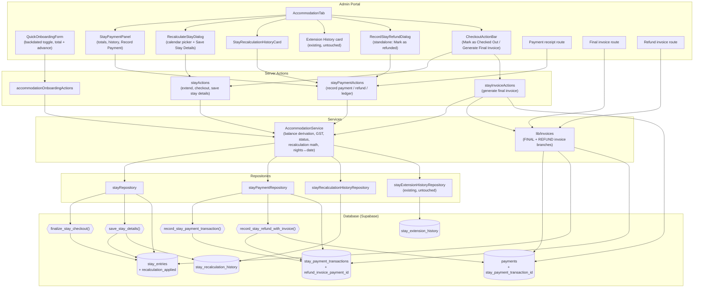
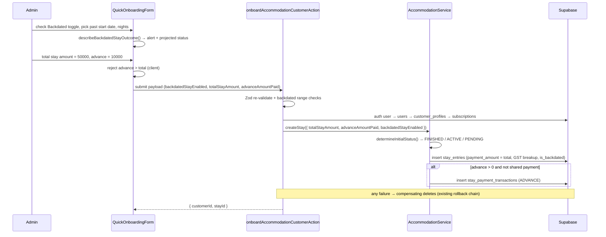
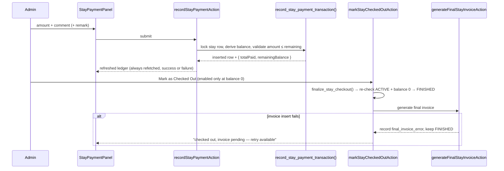
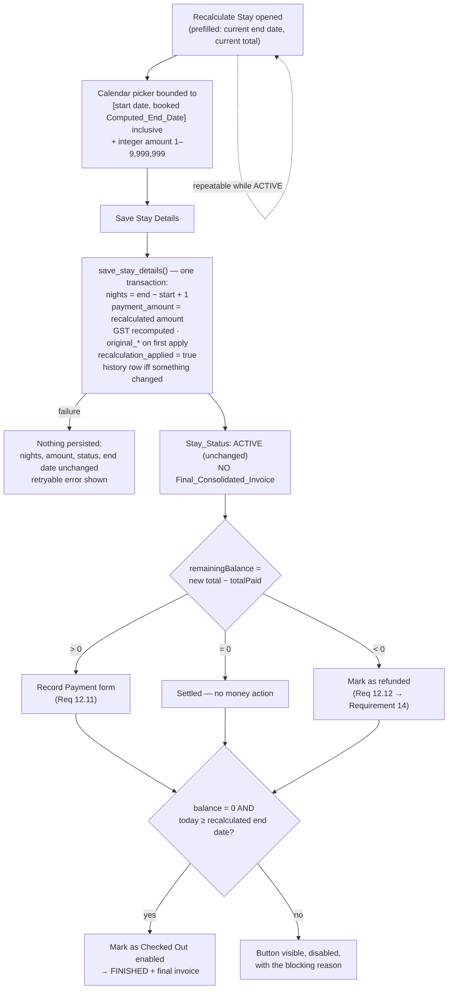

# Design Document: Accommodation Payment Lifecycle

## Overview

This design extends the existing ACCOMMODATION customer category (`accommodation-customer-flow`) with a full payment ledger, backdated onboarding, checkout gating, and consolidated invoicing. It is **additive**: `stay_entries`, `AccommodationService`, `stayRepository`, `stayActions`, `AccommodationTab`, and `QuickOnboardingForm` are extended in place rather than replaced.

The single structural change is the introduction of a **payment ledger** (`stay_payment_transactions`) as the source of truth for money movement on a stay. `Total_Paid` and `Remaining_Balance` are never stored — they are **derived** from the ledger, so no update path can leave them stale.

### Revision 2 — Recalculate Stay, Recalculation History, Refund Invoice

**Everything described above is already shipped and in production** (see `tasks.md` — all tasks complete). This revision is an **incremental change over that shipped code**, driven by the rewritten Requirement 12 and the new Requirements 13 and 14. Nothing in the ledger model, the balance derivation, the backdated-onboarding flow, the checkout gate, or the Final_Consolidated_Invoice pipeline changes.

The architectural shift is narrow but load-bearing: **recalculating a stay is now fully decoupled from checking it out**. The old "Early Checkout" action took `Actual_Nights_Stayed` as a typed number and, when the recalculated amount happened to equal Total_Paid, silently transitioned the stay to FINISHED and generated the final invoice in the same click. The new "Recalculate Stay" action takes a **calendar-picked end date** (nights are derived, never typed), persists nights + amount through a **"Save Stay Details"** button, and **never touches Stay_Status and never generates a Final_Consolidated_Invoice**. `Mark as Checked Out` remains the single path to FINISHED, auto-enabling through the *existing* Requirement 7 gate now that the stay's end date is the recalculated one.

| Area | Delta | Refactor or new |
|------|-------|-----------------|
| `scripts/create-stay-recalculation.sql` | recalculation history table, refund-invoice linkage, `save_stay_details()` + `record_stay_refund_with_invoice()` RPCs, `recalculation_applied` column | **new** (additive, idempotent; nothing dropped) |
| `stay_entries` columns | `recalculation_applied` added; `early_checkout_applied` / `actual_nights_stayed` retained with narrowed roles; `original_total_*` reused with widened semantics | **refactor** (see [Column reconciliation](#column-reconciliation-stay_entries)) |
| `AccommodationService.applyEarlyCheckoutMath` → `applyStayRecalculationMath` | outcome type loses its `CHECKED_OUT` branch entirely | **refactor** |
| `AccommodationService.earlyCheckout` → `saveStayDetails` | no longer calls `checkoutStay`; no invoice | **refactor** |
| `deriveStayActionVisibility` | `showEarlyCheckout` → `showRecalculateStay` (repeatable), `showMarkAsRefunded` added | **refactor** |
| `nightsFromEndDate` / `endDateFromNights` / `recalculationDateBounds` | calendar-picker bounds and nights derivation | **new** |
| `earlyCheckoutSchema` / `createEarlyCheckoutSchema` → `createRecalculateStaySchema` | date-bounded, integer-only amount | **refactor** |
| `earlyCheckoutStayAction` → `saveStayDetailsAction` | same file, new contract | **refactor** |
| `recordStayRefundAction` | standalone availability + refund-invoice atomicity | **refactor** |
| `stayRecalculationHistoryRepository` | mirrors `stayExtensionHistoryRepository` | **new** |
| `lib/invoices/index.ts` | `ACCOMMODATION_REFUND_INVOICE` branch; final-invoice figures resolution corrected | **new branch + refactor** |
| `EarlyCheckoutDialog` → `RecalculateStayDialog` | calendar picker + Save Stay Details | **refactor (rebuild)** |
| `StayRecalculationHistoryCard` | beside the existing Extension History card | **new** |
| `RecordStayRefundDialog` | promoted to a standalone always-available-when-overpaid action | **refactor** |
| `StayCheckoutActionBar` | gate reads the recalculated end date; manual-retrigger rejection | **refactor** |

Unchanged and explicitly out of scope for this revision: `stay_payment_transactions` schema, `record_stay_payment_transaction` for ADVANCE/PARTIAL rows, `finalize_stay_checkout`, `deriveStayBalance`, `gstFromTotal`, onboarding, `StayPaymentPanel`'s payment history, `PaymentReceiptDocument`, and the Backdated_Stay flow.

**Requirement renumbering.** Requirement 8's criteria were split and renumbered by the revision: old 8.3 keeps its number but its recalculated-figures clause moves to **new 8.4**; old 8.4 (layout parity) → **8.5**; old 8.5 (no per-transaction detail) → **8.6**; old 8.6 (at most one invoice) → **8.7**; old 8.7 (failure preserves FINISHED) → **8.8**; **8.9** and **8.10** are new. Refund criteria that lived under Requirement 12 (old 12.8–12.11) now live under **Requirement 14**. Prose and properties below use the **new** numbering. Inline `Req …` comments inside the *already-shipped* `create-stay-payment-lifecycle.sql` block are left exactly as they appear in the deployed file, so the design keeps matching the code that is running; the new migration uses the new numbering throughout.

### Key Design Decisions

| # | Decision | Rationale |
|---|----------|-----------|
| 1 | **New `stay_payment_transactions` table** holding ADVANCE / PARTIAL_BALANCE_PAYMENT / REFUND rows | An append-only ledger makes `Total_Paid` and `Remaining_Balance` derived values (Req 6.3, 6.4) and gives per-transaction receipts an addressable identity (Req 10.1) |
| 2 | **`stay_entries.payment_amount` is repurposed as `Total_Stay_Amount`** (no new total column) | It already accumulates extension cost via `stayRepository.extendStay`, which is exactly the Total_Stay_Amount definition (onboarding total + extension costs). Adding a parallel column would create two truths |
| 3 | **Total_Paid / Remaining_Balance derived, never persisted** | Extensions, stay recalculations, refunds, and partial payments all move the balance. Deriving eliminates the whole class of "stored balance drift" bugs |
| 4 | **Money arithmetic in integer paise** inside the service layer | `NUMERIC(10,2)` in Postgres, but JS float sums (`0.1 + 0.2`) would break exact zero-balance gating. `toPaise`/`fromPaise` conversion makes "balance is exactly zero" a reliable predicate (Req 7.2) |
| 5 | **Balance-mutating writes go through Postgres RPCs that lock the stay row** (`record_stay_payment_transaction`, `finalize_stay_checkout`) | Two admins recording payments concurrently must not both pass the "amount ≤ remaining balance" check. `SELECT … FOR UPDATE` on `stay_entries` serialises ledger appends per stay |
| 6 | **Final_Consolidated_Invoice is a `payments` row** with `invoice_type = 'ACCOMMODATION_FINAL_INVOICE'`, uniquely constrained per stay | Reuses the existing `generateInvoiceData` + `InvoiceDocument` pipeline so accommodation invoices look and print exactly like Meal/KIT invoices (Req 8.5), and the partial unique index enforces "at most one per stay" at the DB level (Req 8.7) |
| 7 | **Accommodation stays no longer write a `payments` row at onboarding or at extension** | Those rows encoded the old single-upfront-payment assumption and would double-count revenue against the final invoice. Revenue is recognised once, at checkout. Per-transaction visibility comes from the ledger and its receipts |
| 8 | **Status transition is committed before invoice generation** | Req 8.8 requires FINISHED to survive an invoice failure. Coupling them in one transaction would violate that; instead the failure is recorded on the stay and a manual retrigger action is exposed |
| 9 | **Backdated stays get a third initial status branch (`FINISHED`)** inside `determineInitialStatus` | Creation-time assignment, not a transition, so the existing `VALID_TRANSITIONS` table stays untouched (Req 3.3) |
| 10 | **Backdated toggle mirrors the `pastDateEnabled` pattern** already shipped in `onboarding-past-date-flexibility` | Same 30-day window, same toggle-off-clears-date behaviour, same server-side re-validation — minus the Past Day Status popup, since accommodation has no per-day delivery capture |

**Revision 2 decisions:**

| # | Decision | Rationale |
|---|----------|-----------|
| 11 | **Save Stay Details is a pure data write — it never transitions Stay_Status and never generates an invoice.** The outcome type has no `CHECKED_OUT` member at all | Req 12.9 and 12.13. Making the absence *structural* (a union of `COLLECT_BALANCE \| RECORD_REFUND \| SETTLED`) means the old coupling cannot be reintroduced by accident: there is no value the type system would accept that means "and also check out". `Mark as Checked Out` stays the sole path to FINISHED |
| 12 | **Nights are derived from a calendar-picked end date, never typed.** The write path takes `Recalculated_End_Date`; `Recalculated_Total_Nights` is computed as `endDate − startDate + 1` | Req 12.3, 12.8. Typing nights and typing a date are two truths that can disagree; the old `Actual_Nights_Stayed` number input let an admin enter a night count that contradicted the calendar. Deriving makes "the guest leaves on the 14th" the only input |
| 13 | **The date picker is bounded to `[start_date, currently booked Computed_End_Date]`, both bounds selectable, under the existing inclusive end-date convention** (`nights = end − start + 1`) | Req 12.3 + 12.6 together. The inclusive convention is what `computeEndDate` already uses everywhere, and it is the only reading under which "submit the current end date unchanged" is a genuine no-op (Req 12.6). Selecting the start date itself is the minimum stay length, exactly 1 night, so the range is **never empty**: for a 1-night stay it collapses to the single date `min = max = start_date`, which is that stay's own unchanged end date. That is strictly better than the shipped `[1, bookedTotalNights − 1]` night-count bound, which rejected *every* submission against a 1-night stay |
| 14 | **A new `recalculation_applied` flag replaces `early_checkout_applied` as the "figures were recalculated" signal; `early_checkout_applied` and `actual_nights_stayed` are retained, backfilled, and narrowed** | Req 8.4, 12.10. Recalculation is now repeatable, so `actual_nights_stayed` can go stale between invocations — reading it to build an invoice was safe only while early checkout was once-per-stay. Nothing is dropped: `early_checkout_applied` keeps its literal historical meaning ("this stay ended earlier than booked") and is still written when a submission shortens the stay |
| 15 | **A single `save_stay_details()` RPC performs the stay update and its history insert under one row lock, in one transaction** | Req 12.16 requires that a mid-operation failure leave nights, amount, status, and end date fully unchanged. Two separate writes from Node cannot give that; one plpgsql function can. It also mirrors the lock discipline `record_stay_payment_transaction` / `finalize_stay_checkout` already establish |
| 16 | **REFUND transactions move to a new `record_stay_refund_with_invoice()` RPC that writes the ledger row *and* the Refund_Invoice in one transaction** | Req 14.8 demands the REFUND row be rolled back if invoice generation fails — the opposite of the Final_Consolidated_Invoice policy (Req 8.8), where FINISHED is deliberately preserved. The shipped `record_stay_payment_transaction` commits the ledger row on its own, so a subsequent invoice failure would leave Total_Paid permanently wrong. A compensating delete from Node was rejected: the delete can itself fail, which is precisely the case Req 14.8 is about. See [Reconciling the two invoice-failure policies](#reconciling-the-two-invoice-failure-policies) |
| 17 | **Refund_Invoice is a `payments` row with `invoice_type = 'ACCOMMODATION_REFUND_INVOICE'`, keyed to the REFUND transaction** (not to the stay) | Req 14.9 allows many Refund_Invoices per stay but at most one per REFUND transaction. A partial unique index on the new `payments.stay_payment_transaction_id` enforces exactly that cardinality at the DB level, the way `uniq_final_stay_invoice_per_stay` enforces the final invoice's |
| 18 | **Recalculation history gets its own table, mirroring `stay_extension_history`** rather than a `kind` discriminator on that table | Req 13.3, 13.6, 13.7 require the two lists never cross-contaminate in either direction. Two tables make that a structural guarantee instead of a query filter someone can forget, and it matches the precedent already set by `create-stay-extension-history.sql` |

### Terminology Mapping (spec term → implementation)

| Spec term | Implementation |
|-----------|----------------|
| Stay_Entry | `stay_entries` row |
| Total_Stay_Amount | `stay_entries.payment_amount` |
| Payment_Transaction | `stay_payment_transactions` row |
| Total_Paid / Remaining_Balance | derived by `AccommodationService.deriveStayBalance()` |
| Backdated_Stay | `stay_entries.is_backdated = true` |
| Recalculate_Stay | the `RecalculateStayDialog` action on the Accommodation tab |
| Recalculated_End_Date | the calendar-picked date submitted to `saveStayDetailsAction`; persisted indirectly as `stay_entries.total_nights` |
| Recalculated_Total_Nights | `stay_entries.total_nights` after Save Stay Details (`endDate − startDate + 1`) |
| Recalculated_Stay_Amount | `stay_entries.payment_amount` after Save Stay Details |
| Save_Stay_Details | `save_stay_details()` RPC, behind `AccommodationService.saveStayDetails()` |
| Save_Stay_Details "has been applied" | `stay_entries.recalculation_applied = true` |
| Early_Checkout (now a *case* of Recalculate_Stay) | a Save Stay Details submission that shortens the stay; still stamps `stay_entries.early_checkout_applied = true` |
| Recalculation_History | `stay_recalculation_history` rows |
| Stay_Extension history | `stay_extension_history` rows (untouched, never mixed with the above) |
| Mark_As_Refunded | `recordStayRefundAction` → `record_stay_refund_with_invoice()` RPC |
| Refund_Invoice | `payments` row, `invoice_type = 'ACCOMMODATION_REFUND_INVOICE'`, linked to one REFUND transaction |
| Final_Consolidated_Invoice | `payments` row, `invoice_type = 'ACCOMMODATION_FINAL_INVOICE'` |
| Payment_Receipt | rendered view of a single `stay_payment_transactions` row |

---

## Architecture



Revision-2 additions are `RSD`, `RHC`, `RINV`, `SRH`, `SRHT`, `RPC3`, `RPC4`, and the refund/recalculation columns. `RPC1` remains the append path for ADVANCE and PARTIAL_BALANCE_PAYMENT rows only — REFUND rows now go through `RPC4` (design decision 16).

### Flow 1 — Onboarding with total + advance



### Flow 2 — Record payment and checkout



### Flow 3 — Recalculate Stay → Save Stay Details (revised)

The stay **stays ACTIVE through this entire flow**. Reaching FINISHED requires a separate, deliberate `Mark as Checked Out`, which auto-enables only once the balance is exactly zero *and* the current IST date has reached the (possibly recalculated) end date.



### Flow 4 — Mark as refunded → Refund_Invoice (atomic pair)

```mermaid
sequenceDiagram
    participant A as Admin
    participant D as RecordStayRefundDialog
    participant Act as recordStayRefundAction
    participant RPC as record_stay_refund_with_invoice()
    participant DB as Supabase

    Note over D: visible whenever the ACTIVE stay's<br/>Total_Paid > Total_Stay_Amount (Req 14.1)
    A->>D: amount (1…excess, prefilled) + required remark
    D->>Act: submit
    Act->>Act: admin auth → Zod re-validate
    Act->>RPC: one call, one transaction
    RPC->>DB: lock stay row (FOR UPDATE)
    RPC->>RPC: derive Total_Paid; excess = Total_Paid − total
    alt no excess / amount > excess / amount <= 0
        RPC-->>Act: NO_EXCESS_TO_REFUND / REFUND_EXCEEDS_EXCESS<br/>(nothing written)
    else valid
        RPC->>DB: INSERT REFUND stay_payment_transactions row
        RPC->>DB: INSERT payments row (ACCOMMODATION_REFUND_INVOICE)
        RPC->>DB: link refund_invoice_payment_id back onto the ledger row
        Note over RPC,DB: any failure here raises →<br/>the REFUND row is rolled back too (Req 14.8)
        RPC-->>Act: { transaction, refundInvoicePaymentId, balance }
    end
    Act-->>D: fresh StayBalanceSnapshot (Req 14.10 — status untouched)
```

### Layer Responsibilities

| Layer | Added responsibility |
|-------|---------------------|
| `QuickOnboardingForm` | Backdated toggle + range switching, completion alert, total/advance split fields |
| `AccommodationTab` children | Balance summary, payment history, Record Payment form, Recalculate Stay dialog, Recalculation History card beside the existing Extension History card, standalone Mark as refunded, checkout actions, receipt links |
| Server Actions | Auth, Zod re-validation, status/eligibility gating, orchestration of ledger → status → invoice |
| `AccommodationService` | Balance derivation, GST from total, initial-status branching, nights↔end-date conversion, recalculation math, action-visibility predicates |
| `stayPaymentRepository` | Ledger reads + RPC-backed appends (payments via `RPC1`, refunds + refund invoice via `RPC4`) |
| `stayRecalculationHistoryRepository` | Recalculation history reads; writes happen inside `save_stay_details()` |
| RPCs | Row-locked, atomic balance validation and status finalisation |
| `lib/invoices` | `ACCOMMODATION_FINAL_INVOICE` branch (consolidated, no per-transaction lines) |

---

## Components and Interfaces

### Server Actions

#### `src/actions/stayPaymentActions.ts` (new)

```typescript
export async function recordStayPaymentAction(
  stayId: string,
  input: RecordStayPaymentInput          // { amount, comment, remark? }
): Promise<ActionResult<StayBalanceSnapshot>>;

/**
 * Req 14 (revised) — "Mark as refunded". No longer a branch of early checkout:
 * callable whenever an ACTIVE stay's Total_Paid exceeds its current
 * Total_Stay_Amount (Req 14.1). Routes through
 * `record_stay_refund_with_invoice()`, so the REFUND ledger row and its
 * Refund_Invoice are written together or not at all (Req 14.7, 14.8).
 */
export async function recordStayRefundAction(
  stayId: string,
  input: RecordStayRefundInput           // { amount, remark, comment? }
): Promise<ActionResult<{
  balance: StayBalanceSnapshot;
  refundInvoicePaymentId: string;        // Req 14.7 — always present on success
}>>;

// getStayPaymentLedgerAction — unchanged signature. Its StayLedgerView now also
// carries `recalculations` (Req 13.3, 13.5) alongside the existing
// `extensions`, so the Recalculation History card renders from the same single
// round trip the Extension History card already uses. No separate action is
// introduced: two fetch paths for one panel would be two truths.

/** Ledger + derived totals for the Accommodation tab. Always safe to re-call. */
export async function getStayPaymentLedgerAction(
  stayId: string
): Promise<ActionResult<StayLedgerView>>;

/** Single transaction, shaped for the Payment_Receipt document. */
export async function getStayPaymentReceiptAction(
  transactionId: string
): Promise<ActionResult<PaymentReceiptData>>;
```

`StayBalanceSnapshot` is returned by every mutation so the panel can render new totals without a second round trip. The panel *additionally* refetches the ledger in a `finally` block, which is what satisfies Req 5.9 (totals refresh whether or not the write succeeded).

#### `src/actions/stayActions.ts` (extended)

```typescript
/** Req 7 — gated on Remaining_Balance === 0 and status ACTIVE. */
export async function markStayCheckedOutAction(
  stayId: string
): Promise<ActionResult<{ status: "FINISHED"; invoiceStatus: "GENERATED" | "PENDING_RETRY" | "NOT_APPLICABLE" }>>;

/**
 * Req 12 (revised) — Save Stay Details. REPLACES `earlyCheckoutStayAction`.
 * Persists the recomputed total nights and the new Total_Stay_Amount and
 * nothing else: no status transition, no invoice (Req 12.9). Repeatable while
 * the stay is ACTIVE (Req 12.10); rejected otherwise (Req 12.14).
 */
export async function saveStayDetailsAction(
  stayId: string,
  input: unknown                         // { recalculatedEndDate, recalculatedStayAmount }
): Promise<ActionResult<SaveStayDetailsOutcome>>;

// extendStayAction — refined: no Payment_Transaction, GST recomputed from the
// updated Total_Stay_Amount, returns the new balance alongside the end date.
export async function extendStayAction(
  stayId: string,
  input: ExtendStayInput
): Promise<ActionResult<{ newEndDate: string; balance: StayBalanceSnapshot }>>;
```

```typescript
/**
 * REPLACES `EarlyCheckoutOutcome`, which is retired.
 *
 * Two structural differences carry Req 12.9:
 *  - there is no `CHECKED_OUT` member and no `invoiceStatus` field, so no value
 *    of this type can express "and the stay was also checked out";
 *  - `status` is the literal `"ACTIVE"`, making the invariant checkable at the
 *    type level as well as at runtime.
 */
export type SaveStayDetailsOutcome = {
  stayId: string;
  /** Recalculated_Total_Nights, DERIVED from the submitted end date. */
  totalNights: number;
  /** Recalculated_End_Date, echoed back so the tab can re-render without a refetch. */
  recalculatedEndDate: string;
  totalStayAmount: number;
  balance: StayBalanceSnapshot;
  /** Which money follow-up (if any) the tab must present. Never a checkout. */
  nextAction: "COLLECT_BALANCE" | "RECORD_REFUND" | "SETTLED";
  refundDue: number;                // 0 unless nextAction === "RECORD_REFUND"
  /** false for a no-op submission — no Recalculation_History entry was written (Req 13.2). */
  historyRecorded: boolean;
  /** Always "ACTIVE": Save Stay Details never transitions status (Req 12.9). */
  status: "ACTIVE";
};
```

`extendStayAction` keeps its contract but its rejection message now also covers Req 12.14's shared wording: extension and Save Stay Details are gated by the same ACTIVE check.

#### `src/actions/stayInvoiceActions.ts` (new)

```typescript
/**
 * Req 8, 9.3 — generates the single Final_Consolidated_Invoice for a stay.
 * Idempotent: returns the existing invoice when one is already present.
 * Used by checkout, by the Backdated_Stay "Generate Final Invoice" action,
 * and as the manual retry path after a generation failure (Req 8.7).
 */
export async function generateFinalStayInvoiceAction(
  stayId: string,
  opts?: { manualRetrigger?: boolean }
): Promise<ActionResult<{ paymentId: string; alreadyExisted: boolean }>>;
```

**Revision 2 refinement (Req 8.9, 8.10).** The internal path (checkout, and the automatic retry surface) keeps its idempotent behaviour: an existing invoice is returned as `{ paymentId, alreadyExisted: true }`. An **explicit manual retrigger** (`manualRetrigger: true`, which is what the `Invoice generation failed — retry` button and the Backdated_Stay action send) instead **returns an error** when an invoice already exists — "A final invoice already exists for this stay." — because Req 8.10 asks for a rejection, not a silent success. Either way no second `payments` row is written; `uniq_final_stay_invoice_per_stay` remains the backstop. Req 8.9 is satisfied by the same action succeeding once `final_invoice_error` is set and no invoice row exists.

#### `src/actions/accommodationOnboardingActions.ts` (extended)

Additional validation before profile creation:

- `backdatedStayEnabled === false` **and** `startDate < todayIST` → reject (Req 3.4)
- `startDate < todayIST − 30 days` → reject (Req 3.5)
- `advanceAmountPaid > totalStayAmount` → reject (Req 4.4)
- Ranges re-checked server-side even when the field was hidden client-side (Req 4.2, 4.3)

`AccommodationService.createStay()` receives `totalStayAmount`, `advanceAmountPaid`, and `backdatedStayEnabled`, and creates the ADVANCE ledger row inside the same compensating-rollback chain the action already uses for the auth user / user / profile / subscription.

### Service Layer — `src/services/AccommodationService.ts` (extended)

```typescript
// ── Money (integer paise, exact) ───────────────────────────────────────────
export function toPaise(rupees: number): number;      // round(rupees * 100)
export function fromPaise(paise: number): number;     // paise / 100

// ── Balance derivation (Req 6.3, 6.4, 6.7) ─────────────────────────────────
export interface StayBalanceSnapshot {
  totalStayAmount: number;
  totalPaid: number;
  remainingBalance: number;   // may be negative before a refund is recorded
  isFullyPaid: boolean;       // remainingBalance === 0 (exact, in paise)
  refundDue: number;          // max(0, -remainingBalance)
}

export function deriveStayBalance(
  totalStayAmount: number | null,
  transactions: readonly StayPaymentTransaction[]
): StayBalanceSnapshot;

// ── Initial status, now with the backdated branch (Req 3.1, 3.2, 3.3) ──────
export function determineInitialStatus(
  startDate: string,
  totalNights: number,
  todayIST: string
): "PENDING" | "ACTIVE" | "FINISHED";

// ── Backdated onboarding helpers (Req 1.2, 1.3, 2.1, 2.3, 2.5) ─────────────
export function backdatedStayRange(todayIST: string): { min: string; max: string };  // [today-30, today-1]
export function forwardStayRange(todayIST: string): { min: string; max: string };    // [today, today+365]

export interface BackdatedStayOutcome {
  computedEndDate: string;
  projectedStatus: "PENDING" | "ACTIVE" | "FINISHED";
  showCompletionAlert: boolean;   // true iff projectedStatus === "FINISHED"
}
export function describeBackdatedStayOutcome(
  startDate: string,
  totalNights: number,
  todayIST: string
): BackdatedStayOutcome;

// ── Nights ↔ end date (Req 12.3, 12.8) — NEW ───────────────────────────────
/** Inclusive convention, the inverse of `computeEndDate`: end − start + 1. */
export function nightsFromEndDate(startDate: string, endDate: string): number;
/** Alias of `computeEndDate`, named for the recalculation call site. */
export function endDateFromNights(startDate: string, nights: number): string;

/**
 * Calendar-picker bounds for Recalculate Stay (Req 12.3). Both bounds are
 * inclusive and selectable:
 *   min = start date               (selectable — yields exactly 1 night)
 *   max = computeEndDate(start, currently booked total nights)
 * The range is never empty, so there is no availability flag to return: for a
 * 1-night stay min === max === startDate, a single selectable date that is also
 * that stay's current end date (design decision 13).
 */
export function recalculationDateBounds(stay: StayEntry): {
  min: string;
  max: string;
};

// ── Stay recalculation (Req 12) — REPLACES the early-checkout math ──────────
/**
 * REPLACES `applyEarlyCheckoutMath`. Pure. Note what is absent: there is no
 * branch that checks the stay out, and no invoice decision anywhere in here.
 */
export function applyStayRecalculationMath(
  stay: StayEntry,
  recalculatedEndDate: string,
  recalculatedStayAmount: number,
  transactions: readonly StayPaymentTransaction[]
): {
  totalNights: number;                    // derived from recalculatedEndDate
  balance: StayBalanceSnapshot;
  nextAction: SaveStayDetailsOutcome["nextAction"];
  refundDue: number;
  /** true iff nights or amount differ from the stay's current values (Req 13.1, 13.2). */
  changesSomething: boolean;
  /** true iff the submission shortens the stay — the Early_Checkout case. */
  shortensStay: boolean;
};

/** Kept: still used to prefill and to describe elapsed nights in the dialog. */
export function computeElapsedNights(startDate: string, todayIST: string): number;
/** RENAMED from `isEarlyCheckoutEligible`; the `earlyCheckoutApplied` clause is dropped (Req 12.10). */
export function isRecalculationEligible(stay: StayEntry): boolean;

// ── Action visibility predicates (Req 5.1, 5.10, 7.1, 7.2, 9.1, 9.2, 9.4,
//    12.1, 12.11, 12.12, 12.13, 14.1) ──────────────────────────────────────
export interface StayActionVisibility {
  showRecordPayment: boolean;
  showFullyPaidMessage: boolean;
  showMarkCheckedOut: boolean;
  markCheckedOutEnabled: boolean;
  markCheckedOutBlockedReason: "BALANCE_OUTSTANDING" | "BEFORE_END_DATE" | null;
  showGenerateFinalInvoice: boolean;
  /** RENAMED from `showEarlyCheckout`; no longer suppressed after a first use (Req 12.1, 12.10). */
  showRecalculateStay: boolean;
  /** NEW — standalone, not a recalculation branch: ACTIVE + billable + refundDue > 0 (Req 14.1). */
  showMarkAsRefunded: boolean;
}
export function deriveStayActionVisibility(
  stay: StayEntry,
  balance: StayBalanceSnapshot,
  hasFinalInvoice: boolean,
  todayIST: string
): StayActionVisibility;

// ── Checkout + invoice orchestration (unchanged) ────────────────────────────
export async function checkoutStay(stayId: string): Promise<CheckoutResult>;
export async function generateFinalInvoice(stayId: string): Promise<GenerateInvoiceResult>;

// ── Save Stay Details orchestration — REPLACES `earlyCheckout` ──────────────
/**
 * Fetches the stay, rejects a non-ACTIVE one (Req 12.14), runs
 * `applyStayRecalculationMath`, recomputes the GST breakup from the new total
 * through the single `gstFromTotal` path, and delegates the whole write to
 * `stayRepository.saveStayDetails` — one RPC, one transaction (Req 12.16).
 *
 * It does NOT call `checkoutStay` and does NOT call `generateFinalInvoice`.
 * That is the entire point of the revision (Req 12.9).
 */
export async function saveStayDetails(
  stayId: string,
  recalculatedEndDate: string,
  recalculatedStayAmount: number,
  createdBy: string | null
): Promise<SaveStayDetailsOutcome | { ok: false; error: string; fieldErrors?: Record<string, string> }>;

// ── Refund + Refund_Invoice orchestration (Req 14) — NEW ────────────────────
/**
 * Thin wrapper over `stayPaymentRepository.recordRefundWithInvoice`. The
 * atomicity Req 14.8 demands lives in the RPC, not here: there is deliberately
 * no Node-side compensating delete, because that delete is itself a write that
 * can fail (design decision 16).
 */
export async function recordRefundWithInvoice(input: {
  stayId: string;
  amount: number;
  remark: string;
  comment?: string | null;
  createdBy: string | null;
}): Promise<
  | { ok: true; balance: StayBalanceSnapshot; refundInvoicePaymentId: string; transactionId: string }
  | { ok: false; reason: "NOT_FOUND" | "SHARED_PAYMENT" | "NOT_ACTIVE" | "AMOUNT_NOT_POSITIVE"
                        | "NO_EXCESS_TO_REFUND" | "REFUND_EXCEEDS_EXCESS" | "INVOICE_FAILED";
      excess?: number }
>;
```

**`deriveStayActionVisibility` deltas.** Three changes, everything else untouched:

1. `showRecalculateStay` = `ACTIVE && billable`. The shipped `!stay.earlyCheckoutApplied` clause is **removed** — recalculation is explicitly repeatable (Req 12.10) — and so is the `computeElapsedNights(...) < totalNights` clause, which was never a requirement and blocked legitimate amount-only corrections late in a stay.
2. `showMarkAsRefunded` = `ACTIVE && billable && balance.refundDue > 0`. This is derived from the *balance*, not from "a recalculation just happened", which is what makes it standalone (Req 14.1). It stays true across page reloads until the refund is recorded.
3. `markCheckedOutEnabled` keeps its existing formula — `balance.isFullyPaid && todayIST >= stay.endDate` — and needs **no code change**, because `stay.endDate` is computed from `total_nights`, which Save Stay Details has already replaced. That is precisely why Req 12.13 says recalculation introduces no new path to FINISHED: the recalculated end date flows into the *existing* gate. The only adjustment is documentation and a test asserting the gate moves with the recalculated date.

`extendStay` is refined: after `total_nights` and `payment_amount` are increased, the GST breakup is **recomputed from the new total** (`base = round(total / 1.18, 2)`) rather than accumulated per extension (Req 11.3), and no `payments` row or ledger row is written (Req 11.2).

### Repository — `src/repositories/stayPaymentRepository.ts` (new)

```typescript
export interface StayPaymentTransactionRow {
  id: string;
  stay_entry_id: string;
  customer_profile_id: string;
  transaction_type: "ADVANCE" | "PARTIAL_BALANCE_PAYMENT" | "REFUND";
  amount: number;
  transaction_date: string;   // YYYY-MM-DD (IST)
  comment: string | null;
  remark: string | null;
  created_by: string | null;
  created_at: string;
}

export async function listTransactionsByStay(stayId: string): Promise<StayPaymentTransactionRow[]>;   // chronological
export async function getTransactionById(id: string): Promise<StayPaymentTransactionRow | null>;

/** Calls record_stay_payment_transaction(); the RPC owns locking + validation. */
export async function recordTransaction(input: RecordTransactionInput): Promise<{
  transaction: StayPaymentTransactionRow;
  totalPaidPaise: number;
  remainingBalancePaise: number;
}>;

export async function insertAdvanceTransaction(input: AdvanceTransactionInput): Promise<StayPaymentTransactionRow>;
```

**Revision 2 (Req 14.6, 14.7, 14.8):**

```typescript
/**
 * Calls `record_stay_refund_with_invoice()`. The REFUND ledger row and its
 * Refund_Invoice `payments` row are written in ONE transaction, so a failure at
 * either step leaves Total_Paid untouched (Req 14.8).
 *
 * `recordTransaction` keeps its REFUND branch for backward compatibility, but
 * no application path calls it with REFUND any more — every refund goes
 * through here so the invoice can never be orphaned from its ledger row.
 */
export async function recordRefundWithInvoice(input: {
  stayEntryId: string;
  amount: number;
  transactionDate: string;
  remark: string;
  comment: string | null;
  createdBy: string | null;
}): Promise<RecordRefundResult>;   // typed reason union, mirroring recordTransaction

export interface StayPaymentTransactionRow {
  // …existing fields…
  /** `payments.id` of this REFUND row's Refund_Invoice. NULL for non-REFUND rows. */
  refund_invoice_payment_id: string | null;
}
```

### Repository — `src/repositories/stayRecalculationHistoryRepository.ts` (new)

Mirrors `stayExtensionHistoryRepository` exactly — same layering rules, same admin client, same "list ascending by `created_at`" convention.

```typescript
export interface StayRecalculationHistoryRow {
  id: string;
  stay_entry_id: string;
  customer_profile_id: string;
  nights_before: number;
  nights_after: number;
  total_amount_before: number | null;
  total_amount_after: number;
  end_date_before: string;          // YYYY-MM-DD, for the audit trail
  end_date_after: string;
  recalculated_on: string;          // YYYY-MM-DD (IST) — Req 13.1
  created_by: string | null;
  created_at: string;
}

/** Req 13.3, 13.5 — ascending, oldest first. Empty array is the empty state (Req 13.4). */
export async function listRecalculationsByStay(
  stayEntryId: string
): Promise<StayRecalculationHistoryRow[]>;
```

There is deliberately **no `recordRecalculation` write function**: unlike extension history — whose insert is a separate call after `stayRepository.extendStay` — the recalculation row is inserted *inside* `save_stay_details()` so it shares that function's transaction (design decision 15, Req 12.16, 13.1). A Node-side insert could succeed after the stay update failed, or vice versa, which is exactly what Req 12.16 forbids. This repository is read-only.

### Repository — `src/repositories/stayRepository.ts` (extended)

```typescript
/**
 * REPLACES `applyEarlyCheckout` (which did a plain, unlocked UPDATE and set
 * `actual_nights_stayed` / `early_checkout_applied` directly).
 *
 * Delegates to the `save_stay_details()` RPC so the stay update and the
 * Recalculation_History insert land in one transaction under one row lock
 * (Req 12.16). Business-outcome failures are returned as a typed result, not
 * thrown — same convention as `finalizeCheckout`.
 */
export async function saveStayDetails(input: {
  stayId: string;
  recalculatedEndDate: string;
  recalculatedTotalNights: number;
  recalculatedStayAmount: number;
  gst: { baseAmount: number; taxAmount: number };
  recalculatedOn: string;                       // IST date
  createdBy: string | null;
}): Promise<
  | { ok: true; stay: StayEntryRow; historyRecorded: boolean }
  | { ok: false;
      reason: "NOT_FOUND" | "NOT_ACTIVE" | "INVALID_END_DATE" | "AMOUNT_OUT_OF_RANGE";
      status?: string; minEndDate?: string; maxEndDate?: string }
>;

// `applyEarlyCheckout` is REMOVED. Its only caller was
// `AccommodationService.earlyCheckout`, which is itself replaced. Nothing else
// in the codebase reads it (verified against the shipped call graph).

/** Calls finalize_stay_checkout(): locks the row, re-checks ACTIVE + zero balance. */
export async function finalizeCheckout(stayId: string): Promise<
  | { ok: true; stay: StayEntryRow }
  | { ok: false; reason: "NOT_FOUND" | "NOT_ACTIVE" | "BALANCE_OUTSTANDING"; remainingBalance: number }
>;

export async function attachFinalInvoice(stayId: string, paymentId: string): Promise<void>;
export async function recordFinalInvoiceFailure(stayId: string, message: string): Promise<void>;
export async function getStaysByCustomer(customerProfileId: string): Promise<StayEntryRow[]>;  // all statuses
```

`extendStay` is updated to recompute (not accumulate) `base_amount` / `tax_amount`, and to reject a non-ACTIVE stay defensively.

### UI Components (admin portal)

| Component | File | Purpose |
|-----------|------|---------|
| `StayPaymentPanel` | `src/shared/components/admin/customers/StayPaymentPanel.tsx` | Total_Stay_Amount / Total_Paid / Remaining_Balance cards, payment history list, Record Payment form, fully-paid message (Req 5, 6) |
| `RecordStayPaymentForm` | same folder | amount / comment / remark, client-side max = Remaining_Balance (Req 5.2–5.7) |
| `RecordStayRefundDialog` | same folder | refund amount prefilled with excess, required remark (Req 14.1–14.6) |
| `StayCheckoutActionBar` | same folder | Mark as Checked Out / Generate Final Invoice, mutually exclusive, disabled-with-reason (Req 7, 9) |
| `PaymentReceiptDocument` | `src/shared/components/shared/invoice/PaymentReceiptDocument.tsx` | Printable per-transaction receipt with ADVANCE / PARTIAL / REFUND label (Req 10.2) |

**Revision 2 — UI deltas:**

| Component | Change | Detail |
|-----------|--------|--------|
| `RecalculateStayDialog` | **replaces `EarlyCheckoutDialog`** (same folder) | Calendar date picker (`react-day-picker`, matching the onboarding start-date picker) bounded by `recalculationDateBounds`, with `disabled` covering everything outside the inclusive `[start date, booked end]` range; a read-only derived "Total nights: N" line that updates as the date changes (nights are never typed — Req 12.3, 12.8); an integer-only amount input (`step=1`, `inputMode="numeric"`, Req 12.4); both prefilled from the stay (Req 12.2); primary button labelled **"Save Stay Details"** (Req 12.7). On success it routes on `nextAction` — Record Payment, Mark as refunded, or nothing — and **never** shows a checked-out confirmation. The picker is always enabled: the bounds are never empty, and for a 1-night stay they collapse to the single selectable start date |
| `StayRecalculationHistoryCard` | **new**, same folder | Sits directly beside/below the existing Extension History card inside `StayPaymentPanel`, styled identically. Ascending order, oldest first (Req 13.5); each row shows date, `nights before → after`, `amount before → after`; explicit empty state "No recalculations recorded for this stay." (Req 13.4). Renders from `ledger.recalculations` — never from `ledger.extensions`, and the Extension History card never reads `recalculations` (Req 13.6, 13.7) |
| `RecordStayRefundDialog` | **promoted** | Was only reachable from the early-checkout `RECORD_REFUND` branch; now opened by a standalone **"Mark as refunded"** button that `AccommodationTab` renders whenever `visibility.showMarkAsRefunded` is true (Req 14.1). Success handler additionally surfaces a link to the generated Refund_Invoice |
| `StayCheckoutActionBar` | **refactored** | Its disabled hint now names the *recalculated* end date (it already reads `stay.endDate`, which recalculation moves) and drops the "use Early Checkout to close sooner" wording, which no longer describes a checkout path — it becomes "use Recalculate Stay to shorten the stay, then check out on the new end date". The retry button passes `manualRetrigger: true` (Req 8.9, 8.10) |
| `AccommodationTab` | **refactored** | The "Early Checkout" header button becomes "Recalculate Stay", gated on `visibility.showRecalculateStay` instead of the removed `showEarlyCheckout`. The `handleEarlyCheckoutOutcome` callback becomes `handleStayDetailsSaved`, which refetches the ledger and stay list (nights, end date, total, and both history lists all move) but **never** triggers a checkout refresh path |

`AccommodationTab` changes: it currently only loads the active stay plus FINISHED/EXPIRED history. It now loads **all** stays for the customer with a selected-stay notion, because a Backdated_Stay is FINISHED at creation yet still needs the payment panel and the Generate Final Invoice action (Req 9.1, 9.2). Every mutation callback re-runs `getStayPaymentLedgerAction` so totals update without a page reload (Req 5.9, 6.6, 11.4).

### Routes

| Route | Purpose |
|-------|---------|
| `/admin/customers/[id]/billing/invoice/[paymentId]` | existing — now renders the Final_Consolidated_Invoice through the new `lib/invoices` branch |
| `/admin/customers/[id]/billing/stay-receipt/[transactionId]` | Payment_Receipt for one ledger row |
| `/admin/customers/[id]/billing/invoice/[paymentId]` | **also** serves the Refund_Invoice — same route, new `invoice_type` branch, so no new page is added (Req 14.7) |

### `src/lib/invoices/index.ts` (extended)

A new branch before the MEAL/KIT/ADDON branching: when `payments.invoice_type === 'ACCOMMODATION_FINAL_INVOICE'`, the invoice is built from the linked `stay_entries` row with exactly one line item and **no per-transaction detail** (Req 8.6):

```typescript
lineItems = [{
  description: `Accommodation Stay — ${stay.stay_type} (${stay.occupancy_type})`,
  subtitle: `${nightsForInvoice} night(s): ${stay.start_date} to ${endDateForInvoice}`,
  amount: baseAmount,                     // GST-exclusive base of Total_Stay_Amount
}];
```

Pricing uses the stay's stored 18% GST breakup, so the printed layout is identical to Meal/KIT invoices (Req 8.5).

#### Revision 2 — final-invoice figures resolution (Req 8.3, 8.4)

The shipped branch resolves nights as `early_checkout_applied ? actual_nights_stayed : total_nights`. **That ternary is replaced**, and this is a genuine correction rather than a rename:

```typescript
// Always the live columns — Save Stay Details keeps both current.
const nightsForInvoice = Number(stay.total_nights);
const totalForInvoice  = Number(payment.amount);
// The flag now drives PRESENTATION (labelling the figures as recalculated),
// not value selection.
const figuresAreRecalculated = Boolean(stay.recalculation_applied);
```

Why: `actual_nights_stayed` was a safe source only while early checkout was once-per-stay. Recalculation is repeatable (Req 12.10), so a stay recalculated twice would have `total_nights` from the second submission and a stale `actual_nights_stayed` from the first — and the invoice would print the wrong night count. `total_nights` and `payment_amount` are unconditionally current after every Save Stay Details, which is exactly what Req 8.4 asks the invoice to show. `recalculation_applied` is still read, so Req 8.4's "when Save_Stay_Details has been applied" antecedent remains observable (it selects the subtitle wording and is what the property test asserts against).

#### `ACCOMMODATION_REFUND_INVOICE` branch (new — Req 14.7)

A second branch beside the final-invoice one, checked in the same early block before any addon/KIT/MEAL branching. It reads the linked **REFUND `stay_payment_transactions` row** rather than the stay's totals:

```typescript
if (payment.invoice_type === "ACCOMMODATION_REFUND_INVOICE") {
  const tx = payment.stay_payment_transactions;   // the one REFUND row
  lineItems = [{
    description: `Accommodation Stay Refund — ${stay.stay_type} (${stay.occupancy_type})`,
    subtitle: `Refund dated ${tx.transaction_date} · ${tx.remark}`,   // Req 14.7
    amount: tx.amount,
  }];
  // invoiceNumber: `RFND-<first uuid segment, uppercased>` — visibly distinct
  // from the final invoice's `INV-…`, so the two documents are never confused.
}
```

It shows the refunded amount, the remark, the date, and a reference to the Stay_Entry — and nothing about Total_Stay_Amount, Total_Paid, or any other transaction, so a Refund_Invoice can never be mistaken for a consolidated statement. The existing GST columns are carried through unchanged for layout parity.

---

## Data Models

### Migration — `scripts/create-stay-payment-lifecycle.sql`

```sql
-- ============================================================================
-- ACCOMMODATION PAYMENT LIFECYCLE — payment ledger, backdated stays,
-- early checkout, and final consolidated invoicing.
-- Additive + idempotent. Nothing existing is dropped.
-- ============================================================================

-- 1. PAYMENT LEDGER (Req 6.1, 6.2, 10.1) ------------------------------------
CREATE TABLE IF NOT EXISTS public.stay_payment_transactions (
  id UUID PRIMARY KEY DEFAULT gen_random_uuid(),
  stay_entry_id UUID NOT NULL REFERENCES public.stay_entries(id) ON DELETE CASCADE,
  customer_profile_id UUID NOT NULL REFERENCES public.customer_profiles(id),
  transaction_type TEXT NOT NULL
    CHECK (transaction_type IN ('ADVANCE', 'PARTIAL_BALANCE_PAYMENT', 'REFUND')),
  amount NUMERIC(10,2) NOT NULL CHECK (amount > 0),
  transaction_date DATE NOT NULL,
  comment VARCHAR(500),
  remark VARCHAR(500),
  created_by UUID REFERENCES public.users(id),
  created_at TIMESTAMPTZ NOT NULL DEFAULT now(),
  updated_at TIMESTAMPTZ NOT NULL DEFAULT now()
);

CREATE INDEX IF NOT EXISTS idx_stay_payment_tx_stay
  ON public.stay_payment_transactions(stay_entry_id, created_at);
CREATE INDEX IF NOT EXISTS idx_stay_payment_tx_customer
  ON public.stay_payment_transactions(customer_profile_id);

-- At most one ADVANCE per stay (the onboarding advance). Req 4.5, 6.1
CREATE UNIQUE INDEX IF NOT EXISTS uniq_stay_advance_transaction
  ON public.stay_payment_transactions(stay_entry_id)
  WHERE transaction_type = 'ADVANCE';

CREATE OR REPLACE FUNCTION public.update_stay_payment_transactions_updated_at()
RETURNS TRIGGER AS $$ BEGIN NEW.updated_at = now(); RETURN NEW; END; $$ LANGUAGE plpgsql;

DROP TRIGGER IF EXISTS trg_stay_payment_tx_updated_at ON public.stay_payment_transactions;
CREATE TRIGGER trg_stay_payment_tx_updated_at
  BEFORE UPDATE ON public.stay_payment_transactions
  FOR EACH ROW EXECUTE FUNCTION public.update_stay_payment_transactions_updated_at();

-- 2. STAY_ENTRIES EXTENSIONS ------------------------------------------------
-- NOTE: payment_amount now carries Total_Stay_Amount (onboarding total +
-- extension costs, replaced by the recalculated amount after Early_Checkout).
ALTER TABLE public.stay_entries
  ADD COLUMN IF NOT EXISTS is_backdated BOOLEAN NOT NULL DEFAULT false,          -- Req 3.1
  ADD COLUMN IF NOT EXISTS early_checkout_applied BOOLEAN NOT NULL DEFAULT false,-- Req 12.6
  ADD COLUMN IF NOT EXISTS actual_nights_stayed INTEGER,                          -- Req 12.6
  ADD COLUMN IF NOT EXISTS original_total_nights INTEGER,                         -- Req 12.15
  ADD COLUMN IF NOT EXISTS original_total_amount NUMERIC(10,2),                   -- Req 12.15
  ADD COLUMN IF NOT EXISTS checked_out_at TIMESTAMPTZ,                            -- Req 7.3
  ADD COLUMN IF NOT EXISTS final_invoice_payment_id UUID REFERENCES public.payments(id), -- Req 8.1
  ADD COLUMN IF NOT EXISTS final_invoice_generated_at TIMESTAMPTZ,
  ADD COLUMN IF NOT EXISTS final_invoice_error TEXT;                              -- Req 8.7

ALTER TABLE public.stay_entries
  ADD CONSTRAINT chk_stay_actual_nights
  CHECK (actual_nights_stayed IS NULL OR actual_nights_stayed >= 1);

-- 3. FINAL INVOICE LINKAGE ON PAYMENTS (Req 8.1, 8.6) ----------------------
ALTER TABLE public.payments
  ADD COLUMN IF NOT EXISTS stay_entry_id UUID REFERENCES public.stay_entries(id);

-- Hard guarantee: at most ONE Final_Consolidated_Invoice per Stay_Entry.
CREATE UNIQUE INDEX IF NOT EXISTS uniq_final_stay_invoice_per_stay
  ON public.payments(stay_entry_id)
  WHERE invoice_type = 'ACCOMMODATION_FINAL_INVOICE';

CREATE INDEX IF NOT EXISTS idx_payments_stay_entry
  ON public.payments(stay_entry_id);

-- 4. ROW-LOCKED LEDGER APPEND (Req 5.5, 5.6, 5.8, 12.9, 12.11) -------------
CREATE OR REPLACE FUNCTION public.record_stay_payment_transaction(
  p_stay_entry_id UUID,
  p_transaction_type TEXT,
  p_amount NUMERIC,
  p_transaction_date DATE,
  p_comment TEXT,
  p_remark TEXT,
  p_created_by UUID
) RETURNS JSONB
LANGUAGE plpgsql SECURITY DEFINER AS $$
DECLARE
  v_stay          public.stay_entries;
  v_total_paid    NUMERIC(12,2);
  v_remaining     NUMERIC(12,2);
  v_new_tx        public.stay_payment_transactions;
BEGIN
  SELECT * INTO v_stay FROM public.stay_entries
   WHERE id = p_stay_entry_id FOR UPDATE;
  IF NOT FOUND THEN
    RETURN jsonb_build_object('ok', false, 'reason', 'NOT_FOUND');
  END IF;
  IF v_stay.payment_host_profile_id IS NOT NULL THEN
    RETURN jsonb_build_object('ok', false, 'reason', 'SHARED_PAYMENT');
  END IF;

  SELECT COALESCE(SUM(CASE WHEN transaction_type = 'REFUND' THEN -amount ELSE amount END), 0)
    INTO v_total_paid
    FROM public.stay_payment_transactions
   WHERE stay_entry_id = p_stay_entry_id;

  v_remaining := COALESCE(v_stay.payment_amount, 0) - v_total_paid;

  IF p_amount <= 0 THEN
    RETURN jsonb_build_object('ok', false, 'reason', 'AMOUNT_NOT_POSITIVE');
  END IF;

  IF p_transaction_type = 'REFUND' THEN
    IF p_amount > (-v_remaining) THEN
      RETURN jsonb_build_object('ok', false, 'reason', 'REFUND_EXCEEDS_EXCESS',
                                'excess', GREATEST(-v_remaining, 0));
    END IF;
  ELSE
    IF p_amount > v_remaining THEN
      RETURN jsonb_build_object('ok', false, 'reason', 'AMOUNT_EXCEEDS_BALANCE',
                                'remaining_balance', v_remaining);
    END IF;
  END IF;

  INSERT INTO public.stay_payment_transactions (
    stay_entry_id, customer_profile_id, transaction_type, amount,
    transaction_date, comment, remark, created_by
  ) VALUES (
    p_stay_entry_id, v_stay.customer_profile_id, p_transaction_type, p_amount,
    p_transaction_date, p_comment, p_remark, p_created_by
  ) RETURNING * INTO v_new_tx;

  v_total_paid := v_total_paid +
    CASE WHEN p_transaction_type = 'REFUND' THEN -p_amount ELSE p_amount END;

  RETURN jsonb_build_object(
    'ok', true,
    'transaction', to_jsonb(v_new_tx),
    'total_paid', v_total_paid,
    'remaining_balance', COALESCE(v_stay.payment_amount, 0) - v_total_paid
  );
END; $$;

-- 5. ROW-LOCKED CHECKOUT GATE (Req 7.3, 7.4, 7.5) --------------------------
CREATE OR REPLACE FUNCTION public.finalize_stay_checkout(p_stay_entry_id UUID)
RETURNS JSONB
LANGUAGE plpgsql SECURITY DEFINER AS $$
DECLARE
  v_stay       public.stay_entries;
  v_total_paid NUMERIC(12,2);
  v_remaining  NUMERIC(12,2);
BEGIN
  SELECT * INTO v_stay FROM public.stay_entries
   WHERE id = p_stay_entry_id FOR UPDATE;
  IF NOT FOUND THEN
    RETURN jsonb_build_object('ok', false, 'reason', 'NOT_FOUND');
  END IF;
  IF v_stay.status <> 'ACTIVE' THEN
    RETURN jsonb_build_object('ok', false, 'reason', 'NOT_ACTIVE', 'status', v_stay.status);
  END IF;

  SELECT COALESCE(SUM(CASE WHEN transaction_type = 'REFUND' THEN -amount ELSE amount END), 0)
    INTO v_total_paid
    FROM public.stay_payment_transactions
   WHERE stay_entry_id = p_stay_entry_id;

  v_remaining := COALESCE(v_stay.payment_amount, 0) - v_total_paid;
  IF v_remaining <> 0 THEN
    RETURN jsonb_build_object('ok', false, 'reason', 'BALANCE_OUTSTANDING',
                              'remaining_balance', v_remaining);
  END IF;

  UPDATE public.stay_entries
     SET status = 'FINISHED', checked_out_at = now()
   WHERE id = p_stay_entry_id;

  RETURN jsonb_build_object('ok', true, 'remaining_balance', 0);
END; $$;

-- 6. REPORTING VIEW (read-only convenience; the service layer remains the
--    single source of truth for balance math used in gating decisions)
CREATE OR REPLACE VIEW public.stay_payment_balances AS
SELECT se.id AS stay_entry_id,
       se.customer_profile_id,
       COALESCE(se.payment_amount, 0) AS total_stay_amount,
       COALESCE(SUM(CASE WHEN t.transaction_type = 'REFUND' THEN -t.amount ELSE t.amount END), 0) AS total_paid,
       COALESCE(se.payment_amount, 0)
         - COALESCE(SUM(CASE WHEN t.transaction_type = 'REFUND' THEN -t.amount ELSE t.amount END), 0)
         AS remaining_balance
  FROM public.stay_entries se
  LEFT JOIN public.stay_payment_transactions t ON t.stay_entry_id = se.id
 GROUP BY se.id, se.customer_profile_id, se.payment_amount;
```

**RLS**: `stay_payment_transactions` follows the `stay_entries` precedent — all access is through Server Actions using the service-role admin client, with admin-group authorisation enforced in the action layer (`guardAdminGroup` / `getCurrentAdminContext`). The two RPCs are `SECURITY DEFINER` and are only ever invoked from those actions.

**Backfill**: existing `stay_entries` keep `is_backdated = false` and no ledger rows. Existing `payments` rows with `invoice_type IN ('ACCOMMODATION_STAY','ACCOMMODATION_EXTENSION')` are left untouched for historical accuracy; only stays created after this migration follow the ledger model (design decision 7).

### Migration — `scripts/create-stay-recalculation.sql` (new, Revision 2)

Additive and idempotent, in the same house style as `create-stay-extension-history.sql`: `CREATE TABLE IF NOT EXISTS`, `ADD COLUMN IF NOT EXISTS`, `CREATE INDEX IF NOT EXISTS`, `DO`-guarded `ADD CONSTRAINT`, `DROP CONSTRAINT IF EXISTS … ADD CONSTRAINT` for the widened `invoice_type` CHECK, and `CREATE OR REPLACE FUNCTION`. **Nothing is dropped and no column is removed.** Runs after `create-stay-payment-lifecycle.sql` and `create-stay-extension-history.sql`.

#### Column reconciliation (`stay_entries`)

| Existing column | Verdict | Why |
|-----------------|---------|-----|
| `early_checkout_applied` | **Retained, still written, no longer read by any gate** | Its literal meaning — "this stay ended earlier than originally booked" — is still true and still useful for reporting, and Early_Checkout is now defined as exactly that case of a recalculation (glossary). Save Stay Details sets it whenever `Recalculated_End_Date < previously booked Computed_End_Date`. Dropping it would erase that distinction from every already-shipped row |
| `actual_nights_stayed` | **Retained and kept in sync, but no longer read** | Reading it to build invoices is unsafe now that recalculation repeats (see the invoice section above). It is still written (`= total_nights`) whenever `early_checkout_applied` is set, so it stays coherent with `chk_stay_actual_nights` and with historical rows. Deprecated-but-retained: no consumer remains |
| `original_total_nights` / `original_total_amount` | **Reused, semantics widened** | Was "the values before the first Early_Checkout"; now "the values before the **first Save Stay Details**" (Req 12.15). Same write-once-on-first-application rule, same audit purpose, no data migration needed — for every existing row the two readings coincide |
| `chk_stay_actual_nights` | **Retained unchanged** | Still satisfied: `actual_nights_stayed` is either NULL or ≥ 1 |
| `total_nights` / `payment_amount` | **Unchanged, now the single source for recalculated figures** | Save Stay Details replaces both in place, exactly as Stay_Extension already does |
| `recalculation_applied` | **New** | The authoritative "Save_Stay_Details has been applied at least once" flag (Req 8.4). Backfilled from `early_checkout_applied` so shipped early-checkout stays keep printing recalculated figures |

```sql
-- ============================================================================
-- STAY RECALCULATION — Recalculate Stay / Save Stay Details history, the
-- recalculation flag, and Refund_Invoice linkage (SAFE: Additive only)
-- ============================================================================
-- Requirements: 8.4, 12.8, 12.15, 12.16, 13.1, 13.2, 13.5, 13.6, 13.7,
--               14.4, 14.5, 14.6, 14.7, 14.8, 14.9
--
-- ORDERING: runs AFTER create-accommodation-tables.sql,
-- create-stay-payment-lifecycle.sql, and create-stay-extension-history.sql.
--
-- Rollback block at the foot of the file mirrors the other scripts.
-- ============================================================================

-- 1. RECALCULATION FLAG (Req 8.4) -------------------------------------------
-- Separate from early_checkout_applied on purpose: see the column
-- reconciliation table in design.md. Backfilled so already-shipped
-- early-checkout stays continue to render recalculated figures.
ALTER TABLE public.stay_entries
  ADD COLUMN IF NOT EXISTS recalculation_applied BOOLEAN NOT NULL DEFAULT false;

UPDATE public.stay_entries
   SET recalculation_applied = true
 WHERE early_checkout_applied = true
   AND recalculation_applied = false;

-- 2. RECALCULATION HISTORY (Req 13.1, 13.5) ---------------------------------
-- Its own table, NOT a discriminator column on stay_extension_history, so the
-- two lists cannot contaminate each other (Req 13.6, 13.7 — design decision 18).
-- Purely informational: nothing derives a balance or a night count from it.
CREATE TABLE IF NOT EXISTS public.stay_recalculation_history (
  id UUID PRIMARY KEY DEFAULT gen_random_uuid(),
  stay_entry_id UUID NOT NULL REFERENCES public.stay_entries(id) ON DELETE CASCADE,
  customer_profile_id UUID NOT NULL REFERENCES public.customer_profiles(id),
  nights_before INTEGER NOT NULL,
  nights_after INTEGER NOT NULL CHECK (nights_after >= 1),
  total_amount_before NUMERIC(10,2),
  total_amount_after NUMERIC(10,2) NOT NULL,
  end_date_before DATE NOT NULL,
  end_date_after DATE NOT NULL,
  recalculated_on DATE NOT NULL,
  created_by UUID REFERENCES public.users(id),
  created_at TIMESTAMPTZ NOT NULL DEFAULT now(),
  -- A row exists only when something actually changed (Req 13.2). Enforced in
  -- the database as well as in save_stay_details(), so a future caller cannot
  -- write a meaningless "nothing changed" entry.
  CONSTRAINT chk_stay_recalc_changed CHECK (
    nights_before <> nights_after OR total_amount_before IS DISTINCT FROM total_amount_after
  )
);

-- Ascending chronological history per stay (Req 13.5).
CREATE INDEX IF NOT EXISTS idx_stay_recalc_history_stay
  ON public.stay_recalculation_history(stay_entry_id, created_at);
CREATE INDEX IF NOT EXISTS idx_stay_recalc_history_customer
  ON public.stay_recalculation_history(customer_profile_id);

-- 3. REFUND INVOICE LINKAGE (Req 14.7, 14.9) --------------------------------
-- 3a. The REFUND transaction a payments row documents. NULL for every other
--     invoice type, so no existing row is affected.
ALTER TABLE public.payments
  ADD COLUMN IF NOT EXISTS stay_payment_transaction_id UUID
    REFERENCES public.stay_payment_transactions(id);

-- 3b. Back-reference, so a ledger row can link straight to its Refund_Invoice.
ALTER TABLE public.stay_payment_transactions
  ADD COLUMN IF NOT EXISTS refund_invoice_payment_id UUID
    REFERENCES public.payments(id);

-- 3c. Admit the new invoice type. Every pre-existing value stays admissible,
--     including ACCOMMODATION_FINAL_INVOICE added by the previous migration.
ALTER TABLE public.payments DROP CONSTRAINT IF EXISTS payments_invoice_type_check;
ALTER TABLE public.payments
  ADD CONSTRAINT payments_invoice_type_check
  CHECK (invoice_type = ANY (ARRAY[
    'SUBSCRIPTION'::text,
    'ADDON'::text,
    'ACCOMMODATION_STAY'::text,
    'ACCOMMODATION_EXTENSION'::text,
    'ACCOMMODATION_FINAL_INVOICE'::text,
    'ACCOMMODATION_REFUND_INVOICE'::text
  ]));

-- 3d. At most ONE Refund_Invoice per REFUND transaction — but any number per
--     stay (Req 14.9). Partial index, keyed on the TRANSACTION, which is the
--     whole cardinality difference from uniq_final_stay_invoice_per_stay.
CREATE UNIQUE INDEX IF NOT EXISTS uniq_refund_invoice_per_transaction
  ON public.payments(stay_payment_transaction_id)
  WHERE invoice_type = 'ACCOMMODATION_REFUND_INVOICE';

CREATE INDEX IF NOT EXISTS idx_payments_stay_payment_tx
  ON public.payments(stay_payment_transaction_id);

-- 4. SAVE STAY DETAILS (Req 12.8, 12.9, 12.14, 12.15, 12.16, 13.1, 13.2) ----
-- ONE transaction, ONE row lock: the stay update and its history entry commit
-- together or not at all, which is exactly what Req 12.16 asks for. Same lock
-- discipline as record_stay_payment_transaction / finalize_stay_checkout.
--
-- What this function deliberately does NOT do: touch `status`, touch
-- `checked_out_at`, or write a payments row. Save Stay Details is not a
-- checkout (Req 12.9).
CREATE OR REPLACE FUNCTION public.save_stay_details(
  p_stay_entry_id           UUID,
  p_recalculated_end_date   DATE,
  p_recalculated_amount     NUMERIC,
  p_base_amount             NUMERIC,
  p_tax_amount              NUMERIC,
  p_recalculated_on         DATE,
  p_created_by              UUID
)
RETURNS JSONB
LANGUAGE plpgsql
SECURITY DEFINER
SET search_path = public
AS $$
DECLARE
  v_stay          public.stay_entries;
  v_booked_end    DATE;
  v_min_end       DATE;
  v_nights_after  INTEGER;
  v_changed       BOOLEAN;
  v_shortens      BOOLEAN;
  v_history       public.stay_recalculation_history;
  v_updated       public.stay_entries;
BEGIN
  SELECT * INTO v_stay FROM public.stay_entries
   WHERE id = p_stay_entry_id FOR UPDATE;
  IF NOT FOUND THEN
    RETURN jsonb_build_object('ok', false, 'reason', 'NOT_FOUND');
  END IF;

  -- Req 12.14 — only ACTIVE stays may be recalculated.
  IF v_stay.status <> 'ACTIVE' THEN
    RETURN jsonb_build_object('ok', false, 'reason', 'NOT_ACTIVE',
                              'status', v_stay.status);
  END IF;

  -- Inclusive convention, matching computeEndDate (design decision 13).
  v_booked_end := v_stay.start_date + (v_stay.total_nights - 1);
  v_min_end    := v_stay.start_date;

  -- Req 12.3, 12.5 — bounds re-enforced server-side. Both ends are inclusive
  -- and selectable, so the currently booked end date sits inside the range by
  -- construction and a no-op submission needs no carve-out (Req 12.6). For a
  -- 1-night stay v_min_end = v_booked_end, the single admissible date.
  IF p_recalculated_end_date < v_min_end
     OR p_recalculated_end_date > v_booked_end THEN
    RETURN jsonb_build_object('ok', false, 'reason', 'INVALID_END_DATE',
                              'min_end_date', v_min_end,
                              'max_end_date', v_booked_end);
  END IF;

  -- Req 12.4 — whole-number amount in [1, 9,999,999].
  IF p_recalculated_amount IS NULL
     OR p_recalculated_amount < 1
     OR p_recalculated_amount > 9999999
     OR p_recalculated_amount <> trunc(p_recalculated_amount) THEN
    RETURN jsonb_build_object('ok', false, 'reason', 'AMOUNT_OUT_OF_RANGE');
  END IF;

  v_nights_after := (p_recalculated_end_date - v_stay.start_date) + 1;  -- Req 12.8
  v_changed  := v_nights_after <> v_stay.total_nights
                OR COALESCE(v_stay.payment_amount, -1) <> p_recalculated_amount;
  v_shortens := p_recalculated_end_date < v_booked_end;

  UPDATE public.stay_entries
     SET total_nights          = v_nights_after,
         payment_amount        = p_recalculated_amount,
         base_amount           = p_base_amount,
         tax_amount            = p_tax_amount,
         recalculation_applied = true,
         -- Retained legacy columns, written only for the Early_Checkout case.
         early_checkout_applied = early_checkout_applied OR v_shortens,
         actual_nights_stayed   = CASE
             WHEN early_checkout_applied OR v_shortens THEN v_nights_after
             ELSE actual_nights_stayed END,
         -- Req 12.15 — captured on the FIRST application only. COALESCE is the
         -- whole mechanism: once set, a later invocation cannot overwrite it.
         original_total_nights = COALESCE(original_total_nights, v_stay.total_nights),
         original_total_amount = COALESCE(original_total_amount, v_stay.payment_amount)
   WHERE id = p_stay_entry_id
  RETURNING * INTO v_updated;

  -- Req 13.1 / 13.2 — exactly one entry when something changed, none otherwise.
  IF v_changed THEN
    INSERT INTO public.stay_recalculation_history (
      stay_entry_id, customer_profile_id,
      nights_before, nights_after,
      total_amount_before, total_amount_after,
      end_date_before, end_date_after,
      recalculated_on, created_by
    ) VALUES (
      p_stay_entry_id, v_stay.customer_profile_id,
      v_stay.total_nights, v_nights_after,
      v_stay.payment_amount, p_recalculated_amount,
      v_booked_end, p_recalculated_end_date,
      p_recalculated_on, p_created_by
    ) RETURNING * INTO v_history;
  END IF;

  RETURN jsonb_build_object(
    'ok', true,
    'stay', to_jsonb(v_updated),
    'history_recorded', v_changed,
    'recalculation', CASE WHEN v_changed THEN to_jsonb(v_history) ELSE NULL END
  );
END; $$;

-- 5. REFUND + REFUND INVOICE, ATOMIC (Req 14.4, 14.5, 14.6, 14.7, 14.8) -----
-- The ledger row and its Refund_Invoice are inserted in ONE transaction, so a
-- failure at the invoice step rolls the REFUND row back with it and Total_Paid
-- is left untouched (Req 14.8). This is the deliberate opposite of the
-- Final_Consolidated_Invoice policy, where the FINISHED transition is
-- preserved through an invoice failure (Req 8.8) — see design.md,
-- "Reconciling the two invoice-failure policies".
CREATE OR REPLACE FUNCTION public.record_stay_refund_with_invoice(
  p_stay_entry_id    UUID,
  p_amount           NUMERIC,
  p_transaction_date DATE,
  p_remark           TEXT,
  p_comment          TEXT,
  p_created_by       UUID
)
RETURNS JSONB
LANGUAGE plpgsql
SECURITY DEFINER
SET search_path = public
AS $$
DECLARE
  v_stay       public.stay_entries;
  v_total_paid NUMERIC(12,2);
  v_excess     NUMERIC(12,2);
  v_tx         public.stay_payment_transactions;
  v_payment_id UUID;
BEGIN
  SELECT * INTO v_stay FROM public.stay_entries
   WHERE id = p_stay_entry_id FOR UPDATE;
  IF NOT FOUND THEN
    RETURN jsonb_build_object('ok', false, 'reason', 'NOT_FOUND');
  END IF;
  IF v_stay.payment_host_profile_id IS NOT NULL THEN
    RETURN jsonb_build_object('ok', false, 'reason', 'SHARED_PAYMENT');
  END IF;
  -- Req 14.1 scopes Mark as refunded to an ACTIVE stay.
  IF v_stay.status <> 'ACTIVE' THEN
    RETURN jsonb_build_object('ok', false, 'reason', 'NOT_ACTIVE',
                              'status', v_stay.status);
  END IF;

  -- Same Total_Paid formula as every other consumer (Req 6.3).
  SELECT COALESCE(SUM(CASE WHEN transaction_type = 'REFUND' THEN -amount ELSE amount END), 0)
    INTO v_total_paid
    FROM public.stay_payment_transactions
   WHERE stay_entry_id = p_stay_entry_id;

  v_excess := v_total_paid - COALESCE(v_stay.payment_amount, 0);

  IF p_amount IS NULL OR p_amount <= 0 THEN
    RETURN jsonb_build_object('ok', false, 'reason', 'AMOUNT_NOT_POSITIVE');  -- Req 14.4
  END IF;
  IF v_excess <= 0 THEN
    RETURN jsonb_build_object('ok', false, 'reason', 'NO_EXCESS_TO_REFUND');  -- Req 14.5
  END IF;
  IF p_amount > v_excess THEN
    RETURN jsonb_build_object('ok', false, 'reason', 'REFUND_EXCEEDS_EXCESS',
                              'excess', v_excess);                            -- Req 14.4
  END IF;
  IF p_remark IS NULL OR btrim(p_remark) = '' OR length(p_remark) > 500
     OR (p_comment IS NOT NULL AND length(p_comment) > 500) THEN
    RETURN jsonb_build_object('ok', false, 'reason', 'REMARK_INVALID');        -- Req 14.3
  END IF;

  INSERT INTO public.stay_payment_transactions (
    stay_entry_id, customer_profile_id, transaction_type, amount,
    transaction_date, comment, remark, created_by
  ) VALUES (
    p_stay_entry_id, v_stay.customer_profile_id, 'REFUND', p_amount,
    p_transaction_date, p_comment, p_remark, p_created_by
  ) RETURNING * INTO v_tx;

  -- Req 14.7 — exactly one Refund_Invoice per REFUND transaction. Any failure
  -- here (including uniq_refund_invoice_per_transaction) aborts the whole
  -- function, taking the ledger row with it (Req 14.8).
  INSERT INTO public.payments (
    customer_profile_id, stay_entry_id, stay_payment_transaction_id,
    payment_method, amount, base_amount, tax_percent, tax_amount,
    discount_amount, status, paid_at, invoice_type
  ) VALUES (
    v_stay.customer_profile_id, p_stay_entry_id, v_tx.id,
    'Manual', p_amount, NULL, v_stay.tax_percentage, NULL,
    0, 'PAID', now(), 'ACCOMMODATION_REFUND_INVOICE'
  ) RETURNING id INTO v_payment_id;

  UPDATE public.stay_payment_transactions
     SET refund_invoice_payment_id = v_payment_id
   WHERE id = v_tx.id;

  v_total_paid := v_total_paid - p_amount;

  RETURN jsonb_build_object(
    'ok', true,
    'transaction', to_jsonb(v_tx),
    'refund_invoice_payment_id', v_payment_id,
    'total_paid', v_total_paid,
    'remaining_balance', COALESCE(v_stay.payment_amount, 0) - v_total_paid
  );
END; $$;
```

**RLS**: unchanged posture — `stay_recalculation_history` follows the `stay_entries` / `stay_extension_history` precedent (service-role admin client, admin-group authorisation in the action layer). Both new functions are `SECURITY DEFINER` with `SET search_path = public`.

**Backfill**: `recalculation_applied` is derived from `early_checkout_applied` (the only data write in the script). No history rows are backfilled — a stay early-checked-out before this migration has no Recalculation_History entry, so its list renders the Req 13.4 empty state. That matches the precedent set by `create-stay-extension-history.sql`, and it is honest: the before/after figures for those historic operations were never captured.

#### Reconciling the two invoice-failure policies

The two invoice types deliberately fail in opposite directions, and the design makes the asymmetry explicit rather than papering over it:

| | Final_Consolidated_Invoice | Refund_Invoice |
|---|---|---|
| Trigger | `Mark as Checked Out` | `Mark as refunded` |
| On invoice failure | **Preserve** the FINISHED transition, record `final_invoice_error`, expose a retry (Req 8.8) | **Roll back** the REFUND ledger row entirely (Req 14.8) |
| Why | The guest has physically left and the balance is settled; reverting the status would misrepresent reality, and the invoice can be regenerated later | A REFUND row that survives without its document silently moves Total_Paid, changes the balance, and re-enables checkout on a refund that was never documented. There is no safe "retry later" state |
| Mechanism | Status committed by `finalize_stay_checkout()`, invoice written afterwards by the service layer | Both writes inside `record_stay_refund_with_invoice()`, one transaction |

Consequence for the shipped code: `record_stay_payment_transaction` — which commits a ledger row on its own and is therefore incompatible with Req 14.8 — is **no longer called with `'REFUND'`**. Its REFUND branch stays in place (removing it would be a non-additive change to a shipped function, and it still guards direct/legacy invocation), but every application refund path goes through the new RPC. A migration test asserts no production call site passes `'REFUND'` to the old function.

### TypeScript Types — `src/types/accommodation.ts` (extended)

```typescript
export type PaymentTransactionType = "ADVANCE" | "PARTIAL_BALANCE_PAYMENT" | "REFUND";

export const PAYMENT_TRANSACTION_LABELS: Record<PaymentTransactionType, string> = {
  ADVANCE: "Advance",
  PARTIAL_BALANCE_PAYMENT: "Partial / Balance Payment",
  REFUND: "Refund",
};

export interface StayPaymentTransaction {
  id: string;
  stayEntryId: string;
  customerProfileId: string;
  transactionType: PaymentTransactionType;
  amount: number;
  transactionDate: string;     // YYYY-MM-DD (IST)
  comment: string | null;
  remark: string | null;
  createdBy: string | null;
  createdAt: string;
}

/** StayEntry gains the lifecycle fields; paymentAmount === Total_Stay_Amount. */
export interface StayEntry {
  // …existing fields…
  isBackdated: boolean;
  /** Retained. True when the stay ended earlier than originally booked. */
  earlyCheckoutApplied: boolean;
  /** Retained, kept in sync, no longer read. @deprecated use `totalNights`. */
  actualNightsStayed: number | null;
  /** Figures as they stood before the FIRST Save Stay Details (Req 12.15). */
  originalTotalNights: number | null;
  originalTotalAmount: number | null;
  /** NEW — Save Stay Details has been applied at least once (Req 8.4). */
  recalculationApplied: boolean;
  checkedOutAt: string | null;
  finalInvoicePaymentId: string | null;
  finalInvoiceGeneratedAt: string | null;
  finalInvoiceError: string | null;
}

/** NEW — one recorded Save Stay Details submission that changed something. */
export interface StayRecalculation {
  id: string;
  stayEntryId: string;
  customerProfileId: string;
  nightsBefore: number;
  nightsAfter: number;
  totalAmountBefore: number | null;
  totalAmountAfter: number;
  endDateBefore: string;
  endDateAfter: string;
  recalculatedOn: string;                   // YYYY-MM-DD (IST)
  createdAt: string;
}

/** NEW — display row for the dedicated Recalculation History card (Req 13.5). */
export interface RecalculationHistoryRow {
  id: string;
  date: string;
  nightsBefore: number;
  nightsAfter: number;
  totalAmountBefore: number | null;
  totalAmountAfter: number;
  endDateBefore: string;
  endDateAfter: string;
}

export interface StayLedgerView {
  stay: StayEntry;
  transactions: StayPaymentTransaction[];   // chronological (Req 6.5)
  extensions: StayExtension[];              // existing, informational
  /** NEW — ascending by recorded date, oldest first (Req 13.5). */
  recalculations: StayRecalculation[];
  balance: StayBalanceSnapshot;
  hasFinalInvoice: boolean;
  visibility: StayActionVisibility;
}

export interface PaymentReceiptData {
  receiptNumber: string;                    // RCPT-<first uuid segment, uppercased>
  transaction: StayPaymentTransaction;
  typeLabel: string;                        // from PAYMENT_TRANSACTION_LABELS
  customerName: string;
  customerMobile: string;
  stayType: StayType;
  stayDates: { startDate: string; endDate: string };
}
```

### Zod Schemas — `src/validations/accommodationSchema.ts` (extended)

```typescript
// ── Onboarding: backdated toggle + total/advance split (Req 1, 3, 4) ───────
export const accommodationOnboardingSchema = z.object({
  // …existing identity / stay fields…
  backdatedStayEnabled: z.boolean().default(false),
  totalStayAmount: z.coerce.number().min(1).max(9999999).optional(),      // Req 4.2
  advanceAmountPaid: z.coerce.number().min(0).max(9999999).optional(),    // Req 4.3
  isSharedPayment: z.boolean().default(false),
  paymentHostMobile: z.string().regex(/^[6-9]\d{9}$/).optional(),
}).superRefine((data, ctx) => {
  const today = getISTDateString(0);

  if (data.isSharedPayment) {
    if (!data.paymentHostMobile) addIssue(ctx, "paymentHostMobile", "Payment host mobile number is required for shared payment.");
  } else {
    // Req 4.2 / 4.3 — enforced regardless of client-side field visibility
    if (data.totalStayAmount == null) addIssue(ctx, "totalStayAmount", "Total stay amount is required.");
    if (data.advanceAmountPaid == null) addIssue(ctx, "advanceAmountPaid", "Advance amount paid is required (enter 0 if none).");
    // Req 4.4
    if (data.totalStayAmount != null && data.advanceAmountPaid != null &&
        data.advanceAmountPaid > data.totalStayAmount) {
      addIssue(ctx, "advanceAmountPaid", "Advance amount cannot exceed the total stay amount.");
    }
  }

  if (data.startDate < today) {
    // Req 3.4
    if (!data.backdatedStayEnabled) addIssue(ctx, "startDate", "Backdated stay entry must be enabled to select a past start date.");
    // Req 3.5
    if (data.startDate < addDaysToISODate(today, -30)) addIssue(ctx, "startDate", "Start date exceeds the maximum 30-day backdated range.");
  } else if (data.backdatedStayEnabled) {
    // Req 1.3 — while the toggle is on, only past dates are selectable
    addIssue(ctx, "startDate", "With backdated stay enabled, the start date must be in the past.");
  } else if (data.startDate > addDaysToISODate(today, 365)) {
    // Req 1.2
    addIssue(ctx, "startDate", "Start date cannot be more than 365 days in the future.");
  }
});

// ── Record Payment (Req 5.2, 5.3, 5.4, 5.6, 5.7) ───────────────────────────
export const recordStayPaymentSchema = z.object({
  amount: z.coerce.number().gt(0, "Amount must be greater than zero.").max(9999999),
  comment: z.string().trim().min(1, "A comment is required.").max(500),
  remark: z.string().trim().max(500).optional(),
});

// ── Mark as refunded (Req 14.2, 14.3) — shape unchanged, now reached ───────
//    standalone rather than only from the early-checkout branch.
export const recordStayRefundSchema = z.object({
  amount: z.coerce.number().gt(0, "Refund amount must be greater than zero.").max(9999999),
  remark: z.string().trim().min(1, "A remark describing how the refund was initiated is required.").max(500),
  comment: z.string().trim().max(500).optional(),
});

// ── Recalculate Stay (Req 12.3, 12.4, 12.5, 12.6) ──────────────────────────
// REPLACES `earlyCheckoutSchema` / `createEarlyCheckoutSchema`. The night count
// is gone from the payload entirely — it is derived from the date server-side,
// so there is no second number to keep consistent.
export const recalculateStaySchema = z.object({
  recalculatedEndDate: z.string().regex(/^\d{4}-\d{2}-\d{2}$/, "Select a valid end date."),
  recalculatedStayAmount: z.coerce
    .number()
    .int("Recalculated total stay amount must be a whole number.")   // Req 12.4
    .min(1, "Recalculated total stay amount must be at least ₹1.")
    .max(MAX_STAY_AMOUNT, "Recalculated total stay amount cannot exceed ₹9,999,999."),
});

/**
 * The bounds depend on the stay, so they are applied by a factory used on BOTH
 * client and server (Req 12.5). `startDate` is the lower bound and
 * `bookedEndDate` the stay's *currently booked* Computed_End_Date; both are
 * inclusive and selectable (Req 12.3), which is why the comparisons are `<`
 * and `>` rather than `<=` / `>=`. No unchanged-date carve-out is needed: the
 * current end date is inside `[startDate, bookedEndDate]` by construction, so
 * a no-op submission passes the plain bounds check (Req 12.6).
 *
 * Lexicographic comparison is correct for YYYY-MM-DD strings, matching the
 * convention already used by `markStayCheckedOutAction`'s date gate.
 */
export const createRecalculateStaySchema = (
  startDate: string,
  bookedEndDate: string
) =>
  recalculateStaySchema.superRefine((data, ctx) => {
    if (data.recalculatedEndDate < startDate) {
      addIssue(ctx, "recalculatedEndDate",
        `End date must be on or after the stay's start date ${startDate}; selecting the start date itself gives a 1-night stay.`);
    }
    if (data.recalculatedEndDate > bookedEndDate) {
      addIssue(ctx, "recalculatedEndDate",
        `End date cannot be later than the currently booked ${bookedEndDate}. Use Extend Stay to lengthen the stay.`);
    }
  });

// extendStaySchema unchanged in shape; its paymentAmount is now interpreted as
// the additional cost added to Total_Stay_Amount (Req 11.1), not a payment.
```

### Core Derivation Logic

```typescript
// Balance derivation — exact, paise-based (Req 6.3, 6.4, 6.7)
export function deriveStayBalance(
  totalStayAmount: number | null,
  transactions: readonly StayPaymentTransaction[]
): StayBalanceSnapshot {
  const totalPaise = toPaise(totalStayAmount ?? 0);
  const paidPaise = transactions.reduce((acc, t) => {
    const p = toPaise(t.amount);
    return t.transactionType === "REFUND" ? acc - p : acc + p;
  }, 0);
  const remainingPaise = totalPaise - paidPaise;
  return {
    totalStayAmount: fromPaise(totalPaise),
    totalPaid: fromPaise(paidPaise),
    remainingBalance: fromPaise(remainingPaise),
    isFullyPaid: remainingPaise === 0,
    refundDue: fromPaise(Math.max(0, -remainingPaise)),
  };
}

// Initial status — adds the backdated FINISHED branch (Req 3.1, 3.2, 3.3)
export function determineInitialStatus(
  startDate: string, totalNights: number, todayIST: string
): "PENDING" | "ACTIVE" | "FINISHED" {
  if (startDate > todayIST) return "PENDING";
  if (computeEndDate(startDate, totalNights) < todayIST) return "FINISHED";
  return "ACTIVE";
}

// Backdated alert (Req 2.1, 2.3, 2.5)
export function describeBackdatedStayOutcome(
  startDate: string, totalNights: number, todayIST: string
): BackdatedStayOutcome {
  const computedEndDate = computeEndDate(startDate, totalNights);
  const projectedStatus = determineInitialStatus(startDate, totalNights, todayIST);
  return { computedEndDate, projectedStatus, showCompletionAlert: projectedStatus === "FINISHED" };
}

// Action visibility (Req 5.1, 5.10, 7.1, 7.2, 9.1, 9.2, 9.4, 12.1, 12.11,
//                    12.12, 12.13, 14.1)
export function deriveStayActionVisibility(
  stay: StayEntry, balance: StayBalanceSnapshot, hasFinalInvoice: boolean, todayIST: string
): StayActionVisibility {
  const billable = stay.paymentHostProfileId === null && (stay.paymentAmount ?? 0) > 0;
  const outstanding = !balance.isFullyPaid && balance.remainingBalance > 0;
  const payableStatus = stay.status === "ACTIVE" || stay.status === "FINISHED";

  const showMarkCheckedOut = stay.status === "ACTIVE" && !stay.isBackdated;
  const showGenerateFinalInvoice =
    stay.isBackdated && balance.isFullyPaid && !hasFinalInvoice && billable;

  // stay.endDate is computed from total_nights, which Save Stay Details has
  // already replaced — so the recalculated end date flows into this EXISTING
  // gate with no new branch (Req 12.13).
  const hasReachedEndDate = todayIST >= stay.endDate;

  return {
    showRecordPayment: billable && payableStatus && outstanding,   // also Req 12.11
    showFullyPaidMessage: billable && balance.isFullyPaid,
    showMarkCheckedOut,
    markCheckedOutEnabled: showMarkCheckedOut && balance.isFullyPaid && hasReachedEndDate,
    markCheckedOutBlockedReason: !showMarkCheckedOut || (balance.isFullyPaid && hasReachedEndDate)
      ? null
      : !balance.isFullyPaid ? "BALANCE_OUTSTANDING" : "BEFORE_END_DATE",
    showGenerateFinalInvoice,
    // Repeatable while ACTIVE: no earlyCheckoutApplied clause, no elapsed-nights
    // clause (Req 12.1, 12.10).
    showRecalculateStay: stay.status === "ACTIVE" && billable,
    // Standalone, derived from the balance rather than from "a recalculation
    // just happened", so it survives a reload (Req 12.12, 14.1).
    showMarkAsRefunded: stay.status === "ACTIVE" && billable && balance.refundDue > 0,
  };
}

// Nights ↔ end date (Req 12.3, 12.8) — mutual inverses of each other and of
// the long-standing `computeEndDate`.
export function nightsFromEndDate(startDate: string, endDate: string): number {
  return differenceInDays(parseISO(endDate), parseISO(startDate)) + 1;   // inclusive
}
export const endDateFromNights = computeEndDate;                          // start + n − 1

export function recalculationDateBounds(stay: StayEntry) {
  const min = stay.startDate;                                       // selectable (Req 12.3)
  const max = endDateFromNights(stay.startDate, stay.totalNights);
  return { min, max };   // min === max for a 1-night stay — never empty
}

// Save Stay Details math (Req 12.8, 12.9, 13.1, 13.2) — REPLACES
// applyEarlyCheckoutMath. Note the absence of any FINISHED branch.
export function applyStayRecalculationMath(
  stay: StayEntry,
  recalculatedEndDate: string,
  recalculatedStayAmount: number,
  transactions: readonly StayPaymentTransaction[]
) {
  const totalNights = nightsFromEndDate(stay.startDate, recalculatedEndDate);
  const balance = deriveStayBalance(recalculatedStayAmount, transactions);
  const remainingPaise = toPaise(balance.remainingBalance);

  return {
    totalNights,
    balance,
    nextAction: remainingPaise > 0 ? "COLLECT_BALANCE"
              : remainingPaise < 0 ? "RECORD_REFUND"
              : "SETTLED",
    refundDue: balance.refundDue,
    changesSomething:
      totalNights !== stay.totalNights ||
      toPaise(recalculatedStayAmount) !== toPaise(stay.paymentAmount ?? 0),
    shortensStay:
      recalculatedEndDate < endDateFromNights(stay.startDate, stay.totalNights),
  };
}
```

**Mutual exclusivity (Req 9.4)**: `showMarkCheckedOut` requires `status === "ACTIVE"`, while `showGenerateFinalInvoice` requires `isBackdated` (which implies `FINISHED` at creation). The two predicates are therefore disjoint by construction, and neither is shown for a FINISHED non-backdated stay.

**No new path to FINISHED (Req 12.13)**: nothing in `applyStayRecalculationMath`, `saveStayDetails`, `save_stay_details()`, or `record_stay_refund_with_invoice()` writes `stay_entries.status` or `checked_out_at`. The only two writers of `status = 'FINISHED'` remain `finalize_stay_checkout()` (Mark as Checked Out) and the creation-time backdated branch — both untouched by this revision. That is checkable statically, and a test greps for it.

---

## Correctness Properties

*A property is a characteristic or behavior that should hold true across all valid executions of a system — essentially, a formal statement about what the system should do. Properties serve as the bridge between human-readable specifications and machine-verifiable correctness guarantees.*

PBT applies well to this feature: balance derivation, GST arithmetic, status assignment, schema validation, action visibility, the recalculation decision, and the two atomicity guarantees are all pure functions or mockable transactions over large input spaces. Rendering, wiring, and layout parity are covered by example and snapshot tests instead (see Testing Strategy).

**Revision 2 status of each property.** Properties 1–6, 8, 9, 11, 14, 16, 17, 18 are **unchanged** — the ledger, balance, onboarding, and consolidation rules they constrain are untouched. Properties **7, 10, 12, 13, 15, 19, 20, 21, 22, 23 are revised** where they referenced early-checkout semantics that no longer hold. Properties **24–30 are new**, covering Requirement 12's decoupling and atomicity, Requirement 13's history, and Requirement 14's refund invoice. No property in this document asserts a rule the revised code deliberately violates: the old Property 20 bound (`[1, bookedTotalNights − 1]`) and the old Property 21 `CHECKED_OUT` branch are rewritten in place rather than kept alongside their replacements.

### Property 1: Balance derivation from the ledger

*For any* Total_Stay_Amount and *any* list of Payment_Transaction records, `deriveStayBalance` SHALL produce `totalPaid` equal to the sum of ADVANCE and PARTIAL_BALANCE_PAYMENT amounts minus the sum of REFUND amounts, `remainingBalance` equal to `totalStayAmount − totalPaid` (which may be negative), `isFullyPaid` true exactly when `remainingBalance` is zero to the paise, and `refundDue` equal to `max(0, −remainingBalance)`. The result SHALL be independent of the order of the transactions, and an empty transaction list SHALL yield `totalPaid = 0` and `remainingBalance = totalStayAmount`.

**Validates: Requirements 6.3, 6.4, 6.7**

### Property 2: Start date range gating and toggle reset

*For any* current IST date and *any* candidate start date, the accommodation start date SHALL be accepted when the Backdated_Stay_Toggle is off exactly when the candidate lies in `[today, today + 365]`, and when the toggle is on exactly when the candidate lies in `[today − 30, today − 1]`. *For any* previously selected Past_Stay_Start, turning the toggle off SHALL clear the selected start date and restore the forward range.

**Validates: Requirements 1.2, 1.3, 1.4**

### Property 3: Initial status assignment and completion alert

*For any* start date, total nights, and current IST date, `determineInitialStatus` SHALL return PENDING when the start date is after today, FINISHED when the start date is on or before today and `computeEndDate(startDate, totalNights)` is before today, and ACTIVE otherwise; a Stay_Entry created with FINISHED SHALL be flagged as a Backdated_Stay. `describeBackdatedStayOutcome` SHALL report `showCompletionAlert` true exactly when the projected status is FINISHED.

**Validates: Requirements 2.1, 2.3, 2.5, 3.1, 3.2, 3.3**

### Property 4: Server rejection of invalid backdated payloads

*For any* accommodation onboarding payload, the server SHALL reject it when the start date is before the current IST date and the Backdated_Stay_Toggle flag is false (indicating backdated entry must be enabled), and SHALL reject it when the start date is earlier than 30 calendar days before the current IST date regardless of the toggle value, and SHALL NOT create a Stay_Entry, customer profile, or Payment_Transaction in either case.

**Validates: Requirements 3.4, 3.5**

### Property 5: Onboarding payment field validation

*For any* pair of total stay amount and advance amount paid submitted with shared payment disabled, the onboarding schema SHALL accept the pair exactly when the total is in `[1, 9,999,999]` and the advance is in `[0, total]`, and SHALL otherwise reject it with a field-level error on the offending field, independently of whether the field was visible in the form.

**Validates: Requirements 4.2, 4.3, 4.4**

### Property 6: Onboarding creates the advance transaction exactly when due

*For any* accommodation onboarding input, creating the Stay_Entry SHALL set Total_Stay_Amount to the entered total stay amount and create exactly one ADVANCE Payment_Transaction — with the entered advance amount and the current IST date — if and only if shared payment is disabled and the advance amount is greater than zero. When the advance is zero, no Payment_Transaction SHALL exist. When shared payment is enabled, neither a Total_Stay_Amount nor any Payment_Transaction SHALL be created.

**Validates: Requirements 4.5, 4.6, 4.7, 6.1**

### Property 7: GST breakup from Total_Stay_Amount

*For any* Total_Stay_Amount in `[1, 9,999,999]`, the GST_Breakup SHALL satisfy `baseAmount = round(total / 1.18, 2)`, `taxAmount = round(total − baseAmount, 2)`, `taxPercentage = 18`, and `baseAmount + taxAmount = total` within ±0.01, using the Stay_Entry's current Total_Stay_Amount as the input — including after a Stay_Extension or *any number of* Save Stay Details submissions replace that total.

**Validates: Requirements 4.8, 11.3, 8.3**

### Property 8: Record Payment validation and ledger append

*For any* Stay_Entry with a Remaining_Balance and *any* Record Payment submission, the submission SHALL be accepted exactly when the amount is greater than zero and not greater than the current Remaining_Balance, the trimmed comment length is in `[1, 500]`, and the remark is absent or has trimmed length at most 500. An accepted submission SHALL append exactly one PARTIAL_BALANCE_PAYMENT Payment_Transaction preserving the amount, comment, and remark verbatim with the current IST date; a rejected submission SHALL leave the ledger unchanged and return an error identifying the offending field, and this SHALL hold at the server action level regardless of client-side state.

**Validates: Requirements 5.2, 5.3, 5.4, 5.5, 5.6, 5.7, 5.8, 6.2**

### Property 9: Payment history ordering and completeness

*For any* list of Payment_Transaction records for a Stay_Entry, the rendered payment history SHALL present them in non-decreasing order of (transaction date, creation timestamp), and each rendered entry SHALL contain that transaction's date, amount, Payment_Transaction_Type label, comment, and remark.

**Validates: Requirements 6.5, 6.2**

### Property 10: Stay action visibility and mutual exclusivity

*(Revised — `showEarlyCheckout` replaced, `showMarkAsRefunded` added, checkout enablement now also date-gated on the possibly recalculated end date.)*

*For any* Stay_Entry, derived balance, final-invoice presence flag, and current IST date, `deriveStayActionVisibility` SHALL report:

- `showRecordPayment` true exactly when the stay is billable, its status is ACTIVE or FINISHED, and Remaining_Balance is greater than zero;
- `showFullyPaidMessage` true exactly when the stay is billable and Remaining_Balance is zero;
- `showMarkCheckedOut` true exactly when the status is ACTIVE and the stay is not a Backdated_Stay, with `markCheckedOutEnabled` true exactly when Remaining_Balance is exactly zero **and** the current IST date is on or after the stay's Computed_End_Date derived from its *current* total nights — so a Save Stay Details submission that shortens the stay moves the enablement date with it, and one that lengthens nothing leaves it where it was;
- `showGenerateFinalInvoice` true exactly when the stay is a billable Backdated_Stay with Remaining_Balance zero and no existing Final_Consolidated_Invoice;
- `showRecalculateStay` true exactly when the status is ACTIVE and the stay is billable — **independently of** whether a recalculation or an early checkout has already been applied, and independently of elapsed nights;
- `showMarkAsRefunded` true exactly when the status is ACTIVE, the stay is billable, and Total_Paid exceeds the current Total_Stay_Amount.

`showMarkCheckedOut` and `showGenerateFinalInvoice` SHALL never both be true.

**Validates: Requirements 5.1, 5.10, 7.1, 7.2, 9.1, 9.2, 9.4, 12.1, 12.10, 12.11, 12.12, 12.13, 14.1**

### Property 11: Checkout gate

*For any* Stay_Entry and *any* ledger, invoking Mark as Checked Out SHALL transition the stay from ACTIVE to FINISHED if and only if its status is ACTIVE and its Remaining_Balance is exactly zero; in every other case the server SHALL return an error — naming the outstanding balance when the balance is non-zero and stating that checkout applies only to active stays when the status is not ACTIVE — and SHALL leave the stay's status and ledger unchanged.

**Validates: Requirements 7.3, 7.4, 7.5**

### Property 12: Final invoice idempotence

*(Revised — adds the manual-retrigger rejection required by Req 8.10.)*

*For any* Stay_Entry with Total_Stay_Amount greater than zero, invoking final invoice generation any number of times — through checkout, through the Backdated_Stay "Generate Final Invoice" action, or through the manual retry path — SHALL result in exactly one Final_Consolidated_Invoice for that Stay_Entry. Every *internal* invocation SHALL return the same invoice identifier, and every *manual retrigger* invoked while an invoice already exists SHALL return an error rather than a success, without writing a second `payments` row.

**Validates: Requirements 8.1, 8.7, 8.10, 9.3**

### Property 13: Final invoice figures reflect early checkout

*(Revised — the figures now come from the live columns, not from the `actual_nights_stayed` audit column, because recalculation is repeatable.)*

*For any* Stay_Entry and *any* number of Save Stay Details submissions applied to it, the Final_Consolidated_Invoice SHALL display the Stay_Entry's current total nights and current Total_Stay_Amount — the most recently recalculated values when `recalculation_applied` is true and the originally booked values otherwise — with the displayed GST_Breakup computed from that same current amount. The invoice SHALL NOT display a night count or amount that has been superseded by a later submission, and in particular SHALL NOT read `actual_nights_stayed`.

**Validates: Requirements 8.3, 8.4**

### Property 14: Final invoice excludes per-transaction detail

*For any* Stay_Entry and *any* ledger of Payment_Transaction records, the generated Final_Consolidated_Invoice SHALL contain exactly one line item and SHALL NOT contain any individual Payment_Transaction's amount, date, comment, or remark.

**Validates: Requirements 8.6**

### Property 15: Invoice failure preserves checkout and permits retry

*(Revised — reference renumbered and the manual retrigger path named explicitly per Req 8.9.)*

*For any* fully-paid ACTIVE Stay_Entry whose Final_Consolidated_Invoice generation fails, the stay SHALL remain in Stay_Status FINISHED, the failure SHALL be recorded against the stay, no invoice SHALL exist, and a subsequent **manual** generation attempt SHALL succeed in producing exactly one Final_Consolidated_Invoice. This SHALL hold for any number of intervening failures.

**Validates: Requirements 8.8, 8.9**

### Property 16: Payment receipts are total and correctly labeled

*For any* Payment_Transaction, exactly one Payment_Receipt SHALL be derivable from it, containing that transaction's amount, date, comment, and remark, and labeled "Advance", "Partial / Balance Payment", or "Refund" according to its Payment_Transaction_Type.

**Validates: Requirements 10.1, 10.2**

### Property 17: Invoice generation preserves the ledger

*For any* Stay_Entry and *any* ledger of Payment_Transaction records, generating the Final_Consolidated_Invoice SHALL leave the ledger deeply unchanged — same record count, same field values, none deleted, modified, or hidden — and every Payment_Receipt SHALL remain retrievable afterwards.

**Validates: Requirements 10.4, 10.5**

### Property 18: Stay extension folds into the running balance

*For any* ACTIVE Stay_Entry and *any* additional nights in `[1, 365]` with an additional cost amount, applying a Stay_Extension SHALL increase total nights by the additional nights, increase Total_Stay_Amount by the additional cost, recompute the GST_Breakup from the updated Total_Stay_Amount, recompute Remaining_Balance as the updated Total_Stay_Amount minus the unchanged Total_Paid, and create no Payment_Transaction.

**Validates: Requirements 11.1, 11.2, 11.3**

### Property 19: Extension and Save Stay Details require an ACTIVE stay

*(Revised — Early_Checkout replaced by Save Stay Details; the history tables are added to the unchanged set.)*

*For any* Stay_Entry whose Stay_Status is not ACTIVE, both Stay_Extension and Save Stay Details SHALL be rejected with a status-based error, and the stay's total nights, Total_Stay_Amount, GST_Breakup, Stay_Status, Computed_End_Date, ledger, Extension History, and Recalculation_History SHALL all remain unchanged.

**Validates: Requirements 11.5, 12.14**

### Property 20: Recalculate Stay input validation

*(Revised — replaces the retired `[1, bookedTotalNights − 1]` night-count bound with the inclusive date bound `[start date, booked Computed_End_Date]`; nights are no longer part of the payload.)*

*For any* Stay_Entry and *any* Recalculate Stay submission, the submission SHALL be accepted exactly when **both** hold:

- the Recalculated_End_Date lies within `[start date, currently booked Computed_End_Date]`, both bounds inclusive; and
- the Recalculated total stay amount is a whole number in `[1, 9,999,999]`.

Every other submission SHALL be rejected with an error naming the offending field — the end date's valid range for a date violation, the whole-number or range constraint for an amount violation — and SHALL leave the Stay_Entry unchanged. In particular: any date before the start date and any date after the currently booked Computed_End_Date SHALL be rejected, while the start date itself SHALL be accepted (deriving a Recalculated_Total_Nights of exactly 1), and a submission that changes only the date, only the amount, both, or **neither** SHALL be accepted. Acceptance SHALL be identical whether the submission is validated on the client or re-validated at the server action, and SHALL hold for a one-night stay, whose start date and currently booked Computed_End_Date coincide, so that single date is its one valid Recalculated_End_Date.

**Validates: Requirements 12.3, 12.4, 12.5, 12.6**

### Property 21: Save Stay Details recalculation and follow-up selection

*(Revised — nights derived from the date, no `CHECKED_OUT` branch, repeatability and originals-preservation folded in.)*

*For any* ACTIVE Stay_Entry, *any* ledger, and *any* sequence of one or more valid Save Stay Details submissions, after each submission the Stay_Entry's total nights SHALL equal `Recalculated_End_Date − start date + 1`, its Total_Stay_Amount SHALL equal that submission's Recalculated total stay amount, its GST_Breakup SHALL be recomputed from that amount, and its originally booked total nights and originally booked Total_Stay_Amount SHALL still equal the values they held before the **first** submission in the sequence. Each submission SHALL report exactly one follow-up: `COLLECT_BALANCE` when the new Total_Stay_Amount exceeds Total_Paid, `RECORD_REFUND` with a refund due of exactly `Total_Paid − new Total_Stay_Amount` when Total_Paid exceeds it, and `SETTLED` when the two are equal — never a checkout.

**Validates: Requirements 12.8, 12.10, 12.11, 12.12, 12.15**

### Property 22: Refund validation, ledger effect, and checkout eligibility

*(Revised — the refund is now standalone, bounded by the live excess, and its acceptance no longer depends on a preceding recalculation.)*

*For any* ACTIVE Stay_Entry, *any* ledger, and *any* Mark as refunded submission, the submission SHALL be accepted exactly when the current excess (`Total_Paid − Total_Stay_Amount`) is greater than zero, the refund amount is greater than zero and not greater than that excess, the trimmed remark length is in `[1, 500]`, and the comment length is at most 500. An accepted submission SHALL append exactly one REFUND Payment_Transaction carrying the entered amount, remark, optional comment, and the current IST date, reducing Total_Paid by exactly that amount and leaving Stay_Status and `checked_out_at` untouched; when the accepted amount equals the full excess, the resulting Remaining_Balance SHALL be exactly zero, making the stay eligible for Mark as Checked Out under the Requirement 7 gate without having transitioned its status. A rejected submission SHALL leave the ledger byte-identical and SHALL return an error identifying whether the amount was out of range or there was no excess to refund.

**Validates: Requirements 14.2, 14.3, 14.4, 14.5, 14.6, 14.10**

### Property 23: Ledger consistency across operation sequences

*(Revised — early checkout replaced by repeated recalculations; refunds now carry invoices.)*

*For any* sequence of accepted operations on a Stay_Entry — the onboarding advance, partial/balance payments, stay extensions, any number of Save Stay Details submissions, and any number of refunds — the ledger SHALL contain exactly one Payment_Transaction per money-movement event (extensions and Save Stay Details submissions contributing none), `Remaining_Balance` SHALL equal `Total_Stay_Amount − Total_Paid` after every step, no accepted payment SHALL ever drive Remaining_Balance below zero, the Stay_Entry SHALL remain ACTIVE for the whole sequence unless and until Mark as Checked Out is invoked, and it SHALL reach FINISHED with exactly one Final_Consolidated_Invoice only through that action and only once Remaining_Balance is exactly zero.

**Validates: Requirements 6.1, 11.6, 12.9, 12.13**

### Property 24: Save Stay Details never transitions status and never invoices

*For any* ACTIVE Stay_Entry, *any* ledger, and *any* valid Save Stay Details submission — **including** the case where the resulting Remaining_Balance is exactly zero and the Recalculated_End_Date is on or before the current IST date, which is precisely the state that would satisfy the checkout gate — the Stay_Entry's Stay_Status SHALL still be ACTIVE afterwards, its `checked_out_at` SHALL still be unset, no Final_Consolidated_Invoice SHALL have been created, and the returned outcome SHALL contain no checked-out or invoice-status value. Reaching Stay_Status FINISHED SHALL require a separate Mark as Checked Out invocation.

**Validates: Requirements 12.9, 12.13**

### Property 25: End-date and nights conversion is a faithful inverse pair within the picker bounds

*For any* Stay_Entry start date and *any* total nights in `[1, 365]`, `endDateFromNights` and `nightsFromEndDate` SHALL be mutual inverses — `nightsFromEndDate(start, endDateFromNights(start, n)) = n` and `endDateFromNights(start, nightsFromEndDate(start, d)) = d` for any date `d` on or after the start date — and `recalculationDateBounds` SHALL report `min = start date` and `max = endDateFromNights(start, currently booked total nights)`, with `min <= max` for every stay. Every date within those inclusive bounds SHALL derive a Recalculated_Total_Nights in `[1, currently booked total nights]`, the lower end being reached exactly at `min`.

**Validates: Requirements 12.3, 12.8**

### Property 26: Recalculation history is recorded exactly when something changed, and never crosses over

*For any* ACTIVE Stay_Entry and *any* interleaved sequence of Stay_Extension and Save Stay Details operations, the Recalculation_History SHALL gain exactly one entry for each Save Stay Details submission whose derived total nights or submitted Total_Stay_Amount differs from the Stay_Entry's value immediately before that submission, and SHALL gain no entry for any submission where neither differs. Each recorded entry SHALL carry the total nights and Total_Stay_Amount immediately before the submission, the total nights and Total_Stay_Amount immediately after it, and the date of the submission. The Recalculation_History SHALL contain no entry attributable to a Stay_Extension, and the Extension History SHALL contain no entry attributable to a Save Stay Details submission.

**Validates: Requirements 13.1, 13.2, 13.6, 13.7**

### Property 27: Recalculation history ordering and completeness

*For any* list of recorded Recalculation_History entries for a Stay_Entry, the rendered dedicated history list SHALL be a permutation of exactly those entries presented in non-decreasing order of (recorded date, creation timestamp) — oldest first, most recent last — with each rendered row containing that entry's date, total nights before and after, and Total_Stay_Amount before and after. *For an* empty list, the rendered list SHALL be the empty state rather than an absent or collapsed card.

**Validates: Requirements 13.4, 13.5**

### Property 28: Exactly one Refund_Invoice per REFUND transaction

*For any* Stay_Entry and *any* sequence of accepted Mark as refunded submissions against it, there SHALL be exactly one Refund_Invoice per recorded REFUND Payment_Transaction and no Refund_Invoice without one — a bijection between the two sets — and each Refund_Invoice SHALL display its own transaction's refunded amount, remark, and date together with a reference to the Stay_Entry, and no other transaction's figures. A Stay_Entry MAY hold any number of Refund_Invoices, and a second Refund_Invoice for the same REFUND Payment_Transaction SHALL be impossible.

**Validates: Requirements 14.6, 14.7, 14.9**

### Property 29: A failed Refund_Invoice rolls the refund back

*For any* Stay_Entry whose Total_Paid exceeds its Total_Stay_Amount and *any* otherwise-valid refund amount, if Refund_Invoice generation fails, then afterwards no REFUND Payment_Transaction from that submission SHALL exist, Total_Paid and Remaining_Balance SHALL equal their pre-submission values exactly, no orphaned Refund_Invoice row SHALL exist, and the submission SHALL return an error stating the refund could not be completed. A subsequent submission made after the failure condition clears SHALL succeed and produce exactly one REFUND Payment_Transaction with exactly one Refund_Invoice.

**Validates: Requirements 14.8**

### Property 30: Save Stay Details is atomic under failure

*For any* ACTIVE Stay_Entry, *any* valid Save Stay Details submission, and *any* point of failure within the save operation, the Stay_Entry's total nights, Total_Stay_Amount, GST_Breakup, Stay_Status, and Computed_End_Date SHALL all equal their pre-submission values exactly, the Recalculation_History SHALL have gained no entry, and the submission SHALL return a retryable error — with a subsequent, unimpeded retry of the same submission producing exactly the result it would have produced had the failure never occurred.

**Validates: Requirements 12.16**

---

## Error Handling

### Onboarding (Backdated + Payment Split)

| Scenario | Handling |
|----------|----------|
| Past start date with the backdated toggle off | `fieldErrors.startDate`: "Backdated stay entry must be enabled to select a past start date." (Req 3.4) |
| Start date earlier than today − 30 days | `fieldErrors.startDate`: "Start date exceeds the maximum 30-day backdated range." (Req 3.5) |
| Advance greater than total | `fieldErrors.advanceAmountPaid`: "Advance amount cannot exceed the total stay amount." Client blocks submit; server re-checks (Req 4.4) |
| Total or advance out of range | Field-level range error; enforced server-side even when the input was hidden (Req 4.2, 4.3) |
| ADVANCE ledger insert fails after the stay row is created | Existing compensating chain extends one step: delete stay → subscription → profile → user → auth identity; action returns "Onboarding could not be completed." (Req 3.5 of the parent spec) |
| Backdated end date already passed | Not an error — informational alert, submission allowed (Req 2.4) |

### Payment Ledger

| Scenario | Handling |
|----------|----------|
| Amount exceeds Remaining_Balance (including a concurrent race) | RPC returns `AMOUNT_EXCEEDS_BALANCE` with the authoritative remaining balance; action returns `fieldErrors.amount` naming that balance; ledger untouched (Req 5.5) |
| Amount ≤ 0 | Schema rejection before any DB call; RPC re-checks as a defence in depth (Req 5.6) |
| Missing comment | `fieldErrors.comment`: "A comment is required." (Req 5.7) |
| Refund exceeds the excess | `record_stay_refund_with_invoice` returns `REFUND_EXCEEDS_EXCESS` with the current excess; nothing written (Req 14.4) |
| Refund attempted with no excess | `NO_EXCESS_TO_REFUND` → "There is no excess payment to refund for this stay." Nothing written (Req 14.5) |
| Missing refund remark, or remark/comment over 500 chars | `fieldErrors.remark` / `fieldErrors.comment`; re-checked in the RPC as `REMARK_INVALID` (Req 14.3) |
| Refund_Invoice insert fails | The whole RPC aborts, so the REFUND ledger row is rolled back with it; action returns "The refund could not be completed — no change was made. Please try again." Total_Paid is untouched (Req 14.8) |
| Shared-payment stay targeted | RPC returns `SHARED_PAYMENT`; action returns "Payment tracking is disabled for shared-payment stays." (Req 4.7) |
| Any ledger write failure | Panel still refetches the ledger and re-renders totals, then surfaces an error toast (Req 5.9) |

### Checkout, Recalculate Stay, and Extension

| Scenario | Handling |
|----------|----------|
| Checkout with outstanding balance | `finalize_stay_checkout` returns `BALANCE_OUTSTANDING`; action returns "The full balance must be paid before checkout. Outstanding: ₹X." Status unchanged (Req 7.4) |
| Checkout before the (possibly recalculated) end date | Button visible but disabled with `markCheckedOutBlockedReason = "BEFORE_END_DATE"`, naming the current end date; the action re-checks the same condition (Req 12.13) |
| Checkout on a non-ACTIVE stay | `NOT_ACTIVE` → "Checkout applies only to active stays." (Req 7.5) |
| Recalculated end date after the currently booked end date | `fieldErrors.recalculatedEndDate`: "End date cannot be later than the currently booked YYYY-MM-DD. Use Extend Stay to lengthen the stay." RPC re-checks as `INVALID_END_DATE` and returns the valid bounds (Req 12.3, 12.5) |
| Recalculated end date before the start date | `fieldErrors.recalculatedEndDate`: "End date must be on or after the stay's start date YYYY-MM-DD; selecting the start date itself gives a 1-night stay." RPC re-checks as `INVALID_END_DATE` and returns the valid bounds (Req 12.3, 12.5) |
| Non-integer or out-of-range recalculated amount | `fieldErrors.recalculatedStayAmount`: "Recalculated total stay amount must be a whole number." / range message; RPC re-checks as `AMOUNT_OUT_OF_RANGE` (Req 12.4, 12.5) |
| Submission with nothing changed | **Not an error** — accepted, persisted as a no-op, and no Recalculation_History entry written (Req 12.6, 13.2) |
| Save Stay Details or extension on a non-ACTIVE stay | "Only active stays can be extended." / "Only active stays can be recalculated." No mutation to nights, amount, GST, status, or either history list (Req 11.5, 12.14) |
| Repeat Save Stay Details on an already-recalculated stay | **Not an error** — explicitly permitted any number of times while ACTIVE (Req 12.10) |
| Failure part-way through Save Stay Details | The single `save_stay_details()` transaction aborts, so nights, amount, status, end date, and the history list are all unchanged; action returns "The stay details could not be saved — nothing was changed. Please try again." (Req 12.16) |

### Final Invoice and Refund Invoice

| Scenario | Handling |
|----------|----------|
| Final invoice insert fails after FINISHED | Status stays FINISHED; `final_invoice_error` and a `console.error` log record the failure; the tab shows "Invoice generation failed — retry" wired to `generateFinalStayInvoiceAction` (Req 8.8) |
| Manual retry after a recorded failure | Succeeds and produces exactly one invoice, clearing `final_invoice_error` (Req 8.9) |
| Final invoice already exists — internal path | Action returns `{ paymentId, alreadyExisted: true }`; no second row (Req 8.7) |
| Final invoice already exists — explicit manual retrigger | Action returns an error: "A final invoice already exists for this stay." No second row; `uniq_final_stay_invoice_per_stay` is the backstop (Req 8.10) |
| Total_Stay_Amount is zero or the stay is shared-payment | Checkout succeeds, invoice generation is skipped and reported as `NOT_APPLICABLE` (Req 8.2) |
| Second Refund_Invoice attempted for the same REFUND transaction | Rejected by `uniq_refund_invoice_per_transaction`; because that insert lives inside the refund transaction, the duplicate attempt also rolls back its ledger row rather than half-succeeding (Req 14.9) |

### General Patterns (unchanged from the parent spec)

- Server Actions return `{ success: true; data: T } | { error: string; fieldErrors?: Record<string, string> }`
- Zod validation always re-runs server-side; client validation is UX only
- RPC failure reasons are mapped to user-facing messages; raw SQL errors are never surfaced
- Admin-group authorisation is checked in every new action before any DB access

---

## Testing Strategy

### Property-Based Tests

**Library**: [fast-check](https://github.com/dubzzz/fast-check) with Vitest, matching the parent spec and the existing `*.property.test.ts` files in this repo.

**Configuration**: minimum 100 iterations per property (`fc.assert(..., { numRuns: 100 })`).

**Tag format**: `Feature: accommodation-payment-lifecycle, Property {number}: {title}`

Each property maps to exactly one property-based test:

| Property | Under test | Generator strategy |
|----------|-----------|-------------------|
| 1 | `deriveStayBalance` | Random totals in [0, 9999999] × ledgers of 0–20 mixed-type transactions, including empty ledgers, refund-heavy ledgers, and amounts with paise |
| 2 | `backdatedStayRange` / `forwardStayRange` + toggle reducer | Random IST "today" strings × candidate dates spanning ±400 days |
| 3 | `determineInitialStatus`, `describeBackdatedStayOutcome` | Random start dates in [today−60, today+400] × nights in [1, 365] |
| 4 | `accommodationOnboardingSchema` + onboarding action | Random past/edge start dates × toggle booleans |
| 5 | `accommodationOnboardingSchema` | Random (total, advance) pairs in and out of range, including total < advance and boundary values 0/1/9999999/10000000 |
| 6 | `AccommodationService.createStay` with mocked repositories | Random (total, advance, sharedPayment) triples |
| 7 | `calculateGstBreakup` driven from stay totals | Random totals in [1, 9999999] including values with awkward rounding |
| 8 | `recordStayPaymentAction` with mocked repository | Random (remaining, amount, comment, remark) tuples including whitespace-only comments and 500/501-char strings |
| 9 | Payment history render/format function | Random ledgers with shuffled dates and timestamps |
| 10 | `deriveStayActionVisibility` | Cartesian-ish sampling of status × isBackdated × sharedPayment × balance sign × hasFinalInvoice × `recalculationApplied` × `todayIST` relative to the current end date (before / on / after) |
| 11 | `checkoutStay` with mocked repository | Random (status, balance) pairs including balances of ±0.01 |
| 12 | `generateFinalInvoice` invoked 1–5 times | Random stays; repeated invocation counts × random `manualRetrigger` flags |
| 13 | Accommodation branch of `generateInvoiceData` | Random stays with/without `recalculation_applied`, each carrying a deliberately **stale** `actual_nights_stayed` that must never surface |
| 14 | Accommodation branch of `generateInvoiceData` | Random stays × random ledgers; assert no ledger value appears in the output |
| 15 | `checkoutStay` with an injected invoice failure, then the manual retrigger | Random fully-paid ACTIVE stays × 1–3 consecutive injected failures before a clean retry |
| 16 | Receipt builder + `PaymentReceiptDocument` | Random transactions across all three types |
| 17 | `generateFinalInvoice` | Random ledgers; deep-equality snapshot before/after |
| 18 | `AccommodationService.extendStay` with mocked repository | Random active stays × additionalNights [1, 365] × cost amounts |
| 19 | `extendStay`, `saveStayDetails` | Random non-ACTIVE statuses × valid inputs; assert both history tables untouched too |
| 20 | `createRecalculateStaySchema` + `saveStayDetailsAction` | Random stays (1–365 booked nights, including 1-night stays where `min = max`) × candidate end dates spanning ±400 days, biased to `startDate − 1`, `startDate` (= `min`), `max`, and `max + 1`; × amounts including fractions, 0, 1, 9,999,999, 10,000,000; × the four change combinations from Req 12.6 |
| 21 | `applyStayRecalculationMath` + `saveStayDetailsAction` | Random ACTIVE stays × **sequences of 1–5** valid submissions × ledgers spanning all three balance orderings; assert originals pinned to the pre-first-submission values |
| 22 | `recordStayRefundAction` | Random (totalStayAmount, ledger, amount, remark, comment) tuples: excess ≤ 0 as well as > 0, amounts at 0/1/excess/excess+0.01, remarks at 0/1/500/501 chars |
| 23 | Stateful model test over the ledger | `fc.commands` sequences: advance → payments → extensions → **repeated Save Stay Details** → refunds → checkout, against an in-memory model of Total_Stay_Amount, Total_Paid, nights, and status; the model asserts status stays ACTIVE until the explicit checkout command |
| 24 | `saveStayDetails` with mocked repository | Random ACTIVE stays × ledgers, with a generator arm that **deliberately constructs the settled, end-date-reached state** the old code would have checked out |
| 25 | `nightsFromEndDate` / `endDateFromNights` / `recalculationDateBounds` | Random start dates × nights in [1, 365] (including 1, where the bounds collapse to a single date) × offset dates biased to `startDate − 1`, `startDate`, `max`, `max + 1`; inverse-law round trip both directions |
| 26 | `save_stay_details` outcome + both history repositories, mocked | Random **interleaved** sequences of extensions and Save Stay Details, including no-op submissions and amount-equal-in-paise-but-different-in-float cases |
| 27 | Recalculation history row builder | Random lists of 0–20 entries with shuffled dates and timestamps, including the empty list |
| 28 | `recordRefundWithInvoice` with mocked RPC | Random overpaid stays × sequences of 1–5 accepted refunds; assert the ledger↔invoice bijection and per-invoice content |
| 29 | `recordRefundWithInvoice` with invoice insertion forced to fail | Random overpaid stays × valid amounts × failure injection; deep-equality snapshot of the ledger before/after |
| 30 | `saveStayDetails` with failure injected at each distinguishable step | Random ACTIVE stays × injection point; deep-equality snapshot of the stay row and both history tables |

### Unit Tests (Example-Based)

Deliberately kept small — the properties above cover input coverage:

- **Render conditions**: backdated toggle present for ACCOMMODATION and absent for MEAL/KIT (Req 1.1, 1.5); total/advance fields replace the single amount field (Req 4.1); receipt links present per history row (Req 10.3)
- **Non-blocking behaviours**: nights editable and submission allowed while the completion alert is shown (Req 2.2, 2.4); alert updates on change rather than on blur (Req 2.3)
- **Refresh wiring**: ledger refetched after a successful *and* a failed payment, and after an extension, with no navigation (Req 5.9, 6.6, 11.4)
- **Zero-amount and shared-payment checkout**: FINISHED with no invoice (Req 8.2)
- **Transition table regression**: `VALID_TRANSITIONS` unchanged (Req 3.3)

**Revision 2 additions:**

- **Recalculate Stay dialog**: the date picker and amount input are prefilled with the stay's current Computed_End_Date and Total_Stay_Amount (Req 12.2); the primary button reads "Save Stay Details" and the dialog renders no checkout affordance at all (Req 12.7); the derived "Total nights" line updates as the date changes without the admin typing a night count
- **Two history cards**: both the existing Extension History card and the new Recalculation History card render, each fed from its own array, with neither reading the other's (Req 13.3, 13.6, 13.7); the recalculation card shows its empty-state copy for a stay with no entries (Req 13.4)
- **Mark as refunded prefill**: the amount field is prefilled with the current excess and capped at it (Req 14.1, 14.2), and the dialog is reachable directly from the tab without opening Recalculate Stay first
- **Checkout gate copy**: the disabled hint names the *recalculated* end date after a Save Stay Details submission, and points at Recalculate Stay rather than the retired Early Checkout
- **Structural regression**: a source-level assertion that `status = 'FINISHED'` is written by exactly two places — `finalize_stay_checkout()` and the creation-time backdated branch — and that no production call site passes `'REFUND'` to `record_stay_payment_transaction` (Req 12.9, 12.13, 14.8)

### Snapshot Test

- `InvoiceDocument` rendered with accommodation final-invoice data, compared against the Meal invoice structure to confirm layout and formatting parity (Req 8.4)

### Integration Tests

- `record_stay_payment_transaction` RPC: two concurrent calls that would each individually fit the balance — exactly one succeeds
- `finalize_stay_checkout` RPC: rejects an outstanding balance and a non-ACTIVE status under real DB constraints
- `uniq_final_stay_invoice_per_stay` partial unique index rejects a second final invoice row
- Parity check: the SQL balance formula (RPC and `stay_payment_balances` view) matches `deriveStayBalance` for a seeded set of ledgers
- Full onboarding with a backdated start date and a partial advance: stay is FINISHED, ledger holds one ADVANCE row, Record Payment is available

**Revision 2 additions:**

- `scripts/create-stay-recalculation.sql` runs **twice** with an identical resulting schema and no data change beyond the one-time `recalculation_applied` backfill; every pre-existing `payments.invoice_type` value remains admissible after the widened CHECK
- `chk_stay_recalc_changed` rejects a direct insert where neither nights nor amount changed (Req 13.2 at the DB level)
- `uniq_refund_invoice_per_transaction` rejects a second Refund_Invoice for one REFUND transaction while accepting several Refund_Invoices for the same stay (Req 14.9)
- `save_stay_details()` under real constraints: rejects a non-ACTIVE stay, a date past the booked end date, a date before the start date, and a fractional amount; accepts the start date itself, yielding a Recalculated_Total_Nights of exactly 1; writes zero history rows for a full no-op; and leaves the stay byte-identical when its history insert is forced to fail (Req 12.16)
- `record_stay_refund_with_invoice()` under real constraints: the REFUND row and its `payments` row appear together, and with the invoice insert forced to fail neither exists and Total_Paid is unchanged (Req 14.8)
- **End-to-end recalculation flow**: an ACTIVE overpaid stay is recalculated to an earlier end date → stay is still ACTIVE with no invoice → Mark as refunded records the REFUND and its Refund_Invoice → balance is exactly zero → Mark as Checked Out becomes enabled only once the IST date reaches the recalculated end date → FINISHED with exactly one Final_Consolidated_Invoice showing the recalculated nights and total, alongside the earlier Refund_Invoice

### Test File Locations

```
src/services/__tests__/AccommodationService.payment.property.test.ts
src/services/__tests__/AccommodationService.payment.test.ts
src/services/__tests__/stayPaymentLedger.stateful.property.test.ts
src/validations/__tests__/accommodationPaymentSchema.property.test.ts
src/actions/__tests__/stayPaymentActions.property.test.ts
src/actions/__tests__/stayCheckoutActions.property.test.ts
src/lib/invoices/__tests__/accommodationFinalInvoice.property.test.ts
src/shared/components/admin/customers/__tests__/StayPaymentPanel.test.tsx
src/shared/components/shared/invoice/__tests__/PaymentReceiptDocument.test.tsx
```

Revision 2 adds, following the shipped convention of one property per file:

```
src/services/__tests__/AccommodationService.recalculationMath.property.test.ts        (21)
src/services/__tests__/AccommodationService.saveStayDetailsNoTransition.property.test.ts (24)
src/services/__tests__/AccommodationService.recalculationDates.property.test.ts      (25)
src/services/__tests__/AccommodationService.saveStayDetailsAtomicity.property.test.ts (30)
src/services/__tests__/AccommodationService.recalculationHistory.property.test.ts    (26)
src/services/__tests__/AccommodationService.refundInvoice.property.test.ts           (28)
src/services/__tests__/AccommodationService.refundRollback.property.test.ts          (29)
src/validations/__tests__/recalculateStaySchema.property.test.ts                     (20, replaces earlyCheckoutSchema.property.test.ts)
src/lib/accommodation/__tests__/recalculationHistory.property.test.ts                (27)
src/lib/invoices/__tests__/accommodationRefundInvoice.property.test.ts               (28, render half)
src/shared/components/admin/customers/__tests__/RecalculateStayDialog.test.tsx       (examples 12.2, 12.7)
src/shared/components/admin/customers/__tests__/StayRecalculationHistoryCard.test.tsx (examples 13.3, 13.4)
src/test/accommodation/recalculationMigration.integration.test.ts
```

Retired with their subjects: `src/validations/__tests__/earlyCheckoutSchema.property.test.ts` and `src/services/__tests__/AccommodationService.earlyCheckoutMath.property.test.ts` are rewritten into the files above rather than deleted outright, so their generator arbitraries (`arbEarlyCheckoutSubmission` → `arbRecalculateStaySubmission` in `src/test/accommodation/paymentArbitraries.ts`) carry over.

---

## Scoping Note for the Task List

The task list for this revision must cover **only the delta**, not a re-implementation. Concretely, tasks are needed for:

1. `scripts/create-stay-recalculation.sql` — the new additive migration (table, `recalculation_applied` + backfill, refund-invoice linkage, widened `invoice_type` CHECK, two RPCs) and its idempotency/constraint integration tests
2. Types: `recalculationApplied` on `StayEntry`, `StayRecalculation`, `RecalculationHistoryRow`, `SaveStayDetailsOutcome`, `recalculations` on `StayLedgerView`, the two new `StayActionVisibility` fields; retire `EarlyCheckoutOutcome`
3. Validation: `createRecalculateStaySchema` replacing `createEarlyCheckoutSchema`
4. Service: nights↔date helpers, `applyStayRecalculationMath`, `saveStayDetails`, `recordRefundWithInvoice`, and the three `deriveStayActionVisibility` deltas
5. Repositories: `stayRepository.saveStayDetails` (replacing `applyEarlyCheckout`), `stayPaymentRepository.recordRefundWithInvoice`, the new read-only `stayRecalculationHistoryRepository`
6. Actions: `saveStayDetailsAction` replacing `earlyCheckoutStayAction`, `recordStayRefundAction` extension, the `manualRetrigger` refinement, and `recalculations` threaded through `getStayPaymentLedgerAction`
7. Invoice layer: the `ACCOMMODATION_REFUND_INVOICE` branch and the corrected final-invoice figures resolution
8. UI: `RecalculateStayDialog`, `StayRecalculationHistoryCard`, the promoted `RecordStayRefundDialog` entry point, and the `AccommodationTab` / `StayCheckoutActionBar` rewiring
9. Tests: the ten revised properties and the seven new ones, the new examples, and the new integration tests

No task should touch: the ledger table, `record_stay_payment_transaction`'s ADVANCE/PARTIAL path, `finalize_stay_checkout`, `deriveStayBalance`, `gstFromTotal`, `determineInitialStatus`, onboarding, payment history, or `PaymentReceiptDocument`. Where a shipped test still passes unchanged, it stays unchanged.
