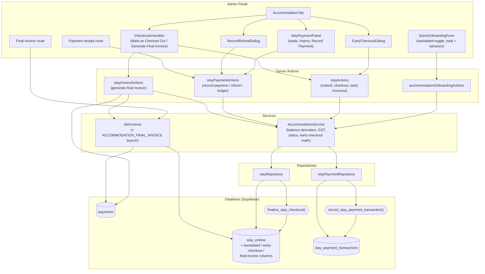
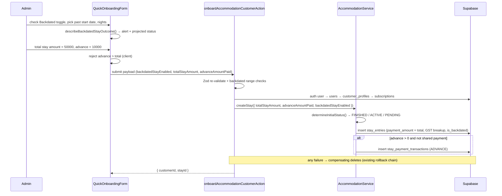
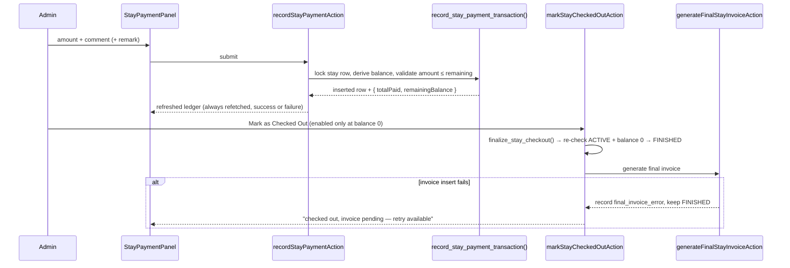
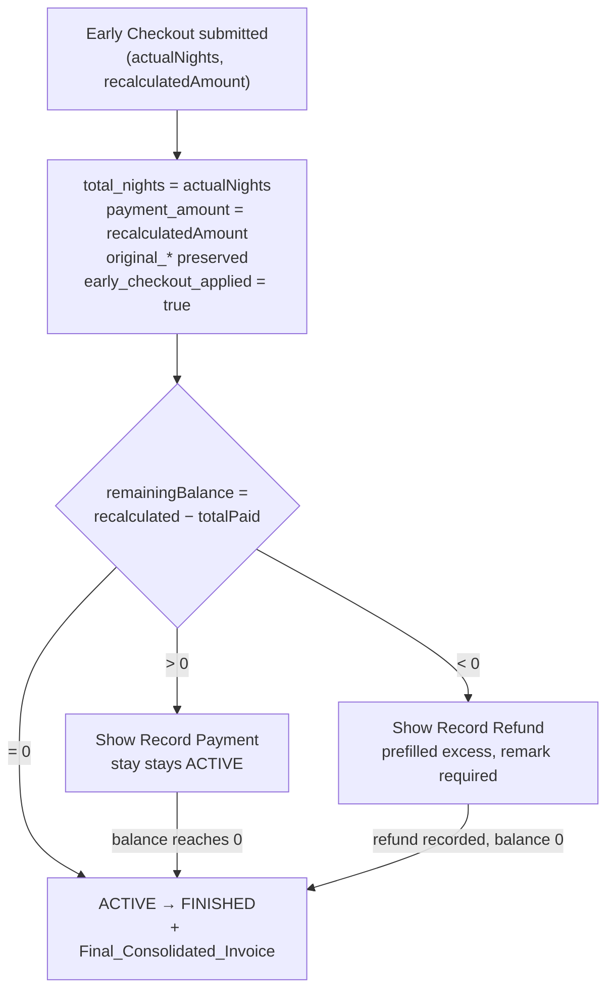

# Design Document: Accommodation Payment Lifecycle

## Overview

This design extends the existing ACCOMMODATION customer category (`accommodation-customer-flow`) with a full payment ledger, backdated onboarding, checkout gating, and consolidated invoicing. It is **additive**: `stay_entries`, `AccommodationService`, `stayRepository`, `stayActions`, `AccommodationTab`, and `QuickOnboardingForm` are extended in place rather than replaced.

The single structural change is the introduction of a **payment ledger** (`stay_payment_transactions`) as the source of truth for money movement on a stay. `Total_Paid` and `Remaining_Balance` are never stored — they are **derived** from the ledger, so no update path can leave them stale.

### Key Design Decisions

| # | Decision | Rationale |
|---|----------|-----------|
| 1 | **New `stay_payment_transactions` table** holding ADVANCE / PARTIAL_BALANCE_PAYMENT / REFUND rows | An append-only ledger makes `Total_Paid` and `Remaining_Balance` derived values (Req 6.3, 6.4) and gives per-transaction receipts an addressable identity (Req 10.1) |
| 2 | **`stay_entries.payment_amount` is repurposed as `Total_Stay_Amount`** (no new total column) | It already accumulates extension cost via `stayRepository.extendStay`, which is exactly the Total_Stay_Amount definition (onboarding total + extension costs). Adding a parallel column would create two truths |
| 3 | **Total_Paid / Remaining_Balance derived, never persisted** | Extensions, early checkout, refunds, and partial payments all move the balance. Deriving eliminates the whole class of "stored balance drift" bugs |
| 4 | **Money arithmetic in integer paise** inside the service layer | `NUMERIC(10,2)` in Postgres, but JS float sums (`0.1 + 0.2`) would break exact zero-balance gating. `toPaise`/`fromPaise` conversion makes "balance is exactly zero" a reliable predicate (Req 7.2) |
| 5 | **Balance-mutating writes go through Postgres RPCs that lock the stay row** (`record_stay_payment_transaction`, `finalize_stay_checkout`) | Two admins recording payments concurrently must not both pass the "amount ≤ remaining balance" check. `SELECT … FOR UPDATE` on `stay_entries` serialises ledger appends per stay |
| 6 | **Final_Consolidated_Invoice is a `payments` row** with `invoice_type = 'ACCOMMODATION_FINAL_INVOICE'`, uniquely constrained per stay | Reuses the existing `generateInvoiceData` + `InvoiceDocument` pipeline so accommodation invoices look and print exactly like Meal/KIT invoices (Req 8.4), and the partial unique index enforces "at most one per stay" at the DB level (Req 8.6) |
| 7 | **Accommodation stays no longer write a `payments` row at onboarding or at extension** | Those rows encoded the old single-upfront-payment assumption and would double-count revenue against the final invoice. Revenue is recognised once, at checkout. Per-transaction visibility comes from the ledger and its receipts |
| 8 | **Status transition is committed before invoice generation** | Req 8.7 requires FINISHED to survive an invoice failure. Coupling them in one transaction would violate that; instead the failure is recorded on the stay and a manual retrigger action is exposed |
| 9 | **Backdated stays get a third initial status branch (`FINISHED`)** inside `determineInitialStatus` | Creation-time assignment, not a transition, so the existing `VALID_TRANSITIONS` table stays untouched (Req 3.3) |
| 10 | **Backdated toggle mirrors the `pastDateEnabled` pattern** already shipped in `onboarding-past-date-flexibility` | Same 30-day window, same toggle-off-clears-date behaviour, same server-side re-validation — minus the Past Day Status popup, since accommodation has no per-day delivery capture |

### Terminology Mapping (spec term → implementation)

| Spec term | Implementation |
|-----------|----------------|
| Stay_Entry | `stay_entries` row |
| Total_Stay_Amount | `stay_entries.payment_amount` |
| Payment_Transaction | `stay_payment_transactions` row |
| Total_Paid / Remaining_Balance | derived by `AccommodationService.deriveStayBalance()` |
| Backdated_Stay | `stay_entries.is_backdated = true` |
| Early_Checkout | `stay_entries.early_checkout_applied = true` + `actual_nights_stayed` |
| Final_Consolidated_Invoice | `payments` row, `invoice_type = 'ACCOMMODATION_FINAL_INVOICE'` |
| Payment_Receipt | rendered view of a single `stay_payment_transactions` row |

---

## Architecture



### Flow 1 — Onboarding with total + advance



### Flow 2 — Record payment and checkout



### Flow 3 — Early checkout branching



### Layer Responsibilities

| Layer | Added responsibility |
|-------|---------------------|
| `QuickOnboardingForm` | Backdated toggle + range switching, completion alert, total/advance split fields |
| `AccommodationTab` children | Balance summary, payment history, Record Payment / Refund forms, checkout + early checkout actions, receipt links |
| Server Actions | Auth, Zod re-validation, status/eligibility gating, orchestration of ledger → status → invoice |
| `AccommodationService` | Balance derivation, GST from total, initial-status branching, early-checkout recalculation, action-visibility predicates |
| `stayPaymentRepository` | Ledger reads + RPC-backed appends |
| RPCs | Row-locked, atomic balance validation and status finalisation |
| `lib/invoices` | `ACCOMMODATION_FINAL_INVOICE` branch (consolidated, no per-transaction lines) |

---

## Components and Interfaces

### Server Actions

#### `src/actions/stayPaymentActions.ts` (new)

```typescript
export async function recordStayPaymentAction(
  stayId: string,
  input: RecordStayPaymentInput          // { amount, comment, remark? }
): Promise<ActionResult<StayBalanceSnapshot>>;

export async function recordStayRefundAction(
  stayId: string,
  input: RecordStayRefundInput           // { amount, remark, comment? }
): Promise<ActionResult<StayBalanceSnapshot>>;

/** Ledger + derived totals for the Accommodation tab. Always safe to re-call. */
export async function getStayPaymentLedgerAction(
  stayId: string
): Promise<ActionResult<StayLedgerView>>;

/** Single transaction, shaped for the Payment_Receipt document. */
export async function getStayPaymentReceiptAction(
  transactionId: string
): Promise<ActionResult<PaymentReceiptData>>;
```

`StayBalanceSnapshot` is returned by every mutation so the panel can render new totals without a second round trip. The panel *additionally* refetches the ledger in a `finally` block, which is what satisfies Req 5.9 (totals refresh whether or not the write succeeded).

#### `src/actions/stayActions.ts` (extended)

```typescript
/** Req 7 — gated on Remaining_Balance === 0 and status ACTIVE. */
export async function markStayCheckedOutAction(
  stayId: string
): Promise<ActionResult<{ status: "FINISHED"; invoiceStatus: "GENERATED" | "PENDING_RETRY" | "NOT_APPLICABLE" }>>;

/** Req 12 — recalculates nights + amount, returns the branch the UI must render. */
export async function earlyCheckoutStayAction(
  stayId: string,
  input: EarlyCheckoutInput              // { actualNightsStayed, recalculatedStayAmount }
): Promise<ActionResult<EarlyCheckoutOutcome>>;

// extendStayAction — refined: no Payment_Transaction, GST recomputed from the
// updated Total_Stay_Amount, returns the new balance alongside the end date.
export async function extendStayAction(
  stayId: string,
  input: ExtendStayInput
): Promise<ActionResult<{ newEndDate: string; balance: StayBalanceSnapshot }>>;
```

```typescript
export type EarlyCheckoutOutcome = {
  stayId: string;
  totalNights: number;              // = actualNightsStayed
  totalStayAmount: number;          // = recalculatedStayAmount
  balance: StayBalanceSnapshot;
  /** Which follow-up the Accommodation tab must present. */
  nextStep: "COLLECT_BALANCE" | "RECORD_REFUND" | "CHECKED_OUT";
  refundDue: number;                // 0 unless nextStep === "RECORD_REFUND"
  invoiceStatus?: "GENERATED" | "PENDING_RETRY";
};
```

#### `src/actions/stayInvoiceActions.ts` (new)

```typescript
/**
 * Req 8, 9.3 — generates the single Final_Consolidated_Invoice for a stay.
 * Idempotent: returns the existing invoice when one is already present.
 * Used by checkout, by the Backdated_Stay "Generate Final Invoice" action,
 * and as the manual retry path after a generation failure (Req 8.7).
 */
export async function generateFinalStayInvoiceAction(
  stayId: string
): Promise<ActionResult<{ paymentId: string; alreadyExisted: boolean }>>;
```

#### `src/actions/accommodationOnboardingActions.ts` (extended)

Additional validation before profile creation:

- `backdatedStayEnabled === false` **and** `startDate < todayIST` → reject (Req 3.4)
- `startDate < todayIST − 30 days` → reject (Req 3.5)
- `advanceAmountPaid > totalStayAmount` → reject (Req 4.4)
- Ranges re-checked server-side even when the field was hidden client-side (Req 4.2, 4.3)

`AccommodationService.createStay()` receives `totalStayAmount`, `advanceAmountPaid`, and `backdatedStayEnabled`, and creates the ADVANCE ledger row inside the same compensating-rollback chain the action already uses for the auth user / user / profile / subscription.

### Service Layer — `src/services/AccommodationService.ts` (extended)

```typescript
// ── Money (integer paise, exact) ───────────────────────────────────────────
export function toPaise(rupees: number): number;      // round(rupees * 100)
export function fromPaise(paise: number): number;     // paise / 100

// ── Balance derivation (Req 6.3, 6.4, 6.7) ─────────────────────────────────
export interface StayBalanceSnapshot {
  totalStayAmount: number;
  totalPaid: number;
  remainingBalance: number;   // may be negative before a refund is recorded
  isFullyPaid: boolean;       // remainingBalance === 0 (exact, in paise)
  refundDue: number;          // max(0, -remainingBalance)
}

export function deriveStayBalance(
  totalStayAmount: number | null,
  transactions: readonly StayPaymentTransaction[]
): StayBalanceSnapshot;

// ── Initial status, now with the backdated branch (Req 3.1, 3.2, 3.3) ──────
export function determineInitialStatus(
  startDate: string,
  totalNights: number,
  todayIST: string
): "PENDING" | "ACTIVE" | "FINISHED";

// ── Backdated onboarding helpers (Req 1.2, 1.3, 2.1, 2.3, 2.5) ─────────────
export function backdatedStayRange(todayIST: string): { min: string; max: string };  // [today-30, today-1]
export function forwardStayRange(todayIST: string): { min: string; max: string };    // [today, today+365]

export interface BackdatedStayOutcome {
  computedEndDate: string;
  projectedStatus: "PENDING" | "ACTIVE" | "FINISHED";
  showCompletionAlert: boolean;   // true iff projectedStatus === "FINISHED"
}
export function describeBackdatedStayOutcome(
  startDate: string,
  totalNights: number,
  todayIST: string
): BackdatedStayOutcome;

// ── Early checkout (Req 12) ────────────────────────────────────────────────
export function computeElapsedNights(startDate: string, todayIST: string): number;
export function isEarlyCheckoutEligible(stay: StayEntry, todayIST: string): boolean;
export function applyEarlyCheckoutMath(
  stay: StayEntry,
  actualNightsStayed: number,
  recalculatedStayAmount: number,
  transactions: readonly StayPaymentTransaction[]
): { balance: StayBalanceSnapshot; nextStep: EarlyCheckoutOutcome["nextStep"]; refundDue: number };

// ── Action visibility predicates (Req 5.1, 5.10, 7.1, 7.2, 9.1, 9.2, 9.4) ──
export interface StayActionVisibility {
  showRecordPayment: boolean;
  showFullyPaidMessage: boolean;
  showMarkCheckedOut: boolean;
  markCheckedOutEnabled: boolean;
  showGenerateFinalInvoice: boolean;
  showEarlyCheckout: boolean;
}
export function deriveStayActionVisibility(
  stay: StayEntry,
  balance: StayBalanceSnapshot,
  hasFinalInvoice: boolean,
  todayIST: string
): StayActionVisibility;

// ── Checkout + invoice orchestration ───────────────────────────────────────
export async function checkoutStay(stayId: string): Promise<CheckoutResult>;
export async function generateFinalInvoice(stayId: string): Promise<GenerateInvoiceResult>;
```

`extendStay` is refined: after `total_nights` and `payment_amount` are increased, the GST breakup is **recomputed from the new total** (`base = round(total / 1.18, 2)`) rather than accumulated per extension (Req 11.3), and no `payments` row or ledger row is written (Req 11.2).

### Repository — `src/repositories/stayPaymentRepository.ts` (new)

```typescript
export interface StayPaymentTransactionRow {
  id: string;
  stay_entry_id: string;
  customer_profile_id: string;
  transaction_type: "ADVANCE" | "PARTIAL_BALANCE_PAYMENT" | "REFUND";
  amount: number;
  transaction_date: string;   // YYYY-MM-DD (IST)
  comment: string | null;
  remark: string | null;
  created_by: string | null;
  created_at: string;
}

export async function listTransactionsByStay(stayId: string): Promise<StayPaymentTransactionRow[]>;   // chronological
export async function getTransactionById(id: string): Promise<StayPaymentTransactionRow | null>;

/** Calls record_stay_payment_transaction(); the RPC owns locking + validation. */
export async function recordTransaction(input: RecordTransactionInput): Promise<{
  transaction: StayPaymentTransactionRow;
  totalPaidPaise: number;
  remainingBalancePaise: number;
}>;

export async function insertAdvanceTransaction(input: AdvanceTransactionInput): Promise<StayPaymentTransactionRow>;
```

### Repository — `src/repositories/stayRepository.ts` (extended)

```typescript
export async function applyEarlyCheckout(
  stayId: string,
  actualNightsStayed: number,
  recalculatedStayAmount: number,
  gst: { baseAmount: number; taxAmount: number }
): Promise<StayEntryRow>;                       // preserves original_* audit fields

/** Calls finalize_stay_checkout(): locks the row, re-checks ACTIVE + zero balance. */
export async function finalizeCheckout(stayId: string): Promise<
  | { ok: true; stay: StayEntryRow }
  | { ok: false; reason: "NOT_FOUND" | "NOT_ACTIVE" | "BALANCE_OUTSTANDING"; remainingBalance: number }
>;

export async function attachFinalInvoice(stayId: string, paymentId: string): Promise<void>;
export async function recordFinalInvoiceFailure(stayId: string, message: string): Promise<void>;
export async function getStaysByCustomer(customerProfileId: string): Promise<StayEntryRow[]>;  // all statuses
```

`extendStay` is updated to recompute (not accumulate) `base_amount` / `tax_amount`, and to reject a non-ACTIVE stay defensively.

### UI Components (admin portal)

| Component | File | Purpose |
|-----------|------|---------|
| `StayPaymentPanel` | `src/shared/components/admin/customers/StayPaymentPanel.tsx` | Total_Stay_Amount / Total_Paid / Remaining_Balance cards, payment history list, Record Payment form, fully-paid message (Req 5, 6) |
| `RecordStayPaymentForm` | same folder | amount / comment / remark, client-side max = Remaining_Balance (Req 5.2–5.7) |
| `RecordStayRefundDialog` | same folder | refund amount prefilled with excess, required remark (Req 12.8–12.11) |
| `EarlyCheckoutDialog` | same folder | actual nights + recalculated amount, routes to the returned `nextStep` (Req 12.1–12.7) |
| `StayCheckoutActionBar` | same folder | Mark as Checked Out / Generate Final Invoice, mutually exclusive, disabled-with-reason (Req 7, 9) |
| `PaymentReceiptDocument` | `src/shared/components/shared/invoice/PaymentReceiptDocument.tsx` | Printable per-transaction receipt with ADVANCE / PARTIAL / REFUND label (Req 10.2) |

`AccommodationTab` changes: it currently only loads the active stay plus FINISHED/EXPIRED history. It now loads **all** stays for the customer with a selected-stay notion, because a Backdated_Stay is FINISHED at creation yet still needs the payment panel and the Generate Final Invoice action (Req 9.1, 9.2). Every mutation callback re-runs `getStayPaymentLedgerAction` so totals update without a page reload (Req 5.9, 6.6, 11.4).

### Routes

| Route | Purpose |
|-------|---------|
| `/admin/customers/[id]/billing/invoice/[paymentId]` | existing — now renders the Final_Consolidated_Invoice through the new `lib/invoices` branch |
| `/admin/customers/[id]/billing/stay-receipt/[transactionId]` | new — Payment_Receipt for one ledger row |

### `src/lib/invoices/index.ts` (extended)

A new branch before the MEAL/KIT/ADDON branching: when `payments.invoice_type === 'ACCOMMODATION_FINAL_INVOICE'`, the invoice is built from the linked `stay_entries` row with exactly one line item and **no per-transaction detail** (Req 8.5):

```typescript
lineItems = [{
  description: `Accommodation Stay — ${stay.stay_type} (${stay.occupancy_type})`,
  subtitle: `${nightsForInvoice} night(s): ${stay.start_date} to ${endDateForInvoice}`,
  amount: baseAmount,                     // GST-exclusive base of Total_Stay_Amount
}];
```

`nightsForInvoice` / `totalForInvoice` resolve to `actual_nights_stayed` and the recalculated `payment_amount` when `early_checkout_applied` is true, otherwise to `total_nights` and `payment_amount` (Req 8.3). Pricing uses the stay's stored 18% GST breakup, so the printed layout is identical to Meal/KIT invoices (Req 8.4).

---

## Data Models

### Migration — `scripts/create-stay-payment-lifecycle.sql`

```sql
-- ============================================================================
-- ACCOMMODATION PAYMENT LIFECYCLE — payment ledger, backdated stays,
-- early checkout, and final consolidated invoicing.
-- Additive + idempotent. Nothing existing is dropped.
-- ============================================================================

-- 1. PAYMENT LEDGER (Req 6.1, 6.2, 10.1) ------------------------------------
CREATE TABLE IF NOT EXISTS public.stay_payment_transactions (
  id UUID PRIMARY KEY DEFAULT gen_random_uuid(),
  stay_entry_id UUID NOT NULL REFERENCES public.stay_entries(id) ON DELETE CASCADE,
  customer_profile_id UUID NOT NULL REFERENCES public.customer_profiles(id),
  transaction_type TEXT NOT NULL
    CHECK (transaction_type IN ('ADVANCE', 'PARTIAL_BALANCE_PAYMENT', 'REFUND')),
  amount NUMERIC(10,2) NOT NULL CHECK (amount > 0),
  transaction_date DATE NOT NULL,
  comment VARCHAR(500),
  remark VARCHAR(500),
  created_by UUID REFERENCES public.users(id),
  created_at TIMESTAMPTZ NOT NULL DEFAULT now(),
  updated_at TIMESTAMPTZ NOT NULL DEFAULT now()
);

CREATE INDEX IF NOT EXISTS idx_stay_payment_tx_stay
  ON public.stay_payment_transactions(stay_entry_id, created_at);
CREATE INDEX IF NOT EXISTS idx_stay_payment_tx_customer
  ON public.stay_payment_transactions(customer_profile_id);

-- At most one ADVANCE per stay (the onboarding advance). Req 4.5, 6.1
CREATE UNIQUE INDEX IF NOT EXISTS uniq_stay_advance_transaction
  ON public.stay_payment_transactions(stay_entry_id)
  WHERE transaction_type = 'ADVANCE';

CREATE OR REPLACE FUNCTION public.update_stay_payment_transactions_updated_at()
RETURNS TRIGGER AS $$ BEGIN NEW.updated_at = now(); RETURN NEW; END; $$ LANGUAGE plpgsql;

DROP TRIGGER IF EXISTS trg_stay_payment_tx_updated_at ON public.stay_payment_transactions;
CREATE TRIGGER trg_stay_payment_tx_updated_at
  BEFORE UPDATE ON public.stay_payment_transactions
  FOR EACH ROW EXECUTE FUNCTION public.update_stay_payment_transactions_updated_at();

-- 2. STAY_ENTRIES EXTENSIONS ------------------------------------------------
-- NOTE: payment_amount now carries Total_Stay_Amount (onboarding total +
-- extension costs, replaced by the recalculated amount after Early_Checkout).
ALTER TABLE public.stay_entries
  ADD COLUMN IF NOT EXISTS is_backdated BOOLEAN NOT NULL DEFAULT false,          -- Req 3.1
  ADD COLUMN IF NOT EXISTS early_checkout_applied BOOLEAN NOT NULL DEFAULT false,-- Req 12.6
  ADD COLUMN IF NOT EXISTS actual_nights_stayed INTEGER,                          -- Req 12.6
  ADD COLUMN IF NOT EXISTS original_total_nights INTEGER,                         -- Req 12.15
  ADD COLUMN IF NOT EXISTS original_total_amount NUMERIC(10,2),                   -- Req 12.15
  ADD COLUMN IF NOT EXISTS checked_out_at TIMESTAMPTZ,                            -- Req 7.3
  ADD COLUMN IF NOT EXISTS final_invoice_payment_id UUID REFERENCES public.payments(id), -- Req 8.1
  ADD COLUMN IF NOT EXISTS final_invoice_generated_at TIMESTAMPTZ,
  ADD COLUMN IF NOT EXISTS final_invoice_error TEXT;                              -- Req 8.7

ALTER TABLE public.stay_entries
  ADD CONSTRAINT chk_stay_actual_nights
  CHECK (actual_nights_stayed IS NULL OR actual_nights_stayed >= 1);

-- 3. FINAL INVOICE LINKAGE ON PAYMENTS (Req 8.1, 8.6) ----------------------
ALTER TABLE public.payments
  ADD COLUMN IF NOT EXISTS stay_entry_id UUID REFERENCES public.stay_entries(id);

-- Hard guarantee: at most ONE Final_Consolidated_Invoice per Stay_Entry.
CREATE UNIQUE INDEX IF NOT EXISTS uniq_final_stay_invoice_per_stay
  ON public.payments(stay_entry_id)
  WHERE invoice_type = 'ACCOMMODATION_FINAL_INVOICE';

CREATE INDEX IF NOT EXISTS idx_payments_stay_entry
  ON public.payments(stay_entry_id);

-- 4. ROW-LOCKED LEDGER APPEND (Req 5.5, 5.6, 5.8, 12.9, 12.11) -------------
CREATE OR REPLACE FUNCTION public.record_stay_payment_transaction(
  p_stay_entry_id UUID,
  p_transaction_type TEXT,
  p_amount NUMERIC,
  p_transaction_date DATE,
  p_comment TEXT,
  p_remark TEXT,
  p_created_by UUID
) RETURNS JSONB
LANGUAGE plpgsql SECURITY DEFINER AS $$
DECLARE
  v_stay          public.stay_entries;
  v_total_paid    NUMERIC(12,2);
  v_remaining     NUMERIC(12,2);
  v_new_tx        public.stay_payment_transactions;
BEGIN
  SELECT * INTO v_stay FROM public.stay_entries
   WHERE id = p_stay_entry_id FOR UPDATE;
  IF NOT FOUND THEN
    RETURN jsonb_build_object('ok', false, 'reason', 'NOT_FOUND');
  END IF;
  IF v_stay.payment_host_profile_id IS NOT NULL THEN
    RETURN jsonb_build_object('ok', false, 'reason', 'SHARED_PAYMENT');
  END IF;

  SELECT COALESCE(SUM(CASE WHEN transaction_type = 'REFUND' THEN -amount ELSE amount END), 0)
    INTO v_total_paid
    FROM public.stay_payment_transactions
   WHERE stay_entry_id = p_stay_entry_id;

  v_remaining := COALESCE(v_stay.payment_amount, 0) - v_total_paid;

  IF p_amount <= 0 THEN
    RETURN jsonb_build_object('ok', false, 'reason', 'AMOUNT_NOT_POSITIVE');
  END IF;

  IF p_transaction_type = 'REFUND' THEN
    IF p_amount > (-v_remaining) THEN
      RETURN jsonb_build_object('ok', false, 'reason', 'REFUND_EXCEEDS_EXCESS',
                                'excess', GREATEST(-v_remaining, 0));
    END IF;
  ELSE
    IF p_amount > v_remaining THEN
      RETURN jsonb_build_object('ok', false, 'reason', 'AMOUNT_EXCEEDS_BALANCE',
                                'remaining_balance', v_remaining);
    END IF;
  END IF;

  INSERT INTO public.stay_payment_transactions (
    stay_entry_id, customer_profile_id, transaction_type, amount,
    transaction_date, comment, remark, created_by
  ) VALUES (
    p_stay_entry_id, v_stay.customer_profile_id, p_transaction_type, p_amount,
    p_transaction_date, p_comment, p_remark, p_created_by
  ) RETURNING * INTO v_new_tx;

  v_total_paid := v_total_paid +
    CASE WHEN p_transaction_type = 'REFUND' THEN -p_amount ELSE p_amount END;

  RETURN jsonb_build_object(
    'ok', true,
    'transaction', to_jsonb(v_new_tx),
    'total_paid', v_total_paid,
    'remaining_balance', COALESCE(v_stay.payment_amount, 0) - v_total_paid
  );
END; $$;

-- 5. ROW-LOCKED CHECKOUT GATE (Req 7.3, 7.4, 7.5) --------------------------
CREATE OR REPLACE FUNCTION public.finalize_stay_checkout(p_stay_entry_id UUID)
RETURNS JSONB
LANGUAGE plpgsql SECURITY DEFINER AS $$
DECLARE
  v_stay       public.stay_entries;
  v_total_paid NUMERIC(12,2);
  v_remaining  NUMERIC(12,2);
BEGIN
  SELECT * INTO v_stay FROM public.stay_entries
   WHERE id = p_stay_entry_id FOR UPDATE;
  IF NOT FOUND THEN
    RETURN jsonb_build_object('ok', false, 'reason', 'NOT_FOUND');
  END IF;
  IF v_stay.status <> 'ACTIVE' THEN
    RETURN jsonb_build_object('ok', false, 'reason', 'NOT_ACTIVE', 'status', v_stay.status);
  END IF;

  SELECT COALESCE(SUM(CASE WHEN transaction_type = 'REFUND' THEN -amount ELSE amount END), 0)
    INTO v_total_paid
    FROM public.stay_payment_transactions
   WHERE stay_entry_id = p_stay_entry_id;

  v_remaining := COALESCE(v_stay.payment_amount, 0) - v_total_paid;
  IF v_remaining <> 0 THEN
    RETURN jsonb_build_object('ok', false, 'reason', 'BALANCE_OUTSTANDING',
                              'remaining_balance', v_remaining);
  END IF;

  UPDATE public.stay_entries
     SET status = 'FINISHED', checked_out_at = now()
   WHERE id = p_stay_entry_id;

  RETURN jsonb_build_object('ok', true, 'remaining_balance', 0);
END; $$;

-- 6. REPORTING VIEW (read-only convenience; the service layer remains the
--    single source of truth for balance math used in gating decisions)
CREATE OR REPLACE VIEW public.stay_payment_balances AS
SELECT se.id AS stay_entry_id,
       se.customer_profile_id,
       COALESCE(se.payment_amount, 0) AS total_stay_amount,
       COALESCE(SUM(CASE WHEN t.transaction_type = 'REFUND' THEN -t.amount ELSE t.amount END), 0) AS total_paid,
       COALESCE(se.payment_amount, 0)
         - COALESCE(SUM(CASE WHEN t.transaction_type = 'REFUND' THEN -t.amount ELSE t.amount END), 0)
         AS remaining_balance
  FROM public.stay_entries se
  LEFT JOIN public.stay_payment_transactions t ON t.stay_entry_id = se.id
 GROUP BY se.id, se.customer_profile_id, se.payment_amount;
```

**RLS**: `stay_payment_transactions` follows the `stay_entries` precedent — all access is through Server Actions using the service-role admin client, with admin-group authorisation enforced in the action layer (`guardAdminGroup` / `getCurrentAdminContext`). The two RPCs are `SECURITY DEFINER` and are only ever invoked from those actions.

**Backfill**: existing `stay_entries` keep `is_backdated = false` and no ledger rows. Existing `payments` rows with `invoice_type IN ('ACCOMMODATION_STAY','ACCOMMODATION_EXTENSION')` are left untouched for historical accuracy; only stays created after this migration follow the ledger model (design decision 7).

### TypeScript Types — `src/types/accommodation.ts` (extended)

```typescript
export type PaymentTransactionType = "ADVANCE" | "PARTIAL_BALANCE_PAYMENT" | "REFUND";

export const PAYMENT_TRANSACTION_LABELS: Record<PaymentTransactionType, string> = {
  ADVANCE: "Advance",
  PARTIAL_BALANCE_PAYMENT: "Partial / Balance Payment",
  REFUND: "Refund",
};

export interface StayPaymentTransaction {
  id: string;
  stayEntryId: string;
  customerProfileId: string;
  transactionType: PaymentTransactionType;
  amount: number;
  transactionDate: string;     // YYYY-MM-DD (IST)
  comment: string | null;
  remark: string | null;
  createdBy: string | null;
  createdAt: string;
}

/** StayEntry gains the lifecycle fields; paymentAmount === Total_Stay_Amount. */
export interface StayEntry {
  // …existing fields…
  isBackdated: boolean;
  earlyCheckoutApplied: boolean;
  actualNightsStayed: number | null;
  originalTotalNights: number | null;
  originalTotalAmount: number | null;
  checkedOutAt: string | null;
  finalInvoicePaymentId: string | null;
  finalInvoiceGeneratedAt: string | null;
  finalInvoiceError: string | null;
}

export interface StayLedgerView {
  stay: StayEntry;
  transactions: StayPaymentTransaction[];   // chronological (Req 6.5)
  balance: StayBalanceSnapshot;
  hasFinalInvoice: boolean;
  visibility: StayActionVisibility;
}

export interface PaymentReceiptData {
  receiptNumber: string;                    // RCPT-<first uuid segment, uppercased>
  transaction: StayPaymentTransaction;
  typeLabel: string;                        // from PAYMENT_TRANSACTION_LABELS
  customerName: string;
  customerMobile: string;
  stayType: StayType;
  stayDates: { startDate: string; endDate: string };
}
```

### Zod Schemas — `src/validations/accommodationSchema.ts` (extended)

```typescript
// ── Onboarding: backdated toggle + total/advance split (Req 1, 3, 4) ───────
export const accommodationOnboardingSchema = z.object({
  // …existing identity / stay fields…
  backdatedStayEnabled: z.boolean().default(false),
  totalStayAmount: z.coerce.number().min(1).max(9999999).optional(),      // Req 4.2
  advanceAmountPaid: z.coerce.number().min(0).max(9999999).optional(),    // Req 4.3
  isSharedPayment: z.boolean().default(false),
  paymentHostMobile: z.string().regex(/^[6-9]\d{9}$/).optional(),
}).superRefine((data, ctx) => {
  const today = getISTDateString(0);

  if (data.isSharedPayment) {
    if (!data.paymentHostMobile) addIssue(ctx, "paymentHostMobile", "Payment host mobile number is required for shared payment.");
  } else {
    // Req 4.2 / 4.3 — enforced regardless of client-side field visibility
    if (data.totalStayAmount == null) addIssue(ctx, "totalStayAmount", "Total stay amount is required.");
    if (data.advanceAmountPaid == null) addIssue(ctx, "advanceAmountPaid", "Advance amount paid is required (enter 0 if none).");
    // Req 4.4
    if (data.totalStayAmount != null && data.advanceAmountPaid != null &&
        data.advanceAmountPaid > data.totalStayAmount) {
      addIssue(ctx, "advanceAmountPaid", "Advance amount cannot exceed the total stay amount.");
    }
  }

  if (data.startDate < today) {
    // Req 3.4
    if (!data.backdatedStayEnabled) addIssue(ctx, "startDate", "Backdated stay entry must be enabled to select a past start date.");
    // Req 3.5
    if (data.startDate < addDaysToISODate(today, -30)) addIssue(ctx, "startDate", "Start date exceeds the maximum 30-day backdated range.");
  } else if (data.backdatedStayEnabled) {
    // Req 1.3 — while the toggle is on, only past dates are selectable
    addIssue(ctx, "startDate", "With backdated stay enabled, the start date must be in the past.");
  } else if (data.startDate > addDaysToISODate(today, 365)) {
    // Req 1.2
    addIssue(ctx, "startDate", "Start date cannot be more than 365 days in the future.");
  }
});

// ── Record Payment (Req 5.2, 5.3, 5.4, 5.6, 5.7) ───────────────────────────
export const recordStayPaymentSchema = z.object({
  amount: z.coerce.number().gt(0, "Amount must be greater than zero.").max(9999999),
  comment: z.string().trim().min(1, "A comment is required.").max(500),
  remark: z.string().trim().max(500).optional(),
});

// ── Record Refund (Req 12.9, 12.10) ────────────────────────────────────────
export const recordStayRefundSchema = z.object({
  amount: z.coerce.number().gt(0, "Refund amount must be greater than zero.").max(9999999),
  remark: z.string().trim().min(1, "A remark describing how the refund was initiated is required.").max(500),
  comment: z.string().trim().max(500).optional(),
});

// ── Early Checkout (Req 12.3, 12.4, 12.5) ──────────────────────────────────
export const earlyCheckoutSchema = z.object({
  actualNightsStayed: z.coerce.number().int().min(1),
  recalculatedStayAmount: z.coerce.number().min(1).max(9999999),
});
/** bookedTotalNights is only known at call time, so the upper bound is applied
 *  by a factory used on both client and server. */
export const createEarlyCheckoutSchema = (bookedTotalNights: number) =>
  earlyCheckoutSchema.extend({
    actualNightsStayed: z.coerce.number().int().min(1).max(
      Math.max(1, bookedTotalNights - 1),
      `Actual nights stayed must be less than the currently booked ${bookedTotalNights} nights.`
    ),
  });

// extendStaySchema unchanged in shape; its paymentAmount is now interpreted as
// the additional cost added to Total_Stay_Amount (Req 11.1), not a payment.
```

### Core Derivation Logic

```typescript
// Balance derivation — exact, paise-based (Req 6.3, 6.4, 6.7)
export function deriveStayBalance(
  totalStayAmount: number | null,
  transactions: readonly StayPaymentTransaction[]
): StayBalanceSnapshot {
  const totalPaise = toPaise(totalStayAmount ?? 0);
  const paidPaise = transactions.reduce((acc, t) => {
    const p = toPaise(t.amount);
    return t.transactionType === "REFUND" ? acc - p : acc + p;
  }, 0);
  const remainingPaise = totalPaise - paidPaise;
  return {
    totalStayAmount: fromPaise(totalPaise),
    totalPaid: fromPaise(paidPaise),
    remainingBalance: fromPaise(remainingPaise),
    isFullyPaid: remainingPaise === 0,
    refundDue: fromPaise(Math.max(0, -remainingPaise)),
  };
}

// Initial status — adds the backdated FINISHED branch (Req 3.1, 3.2, 3.3)
export function determineInitialStatus(
  startDate: string, totalNights: number, todayIST: string
): "PENDING" | "ACTIVE" | "FINISHED" {
  if (startDate > todayIST) return "PENDING";
  if (computeEndDate(startDate, totalNights) < todayIST) return "FINISHED";
  return "ACTIVE";
}

// Backdated alert (Req 2.1, 2.3, 2.5)
export function describeBackdatedStayOutcome(
  startDate: string, totalNights: number, todayIST: string
): BackdatedStayOutcome {
  const computedEndDate = computeEndDate(startDate, totalNights);
  const projectedStatus = determineInitialStatus(startDate, totalNights, todayIST);
  return { computedEndDate, projectedStatus, showCompletionAlert: projectedStatus === "FINISHED" };
}

// Action visibility (Req 5.1, 5.10, 7.1, 7.2, 9.1, 9.2, 9.4, 12.1)
export function deriveStayActionVisibility(
  stay: StayEntry, balance: StayBalanceSnapshot, hasFinalInvoice: boolean, todayIST: string
): StayActionVisibility {
  const billable = stay.paymentHostProfileId === null && (stay.paymentAmount ?? 0) > 0;
  const outstanding = !balance.isFullyPaid && balance.remainingBalance > 0;
  const payableStatus = stay.status === "ACTIVE" || stay.status === "FINISHED";

  const showMarkCheckedOut = stay.status === "ACTIVE" && !stay.isBackdated;
  const showGenerateFinalInvoice =
    stay.isBackdated && balance.isFullyPaid && !hasFinalInvoice && billable;

  return {
    showRecordPayment: billable && payableStatus && outstanding,
    showFullyPaidMessage: billable && balance.isFullyPaid,
    showMarkCheckedOut,
    markCheckedOutEnabled: showMarkCheckedOut && (!billable || balance.isFullyPaid),
    showGenerateFinalInvoice,
    showEarlyCheckout: stay.status === "ACTIVE" && !stay.earlyCheckoutApplied &&
      computeElapsedNights(stay.startDate, todayIST) < stay.totalNights,
  };
}
```

**Mutual exclusivity (Req 9.4)**: `showMarkCheckedOut` requires `status === "ACTIVE"`, while `showGenerateFinalInvoice` requires `isBackdated` (which implies `FINISHED` at creation). The two predicates are therefore disjoint by construction, and neither is shown for a FINISHED non-backdated stay.

---

## Correctness Properties

*A property is a characteristic or behavior that should hold true across all valid executions of a system — essentially, a formal statement about what the system should do. Properties serve as the bridge between human-readable specifications and machine-verifiable correctness guarantees.*

PBT applies well to this feature: balance derivation, GST arithmetic, status assignment, schema validation, action visibility, and the early-checkout decision are all pure functions over large input spaces, and the ledger operations are testable against a mocked repository. Rendering, wiring, and layout parity are covered by example and snapshot tests instead (see Testing Strategy).

### Property 1: Balance derivation from the ledger

*For any* Total_Stay_Amount and *any* list of Payment_Transaction records, `deriveStayBalance` SHALL produce `totalPaid` equal to the sum of ADVANCE and PARTIAL_BALANCE_PAYMENT amounts minus the sum of REFUND amounts, `remainingBalance` equal to `totalStayAmount − totalPaid` (which may be negative), `isFullyPaid` true exactly when `remainingBalance` is zero to the paise, and `refundDue` equal to `max(0, −remainingBalance)`. The result SHALL be independent of the order of the transactions, and an empty transaction list SHALL yield `totalPaid = 0` and `remainingBalance = totalStayAmount`.

**Validates: Requirements 6.3, 6.4, 6.7**

### Property 2: Start date range gating and toggle reset

*For any* current IST date and *any* candidate start date, the accommodation start date SHALL be accepted when the Backdated_Stay_Toggle is off exactly when the candidate lies in `[today, today + 365]`, and when the toggle is on exactly when the candidate lies in `[today − 30, today − 1]`. *For any* previously selected Past_Stay_Start, turning the toggle off SHALL clear the selected start date and restore the forward range.

**Validates: Requirements 1.2, 1.3, 1.4**

### Property 3: Initial status assignment and completion alert

*For any* start date, total nights, and current IST date, `determineInitialStatus` SHALL return PENDING when the start date is after today, FINISHED when the start date is on or before today and `computeEndDate(startDate, totalNights)` is before today, and ACTIVE otherwise; a Stay_Entry created with FINISHED SHALL be flagged as a Backdated_Stay. `describeBackdatedStayOutcome` SHALL report `showCompletionAlert` true exactly when the projected status is FINISHED.

**Validates: Requirements 2.1, 2.3, 2.5, 3.1, 3.2, 3.3**

### Property 4: Server rejection of invalid backdated payloads

*For any* accommodation onboarding payload, the server SHALL reject it when the start date is before the current IST date and the Backdated_Stay_Toggle flag is false (indicating backdated entry must be enabled), and SHALL reject it when the start date is earlier than 30 calendar days before the current IST date regardless of the toggle value, and SHALL NOT create a Stay_Entry, customer profile, or Payment_Transaction in either case.

**Validates: Requirements 3.4, 3.5**

### Property 5: Onboarding payment field validation

*For any* pair of total stay amount and advance amount paid submitted with shared payment disabled, the onboarding schema SHALL accept the pair exactly when the total is in `[1, 9,999,999]` and the advance is in `[0, total]`, and SHALL otherwise reject it with a field-level error on the offending field, independently of whether the field was visible in the form.

**Validates: Requirements 4.2, 4.3, 4.4**

### Property 6: Onboarding creates the advance transaction exactly when due

*For any* accommodation onboarding input, creating the Stay_Entry SHALL set Total_Stay_Amount to the entered total stay amount and create exactly one ADVANCE Payment_Transaction — with the entered advance amount and the current IST date — if and only if shared payment is disabled and the advance amount is greater than zero. When the advance is zero, no Payment_Transaction SHALL exist. When shared payment is enabled, neither a Total_Stay_Amount nor any Payment_Transaction SHALL be created.

**Validates: Requirements 4.5, 4.6, 4.7, 6.1**

### Property 7: GST breakup from Total_Stay_Amount

*For any* Total_Stay_Amount in `[1, 9,999,999]`, the GST_Breakup SHALL satisfy `baseAmount = round(total / 1.18, 2)`, `taxAmount = round(total − baseAmount, 2)`, `taxPercentage = 18`, and `baseAmount + taxAmount = total` within ±0.01, using the Stay_Entry's current Total_Stay_Amount as the input — including after a Stay_Extension or an Early_Checkout replaces that total.

**Validates: Requirements 4.8, 11.3, 8.3**

### Property 8: Record Payment validation and ledger append

*For any* Stay_Entry with a Remaining_Balance and *any* Record Payment submission, the submission SHALL be accepted exactly when the amount is greater than zero and not greater than the current Remaining_Balance, the trimmed comment length is in `[1, 500]`, and the remark is absent or has trimmed length at most 500. An accepted submission SHALL append exactly one PARTIAL_BALANCE_PAYMENT Payment_Transaction preserving the amount, comment, and remark verbatim with the current IST date; a rejected submission SHALL leave the ledger unchanged and return an error identifying the offending field, and this SHALL hold at the server action level regardless of client-side state.

**Validates: Requirements 5.2, 5.3, 5.4, 5.5, 5.6, 5.7, 5.8, 6.2**

### Property 9: Payment history ordering and completeness

*For any* list of Payment_Transaction records for a Stay_Entry, the rendered payment history SHALL present them in non-decreasing order of (transaction date, creation timestamp), and each rendered entry SHALL contain that transaction's date, amount, Payment_Transaction_Type label, comment, and remark.

**Validates: Requirements 6.5, 6.2**

### Property 10: Stay action visibility and mutual exclusivity

*For any* Stay_Entry, derived balance, and final-invoice presence flag, `deriveStayActionVisibility` SHALL report: `showRecordPayment` true exactly when the stay is billable, its status is ACTIVE or FINISHED, and Remaining_Balance is greater than zero; `showFullyPaidMessage` true exactly when the stay is billable and Remaining_Balance is zero; `showMarkCheckedOut` true exactly when the status is ACTIVE and the stay is not a Backdated_Stay, with `markCheckedOutEnabled` true only when Remaining_Balance is exactly zero; `showGenerateFinalInvoice` true exactly when the stay is a billable Backdated_Stay with Remaining_Balance zero and no existing Final_Consolidated_Invoice; and `showEarlyCheckout` true exactly when the status is ACTIVE, no Early_Checkout has been applied, and elapsed nights are fewer than the booked total nights. `showMarkCheckedOut` and `showGenerateFinalInvoice` SHALL never both be true.

**Validates: Requirements 5.1, 5.10, 7.1, 7.2, 9.1, 9.2, 9.4, 12.1**

### Property 11: Checkout gate

*For any* Stay_Entry and *any* ledger, invoking Mark as Checked Out SHALL transition the stay from ACTIVE to FINISHED if and only if its status is ACTIVE and its Remaining_Balance is exactly zero; in every other case the server SHALL return an error — naming the outstanding balance when the balance is non-zero and stating that checkout applies only to active stays when the status is not ACTIVE — and SHALL leave the stay's status and ledger unchanged.

**Validates: Requirements 7.3, 7.4, 7.5**

### Property 12: Final invoice idempotence

*For any* Stay_Entry with Total_Stay_Amount greater than zero, invoking final invoice generation any number of times — through checkout, through the Backdated_Stay "Generate Final Invoice" action, or through the manual retry path — SHALL result in exactly one Final_Consolidated_Invoice for that Stay_Entry, and every invocation SHALL return the same invoice identifier.

**Validates: Requirements 8.1, 8.6, 9.3**

### Property 13: Final invoice figures reflect early checkout

*For any* Stay_Entry, the Final_Consolidated_Invoice SHALL display the Recalculated_Stay_Amount and Actual_Nights_Stayed when an Early_Checkout has been applied, and the Total_Stay_Amount and booked total nights otherwise, with the displayed GST_Breakup computed from whichever amount was selected.

**Validates: Requirements 8.3**

### Property 14: Final invoice excludes per-transaction detail

*For any* Stay_Entry and *any* ledger of Payment_Transaction records, the generated Final_Consolidated_Invoice SHALL contain exactly one line item and SHALL NOT contain any individual Payment_Transaction's amount, date, comment, or remark.

**Validates: Requirements 8.5**

### Property 15: Invoice failure preserves checkout and permits retry

*For any* fully-paid ACTIVE Stay_Entry whose Final_Consolidated_Invoice generation fails, the stay SHALL remain in Stay_Status FINISHED, the failure SHALL be recorded against the stay, no invoice SHALL exist, and a subsequent manual generation attempt SHALL succeed in producing exactly one Final_Consolidated_Invoice.

**Validates: Requirements 8.7**

### Property 16: Payment receipts are total and correctly labeled

*For any* Payment_Transaction, exactly one Payment_Receipt SHALL be derivable from it, containing that transaction's amount, date, comment, and remark, and labeled "Advance", "Partial / Balance Payment", or "Refund" according to its Payment_Transaction_Type.

**Validates: Requirements 10.1, 10.2**

### Property 17: Invoice generation preserves the ledger

*For any* Stay_Entry and *any* ledger of Payment_Transaction records, generating the Final_Consolidated_Invoice SHALL leave the ledger deeply unchanged — same record count, same field values, none deleted, modified, or hidden — and every Payment_Receipt SHALL remain retrievable afterwards.

**Validates: Requirements 10.4, 10.5**

### Property 18: Stay extension folds into the running balance

*For any* ACTIVE Stay_Entry and *any* additional nights in `[1, 365]` with an additional cost amount, applying a Stay_Extension SHALL increase total nights by the additional nights, increase Total_Stay_Amount by the additional cost, recompute the GST_Breakup from the updated Total_Stay_Amount, recompute Remaining_Balance as the updated Total_Stay_Amount minus the unchanged Total_Paid, and create no Payment_Transaction.

**Validates: Requirements 11.1, 11.2, 11.3**

### Property 19: Extension and early checkout require an ACTIVE stay

*For any* Stay_Entry whose Stay_Status is not ACTIVE — including one already finished via Early_Checkout — both Stay_Extension and Early_Checkout SHALL be rejected with a status-based error, and the stay's nights, Total_Stay_Amount, status, and ledger SHALL remain unchanged.

**Validates: Requirements 11.5, 12.14**

### Property 20: Early checkout input validation

*For any* booked total nights and *any* Early_Checkout submission, the submission SHALL be accepted exactly when Actual_Nights_Stayed is an integer in `[1, bookedTotalNights − 1]` and Recalculated_Stay_Amount is in `[1, 9,999,999]`; otherwise it SHALL be rejected with an error stating the value must be less than the currently booked total nights, and the Stay_Entry SHALL remain unchanged.

**Validates: Requirements 12.3, 12.4, 12.5**

### Property 21: Early checkout recalculation and branch selection

*For any* ACTIVE Stay_Entry with a Total_Paid and *any* valid Early_Checkout submission, applying the Early_Checkout SHALL set total nights to Actual_Nights_Stayed, replace Total_Stay_Amount with Recalculated_Stay_Amount, and retain the original booked total nights and original Total_Stay_Amount unchanged as audit values; and it SHALL select exactly one follow-up: collect the balance while remaining ACTIVE when Recalculated_Stay_Amount is greater than Total_Paid, record a refund of exactly `Total_Paid − Recalculated_Stay_Amount` when Total_Paid is greater, or transition to FINISHED with a Final_Consolidated_Invoice when the two are equal.

**Validates: Requirements 12.6, 12.7, 12.8, 12.12, 12.15**

### Property 22: Refund validation and ledger effect

*For any* excess amount (Total_Paid minus Recalculated_Stay_Amount) and *any* Record Refund submission, the submission SHALL be accepted exactly when the refund amount is greater than zero and not greater than the current excess and the trimmed remark length is in `[1, 500]`; an accepted submission SHALL append exactly one REFUND Payment_Transaction with the entered amount, remark, optional comment, and the current IST date, reducing Total_Paid by exactly that amount; a rejected submission SHALL leave the ledger unchanged.

**Validates: Requirements 12.9, 12.10, 12.11**

### Property 23: Ledger consistency across operation sequences

*For any* sequence of accepted operations on a Stay_Entry — the onboarding advance, partial/balance payments, stay extensions, an early checkout, and a refund — the ledger SHALL contain exactly one Payment_Transaction per money-movement event (extensions contributing none), `Remaining_Balance` SHALL equal `Total_Stay_Amount − Total_Paid` after every step, no accepted payment SHALL ever drive Remaining_Balance below zero, and a Stay_Entry SHALL reach FINISHED with exactly one Final_Consolidated_Invoice only once Remaining_Balance is exactly zero.

**Validates: Requirements 6.1, 11.6, 12.13**

---

## Error Handling

### Onboarding (Backdated + Payment Split)

| Scenario | Handling |
|----------|----------|
| Past start date with the backdated toggle off | `fieldErrors.startDate`: "Backdated stay entry must be enabled to select a past start date." (Req 3.4) |
| Start date earlier than today − 30 days | `fieldErrors.startDate`: "Start date exceeds the maximum 30-day backdated range." (Req 3.5) |
| Advance greater than total | `fieldErrors.advanceAmountPaid`: "Advance amount cannot exceed the total stay amount." Client blocks submit; server re-checks (Req 4.4) |
| Total or advance out of range | Field-level range error; enforced server-side even when the input was hidden (Req 4.2, 4.3) |
| ADVANCE ledger insert fails after the stay row is created | Existing compensating chain extends one step: delete stay → subscription → profile → user → auth identity; action returns "Onboarding could not be completed." (Req 3.5 of the parent spec) |
| Backdated end date already passed | Not an error — informational alert, submission allowed (Req 2.4) |

### Payment Ledger

| Scenario | Handling |
|----------|----------|
| Amount exceeds Remaining_Balance (including a concurrent race) | RPC returns `AMOUNT_EXCEEDS_BALANCE` with the authoritative remaining balance; action returns `fieldErrors.amount` naming that balance; ledger untouched (Req 5.5) |
| Amount ≤ 0 | Schema rejection before any DB call; RPC re-checks as a defence in depth (Req 5.6) |
| Missing comment | `fieldErrors.comment`: "A comment is required." (Req 5.7) |
| Refund exceeds the excess | RPC returns `REFUND_EXCEEDS_EXCESS` with the current excess (Req 12.9) |
| Missing refund remark | `fieldErrors.remark`: "A remark describing how the refund was initiated is required." (Req 12.10) |
| Shared-payment stay targeted | RPC returns `SHARED_PAYMENT`; action returns "Payment tracking is disabled for shared-payment stays." (Req 4.7) |
| Any ledger write failure | Panel still refetches the ledger and re-renders totals, then surfaces an error toast (Req 5.9) |

### Checkout, Early Checkout, and Extension

| Scenario | Handling |
|----------|----------|
| Checkout with outstanding balance | `finalize_stay_checkout` returns `BALANCE_OUTSTANDING`; action returns "The full balance must be paid before checkout. Outstanding: ₹X." Status unchanged (Req 7.4) |
| Checkout on a non-ACTIVE stay | `NOT_ACTIVE` → "Checkout applies only to active stays." (Req 7.5) |
| Early checkout nights ≥ booked nights | `fieldErrors.actualNightsStayed`: "Actual nights stayed must be less than the currently booked N nights." (Req 12.5) |
| Early checkout or extension on a non-ACTIVE stay | "Only active stays can be extended." / "Only active stays can be checked out early." No mutation (Req 11.5, 12.14) |
| Second early checkout on an already early-checked-out stay | Rejected by the same status/flag gate (Req 12.14) |

### Final Invoice

| Scenario | Handling |
|----------|----------|
| Invoice insert fails after FINISHED | Status stays FINISHED; `final_invoice_error` and a `console.error` log record the failure; the tab shows "Invoice generation failed — retry" wired to `generateFinalStayInvoiceAction` (Req 8.7) |
| Invoice already exists | Action returns `{ paymentId, alreadyExisted: true }` — no second row; the DB partial unique index is the backstop (Req 8.6) |
| Total_Stay_Amount is zero or the stay is shared-payment | Checkout succeeds, invoice generation is skipped and reported as `NOT_APPLICABLE` (Req 8.2) |

### General Patterns (unchanged from the parent spec)

- Server Actions return `{ success: true; data: T } | { error: string; fieldErrors?: Record<string, string> }`
- Zod validation always re-runs server-side; client validation is UX only
- RPC failure reasons are mapped to user-facing messages; raw SQL errors are never surfaced
- Admin-group authorisation is checked in every new action before any DB access

---

## Testing Strategy

### Property-Based Tests

**Library**: [fast-check](https://github.com/dubzzz/fast-check) with Vitest, matching the parent spec and the existing `*.property.test.ts` files in this repo.

**Configuration**: minimum 100 iterations per property (`fc.assert(..., { numRuns: 100 })`).

**Tag format**: `Feature: accommodation-payment-lifecycle, Property {number}: {title}`

Each property maps to exactly one property-based test:

| Property | Under test | Generator strategy |
|----------|-----------|-------------------|
| 1 | `deriveStayBalance` | Random totals in [0, 9999999] × ledgers of 0–20 mixed-type transactions, including empty ledgers, refund-heavy ledgers, and amounts with paise |
| 2 | `backdatedStayRange` / `forwardStayRange` + toggle reducer | Random IST "today" strings × candidate dates spanning ±400 days |
| 3 | `determineInitialStatus`, `describeBackdatedStayOutcome` | Random start dates in [today−60, today+400] × nights in [1, 365] |
| 4 | `accommodationOnboardingSchema` + onboarding action | Random past/edge start dates × toggle booleans |
| 5 | `accommodationOnboardingSchema` | Random (total, advance) pairs in and out of range, including total < advance and boundary values 0/1/9999999/10000000 |
| 6 | `AccommodationService.createStay` with mocked repositories | Random (total, advance, sharedPayment) triples |
| 7 | `calculateGstBreakup` driven from stay totals | Random totals in [1, 9999999] including values with awkward rounding |
| 8 | `recordStayPaymentAction` with mocked repository | Random (remaining, amount, comment, remark) tuples including whitespace-only comments and 500/501-char strings |
| 9 | Payment history render/format function | Random ledgers with shuffled dates and timestamps |
| 10 | `deriveStayActionVisibility` | Cartesian-ish sampling of status × isBackdated × balance sign × hasFinalInvoice × elapsed nights |
| 11 | `checkoutStay` with mocked repository | Random (status, balance) pairs including balances of ±0.01 |
| 12 | `generateFinalInvoice` invoked 1–5 times | Random stays; repeated invocation counts |
| 13 | Accommodation branch of `generateInvoiceData` | Random stays with/without `early_checkout_applied` |
| 14 | Accommodation branch of `generateInvoiceData` | Random stays × random ledgers; assert no ledger value appears in the output |
| 15 | `checkoutStay` with an injected invoice failure | Random fully-paid ACTIVE stays × failure injection |
| 16 | Receipt builder + `PaymentReceiptDocument` | Random transactions across all three types |
| 17 | `generateFinalInvoice` | Random ledgers; deep-equality snapshot before/after |
| 18 | `AccommodationService.extendStay` with mocked repository | Random active stays × additionalNights [1, 365] × cost amounts |
| 19 | `extendStay`, `earlyCheckout` | Random non-ACTIVE statuses × valid inputs |
| 20 | `createEarlyCheckoutSchema` | Random (bookedNights, candidateNights incl. fractions) × amounts |
| 21 | `applyEarlyCheckoutMath` + `earlyCheckoutStayAction` | Random (recalculated, totalPaid) pairs spanning all three orderings |
| 22 | `recordStayRefundAction` | Random (excess, amount, remark) tuples |
| 23 | Stateful model test over the ledger | `fc.commands` sequences: advance → payments → extensions → early checkout → refund, checked against a simple in-memory model of Total_Stay_Amount and Total_Paid |

### Unit Tests (Example-Based)

Deliberately kept small — the properties above cover input coverage:

- **Render conditions**: backdated toggle present for ACCOMMODATION and absent for MEAL/KIT (Req 1.1, 1.5); total/advance fields replace the single amount field (Req 4.1); Early Checkout dialog shows both inputs (Req 12.2); receipt links present per history row (Req 10.3)
- **Non-blocking behaviours**: nights editable and submission allowed while the completion alert is shown (Req 2.2, 2.4); alert updates on change rather than on blur (Req 2.3)
- **Refresh wiring**: ledger refetched after a successful *and* a failed payment, and after an extension, with no navigation (Req 5.9, 6.6, 11.4)
- **Zero-amount and shared-payment checkout**: FINISHED with no invoice (Req 8.2)
- **Transition table regression**: `VALID_TRANSITIONS` unchanged (Req 3.3)

### Snapshot Test

- `InvoiceDocument` rendered with accommodation final-invoice data, compared against the Meal invoice structure to confirm layout and formatting parity (Req 8.4)

### Integration Tests

- `record_stay_payment_transaction` RPC: two concurrent calls that would each individually fit the balance — exactly one succeeds
- `finalize_stay_checkout` RPC: rejects an outstanding balance and a non-ACTIVE status under real DB constraints
- `uniq_final_stay_invoice_per_stay` partial unique index rejects a second final invoice row
- Parity check: the SQL balance formula (RPC and `stay_payment_balances` view) matches `deriveStayBalance` for a seeded set of ledgers
- Full onboarding with a backdated start date and a partial advance: stay is FINISHED, ledger holds one ADVANCE row, Record Payment is available
- End-to-end early checkout with a refund: refund recorded, stay FINISHED, one invoice showing the recalculated figures

### Test File Locations

```
src/services/__tests__/AccommodationService.payment.property.test.ts
src/services/__tests__/AccommodationService.payment.test.ts
src/services/__tests__/stayPaymentLedger.stateful.property.test.ts
src/validations/__tests__/accommodationPaymentSchema.property.test.ts
src/actions/__tests__/stayPaymentActions.property.test.ts
src/actions/__tests__/stayCheckoutActions.property.test.ts
src/lib/invoices/__tests__/accommodationFinalInvoice.property.test.ts
src/shared/components/admin/customers/__tests__/StayPaymentPanel.test.tsx
src/shared/components/admin/customers/__tests__/EarlyCheckoutDialog.test.tsx
src/shared/components/shared/invoice/__tests__/PaymentReceiptDocument.test.tsx
```
