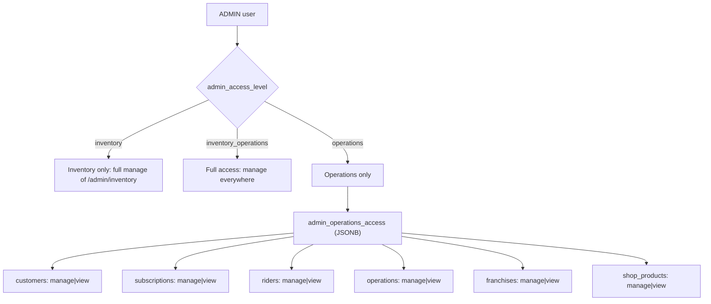
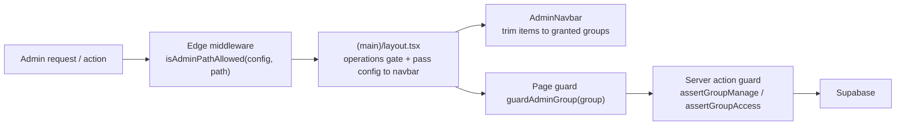

# Design Document

## Overview

This feature upgrades the admin access model from three flat levels (`inventory`, `operations`, `inventory_operations`) into a configurable, per-group model layered on top of the same three top-level levels. The two "full" levels keep their current behavior; the `operations` level becomes a container for a per-group configuration where a Master_Admin selects which of six operations groups an admin can reach and, per group, whether the admin has **Manage** (read + write) or **View** (read-only) access.

The design extends the existing access primitives rather than replacing them:

- The pure, edge-safe module `src/lib/auth/adminAccessCore.ts` already centralizes levels, area classification, path gating, and landing-route resolution. This is where the new group model, group→route mapping, and permission resolution live, keeping everything importable by the edge middleware, server components, server actions, and unit tests alike.
- The server-only resolver/guards in `src/lib/auth/adminAccess.ts`, the edge `src/middleware.ts`, the admin `layout.tsx`, the `AdminNavbar.tsx`, and the master `adminActions.ts` + `UserManagement.tsx` are each extended to read and honor the richer configuration.

The implementation follows established conventions: pure logic in `adminAccessCore.ts` with property tests (mirroring `src/lib/auth/__tests__/adminAccess.test.ts`), enforcement at the edge + layout + page + action layers (defense in depth), and an additive SQL migration in `/scripts` respecting Supabase RLS.

### Goals

- Keep three top-level levels; preserve `inventory` and `inventory_operations` behavior exactly.
- Add a per-group configuration for `operations` admins covering six groups, each `manage` or `view`.
- Enforce the configuration at the route layer (edge middleware + page guards) and the write layer (server actions), with navigation trimming as a usability aid.
- Persist the configuration additively and validate it on the server.
- Migrate all existing admins to full access (`inventory_operations`) so none lose access, leaving customization to the Master_Admin afterward.

### Non-Goals (Out of Scope)

- Per-admin KPI customization on the Dashboard (Dashboard remains the shared operations landing).
- New roles beyond `ADMIN` / `MASTER_ADMIN`.
- Changes to the inventory/warehouse pages' own behavior.
- Reworking individual operations pages beyond hiding/disabling write controls for `view` groups.
- Wiring access-control enforcement into the franchise portal (`FRANCHISE_ADMIN`). The permission primitives are built role-neutral for later reuse, but no franchise-portal enforcement is added and `FRANCHISE_FEATURES_ENABLED` stays off (Req 13).

### Role-neutral design note

The business model applies the identical access model (three levels, six operations groups, manage/view) to both Core Admins (`ADMIN`) and Franchise Admins (`FRANCHISE_ADMIN`). To avoid a future rewrite, the permission primitives in `adminAccessCore.ts` — the level/group/permission enums, `resolveAccessConfiguration`, `classifyOperationsGroup`, `hasGroupAccess`, `canManageGroup`, and `isAdminPathAllowed` — operate purely on an `AccessConfiguration` and a path, with **no assumption about the caller's role**. Role checks live only at the wiring layer (middleware, layout, guards), which in this spec is bound to the core admin portal (`ADMIN`). Reusing the same primitives for `FRANCHISE_ADMIN` later is a wiring exercise, not a model change (Req 13.1, 13.4).

## Architecture

### Access model



### Enforcement layers (defense in depth)



The route layers (middleware, layout, page) gate **reachability**; the action layer gates **mutations** so a `view` admin cannot change data even by calling an action directly. Navigation trimming is cosmetic only.

### Group → route mapping

| Operations_Group | Route prefix          | Nav label      |
|------------------|-----------------------|----------------|
| `customers`      | `/admin/customers`    | Customers      |
| `subscriptions`  | `/admin/subscriptions`| Subscriptions  |
| `riders`         | `/admin/riders`       | Riders         |
| `operations`     | `/admin/operations`   | Operations     |
| `franchises`     | `/admin/franchises`   | Franchises     |
| `shop_products`  | `/admin/kitchen-shop` | Shop Products  |

`/admin/dashboard` and `/admin/profile` are **operations-neutral**: reachable by any admin who passes the operations gate (i.e. `inventory_operations` or any `operations` admin). `/admin/inventory` is the **inventory area**, reachable only by `inventory` and `inventory_operations`.

## Data Models

### Database schema (additive)

The existing `users.admin_access_level TEXT` column is retained as the top-level level. A new nullable JSONB column stores the per-group configuration; it is `NULL` for every level except `operations`.

```sql
-- scripts/add-admin-operations-access-to-users.sql  (additive, idempotent)
ALTER TABLE public.users
  ADD COLUMN IF NOT EXISTS admin_operations_access JSONB DEFAULT NULL;

-- Shape (operations level only):
--   { "customers": "manage", "subscriptions": "view", "riders": "manage", ... }
-- NULL for inventory / inventory_operations / non-admin users.
```

Rationale for JSONB over a child table: it mirrors the existing single-column approach (`admin_access_level`), keeps the migration purely additive, avoids new RLS policies, and the per-group set is small and read whole on every request. A `CHECK` constraint is intentionally omitted (JSON-shape validation belongs in the server action / pure resolver, which must already tolerate malformed data per Requirement 10.4).

### Core types (`adminAccessCore.ts`)

```ts
export const ADMIN_ACCESS_LEVELS = ["inventory", "operations", "inventory_operations"] as const;
export type AdminAccessLevel = (typeof ADMIN_ACCESS_LEVELS)[number];

export const OPERATIONS_GROUPS = [
  "customers", "subscriptions", "riders", "operations", "franchises", "shop_products",
] as const;
export type OperationsGroup = (typeof OPERATIONS_GROUPS)[number];

export const PERMISSION_LEVELS = ["manage", "view"] as const;
export type PermissionLevel = (typeof PERMISSION_LEVELS)[number];

/** Per-group permissions; only present (non-empty) for the `operations` level. */
export type OperationsAccess = Partial<Record<OperationsGroup, PermissionLevel>>;

/** Fully-resolved, always-valid access configuration. */
export interface AccessConfiguration {
  level: AdminAccessLevel;
  groups: OperationsAccess; // empty object for non-operations levels
}

export const GROUP_ROUTE_PREFIX: Record<OperationsGroup, string> = {
  customers: "/admin/customers",
  subscriptions: "/admin/subscriptions",
  riders: "/admin/riders",
  operations: "/admin/operations",
  franchises: "/admin/franchises",
  shop_products: "/admin/kitchen-shop",
};

export const GROUP_LABELS: Record<OperationsGroup, string> = {
  customers: "Customers",
  subscriptions: "Subscriptions",
  riders: "Riders",
  operations: "Operations",
  franchises: "Franchises",
  shop_products: "Shop Products",
};
```

### Pure resolution & permission API (`adminAccessCore.ts`)

```ts
/** Normalize raw DB values into an always-valid AccessConfiguration. Never throws. */
export function resolveAccessConfiguration(
  rawLevel: unknown,
  rawGroups: unknown,
): AccessConfiguration;

/** Classify a rewritten admin path into an operations group, or null if not a group page. */
export function classifyOperationsGroup(pathname: unknown): OperationsGroup | null;

/** Does the configuration grant any (read) access to the group? */
export function hasGroupAccess(config: AccessConfiguration, group: OperationsGroup): boolean;

/** Does the configuration grant manage (write) access to the group? */
export function canManageGroup(config: AccessConfiguration, group: OperationsGroup): boolean;

/** Configuration-aware replacement of the level-based path gate. */
export function isAdminPathAllowed(config: AccessConfiguration, pathname: unknown): boolean;

/** Landing route unchanged: inventory -> /inventory, otherwise -> /dashboard. */
export function landingRouteFor(level: AdminAccessLevel): "/dashboard" | "/inventory";
```

Resolution rules (Req 1.4, 4.6, 5.6, 10.4):

- `rawLevel ∈ ADMIN_ACCESS_LEVELS` → that level; otherwise → `inventory_operations` (backward-compatible default; matches today's NULL-is-full behavior and the migration which sets all existing admins to full).
- `groups` is populated **only** when the resolved level is `operations`. Each entry is kept only if its key ∈ `OPERATIONS_GROUPS` and its value ∈ `PERMISSION_LEVELS`; malformed entries are dropped. A non-object / null `rawGroups` yields `{}`.
- For `inventory` and `inventory_operations`, `groups` is forced to `{}` (per-group config is meaningless there).

Permission rules:

- `inventory_operations` → `hasGroupAccess` and `canManageGroup` are `true` for every group; `isAdminPathAllowed` is `true` for every admin path.
- `inventory` → only `/admin/inventory*` allowed; all group access `false`.
- `operations` → `hasGroupAccess(group)` iff `group ∈ config.groups`; `canManageGroup(group)` iff `config.groups[group] === "manage"`; inventory paths denied; neutral paths (dashboard/profile) allowed.

`isAdminPathAllowed` combines: classify path → inventory area (require inventory access) / operations group (require `hasGroupAccess`) / neutral (allow). Path matching stays case-sensitive at path-segment boundaries (reusing the existing matcher), with longest-prefix-wins.

> Note: the legacy `AccessArea` + `canAccess(level, area)` helpers are retained for the inventory-vs-operations coarse gate (used by `layout.tsx`). Group-level logic is additive.

## Components and Interfaces

### 1. Edge middleware (`src/middleware.ts`)

- Extend the admin profile select to also fetch `admin_operations_access`.
- Build `config = resolveAccessConfiguration(admin_access_level, admin_operations_access)`.
- Replace `isAdminPathAllowed(accessLevel, adminPath)` with the config-aware overload; on deny, redirect to `landingRouteFor(config.level)` (unchanged behavior for inventory/full).
- Root/login redirect continues to use `landingRouteFor(config.level)`.

### 2. Server resolver & guards (`src/lib/auth/adminAccess.ts`)

- `getCurrentAdminContext()` additionally selects `admin_operations_access` and returns a resolved `config: AccessConfiguration` (keeping `accessLevel` for back-compat).
- New guards:
  - `assertGroupAccess(group)` — throws `AccessDeniedError` when the caller is not an ADMIN or `!hasGroupAccess(config, group)`. For read-capable actions.  - `assertGroupManage(group)` — throws when not ADMIN, or `!canManageGroup(config, group)` (covers both "group not granted" and "view-only"). For mutating actions.
  - `guardAdminGroup(group)` — redirect-style page guard: non-ADMIN → `/unauthorized`; lacking group access → `redirect(landingRouteFor(config.level))`. Returns the config when allowed.
- Existing `assertAdminAccess(area)` / `guardAdminPage(area)` remain for inventory-vs-operations coarse checks.

### 3. Admin layout (`src/app/admin/(main)/layout.tsx`)

- Keep the coarse operations gate (`canAccess(level, "operations")`) so inventory-only admins are redirected to `/inventory`.
- Build the `AccessConfiguration` and pass it (or the resolved group list + permissions) to `AdminNavbar` instead of just `accessLevel`.

### 4. Admin navbar (`src/app/admin/(main)/AdminNavbar.tsx`)

- Replace the `accessLevel`-based filter with a config-based one: each `NAV_ITEM` carries its `OperationsGroup` (or `neutral`). An item shows when it is neutral, or the config has `hasGroupAccess(group)`.
- Dashboard and Profile remain neutral (always visible to admins who reach the layout).

### 5. Operations server actions (group guards)

Each mutating operations server action gains a one-line guard at the top, scoped to its group:

```ts
// e.g. src/actions/admin-actions/* customer/subscription/rider/operations/franchise/shop actions
await assertGroupManage("customers"); // throws AccessDeniedError on view-only / no access
```

Read-only loaders that must stay accessible to `view` admins use `assertGroupAccess(group)` (or no guard when already gated by the page). Callers translate `AccessDeniedError` into an existing `{ success: false, error }` shape or a redirect, consistent with current action error handling. A thin helper may wrap this to standardize the returned error message ("You have read-only access to this section.").

> Implementation note: the set of actions to guard is enumerated per group during tasks. Page-level `guardAdminGroup` provides the reachability barrier; `assertGroupManage` provides the write barrier — both are required for `view` correctness.

> MASTER_ADMIN refinement (Req 13.5): the group guards (`assertGroupAccess`, `assertGroupManage`, `guardAdminGroup`, and the `checkGroupManage` wrapper) treat `MASTER_ADMIN` as full access — the super-admin is never constrained by the ADMIN group model, so its prior access is unchanged. Concretely the role gate admits both `ADMIN` and `MASTER_ADMIN`; for a `MASTER_ADMIN` the resolved config is full (NULL admin fields → `inventory_operations`), so every group check passes. This matters for shared actions (e.g. `franchisePincodeActions`, `serviceAreaActions`) whose own auth historically allowed `ADMIN` or `MASTER_ADMIN`.

### 6. Master configuration UI (`UserManagement.tsx` + `adminActions.ts`)

UI (create + edit dialogs):

- Keep the three-option Access Level `Select`.
- WHEN `operations` is selected, render a group configuration block: a row per `OPERATIONS_GROUPS` entry with a checkbox (selected/not) and, when selected, a `manage | view` toggle defaulting to `manage`.
- On edit, pre-populate selected groups and per-group permission from the admin's stored `admin_operations_access`.
- Switching the level away from `operations` clears the local group state; the server also clears it on save.
- Client-side guard: disable Save for `operations` with zero groups selected (server still enforces).

Form payload extension:

```ts
type AccessLevelPayload = {
  accessLevel: AdminAccessLevel;
  operationsAccess?: OperationsAccess; // required & non-empty iff accessLevel === "operations"
};
```

Server (`createAdminUser` / `updateAdminUser`):

- Validate with Zod: `accessLevel ∈ ADMIN_ACCESS_LEVELS`; when `operations`, `operationsAccess` must be a non-empty record whose keys ∈ groups and values ∈ permissions; otherwise reject with a field-appropriate error (Req 1.3, 4.3, 5.6).
- Persist `admin_operations_access = operationsAccess` for `operations`; set it to `NULL` for the other two levels (Req 10.3, 12.5).
- Keep the existing single notification on level change; extend the message to note operations customization when applicable.

```ts
const operationsAccessSchema = z
  .record(z.enum(OPERATIONS_GROUPS), z.enum(PERMISSION_LEVELS))
  .refine((r) => Object.keys(r).length > 0, "Select at least one operations group");
```

### 7. Migration (`scripts/`)

```sql
-- 1) add column (additive, idempotent)  — add-admin-operations-access-to-users.sql
ALTER TABLE public.users
  ADD COLUMN IF NOT EXISTS admin_operations_access JSONB DEFAULT NULL;

-- 2) set every existing ADMIN to full access; clear any per-group config
UPDATE public.users u
SET admin_access_level = 'inventory_operations',
    admin_operations_access = NULL
WHERE u.role_id = (SELECT id FROM public.roles WHERE code = 'ADMIN');
```

Idempotent: re-running yields the same state (all admins full, group config NULL). The pre-existing `users_admin_access_level_check` constraint already permits `inventory_operations`.

## Correctness Properties

These executable properties drive property-based tests (fast-check), extending `src/lib/auth/__tests__/adminAccess.test.ts`.

### Property 1: Total & safe resolution
For any `rawLevel`/`rawGroups` of any type, `resolveAccessConfiguration` never throws and returns a config whose `level ∈ ADMIN_ACCESS_LEVELS` and whose `groups` keys ⊆ `OPERATIONS_GROUPS` with values ∈ `PERMISSION_LEVELS`.

**Validates: Requirements 10.4**

### Property 2: Non-operations carries no groups
If resolved `level !== "operations"` then `groups === {}`.

**Validates: Requirements 10.3**

### Property 3: Manage implies access
For every group, `canManageGroup(config, g)` ⇒ `hasGroupAccess(config, g)`; and a `view` group has access but not manage.

**Validates: Requirements 5.3, 5.5**

### Property 4: Full access is total
For `inventory_operations`, `hasGroupAccess` and `canManageGroup` are true for all groups and `isAdminPathAllowed` is true for every `/admin/*` path.

**Validates: Requirements 3.1, 3.3, 3.4**

### Property 5: Inventory isolation
For `inventory`, `isAdminPathAllowed` is true only for `/admin/inventory*` (and neutral paths) and false for every group route.

**Validates: Requirements 2.1, 2.3, 4.5**

### Property 6: Operations gate matches config
For `operations`, for each group route prefix `p`, `isAdminPathAllowed(config, p)` is true iff `g ∈ config.groups`; inventory routes are always denied.

**Validates: Requirements 4.4, 6.2, 6.3**

### Property 7: Path classification boundary-safety
`classifyOperationsGroup` matches only at path-segment boundaries, is case-sensitive, and maps any sub-path of a group prefix to that group.

**Validates: Requirements 6.4, 8.5**

### Property 8: Serialization round-trip
For any valid `OperationsAccess`, persisting then resolving (`resolveAccessConfiguration("operations", JSON)`) yields an equal group map.

**Validates: Requirements 10.1, 10.2**

### Property 9: Validation rejects empties/invalids
The server schema rejects `operations` with empty groups and any out-of-enum group/permission, while accepting every well-formed configuration.

**Validates: Requirements 1.3, 4.3, 5.6**

## Error Handling

- **Resolution**: never throws; malformed persisted data degrades to the safe default (full for unknown level; dropped malformed group entries). This preserves availability and matches the migration intent.
- **Route guards**: deny → redirect to the admin's own landing route (`landingRouteFor`), never a hard error page (except non-ADMIN → `/unauthorized`, unchanged).
- **Action guards**: `AccessDeniedError` is caught at the action boundary and converted to `{ success: false, error }` (read-only vs no-access messages), leaving data unchanged.
- **Master save**: invalid configurations are rejected before any write; the stored configuration is left unchanged on validation or persistence failure (mirrors current `updateAdminUser`).

## Testing Strategy

- **Property-based (pure core)**: the nine properties above via fast-check, extending the existing `adminAccess.test.ts` (≥100–500 runs each), covering arbitrary raw inputs, all level/group/permission combinations, and path generators including sub-paths and case variants.
- **Unit (guards)**: `assertGroupManage` / `assertGroupAccess` / `guardAdminGroup` with mocked `getCurrentAdminContext` for the matrix {no session, non-ADMIN, inventory, full, operations×(manage/view/absent)}.
- **Action gating**: representative mutating action per group verified to reject under `view` and `absent`, and succeed under `manage`/full, with the repository/Supabase client mocked (no live DB), asserting no data change on rejection.
- **Migration**: idempotency check (run twice → identical state) against a seeded fixture.
- **UI**: light component test that selecting `operations` reveals the group block, defaults to `manage`, disables Save on empty selection, and pre-populates on edit.
