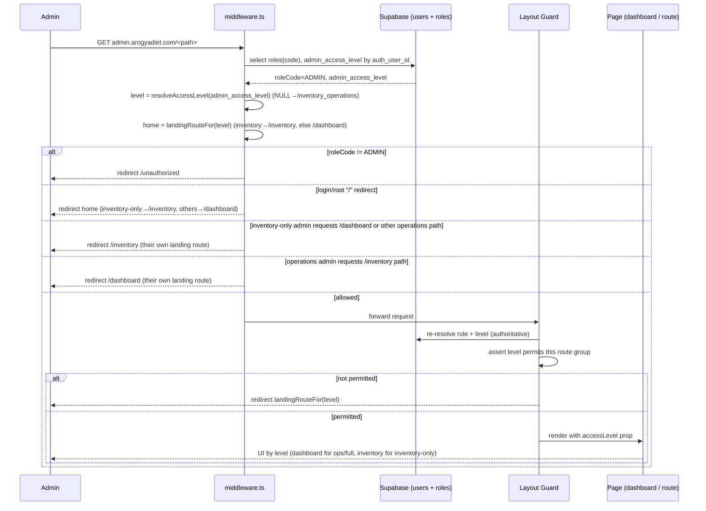
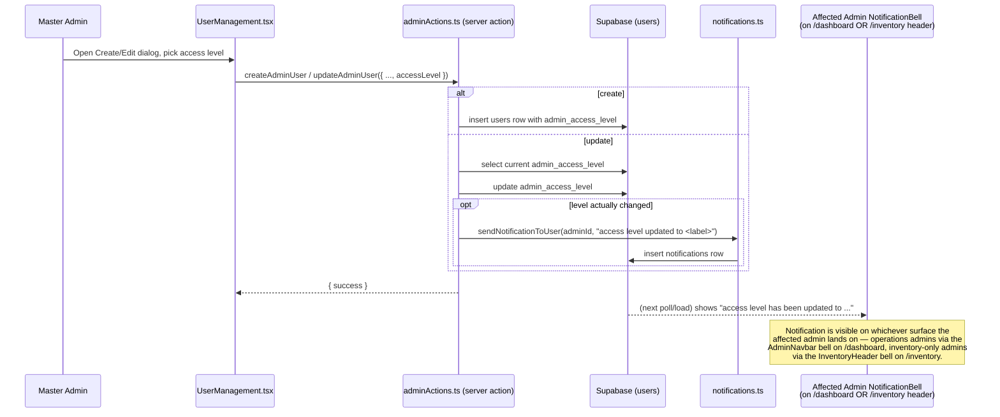

# Design Document: Admin Access Levels

## Overview

The platform currently has a single `ADMIN` role that grants full access to the admin portal (`admin.arogyadiet.com`). This feature introduces **three access levels as a sub-classification within the existing ADMIN role** — not new roles. The `ADMIN` role and all its plumbing (login, subdomain routing, RLS posture) stay intact; what changes is *which slices of the admin portal a given admin can see and reach*.

The three access levels are:

| Access Level             | Stored value             | Can access Operations* | Can access `/inventory` |
| ------------------------ | ------------------------ | ---------------------- | ----------------------- |
| Inventory only           | `inventory`              | No                     | Yes                     |
| Operations only          | `operations`             | Yes                    | No                      |
| Inventory + Operations   | `inventory_operations`   | Yes                    | Yes                     |

\* "Operations" = everything in the main admin area: Dashboard (operational KPIs), Customers, Subscriptions, Riders, Operations, Shop Products, Franchises.

A **Master Admin** (`master.arogyadiet.com`) sets an admin's access level when creating the account and can edit it later. When an existing admin's level is changed, that admin receives an on-dashboard notification.

This design covers both the **High-Level Design** (architecture, sequence diagrams, component inventory, data model) and the **Low-Level Design** (types, guard utilities, middleware/layout extensions, server-action changes, notification trigger), with exact references to the files to modify.

> **Next.js version note:** This repo runs Next.js 16.2.6 (App Router, React 19) and per `AGENTS.md` is a non-standard release where conventions may differ from older Next.js. This design deliberately reuses the patterns already proven in the codebase (middleware gatekeeper, server-side layout role resolution, server actions, `createAdminClient`) rather than assuming legacy Next.js behavior.

---

## Key Design Decisions

### Decision 1 — Storage: new column on `public.users` (not a join table)

Access levels are a 1:1 attribute of an admin user and form a small, fixed enum. A dedicated nullable column `admin_access_level` on `public.users` is the simplest, lowest-risk option and matches the existing precedent (`franchise_id` was added the same way — see `scripts/add-franchise-id-to-users.sql`). A join table would add complexity with no benefit since there is exactly one level per admin.

- Constrained to `'inventory' | 'operations' | 'inventory_operations'`, plus `NULL`.
- `NULL` for non-admin users (ignored) and for pre-existing admins.

### Decision 2 — Backward compatibility: `NULL` ⇒ full access

Existing `ADMIN` rows have no `admin_access_level`. To avoid breaking anyone, **`NULL` is resolved as `inventory_operations` (full access)** everywhere the level is read. A single normalization helper (`resolveAccessLevel`) guarantees this is consistent across middleware, layouts, and actions. (Optionally a one-time backfill script can set existing admins to `inventory_operations` explicitly; the runtime default makes it non-mandatory.)

### Decision 3 — Inventory-only admins are redirected straight to `/inventory` (their landing route)

An inventory-only admin is sent **directly** to `/inventory` (`admin.arogyadiet.com/inventory`) rather than to a trimmed `/dashboard`. There is no intermediate "Warehouse System" card to click — the warehouse system *is* their home. `/inventory` becomes their effective landing/home route. Operations-only and full-access admins continue to land on `/dashboard` as before.

Concretely, the landing route is computed from the access level via a single helper `landingRouteFor(level)`:

- `inventory` ⇒ `/inventory`
- `operations` ⇒ `/dashboard`
- `inventory_operations` ⇒ `/dashboard`

Consequences applied consistently throughout this design:

- **Post-login / root redirect:** the existing login→`/dashboard` and root (`"/"`)→`/dashboard` redirects in middleware now compute the target via `landingRouteFor(level)`, so an inventory-only admin lands on `/inventory`.
- **`/dashboard` is not reachable for inventory-only admins.** The dashboard is an operations overview (it shows operations KPIs), so it is classified as an **operations** area. An inventory-only admin who requests `/dashboard` is redirected to `/inventory`. (Previously `/dashboard` was treated as neutral; it is now operations-classified, which makes the gate consistent with the dashboard's operations content.)
- **Redirect-on-deny targets the admin's own landing route.** When an admin hits an area they are not permitted to see, the redirect target is `landingRouteFor(level)` (inventory-only ⇒ `/inventory`, others ⇒ `/dashboard`) — never always `/dashboard`.
- **Notification surface follows the landing route.** Because inventory-only admins never visit `/dashboard`, the "access level changed" NotificationBell must also be present on the `/inventory` surface (see Decision 5 below and §7). The notification is therefore visible on whichever surface the admin's landing route exposes.

(A trimmed-dashboard entry point was considered but rejected: it forced inventory-only admins through an operations route they don't need, and an extra click, when the warehouse system can simply be their home.)

### Decision 5 — NotificationBell must exist on every landing surface

Since the landing route now varies by access level, the "access level changed" notification must be reachable wherever an admin actually lands. The operations surface (`/dashboard` via the admin navbar) already hosts a NotificationBell. We therefore also mount a NotificationBell on the **inventory** surface (`InventoryHeader`), wired with the current user's id (resolved in the inventory layout via `getCurrentAdminContext`). This guarantees the affected admin sees the notification regardless of which landing route their level resolves to.

### Decision 4 — Defense in depth: enforce server-side at every layer

Enforcement is layered and **never relies on hiding nav items alone**:

1. **Middleware** (`src/middleware.ts`) — path-based gate: blocks operations paths for `inventory` admins and `/inventory` for `operations` admins before the route renders.
2. **Layout guards** — `src/app/admin/(main)/layout.tsx` (operations) and `src/app/admin/inventory/layout.tsx` (inventory) re-resolve the level server-side and `redirect()` if not permitted. This protects against any path the middleware matcher misses and is the authoritative server-render gate.
3. **Server-action guards** — an `assertAdminAccess(level)` util invoked at the top of sensitive server actions, so even a crafted POST cannot mutate data outside the admin's scope.
4. **UI conditional rendering** — nav filtering + dashboard conditional rendering for UX only (not security).

Middleware is convenient and fast but coarse; layout + action guards are the security backstop.

---

# High-Level Design

## Architecture

```mermaid
graph TD
    subgraph Client
        Browser[Admin Browser - admin.arogyadiet.com]
    end

    subgraph Edge
        MW[middleware.ts<br/>subdomain rewrite + gatekeeper<br/>+ access-level path gate]
    end

    subgraph AdminPortal[src/app/admin]
        MainLayout["(main)/layout.tsx<br/>operations guard"]
        InvLayout["inventory/layout.tsx<br/>inventory guard<br/>resolves userId for bell"]
        Navbar[AdminNavbar.tsx<br/>nav filtered by level<br/>+ NotificationBell]
        InvHeader[InventoryHeader.tsx<br/>+ NotificationBell]
        Dash[ExecutiveDashboard.tsx<br/>conditional KPIs + quick actions]
    end

    subgraph Server[Server utilities & actions]
        Guard[lib/auth/adminAccess.ts<br/>resolveAccessLevel / assertAdminAccess / canAccess]
        AdminActs[actions/master-actions/adminActions.ts<br/>create / update admin]
        Notif[lib/notifications.ts<br/>sendNotificationToUser]
    end

    subgraph DB[(Supabase Postgres)]
        Users[public.users<br/>+ admin_access_level]
        Notifs[public.notifications]
    end

    Browser --> MW
    MW -->|reads users.role + admin_access_level| Users
    MW --> MainLayout
    MW --> InvLayout
    MainLayout --> Guard
    InvLayout --> Guard
    MainLayout --> Navbar
    MainLayout --> Dash
    InvLayout --> InvHeader
    Navbar -->|level prop| Guard
    Dash -->|level prop| Guard

    AdminActs --> Users
    AdminActs -->|on level change| Notif
    Notif --> Notifs
```

## Sequence Diagram (a) — Admin login → access-level resolution → routing



## Sequence Diagram (b) — Master creates / edits an admin (with notification)



## Components and Interfaces

| # | Component / File | Type | Change |
| - | ---------------- | ---- | ------ |
| 1 | `src/lib/auth/adminAccess.ts` | **New** server util | Access-level enum/type, `resolveAccessLevel`, `canAccessPath`, `assertAdminAccess`, route classifiers |
| 2 | `src/middleware.ts` | Modify | Fetch `admin_access_level`; add path-based access gate for the `admin` subdomain |
| 3 | `src/app/admin/(main)/layout.tsx` | Modify | Resolve level server-side; redirect inventory-only admins away from operations; pass `accessLevel` to navbar/children |
| 4 | `src/app/admin/inventory/layout.tsx` | Modify | Make it an async server component that resolves user + level via `getCurrentAdminContext`; redirect operations-only admins; pass the current user's id to `InventoryHeader` for the NotificationBell |
| 5 | `src/app/admin/(main)/AdminNavbar.tsx` | Modify | Accept `accessLevel`; filter `NAV_ITEMS` |
| 6 | `src/shared/components/admin/dashboard/ExecutiveDashboard.tsx` | Modify | Accept `accessLevel`; render operations KPIs for operations/full-access; full-access additionally shows Warehouse Value KPI + Warehouse System quick action (defensive gating retained) |
| 7 | `src/app/admin/(main)/dashboard/page.tsx` (dashboard host) | Modify | Resolve level and pass to `ExecutiveDashboard` |
| 8 | `src/actions/master-actions/adminActions.ts` | Modify | `createAdminUser` + `updateAdminUser` accept/persist `accessLevel`; `getAdminUsers` selects it; notification trigger on change |
| 9 | `src/shared/components/master/UserManagement.tsx` | Modify | Access-level selector in Create/Edit dialogs; show level column in table |
| 10 | `src/shared/components/admin/inventory/InventoryHeader.tsx` | Modify | Add a `NotificationBell` (wired with the current user's id passed from the inventory layout) so inventory-only admins — whose landing route is `/inventory` — can see the "access level changed" notification |
| 11 | `scripts/add-admin-access-level-to-users.sql` | **New** migration | Add nullable constrained column + index |

## Data Models

### Modified table: `public.users`

New column:

```sql
admin_access_level TEXT DEFAULT NULL
  CHECK (admin_access_level IN ('inventory', 'operations', 'inventory_operations'))
```

**Validation / semantics rules:**
- Only meaningful when the user's role is `ADMIN`. For all other roles it stays `NULL` and is ignored.
- `NULL` for an `ADMIN` ⇒ treated as `inventory_operations` (full access) at runtime — backward compatible.
- A `CHECK` constraint enforces the enum at the DB layer; the application also validates via Zod before writing.

**Migration note** — following the repo convention (nullable, additive, `IF NOT EXISTS`, rollback comment), create `scripts/add-admin-access-level-to-users.sql`:

```sql
-- ============================================================================
-- ADD admin_access_level TO USERS TABLE — (SAFE: Nullable column only)
-- ============================================================================
-- Sub-classification of the ADMIN role. NULL for non-admins and for existing
-- admins (resolved as full access 'inventory_operations' at runtime).
--
-- Rollback: ALTER TABLE public.users DROP COLUMN admin_access_level;
-- ============================================================================

ALTER TABLE public.users
  ADD COLUMN IF NOT EXISTS admin_access_level TEXT DEFAULT NULL;

ALTER TABLE public.users
  ADD CONSTRAINT users_admin_access_level_check
  CHECK (
    admin_access_level IS NULL
    OR admin_access_level IN ('inventory', 'operations', 'inventory_operations')
  );

CREATE INDEX IF NOT EXISTS idx_users_admin_access_level
  ON public.users(admin_access_level);

-- Optional explicit backfill (runtime default already covers this):
-- UPDATE public.users u SET admin_access_level = 'inventory_operations'
--   FROM public.roles r
--  WHERE u.role_id = r.id AND r.code = 'ADMIN' AND u.admin_access_level IS NULL;
```

### RLS implications

The existing RLS posture keys off `role_id` → `roles.code`; that is unchanged because access levels do not introduce new roles. Inventory vs operations data isolation is enforced at the **application server layer** (middleware + layout + action guards), which is consistent with how the admin portal already gates by role. If, later, row-level isolation of inventory data from operations admins is desired at the DB level, an RLS policy could reference `admin_access_level` via a `SECURITY DEFINER` helper — called out here as a future option, not part of this scope. Server-side enforcement at every layer is mandatory (see Security Considerations).

### `public.notifications` (existing, unchanged shape)

The "access level changed" event inserts one row via the existing `sendNotificationToUser` path (`user_id`, `title`, `message`, `action_url`, `type`). No schema change.

---

# Low-Level Design

All examples use TypeScript (the project language). File paths reference the exact files to create or modify.

## 1. Access-level type + core helpers — new file `src/lib/auth/adminAccess.ts`

```typescript
// src/lib/auth/adminAccess.ts

/** The three admin access levels (sub-classification of the ADMIN role). */
export const ADMIN_ACCESS_LEVELS = [
  "inventory",
  "operations",
  "inventory_operations",
] as const;

export type AdminAccessLevel = (typeof ADMIN_ACCESS_LEVELS)[number];

/** Capability area an admin route belongs to. */
export type AccessArea = "operations" | "inventory";

/** Human-readable labels (used in UI + notification copy). */
export const ACCESS_LEVEL_LABELS: Record<AdminAccessLevel, string> = {
  inventory: "Inventory only",
  operations: "Operations only",
  inventory_operations: "Inventory + Operations (Full Access)",
};

/**
 * Normalize a raw DB value into a concrete access level.
 * Backward compatibility: NULL / unknown => full access.
 *
 * Precondition:  raw is the users.admin_access_level value (any/unknown).
 * Postcondition: returns a valid AdminAccessLevel; never throws.
 *   - raw ∈ ADMIN_ACCESS_LEVELS            => raw
 *   - raw === null | undefined | invalid   => "inventory_operations"
 */
export function resolveAccessLevel(raw: unknown): AdminAccessLevel {
  return (ADMIN_ACCESS_LEVELS as readonly string[]).includes(raw as string)
    ? (raw as AdminAccessLevel)
    : "inventory_operations";
}

/**
 * Does the given level grant access to the given area?
 *
 * Postcondition (truth table):
 *   inventory             -> inventory:true,  operations:false
 *   operations            -> inventory:false, operations:true
 *   inventory_operations  -> inventory:true,  operations:true
 */
export function canAccess(level: AdminAccessLevel, area: AccessArea): boolean {
  switch (level) {
    case "inventory":
      return area === "inventory";
    case "operations":
      return area === "operations";
    case "inventory_operations":
      return true;
  }
}
```

## 2. Route classification + path gate (used by middleware) — same file

```typescript
// src/lib/auth/adminAccess.ts (continued)

/**
 * Path prefixes (relative to the rewritten /admin base) that are INVENTORY area.
 * Everything else under the admin portal is treated as OPERATIONS.
 */
const INVENTORY_PREFIXES = ["/admin/inventory"];

/** Operations route prefixes that must be blocked for inventory-only admins. */
const OPERATIONS_PREFIXES = [
  "/admin/dashboard",
  "/admin/customers",
  "/admin/subscriptions",
  "/admin/riders",
  "/admin/operations",
  "/admin/kitchen-shop",
  "/admin/franchises",
];

/**
 * Classify a rewritten admin pathname into an AccessArea, or null if it is a
 * shared/neutral path (e.g. /admin/profile, /admin/login) that every admin may
 * load.
 *
 * Note: /admin/dashboard is classified as OPERATIONS (not neutral). The
 * dashboard is an operations overview (operations KPIs), so an inventory-only
 * admin is redirected away from it to their own landing route, /inventory
 * (Decision 3). Operations-only and full-access admins land on /dashboard.
 */
export function classifyAdminPath(pathname: string): AccessArea | null {
  if (INVENTORY_PREFIXES.some((p) => pathname === p || pathname.startsWith(p + "/") || pathname.startsWith(p))) {
    return "inventory";
  }
  if (OPERATIONS_PREFIXES.some((p) => pathname === p || pathname.startsWith(p + "/"))) {
    return "operations";
  }
  return null; // neutral (profile, login, etc.)
}

/**
 * Decide whether a request to `pathname` is permitted for `level`.
 *
 * Postcondition:
 *   - neutral path                -> true
 *   - area path & canAccess       -> true
 *   - area path & !canAccess      -> false
 */
export function isAdminPathAllowed(
  level: AdminAccessLevel,
  pathname: string,
): boolean {
  const area = classifyAdminPath(pathname);
  if (area === null) return true;
  return canAccess(level, area);
}

/**
 * The landing/home route for an access level.
 *
 * Postcondition:
 *   - inventory             -> "/inventory"
 *   - operations            -> "/dashboard"
 *   - inventory_operations  -> "/dashboard"
 *
 * Used by the middleware post-login / root redirect and by every
 * redirect-on-deny so an admin is always sent to a route they can actually see.
 */
export function landingRouteFor(
  level: AdminAccessLevel,
): "/dashboard" | "/inventory" {
  return level === "inventory" ? "/inventory" : "/dashboard";
}
```

## 3. Server guard util — same file

```typescript
// src/lib/auth/adminAccess.ts (continued)
import "server-only";

/**
 * Throw/redirect-style guard for server actions and server components.
 * Resolve the current admin's level and assert it permits `area`.
 *
 * Precondition:  caller is within a request scope where the Supabase server
 *                client can read the session.
 * Postcondition: returns the resolved AdminAccessLevel if permitted;
 *                otherwise throws AccessDeniedError (callers map to redirect
 *                or { success:false }).
 */
export class AccessDeniedError extends Error {
  constructor(area: AccessArea) {
    super(`Admin access denied for area: ${area}`);
    this.name = "AccessDeniedError";
  }
}

export async function assertAdminAccess(
  area: AccessArea,
): Promise<AdminAccessLevel> {
  const { roleCode, accessLevel } = await getCurrentAdminContext(); // see §4
  if (roleCode !== "ADMIN") throw new AccessDeniedError(area);
  if (!canAccess(accessLevel, area)) throw new AccessDeniedError(area);
  return accessLevel;
}
```

## 4. Current-admin context resolver — same file

```typescript
// src/lib/auth/adminAccess.ts (continued)
// Mirrors the role-resolution already done in app/admin/(main)/layout.tsx.

export interface AdminContext {
  userId: string | null;      // public.users.id
  roleCode: string | null;    // e.g. "ADMIN"
  accessLevel: AdminAccessLevel;
}

/**
 * Resolve the signed-in user's role + access level via Supabase SSR client.
 * Postcondition: accessLevel is always a valid level (NULL coerced to full).
 */
export async function getCurrentAdminContext(): Promise<AdminContext> {
  const supabase = createSupabaseServerClient(); // existing SSR client helper
  const {
    data: { user },
  } = await supabase.auth.getUser();
  if (!user) return { userId: null, roleCode: null, accessLevel: "inventory_operations" };

  const { data } = await supabase
    .from("users")
    .select("id, admin_access_level, roles(code)")
    .eq("auth_user_id", user.id)
    .single();

  const roles = data?.roles as { code: string }[] | { code: string } | null | undefined;
  const roleCode = Array.isArray(roles) ? roles[0]?.code : roles?.code;

  return {
    userId: data?.id ?? null,
    roleCode: roleCode ?? null,
    accessLevel: resolveAccessLevel(data?.admin_access_level),
  };
}
```

## 5. Middleware extension — modify `src/middleware.ts`

The middleware already fetches `roles(code)`. Extend the same query to also select `admin_access_level`, then add a path gate inside the existing `currentSubdomain === "admin"` block.

```typescript
// Inside the user role lookup (extend existing select):
const { data: userProfile } = await supabase
  .from("users")
  .select("admin_access_level, roles(code)")
  .eq("auth_user_id", user.id)
  .single();

const rolesData: any = userProfile?.roles;
roleCode = Array.isArray(rolesData) ? rolesData[0]?.code : rolesData?.code;
const accessLevel = resolveAccessLevel(userProfile?.admin_access_level);

// ... within the strict gatekeeper, admin branch:
if (currentSubdomain === "admin") {
  if (roleCode !== "ADMIN") {
    return NextResponse.redirect(new URL("/unauthorized", request.url));
  }
  // NEW: access-level path gate. url.pathname is the rewritten /admin/... path.
  // On deny, send the admin to THEIR OWN landing route (not always /dashboard):
  //   inventory-only -> /inventory, others -> /dashboard.
  if (!isAdminPathAllowed(accessLevel, url.pathname)) {
    return NextResponse.redirect(
      new URL(landingRouteFor(accessLevel), request.url),
    );
  }
}
```

The existing **post-login / root redirect** (currently hard-coded to `/dashboard`) must also be computed from the level so an inventory-only admin lands on `/inventory`:

```typescript
// Replaces the hard-coded `new URL("/dashboard", request.url)` redirect.
// `accessLevel` is the value resolved above (defaults to full access if
// the level could not be resolved for any reason).
if (
  user &&
  (url.pathname === "/" ||
    url.pathname.startsWith("/login") ||
    url.pathname.startsWith("/signup")) &&
  !url.pathname.startsWith("/update-password")
) {
  const home = landingRouteFor(accessLevel); // inventory -> /inventory, else /dashboard
  return NextResponse.redirect(new URL(home, request.url));
}
```

**Pseudocode (algorithm):**

```pascal
ALGORITHM adminAccessGate(request)
  user      <- supabase.getUser()
  IF user = NULL THEN return  (existing login redirect handles it)
  profile   <- select admin_access_level, roles(code) WHERE auth_user_id = user.id
  roleCode  <- extractRoleCode(profile.roles)
  level     <- resolveAccessLevel(profile.admin_access_level)
  home      <- landingRouteFor(level)         // inventory -> /inventory, else /dashboard

  IF currentSubdomain = "admin" THEN
    IF roleCode <> "ADMIN" THEN
      RETURN redirect("/unauthorized")
    END IF
    IF NOT isAdminPathAllowed(level, request.path) THEN
      RETURN redirect(home)                    // own landing route, not always /dashboard
    END IF
  END IF

  // Post-login / root redirect uses the same landing route.
  IF user AND request.path ∈ {"/", "/login", "/signup"} THEN
    RETURN redirect(home)
  END IF

  RETURN next()
END
```

## 6. Operations layout guard — modify `src/app/admin/(main)/layout.tsx`

The layout already resolves the role. Extend its select to include `admin_access_level`, then redirect inventory-only admins away from operations content and pass `accessLevel` down.

```typescript
const { data: userProfileData } = await supabase
  .from("users")
  .select("id, full_name, avatar_url, admin_access_level, roles(code)")
  .eq("auth_user_id", user.id)
  .single();

// ... existing roleCode resolution ...
if (roleCode !== "ADMIN") return redirect("/unauthorized");

const accessLevel = resolveAccessLevel(userProfileData?.admin_access_level);

// NOTE: the (main) group includes the dashboard, which is now classified as an
// OPERATIONS area (it shows operations KPIs). Inventory-only admins are
// redirected away from operations routes to their own landing route,
// landingRouteFor(level) === "/inventory". Operations-only and full-access
// admins land on /dashboard. The layout passes accessLevel so the navbar and
// dashboard can trim UI.
if (!canAccess(accessLevel, "operations")) {
  return redirect(landingRouteFor(accessLevel)); // inventory-only -> /inventory
}

return (
  <div className="flex min-h-screen flex-col bg-muted/20">
    <OneSignalProvider userId={userProfile.id || null} />
    <AdminNavbar userProfile={userProfile} email={user.email!} accessLevel={accessLevel} />
    <main className="mx-auto w-full max-w-7xl flex-1 px-4 py-8 sm:px-6 lg:px-8">
      {children}
    </main>
  </div>
);
```

For non-dashboard operations **pages** within `(main)` (customers, subscriptions, riders, operations, kitchen-shop, franchises), add a one-line guard at the top of each `page.tsx` (or in a shared per-group guard) so they are protected even if reached directly:

```typescript
// top of e.g. app/admin/(main)/customers/page.tsx
await assertAdminAccess("operations"); // throws -> map to redirect(landingRouteFor(level))
```

## 7. Inventory layout guard + NotificationBell wiring — modify `src/app/admin/inventory/layout.tsx`

Convert the currently-static layout into an async server component that resolves and enforces inventory access, and resolves the current user's id so `InventoryHeader` can mount a `NotificationBell`. This is required because inventory-only admins land on `/inventory` (Decision 3/5) and would otherwise never see the "access level changed" notification.

```typescript
// src/app/admin/inventory/layout.tsx
import { redirect } from "next/navigation";
import InventoryHeader from "@/shared/components/admin/inventory/InventoryHeader";
import OperationsCart from "@/shared/components/admin/inventory/OperationsCart";
import {
  getCurrentAdminContext,
  canAccess,
  landingRouteFor,
} from "@/lib/auth/adminAccess";

export default async function InventoryLayout({
  children,
}: {
  children: React.ReactNode;
}) {
  const { userId, roleCode, accessLevel } = await getCurrentAdminContext();
  if (roleCode !== "ADMIN") redirect("/unauthorized");
  // Operations-only admins cannot see inventory -> send to their landing route.
  if (!canAccess(accessLevel, "inventory")) redirect(landingRouteFor(accessLevel)); // -> /dashboard

  return (
    <div className="flex min-h-screen flex-col bg-muted/20">
      {/* NEW: pass the resolved user id so the header can render the bell */}
      <InventoryHeader userId={userId ?? undefined} />
      <main className="flex-1">{children}</main>
      <OperationsCart />
    </div>
  );
}
```

### 7a. NotificationBell on the inventory surface — modify `src/shared/components/admin/inventory/InventoryHeader.tsx`

`InventoryHeader` is a client component. Add an optional `userId` prop and render the same `NotificationBell` the operations navbar uses, wired with that id. This ensures the affected admin sees the "access level changed" notification on whichever surface their landing route exposes (operations admins via the navbar bell on `/dashboard`; inventory-only admins via this bell on `/inventory`).

```typescript
// src/shared/components/admin/inventory/InventoryHeader.tsx
import { NotificationBell } from "@/components/shared/NotificationBell"; // same named export AdminNavbar uses

interface InventoryHeaderProps {
  userId?: string; // NEW — resolved server-side in the inventory layout
}

export default function InventoryHeader({ userId }: InventoryHeaderProps) {
  // ... existing logo + nav ...

  // In the right-hand action cluster, alongside the "Admin Dashboard" button:
  //   {userId ? <NotificationBell userId={userId} /> : null}
  // (Mount the bell only when a user id is available — mirrors AdminNavbar.)
}
```

> The "Admin Dashboard" button in the header remains useful for full-access / operations admins who land on `/inventory` via the dashboard quick action. For an inventory-only admin it is harmless: following it routes through the operations gate, which redirects them back to `/inventory` (their landing route).

## 8. Nav filtering — modify `src/app/admin/(main)/AdminNavbar.tsx`

`NAV_ITEMS` are all operations links (Inventory is *not* in the nav — full-access admins reach it via the dashboard Warehouse System quick action). Note that an inventory-only admin never renders this navbar at all: the `(main)` operations layout redirects them to `/inventory` before the navbar mounts (§6). Filtering by level is therefore primarily relevant for completeness/defense-in-depth; an `operations`-only admin sees all operations items, and the filter guarantees no item is shown that the server would block.

```typescript
interface AdminNavbarProps {
  userProfile: { id: string; fullName: string; avatarUrl: string; roleCode: string };
  email: string;
  accessLevel: AdminAccessLevel; // NEW
}

// Tag each item with the area it belongs to. Dashboard is now an OPERATIONS
// route (consistent with classifyAdminPath); since only operations/full-access
// admins ever render this navbar, it is always visible to them.
const NAV_ITEMS = [
  { href: "/dashboard",    label: "Dashboard",      icon: LayoutDashboard, area: "operations" },
  { href: "/customers",    label: "Customers",      icon: Users,           area: "operations" },
  { href: "/subscriptions",label: "Subscriptions",  icon: CreditCard,      area: "operations" },
  { href: "/riders",       label: "Riders",         icon: Truck,           area: "operations" },
  { href: "/operations",   label: "Operations",     icon: Settings2,       area: "operations" },
  { href: "/kitchen-shop", label: "Shop Products",  icon: ShoppingBag,     area: "operations" },
  { href: "/franchises",   label: "Franchises",     icon: Building2,       area: "operations" },
] as const;

// In the component body:
const visibleItems = NAV_ITEMS.filter(
  (item) => item.area === null || canAccess(accessLevel, item.area),
);
// render visibleItems instead of NAV_ITEMS (both desktop + mobile sheet)
```

## 9. Dashboard conditional rendering — modify `ExecutiveDashboard.tsx` (+ host page)

Since inventory-only admins **never reach** the dashboard (they land on `/inventory` and `/dashboard` is operations-classified — Decision 3), the dashboard no longer needs an "inventory-only trimmed view" as an entry point. The dashboard now only needs to serve two audiences:

- **Operations-only** — sees operations KPIs and operations quick actions.
- **Full-access (`inventory_operations`)** — sees the same operations KPIs **plus** the Warehouse Value KPI and the "Warehouse System" quick action (their shortcut into `/inventory`).

The inventory-only trimming of the dashboard is therefore no longer required. The `accessLevel` prop and defensive per-area gating can remain (cheap defense-in-depth), but in practice the dashboard will only ever render for `operations` or `inventory_operations`.

`ExecutiveDashboard` is a client component. Pass `accessLevel` as a prop from the dashboard server page (which resolves it via `getCurrentAdminContext`). Tag quick actions + KPIs by area and filter.

```typescript
type ExecutiveDashboardProps = {
  data: ExecutiveSummary;
  accessLevel: AdminAccessLevel; // NEW (in practice: "operations" | "inventory_operations")
};

// Tag quick actions:
const QUICK_ACTIONS = [
  { title: "Warehouse System",  href: "/inventory",     area: "inventory",  icon: Warehouse,   /* ... */ },
  { title: "Register Customer", href: "/customers",     area: "operations", icon: UserPlus,    /* ... */ },
  { title: "Add Subscription",  href: "/subscriptions", area: "operations", icon: ClipboardList,/* ... */ },
] as const;

// Tag KPI cards by area:
const KPI_AREA = {
  activeCustomers:     "operations",
  activeSubscriptions: "operations",
  pendingOperations:   "operations",
  warehouseValue:      "inventory",
} as const;

// In render:
const visibleActions = QUICK_ACTIONS.filter((a) => canAccess(accessLevel, a.area));
const showOps = canAccess(accessLevel, "operations"); // true for both audiences here
const showInv = canAccess(accessLevel, "inventory");  // true only for full-access
// Operations KPIs render for both operations-only and full-access.
// Warehouse Value KPI + "Warehouse System" quick action render only for
// full-access (showInv). The Warehouse System quick action stays visible for
// full-access admins as their shortcut into /inventory.
```

**Host page** (`app/admin/(main)/dashboard/page.tsx`) resolves the level and passes it down. (The operations layout in §6 has already redirected inventory-only admins away before this page renders.)

```typescript
const { accessLevel } = await getCurrentAdminContext();
const summary = await getExecutiveSummary(); // existing
return <ExecutiveDashboard data={summary} accessLevel={accessLevel} />;
```

> Because inventory-only admins no longer reach this page, the previously-noted optimization to skip operations queries for them is moot. The dashboard always serves operations data.

## 10. Master server-action changes — modify `src/actions/master-actions/adminActions.ts`

### 10a. `getAdminUsers` — select the level

```typescript
.select("id, auth_user_id, full_name, email, mobile, is_active, admin_access_level, created_at, roles(code)")
```

### 10b. `createAdminUser` — accept + persist `accessLevel`

```typescript
export async function createAdminUser(formData: {
  fullName: string;
  email: string;
  mobile: string;
  password: string;
  accessLevel: AdminAccessLevel; // NEW
}) {
  // ... existing validation, auth user creation, role lookup ...

  // Validate the level defensively (Zod) before insert:
  const level = resolveAccessLevel(formData.accessLevel); // invalid -> full access (or reject)

  const { error: userError } = await supabaseAdmin.from("users").insert({
    auth_user_id: authUserId,
    role_id: roleData.id,
    full_name: formData.fullName,
    email: formData.email,
    mobile: formData.mobile || null,
    admin_access_level: level,           // NEW
    is_active: true,
    is_email_verified: true,
  });
  // ... rest unchanged (reactivate branch should also set admin_access_level) ...
}
```

### 10c. `updateAdminUser` — accept `accessLevel`, detect change, fire notification

```typescript
import { sendNotificationToUser } from "@/lib/notifications";
import { ACCESS_LEVEL_LABELS, resolveAccessLevel, type AdminAccessLevel } from "@/lib/auth/adminAccess";

export async function updateAdminUser(
  userId: string,
  formData: { fullName: string; mobile: string; accessLevel: AdminAccessLevel }, // NEW field
) {
  const supabaseAdmin = createAdminClient();

  // 1. Read current level BEFORE updating (to detect a real change).
  const { data: current } = await supabaseAdmin
    .from("users")
    .select("admin_access_level")
    .eq("id", userId)
    .single();

  const prevLevel = resolveAccessLevel(current?.admin_access_level);
  const nextLevel = resolveAccessLevel(formData.accessLevel);

  // 2. Update.
  const { error } = await supabaseAdmin
    .from("users")
    .update({
      full_name: formData.fullName,
      mobile: formData.mobile || null,
      admin_access_level: nextLevel,        // NEW
      updated_at: new Date().toISOString(),
    })
    .eq("id", userId);

  if (error) return { success: false, error: error.message };

  // 3. Fire EXACTLY ONE notification iff the level actually changed.
  if (prevLevel !== nextLevel) {
    await sendNotificationToUser(userId, {
      title: "Access level updated",
      message: `Your access level has been updated to ${ACCESS_LEVEL_LABELS[nextLevel]}.`,
      type: "SYSTEM",
      actionUrl: "/dashboard",
    });
  }

  await logAdminAction("UPDATE", "admin_user", userId, formData);
  revalidatePath("/master/user-management");
  return { success: true };
}
```

**Pseudocode (notification trigger):**

```pascal
ALGORITHM updateAdminUser(userId, form)
  prev <- resolveAccessLevel( select admin_access_level where id = userId )
  next <- resolveAccessLevel( form.accessLevel )

  update users set full_name, mobile, admin_access_level = next where id = userId
  IF error THEN return {success:false}

  IF prev <> next THEN
    sendNotificationToUser(userId, "access level has been updated to " + label(next))
  END IF   // changed => exactly one notification; unchanged => zero

  return {success:true}
END
```

## 11. Master UI changes — modify `src/shared/components/master/UserManagement.tsx`

- Add `accessLevel` to the `AdminUser` interface and to `createForm` / `editForm` state.
- Add a **select** (Shadcn `Select`) to the Create dialog and Edit dialog with the three options from `ACCESS_LEVEL_LABELS`. Default new admins to `inventory_operations`.
- Pass `accessLevel` into `createAdminUser` / `updateAdminUser` calls.
- Add an "Access Level" column to the table rendering `ACCESS_LEVEL_LABELS[resolveAccessLevel(admin.admin_access_level)]`.

```typescript
interface AdminUser {
  id: string; auth_user_id: string; full_name: string; email: string;
  mobile: string | null; is_active: boolean; created_at: string;
  admin_access_level: AdminAccessLevel | null; // NEW
}
// createForm: { fullName, email, mobile, password, accessLevel: "inventory_operations" }
// editForm:   { fullName, mobile, accessLevel }
```

## Example Usage (end-to-end)

```typescript
// Master creates an inventory-only admin
await createAdminUser({
  fullName: "Riya Warehouse",
  email: "riya@arogyadiet.com",
  mobile: "",
  password: "supersecret",
  accessLevel: "inventory",
});

// Riya logs in -> middleware computes landingRouteFor("inventory") === "/inventory"
// and redirects her straight to the warehouse system. /dashboard (operations)
// and /customers, /operations, etc. are blocked: requesting any of them
// redirects her back to /inventory. The InventoryHeader shows a NotificationBell
// wired with her user id.

// Later, Master upgrades her to full access
await updateAdminUser(riyaUserId, {
  fullName: "Riya Warehouse",
  mobile: "",
  accessLevel: "inventory_operations", // changed -> ONE notification fired
});
// Riya now sees the full nav + all KPIs on /dashboard (her landing route is now
// /dashboard), and has a notification:
// "Your access level has been updated to Inventory + Operations (Full Access)."
// She would have seen the same notification on the /inventory NotificationBell
// while she was still inventory-only.
```

---

## Correctness Properties

These are written for later property-based testing. Let `level ∈ {inventory, operations, inventory_operations}` and treat `resolveAccessLevel` / `isAdminPathAllowed` / `canAccess` as pure functions.

### Property 1: Inventory-only never reaches operations

For all operations paths `p` (any path classified as `operations`, **including `/admin/dashboard`**): `isAdminPathAllowed("inventory", p) === false`. Equivalently, an inventory-only admin can never load an operations route (the dashboard included) or operations data.

### Property 2: Operations-only never reaches inventory

For all `p` classified as `inventory` (including `/admin/inventory` and any sub-path): `isAdminPathAllowed("operations", p) === false`.

### Property 3: Full access reaches everything

For all admin paths `p`: `isAdminPathAllowed("inventory_operations", p) === true`.

### Property 4: Inventory-only landing route is always `/inventory`

For an inventory-only admin, the computed landing route is always `/inventory` and never `/dashboard`: `landingRouteFor("inventory") === "/inventory"`.

### Property 5: Operations-only and full-access land on `/dashboard`

`landingRouteFor("operations") === "/dashboard"` and `landingRouteFor("inventory_operations") === "/dashboard"`. Combined with Property 4, `landingRouteFor` is total over the enum and returns `/inventory` iff the level is `inventory`.

### Property 6: Inventory-only requesting `/dashboard` is redirected to `/inventory`

For an inventory-only admin requesting `/admin/dashboard` (or any operations path), the gate denies the request and the redirect target equals their own landing route: `isAdminPathAllowed("inventory", "/admin/dashboard") === false` and the resolved redirect is `landingRouteFor("inventory") === "/inventory"`.

### Property 7: Redirect-on-deny targets the admin's own landing route

For any denied request by `level`, the redirect target equals `landingRouteFor(level)` — inventory-only ⇒ `/inventory`, operations-only and full-access ⇒ `/dashboard` — never an area the admin cannot see.

### Property 8: Neutral paths are universally reachable

For the neutral paths `p` (e.g. `/admin/profile`, `/admin/login`; note `/admin/dashboard` is **operations**, not neutral) and every `level`: `isAdminPathAllowed(level, p) === true`.

### Property 9: canAccess truth table is total and exact

For every `level` and `area ∈ {operations, inventory}`, `canAccess` returns exactly the documented boolean (no `undefined`, total over the enum).

### Property 10: Backward-compatible resolution

For all inputs `x ∉ ADMIN_ACCESS_LEVELS` (including `null`/`undefined`/garbage), `resolveAccessLevel(x) === "inventory_operations"`; and for all valid `v`, `resolveAccessLevel(v) === v` (idempotent on valid values).

### Property 11: Exactly-one notification on change

`updateAdminUser` emits exactly **one** notification iff `prevLevel !== nextLevel`, and **zero** notifications when `prevLevel === nextLevel`. (Count of inserted notification rows for the affected admin = `prevLevel !== nextLevel ? 1 : 0`.)

### Property 12: Notification is visible on the affected admin's landing surface

The "access level changed" notification is reachable on whichever surface the affected admin's landing route exposes: a `NotificationBell` is present on **both** the operations surface (`AdminNavbar` on `/dashboard`) and the inventory surface (`InventoryHeader` on `/inventory`), each wired with the current user's id. Therefore, for every `level`, the surface at `landingRouteFor(level)` renders a NotificationBell for the signed-in admin.

### Property 13: Notification targets the affected admin only

The notification row's `user_id` equals the edited admin's `users.id`, and no other user receives a row from this action.

### Property 14: Non-admin roles are unaffected

For any user whose `roles.code !== "ADMIN"`, `admin_access_level` is ignored: existing role-based gating decisions are identical with or without the column set.

### Property 15: UI visibility is a subset of server permission (no over-exposure)

Any nav item, quick action, or KPI rendered for `level` corresponds to an `area` with `canAccess(level, area) === true` (or is neutral). UI never shows an entry the server would block.

### Property 16: Server enforcement is independent of UI

For any operations `area` request by an `inventory` admin (and vice-versa), `assertAdminAccess(area)` throws regardless of what the client sent — i.e., hiding nav is never the only barrier.

---

## Error Handling

| Scenario | Condition | Response | Recovery |
| -------- | --------- | -------- | -------- |
| Unauthorized area via middleware | Admin requests a path outside their area | Redirect to the admin's own landing route `landingRouteFor(level)` (inventory-only ⇒ `/inventory`, others ⇒ `/dashboard`) | Admin uses permitted areas; no error surfaced |
| Unauthorized area via layout/action | Direct hit bypassing middleware match | Layout `redirect(landingRouteFor(level))`; action throws `AccessDeniedError` mapped to `{ success:false, error }` | Caller shows toast / redirect |
| Invalid `accessLevel` submitted by Master | Value not in enum | Zod validation rejects (preferred) or `resolveAccessLevel` coerces to full — choose reject on the master mutation path to avoid silent over-grant | Master re-submits valid level |
| DB constraint violation | Write with bad value bypassing app validation | `CHECK` constraint rejects insert/update; action returns `{ success:false }` | Surfaced as error toast |
| Notification insert fails | Supabase insert error | `sendNotificationToUser` logs error, does not throw (existing behavior) | Level change still persists; notification is best-effort |
| Missing session in guard | No user in request scope | `getCurrentAdminContext` returns `roleCode=null` → guard denies / layout redirects to `/login` | User re-authenticates |
## Testing Strategy

### Unit Testing
- Pure functions in `src/lib/auth/adminAccess.ts`: `resolveAccessLevel`, `canAccess`, `classifyAdminPath`, `isAdminPathAllowed`, `landingRouteFor`. Table-driven tests over the full enum × area matrix and a corpus of representative paths (including `/admin/dashboard` ⇒ operations).
- `updateAdminUser` change-detection logic with mocked Supabase client + spied `sendNotificationToUser` (assert call count 0 or 1).

### Property-Based Testing
- **Library:** `fast-check` (TypeScript-native, fits the stack).
- Generators: arbitrary `AdminAccessLevel`, arbitrary admin path strings (mix of inventory/operations/neutral prefixes + random suffixes, including `/admin/dashboard`), arbitrary raw column values (valid + invalid + null).
- Encode Correctness Properties 1–10 and 15 directly as fast-check properties (path-gate, landing-route, and resolution invariants). Properties 11 and 13 (notification count/targeting) tested with a fake notification sink over random (prev, next) level pairs. Property 12 (bell present on both landing surfaces) is covered by component tests on `AdminNavbar` and `InventoryHeader`.

### Integration Testing
- Middleware gate: simulate requests for each level against representative inventory/operations/neutral paths; assert redirect vs pass, and that the redirect target equals `landingRouteFor(level)` (inventory-only `/dashboard` request ⇒ `/inventory`).
- Post-login / root redirect: assert an inventory-only admin is sent to `/inventory` and operations/full-access admins to `/dashboard`.
- Layout guards: render `inventory/layout.tsx` and an operations page with mocked `getCurrentAdminContext` for each level; assert redirect behavior and that `InventoryHeader` receives a `userId` and mounts the NotificationBell.
- Master flow: create → edit (changed) → edit (unchanged); assert notification row counts and table column rendering.

## Performance Considerations

- Middleware already performs one `users` lookup per request; this design only adds one column to that existing `select` — no extra round-trip. Layout guards reuse the same single-query pattern.
- Optional: for inventory-only admins, skip operations metric queries in `getExecutiveSummary()` to reduce dashboard load (noted, not required for correctness).
- `idx_users_admin_access_level` supports any future filtering by level (e.g., admin-list scoping).

## Security Considerations

- **Server-side enforcement at every layer is mandatory.** Nav filtering and dashboard trimming are UX-only and provide no security; the authoritative barriers are middleware (coarse path gate), layout guards (`redirect` to `landingRouteFor(level)`), and `assertAdminAccess` in server actions. A request that bypasses the client must still be blocked server-side (Correctness Property 16).
- **Least privilege on writes:** the master mutation path should *reject* invalid access levels rather than coerce, to avoid accidental privilege escalation; the runtime `resolveAccessLevel` full-access default applies only to legacy `NULL` reads, never to validated writes.
- **DB CHECK constraint** is a final guard against malformed values regardless of code path.
- **Notification copy** contains no sensitive data beyond the level label; `actionUrl` points to `/dashboard`, which resolves to the recipient's own landing route via the access gate (an inventory-only recipient following it is redirected to `/inventory`).
- No new RLS roles are introduced; the existing role-based RLS posture is preserved. DB-level row isolation by access level is a documented future option, not part of this scope.

## Dependencies

- Existing: Supabase (`@supabase/ssr`, `createAdminClient`), Next.js 16 App Router middleware/layouts/server actions, existing `src/lib/notifications.ts` (`sendNotificationToUser`), the existing `NotificationBell` component (`@/components/shared/NotificationBell`, reused on the inventory surface), Shadcn UI (`Select`, `Dialog`, `Table`), `lucide-react` icons.
- New (recommended): `fast-check` as a dev dependency for property-based tests (if not already present).
- New file: `src/lib/auth/adminAccess.ts`. New migration: `scripts/add-admin-access-level-to-users.sql`.
