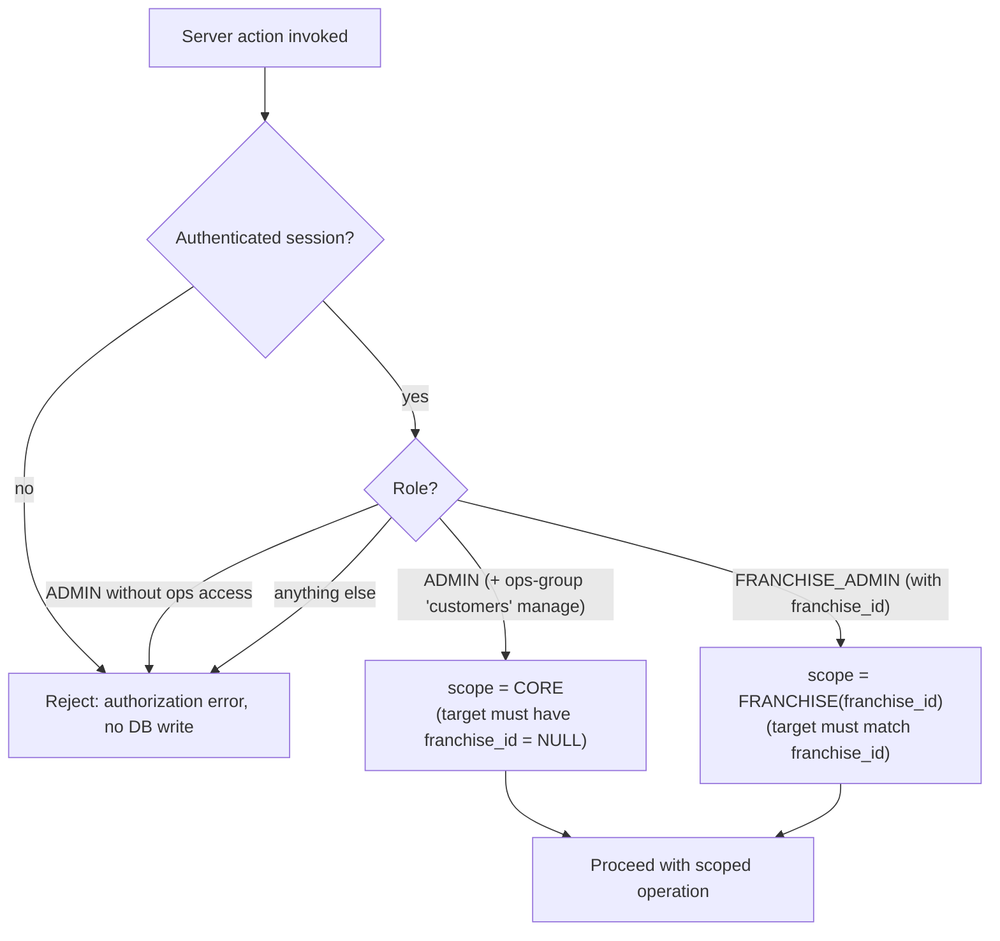
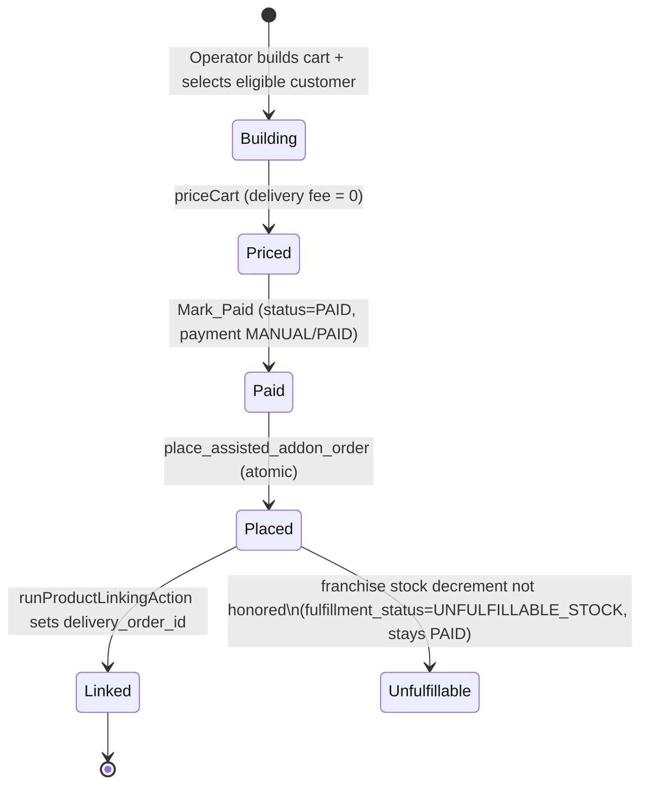

# Design Document

## Overview

This feature lets an **Operator** — an **Admin** (admin dashboard) or a
**Franchise_Admin** (franchise dashboard) — place a shop-product order **on
behalf of a customer**. The operator builds a cart, searches for and selects an
eligible customer, reviews pricing computed by the customer-checkout logic **but
with no delivery fee**, explicitly marks the order paid (no online charge), and
then places it. Once placed, the order behaves exactly like a customer-placed
order: it links to the customer's next available delivery through the existing
linking flow and rides along with the meal delivery.

The design is a thin new capability layered on top of proven, already-shipped
building blocks. It **reuses** rather than re-implements:

- **Pricing** — `calculateShopOrderBreakdown` (`src/lib/pricing/inclusive-tax.ts`),
  the same inclusive-tax breakdown the customer checkout uses.
- **IST date basis** — `getISTDateString` (`src/lib/dates/ist.ts`), the
  authoritative "today" (Asia/Kolkata) used platform-wide.
- **Catalog resolution** — `fetchShopProductsForCustomer`,
  `fetchProductForCheckout`, `isProductUnavailable`
  (`src/lib/products/catalog-queries.ts`), which already encode the
  core-vs-franchise product visibility/stock overlay.
- **Linking** — `runProductLinkingAction`
  (`src/actions/admin-actions/systemActions.ts`), which links PAID `addon_orders`
  to a customer's next available `delivery_order`.
- **Franchise stock failsafe** — the atomic `decrement_franchise_product_stock`
  RPC plus the pure `evaluateFranchiseStockOutcome` / `UNFULFILLABLE_STOCK_STATUS`
  decision (`src/lib/shop/franchiseStockFailsafe.ts`).
- **Authorization** — the admin operations-group guards (`assertGroupManage` /
  `checkGroupManage` in `src/lib/auth/adminAccess.ts`) and the franchise scope
  resolver (`resolveFranchiseContext` in `src/lib/franchise/context.ts`).

### Design Goals

1. **Parity, not duplication.** The assisted flow must produce an `addon_order`
   that is indistinguishable (to the linking cron, kitchen, and delivery) from a
   customer-placed one — same shape, same pricing math, same target-date basis.
2. **Strict scope separation.** An Admin serves only core customers
   (`franchise_id IS NULL`); a Franchise_Admin serves only their own franchise's
   customers. Every check is enforced **server-side**.
3. **No online payment.** Placement is gated behind an explicit manual
   Mark-Paid step; there is no Razorpay charge.
4. **Atomicity.** The order + items + payment writes either all persist or none
   do. Franchise oversell is handled by the existing failsafe (flag, don't
   silently complete).

### Key Design Decisions

| Decision | Rationale |
|---|---|
| A single **shared core** (`src/lib/shop/assisted-order/`) of pure logic + one `AssistedOrderService` using `createAdminClient`, with **thin per-portal action wrappers**. | Module boundaries forbid importing `admin-actions` into the franchise portal (and vice versa). A shared, portal-agnostic core keeps behavior identical across both portals (Req 7.1) without cross-portal imports. |
| Persist the order via a **SECURITY DEFINER Postgres RPC** `place_assisted_addon_order(...)`. | Supabase's JS client cannot wrap multiple `INSERT`s in one transaction. A single RPC gives true all-or-nothing rollback for the order/items/payment writes (Req 6.5), mirroring the existing `create-onboard-customer-rpc.sql` pattern. |
| Reuse `runProductLinkingAction(targetDate)` for linking after placement. | The requirement demands the placed order link "identically to a customer-placed PAID Addon_Order" (Req 6.3). Reusing the same action guarantees identical behavior. |
| Add a nullable `placed_by_user_id` column to `addon_orders`. | Req 6.6 requires persisting the operator's identity for audit; customer-placed orders leave it NULL, so the addition is additive and back-compatible. |
| Manual payment uses `payment_method = 'MANUAL'`. | Consistent with the existing admin-onboarding payment path (`create-onboard-customer-rpc.sql` defaults to `'MANUAL'`). |

## Architecture

```mermaid
flowchart TD
    subgraph Admin Portal
        AUI["Assisted Order UI (client)"]
        AA["assistedOrderActions.ts (admin action wrapper)"]
    end
    subgraph Franchise Portal
        FUI["Assisted Order UI (client)"]
        FA["franchiseAssistedOrderActions.ts (franchise action wrapper)"]
    end

    subgraph Shared Core [src/lib/shop/assisted-order]
        PURE["Pure logic: cart, quantity validation,\neligibility, search-query validation,\npricing (delivery fee = 0), place-order gating"]
    end

    subgraph Service [AssistedOrderService (createAdminClient)]
        SVC["searchCustomers · checkEligibility ·\npriceCart · placeOrder"]
    end

    subgraph Reused
        PRICE["calculateShopOrderBreakdown"]
        IST["getISTDateString"]
        CAT["catalog-queries"]
        RPC["place_assisted_addon_order RPC"]
        DEC["decrement_franchise_product_stock RPC"]
        LINK["runProductLinkingAction"]
        NOTIFY["notifyAdmins"]
    end

    AUI --> AA
    FUI --> FA
    AA -->|"OperatorContext (Admin, core scope)"| SVC
    FA -->|"OperatorContext (Franchise, franchise_id)"| SVC
    AA --> PURE
    FA --> PURE
    SVC --> PURE
    SVC --> PRICE
    SVC --> IST
    SVC --> CAT
    SVC --> RPC
    SVC --> DEC
    SVC --> LINK
    SVC --> NOTIFY
```

### Operator Context

Every server operation resolves an `OperatorContext` from the authenticated
session **on the server** before doing anything else. The client never supplies
role, franchise, or scope.



### Place-Order Sequence

```mermaid
sequenceDiagram
    participant Op as Operator (UI)
    participant Act as Action Wrapper
    participant Svc as AssistedOrderService
    participant DB as Postgres (RPC)
    participant Link as runProductLinkingAction

    Op->>Act: placeOrder(cart, targetCustomerId)
    Act->>Act: resolve OperatorContext (server auth)
    Act->>Svc: placeOrder(ctx, cart, targetCustomerId)
    Svc->>Svc: re-check authorization + scope
    Svc->>DB: re-validate eligibility (Effective_End_Date > today IST)
    alt not eligible OR no next delivery
        Svc-->>Op: error, no writes
    end
    Svc->>Svc: re-price from server catalog (delivery fee = 0)
    Svc->>DB: place_assisted_addon_order(...) [atomic: order+items+payment, status=PAID]
    alt any write fails
        DB-->>Svc: rollback (nothing persists)
        Svc-->>Op: error
    end
    opt franchise order
        Svc->>DB: decrement_franchise_product_stock per item
        alt any item cannot decrement
            Svc->>DB: set fulfillment_status = UNFULFILLABLE_STOCK (keep PAID)
            Svc->>Svc: notifyAdmins(oversell)
        end
    end
    Svc->>Link: runProductLinkingAction(targetDate)
    Link-->>Svc: order linked (delivery_order_id set)
    Svc-->>Op: success
```

## Components and Interfaces

### 1. Shared pure logic — `src/lib/shop/assisted-order/core.ts`

Portal-agnostic, dependency-free functions (unit/property testable without a DB).

```ts
export type OperatorRole = "ADMIN" | "FRANCHISE_ADMIN";

export type OperatorScope =
  | { kind: "CORE" }                       // Admin: only franchise_id === null
  | { kind: "FRANCHISE"; franchiseId: string };

export type CartLine = { productId: string; quantity: number };

export const MIN_QTY = 1;
export const MAX_QTY = 999;

/** Validate a requested quantity (integer within [1, 999]). */
export function validateQuantity(
  qty: number,
): { ok: true; value: number } | { ok: false; error: string };

/** Add `qty` of `productId`; merges into an existing line, clamped to MAX_QTY. */
export function addToCart(cart: CartLine[], productId: string, qty: number):
  | { ok: true; cart: CartLine[] }
  | { ok: false; error: string };

/** Set a line to an exact quantity; qty === 0 removes the line. */
export function setCartQuantity(cart: CartLine[], productId: string, qty: number):
  | { ok: true; cart: CartLine[] }
  | { ok: false; error: string };

export function removeFromCart(cart: CartLine[], productId: string): CartLine[];

/** True iff Effective_End_Date is strictly after Current_IST_Date (YYYY-MM-DD,
 * lexicographic compare is correct for ISO dates). */
export function isCustomerEligible(
  effectiveEndDate: string | null | undefined,
  currentISTDate: string,
): boolean;

/** Validate a search query: mobile needs >= 3 digits, name needs >= 2 chars
 * (after trimming). */
export function validateSearchQuery(query: string, kind: "MOBILE" | "NAME"):
  | { ok: true; normalized: string }
  | { ok: false; error: string };

/** Whether the target customer's franchise_id is in the operator's scope. */
export function isTargetInScope(
  scope: OperatorScope,
  targetFranchiseId: string | null,
): boolean;

/** Placement gating: only a PAID payment status enables placement. */
export function canPlaceOrder(paymentStatus: string): boolean;
```

### 2. Pricing adapter — `src/lib/shop/assisted-order/pricing.ts`

Wraps the shared breakdown and enforces the **no delivery fee** rule.

```ts
import { calculateShopOrderBreakdown, type ShopOrderDiscount }
  from "@/lib/pricing/inclusive-tax";

export type PricedLine = {
  productId: string;
  quantity: number;
  unitPrice: number;   // resolved server-side: sale_price ?? original_price
  taxPercent: number;
  gross: number;       // unitPrice * quantity
};

export type AssistedOrderPricing = {
  subtotal: number;      // breakdown.baseSubtotal
  tax: number;           // breakdown.tax
  discount: number;      // breakdown.discount (0 when none)
  deliveryFee: 0;        // always 0 (Req 4.2)
  total: number;         // breakdown.total (delivery fee excluded)
};

/** Prices resolved lines via calculateShopOrderBreakdown; delivery fee is
 * always 0 and never added to total. Throws/returns error when lines empty. */
export function computeAssistedOrderPricing(
  lines: PricedLine[],
  discount?: ShopOrderDiscount,
):
  | { ok: true; pricing: AssistedOrderPricing }
  | { ok: false; error: string };
```

### 3. Service — `src/services/AssistedOrderService.ts`

Uses `createAdminClient` (admin operations pattern). All methods take an
already-resolved, server-trusted `OperatorContext`.

```ts
export type OperatorContext = {
  userId: string;         // public.users.id — persisted as placed_by_user_id
  role: OperatorRole;
  scope: OperatorScope;
};

export type CustomerSearchResult = {
  customerProfileId: string;
  fullName: string;
  mobile: string;
  eligible: boolean;         // Req 3: has ACTIVE sub with Effective_End_Date > today
  ineligibleReason?: string; // e.g. "No active subscription", "Expiring today"
};

export class AssistedOrderService {
  searchCustomers(ctx, query, kind): Promise<CustomerSearchResult[]>; // Req 2, scoped
  checkEligibility(ctx, customerProfileId): Promise<{ eligible: boolean; reason?: string }>; // Req 3
  priceCart(ctx, cart): Promise<Result<AssistedOrderPricing>>;        // Req 4
  placeOrder(ctx, cart, customerProfileId): Promise<Result<{ addonOrderId: string; unfulfillable: boolean }>>; // Req 5, 6, 7
}
```

Search behavior (Req 2):
- Mobile: `users.mobile ILIKE '%<digits>%'`; Name: `users.full_name ILIKE '%<value>%'`.
- Joined to `customer_profiles`; **scope filter applied in SQL**:
  - Admin (CORE): `customer_profiles.franchise_id IS NULL`.
  - Franchise: `customer_profiles.franchise_id = ctx.scope.franchiseId`.
- At most 50 rows, ordered by closest match. Eligibility computed per row.

### 4. Action wrappers (thin, per-portal)

- Admin: `src/actions/admin-actions/assistedOrderActions.ts`
  - Resolves `OperatorContext` via `getCurrentAdminContext()` +
    `checkGroupManage("customers")`; scope is always `{ kind: "CORE" }`.
- Franchise: `src/actions/franchise-actions/franchiseAssistedOrderActions.ts`
  - Resolves via `resolveFranchiseContext()`; requires
    `role === "FRANCHISE_ADMIN"` with a non-null `franchise_id`; scope is
    `{ kind: "FRANCHISE", franchiseId }`.

Both wrappers expose the same action surface: `searchCustomersAction`,
`checkEligibilityAction`, `priceCartAction`, `markPaidAndPlaceOrderAction`, and
delegate to `AssistedOrderService`.

### 5. UI (client leaves)

Desktop-first admin panel and franchise panel sharing a portal-agnostic
component in `src/shared/components/shop/AssistedOrderBuilder.tsx`:
cart builder → customer search/select → pricing review → Mark-Paid → Place Order.
The **Place Order** button is disabled until payment status is PAID (Req 5.2);
this is a UX affordance only — the server re-checks (Req 5.7, 8.7).

## Data Models

### Existing tables (reused)

`addon_orders` (relevant columns): `id`, `customer_profile_id`, `franchise_id`,
`total_amount`, `target_delivery_date`, `status` (`PENDING` | `PAID` | ...),
`payment_id`, `delivery_order_id`, `fulfillment_status`
(`NULL` | `'UNFULFILLABLE_STOCK'`).

`addon_order_items`: `id`, `addon_order_id`, `product_id`, `quantity`,
`unit_price`.

`payments`: `id`, `customer_profile_id`, `payment_method`, `amount`, `status`,
`base_amount`, `tax_amount`, `discount_amount`, `invoice_type`, `paid_at`.

`products`: `id`, `original_price`, `sale_price`, `tax_percent`, `is_active`,
`deleted_at`.

`franchise_product_settings`: `franchise_id`, `product_id`, `stock_quantity`,
`is_visible`.

`subscriptions`: `id`, `customer_profile_id`, `status`, `effective_end_on`.

`customer_profiles`: `id`, `user_id`, `franchise_id`. `users`: `id`,
`auth_user_id`, `full_name`, `mobile`.

### New schema (additive migration)

`scripts/add-placed-by-to-addon-orders.sql`:

```sql
ALTER TABLE public.addon_orders
  ADD COLUMN IF NOT EXISTS placed_by_user_id UUID DEFAULT NULL
    REFERENCES public.users(id) ON DELETE SET NULL;

CREATE INDEX IF NOT EXISTS idx_addon_orders_placed_by
  ON public.addon_orders (placed_by_user_id)
  WHERE placed_by_user_id IS NOT NULL;
```

`NULL` for customer-placed orders (unchanged behavior); set to the operator's
`users.id` for assisted orders (Req 6.6).

### New RPC — `scripts/create-place-assisted-addon-order-rpc.sql`

`place_assisted_addon_order(...)` (SECURITY DEFINER) performs, in one
transaction (all-or-nothing, Req 6.5):

1. Insert `payments` (`payment_method = 'MANUAL'`, `status = 'PAID'`,
   `invoice_type = 'ADDON'`, `paid_at = now()`, `base_amount`/`tax_amount`/
   `discount_amount` from the breakdown, `amount = total`).
2. Insert `addon_orders` (`status = 'PAID'`, `total_amount = total`,
   `target_delivery_date`, `franchise_id` from scope, `payment_id`,
   `placed_by_user_id = operator`).
3. Insert `addon_order_items` (one row per cart line: `product_id`, `quantity`,
   `unit_price`).
4. Return the new `addon_order.id`.

Inputs are server-computed (prices, total, target date, franchise_id, operator
id) — never client-supplied prices (Req 4.5). Any failure raises and rolls back
the whole transaction.

### Order state



## Correctness Properties

*A property is a characteristic or behavior that should hold true across all
valid executions of a system — essentially, a formal statement about what the
system should do. Properties serve as the bridge between human-readable
specifications and machine-verifiable correctness guarantees.*

The assisted-order flow has a substantial layer of **pure decision logic**
(cart mutation, quantity/stock guards, search-query validation, eligibility
comparison, pricing, placement gating, scope membership, franchise-stock
outcome). That layer is where property-based testing pays off; the surrounding
authorization wiring, database writes, notifications, and linking are verified
with example/integration tests (see Testing Strategy). Properties below were
consolidated during prework reflection so each provides unique validation value.

### Property 1: Cart mutations behave as a consistent line model

*For any* cart of unique product lines and *any* product id and valid quantity
`q` in `[1, 999]`: adding a product not present creates a line with quantity
`q`; adding a product already present sets its quantity to `min(existing + q,
999)`; setting an existing line to a valid `q` replaces its quantity with `q`;
setting a line to `0` and removing a line both leave the product absent while
leaving every other line unchanged.

**Validates: Requirements 1.1, 1.2, 1.4, 1.5, 1.6**

### Property 2: Invalid quantities are rejected and never mutate the cart

*For any* cart and *any* quantity that is not an integer, is less than 1, or is
greater than 999, the add/set operation is rejected with a range error and the
cart is returned unchanged.

**Validates: Requirements 1.3**

### Property 3: Adds failing a franchise precondition are rejected without mutation

*For any* cart, *any* product, and *any* franchise availability state, adding
the product is rejected — with the cart left unchanged — exactly when the
product is not in the franchise's visible set, or the requested quantity exceeds
the product's available franchise stock; otherwise the add succeeds.

**Validates: Requirements 1.9, 1.10**

### Property 4: Search queries are validated and normalized by kind

*For any* raw query string, a mobile-number search is accepted only when it
contains at least 3 digits after trimming, and a name search is accepted only
when its trimmed length is at least 2; rejected queries return a minimum-length
message and perform no lookup, and accepted queries are normalized (surrounding
whitespace removed).

**Validates: Requirements 2.1, 2.2, 2.3**

### Property 5: Result shaping caps and identifies every match

*For any* set of candidate matches, the returned results number at most 50 and
each returned result carries the customer's full name and full mobile number.

**Validates: Requirements 2.4**

### Property 6: Customer scope filtering never leaks out-of-scope customers

*For any* mixed set of customers spanning core (no `franchise_id`) and multiple
franchises, an Admin (CORE) scope returns only customers with
`franchise_id = null`, and a Franchise_Admin scope returns only customers whose
`franchise_id` equals that admin's franchise — at both search time and at
select/place time.

**Validates: Requirements 2.6, 2.7, 8.3, 8.4**

### Property 7: Eligibility is strict "end date after today"

*For any* Effective_End_Date and Current_IST_Date (ISO `YYYY-MM-DD`), a customer
is eligible if and only if the Active_Subscription's Effective_End_Date is
strictly greater than the Current_IST_Date; a date equal to today (Expiring_Today)
or the absence of an Active_Subscription is ineligible.

**Validates: Requirements 3.1, 3.2, 3.3, 3.4**

### Property 8: Pricing matches customer-checkout breakdown

*For any* set of priced order lines and *any* (or no) discount, the assisted
order's subtotal, tax, discount, and total equal the values produced by
`calculateShopOrderBreakdown` for the same lines and discount.

**Validates: Requirements 4.1, 4.7**

### Property 9: Delivery fee is always zero and excluded from the total

*For any* priced cart, the computed delivery-fee component is 0 and the total —
including the value stored as the Addon_Order `total_amount` — equals the
breakdown total with no delivery fee added.

**Validates: Requirements 4.2, 4.3**

### Property 10: Unit price is resolved from the server catalog

*For any* product and *any* client-supplied price, the unit price used for
pricing equals the product's `sale_price` when set and its `original_price`
otherwise, and never the client-supplied value.

**Validates: Requirements 4.5**

### Property 11: Placement is gated solely by a PAID payment status

*For any* payment status, placement is enabled if and only if the status is
PAID; every non-PAID status (including before Mark-Paid) leaves placement
disabled, and the server rejects a placement attempt whenever the status is not
PAID.

**Validates: Requirements 5.2, 5.4, 5.5, 5.7**

### Property 12: Target delivery date is the earliest upcoming non-paused day

*For any* set of daily preferences and a Current_IST_Date, the chosen
`target_delivery_date` is the earliest non-paused active delivery day strictly
after the Current_IST_Date; when no such day exists, no date is produced (and
placement is rejected).

**Validates: Requirements 6.2, 6.4**

### Property 13: Franchise id is stamped from the operator's scope

*For any* operator scope, the Addon_Order `franchise_id` equals the franchise id
for a Franchise_Admin scope and is null for an Admin (CORE) scope.

**Validates: Requirements 7.2**

### Property 14: Franchise stock outcome is all-or-nothing

*For any* set of per-item stock-decrement results, the order is fulfillable if
and only if every item was decremented; if any item was not decremented, the
order is unfulfillable and the reported unfulfillable product ids are exactly
those items whose decrement was not honored.

**Validates: Requirements 7.3, 7.4**

### Property 15: Authorization admits only authorized operators

*For any* resolved caller (role, admin operations-group access, and session
presence), the request is authorized if and only if the caller is an
authenticated Admin with manage access to the customers operations group, or an
authenticated Franchise_Admin with an assigned franchise; every other caller
(including no session) is denied with the same authorization-denied response.

**Validates: Requirements 8.1, 8.2, 8.8**

## Error Handling

All server actions return a discriminated result — `{ success: true, ... }` or
`{ success: false, error: string }` — consistent with the existing shop and
admin action conventions. No exceptions escape to the client.

| Condition | Requirement | Handling |
|---|---|---|
| Invalid quantity (non-int / <1 / >999) | 1.3 | Reject, cart unchanged, error naming the `[1, 999]` range. |
| Product not visible for franchise | 1.9 | Reject add, cart unchanged, "not available for the franchise". |
| Requested qty exceeds franchise stock | 1.10 | Reject add, cart unchanged, error naming available stock. |
| Empty cart at placement | 1.11 | Reject placement, retain empty cart, "at least one product required". |
| Search query too short | 2.3 | No lookup; return minimum-length message. |
| No matching customers | 2.5 | Empty result set + "no matching customers"; cart retained. |
| Selected/target customer not eligible | 3.6, 3.7 | Block order form / reject placement; create no records; "customer not eligible". |
| Empty cart or unresolvable catalog price | 4.6 | Reject pricing, cart unchanged, error describing the reason. |
| Placement attempted while not PAID | 5.7 | Server-side reject, no Addon_Order, "mark as paid first". |
| No upcoming non-paused delivery day | 6.4 | Reject placement, create no Addon_Order, "no upcoming active delivery days". |
| Any write failure during placement | 6.5 | RPC transaction rolls back — no order/item/payment persists; return failure. |
| Franchise stock cannot be honored | 7.5, 7.6 | Keep status PAID, set `fulfillment_status = UNFULFILLABLE_STOCK`, leave stock unchanged, `notifyAdmins`. |
| Unauthorized role / missing ops access / cross-scope target / no session | 8.1–8.4, 8.8 | Authorization error, **no DB write**, uniform denial response. |

**Rollback vs. unfulfillable distinction.** A genuine write failure (Req 6.5)
rolls the whole placement back so nothing persists. A franchise stock shortfall
(Req 7.5) is **not** a placement failure — the customer was charged, so the
order stays PAID and is flagged `UNFULFILLABLE_STOCK` for manual resolution
rather than rolled back. The design keeps these paths separate so neither masks
the other.

## Testing Strategy

### Dual approach

- **Property-based tests** verify the 15 universal properties above across the
  full input space (pure logic: cart, guards, validation, eligibility, pricing,
  gating, scope, stock outcome, authorization).
- **Unit / example tests** verify concrete behaviors and shapes (Mark-Paid
  creates a MANUAL/PAID payment with operator identity; a placed order has
  exactly one row with matching items; `placed_by_user_id` is stamped;
  `status = PAID`).
- **Integration tests** verify wiring and side effects against an in-memory fake
  Supabase client (mirroring the existing `shop-linking-*.property.test.ts`
  harness): catalog parity with `fetchShopProductsForCustomer` (1.7, 1.8),
  no Razorpay charge (5.1), transactional rollback (6.5), linking via
  `runProductLinkingAction` (6.3), no decrement for core orders (7.7), admin
  notification on oversell (7.6), write-scoping by ids (8.6), and server-side
  enforcement independent of the UI (8.5, 8.7).

### Property test configuration

- Library: **fast-check** (already used throughout this repo, e.g.
  `src/lib/auth/__tests__/adminAccess.test.ts`,
  `src/actions/system-actions/__tests__/shop-linking-*.property.test.ts`).
- Minimum **100 iterations** per property (`{ numRuns: 100 }` or higher).
- Each property test is tagged with a comment referencing the design property,
  in the form:
  `// Feature: admin-place-shop-order-for-customer, Property {number}: {property_text}`
- Each of the 15 properties is implemented by a **single** property-based test.
- Generators intentionally cover boundaries: quantities at 1, 999, and just
  outside; dates equal to / one day either side of today (Property 7); carts
  including the empty cart (Property 11); mixed-franchise customer sets
  (Property 6); and per-item decrement result sets with 0..n failures
  (Property 14).

### Reuse of existing tested logic

Property 14 exercises the already-shipped pure `evaluateFranchiseStockOutcome`;
the assisted flow reuses it rather than reimplementing the all-or-nothing
decision, so the franchise oversell guarantee remains a single source of truth.
Pricing (Properties 8–9) is validated against the existing
`calculateShopOrderBreakdown` so the assisted total can never drift from the
customer checkout except by the intended removal of the delivery fee.
