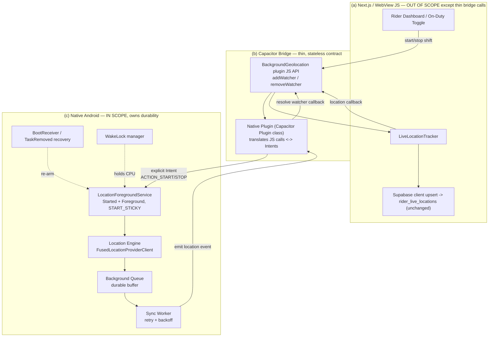
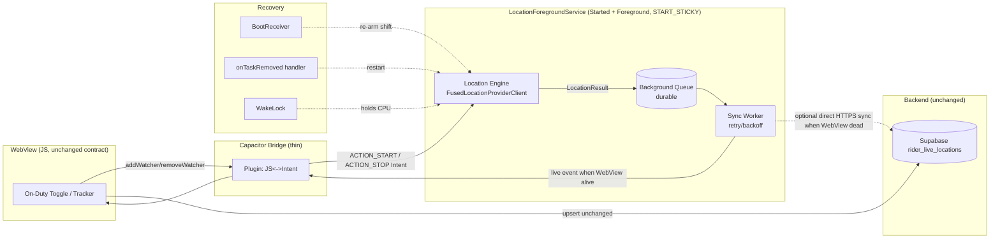
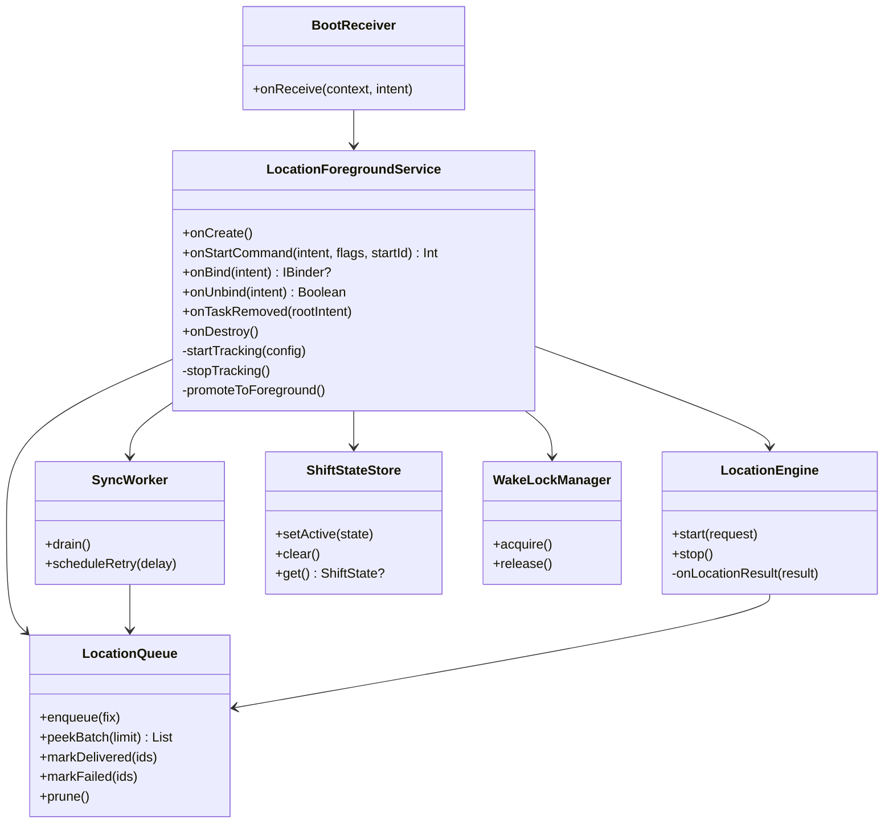
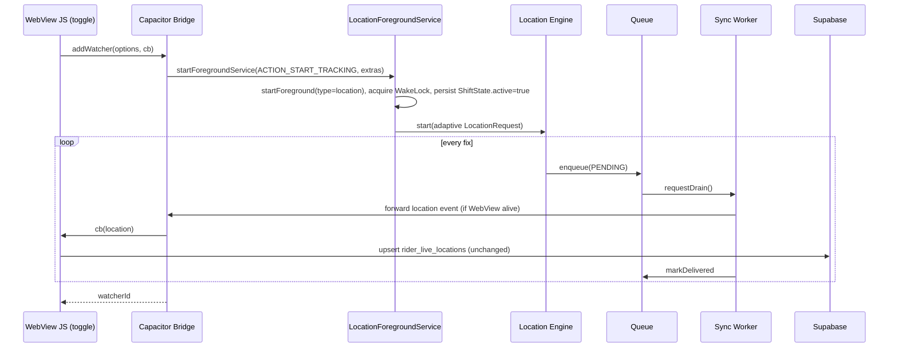
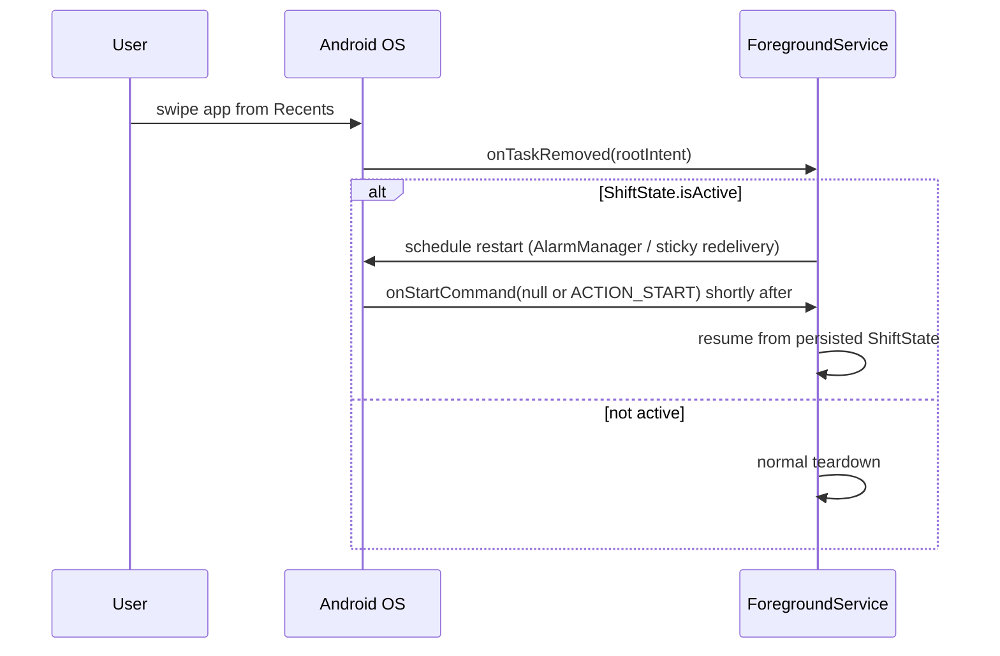
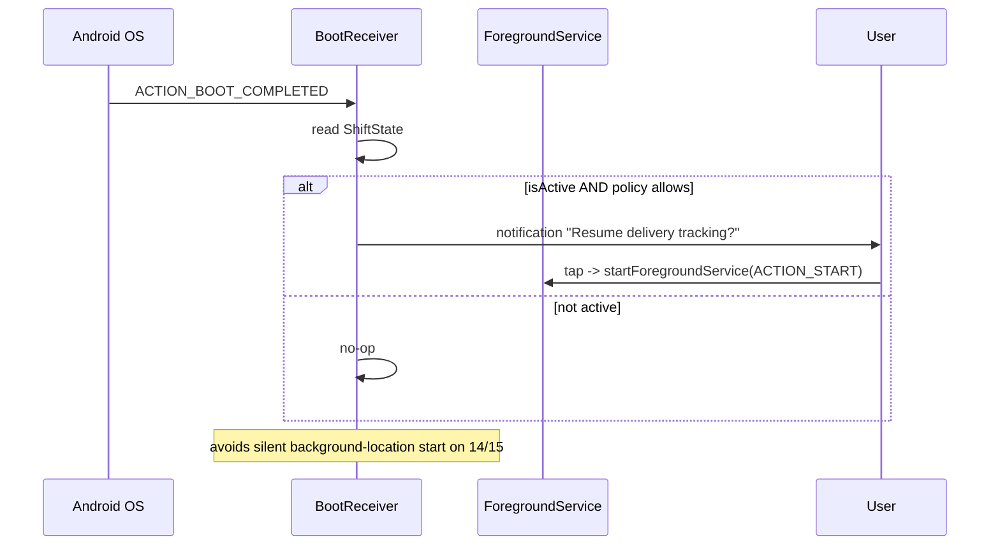
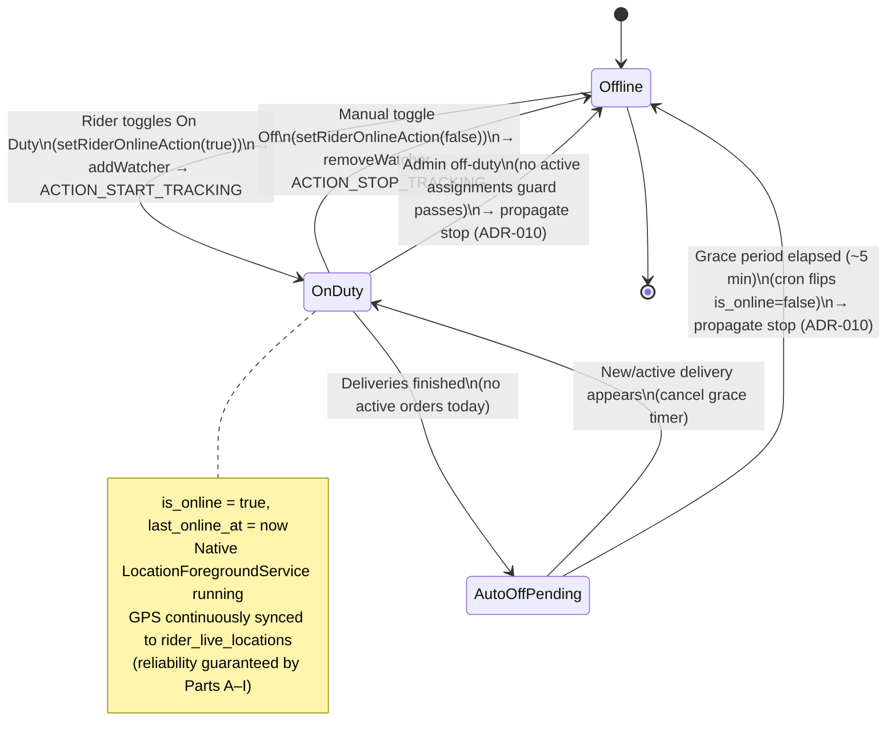
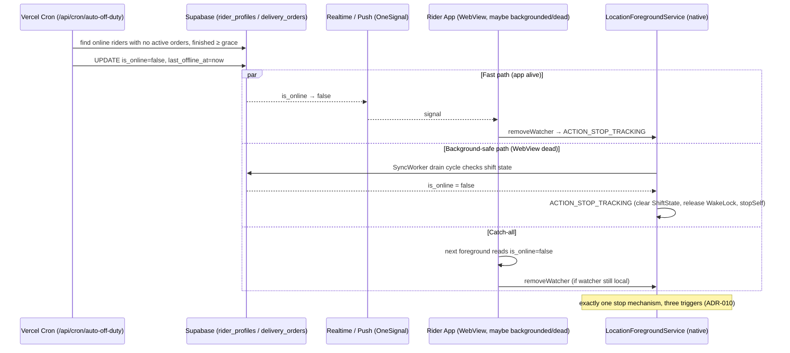
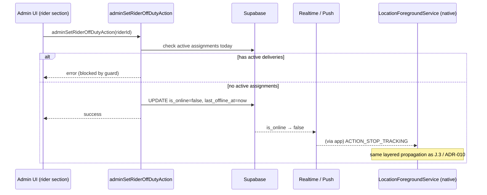

# Design Document: Android Background GPS Tracking + Rider Duty Lifecycle

## Scope Statement (Read First)

This document now covers **three tightly-related things** for the existing ArogyaDiet rider app (a Capacitor + Next.js 16 hybrid shell that is otherwise stable):

1. **Native background GPS reliability redesign** — the surgical redesign of the native Android background location layer so GPS keeps flowing for the whole shift regardless of app/device state. *(This is the original body of this document — Parts A through I — and is unchanged.)*
2. **Rider On Duty / Off Duty lifecycle** — the duty state machine that couples GPS to the On Duty toggle, plus **auto off-duty** (~5 min after deliveries finish) and **admin-initiated off-duty** (when a rider has no active assignments). *(New — see Part J.)*
3. **Additive duty UI** — the minimal, purely additive UI needed for the new duty controls, without altering existing screens. *(New — see Part J.6.)*

The scope is expanded but still **bounded**: the native redesign remains the foundation, and the duty lifecycle is layered on top of the *existing* `is_online` semantics and the *existing* `addWatcher/removeWatcher` + `rider_live_locations` contract. No behaviour of customer tracking, admin tracking, or the delivery flow changes.

**Explicitly OUT OF SCOPE (must remain 100% unchanged in behaviour and UI):**
- **Customer live tracking** (`LiveTrackingMap.tsx`) — read path from `rider_live_locations` + realtime subscription, gated by delivery status. Unchanged; it merely benefits from more continuous data.
- **Admin live tracking** (`AdminLiveTrackingMap.tsx`, `liveTrackingActions.ts`) — read path from `rider_live_locations`, gated by `is_online`. Unchanged behaviour/UI; it merely benefits from continuous data (an *additive* admin off-duty control is the only visible addition, Part J.6).
- **Delivery flow**, order lifecycle, routing/dispatch, and business logic **unrelated to duty state**.
- **Authentication**, session management, middleware, role-based access.
- **Supabase schema redesign** — no schema redesign; reuse existing `rider_profiles` columns. Any additive column/setting is called out explicitly and kept minimal (Part J.4).
- Next.js architecture, navigation, notifications transport (OneSignal/FCM) internals.

**IN SCOPE:**
- The native Android background location service and its lifecycle (Parts A–I).
- The Capacitor bridge contract between the WebView JavaScript and the native service.
- A recommendation on whether to retain, fork-and-harden, or replace `@capacitor-community/background-geolocation`.
- Manifest entries, permissions, receivers, and Android 13/14/15 foreground service (FGS) compliance for location.
- **Rider duty lifecycle logic** (Part J): On Duty ⇄ GPS coupling, auto off-duty, admin-initiated off-duty, and how an off-duty decision reaches and stops the native service even when the app is backgrounded/dead.
- **Additive duty UI** (Part J.6): the admin off-duty control and an optional rider-side auto-off-duty indication.

**Constraints honored throughout:**
- Keep Capacitor as the app shell.
- Minimize changes to existing JavaScript. The consuming components (`rider-status-toggle.tsx`, `LiveLocationTracker.tsx`) call `addWatcher` / `removeWatcher` and upsert to `rider_live_locations`. The redesign preserves this public JS contract so those files change minimally or not at all. The duty-lifecycle additions are **additive** (new server actions, a new cron endpoint, and additive UI) and do not rewrite the existing toggle behaviour.
- Prefer reusing existing `rider_profiles` columns (`is_online`, `last_online_at`, `last_offline_at`). DB changes, if any, are additive only — no schema redesign.
- No implementation code in this document — architecture, diagrams, pseudocode, and signatures only.

---

## Overview

The rider app must keep GPS flowing to the backend while the rider is On Duty, regardless of what the phone is doing — app minimized, screen off, Google Maps in the foreground, phone/WhatsApp calls active, app-switching, screen sleep, temporary memory pressure, and device reboot. The current implementation stops tracking under most of these conditions because the location service is architected as a **Bound Service** whose lifetime is tied to the WebView Activity binding, not to the delivery shift.

The redesign moves the native layer to a **Foreground Started Service** model with an explicit, shift-scoped lifecycle that is independent of the UI. The service is started with an explicit `Intent`, returns `START_STICKY` from `onStartCommand()`, holds a partial `WakeLock`, implements `onTaskRemoved()` for swipe-away recovery, and is re-armed after reboot via a `BootReceiver`. Locations are captured by a Location Engine, buffered in a durable Background Queue, and drained to the backend by a Sync worker with retry — decoupling GPS capture from network availability and from the WebView being alive.

Two things are true at once and both are addressed below: several investigation findings are **genuine root causes** of tracking loss, and a few are **defensible or intentional design decisions** in the community plugin that we should not "fix" blindly. The audit section separates the two before any architecture is proposed.

---

## Part A — Independent Architecture Audit

Each finding from the investigation report is independently assessed. The verdict is one of:
- **ROOT CAUSE** — directly causes tracking to stop or fail to recover; must be fixed.
- **CONTRIBUTING** — does not stop tracking alone but materially reduces reliability/robustness.
- **INTENTIONAL / DEFENSIBLE** — a deliberate design decision (often a valid tradeoff for the plugin's general-purpose audience) that is not a bug per se, though it may not fit our fleet-tracking use case.
- **NEEDS VERIFICATION** — cannot be confirmed as a defect from the report alone; requires device/version testing.

### Audit table

| # | Finding | Verdict | Independent assessment |
|---|---------|---------|------------------------|
| 1 | Plugin is a general-purpose community plugin, not built for delivery/fleet/long-running GPS. | **INTENTIONAL / DEFENSIBLE** | This is accurate but is a *fit* problem, not a defect. The plugin optimizes for broad compatibility and crash-safety across many app types. It is not wrong; it is simply not specialized for continuous logistics tracking. This finding is the lens for the retain/fork/replace decision (Part C), not a root cause on its own. |
| 2 | Service is a Bound Service — lifetime tied to binding lifecycle. | **ROOT CAUSE** | Confirmed as the primary structural root cause. A pure bound service is destroyed when the last client unbinds. When the WebView Activity is backgrounded/killed, the binding drops and Android reclaims the service. This is the single largest contributor to "GPS stops when app is minimized." |
| 3 | `onUnbind()` calls `removeLocationUpdates()` AND `stopSelf()`. | **ROOT CAUSE** | Confirmed. This is the concrete mechanism of finding #2. Unbind → GPS removed → service self-terminates. For our use case tracking must outlive the binding, so this behavior is disqualifying as-is. |
| 4 | `removeLocationUpdates()` explicitly stops GPS before service terminates. | **ROOT CAUSE (mechanism of #3)** | Confirmed but not an *independent* root cause — it is the teardown step invoked by #3. Cleaning up location callbacks on genuine stop is correct behavior; the defect is *when* it is triggered (on unbind rather than on explicit shift stop). |
| 5 | No `onStartCommand()` — never a proper Started Service, no lifecycle independent of UI. | **ROOT CAUSE** | Confirmed. Without a started lifecycle, the OS has no contract to keep the service alive independent of the Activity, and cannot restart it. This is the counterpart to #2 and must be introduced. |
| 6 | `START_STICKY` missing — no restart strategy if Android kills the process. | **ROOT CAUSE** | Confirmed. Even a foreground service can be killed under memory pressure. Without a sticky return value, the OS will not recreate the service. Directly explains "does not survive memory pressure." Depends on #5 being implemented first. |
| 7 | `onTaskRemoved()` not implemented — no recovery when user swipes app away. | **ROOT CAUSE** | Confirmed. Swipe-away removes the task; without `onTaskRemoved()` handling (restart via `AlarmManager`/sticky intent), tracking dies on swipe. This is a distinct recovery path from #6. |
| 8 | `BootReceiver` missing — cannot recover after reboot. | **CONTRIBUTING** | Confirmed as a real gap, but classified CONTRIBUTING rather than ROOT CAUSE because reboot recovery is a *policy choice* with UX and Play-policy nuances (auto-starting background location after reboot without user action is sensitive). It is needed for the "survives reboot" success criterion, but must be gated on an active-shift flag and re-prompt rather than silently resuming. |
| 9 | `WakeLock` not implemented — no CPU protection while screen sleeps. | **CONTRIBUTING** | Partially valid. A foreground *location* service already receives location callbacks with the screen off on most devices; FusedLocationProvider does not strictly require an app WakeLock. However, on aggressive OEM builds (Xiaomi/MIUI, Oppo/ColorOS, Vivo, Samsung) CPU throttling during Doze can delay delivery/sync. A **partial WakeLock scoped to the shift** is justified as defense-in-depth, but it is a robustness enhancement, not the primary root cause. Note: the app currently masks this with `@capacitor-community/keep-awake` (screen stays on), which is a battery-costly workaround the redesign can relax. |
| 10 | Android 14/15 FGS compliance needs verification (`startForeground` with `NOTIFICATION_ID`, FGS type=location). | **NEEDS VERIFICATION → then ROOT CAUSE if non-compliant** | On Android 14+, a foreground service must declare `android:foregroundServiceType="location"`, hold location permission at `startForeground()` time, and call `startForeground()` within the allowed window. If the plugin does not fully comply, the OS throws or silently refuses to keep the FGS alive on 14/15 — which would present as "stops on newer phones." Must be verified on real 13/14/15 devices; the target design mandates full compliance regardless. |
| 11 | GPS frequency very aggressive (interval 1000ms, maxWait 1000ms). | **INTENTIONAL / DEFENSIBLE (but mis-tuned)** | This is a configuration tradeoff, not a defect. 1s cadence is defensible for turn-by-turn but wasteful for delivery route breadcrumbing and it accelerates battery drain and OEM battery-killer intervention (which *indirectly* causes tracking loss). Note the existing JS already mitigates on the plugin's `distanceFilter`/throttle path (`distanceFilter: 25`, 3s DB write throttle). Recommendation: adaptive cadence (see Part D), not a blind reduction. |
| 12 | Plugin author comment (issue #59): FGS outliving the Activity caused crashes; plugin stops the service instead of redesigning. | **INTENTIONAL / DEFENSIBLE** | This is the crux. The plugin's stop-on-unbind is a *deliberate crash-avoidance decision*, not an oversight. It trades continuous tracking for stability across its broad user base. Our use case has the opposite priority (continuity > avoiding a rare lifecycle crash). This finding validates that we cannot simply "patch" the plugin's philosophy — we must change the lifecycle model, and do so while correctly handling the crash class the author was avoiding (service/Activity lifecycle decoupling done right). |

### Audit conclusions

- **True root causes (must fix):** #2, #3, #5, #6, #7 — all facets of one core defect: *the location service has no lifecycle independent of the UI binding.*
- **Mechanism of a root cause (not independent):** #4.
- **Contributing / robustness:** #8, #9.
- **Needs device verification, then mandatory compliance:** #10.
- **Intentional/defensible design decisions (do not blindly "fix"):** #1, #11, #12.

The single-sentence root cause: **tracking stops because the location service is a bound service that self-terminates on unbind, and it was intentionally designed that way to avoid a lifecycle crash.** The fix is a properly decoupled Foreground Started Service, not a patch to the plugin's teardown.

---

## Part B — Layer Responsibility Separation

The system has three layers. The redesign sharpens the boundary so the native layer owns durability and the web layer owns intent and business meaning.



### (a) Next.js / WebView JavaScript responsibilities
- Decide **when** a shift starts and stops (On-Duty toggle, delivery start/stop) — unchanged business logic.
- Call the existing bridge API (`addWatcher` to start, `removeWatcher` to stop). This is the only coupling point and stays byte-for-byte compatible.
- Receive location callbacks and **persist to Supabase** (`rider_live_locations` upsert) exactly as today, including session-hijack detection and write throttling. **No change.**
- Own all UI, permissions prompting UX copy, and shift semantics.
- **Does NOT** own service lifecycle, retry, buffering, or survival across app death. The web layer may be dead while tracking continues natively.

### (b) Capacitor bridge responsibilities
- Provide a **thin, stateless translation** between the JS `addWatcher/removeWatcher` API and native `Intent`s (`ACTION_START_TRACKING`, `ACTION_STOP_TRACKING`).
- Forward native location events back to the registered JS callback **when the WebView is alive**.
- Hold **no durable state** and make **no lifecycle decisions**. If the WebView is dead, the bridge simply is not there to forward events — the native queue absorbs them.
- Marshal watcher options (notification text, distanceFilter, cadence) into the start Intent extras.

### (c) Native Android layer responsibilities (the redesign)
- Own the **Foreground Started Service** lifecycle independent of the Activity/WebView.
- Run the **Location Engine** (FusedLocationProviderClient) with the configured request.
- **Buffer** every fix in a durable **Background Queue** so nothing is lost when the network or WebView is unavailable.
- **Sync** buffered fixes with retry/backoff (and optionally forward live to the bridge for the existing Supabase path).
- **Recover**: `START_STICKY`, `onTaskRemoved()`, `BootReceiver` (gated), WakeLock.
- Enforce **Android 13/14/15 FGS compliance** (type=location, notification, permission timing).

---

## Part C — Plugin Decision: Retain / Fork-and-Harden / Replace

### Options considered

| Option | What it means | Pros | Cons |
|--------|---------------|------|------|
| **Retain as-is** | Keep `@capacitor-community/background-geolocation` v1.2.26 unchanged, tune only JS options. | Zero native work; already integrated; JS contract intact. | Cannot fix root causes #2/#3/#5/#6/#7 from JS — they are structural in the native service. Fails the core success criteria. **Rejected.** |
| **Fork-and-Harden** | Fork the plugin, keep its Capacitor JS API and plugin registration, and **replace the service internals** with a Started+Foreground lifecycle (onStartCommand/START_STICKY/onTaskRemoved/BootReceiver/WakeLock/queue) while correctly decoupling from the Activity to avoid the issue-#59 crash class. | Preserves the existing JS bridge contract → **minimal/zero JS changes** (honors the constraint). Reuses permission handling, notification plumbing, and Capacitor plugin scaffolding already working. Smallest blast radius. Full control over lifecycle and compliance. | Must maintain a fork (rebase on upstream occasionally). Requires native Android expertise. Must correctly handle the lifecycle-decoupling crash the author avoided. |
| **Replace** | Write a new first-party Capacitor plugin (or adopt a commercial one like `@transistorsoft/capacitor-background-geolocation`). | Purpose-built; commercial option is battle-tested for fleet tracking. | New/commercial plugin changes the JS API → larger JS changes (violates "minimize JS changes"). Commercial licensing cost. Larger blast radius and re-test surface. Greenfield plugin = reimplementing permissions/notification/bridge already solved. |

### Recommendation: **FORK-AND-HARDEN**

Rationale:
1. **Honors the hard constraint** to minimize JavaScript changes. Keeping the plugin's `addWatcher/removeWatcher` surface means `rider-status-toggle.tsx` and `LiveLocationTracker.tsx` continue to work unchanged (or with option-only tweaks). No new plugin API, no re-test of the entire web integration.
2. **The defect is localized** to the native service lifecycle (Part A). Everything else the plugin does — permission negotiation, FusedLocationProvider wiring, notification, Capacitor registration — is reusable and working. Replacing all of it is disproportionate to a lifecycle-shaped problem.
3. **Smallest blast radius** consistent with the scope statement: we touch only native Android files inside the fork.
4. A full replacement (especially commercial) is the right call **only if** device verification (finding #10) reveals the plugin's FGS/permission plumbing is fundamentally non-compliant on 14/15 in ways that are cheaper to rebuild than to patch. Treat replacement as the documented fallback (see ADR-001 alternatives), not the default.

### Minimum architectural changes to make the fork production-ready

The fork must change the native service from a Bound Service into a **Started + Foreground Service** and add recovery. Minimum change set:

1. **Introduce a Started lifecycle**: implement `onStartCommand()`, return `START_STICKY`. Start via explicit `Intent` from the plugin's `addWatcher` path (instead of / in addition to `bindService`).
2. **Decouple from the binding**: `onUnbind()` must **not** call `removeLocationUpdates()`/`stopSelf()`. Teardown happens only on explicit `ACTION_STOP_TRACKING` (mapped from `removeWatcher`) or when the OS destroys the service. Binding becomes optional (for live event forwarding only). This directly addresses issue #59: the service no longer *depends* on the Activity, and Activity death is a normal, handled transition rather than a crash trigger.
3. **FGS compliance**: call `startForeground(NOTIFICATION_ID, notification)` with `foregroundServiceType=location` inside `onStartCommand()` within the permitted window; guard on runtime location permission held at start time (Android 13/14/15).
4. **Swipe-away recovery**: implement `onTaskRemoved()` to schedule a restart (sticky redelivery / `AlarmManager` alarm) while a shift is active.
5. **Reboot recovery**: add a `BootReceiver` (registered in manifest) that, only if a persisted "active shift" flag is set, re-arms the service (see ADR-004 for the Play-policy-safe gating).
6. **WakeLock**: acquire a partial `WakeLock` on start, release on stop, scoped to the shift, as OEM-Doze defense-in-depth (ADR-005).
7. **Durability**: insert a **Background Queue** between the Location Engine and delivery, plus a **Sync Worker** with retry/backoff so fixes survive network gaps and WebView death (ADR-003).
8. **Adaptive cadence**: replace fixed 1000ms/1000ms with an adaptive request profile (ADR-006) to reduce battery-driven OEM kills.

---

## Part D — High-Level Design

### Target architecture



Note the two delivery paths (`S -> P -> T -> DB` and the optional `S -> DB`) are discussed in ADR-002. The default keeps the existing JS Supabase upsert as the primary path to honor "minimize JS changes"; the direct-sync path is an optional durability enhancement for when the WebView is dead.

### Component responsibilities (high level)

- **LocationForegroundService** — the durable owner. Started by explicit intent, foreground with a location-typed notification, sticky. Hosts the engine, queue, and sync worker. Survives Activity death, minimization, screen-off, and (via recovery) swipe-away, memory pressure, and reboot.
- **Location Engine** — wraps FusedLocationProviderClient; requests fixes per the adaptive profile; hands each fix to the queue.
- **Background Queue** — durable, ordered buffer of pending location fixes. Decouples capture from delivery. Bounded with an eviction policy.
- **Sync Worker** — drains the queue with retry/backoff; marks fixes delivered; forwards live events to the bridge when available.
- **Recovery components** — `BootReceiver`, `onTaskRemoved` restart, `WakeLock`.

### Data models (location queue / sync)

These models live **only in the native layer**. They do **not** alter the Supabase `rider_live_locations` schema (out of scope). They are the in-device durability structures.

```pascal
STRUCTURE QueuedLocation
  localId        : Long              // autoincrement primary key (local DB)
  riderId        : String            // passed in start Intent extras
  lat            : Double
  lng            : Double
  accuracyM      : Float
  speedMps       : Float?            // nullable
  bearingDeg     : Float?            // nullable
  capturedAtEpoch: Long              // device time of fix (ms)
  state          : SyncState         // PENDING | IN_FLIGHT | DELIVERED | FAILED
  attemptCount   : Int               // retry counter
  lastAttemptAt  : Long?             // ms epoch of last sync attempt
END STRUCTURE

ENUM SyncState
  PENDING       // captured, not yet sent
  IN_FLIGHT     // sync attempt in progress
  DELIVERED     // confirmed persisted (then eligible for pruning)
  FAILED        // exhausted immediate retries; awaits next drain cycle
END ENUM

STRUCTURE ShiftState            // persisted flag for recovery decisions
  isActive       : Boolean          // true while a shift is On Duty
  riderId        : String
  startedAtEpoch : Long
  watcherId      : String            // maps to the JS watcher for bridge callbacks
  notifTitle     : String
  notifMessage   : String
END STRUCTURE
```

**Queue validation / policy rules:**
- Queue is bounded (e.g. max N fixes or max age). On overflow, evict oldest `DELIVERED` first, then oldest `PENDING` (breadcrumb thinning) — never drop the most recent fix.
- `DELIVERED` rows are pruned after a retention window (e.g. 24h) to bound storage.
- `capturedAtEpoch` is monotonic per shift; out-of-order fixes are tolerated but timestamped by capture, not by send.
- `ShiftState.isActive` is the single source of truth used by `BootReceiver` and `onTaskRemoved` to decide whether to re-arm.

---

## Part E — Low-Level Design

> Signatures are shown in Kotlin-style notation (Android's modern standard; Java equivalents are 1:1). These are **design signatures only — no implementation bodies**.

### E.1 Native service class structure



### E.2 Key method signatures with formal specifications

#### `LocationForegroundService.onStartCommand()`

```kotlin
override fun onStartCommand(intent: Intent?, flags: Int, startId: Int): Int
```

**Preconditions:**
- Called by the OS after an explicit `startForegroundService(intent)` from the bridge, or by OS redelivery after a kill.
- If `intent.action == ACTION_START_TRACKING`, extras contain `riderId`, `notifTitle`, `notifMessage`, and cadence config.
- Runtime `ACCESS_FINE_LOCATION` (and `ACCESS_BACKGROUND_LOCATION` where required) is held.

**Postconditions:**
- `startForeground(NOTIFICATION_ID, notification)` has been called with `foregroundServiceType=location` **before** returning (Android 14/15 window compliance).
- On `ACTION_START_TRACKING`: Location Engine is running, WakeLock held, `ShiftState.isActive = true` persisted.
- On `ACTION_STOP_TRACKING`: engine stopped, WakeLock released, `ShiftState` cleared, `stopSelf()` called.
- On `null` intent (OS redelivery after kill): if `ShiftState.isActive`, tracking is resumed from persisted config; else the service stops itself.
- **Returns `START_STICKY`** so the OS recreates the service after a low-memory kill.

**Loop invariants:** N/A (dispatch method, no loop).

---

#### `LocationForegroundService.onTaskRemoved()`

```kotlin
override fun onTaskRemoved(rootIntent: Intent?)
```

**Preconditions:** User has swiped the app from Recents; the service may still be running.

**Postconditions:**
- If `ShiftState.isActive == true`: a restart is scheduled (a pending `START` intent via `AlarmManager`/`setExact` or sticky redelivery), guaranteeing the service returns even if the OS tears the task down. Notification remains.
- If `ShiftState.isActive == false`: no restart scheduled; normal teardown proceeds.
- Never removes location updates purely because the task was removed (this is the corrected behavior vs. the audited `onUnbind` defect).

**Loop invariants:** N/A.

---

#### `LocationForegroundService.onUnbind()` (corrected behavior)

```kotlin
override fun onUnbind(intent: Intent?): Boolean
```

**Preconditions:** The WebView Activity has unbound (e.g. app backgrounded/destroyed).

**Postconditions:**
- **Does NOT** call `removeLocationUpdates()` or `stopSelf()` (this is the core audit fix for findings #2/#3/#4).
- Live event forwarding to the bridge pauses; the queue continues buffering.
- Returns `false` (no `onRebind`) **or** `true` if we choose to support rebind for resumed live forwarding — decision recorded in ADR-002.

**Loop invariants:** N/A.

---

#### `LocationForegroundService.onDestroy()`

```kotlin
override fun onDestroy()
```

**Preconditions:** OS is destroying the service (explicit stop, or kill before `START_STICKY` recreation).

**Postconditions:**
- Location Engine stopped and callbacks removed (legitimate cleanup — correct here, unlike on unbind).
- WakeLock released if held.
- Queue is **flushed to durable storage** (never dropped in memory).
- If destruction was NOT an explicit shift stop and `ShiftState.isActive`, rely on `START_STICKY`/`onTaskRemoved` scheduling to bring the service back.

**Loop invariants:** N/A.

---

#### `BootReceiver.onReceive()`

```kotlin
override fun onReceive(context: Context, intent: Intent?)
```

**Preconditions:** Device finished booting (`ACTION_BOOT_COMPLETED`); receiver declared in manifest with `RECEIVE_BOOT_COMPLETED` permission.

**Postconditions:**
- Reads persisted `ShiftState`. If `isActive == true`: re-arms tracking in a **Play-policy-safe** manner — see ADR-004 (e.g. post a notification prompting the rider to resume, or resume automatically only if permission + policy allow). Does **not** silently start background location if it would violate policy.
- If `isActive == false`: does nothing.

**Loop invariants:** N/A.

---

#### `SyncWorker.drain()`

```kotlin
suspend fun drain(): DrainResult
```

**Preconditions:** Called on a background dispatcher; network state may be up or down.

**Postconditions:**
- Peeks a batch of `PENDING` fixes, marks them `IN_FLIGHT`, attempts delivery.
- On success: marks `DELIVERED`; on failure: marks `FAILED`, increments `attemptCount`, schedules retry with exponential backoff + jitter.
- Never loses a fix: a crash mid-drain leaves rows recoverable as `PENDING`/`FAILED` (idempotent, at-least-once).
- Live-forwards delivered fixes to the bridge callback if the WebView is bound.

**Loop invariants:**
- At all times, every captured fix is in exactly one state; the count of non-`DELIVERED` fixes never silently decreases except by explicit eviction policy.

---

#### `LocationEngine.start()` / `onLocationResult()`

```kotlin
fun start(request: LocationRequest)
private fun onLocationResult(result: LocationResult)
```

**Preconditions (`start`):** Location permission held; Google Play Services available.
**Postconditions (`start`):** FusedLocationProviderClient is requesting updates on the adaptive profile; each fix routes to `onLocationResult`.
**Postconditions (`onLocationResult`):** Each valid fix is `enqueue`d into `LocationQueue` with `state = PENDING` and a capture timestamp; invalid/stale fixes (per accuracy threshold) are dropped before enqueue.

---

### E.3 Intent contracts (Capacitor bridge ⇄ native service)

The bridge translates the existing JS API into these intents. **JS API surface is unchanged.**

| JS call | Intent action | Extras | Effect |
|---------|---------------|--------|--------|
| `addWatcher(options, cb)` | `ACTION_START_TRACKING` | `riderId:String`, `notifTitle:String`, `notifMessage:String`, `distanceFilterM:Float`, `desiredIntervalMs:Long`, `fastestIntervalMs:Long`, `requestPermissions:Boolean`, `stale:Boolean` | `startForegroundService()` → service starts/continues; returns a `watcherId` string to JS. |
| `removeWatcher({id})` | `ACTION_STOP_TRACKING` | `watcherId:String` | Explicit stop: engine off, WakeLock released, `ShiftState` cleared, `stopSelf()`. |
| (OS redelivery) | `null` action | — | Resume from persisted `ShiftState` if active. |
| (bootup) | `ACTION_BOOT_REARM` (internal) | — | BootReceiver → policy-safe re-arm. |
| (native→JS) | event forwarded via plugin | `location{lat,lng,accuracy,speed,bearing,time}` or `error{code,message}` | Resolves the JS `addWatcher` callback (same shape the JS already consumes). |

**Contract invariants:**
- The `location` event payload shape delivered to JS is **identical** to today's plugin payload (`latitude`, `longitude`, `accuracy`, `altitude`, `bearing`, `speed`, `time`) so `LiveLocationTracker`/`rider-status-toggle` need no changes.
- `addWatcher` returning a `watcherId` string and `removeWatcher({id})` semantics are preserved.

### E.4 AndroidManifest.xml entries (design)

```xml
<!-- Permissions -->
<uses-permission android:name="android.permission.ACCESS_FINE_LOCATION" />
<uses-permission android:name="android.permission.ACCESS_COARSE_LOCATION" />
<uses-permission android:name="android.permission.ACCESS_BACKGROUND_LOCATION" />
<uses-permission android:name="android.permission.FOREGROUND_SERVICE" />
<uses-permission android:name="android.permission.FOREGROUND_SERVICE_LOCATION" /> <!-- Android 14+ -->
<uses-permission android:name="android.permission.WAKE_LOCK" />
<uses-permission android:name="android.permission.RECEIVE_BOOT_COMPLETED" />
<uses-permission android:name="android.permission.POST_NOTIFICATIONS" /> <!-- Android 13+ -->
<uses-permission android:name="android.permission.INTERNET" />
<uses-permission android:name="android.permission.ACCESS_NETWORK_STATE" />

<!-- Foreground Started Service, typed location (Android 14/15 compliance) -->
<service
    android:name=".location.LocationForegroundService"
    android:exported="false"
    android:foregroundServiceType="location" />

<!-- Boot recovery receiver (gated re-arm) -->
<receiver
    android:name=".location.BootReceiver"
    android:exported="true"
    android:enabled="true">
    <intent-filter>
        <action android:name="android.intent.action.BOOT_COMPLETED" />
        <action android:name="android.intent.action.QUICKBOOT_POWERON" />
    </intent-filter>
</receiver>
```

Compliance notes:
- Android 13: `POST_NOTIFICATIONS` runtime prompt required for the FGS notification to show.
- Android 14: `foregroundServiceType="location"` mandatory; `FOREGROUND_SERVICE_LOCATION` permission required; location permission must be held at `startForeground()`.
- Android 15: stricter FGS timeout/BAL rules — start the FGS from an allowed context (from the toggle interaction / bound Activity), not from a cold background trigger, to avoid `ForegroundServiceStartNotAllowedException`. Reboot re-arm must therefore be policy-safe (ADR-004).

### E.5 WakeLock handling (design)

- **Type:** `PARTIAL_WAKE_LOCK` (CPU on, screen/keyboard off), tagged `arogyadiet:location-shift`.
- **Acquire:** in `startTracking()` after `startForeground()`.
- **Release:** in `stopTracking()` and `onDestroy()`; always release in a `finally` path to avoid leaks.
- **Scope:** strictly the shift; never indefinite. Consider a safety timeout with re-acquire on each fix as a leak guard.
- **Interaction with existing `keep-awake`:** the current JS uses `@capacitor-community/keep-awake` to hold the *screen* on (heavy battery). With a proper partial WakeLock + FGS, the screen no longer needs to stay on; the JS `keep-awake` call can be relaxed later, but that is an optional JS change and not required for correctness (ADR-005).

### E.6 Queue / retry strategy (design)

```pascal
PROCEDURE onLocationFix(fix)
  IF NOT passesAccuracyGate(fix) THEN RETURN
  queue.enqueue(fix WITH state = PENDING)
  IF network.isAvailable() THEN
    syncWorker.requestDrain()      // opportunistic immediate send
  END IF
END PROCEDURE

PROCEDURE drain()
  batch <- queue.peekBatch(limit = 50, state = PENDING)
  IF batch is empty THEN RETURN
  queue.mark(batch, IN_FLIGHT)
  result <- deliver(batch)          // primary: forward to bridge->Supabase; fallback: direct HTTPS
  IF result.success THEN
    queue.markDelivered(batch)
    queue.prune()
  ELSE
    queue.markFailed(batch)
    delay <- min(BASE * 2^attempt, MAX_BACKOFF) + jitter
    scheduleRetry(delay)
  END IF
END PROCEDURE
```

**Retry policy:** exponential backoff with jitter, capped (e.g. base 5s, cap 5min). At-least-once delivery; the backend upsert on `rider_id` (existing behavior) makes duplicates idempotent for live position. For breadcrumb history (if ever added), delivery would key on `capturedAtEpoch` — but that is out of current scope.

---

## Part F — Lifecycle & Sequence Diagrams

### F.1 Shift start → continuous tracking (happy path)



### F.2 App minimized / screen off / other app foreground

```mermaid
sequenceDiagram
    participant User
    participant Act as WebView Activity
    participant SVC as ForegroundService
    participant ENG as Location Engine
    participant Q as Queue

    User->>Act: press Home / open Google Maps / screen off
    Act->>SVC: onUnbind() (binding drops)
    Note over SVC: CORRECTED: does NOT stop GPS or self-terminate
    SVC->>SVC: remains foreground (sticky notification), WakeLock held
    loop keeps tracking
        ENG->>Q: enqueue(PENDING)
        Note over Q: buffers; live-forward paused (no WebView)
    end
    User->>Act: reopen app
    Act->>SVC: onBind()/rebind
    SVC->>Act: resume forwarding buffered + live fixes
```

### F.3 Swipe-away recovery (onTaskRemoved)



### F.4 Low-memory kill recovery (START_STICKY)

```mermaid
sequenceDiagram
    participant OS as Android OS
    participant SVC as ForegroundService

    Note over OS: memory pressure -> kills service process
    OS->>SVC: (later) recreate service, onStartCommand(intent=null)
    SVC->>SVC: read ShiftState; if active, resume tracking
    Note over SVC: START_STICKY made recreation possible
```

### F.5 Reboot recovery (policy-safe)



---

## Part G — Architecture Decision Records (ADRs)

### ADR-001: Fork-and-harden the community plugin (vs. retain or replace)
- **Status:** Proposed
- **Context:** Root causes are structural in the native service lifecycle; JS contract must stay stable.
- **Decision:** Fork `@capacitor-community/background-geolocation`, keep its JS API + Capacitor registration, rebuild the service internals as a Started+Foreground service with recovery.
- **Consequences:** Minimal JS change; must maintain the fork and correctly decouple lifecycle to avoid issue #59's crash class.
- **Alternatives & fallback:** Full replacement (first-party or commercial `@transistorsoft/...`) if device verification proves the plugin's FGS/permission plumbing is fundamentally non-compliant on 14/15.

### ADR-002: Primary delivery path stays JS→Supabase; native direct-sync is optional fallback
- **Status:** Proposed
- **Context:** "Minimize JS changes" vs. "deliver even when WebView is dead."
- **Decision:** Keep the existing JS Supabase upsert as the primary delivery path (live-forward from native when WebView alive). Add an **optional** native direct-HTTPS sync path used only when the WebView is unavailable and the queue is backing up.
- **Consequences:** No required JS change for the common case; the optional path needs a native-side credential/endpoint strategy (must reuse existing API contracts, not invent new ones — out-of-scope to change contracts, so this uses the same endpoint the JS uses).
- **Note:** If the direct path proves complex/credential-sensitive, ship queue+live-forward only in Phase 1 and defer direct-sync.

### ADR-003: Durable on-device queue between capture and delivery
- **Status:** Proposed
- **Decision:** Buffer every fix in a durable local store; deliver via a retrying Sync Worker; at-least-once with idempotent upsert.
- **Consequences:** No fixes lost on network gaps / WebView death; bounded storage via eviction + pruning.

### ADR-004: Reboot re-arm is policy-safe, not silent
- **Status:** Proposed
- **Context:** Android 14/15 restrict starting background location without user-visible context; Play policy scrutinizes background location.
- **Decision:** BootReceiver re-arms only when `ShiftState.isActive`, and prefers a user-tap notification to resume rather than silently starting background GPS.
- **Consequences:** Satisfies "survives reboot" while staying Play-compliant; a reboot mid-shift needs one rider tap in the worst case.

### ADR-005: Partial WakeLock scoped to shift; relax screen keep-awake
- **Status:** Proposed
- **Decision:** Use a `PARTIAL_WAKE_LOCK` for CPU during Doze; do not require the screen to stay on. The existing JS `keep-awake` can be relaxed later (optional).
- **Consequences:** Better battery than screen-on; defense against OEM CPU throttling.

### ADR-006: Adaptive location cadence (replace fixed 1000ms/1000ms)
- **Status:** Proposed
- **Context:** Finding #11 — aggressive cadence is defensible for turn-by-turn but wasteful for delivery breadcrumbing and provokes OEM battery killers.
- **Decision:** Use an adaptive `LocationRequest` (e.g. faster when moving, slower when stationary; balanced priority when appropriate) with a sensible `distanceFilter`. Keep the JS-side 25m filter / 3s throttle intact.
- **Consequences:** Lower battery, fewer OEM interventions, negligible loss of route fidelity for delivery.

### ADR-007: Corrected unbind semantics
- **Status:** Proposed
- **Decision:** `onUnbind()` must not stop GPS or self-terminate; teardown only on explicit stop or OS destroy. Binding is for live event forwarding only.
- **Consequences:** Directly fixes the primary root cause (findings #2/#3/#4); Activity death becomes a normal transition.

### ADR-008: Auto off-duty timer lives server-side (Vercel cron), not on the client or native
- **Status:** Proposed
- **Context:** Riders forget to toggle Off Duty. We need to auto-mark them Off Duty ~5 minutes after their deliveries finish. The trigger could live in three places: (a) a client-side `setTimeout` in the rider app, (b) the native service, or (c) a server-side scheduled job.
- **Options:**
  - **Client timer** — a `setTimeout` in `rider-status-toggle.tsx`/dashboard. *Rejected:* dies when the app is backgrounded/killed (the exact condition the native redesign exists for), is easy to bypass, and duplicates state per device. It also cannot observe server-side delivery completion reliably.
  - **Native timer** — schedule an `AlarmManager` in the service. *Rejected as the source of truth:* the native layer does not (and by scope must not) own delivery/business meaning; "deliveries finished" is a server fact derived from `delivery_orders`. Native must *react* to off-duty, not *decide* it.
  - **Server-side scheduled job (chosen)** — a new `GET /api/cron/auto-off-duty` route, guarded by `CRON_SECRET`, registered in `vercel.json` (reusing the existing cron pattern, e.g. `/api/cron/link-products`). Runs every few minutes, finds riders who are `is_online = true` with **no active (non-terminal, post-pickup) `delivery_orders` for today** whose last relevant delivery completed **≥ grace period ago**, and flips them Off Duty.
- **Decision:** Put the timer/detection server-side as a scheduled cron endpoint. It is the single source of truth for "deliveries finished", survives app death, is testable, and reuses the established cron + `createAdminClient` server-action pattern.
- **"Finished delivery" definition:** a rider is eligible for auto off-duty when, for `delivery_date = today`, they have **zero** orders in an active state (`OUT_FOR_DELIVERY`, `ON_THE_WAY`, `REACHING_TO_LOCATION`, `PICKED`) **and** at least one order that reached a terminal state (`DELIVERED`/`FAILED`), with the most recent terminal transition older than the grace period. Riders with in-progress deliveries are never auto-flipped (guard is explicit — see Correctness Property 12).
- **Grace period:** configurable (default ~5 min) — see ADR-011.
- **Effect:** the cron sets `is_online = false` + `last_offline_at = now()` via the same update shape `setRiderOnlineAction` uses (no new column). Stopping the native service is handled by ADR-010 (propagation).
- **Consequences:** Auto off-duty granularity equals the cron cadence (e.g. checking every 2–5 min → effective off-duty within grace + one cadence tick). Acceptable for the "rider forgot to toggle" use case. Requires a small, additive cron route; no change to the toggle's happy path.

### ADR-009: Admin-initiated off-duty is a guarded server action, only when the rider has no active assignments
- **Status:** Proposed
- **Context:** Admins need to mark a rider Off Duty from the rider section, but only when no meals/deliveries are assigned to that rider (so we never yank tracking off a rider mid-delivery).
- **Decision:** Add a new admin server action `adminSetRiderOffDutyAction(riderId)` in `admin-actions` (co-located with `liveTrackingActions.ts`), using `createAdminClient`. It **guards** by re-checking, server-side, that the rider has **no active assignments today** (same active-status set as ADR-008) before flipping `is_online = false` + `last_offline_at`. If active assignments exist, it returns a typed error and makes no change. The guard is authoritative on the server — the UI's enable/disable state is only a hint.
- **Propagation & native stop:** same mechanism as auto off-duty (ADR-010).
- **UI:** an additive control in the existing admin rider area (Part J.6). No existing admin screen is redesigned.
- **Consequences:** Admins get a safe manual override; the active-assignment guard prevents disrupting an in-progress delivery. Reuses existing admin action + Supabase patterns.

### ADR-010: Off-duty propagation to a backgrounded/dead app — realtime signal with a foreground reconcile fallback
- **Status:** Proposed
- **Context:** Auto off-duty (ADR-008) and admin off-duty (ADR-009) flip `is_online = false` **server-side**, while the rider's app may be backgrounded or killed and the native `LocationForegroundService` is still tracking. The native service must learn it should stop. This is the seam that connects duty logic to the existing `ShiftState`/stop path (Part D/E).
- **Options considered:**
  - **A. Realtime/push signal** — the app (or a lightweight listener) subscribes to `rider_profiles` changes for the rider (Supabase realtime) or receives a push (OneSignal already integrated). On `is_online → false`, the WebView calls the existing `removeWatcher`, which the bridge maps to `ACTION_STOP_TRACKING`. *Pro:* near-real-time stop. *Con:* realtime needs the WebView alive; a data push can reach a backgrounded app but delivery is best-effort.
  - **B. Service polling shift state** — the native `SyncWorker` (which already talks to the backend on its drain cycle) periodically checks authoritative shift state and stops itself if `is_online = false`. *Pro:* works even when the WebView is dead; reuses an existing network cycle. *Con:* adds a small native responsibility and a poll interval.
  - **C. Next-foreground reconcile** — when the app next comes to the foreground, it reads `is_online`; if false while a local watcher exists, it calls `removeWatcher`. *Pro:* trivial, always correct eventually. *Con:* does not stop a dead-app background service until the rider reopens the app.
- **Decision:** Use a **layered** approach: **(A) realtime/push as the primary fast path** when the app is alive/reachable, **(B) a lightweight authoritative shift-state check on the SyncWorker drain cycle** as the background-safe stop for a dead WebView, and **(C) next-foreground reconcile** as the guaranteed catch-all. The native stop always flows through the **existing** `ACTION_STOP_TRACKING` path (clears `ShiftState`, releases WakeLock, `stopSelf()`), so there is one stop mechanism, three triggers.
- **Tradeoffs:** worst-case latency is bounded by the SyncWorker poll interval (background) or the next foreground event, not indefinite. (B) requires the SyncWorker to fetch a tiny authoritative flag; this reuses its existing backend connection and does not add a new native business decision — it only asks "is this shift still active?" and obeys.
- **Consequences:** Off-duty reliably stops native tracking in all app states without a new bespoke channel; connects cleanly to the `ShiftState.isActive` single-source-of-truth already defined in Part D.

### ADR-011: Reuse existing `rider_profiles` columns; grace period is configuration, not schema
- **Status:** Proposed
- **Context:** Prefer minimal, additive DB changes. `rider_profiles` already has `is_online`, `last_online_at`, `last_offline_at`; `status_updated_at` is *derived in application code*, not a column. "Finished delivery" is derivable from existing `delivery_orders` (`assigned_rider_id`, `status`, `delivery_date`, and terminal-transition timestamps already present).
- **Decision:** Do not add duty-state columns. Reuse `is_online`/`last_offline_at` for state, and derive delivery-finished time from existing `delivery_orders` fields. Make the **grace period configurable** via an environment variable (e.g. `RIDER_AUTO_OFF_DUTY_GRACE_MINUTES`, default 5) read by the cron route, mirroring how `CRON_SECRET` is already used. Only if a runtime-editable setting is later required would a single additive settings row be introduced — flagged, not assumed.
- **Consequences:** Zero schema redesign; the customer/admin read paths and the `rider_live_locations` schema are untouched. Grace period is tunable without a deploy-time schema change.

---

## Part H — Implementation Roadmap (Phased)

**Phase 0 — Verification & fork setup (no behavior change)**
- Reproduce tracking loss on Android 13/14/15 devices for each success-criteria scenario (baseline).
- Verify finding #10 empirically (does the current plugin comply with FGS type=location on 14/15?).
- Fork the plugin into the Android project; confirm the existing JS `addWatcher/removeWatcher` still works against the fork with no JS changes.

**Phase 1 — Started + Foreground service core (fixes primary root causes)**
- Implement `onStartCommand()` returning `START_STICKY`; start via explicit intent from the plugin bridge.
- Correct `onUnbind()` (ADR-007); implement `onDestroy()` cleanup + queue flush.
- Enforce FGS compliance (type=location, notification, permission timing) for 13/14/15.
- Adaptive cadence (ADR-006).
- Exit criteria: GPS continues across minimize, screen off, other-app foreground, calls, app-switching.

**Phase 2 — Durability (queue + sync)**
- Implement `LocationQueue`, `SyncWorker` with retry/backoff; live-forward to bridge (primary path).
- `ShiftStateStore` persistence.
- Exit criteria: no fix loss across short network drops and WebView death.

**Phase 3 — Recovery (survive kill / swipe / reboot)**
- `onTaskRemoved()` restart scheduling.
- `START_STICKY` resume-from-ShiftState.
- `BootReceiver` policy-safe re-arm (ADR-004), `WakeLock` (ADR-005).
- Exit criteria: survives swipe-away, low-memory kill, and reboot (with re-arm).

**Phase 4 — Hardening & compliance sign-off**
- OEM battery-killer testing (Xiaomi/Oppo/Vivo/Samsung); battery profiling.
- Google Play data-safety / background-location policy review.
- Optional: native direct-sync fallback (ADR-002); relax JS `keep-awake` (ADR-005).
- Exit criteria: all success criteria pass on 13/14/15; Play-policy compliant.

**Phase 5 — Rider duty lifecycle (builds on the reliable native service)**
- Confirm On Duty ⇄ GPS coupling still holds against the redesigned service (no JS change) — Property 9.
- Add `GET /api/cron/auto-off-duty` + `vercel.json` entry + `RIDER_AUTO_OFF_DUTY_GRACE_MINUTES` env; implement finished-delivery detection with the active-delivery guard (ADR-008/011).
- Add guarded `adminSetRiderOffDutyAction` + additive admin "Mark Off Duty" control in the existing rider area (ADR-009, Part J.6).
- Implement layered off-duty propagation (realtime/push + SyncWorker shift-state check + foreground reconcile) converging on `ACTION_STOP_TRACKING` (ADR-010).
- Optional: rider-side auto-off-duty notice.
- Exit criteria: auto off-duty fires ~grace after deliveries finish and never during active delivery; admin off-duty works only with no active assignments; off-duty stops native tracking in foregrounded/backgrounded/dead states; customer & admin tracking behaviour/UI unchanged (Properties 9–14).

---

## Part I — Success Criteria

Tracking must continue reliably and locations must reach the backend under all of the following. Each maps to the audit fix / component that enables it.

| # | Success criterion | Enabled by |
|---|-------------------|------------|
| 1 | GPS continues when app is minimized | Foreground Started Service + corrected `onUnbind` (ADR-007) |
| 2 | GPS continues when screen is off | FGS + partial WakeLock (ADR-005) |
| 3 | GPS continues while using Google Maps / other apps in foreground | FGS independent of our Activity |
| 4 | GPS continues during phone / WhatsApp calls | FGS priority + WakeLock |
| 5 | GPS continues across app switching | Lifecycle decoupled from binding |
| 6 | GPS continues through screen sleep / Doze | WakeLock + adaptive cadence + FGS |
| 7 | Survives temporary memory pressure | `START_STICKY` + resume-from-ShiftState |
| 8 | Survives swipe-away from Recents | `onTaskRemoved()` restart |
| 9 | Survives device reboot | `BootReceiver` policy-safe re-arm |
| 10 | No location loss during network gaps / WebView death | Durable Queue + Sync Worker retry |
| 11 | Complies with Google Play policies | FGS type=location, notification, background-location justification, policy-safe reboot |
| 12 | Targets Android 13, 14, and 15 | Version-specific FGS/permission compliance (E.4) |
| 13 | No regression to out-of-scope systems | Unchanged JS bridge contract + unchanged Supabase schema/API |
| 14 | On Duty ⇄ GPS coupling preserved; continuous sync for whole shift | Existing toggle → `addWatcher`/`removeWatcher`, now backed by the reliable native service (Parts A–I) |
| 15 | Rider auto-marked Off Duty ~5 min after deliveries finish | Server cron detection (ADR-008) + grace config (ADR-011) |
| 16 | Admin can mark a rider Off Duty when no active assignments | Guarded admin server action (ADR-009) |
| 17 | Off-duty stops native tracking even when app is backgrounded/dead | Layered propagation → existing `ACTION_STOP_TRACKING` (ADR-010) |
| 18 | Customer & admin tracking behaviour/UI unchanged; only additive duty UI added | Read paths untouched (Part J.6) |

---

## Part J — Rider Duty Lifecycle (On Duty / Off Duty)

This part layers duty-lifecycle logic on top of the native redesign (Parts A–I). It reuses the **existing** `is_online` semantics (`rider_profiles`) and the **existing** `addWatcher/removeWatcher` bridge contract. GPS is already coupled to the On Duty toggle in `rider-status-toggle.tsx`; the goal here is to (1) keep that coupling but make the shift *continuous and reliable* (delivered by Parts A–I), (2) add **auto off-duty**, (3) add **admin-initiated off-duty**, and (4) ensure any off-duty decision **stops the native service in every app state**.

### J.1 Duty state machine



- **Offline → On Duty:** unchanged from today — the rider flips the Switch; `setRiderOnlineAction(true)` sets `is_online=true` and the component calls `addWatcher` (bridge → `ACTION_START_TRACKING`). The whole-shift continuity guarantee is what the native redesign adds.
- **On Duty → Offline** happens via exactly one of: **manual** toggle (unchanged), **auto** off-duty (ADR-008), or **admin** off-duty (ADR-009). All three converge on the same native stop (`ACTION_STOP_TRACKING`), differing only in the trigger.
- **AutoOffPending** is a *logical* sub-state (not a stored column): it is simply "On Duty with no active deliveries and a grace timer conceptually running". It is re-evaluated by the cron on each tick; if an active delivery reappears, the rider stays On Duty.

### J.2 On Duty ⇄ GPS coupling (preserved contract)

The existing coupling in `rider-status-toggle.tsx` is preserved byte-for-byte in intent:

```pascal
PROCEDURE handleToggle(checked)          // existing behaviour, unchanged
  setIsOnDuty(checked)
  result <- setRiderOnlineAction(checked)   // is_online = checked
  IF result.error THEN
    revert UI ; IF checked THEN stopBackgroundTracking()
  ELSE
    IF checked THEN
      startBackgroundTracking()          // addWatcher -> ACTION_START_TRACKING
      enableKeepAwake()                  // (relaxable later, ADR-005)
    ELSE
      stopBackgroundTracking()           // removeWatcher -> ACTION_STOP_TRACKING
      disableKeepAwake()
    END IF
  END IF
END PROCEDURE
```

**Continuity requirement:** while On Duty, the device location stays continuously synced to `rider_live_locations` for the whole shift. This is precisely the reliability the native redesign delivers (Success Criteria 1–10). Duty logic does not change *how* fixes are written (still the throttled Supabase upsert from JS, or the native durability path when the WebView is dead).

### J.3 Auto off-duty (server-side, ADR-008)

**Where it lives:** a new scheduled endpoint `GET /api/cron/auto-off-duty?secret=<CRON_SECRET>`, registered in `vercel.json` alongside the existing crons, running every few minutes. It reuses the established cron + `createAdminClient` pattern (`/api/cron/link-products` is the reference).

**Detection algorithm:**

```pascal
ALGORITHM autoOffDutySweep()
INPUT: none (reads today's state); grace = env RIDER_AUTO_OFF_DUTY_GRACE_MINUTES (default 5)
OUTPUT: count of riders flipped Off Duty

BEGIN
  ASSERT request.secret == CRON_SECRET        // else 401 (existing guard pattern)
  today <- getISTDateString(0)
  onlineRiders <- SELECT id FROM rider_profiles WHERE is_online = true

  FOR each rider IN onlineRiders DO
    orders <- SELECT status, terminal_at FROM delivery_orders
              WHERE assigned_rider_id = rider.id AND delivery_date = today

    hasActive <- EXISTS o IN orders WHERE o.status IN ACTIVE_DELIVERY_STATUSES
                  // OUT_FOR_DELIVERY, ON_THE_WAY, REACHING_TO_LOCATION, PICKED
    hasFinished <- EXISTS o IN orders WHERE o.status IN {DELIVERED, FAILED}
    lastFinishedAt <- MAX(terminal transition time over finished orders)

    // GUARD: never auto-flip a rider with an in-progress delivery
    IF hasActive THEN CONTINUE
    // Only flip riders who actually had work today and have now finished
    IF NOT hasFinished THEN CONTINUE          // idle-but-online w/o deliveries → leave to admin/manual
    IF (now() - lastFinishedAt) < grace THEN CONTINUE   // still within grace window

    // Flip Off Duty using the SAME shape as setRiderOnlineAction(false)
    UPDATE rider_profiles SET is_online = false, last_offline_at = now() WHERE id = rider.id
    propagateOffDuty(rider.id)                // ADR-010: stop native service
    count <- count + 1
  END FOR

  RETURN count
END
```

**Notes:**
- The **grace period** (default ~5 min) is configurable via env (ADR-011). Effective latency = grace + up to one cron cadence tick.
- The **guard** `hasActive ⇒ skip` guarantees auto off-duty never fires while a delivery is in progress (Correctness Property 12).
- "Idle but online with no deliveries at all" is intentionally left to manual/admin off-duty, so we don't flip a rider who just came On Duty before their first pickup. (Tunable if the business prefers to also sweep these.)

**Sequence — auto off-duty stopping a backgrounded/dead app:**



### J.4 Admin-initiated off-duty (guarded, ADR-009)

**Server action (additive):**

```typescript
// src/actions/admin-actions/liveTrackingActions.ts (or a sibling adminShiftActions.ts)
async function adminSetRiderOffDutyAction(
  riderId: string,
): Promise<{ success: true } | { error: string }>
```

**Preconditions:**
- Caller is an authorized admin/operations user (existing admin auth/scope applies — unchanged).
- `riderId` references a valid rider.

**Guard (authoritative, server-side):**
- Re-check that the rider has **no active assignments today** — zero `delivery_orders` for `delivery_date = today` in `ACTIVE_DELIVERY_STATUSES`. If any exist → return `{ error: "Rider has active deliveries; cannot force Off Duty." }` and make **no** change.

**Postconditions (on success):**
- `rider_profiles.is_online = false`, `last_offline_at = now()` (same shape as manual/auto).
- `propagateOffDuty(riderId)` invoked (ADR-010) so the native service stops in any app state.
- Existing admin dashboards reflect the change on their normal refresh (no dashboard behaviour change).



### J.5 Off-duty propagation & native stop (ADR-010)

All three off-duty triggers (manual / auto / admin) converge on the **existing** native stop path. `propagateOffDuty(riderId)` is a design-level name for the layered mechanism:

```pascal
PROCEDURE propagateOffDuty(riderId)
  // Fast path: app alive → realtime/push observes is_online=false → JS removeWatcher
  emitOffDutySignal(riderId)            // Supabase realtime on rider_profiles and/or OneSignal push
  // Background-safe path (WebView dead): native SyncWorker asks "is my shift still active?"
  //   on its next drain; if is_online=false → ACTION_STOP_TRACKING
  // Catch-all: next app foreground reconciles is_online=false → removeWatcher
END PROCEDURE
```

The manual toggle already stops tracking directly via `removeWatcher`; auto/admin add the realtime/push + native poll + foreground-reconcile layers so the stop is reliable when the rider is not actively holding the app. The native side never invents a new stop — it always uses `ACTION_STOP_TRACKING`, which clears `ShiftState`, releases the WakeLock, and calls `stopSelf()`.

### J.6 UI: additive only

**Unchanged (behaviour and visuals):**
- Rider **On Duty toggle** (`rider-status-toggle.tsx`) — same Switch, same copy, same start/stop coupling.
- **Customer live tracking** (`LiveTrackingMap.tsx`) — unchanged read path/subscription and UI.
- **Admin live tracking** (`AdminLiveTrackingMap.tsx` / `AdminLiveTracking.tsx`) — unchanged map, overlays, and gating; it simply shows fresher continuous data.
- Delivery flow screens — unchanged.

**Added (purely additive):**
- **Admin off-duty control** — a single button/action ("Mark Off Duty") in the *existing* admin rider area (e.g. the rider row/detail in `admin/riders` `RiderManagement.tsx`, or beside the tracking panel in `AdminLiveTracking.tsx`). It is **enabled only when the rider has no active assignments** (UI hint; the server guard in ADR-009 is authoritative) and calls `adminSetRiderOffDutyAction`. No existing admin screen is redesigned — this is an added control within current layout.
- **Optional rider-side auto-off-duty indication** — a minimal, non-blocking toast/label ("You were set Off Duty after finishing deliveries") shown when the rider next opens the app and `is_online` is false. Optional; adds no new screen and does not alter the toggle.

### J.7 Duty-lifecycle components & interfaces

| Component | Type | Responsibility | New/Existing |
|-----------|------|----------------|--------------|
| `setRiderOnlineAction(isOnline)` | server action | Sets `is_online` + `last_online_at`/`last_offline_at` | **Existing, unchanged** |
| `rider-status-toggle.tsx` | client component | On Duty toggle ⇄ `addWatcher/removeWatcher` | **Existing, unchanged** |
| `GET /api/cron/auto-off-duty` | cron route | Detect finished-delivery riders past grace; flip Off Duty; propagate | **New (additive)** |
| `adminSetRiderOffDutyAction(riderId)` | admin server action | Guarded manual off-duty (no active assignments) | **New (additive)** |
| `propagateOffDuty(riderId)` | design mechanism | Layered stop signal → native `ACTION_STOP_TRACKING` (ADR-010) | **New (additive)** |
| Admin "Mark Off Duty" control | UI (additive) | Trigger admin off-duty from existing rider area | **New (additive)** |
| Rider auto-off-duty notice | UI (additive, optional) | Inform rider they were auto-set Off Duty | **New (optional)** |
| SyncWorker shift-state check | native (existing worker) | On drain, obey authoritative `is_online=false` by stopping | **Extended (reuses existing cycle)** |

## Architecture

See **Part D — High-Level Design** for the full target-architecture diagram and **Part B** for the three-layer responsibility split. In summary: a **Foreground Started Service** (`START_STICKY`) owns a **Location Engine → durable Background Queue → Sync Worker** pipeline, decoupled from the WebView Activity binding, with recovery via `onTaskRemoved`, `BootReceiver`, and `WakeLock`. The Capacitor bridge is a thin JS↔Intent translator, and the Next.js/WebView layer keeps its existing `addWatcher/removeWatcher` + Supabase-upsert contract unchanged.

## Components and Interfaces

Detailed class structure and method signatures are in **Part E — Low-Level Design (E.1–E.6)**. The native components are:

- **LocationForegroundService** — Started + Foreground lifecycle owner (`onStartCommand`, corrected `onUnbind`, `onTaskRemoved`, `onDestroy`).
- **LocationEngine** — wraps FusedLocationProviderClient; routes fixes to the queue.
- **LocationQueue** — durable, bounded buffer (`enqueue`, `peekBatch`, `markDelivered`, `markFailed`, `prune`).
- **SyncWorker** — drains the queue with retry/backoff; live-forwards to the bridge.
- **ShiftStateStore** — persists the active-shift flag used by recovery components.
- **WakeLockManager** — partial WakeLock scoped to the shift.
- **BootReceiver** — policy-safe re-arm after reboot.
- **Capacitor bridge (plugin)** — translates `addWatcher/removeWatcher` to `ACTION_START_TRACKING/ACTION_STOP_TRACKING` intents (contract in **E.3**), preserving the JS callback payload shape.

The **duty-lifecycle** components (auto-off-duty cron, guarded admin off-duty action, layered off-duty propagation, and additive UI) are defined in **Part J — Rider Duty Lifecycle (J.3–J.7)**.

## Data Models

The native durability models (`QueuedLocation`, `SyncState`, `ShiftState`) and their validation/eviction rules are defined in **Part D — Data models (location queue / sync)**. These are on-device structures only; the Supabase `rider_live_locations` schema is out of scope and unchanged.

**Duty-lifecycle data (reuse-first, additive-only):** duty state reuses existing `rider_profiles` columns — `is_online` (state), `last_online_at`, `last_offline_at`. "Deliveries finished" is derived from existing `delivery_orders` fields (`assigned_rider_id`, `status`, `delivery_date`, and terminal-transition timestamps). `status_updated_at` remains an application-derived value, not a column. **No new duty columns** are introduced (ADR-011). The only new configuration is the grace period via env `RIDER_AUTO_OFF_DUTY_GRACE_MINUTES` (default 5); a single additive settings row would be introduced *only* if runtime-editable configuration is later required, and is flagged rather than assumed. Customer/admin read paths and the `rider_live_locations` schema are untouched.

## Correctness Properties

### Property 1: Lifecycle independence
For all UI transitions `t` (minimize, screen-off, other-app-foreground, call, app-switch, unbind), while `ShiftState.isActive == true`, the Location Engine remains running. (`∀ t: active ⇒ engineRunning`)

### Property 2: No unbind teardown
`onUnbind()` never removes location updates nor self-terminates. (Fixes root causes #2/#3/#4.)

### Property 3: Recovery guarantee
If the service is destroyed while `isActive == true` by any non-explicit-stop cause (kill, swipe, reboot), it is re-armed (via `START_STICKY`, `onTaskRemoved` scheduling, or `BootReceiver`).

### Property 4: At-least-once delivery
Every fix that passes the accuracy gate reaches the backend at least once, or remains in the queue as `PENDING`/`FAILED` until it does. No fix is silently lost except by explicit bounded-eviction policy.

### Property 5: Single-state invariant
Every `QueuedLocation` is in exactly one `SyncState` at any time.

### Property 6: Explicit-stop is the only clean stop
Tracking stops (engine off, WakeLock released, `ShiftState` cleared) **iff** `ACTION_STOP_TRACKING` was received (mapped from `removeWatcher`).

### Property 7: FGS compliance
`startForeground(type=location)` is always called within the OS window when tracking starts, with location permission held (Android 13/14/15).

### Property 8: Contract stability
The JS-facing `location` event payload and `addWatcher/removeWatcher` semantics are byte-compatible with the current plugin (no required JS changes).

### Property 9: On Duty ⇒ continuous tracking
For the duration a rider is On Duty (`is_online == true`), device location is continuously synced to `rider_live_locations` (subject to the existing throttle). Going Off Duty by any trigger stops it. (`is_online ⇔ shift tracking active`, converging on the native `ShiftState`.)

### Property 10: Single stop mechanism, three triggers
Manual, auto, and admin off-duty all stop native tracking via the same `ACTION_STOP_TRACKING` path (clear `ShiftState`, release WakeLock, `stopSelf()`). No trigger introduces a second stop mechanism.

### Property 11: Off-duty eventually stops a backgrounded/dead app
If `is_online` is set to `false` server-side while the app is backgrounded/dead, native tracking is stopped within a bounded time — via realtime/push (app alive), the SyncWorker shift-state check (WebView dead), or next-foreground reconcile (catch-all). It never remains tracking indefinitely after off-duty. (ADR-010)

### Property 12: Auto off-duty never fires during an active delivery
For all riders with ≥1 order in `ACTIVE_DELIVERY_STATUSES` today, the auto-off-duty sweep makes no change. Auto off-duty only flips a rider whose deliveries are all terminal and whose last finish is older than the configured grace period. (ADR-008)

### Property 13: Admin off-duty is guarded
`adminSetRiderOffDutyAction` flips `is_online=false` **iff** the rider has zero active assignments today (server-authoritative check); otherwise it returns an error and makes no change. (ADR-009)

### Property 14: No regression to out-of-scope read paths
Customer tracking (`LiveTrackingMap`) and admin tracking (`AdminLiveTrackingMap`) behaviour, gating, and UI are unchanged; the `rider_live_locations` schema and its read queries are unchanged. Duty UI additions are strictly additive.

## Error Handling

- **Location permission revoked mid-shift:** Engine emits an error event; service posts a permission notification, pauses capture, and resumes on re-grant. Does not crash or silently stop.
- **Google Play Services unavailable:** `start()` fails gracefully; service surfaces an error event to the bridge (existing JS error path handles it) and retries availability.
- **Network unavailable / backend 5xx:** Fixes remain `PENDING`/`FAILED` in the queue; Sync Worker retries with exponential backoff + jitter (capped). No loss.
- **WebView dead (no bridge):** Live-forward is skipped; queue continues buffering; delivery resumes on rebind (or via optional direct-sync, ADR-002).
- **Queue overflow:** Bounded eviction — drop oldest `DELIVERED`, then thin oldest `PENDING` breadcrumbs; never drop the most recent fix.
- **FGS start disallowed (Android 15 BAL):** Reboot/cold re-arm uses the policy-safe notification-tap path (ADR-004) instead of a background start that would throw.
- **WakeLock leak:** Released in a `finally` path on stop/destroy; safety timeout guards indefinite hold.

### Duty-lifecycle error handling

- **Auto-off-duty cron unauthorized/failed:** invalid `secret` → `401` (existing guard). A failed sweep is idempotent — the next tick re-evaluates the same state; no rider is left in an inconsistent state (state lives in `is_online`, not the job).
- **Race — delivery starts during grace:** the sweep re-checks `hasActive` at flip time; a rider who picked up a new order between ticks is skipped (Property 12). A rider flipped moments before a new assignment simply toggles back On Duty (manual) — no data loss, GPS resumes via the normal start path.
- **Admin off-duty blocked by guard:** returns a typed error; UI surfaces "Rider has active deliveries"; no change made (Property 13).
- **Off-duty signal not delivered (app offline/push dropped):** propagation is layered (ADR-010) — the SyncWorker shift-state check and next-foreground reconcile guarantee eventual stop; worst case the native service tracks until its next drain/foreground, never indefinitely (Property 11).
- **Duplicate/late off-duty:** flipping `is_online=false` when already false, or stopping an already-stopped watcher, is a no-op (idempotent); `removeWatcher` on a cleared watcher is tolerated (matches existing safety-net unmount handling in `rider-status-toggle.tsx`).

## Testing Strategy

- **Device matrix (manual/instrumented):** Android 13, 14, 15 across at least one AOSP-like and one aggressive OEM (Xiaomi/MIUI, Oppo/ColorOS, Samsung/OneUI). Execute each Part I success-criteria scenario (minimize, screen-off, Maps foreground, call, app-switch, Doze, memory-kill, swipe-away, reboot) and assert continuous backend updates.
- **Lifecycle unit/instrumented tests:** Verify `onUnbind` does not stop the engine (P2); `onStartCommand` returns `START_STICKY` and resumes from `ShiftState` on null-intent redelivery (P3); `onTaskRemoved` schedules restart only when active.
- **Queue/sync tests:** Simulate network failures and process kills mid-drain; assert at-least-once and single-state invariants (P4/P5), idempotent upsert, and correct backoff.
- **Compliance checks:** Assert `startForeground(type=location)` timing/permission (P7); verify manifest declarations; Play data-safety/background-location review.
- **Regression guard:** Confirm the JS bridge payload and `addWatcher/removeWatcher` behavior are unchanged (P8) so `rider-status-toggle.tsx` and `LiveLocationTracker.tsx` need no edits.
- **Battery profiling:** Compare adaptive cadence (ADR-006) vs. current 1000ms/1000ms over a representative shift.

### Duty-lifecycle tests

- **Auto-off-duty detection (unit):** rider with only terminal orders past grace → flipped; rider with an active order → skipped (Property 12); rider finished but within grace → skipped; online rider with no orders at all → left as-is (per J.3 policy). Grace period respected from env (ADR-011).
- **Cron auth/idempotency:** wrong `secret` → 401; running the sweep twice produces no double-effect; a failed mid-sweep run leaves consistent state.
- **Admin off-duty guard (unit):** with active assignments → error, no DB change (Property 13); with none → `is_online=false` + `last_offline_at` set.
- **Propagation/stop (integration + instrumented):** simulate `is_online→false` with app (a) foregrounded, (b) backgrounded, (c) killed; assert native service reaches `ACTION_STOP_TRACKING` via the appropriate layer within the bounded window (Property 11), and always through the single stop path (Property 10).
- **Coupling (regression):** On Duty start still triggers `addWatcher`; continuous sync sustained across a simulated shift (Property 9).
- **Out-of-scope regression guard:** snapshot/behaviour tests confirming `LiveTrackingMap` and `AdminLiveTrackingMap` read paths, gating, and UI are unchanged and `rider_live_locations` queries are untouched (Property 14).

## Dependencies

- **Google Play Services / FusedLocationProviderClient** (already used by the current service).
- **Capacitor** app shell and plugin registration (retained).
- **Forked** `@capacitor-community/background-geolocation` (native internals replaced; JS API preserved).
- **AndroidX** service/lifecycle, WorkManager or AlarmManager for retry/restart scheduling, a small local persistence store (e.g. Room/SQLite) for the queue.
- **Existing backend** `rider_live_locations` (unchanged) and the current Supabase upsert path.
- **Duty lifecycle (additive):** Vercel cron (`vercel.json`) + `CRON_SECRET` and env `RIDER_AUTO_OFF_DUTY_GRACE_MINUTES` for auto off-duty; `createAdminClient` server-action pattern for admin off-duty; Supabase realtime and/or existing OneSignal push for off-duty propagation. Reuses existing `rider_profiles` columns and existing `delivery_orders` fields — no schema redesign.

---

## Out-of-Scope Confirmation

The **native redesign** changes only the native Android background location layer and the thin Capacitor bridge intent contract behind an unchanged JS API. The **duty-lifecycle additions** (Part J) are additive: a new cron endpoint, a new guarded admin server action, a layered off-duty propagation mechanism, and additive UI controls. Together they do not modify existing UI behaviour, the delivery flow, auth, the Supabase schema (reuse-only of `rider_profiles`/`delivery_orders`), or the customer/admin tracking read paths and API contracts. The consuming JS components remain on the existing `addWatcher/removeWatcher` + Supabase-upsert contract, and existing customer/admin tracking screens are unchanged in behaviour and visuals — the only visible additions are the admin "Mark Off Duty" control and an optional rider auto-off-duty notice.
