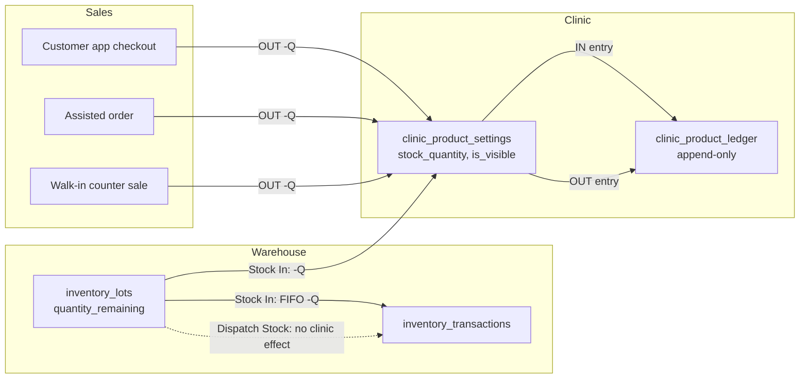
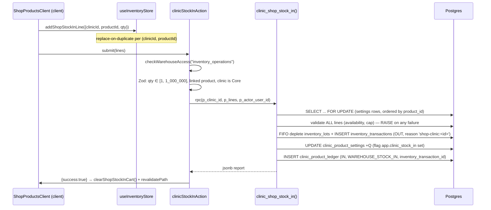

# Design Document

## Overview

This feature converts CORE shop inventory from one shared number per product (`public.products.stock_quantity`) into a **per-clinic overlay with a per-clinic append-only ledger**, links each Shop Product to a warehouse Master Catalog Product so shop stock-in draws down real warehouse lots, and adds a **clinic-scoped admin** whose Shop Products access is confined to one clinic.

The shape of the solution is deliberately conservative: it copies a pattern the codebase already runs in production for franchises rather than inventing a new one.

| Franchise (existing, production) | Core Clinic (new, this feature) |
| --- | --- |
| `franchise_product_settings` (`stock_quantity`, `is_visible`, unique on franchise+product) | `clinic_product_settings` (same shape, unique on clinic+product) |
| `franchise_inventory_ledger` (`id BIGINT IDENTITY`, direction enum, `occurred_at`) | `clinic_product_ledger` (same shape, plus `movement_source`) |
| `decrement_franchise_product_stock` RPC (conditional UPDATE, no oversell) | `clinic_shop_apply_sale` RPC (same guard, plus ledger write) |
| `receive_franchise_transfer` RPC (multi-table, one transaction, idempotent) | `clinic_shop_stock_in` RPC (same construction) |
| `toggleFranchiseProductVisibility` server action | `setClinicProductVisibilityAction` server action |

Three findings from the codebase drive the most consequential design decisions:

1. **Nothing decrements `products.stock_quantity` today.** Core shop stock is unenforced end to end; only `franchise_product_settings.stock_quantity` is real (`src/actions/shop-actions.ts`, `src/services/AssistedOrderService.ts`). So there is no existing core deduction path to modify — there is one to *build*, and the franchise path is the working reference.
2. **`addon_orders` has no `clinic_id`.** `scripts/add-clinic-stamp-to-orders.sql` documents the intent that addon orders inherit their clinic via `delivery_order_id`. That path yields `NULL` for exactly the sales that move shop stock, because walk-in counter sales keep `delivery_order_id = NULL` forever. The Order_Clinic_Stamp therefore has to be a real column on `addon_orders`.
3. **Warehouse FIFO depletion is a JS loop with manual compensating rollback** (`src/services/inventoryEngine.ts::dispatchInventoryStock`), and `processBulkOutbound` can partially commit. Requirements 7.6, 7.10, 7.11, 10.8, 10.9 demand genuine single-transaction atomicity across `clinic_product_settings`, `clinic_product_ledger`, `inventory_lots`, and `inventory_transactions`. A JS loop over the Supabase REST client cannot deliver that. Every multi-table mutation in this feature therefore lives in a `plpgsql SECURITY DEFINER` RPC, which is already the house pattern for exactly this problem (`receive_franchise_transfer`, `place_assisted_addon_order`, `move_pincode`, `transfer_stock`).

### Scope boundaries restated as design rules

- **Stock enters a clinic only through Stock In.** Enforced not just by convention but by a database trigger: any `UPDATE` that raises `clinic_product_settings.stock_quantity` is rejected unless a transaction-local flag set by the Stock In / migration RPCs is present (Requirement 8.3).
- **Clinic scoping touches the Shop Products module only.** No `clinic_id` filter is added to the customers, subscriptions, riders, or warehouse data paths. The scope is applied in exactly four read paths and three write paths, listed in the Components section.

### Non-goals

- Rewriting `dispatchInventoryStock` / `bulkDispatchAction`. Dispatch Stock keeps its current behaviour and its `clinic:`-derived reason snapshot untouched (Requirement 8.5). The new Stock In path is a parallel flow with its own `shop-clinic:` prefix.
- Changing `products.stock_quantity`. It is retained, frozen, as a pre-migration historical value (Requirement 1.15).
- Franchise transfer receipt behaviour. `receive_franchise_transfer` already lands stock directly in franchise lots with no confirm step; Requirement 17 is largely a verification and hardening exercise (see Components).

---

## Architecture

### Layering

The feature follows the project's established layering, top to bottom:

```
src/app/**                    Server Components: read + render, own the page guards
  └─ *Client.tsx              Client leaves: selectors, toggles, quantity entry, cart
src/actions/**                "use server": auth gate → Zod → repository/RPC → revalidatePath
src/services/**               Business orchestration (AssistedOrderService, inventoryEngine)
src/repositories/clinic/**    Data access only: no validation, no "use server"
src/lib/**                    Pure helpers: effective-stock resolution, scope resolution
Postgres RPCs                 Atomic multi-table mutations (SECURITY DEFINER, plpgsql)
```

Pure decision logic is deliberately pushed into `src/lib/shop/clinicStock.ts` so it is directly property-testable without a database: effective stock/visibility resolution, aggregate stock, customer-shop exposure, cart line merge, FIFO depletion planning, oversell evaluation, and scope resolution are all pure functions over plain data. The RPCs then execute the plan the pure layer produced.

### Stock movement model



`clinic_product_settings.stock_quantity` is a denormalised cache of the ledger. The ledger is the record of truth; the settings row exists so reads (customer shop, product lists, oversell checks) stay a single indexed lookup instead of an aggregate. Every writer updates both in one transaction, which is what makes the parity invariant (Requirement 2.7) hold.

### Stock In sequence



Validation of *every* line precedes *any* mutation, so a rejected submission never partially applies (Requirements 7.12, 7.14). Lock acquisition is ordered by `product_id` to make concurrent multi-line submissions deadlock-free.

### Destination Selector data flow

The Destination Selector is a URL-driven server round trip, not client state, so per-destination data is fetched server-side under the server-side authorization check (Requirement 5.14) and the page updates without a manual refresh (Requirement 5.9):

```
/admin/inventory/shop-products?destination=all
/admin/inventory/shop-products?destination=clinic:<uuid>
/admin/inventory/shop-products?destination=franchise:<uuid>
```

The client selector calls `router.replace(...)` with the new value; the Server Component awaits `searchParams` (Next.js 16 passes `searchParams` as a Promise), resolves the destination via the pure `resolveDestination` helper, and fetches only that destination's overlay. An unknown or malformed identifier falls back to `all` with a notice (Requirement 5.11), which is why resolution is a pure, testable function rather than inline page logic.

### Why the reason prefix matters

`inventory_transactions.reason` is unconstrained `TEXT`, and today the `clinic:` / `franchise:` prefixes exist only as Select option values in `DispatchStockModal` — what actually lands in the column is a plain snapshot like `Sent to Madhapur`. Stock In diverges here: it writes the literal `shop-clinic:<clinic_uuid>` into `reason` (Requirement 7.9), giving warehouse transactions produced by shop stock-in a machine-readable, referentially meaningful marker that Dispatch Stock entries never carry. The Audit Ledger's outgoing section derives its category filter from distinct `reason` values, so these entries become filterable with no `LedgerWorkspace` change.

---

## Components and Interfaces

### 1. Database migrations (`scripts/`)

Following the house convention: flat files, banner header naming the spec and requirements, fully idempotent (`IF NOT EXISTS`, `CREATE OR REPLACE`, `DO $$ ... pg_type` guards for enums, `DROP POLICY IF EXISTS` before `CREATE POLICY`), an explicit ORDERING section, and a copy-pasteable Rollback block.

| Script | Contents |
| --- | --- |
| `create-clinic-product-settings-table.sql` | `clinic_product_settings` table, indexes, `updated_at` trigger, Core-clinic guard trigger, stock-increase guard trigger, RLS + `GRANT SELECT TO authenticated`, backfill triggers for product/clinic creation |
| `create-clinic-product-ledger-table.sql` | `clinic_ledger_direction` + `clinic_movement_source` enums, `clinic_product_ledger` table, direction/source integrity CHECK, append-only trigger, `REVOKE UPDATE, DELETE`, index |
| `add-inventory-product-link-to-products.sql` | `products.inventory_product_id` nullable FK + partial index |
| `add-clinic-stamp-to-addon-orders.sql` | `addon_orders.clinic_id` nullable FK, stamp-immutability trigger, `(clinic_id, created_at DESC)` index |
| `add-admin-clinic-id-to-users.sql` | `users.admin_clinic_id` nullable FK + partial index + Core-clinic-only CHECK trigger |
| `create-clinic-shop-stock-in-rpc.sql` | `clinic_shop_stock_in(...)` |
| `create-clinic-shop-apply-sale-rpc.sql` | `clinic_shop_apply_sale(...)`, `set_clinic_product_visibility(...)` |
| `extend-place-assisted-addon-order-for-clinic.sql` | `CREATE OR REPLACE` of `place_assisted_addon_order` with the clinic stamp + inline decrement + ledger |
| `create-franchise-shop-stock-in-rpc.sql` | `franchise_shop_stock_in(...)` (Requirement 18) |
| `migrate-shared-shop-stock-to-clinics.sql` | `migrate_shop_stock_to_clinics()` idempotent migration function (Requirement 20) |

A deliberate note on drift: `users_admin_access_level_check` still omits `'dietitian'` even though `ADMIN_ACCESS_LEVELS` includes it. The `admin_clinic_id` migration does not repeat that mistake — the Core-clinic restriction is enforced by a trigger reading `clinics.franchise_id`, not by a hand-maintained list.

### 2. Postgres RPCs

All are `LANGUAGE plpgsql SECURITY DEFINER SET search_path = public`, relying on the implicit single transaction for atomicity, using `SELECT ... FOR UPDATE` for serialisation and `RAISE EXCEPTION` for validation — identical construction to `receive_franchise_transfer`.

```sql
-- Requirement 7. Validates every line before mutating anything.
clinic_shop_stock_in(
  p_clinic_id       uuid,
  p_lines           jsonb,   -- [{product_id, quantity}]
  p_actor_user_id   uuid
) RETURNS jsonb               -- {applied:[{product_id, quantity, transaction_ids[]}], total}

-- Requirements 10, 11. Conditional UPDATE makes oversell structurally impossible.
clinic_shop_apply_sale(
  p_clinic_id       uuid,
  p_addon_order_id  uuid,
  p_lines           jsonb,   -- [{product_id, quantity}]
  p_movement_source clinic_movement_source,
  p_actor_user_id   uuid
) RETURNS jsonb               -- {applied:[...]} or RAISE with per-product shortfall

-- Requirements 6.4, 19.6. Upsert-shaped so a missing row is created at stock 0.
set_clinic_product_visibility(
  p_clinic_id uuid, p_product_id uuid, p_is_visible boolean
) RETURNS jsonb

-- Requirement 18. Franchise twin of clinic_shop_stock_in, over franchise_inventory_lots.
franchise_shop_stock_in(
  p_franchise_id uuid, p_product_id uuid, p_quantity integer, p_actor_user_id uuid
) RETURNS jsonb

-- Requirement 20. Idempotent; safe to re-run.
migrate_shop_stock_to_clinics() RETURNS jsonb
```

`clinic_shop_stock_in` and `migrate_shop_stock_to_clinics` call `set_config('app.clinic_stock_in', 'on', true)` before touching `stock_quantity`. The transaction-local flag is what the stock-increase guard trigger checks, mirroring the existing `current_setting('app.role', true)` session-helper pattern used by the franchise RLS policies. Any other code path attempting an increase gets a hard rejection (Requirement 8.3).

`place_assisted_addon_order` is extended rather than replaced: the payload gains `clinic_id` and `movement_source`, and after inserting `addon_order_items` the function performs the clinic decrement and ledger inserts inline. This keeps order creation, stock deduction, and ledger write in the one transaction Requirements 10.8 and 10.9 demand, and leaves the existing franchise and walk-in branches untouched.

A verification function, `verify_clinic_stock_ledger_parity()`, returns any `(clinic_id, product_id)` pair whose `stock_quantity` diverges from `IN − OUT`. It is used by integration tests and available for operational spot-checks; it is a detector, not a repair tool.

### 3. Pure logic — `src/lib/shop/clinicStock.ts`

The property-testable core. No I/O, no Supabase import.

```ts
export const STOCK_QUANTITY_MAXIMUM = 1_000_000;

export type ClinicOverlay = { stockQuantity: number; isVisible: boolean };

/** Requirements 1.13, 5.6, 9.5, 19.5. Missing row ⇒ stock 0, hidden. */
export function resolveEffectiveOverlay(row: ClinicOverlay | undefined | null): ClinicOverlay;

/** Requirements 3.10, 5.3. */
export function computeAggregateStock(overlays: ReadonlyArray<ClinicOverlay | null | undefined>): number;

/** Requirement 6.3. deleted_at null AND globally visible AND clinic-visible AND stock > 0. */
export function isExposedInClinicShop(input: {
  deletedAt: string | null; isActive: boolean; overlay: ClinicOverlay | null | undefined;
}): boolean;

/** Requirements 1.5–1.8, 2.2, 2.3, 7.13, 10.7, 18.7. */
export type QuantityRejection = "NOT_INTEGER" | "BELOW_MINIMUM" | "ABOVE_MAXIMUM";
export function validateMovementQuantity(value: unknown): { ok: true; value: number } | { ok: false; reason: QuantityRejection };
export function validateStockLevel(value: unknown): { ok: true; value: number } | { ok: false; reason: QuantityRejection };

/** Requirement 7.4. One line per (clinicId, productId); a repeat replaces the quantity. */
export function mergeStockInLine(lines: readonly StockInLine[], incoming: StockInLine): StockInLine[];

/** Requirement 7.8. Pure FIFO plan; the RPC executes what this returns. */
export function planFifoDepletion(
  lots: readonly { id: string; quantityRemaining: number }[], quantity: number
): { ok: true; plan: { lotId: string; deduct: number }[] } | { ok: false; available: number };

/** Requirements 7.12, 7.14, 11.1. All-or-nothing evaluation over a whole submission. */
export function evaluateStockInSubmission(...): StockInVerdict;
export function evaluateSaleSubmission(...): SaleVerdict;

/** Requirements 5.11, 5.12. */
export function resolveDestination(raw: string | undefined, known: KnownDestinations): Destination;
```

### 4. Repositories — `src/repositories/clinic/`

Data access only, throwing `Error` on failure, module-level `*_COLUMNS` constant, `createAdminClient()` called inside each function — matching `clinicRepository.ts` exactly.

```ts
// clinicProductRepository.ts
listClinicOverlays(clinicId: string): Promise<ClinicProductOverlayRow[]>
listOverlaysForProduct(productId: string): Promise<ClinicProductOverlayRow[]>   // aggregate stock
getOverlay(clinicId: string, productId: string): Promise<ClinicProductOverlayRow | null>
listAggregateStockByProduct(): Promise<Map<string, number>>
setVisibility(clinicId: string, productId: string, isVisible: boolean): Promise<void>  // via RPC
applyStockIn(clinicId: string, lines: StockInLine[], actorUserId: string): Promise<StockInReport>  // via RPC

// clinicProductLedgerRepository.ts
listLedgerEntries(clinicId: string, filter?: { direction?: "IN" | "OUT" }): Promise<ClinicLedgerEntry[]>
// ORDER BY occurred_at DESC, id DESC — Requirement 9.7
```

### 5. Server actions

New file `src/actions/admin-actions/clinicShopInventoryActions.ts`:

| Action | Gate | Requirements |
| --- | --- | --- |
| `clinicStockInAction(lines, clinicId)` | `checkWarehouseAccess("inventory_operations")` | 7, 16.1–16.4, 16.8 |
| `setClinicProductVisibilityAction(clinicId, productId, isVisible)` | `checkWarehouseAccess("inventory_operations")` | 6.2, 6.4, 6.9, 16.5, 16.9 |
| `setProductInventoryLinkAction(productId, inventoryProductId \| null)` | `checkWarehouseAccess("product_management")` + aggregate-stock-is-zero check | 3.7, 3.8, 3.11, 3.12 |
| `getDestinationOptionsAction()` | `checkWarehouseAccess(...)` | 5.1, 5.10, 5.12, 5.14 |
| `getClinicShopViewAction(clinicId)` | clinic-scope check | 9.4, 9.14, 14.4, 14.6, 14.7 |
| `getClinicLedgerAction(clinicId, filter)` | clinic-scope check | 9.6–9.10, 9.12, 14.4 |

Modified existing actions:

- `inventoryActions.ts` — `adminUpsertProduct` drops `stockQuantity` from its schema and stops writing `stock_quantity` / `in_stock` (Requirement 4.2); gains `inventoryProductId` with the aggregate-stock guard; the gate changes from `checkGroupManage("shop_products")` to `checkWarehouseAccess("product_management")` so an `operations` admin is rejected (Requirements 4.7, 4.8). `adminToggleProductVisibility` is kept as-is for Global_Visibility (Requirement 6.8) with the same gate change.
- `franchiseProductActions.ts` — `toggleFranchiseProductVisibility(productId, isVisible, franchiseId?)` gains an optional explicit franchise id, honoured **only** when the caller is an authorized Inventory_Admin. The franchise-session path is byte-for-byte unchanged. This satisfies Requirement 19.10 ("continue to use the existing action") without letting a franchise admin name another franchise.
- `assistedOrderActions.ts` — resolves the fulfilling clinic (scope assignment, or explicit selection for an unscoped admin) and threads it into `AssistedOrderService`, which passes `clinic_id` + `movement_source` into `place_assisted_addon_order`.
- `shop-actions.ts` — `createAddonCheckoutOrder` / `processStandaloneCheckout` gain a core-clinic branch: resolve `customer_profiles.clinic_id`, present nothing and reject when unset (Requirement 10.13), pre-check `Effective_Clinic_Stock` (Requirement 11.5), and stamp `addon_orders.clinic_id`. `verifyAddonPayment` calls `clinic_shop_apply_sale` for core clinic orders alongside the existing franchise failsafe loop.
- `master-actions/adminActions.ts` — `createAdminUser` / `updateAdminUser` accept `clinicId?: string | null` and enforce Requirements 13.11–13.14 server-side.
- `franchise-actions/franchiseInventoryActions.ts` — new `franchiseShopStockInAction(productId, quantity)` (Requirement 18); franchise id from `resolveScope()`, never the client.

### 6. Auth and clinic scoping

`src/lib/auth/adminAccessCore.ts` (pure, edge-safe) gains:

```ts
export const CLINIC_SCOPED_GROUPS = ["customers", "subscriptions", "riders", "shop_products"] as const;

export function isClinicScoped(cfg: AccessConfiguration, clinicId: string | null): boolean;
export function validateClinicScopeAssignment(input: {
  level: AdminAccessLevel; clinicId: string | null; groups: OperationsAccess;
}): { ok: true } | { ok: false; error: string };
export function resolveReadableClinicId(assigned: string | null, requested: string | null):
  { ok: true; clinicId: string | null } | { ok: false; error: string };
```

`src/lib/auth/adminAccess.ts` (server-only) extends `AdminContext` with `clinicId: string | null` (one extra column on the existing `getCurrentAdminContext` select) and adds `assertClinicScope(clinicId)` / `checkClinicScope(clinicId)` in the established throw-style / result-style pair.

`resolveReadableClinicId` is the single chokepoint for Requirements 12.9, 14.6, 14.7, and 15.11: a scoped admin's requested clinic must equal the assignment, an unscoped admin's request passes through, and `null` means "no filter" for an unscoped admin only.

One routing note worth flagging: `GROUP_ROUTE_PREFIX.shop_products` maps to `/admin/kitchen-shop`, while `/admin/inventory/shop-products` classifies as the *inventory* area — and that warehouse page currently has **no page guard at all**. This design adds `await guardAdminPage("inventory")` to it, which also delivers Requirement 16.7 (an `operations` admin requesting it is redirected to `landingRouteFor("operations")`).

### 7. UI components

| Component | Location | Notes |
| --- | --- | --- |
| `ShopProductsDestinationSelector` | `src/shared/components/admin/product-inventory/` | Client leaf; `router.replace` on change |
| `ShopStockInDialog` | same | Quantity entry; blocked for an unlinked product (Requirement 7.15) |
| `ShopStockInCart` | same | Outbound-only submission; no inbound option (Requirement 7.2) |
| `MasterCatalogProductSelector` | same | Lists `inventory_products` by name + `base_uom`; always offers "Not linked" |
| `ClinicLedgerView` | same | Mirrors `LedgerWorkspace` sectioning with IN/OUT sections only |
| `ClinicSelector` | `src/shared/components/admin/` | Reused by the operations page, shop-orders page, and assisted-order page |

`InventoryPageClient` gains a discriminated `mode` prop rather than more booleans, because the per-mode action sets are disjoint (Requirements 5.4, 5.7, 5.8, 19.2, 19.3):

```ts
type ShopProductsMode =
  | { kind: "all-clinics" }                          // aggregate stock, global visibility, full CRUD, no stock entry
  | { kind: "clinic";    clinicId: string }          // clinic stock, exactly 2 row actions: visibility + stock-in
  | { kind: "franchise"; franchiseId: string }       // franchise stock, exactly 1 row action: visibility
  | { kind: "operations-view"; clinicId: string | null }; // read-only + ledger, no stock-in, no visibility
```

`useInventoryStore` gains a third, isolated cart slice so `OperationsCart` behaviour is untouched:

```ts
export type ShopStockInLine = { id: string; clinicId: string; productId: string; name: string; qty: number };
// state:   shopStockInCart: ShopStockInLine[]
// actions: addShopStockInLine (merge-on-duplicate), removeShopStockInLine, clearShopStockInCart
```

`AssistedOrderProduct` gains `availableStock: number` (it carries no stock field today), so the builder can cap quantity entry at the clinic's stock. The component stays portal-agnostic: actions continue to be injected, never imported.

### 8. Franchise behaviours (Requirements 17–19)

- **Requirement 17** is already satisfied by `receive_franchise_transfer`: one transaction, direct `franchise_inventory_lots` insert, `IN` ledger entry, idempotent no-op when already `RECEIVED`, no confirm step, `franchise_product_settings` untouched. The only gap is criterion 17.4 — line quantities are checked as `> 0` by the table constraint but not against the 1,000,000 upper bound or integrality. A `CREATE OR REPLACE` adds that per-line validation before any lot insert.
- **Requirement 18** adds `franchise_shop_stock_in`, the direct twin of the clinic RPC over `franchise_inventory_lots`, plus a Stock In action on `FranchiseShopProductsClient`. Note the asymmetry the requirements specify: a newly created franchise settings row defaults `is_visible = false` (matching the existing table default), whereas a clinic row defaults `is_visible = true`.
- **Requirement 19** renders franchise mode from `franchise_product_settings` with visibility as the sole action. `clinic_shop_stock_in` rejects a franchise destination outright, and `resolveDestination` never produces a stock-in-capable destination for a franchise.

---

## Data Models

### `public.clinic_product_settings`

```sql
CREATE TABLE public.clinic_product_settings (
  id             UUID PRIMARY KEY DEFAULT gen_random_uuid(),
  clinic_id      UUID NOT NULL REFERENCES public.clinics(id)  ON DELETE CASCADE,
  product_id     UUID NOT NULL REFERENCES public.products(id) ON DELETE CASCADE,
  stock_quantity INTEGER NOT NULL DEFAULT 0
                 CHECK (stock_quantity >= 0 AND stock_quantity <= 1000000),
  is_visible     BOOLEAN NOT NULL DEFAULT true,
  created_at     TIMESTAMPTZ NOT NULL DEFAULT now(),
  updated_at     TIMESTAMPTZ NOT NULL DEFAULT now(),
  CONSTRAINT uq_clinic_product UNIQUE (clinic_id, product_id)
);

CREATE INDEX idx_cps_clinic  ON public.clinic_product_settings(clinic_id);
CREATE INDEX idx_cps_product ON public.clinic_product_settings(product_id);
```

Differences from `franchise_product_settings`, each requirement-driven: `is_visible` defaults to `true` (Requirements 1.1, 1.10, 1.11) rather than `false`; `stock_quantity` carries an upper bound of 1,000,000 (Requirement 1.5); and `clinic_id` must reference a Core Clinic (Requirement 1.9).

Triggers on this table:

| Trigger | Timing | Purpose | Requirement |
| --- | --- | --- | --- |
| `trg_cps_updated_at` | BEFORE UPDATE | house `updated_at` pattern | — |
| `trg_cps_core_clinic_only` | BEFORE INSERT OR UPDATE | `RAISE` when `clinics.franchise_id IS NOT NULL` | 1.9 |
| `trg_cps_increase_guard` | BEFORE UPDATE | `RAISE` when `NEW.stock_quantity > OLD.stock_quantity` and `current_setting('app.clinic_stock_in', true) IS DISTINCT FROM 'on'` | 8.3 |

Backfill triggers, which give Requirements 1.10–1.12 real same-transaction guarantees without touching two application code paths (a trigger failure aborts the enclosing transaction automatically):

| Trigger | Table | Action |
| --- | --- | --- |
| `trg_products_seed_clinic_settings` | `products` AFTER INSERT | one row per Core Clinic, stock 0, visible |
| `trg_clinics_seed_product_settings` | `clinics` AFTER INSERT WHEN `franchise_id IS NULL` | one row per non-deleted product, stock 0, visible |

RLS follows the `franchise_product_settings` precedent exactly, including the explicit base grant that file warns about: `ENABLE ROW LEVEL SECURITY`, `GRANT SELECT TO authenticated`, policy `cps_read_authenticated` FOR SELECT USING (true). All writes go through service-role actions and the RPCs.

### `public.clinic_product_ledger`

```sql
CREATE TYPE clinic_ledger_direction AS ENUM ('IN','OUT');
CREATE TYPE clinic_movement_source  AS ENUM (
  'WAREHOUSE_STOCK_IN','CUSTOMER_APP_SALE','ASSISTED_SALE','WALKIN_SALE','MIGRATION');

CREATE TABLE public.clinic_product_ledger (
  id                       BIGINT GENERATED ALWAYS AS IDENTITY PRIMARY KEY,
  clinic_id                UUID NOT NULL REFERENCES public.clinics(id),
  product_id               UUID NOT NULL REFERENCES public.products(id),
  direction                clinic_ledger_direction NOT NULL,
  quantity                 INTEGER NOT NULL CHECK (quantity > 0 AND quantity <= 1000000),
  movement_source          clinic_movement_source NOT NULL,
  actor_user_id            UUID NOT NULL REFERENCES public.users(id),
  addon_order_id           UUID REFERENCES public.addon_orders(id),
  inventory_transaction_id UUID REFERENCES public.inventory_transactions(id),
  occurred_at              TIMESTAMPTZ NOT NULL DEFAULT now(),

  CONSTRAINT ck_cpl_direction_source CHECK (
    (direction = 'IN'  AND movement_source IN ('WAREHOUSE_STOCK_IN','MIGRATION')) OR
    (direction = 'OUT' AND movement_source IN ('CUSTOMER_APP_SALE','ASSISTED_SALE','WALKIN_SALE'))
  ),
  CONSTRAINT ck_cpl_reference CHECK (
    (movement_source = 'WAREHOUSE_STOCK_IN' AND inventory_transaction_id IS NOT NULL AND addon_order_id IS NULL) OR
    (movement_source = 'MIGRATION'          AND inventory_transaction_id IS NULL     AND addon_order_id IS NULL) OR
    (movement_source IN ('CUSTOMER_APP_SALE','ASSISTED_SALE','WALKIN_SALE')
       AND addon_order_id IS NOT NULL AND inventory_transaction_id IS NULL)
  )
);

CREATE INDEX idx_cpl_clinic_time ON public.clinic_product_ledger(clinic_id, occurred_at DESC, id DESC);
CREATE INDEX idx_cpl_clinic_product ON public.clinic_product_ledger(clinic_id, product_id);
```

`id BIGINT GENERATED ALWAYS AS IDENTITY` gives the monotonic tie-break the ledger ordering needs (Requirement 9.7), exactly as `franchise_inventory_ledger` does. The two CHECK constraints together encode Requirements 2.8, 2.10, 2.11, and 2.12 in the schema rather than in application code.

Immutability (Requirement 2.9) is enforced twice — belt and braces, because this is the audit record of truth:

```sql
CREATE OR REPLACE FUNCTION public.reject_clinic_ledger_mutation() RETURNS TRIGGER AS $$
BEGIN
  RAISE EXCEPTION 'Clinic shop ledger entries are immutable and cannot be % ', lower(TG_OP);
END; $$ LANGUAGE plpgsql;

CREATE TRIGGER trg_cpl_append_only
  BEFORE UPDATE OR DELETE ON public.clinic_product_ledger
  FOR EACH ROW EXECUTE FUNCTION public.reject_clinic_ledger_mutation();

REVOKE UPDATE, DELETE ON public.clinic_product_ledger FROM authenticated, anon;
```

This is a deliberate departure from `franchise_inventory_ledger`, which has no such trigger. The `REVOKE` alone would not stop the service-role client, so the trigger is the load-bearing guard.

### Column additions to existing tables

```sql
-- Requirement 3.1. Nullable: an Unlinked_Shop_Product is a valid state.
ALTER TABLE public.products
  ADD COLUMN IF NOT EXISTS inventory_product_id UUID
    REFERENCES public.inventory_products(id) ON DELETE SET NULL;
CREATE INDEX IF NOT EXISTS idx_products_inventory_product
  ON public.products(inventory_product_id) WHERE inventory_product_id IS NOT NULL;

-- Requirement 10.1. Order_Clinic_Stamp.
ALTER TABLE public.addon_orders
  ADD COLUMN IF NOT EXISTS clinic_id UUID REFERENCES public.clinics(id);
CREATE INDEX IF NOT EXISTS idx_addon_orders_clinic
  ON public.addon_orders(clinic_id, created_at DESC) WHERE clinic_id IS NOT NULL;

-- Requirement 13.1. Clinic_Scope_Assignment.
ALTER TABLE public.users
  ADD COLUMN IF NOT EXISTS admin_clinic_id UUID REFERENCES public.clinics(id);
CREATE INDEX IF NOT EXISTS idx_users_admin_clinic
  ON public.users(admin_clinic_id) WHERE admin_clinic_id IS NOT NULL;
```

`addon_orders.clinic_id` gets a stamp-immutability trigger that rejects any `UPDATE` changing an already-set value while still permitting `NULL → value` (Requirement 10.12). This is stricter than `delivery_orders.clinic_id`, where `add-clinic-stamp-to-orders.sql` deliberately left immutability to the application layer so a back-stamp migration could fill NULLs. The permitted `NULL → value` direction preserves that same freedom here.

Note that `addon_orders.clinic_id` is nullable and stays `NULL` for franchise orders and for pre-existing rows — which is precisely the `Unassigned` grouping Requirement 12.6 describes.

### TypeScript types — `src/types/clinicShop.ts`

```ts
export type ClinicLedgerDirection = "IN" | "OUT";
export type ClinicMovementSource =
  | "WAREHOUSE_STOCK_IN" | "CUSTOMER_APP_SALE" | "ASSISTED_SALE" | "WALKIN_SALE" | "MIGRATION";

export interface ClinicProductOverlayRow {
  id: string; clinic_id: string; product_id: string;
  stock_quantity: number; is_visible: boolean;
  created_at: string; updated_at: string;
}

export interface ClinicLedgerEntry {
  id: string;                 // BIGINT serialised as string
  clinic_id: string; product_id: string; product_name: string;
  direction: ClinicLedgerDirection; quantity: number;
  movement_source: ClinicMovementSource;
  actor_user_id: string; actor_name: string | null;
  addon_order_id: string | null; inventory_transaction_id: string | null;
  occurred_at: string;
}

export interface ClinicShopProductRow {
  id: string; sku: string | null; name: string;
  original_price: number; sale_price: number | null;
  inventory_product_id: string | null;
  inventory_product_name: string | null; base_uom: string | null;
  stock_quantity: number;      // Effective_Clinic_Stock
  is_visible: boolean;         // Effective_Clinic_Visibility
  catalog_active: boolean;     // Global_Visibility
  has_settings: boolean;
}
```

### Validation schemas — `src/validations/clinicShopInventory.ts`

```ts
export const clinicStockQuantitySchema = z.number().int().min(0).max(STOCK_QUANTITY_MAXIMUM);
export const movementQuantitySchema    = z.number().int().min(1).max(STOCK_QUANTITY_MAXIMUM);

export const stockInLineSchema = z.object({
  productId: z.string().uuid(),
  quantity: movementQuantitySchema,
});
export const stockInSubmissionSchema = z.object({
  clinicId: z.string().uuid(),
  lines: z.array(stockInLineSchema).min(1),
});
export const clinicVisibilitySchema = z.object({
  clinicId: z.string().uuid(), productId: z.string().uuid(), isVisible: z.boolean(),
});
export const productInventoryLinkSchema = z.object({
  productId: z.string().uuid(),
  inventoryProductId: z.string().uuid().nullable(),
});
export const clinicScopeAssignmentSchema = z.object({
  clinicAccess: z.boolean(),
  clinicId: z.string().uuid().nullable(),
  groups: z.record(z.enum(CLINIC_SCOPED_GROUPS), z.enum(PERMISSION_LEVELS)),
});
```

### Migration model (Requirement 20)

`migrate_shop_stock_to_clinics()` runs as one transaction and is idempotent by construction:

1. Abort with a report when no Core Clinic exists (20.13).
2. Pre-scan: abort the whole run if any non-deleted product's `stock_quantity > 1_000_000` (20.6).
3. Resolve `Migration_Target_Clinic = ` the Core Clinic with the earliest `created_at`.
4. `INSERT ... ON CONFLICT (clinic_id, product_id) DO NOTHING` for every (Core Clinic × non-deleted product) pair, `is_visible = products.is_active`, target-clinic `stock_quantity = COALESCE(products.stock_quantity, 0)` clamped to 0 when negative or non-integral, all other clinics 0 (20.1, 20.4, 20.5, 20.12). `DO NOTHING` is what makes pre-existing rows untouched (20.9) and a second run a no-op (20.10).
5. For each row the run actually inserted with `stock_quantity > 0`, insert one `MIGRATION` `IN` ledger entry (20.7). Because ledger writes are driven off inserted rows only, re-running adds no entries.
6. Return a jsonb report: rows created, ledger entries written, products clamped to 0, target clinic.

The migration leaves `products.stock_quantity`, `products.inventory_product_id`, and every `franchise_product_settings` row untouched (20.3, 20.8, 20.11). Aggregate_Stock after the run equals the pre-migration `products.stock_quantity` because exactly one clinic receives the full value and the rest receive 0.

---

## Correctness Properties

*A property is a characteristic or behavior that should hold true across all valid executions of a system — essentially, a formal statement about what the system should do. Properties serve as the bridge between human-readable specifications and machine-verifiable correctness guarantees.*

These properties are a good fit for this feature: its core is arithmetic and decision logic over stock quantities, overlay rows, ledger entries, and scope assignments, all extracted into pure functions in `src/lib/shop/clinicStock.ts` and `src/lib/auth/adminAccessCore.ts`. The invariants stated in the requirements introduction are literally universally quantified statements. `fast-check` is already the house standard for this kind of logic (`src/lib/clinic/__tests__/conflict-detection.property.test.ts`, `src/actions/system-actions/__tests__/shop-linking-*.property.test.ts`).

### Property 1: Clinic stock is never negative

*For any* clinic, product, starting stock, and arbitrary sequence of applied stock-in and sale movements, the resulting `clinic_product_settings.stock_quantity` is greater than or equal to 0, and no applied sale ever brings it below 0.

**Validates: Requirements 1.5, 1.6, 11.2, 11.4**

### Property 2: Stock equals ledger IN minus ledger OUT

*For any* clinic, product, and arbitrary sequence of accepted movements applied through the stock-in and sale paths, the resulting `stock_quantity` for that `(clinic_id, product_id)` pair equals the sum of all `IN` entry quantities minus the sum of all `OUT` entry quantities for that pair.

**Validates: Requirements 2.5, 2.7, 10.10**

### Property 3: Every accepted stock change writes exactly one ledger entry

*For any* accepted movement of quantity Q against a clinic's stock, exactly one ledger entry is produced, its direction is `IN` when the change increases stock and `OUT` when it decreases stock, and its quantity equals the absolute size of the change.

**Validates: Requirements 2.5, 2.8, 10.8**

### Property 4: Stock In of Q decrements warehouse stock by exactly Q

*For any* linked Shop Product whose Master Catalog Product holds warehouse stock S across any arrangement of active lots, and any quantity Q with 1 ≤ Q ≤ S, a completed Stock In of Q leaves the warehouse holding exactly S − Q, depletes lots oldest-first, and records warehouse transactions whose quantities sum to −Q.

**Validates: Requirements 3.6, 7.6, 7.8, 7.16**

### Property 5: A rejected submission changes nothing

*For any* stock-in submission containing at least one line that exceeds available warehouse stock, would raise clinic stock above 1,000,000, has an out-of-range quantity, or names an unlinked product, the submission is rejected in full: every clinic overlay, every warehouse lot, every ledger entry, and every warehouse transaction is left at its pre-submission value, and every pending cart line is retained.

**Validates: Requirements 7.10, 7.12, 7.14, 7.15, 20.3**

### Property 6: Ledger entries are immutable

*For any* existing ledger entry and any attempted update or delete of it, the attempt is rejected and the stored entry's clinic, product, direction, quantity, movement source, actor, references, and timestamp are unchanged.

**Validates: Requirements 2.9, 1.14**

### Property 7: The order clinic stamp is immutable and complete

*For any* successfully created shop order, the order carries a clinic stamp identifying the fulfilling Core Clinic, and any subsequent attempt to change that stamp is rejected leaving the stored value unchanged.

**Validates: Requirements 10.1, 10.12, 13.18**

### Property 8: Oversell is rejected

*For any* clinic, any set of shop products with arbitrary effective clinic stock, and any order whose requested quantity for at least one product exceeds that clinic's effective stock for it, the order is rejected in full: no order row, no line item, no stock change, and no ledger entry, and the error names every product with insufficient stock together with the quantity available.

**Validates: Requirements 10.11, 11.1, 11.3, 11.5, 11.6, 15.10**

### Property 9: One overlay record per (clinic, product) pair

*For any* sequence of overlay-creating operations — product creation, Core Clinic creation, visibility setting, stock-in, and migration, in any order and with any repeats — the number of `clinic_product_settings` records for a given `(clinic_id, product_id)` pair never exceeds one, and a duplicate creation attempt leaves the existing record's stock and visibility unchanged.

**Validates: Requirements 1.3, 1.4, 1.10, 1.11, 6.4, 7.7, 20.9**

### Property 10: Missing overlay reads as zero and hidden

*For any* Core Clinic and Shop Product with no overlay record, every stock display, availability decision, and deduction resolves the effective stock as 0 and the effective visibility as hidden.

**Validates: Requirements 1.13, 5.6, 9.5, 19.5**

### Property 11: Customer-shop exposure requires all four conditions

*For any* Shop Product and Core Clinic, the product is exposed in that clinic's customer-facing shop exactly when its `deleted_at` is null, its global visibility is shown, that clinic's effective visibility is shown, and that clinic's effective stock is greater than 0 — negating any single condition removes it from the shop.

**Validates: Requirements 6.1, 6.2, 6.3, 15.1**

### Property 12: Aggregate stock equals the sum of clinic stocks

*For any* Shop Product and any set of Core Clinics with arbitrary overlay records, including clinics with no record, the aggregate stock shown in All Clinics mode equals the sum of every Core Clinic's effective stock for that product.

**Validates: Requirements 3.10, 5.3, 20.8**

### Property 13: Visibility toggling is an involution and concurrency-safe

*For any* overlay record and any starting visibility value, toggling twice with no intervening change restores the starting value, and for any pair of concurrent visibility writes the stored value equals the one carried by the later-committed write.

**Validates: Requirements 6.5, 6.6**

### Property 14: Cart lines are unique per destination and product

*For any* sequence of stock-in line additions, the cart holds at most one pending line per `(destination clinic, product)` pair, and that line's quantity equals the most recently entered quantity for that pair.

**Validates: Requirements 7.3, 7.4**

### Property 15: Movement quantity validation accepts exactly the valid range

*For any* submitted value, it is accepted as a movement quantity exactly when it is an integer in [1, 1,000,000], and every rejection identifies whether the value was non-integral, below the minimum, or above the maximum.

**Validates: Requirements 1.7, 1.8, 2.2, 2.3, 7.13, 10.7, 17.4, 18.7, 18.8**

### Property 16: Concurrent movements compose additively

*For any* clinic, product, starting stock, and any interleaving of concurrent stock-in quantities and sale quantities that are all individually accepted, the final stored stock equals the starting stock plus the sum of accepted increases minus the sum of accepted decreases, independent of interleaving order.

**Validates: Requirements 7.11, 10.10, 18.5**

### Property 17: Clinic scope confines Shop Products reads and nothing else

*For any* clinic-scoped admin and any requested clinic identifier, a Clinic Shop Stock or Clinic Shop Ledger read resolves to the admin's assigned clinic when the request matches it or names nothing, and is rejected otherwise; and for any customer, subscription, or rider data set, the rows returned to that admin are identical to those returned to an unscoped admin.

**Validates: Requirements 12.1, 12.9, 14.1, 14.2, 14.3, 14.4, 14.5, 14.6, 14.7, 14.9**

### Property 18: Stock In authorization admits only warehouse admins

*For any* caller — no session, an `operations` admin, a clinic-scoped admin, or an `inventory` / `inventory_operations` admin — a Stock In is executed exactly when the caller holds warehouse inventory access, and every rejection leaves all clinic overlays and all warehouse stock unchanged.

**Validates: Requirements 4.7, 4.8, 16.1, 16.2, 16.3, 16.4, 16.5, 16.8, 16.9, 19.4**

### Property 19: Destination resolution always yields a renderable mode

*For any* raw destination parameter value and any set of known Core Clinics and active Franchises, resolution yields either the named existing destination or a fallback to All Clinics with a notice, never an unresolved or partially-resolved state, and the resulting mode's available row actions match the mode exactly.

**Validates: Requirements 5.2, 5.7, 5.8, 5.11, 5.12, 19.2, 19.3**

### Property 20: Migration is quantity-preserving and idempotent

*For any* set of Core Clinics and Shop Products with arbitrary pre-existing `products.stock_quantity` values, the migration leaves each product's aggregate stock equal to its pre-migration `stock_quantity` treating null as 0, records one `MIGRATION` `IN` entry for each positive migrated value, and a second run leaves every overlay quantity and every ledger entry equal to the first run's result.

**Validates: Requirements 20.1, 20.4, 20.5, 20.7, 20.8, 20.9, 20.10, 20.12**

### Property 21: Product link changes are gated on zero aggregate stock

*For any* Shop Product, a Product Link change succeeds exactly when the product's aggregate stock across all Core Clinics is 0 and the referenced Master Catalog Product exists; otherwise the stored link is unchanged.

**Validates: Requirements 3.1, 3.7, 3.8, 3.9, 3.11, 3.12**

### Property 22: Dispatch Stock leaves clinic shop stock untouched

*For any* Dispatch Stock operation to any destination, including a Core Clinic destination, every `clinic_product_settings` stock quantity is unchanged, no clinic ledger entry is recorded, and the recorded warehouse transaction reason does not carry the `shop-clinic:` prefix.

**Validates: Requirements 8.1, 8.2, 8.3, 8.4, 8.5, 7.9**

### Property 23: Ledger ordering is total and stable

*For any* set of ledger entries for one clinic, the ledger view orders them by occurrence timestamp descending with ties broken by entry identifier descending, producing one deterministic total order; and for any applied direction filter, the result contains exactly the entries of that direction in that same relative order.

**Validates: Requirements 9.6, 9.7, 9.8**

### Property 24: Franchise shop stock-in mirrors the clinic guarantees

*For any* franchise, linked Shop Product, and quantity Q, a franchise Stock In succeeds exactly when the franchise warehouse holds at least Q base units and the result would not exceed 1,000,000; on success it raises `franchise_product_settings.stock_quantity` by exactly Q, lowers franchise warehouse stock by exactly Q depleting lots oldest-first, and records one `OUT` franchise ledger entry; on failure it changes nothing.

**Validates: Requirements 18.2, 18.3, 18.4, 18.5, 18.6, 18.8, 18.9, 18.10, 18.11**

### Property 25: Franchise transfer receipt is atomic and idempotent

*For any* franchise stock transfer in `ACCEPTED` state with any set of valid lines, marking it received sets its state to `RECEIVED`, creates one franchise lot per line carrying that line's batch number and expiry, and records one `IN` franchise ledger entry; a repeat receipt creates no additional lot and no additional ledger entry; and `franchise_product_settings` stock is unchanged throughout.

**Validates: Requirements 17.1, 17.2, 17.3, 17.5, 17.6, 17.7**

### Property 26: Clinic scope assignment validates and round-trips

*For any* submitted admin configuration of access level, clinic access flag, clinic identifier, and operations group subset, the submission is accepted exactly when the level is `operations`, a Core Clinic is selected whenever clinic access is checked, and every selected group is one of the four clinic-scoped groups; every rejection leaves the stored level, clinic assignment, and group configuration unchanged; and for every accepted configuration, reloading the edit form yields exactly the configuration that was saved.

**Validates: Requirements 13.1, 13.2, 13.3, 13.7, 13.8, 13.9, 13.11, 13.12, 13.13, 13.14, 13.15, 13.16, 13.17**

---

## Error Handling

### Layered failure model

| Layer | Mechanism | Surface |
| --- | --- | --- |
| Database constraints and triggers | `RAISE EXCEPTION`, CHECK violation | RPC error → mapped to a user-facing message |
| RPC validation | `RAISE EXCEPTION` with a structured message | rolls back the whole transaction |
| Zod schemas | `safeParse` | `{ success: false, error }` from the action |
| Auth guards | `checkWarehouseAccess` / `checkClinicScope` (result-style), `guardAdminPage` (redirect) | action result, or redirect for pages |
| Repositories | `throw new Error('Failed to ... : ' + message)` | caught by the action, logged, generic message returned |
| Server Components | try/catch around reads | inline error state, zero rows rendered |

Server actions return the project's existing `{ success: boolean; error?: string }` / `AssistedOrderActionResult<T>` shapes. No new result convention is introduced.

### Message mapping

RPC exceptions carry a stable prefix so the action layer can map them to the specific wording each requirement asks for without string-sniffing Postgres internals:

| RPC exception prefix | User-facing message | Requirement |
| --- | --- | --- |
| `CLINIC_STOCK_INSUFFICIENT_WAREHOUSE:` | lists each product and its available warehouse quantity | 7.12 |
| `CLINIC_STOCK_EXCEEDS_MAXIMUM:` | states the maximum stock quantity of 1,000,000 | 7.14, 18.8 |
| `CLINIC_STOCK_UNLINKED_PRODUCT:` | product must be linked to a Master Catalog Product before stock-in | 7.15, 18.9 |
| `CLINIC_STOCK_INSUFFICIENT_CLINIC:` | lists each product with insufficient clinic stock and the quantity available | 11.1, 15.10 |
| `CLINIC_STOCK_LEDGER_IMMUTABLE:` | ledger entries are immutable | 2.9 |
| `CLINIC_STAMP_IMMUTABLE:` | the clinic stamp cannot be changed | 10.12 |
| `CLINIC_STOCK_INCREASE_FORBIDDEN:` | clinic shop stock increases only through stock-in | 8.3 |
| `CLINIC_NOT_CORE:` | Clinic Shop Stock applies to Core Clinics only | 1.9, 13.12 |
| `CLINIC_REFERENCE_NOT_FOUND:` | names the reference that was not found | 1.2, 2.4, 3.8 |

### Read-path failures and empty states

Every list surface distinguishes "loaded, nothing to show" from "could not load", because the requirements specify different copy for each. A read failure renders an error message and **zero** rows; it never falls back to stale or partial data.

| Surface | Empty state | Load failure |
| --- | --- | --- |
| Shop products list (all three pages) | no shop products exist (4.9) | could not load the shop product list, no rows (4.10) |
| Destination Selector | no destinations are configured (5.10) | could not load the destination list, fall back to All Clinics (5.12) |
| Per-destination overlay | product shown at 0 / hidden (5.6, 19.5) | could not load destination data, no rows (5.13, 19.8) |
| Master Catalog selector | no Master Catalog Products available, unlinked option only (3.3) | could not load the list, unlinked option only, existing link unchanged (3.4) |
| Clinic ledger | clinic has no recorded stock movements (9.9); no movements match the filter (9.10) | could not load the ledger, no entries (9.12) |
| Operations page, no clinic chosen | prompt to select a clinic, no figures, no entries (9.2); no clinics configured (9.3) | could not load clinic stock data, no rows (9.13) |
| Assisted order product list | no shop products available at your clinic, submission unavailable (15.3) | could not load the clinic product list, no products (15.4) |
| Customer search | no matching customer found (15.6) | could not complete the customer search, no results (15.7) |
| Shop orders list | no shop orders for the applied filter (12.7) | could not load shop orders, no rows (12.8) |
| Clinic dropdown in User Management | no clinics available for assignment (13.5) | could not load the clinic list, no selectable clinic, stored assignment unchanged (13.6) |
| Stock-in cart | no stock-in lines pending, submission unavailable (7.5) | — |
| Assigned clinic deleted | — | assigned clinic is unavailable, no figures, no entries (14.8) |
| Customer with no aligned clinic | zero products, shop purchases unavailable for your service area (10.13) | — |

### Optimistic UI rollback

Visibility toggles render optimistically and revert on failure, restoring the control to its previously displayed state and showing an update-failed message (Requirements 6.7, 19.7). The stored value is authoritative; the client never assumes success.

### Residual race after payment capture

One case deserves explicit callout because it is a judgement call rather than a mechanical mapping. For a customer-app purchase, stock is pre-checked at checkout initiation (rejecting an out-of-stock cart per Requirement 11.5) and the authoritative check-and-decrement runs inside `clinic_shop_apply_sale` at payment verification. If the clinic's stock is exhausted by another sale in between, money has already been captured. Rather than fail after payment, this design reuses the existing precedent from the franchise path (`applyFranchiseStockFailsafe` in `src/lib/shop/franchiseStockFailsafe.ts`): the order stays `PAID`, is flagged `fulfillment_status = UNFULFILLABLE_STOCK`, admins are notified, and no stock or ledger change is recorded. The oversell invariant still holds — the conditional `UPDATE` in the RPC guarantees stock never goes below 0 — but the outcome is an admin-visible exception rather than a rejected order. This is worth confirming, since Requirement 11.1 is written as an unconditional rejection.

---

## Testing Strategy

The project runs **Vitest 4** (`npm test` → `vitest run`) with **fast-check 4** already installed and heavily used. Tests live in `__tests__/` folders beside the code they cover, named `*.property.test.ts`, `*.unit.test.ts`, or `*.integration.test.ts`. Shared arbitraries go in `src/test/`.

### Property tests

Each of the 26 correctness properties is implemented as **exactly one** property-based test, tagged with a comment naming the feature and property so the test traces back to this document:

```ts
// Feature: clinic-scoped-shop-inventory, Property 2: Stock equals ledger IN minus ledger OUT
it.prop([arbClinicId, arbProductId, arbMovementSequence])(
  "stock equals ledger IN minus OUT for every (clinic, product) pair",
  (clinicId, productId, movements) => { /* ... */ },
);
```

Configuration:

- Minimum **100 iterations** per property (`fc.assert(..., { numRuns: 100 })` or the equivalent `fc-vitest` option). Properties 1, 2, and 16 run 500 because they explore movement sequences.
- Shared arbitraries in `src/test/shop/clinicStockArbitraries.ts`: `arbStockQuantity` (biased to 0, 1, 999,999, 1,000,000), `arbMovementQuantity`, `arbOverlayRow`, `arbMissingOverlay`, `arbLotSet` (including empty, single-lot, and many-small-lots shapes), `arbMovementSequence`, `arbLedgerEntrySet`, `arbDestinationParam` (including malformed and unknown-uuid values), `arbAdminScope`, `arbSaleChannel`, `arbRejectionCause`.
- Several properties parameterise the *cause* rather than splitting into one test per cause. Property 5 generates the rejection cause (warehouse shortfall, cap breach, bad quantity, unlinked product, injected write failure) and the failing line index; Property 8 generates the sale channel; Property 9 generates the overlay-creating operation; Property 18 generates the caller kind and the gated operation. This is what keeps 26 properties covering roughly 120 property-classified criteria without losing coverage.
- Generators cover the edge cases the requirements call out, so they need no separate tests: zero stock, exactly-at-maximum stock, missing overlay rows, non-integral and negative quantities, empty lot sets, deleted products, and clinics with a non-null `franchise_id`.
- Properties 1, 2, 4, 5, 16, 20, 24, and 25 need real transactional behaviour. They run against a **model implementation** of the RPC semantics in TypeScript (`src/test/shop/clinicStockModel.ts`) — the model-based testing pattern — with the model itself pinned to the real RPCs by a small set of integration tests. This keeps 100+ iterations cheap while still verifying the RPC contract.

### Unit tests

Focused example-based tests, kept deliberately few since the properties carry input coverage:

- Error-message mapping: each RPC exception prefix produces the requirement's specified wording.
- Shop Product form validation: missing name / SKU / price indicates each missing field (Requirement 4.4), and a price with three decimal places, zero, or a negative value is rejected naming the offending field (Requirement 4.5). Kept as examples rather than a property because the decimal-places rule is a formatting concern with a small interesting input set, unlike the integer-bound rules Property 15 covers.
- `place_assisted_addon_order` payload construction for the four order shapes: scoped admin selected-customer, scoped admin walk-in, unscoped admin with explicit clinic, unscoped admin with no clinic (rejection).
- `resolveDestination` on each concrete branch: absent param, `all`, valid clinic, valid franchise, unknown uuid, malformed string.
- `validateClinicScopeAssignment` rejections: clinic access with no clinic selected, `operations`/`franchises` group with a scope set, scope set on a non-`operations` level, clinic with a non-null `franchise_id`.
- The `AssistedOrderProduct.availableStock` cap on the quantity input.

### Integration tests

Against a Supabase test project, 1–3 examples each — these verify wiring and real transaction semantics, not input space:

- `clinic_shop_stock_in` end to end: overlay increases, warehouse lots deplete FIFO, `inventory_transactions` written with the `shop-clinic:<uuid>` reason, one `IN` ledger entry referencing that transaction.
- Forced mid-transaction failure in `clinic_shop_stock_in` leaves all four tables untouched.
- `UPDATE` and `DELETE` against `clinic_product_ledger` both raise.
- `UPDATE` of a set `addon_orders.clinic_id` raises; `NULL → value` succeeds.
- Backfill triggers: inserting a product creates one overlay row per Core Clinic; inserting a Core Clinic creates one per non-deleted product; a forced trigger failure rolls back the parent insert.
- The stock-increase guard rejects a direct `UPDATE` outside the stock-in flow.
- `migrate_shop_stock_to_clinics()` run twice produces identical state.
- `verify_clinic_stock_ledger_parity()` returns empty after a mixed workload.
- `receive_franchise_transfer` called twice creates one lot set and one ledger entry.

### Smoke tests

- The warehouse Shop Products page guard redirects an `operations` admin to `landingRouteFor("operations")`.
- RLS and grants: an `authenticated` client can `SELECT` from `clinic_product_settings` and cannot `UPDATE` or `DELETE` `clinic_product_ledger`.

### Accessibility

`axe-core` checks on the new interactive surfaces — Destination Selector, Stock In dialog, stock-in cart, clinic ledger table, and the Clinic Access checkbox with its dependent dropdown — following the existing `@testing-library` + `axe-core` setup.
