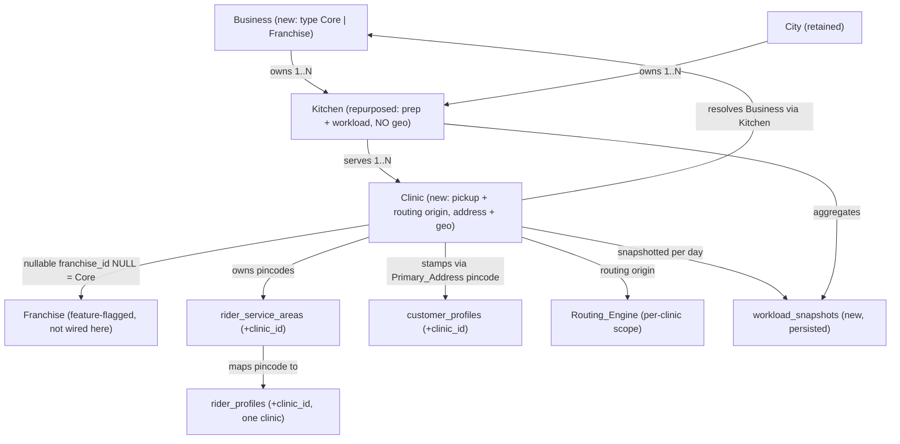
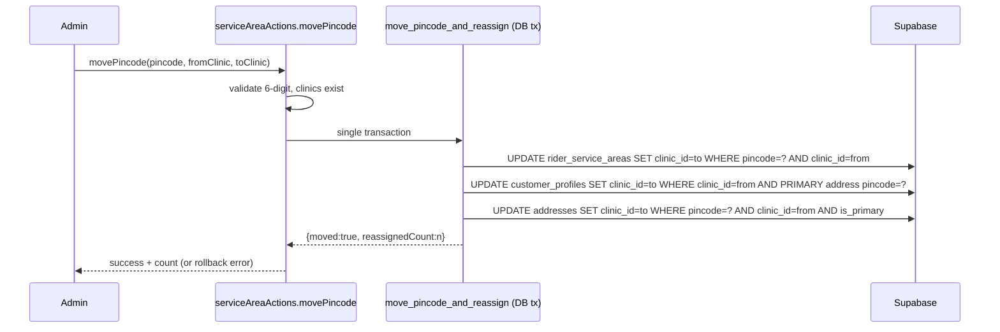

# Design Document

## Overview

This feature introduces a **Business → Kitchen → Clinic** hierarchy to the ArogyaDiet CORE business. It adds a new top-level **Business** entity (typed `Core` or `Franchise`) that separates Core operations from Franchise operations, repurposes the existing `kitchens` entity from a rider pickup / routing origin into a meal-preparation and workload-aggregation entity that **carries no address or geo coordinates**, and introduces a **Clinic** entity that becomes the sole rider pickup origin and geographic routing origin (the full address and latitude/longitude live only on the Clinic). The existing **City** entity is retained where it currently fits: a Kitchen still belongs to exactly one City, and a Clinic must share its Kitchen's City.

A Clinic resolves to its Business through its Kitchen (**Clinic → Kitchen → Business**). A Kitchen belongs to exactly one Business via `kitchens.business_id`, and one Business may own one or more Kitchens.

The design is deliberately **franchise-ready but franchise-inert**. A Clinic carries a nullable `franchise_id` (where `NULL` denotes a Core Clinic) and a Business carries a `type` of `Core` or `Franchise`; all franchise-specific reads/writes/side effects remain gated behind the existing `FRANCHISE_FEATURES_ENABLED` flag. This spec implements only the CORE path; the franchise Group hierarchy, franchise onboarding documents, inter-group moves, scope-based access control, and warehouse relocation belong to later sequenced specs.

The implementation follows ArogyaDiet's established conventions:

- **Server-first**: data fetching in React Server Components; mutations through Next.js Server Actions in `src/actions/`.
- **Portal isolation**: master portal (`/system`) owns business/clinic/kitchen/city CRUD; admin portal owns service-area, rider, customer, conflict-list, routing and workload views. No cross-portal imports.
- **Layered access**: Server Actions → services (`src/lib/clinic`) → repositories (`src/repositories/clinic`) → Supabase. Background/automation code uses `createAdminClient` (service role, bypasses RLS) exactly as `routeEngine.ts` does today.
- **Additive SQL**: schema changes ship as additive scripts in `/scripts`, respecting Supabase RLS, mirroring the franchise migration pattern.

The design reuses three existing primitives directly:
- The **batch-assignment pattern** in `assignment-resolver.ts` (`assignWaitlistedCustomers`) is the template for customer auto-reassignment on pincode moves (Requirement 7.4).
- The **scope-based dispatch** structure in `routeEngine.ts` (`DispatchScope`, `dispatchScope`) is generalized so each Clinic becomes an independent routing scope.
- The **franchise resolver/stamper** pattern is mirrored by a clinic resolver/stamper keyed on the Customer's **Primary_Address** pincode.

### Goals

- Establish Business, City, and Clinic entities and repurpose Kitchen (prep + workload + Business/City association only, no geo), without dropping `kitchens`.
- Associate every Kitchen with exactly one Business; resolve each Clinic's Business through its Kitchen.
- Enforce the **one-pincode-one-clinic** invariant at the database level.
- Persist customer→clinic linkage (stamping) **anchored to the Customer's Primary_Address pincode**, and auto-reassign customers (by their Primary_Address) when pincodes move.
- Detect and surface a **per-delivery-day Clinic_Conflict** when a Customer's selected Delivery_Address resolves to a different clinic than their Primary_Address clinic.
- Constrain riders to exactly one clinic and constrain their service areas to that clinic's pincodes.
- Make routing per-clinic (one batch per active rider per clinic), with payout originating from the clinic location (never the kitchen).
- Extend the daily automation pipeline to produce and **persist** per-clinic workload snapshots.
- Provide master-portal management: the existing **Core Clinic Management** card (untouched) plus a new additive **Core Business** section below it.
- Ship an idempotent, transactional migration seeding one Core Business → one Kitchen (no geo) → two Core Clinics (Madhapur, Uppal) with coordinates set directly on the clinics.

### Non-Goals (Out of Scope)

- The franchise **Group** hierarchy (Business → City → Group → Franchise → Clinic), franchise onboarding document uploads, and inter-group franchise moves (forward-looking note in requirements only).
- Franchise-to-clinic 1:1 wiring and franchise warehouse / stock transfer.
- Scope-based access-control overhaul.
- `shop_products` → warehouse relocation.
- Activating any franchise runtime behavior (flag stays off).

## Architecture

### Hierarchy



Key points:
- **Business** is the top-level grouping. A Kitchen belongs to exactly one Business (`kitchens.business_id`); a Clinic belongs to the Business that owns its Kitchen (Clinic → Kitchen → Business).
- **City** is retained: each Kitchen belongs to exactly one City, and a Clinic must belong to a Kitchen in the same City (Requirement 2.10, 2.14).
- **Kitchen** holds **no** street address, latitude, or longitude. It is a prep / workload-aggregation entity plus Business + City association. The geographic routing origin is always the Clinic.

### Layered Component Map

```mermaid
graph LR
  subgraph Master Portal /system
    MCM["Core Clinic Management card (existing, untouched) — Cities/Kitchens/Clinics legacy flow"]
    CBM["Core Business section (NEW, below MCM) — Business / Kitchens(no geo) / Core Clinics(address+geo)"]
  end
  subgraph Admin Portal
    SAUI["Service Areas by Clinic"]
    RiderUI["Rider list / assignment"]
    WL["Workload View (Daily Meal Roster ext.)"]
    OPS["Live Routing / Tracking / Sandbox (clinic-selector-first)"]
    CCL["Conflict Clinic List (dashboard)"]
  end
  subgraph Server Actions
    bizA["businessActions"]
    cityA["cityActions"]
    kitchenA["kitchenActions"]
    clinicA["clinicActions"]
    saA["serviceAreaActions (clinic-aware)"]
    riderA["riderClinicActions"]
    wlA["workloadActions"]
    confA["conflictActions"]
  end
  subgraph Services / lib (src/lib/clinic)
    geo["validation.ts"]
    resolve["pincode-resolver.ts"]
    stamp["stamping.ts (primary-address keyed)"]
    reassign["reassignment.ts (assignment-resolver pattern)"]
    conflict["conflict.ts (detectClinicConflict)"]
    snap["workload.ts"]
    route["system-actions/routeEngine.ts (per-clinic scopes)"]
  end
  subgraph Repositories (src/repositories/clinic)
    repo["business / city / kitchen / clinic / serviceArea / snapshot"]
  end
  MCM --> cityA & kitchenA & clinicA
  CBM --> bizA & kitchenA & clinicA
  SAUI --> saA
  RiderUI --> riderA
  WL --> wlA
  CCL --> confA
  bizA & cityA & kitchenA & clinicA & saA & riderA & wlA & confA --> repo
  saA --> reassign
  resolve --> repo
  stamp --> resolve
  conflict --> resolve
  route --> repo
  wlA --> snap --> repo
```

### Key Architectural Decisions

1. **Business as the top-level grouping; Clinic resolves Business via Kitchen.** A new `businesses` table (`type` ∈ `Core`/`Franchise`) sits above kitchens. `kitchens.business_id` (NOT NULL after backfill) ties each kitchen to one business. A Clinic never stores `business_id` directly — its Business is always derived through `clinics.kitchen_id → kitchens.business_id`, so reassigning a Clinic to a different Kitchen automatically re-resolves its Business (Requirement 2.13, 20.9).

   *Rationale*: single source of truth for the Clinic→Business relationship; keeps the model franchise-ready (a `Franchise` business can be added later without reworking clinics).

2. **Kitchen carries no geo; Clinic is the only routing origin.** The Kitchen entity stores no street address, latitude, or longitude used as a routing origin or seed source. If the live `kitchens` table already has `lat`/`lng` columns, they are **no longer used** — this additive spec neither drops nor reads them as a routing origin or seed source. Clinics carry their own coordinates directly, entered by the Master_Admin or seeded directly on the Clinic.

   *Rationale*: satisfies Requirement 2.5, 2.7, 3.11; removes the former dependency where the seed copied kitchen coordinates onto the clinic.

3. **Clinic as routing origin via a generalized scope.** `routeEngine.ts` already abstracts routing into `DispatchScope` (origin coordinate). We generalize the scope so the origin coordinate is the **Clinic** coordinate and one scope is produced per Clinic. The internal grouping/commit logic is untouched, minimizing risk. The franchise scoping branch is preserved and inert per Requirement 18.

   *Rationale*: reuses tested routing internals; satisfies Requirement 10.

4. **Database-enforced one-pincode-one-clinic.** A global `UNIQUE` constraint on `rider_service_areas.pincode` (`uq_service_area_pincode`) is the source of truth. Application code surfaces friendly errors, but correctness does not depend on app-level checks (Requirement 4).

5. **Stamping is write-time, persisted, and anchored to the Primary_Address.** `customer_profiles.clinic_id` is written during signup and Primary_Address updates from the **Primary_Address pincode only**, never recomputed at read time (Requirement 6.3). Selecting a different Delivery_Address for a day does **not** change the customer's stamped `clinic_id` (Requirement 6.7). Resolution is a pure function over the pincode→clinic map.

6. **Conflict Clinic is a per-day derived flag, not a stored mutation.** When a Customer's selected Delivery_Address for a delivery day resolves to a clinic different from (or absent for) their Primary_Address clinic, a `Clinic_Conflict` is raised for that day and surfaced in the admin `Conflict_Clinic_List`. The customer stays anchored to their Primary_Address clinic; only that day's order is stamped/dispatched from the delivery-address clinic (Requirement 19.2 / 22.3). The conflict is computed by a pure `detectClinicConflict` function and read via a query over that day's orders — it never moves the customer (Requirement 22.8).

7. **Move + reassignment is atomic, keyed on the Primary_Address.** A pincode move and the customer reassignment that follows execute through a single transactional RPC; the reassignment targets each affected customer's **Primary_Address** record so partial states never persist (Requirements 4.4, 7.1, 7.5).

8. **Workload snapshots are persisted, immutable, and de-duplicated.** A unique `(clinic_id, kitchen_id, target_date)` constraint makes finalize idempotent-by-rejection (Requirement 12.2). Statistics read only persisted rows derived from the immutable order stamp (Requirements 12.4, 19.6).

9. **Additive master UI.** The existing **Core Clinic Management** card is left untouched (legacy/franchise-ready Cities/Kitchens/Clinics flow). A new **Core Business** section is added **below** it, scoped to the Core business, where kitchens are managed without geo fields and core clinics with address+geo (Requirement 21).

10. **Franchise inertness.** All new clinic logic is independent of `franchise_id`/business `type`. Franchise-gated code paths are retained unchanged and produce no runtime franchise behavior while the flag is off (Requirement 18.3).

### Request / Mutation Flow Examples

Service-area pincode **move** with auto-reassignment by Primary_Address (Requirements 4.4, 5.7, 7):



Conflict Clinic detection for the next delivery day (Requirement 22):

```mermaid
sequenceDiagram
  participant Cust as Customer (pre-cutoff)
  participant Sel as Delivery-address selection
  participant Create as Order Creation (daily pipeline)
  participant Det as detectClinicConflict (pure)
  participant CCL as Conflict_Clinic_List (read model)
  Cust->>Sel: select Delivery_Address for next day (differs from Primary)
  Create->>Create: resolve delivery-address pincode -> deliveryClinicId
  Create->>Create: read customer Primary_Address clinic -> primaryClinicId
  Create->>Det: detectClinicConflict(primaryClinicId, deliveryClinicId)
  Det-->>Create: none | mismatch | unresolved
  Create->>Create: stamp delivery_orders.clinic_id := deliveryClinicId (Req 19.2 / 22.3)
  Note over Create: customer_profiles.clinic_id stays = primaryClinicId (Req 22.2/22.8)
  Create-->>CCL: order with stamp != primary (or null) surfaces in conflict query
```

## Components and Interfaces

### Master Portal — Core Clinic Management card (existing, UNTOUCHED) (Requirements 1, 14)

- Location: `src/app/master/(main)/system/` — the existing "Core Clinic Management" card (Requirement 14.1).
- Continues to serve the legacy Cities / Kitchens / Clinics flow exactly as before. **No changes** are made to this card by this update; it coexists with the new Core Business section (Requirement 21.1, 21.7).
- Server Actions remain: `cityActions.ts`, `kitchenActions.ts`, `clinicActions.ts` (shared with the new section).

### Master Portal — Core Business section (NEW, additive) (Requirements 20, 21, 2.12–2.14)

- Location: `src/app/master/(main)/system/` — a **new "Core Business" section positioned below** the existing Core Clinic Management card (Requirement 21.2). Purely additive: actions here never remove or alter the existing card (Requirement 21.7).
- Scope: the **Core business only** — manage the Core_Hyderabad_Business, its Kitchens, and its Core Clinics (Requirement 21.3).
- Kitchen forms in this section present and persist **no** address/latitude/longitude fields (Requirement 21.4, 2.5). Supports creating multiple Core kitchens (Requirement 2.12) and reassigning a clinic to a different kitchen in the same city (Requirement 2.13, 2.14).
- Core Clinic forms present and persist full address (1–500), latitude (-90..90), longitude (-180..180) (Requirement 21.5, 21.6).
- Server Components render the business/kitchen/clinic lists; client leaf components host create/edit forms (React Hook Form + Zod).

Business Server Actions:

```typescript
// src/actions/master-actions/businessActions.ts
"use server";

export type ActionResult<T = void> =
  | { success: true; data: T }
  | { success: false; error: string; field?: string };

export type BusinessType = "Core" | "Franchise";

export interface BusinessInput { name: string; type: BusinessType; }

export async function createBusiness(
  input: BusinessInput
): Promise<ActionResult<{ id: string }>>;

export async function updateBusiness(
  id: string,
  input: BusinessInput
): Promise<ActionResult>; // 404 when id not found (Req 20.7)

// Rejects when dependent records exist (e.g. one or more Kitchens) — Req 20.6.
export async function deleteBusiness(id: string): Promise<ActionResult>;
```

Business validation (pure, independently testable):

```typescript
// src/lib/clinic/validation.ts (extended)
export type BusinessValidationError =
  | { field: "name"; reason: "empty" | "too_long" }
  | { field: "type"; reason: "invalid" };

// Pure. Trims name before length checks (Req 20.1). Returns [] when valid.
export function validateBusinessInput(input: {
  name: string;
  type: string;
}): BusinessValidationError[];
```

Kitchen actions are extended so a Kitchen save requires a valid `business_id` (Requirement 2.8, 2.9) and a valid `city_id` (Requirement 2.4), and so clinic-to-kitchen reassignment enforces the same-city rule (Requirement 2.13, 2.14):

```typescript
// src/actions/master-actions/kitchenActions.ts (extended)
export interface KitchenInput {
  name: string;
  business_id: string; // required (Req 2.2, 2.8, 2.9)
  city_id: string;     // required (Req 2.4)
  // NOTE: no address/lat/lng fields (Req 2.5, 21.4)
}
export async function createKitchen(input: KitchenInput): Promise<ActionResult<{ id: string }>>;
export async function updateKitchen(id: string, input: KitchenInput): Promise<ActionResult>;
export async function deleteKitchen(id: string): Promise<ActionResult>; // dependency-guarded

// Clinic-to-kitchen reassignment: accepted only when the target Kitchen's City
// equals the Clinic's City (Req 2.13); rejected otherwise (Req 2.14).
export async function reassignClinicKitchen(
  clinicId: string,
  newKitchenId: string
): Promise<ActionResult>;
```

Clinic validation lives in pure, reusable functions:

```typescript
// src/lib/clinic/validation.ts
export type ClinicValidationError =
  | { field: "name"; reason: "empty" | "too_long" }
  | { field: "address"; reason: "empty" | "too_long" }
  | { field: "latitude"; reason: "missing" | "out_of_range" }
  | { field: "longitude"; reason: "missing" | "out_of_range" }
  | { field: "kitchen_id"; reason: "missing" };

// Pure. Returns [] when valid, else the list of specific failures.
// Parameterized with explicit max lengths so each surface validates against its
// own declared bound (Req 3 create: 120/255; Req 14/21 master: 200/500).
export function validateClinicInput(
  input: ClinicInput,
  bounds: { nameMax: number; addressMax: number }
): ClinicValidationError[];

export function validateCityName(
  name: string,
  existingNamesLower: Set<string>,
  currentIdLowerName?: string
): { ok: true } | { ok: false; reason: "empty" | "too_long" | "duplicate" };

export function isValidPincode(value: string): boolean; // exactly 6 digits

// Same-city rule for clinic↔kitchen association/reassignment (Req 2.10, 2.13, 2.14).
export function sameCity(clinicCityId: string, kitchenCityId: string): boolean;
```

Note on bounds: Requirement 3 specifies clinic name 1–120 / address 1–255 while Requirements 14 and 21 specify 1–200 / 1–500. The design treats these as **two surfaces**: the master-portal forms accept up to the 14/21 bounds (matching the persisted column widths), while the canonical Requirement 3 create path uses the stricter bounds. The validator is parameterized with explicit max lengths and each surface passes its declared bounds; persistence always stays within column width, so no valid input is truncated. (See Error Handling.)

### Admin Portal — Service Areas by Clinic (Requirements 4, 5, 7, 9)

- Location: existing Service Areas section, reorganized into per-Clinic subsections.
- Server Actions `src/actions/admin-actions/serviceAreaActions.ts`:

```typescript
export async function addPincodeToClinic(
  clinicId: string,
  pincode: string
): Promise<ActionResult>; // rejects duplicate (already-assigned) and bad format

export async function editPincode(
  serviceAreaId: string,
  newPincode: string
): Promise<ActionResult>;

export async function deletePincode(serviceAreaId: string): Promise<ActionResult>;

// Atomic move + cascade customer reassignment (keyed on Primary_Address).
export async function movePincode(
  pincode: string,
  fromClinicId: string,
  toClinicId: string
): Promise<ActionResult<{ reassignedCount: number; riderWarnings: RiderClinicWarning[] }>>;
```

`RiderClinicWarning` carries the affected rider and pincode when a moved pincode no longer matches a mapping rider's clinic (Requirement 9.4).

### Customer Stamping by Primary Address (Requirement 6)

A clinic analog of the franchise resolver/stamper, kept independent of franchise logic and **keyed on the Customer's Primary_Address pincode**:

```typescript
// src/lib/clinic/pincode-resolver.ts
export type ClinicResolution =
  | { type: "resolved"; clinic_id: string }
  | { type: "none"; clinic_id: null }
  | { type: "ambiguous"; clinic_id: null }; // defensive; DB unique makes this unreachable

export async function resolveClinicForPincode(
  pincode: string
): Promise<ClinicResolution>;

// src/lib/clinic/stamping.ts
// Pure decision of what the customer's stamp should become, given the resolution
// of the customer's PRIMARY-address pincode. Selecting a different delivery
// address never reaches this function (Req 6.7).
export function resolveCustomerStamp(
  primaryAddressResolution: ClinicResolution,
  currentClinicId: string | null
): { next: string | null } | { unchanged: true }; // ambiguous => unchanged (Req 6.6)
```

Wiring:
- **Signup** (`addressActions.ts` / signup flow): resolve the **Primary_Address** pincode; persist `customer_profiles.clinic_id` (and the primary `addresses.clinic_id`) within the **same operation** before reporting completion (Requirement 6.1). Unresolved → leave unset (Requirement 6.4).
- **Primary_Address change**: re-resolve and re-anchor `clinic_id` to the new clinic immediately within the same operation (Requirement 6.2); if the new Primary_Address pincode resolves to no clinic, set `clinic_id` to unset (Requirement 6.5).
- **Delivery_Address selection for a day**: does **not** call the stamper and does **not** change `customer_profiles.clinic_id` (Requirement 6.7); it feeds the Conflict Clinic flow and per-day order stamp instead.
- Existing inputs/outputs/completion behavior of signup and address-update flows are preserved; only the stamp set/clear is added (Requirement 6.8).

### Conflict Clinic Flow (Requirement 22)

When a Customer selects a Delivery_Address for the next delivery day (before the 5:00 PM IST cutoff) that differs from their Primary_Address, the system compares the selected Delivery_Address's resolved clinic against the Customer's Primary_Address clinic and raises a per-day `Clinic_Conflict` when they differ or the delivery address resolves to no clinic. The Customer remains anchored to their Primary_Address clinic; only that day's order is stamped and dispatched from the delivery-address clinic.

```typescript
// src/lib/clinic/conflict.ts
export type ClinicConflict =
  | { type: "none" }
  | { type: "mismatch"; primaryClinicId: string; deliveryClinicId: string }   // Req 22.2
  | { type: "unresolved"; primaryClinicId: string | null; deliveryClinicId: null }; // Req 22.5

// Pure, property-testable. A conflict exists iff the delivery clinic resolves to
// a different clinic than the primary clinic, OR the delivery address resolves
// to no clinic. Same clinic => no conflict (Req 22.4).
export function detectClinicConflict(
  primaryClinicId: string | null,
  deliveryClinicId: string | null
): ClinicConflict;

// Read model for the admin Conflict_Clinic_List for a given delivery day.
export interface ConflictClinicEntry {
  customerId: string;
  customerName: string;
  primaryClinicId: string | null;
  primaryClinicName: string | null;
  deliveryClinicId: string | null;     // null = unresolved (needs attention)
  deliveryClinicName: string | null;
  deliveryDate: string;                 // ISO date
  reason: "mismatch" | "unresolved";
}

// src/actions/admin-actions/conflictActions.ts
export async function getConflictClinicList(
  deliveryDate: string
): Promise<ActionResult<ConflictClinicEntry[]>>; // ADMIN / MASTER_ADMIN only
```

`detectClinicConflict` semantics:
- `deliveryClinicId === null` → `unresolved` (needs-attention entry; order `clinic_id` left null per Requirement 19.8, creation not blocked — Requirement 22.5).
- `deliveryClinicId !== primaryClinicId` (both non-null) → `mismatch` (Requirement 22.2).
- `deliveryClinicId === primaryClinicId` → `none` (omit from list — Requirement 22.4).

Read model / query — the `Conflict_Clinic_List` for a delivery day is **derived**, not stored. After order creation each `delivery_orders` row carries its delivery-address clinic stamp (Requirement 19.2 / 22.3); a conflict exists wherever that stamp differs from the customer's current (Primary_Address) clinic, or is null:

```sql
-- Conflict_Clinic_List for :target_date (Req 22.7)
SELECT o.customer_profile_id, cp.clinic_id AS primary_clinic_id,
       o.clinic_id AS delivery_clinic_id, o.delivery_date
  FROM public.delivery_orders o
  JOIN public.customer_profiles cp ON cp.id = o.customer_profile_id
 WHERE o.delivery_date = :target_date
   AND o.clinic_id IS DISTINCT FROM cp.clinic_id;   -- captures mismatch AND unresolved(null)
```

Ties into order creation: during the daily pipeline's order-creation step, the Delivery_Order is stamped with the **delivery-address** clinic (Requirement 19.2 / 22.3) while `customer_profiles.clinic_id` stays on the Primary_Address clinic (Requirement 22.2, 22.8). The conflict list reads from those stamps. The conflict is cleared automatically only when the Customer changes their Primary_Address to that clinic and re-anchors per Requirement 6.2 (Requirement 22.6) — raising or clearing a conflict never moves the Customer (Requirement 22.8).

### Customer Auto-Reassignment on Pincode Move (Requirement 7)

```typescript
// src/lib/clinic/reassignment.ts — mirrors assignWaitlistedCustomers batch pattern
export async function reassignCustomersOnPincodeMove(params: {
  pincode: string;
  fromClinicId: string;
  toClinicId: string;
}): Promise<{ reassigned: number; error?: string }>;
```

Selection is keyed on the **Primary_Address**: exactly the customers whose **Primary_Address** pincode equals the moved pincode and whose current stamped clinic is the source clinic are reassigned, updating both `customer_profiles.clinic_id` and that customer's matching **primary** `addresses.clinic_id` to the destination (Requirement 7.1, 7.2). Executed inside the move transaction so a failure leaves all affected `clinic_id` values unchanged (Requirement 7.5) and a clean run returns the count (Requirement 7.3, returns `0` when none match).

The move RPC `move_pincode_and_reassign` (`scripts/create-move-pincode-rpc.sql`) is updated so its customer/address WHERE clauses target the **primary** address record (`addresses.is_primary = true`): the matching-customer subquery selects customers whose primary address has the moved pincode + source clinic, and the address re-stamp updates only primary addresses. It still never touches `delivery_orders.clinic_id` / `delivery_batches.clinic_id` (immutable stamps, Requirement 19.4).

### Order Clinic Stamping (Requirement 19)

Delivery orders and batches each carry an **immutable** `clinic_id` recorded at the moment they are created — the authoritative basis for per-clinic workload snapshots, routing, and delivery history.

```typescript
// src/lib/clinic/order-stamp.ts
// Order stamp = the clinic the customer's DELIVERY address for that day resolves
// to at creation time (Req 19.2 / 22.3). Null when unresolved (Req 19.8).
export function resolveOrderClinicStamp(deliveryAddressClinicId: string | null): string | null;

// Batch stamp = the rider's linked clinic for the routing scope at routing time.
// Null when the rider has no linked clinic (Req 19.3, 19.9).
export function resolveBatchClinicStamp(riderClinicId: string | null): string | null;

// Immutability guard: ok only when transitioning unset -> set; any change to an
// already-set stamp is rejected (Req 19.4, 19.5).
export function assertStampImmutable(
  current: string | null,
  incoming: string | null
): { ok: true } | { ok: false; reason: "immutable" };
```

Stamping rules:
- **Order stamp (creation-time).** A `delivery_orders` row's `clinic_id` is set exactly once from the customer's **delivery address** resolution for that delivery day (Requirement 19.2 / 22.3) — which is what drives the Conflict Clinic flow. Unresolved → `null`, creation not blocked (Requirement 19.8).
- **Batch stamp (routing-time).** A `delivery_batches` row's `clinic_id` is set exactly once to the rider's linked clinic for that routing scope (Requirement 19.3); unlinked rider → `null`, batch creation not blocked (Requirement 19.9).
- **Immutability at the write layer.** No code path issues an `UPDATE` of `delivery_orders.clinic_id` or `delivery_batches.clinic_id` after creation. Primary_Address changes, pincode moves, and auto-reassignment scope their writes to `customer_profiles` / `addresses` and never touch order/batch stamps (Requirement 19.4). Any attempt to modify an existing stamp is rejected via `assertStampImmutable` (Requirement 19.5).
- **History stability.** Because the stamp is frozen at creation, a customer's prior orders remain attributed to the clinic that served them even after the customer is moved (Requirement 19.6, 19.7).

```mermaid
sequenceDiagram
  participant Create as Order Creation (pipeline)
  participant Resolve as delivery-address clinic resolution
  participant DO as delivery_orders
  participant Move as Pincode Move / Reassignment
  Create->>Resolve: resolve clinic for the day's DELIVERY address
  Create->>DO: INSERT delivery_order (clinic_id := resolved | null)  [set once]
  Note over DO: clinic_id is now frozen
  Move->>Move: UPDATE customer/PRIMARY-address clinic_id (A -> B)
  Move--xDO: never UPDATEs delivery_orders.clinic_id (Req 19.4)
```

### Rider ↔ Clinic Linkage and Service-Area Constraint (Requirements 8, 9)

```typescript
// src/actions/admin-actions/riderClinicActions.ts
export async function assignRiderToClinic(
  riderId: string,
  clinicId: string
): Promise<ActionResult>; // replaces any existing linkage; rejects invalid/inactive clinic

export async function getAssignablePincodesForRider(
  riderId: string
): Promise<ActionResult<string[]>>; // = pincodes of the rider's linked clinic

export async function assignServiceAreaToRider(
  riderId: string,
  pincode: string
): Promise<ActionResult>; // rejects when no clinic linked or pincode outside clinic
```

Rider→clinic linkage is stored as `rider_profiles.clinic_id` (single active clinic; reassignment overwrites — Requirement 8.1–8.3). Assignment is manual-only (Requirement 8.4).

### Routing Engine — Per-Clinic Scopes (Requirement 10)

`routeEngine.ts` is extended so scope construction enumerates Clinics; the origin coordinate is the **Clinic** coordinate (never the kitchen):

```typescript
type DispatchScope = {
  clinicId: string;          // clinic is the scope key
  franchiseId: string | null;
  label: string;             // e.g. `clinic:<name>`
  originLat: number;         // clinic latitude (NOT kitchen)
  originLng: number;         // clinic longitude (NOT kitchen)
  scopedByFranchise: boolean;
};
```

Scope builder logic:
- For each Core Clinic (`franchise_id IS NULL`) with valid coordinates, build one scope with the clinic coordinate as origin (Requirement 10.1); kitchen coordinates are never used (Requirement 2.7).
- Skip clinics with missing/out-of-range coordinates, record an error indication identifying the clinic, continue others (Requirement 10.7).
- Within a scope, orders are grouped to active riders assigned to that clinic; one batch per active rider (Requirement 10.2); total batches = sum of active riders across clinics with routable orders (Requirement 10.3).
- Each per-clinic batch records `delivery_batches.clinic_id` = the scope's clinic as its immutable stamp (Requirement 19.3); an unlinked rider yields a `null` batch stamp without blocking routing (Requirement 19.9). Orders grouped into the batch keep their own creation-time stamp and are never re-stamped (Requirement 19.4).
- Skip scopes with zero routable orders or zero active riders without error (Requirement 10.6).
- Payout per leg = `Haversine(origin→stop or stop→stop) × 1.3 × payoutPerKm`, summed and rounded to 2 dp; `route_sequence` stays 1..n consecutive (Requirement 10.4, 10.5). Only the origin source changes from kitchen to clinic.
- When `FRANCHISE_FEATURES_ENABLED` is false, only Core Clinics route; franchise scope branches retained and inactive (Requirement 10.8, 18.3, 18.6).

### Automation Pipeline Extension (Requirement 11)

The central pipeline runs sequentially: **order creation → product linking → snapshotting → routing** (Requirement 11.6), orchestrated by a single entry point.

```typescript
// src/actions/system-actions/dailyPipeline.ts
export async function runDailyPipeline(targetDate: string): Promise<PipelineResult>;
```

- Order creation at 5:15 PM IST after the 5:00 PM cutoff produces preliminary per-clinic workload within 30 min (Requirement 11.1). Each created `delivery_orders` row is stamped with `clinic_id` = the customer's **delivery address** clinic resolution at creation time, set once and immutable (Requirement 19.2 / 22.3); unresolved addresses leave the stamp `null` (Requirement 19.8) and surface in the Conflict Clinic List (Requirement 22.5).
- Cutoff enforcement rejects next-day meal-planner edits / address changes / pauses after 5:00 PM IST (Requirement 11.2), using IST helpers in `src/lib/dates/ist.ts`.
- Product linking at 12:05 AM IST attributes purchases from 12:00–11:59 the previous day (Requirement 11.3).
- On link completion, produce exactly one finalized snapshot per clinic with veg/non-veg/egg + shop product counts as non-negative integers (Requirement 11.4), then route within 60 s using each clinic origin (Requirement 11.5). Meal counts for a (clinic, date) are derived by counting `delivery_orders` whose **stamped** `clinic_id` equals that clinic and whose `delivery_date` equals the target date — never via the customer's current `clinic_id` (Requirement 19.6).
- On any step failure: halt, retain last good output, record failing step (Requirement 11.7); order-creation and product-linking steps retry up to 3 times before halting (Requirement 11.8).

### Persisted Workload Snapshots & Statistics (Requirements 12, 13)

```typescript
// src/lib/clinic/workload.ts
export async function finalizeWorkloadSnapshot(
  input: WorkloadSnapshotInput
): Promise<ActionResult<{ id: string }>>; // rejects duplicate (clinic,kitchen,date)

export function aggregateSnapshots(
  rows: WorkloadSnapshot[],
  grouping: "day" | "week" | "month"
): WorkloadAggregate[]; // pure aggregation, empty/zero result when no rows
```

Statistics requests validate `start <= end` (Requirement 12.5), aggregate persisted rows in range grouped day/week/month per clinic and per kitchen (Requirement 12.4), and return zeroed empty results when no rows match (Requirement 12.6, 13.3). Snapshot meal counts derive from the **order stamp** so historical attribution stays stable when customers later change clinics (Requirement 19.6, 19.7). The workload view extends the existing Daily Meal Roster in the admin Operations area (Requirement 13.1), shows the most recent 30 days (Requirement 13.2), and is restricted to `ADMIN` and `MASTER_ADMIN`; franchise admin role is denied (Requirement 13.4, 13.5).

### Clinic Visibility, Filters, Selector-First Views, Conflict List (Requirements 16, 17, 22.7)

- Rider List and Rider Activity gain a "Clinic" column; unlinked shows a placeholder ("—"/"Unassigned") (Requirement 16.1–16.3, 16.7).
- A Clinic filter control on each Rider/Customer table title bar, populated with clinics + "All Clinics" (Requirement 16.4–16.6). Filtering is a pure predicate over loaded rows.
- Live Routing Board, Live Tracking, and Sandbox are **clinic-selector-first** (Requirement 17.1–17.9).
- The **Conflict Clinic List** is surfaced in the admin dashboard for the selected delivery day (Requirement 22.7), restricted to `ADMIN`/`MASTER_ADMIN`.

### Migration & Seed (Requirements 15, 20)

Additive SQL in `/scripts`, respecting RLS, idempotent and transactional. The schema script adds the `businesses` table and `kitchens.business_id`; the seed (`scripts/seed-madhapur-clinic.sql`, to be rewritten) seeds the hierarchy and backfills associations. See Data Models for the full schema and the rewritten seed description.

## Data Models

### New / Modified Tables

```sql
-- businesses (NEW; Req 20) — top-level grouping, type Core | Franchise
CREATE TABLE public.businesses (
  id UUID PRIMARY KEY DEFAULT gen_random_uuid(),
  name VARCHAR(100) NOT NULL,                              -- 1..100 after trim (Req 20.1)
  type VARCHAR(20) NOT NULL CHECK (type IN ('Core','Franchise')), -- Req 20.1, 20.10
  created_at TIMESTAMPTZ NOT NULL DEFAULT now(),
  updated_at TIMESTAMPTZ NOT NULL DEFAULT now()
);
CREATE INDEX idx_businesses_type ON public.businesses(type);

-- cities (existing in this spec; Req 1)
CREATE TABLE public.cities (
  id UUID PRIMARY KEY DEFAULT gen_random_uuid(),
  name VARCHAR(100) NOT NULL,
  created_at TIMESTAMPTZ NOT NULL DEFAULT now(),
  updated_at TIMESTAMPTZ NOT NULL DEFAULT now()
);
CREATE UNIQUE INDEX uq_cities_name_lower ON public.cities (lower(name)); -- Req 1.1

-- kitchens (existing, retained — add business_id + city_id; Req 2, 20.8)
-- IMPORTANT: the Kitchen carries NO street address, latitude, or longitude used
-- as a routing origin or seed source (Req 2.5, 2.7, 3.11). If the live kitchens
-- table already has lat/lng columns, they are NO LONGER USED by this feature and
-- are neither the routing origin nor the seed source; this additive spec does
-- not drop them. Kitchen = prep/workload + Business + City association only.
ALTER TABLE public.kitchens
  ADD COLUMN IF NOT EXISTS business_id UUID REFERENCES public.businesses(id);
ALTER TABLE public.kitchens
  ADD COLUMN IF NOT EXISTS city_id UUID REFERENCES public.cities(id);
CREATE INDEX IF NOT EXISTS idx_kitchens_business ON public.kitchens(business_id);
CREATE INDEX IF NOT EXISTS idx_kitchens_city     ON public.kitchens(city_id);
-- business_id is added nullable for a safe additive rollout, backfilled by the
-- seed to the Core Hyderabad Business, then promoted to NOT NULL within the seed
-- transaction (each Kitchen belongs to exactly one Business — Req 2.2, 20.8):
--   ALTER TABLE public.kitchens ALTER COLUMN business_id SET NOT NULL;

-- clinics (new; Req 3, 18) — sole routing origin; address + geo live here
CREATE TABLE public.clinics (
  id UUID PRIMARY KEY DEFAULT gen_random_uuid(),
  name VARCHAR(200) NOT NULL,                 -- widest declared bound (Req 14/21)
  address VARCHAR(500) NOT NULL,
  latitude  DOUBLE PRECISION NOT NULL CHECK (latitude  BETWEEN -90  AND 90),
  longitude DOUBLE PRECISION NOT NULL CHECK (longitude BETWEEN -180 AND 180),
  kitchen_id   UUID NOT NULL REFERENCES public.kitchens(id),  -- Business resolved via this
  franchise_id UUID NULL REFERENCES public.franchises(id),    -- NULL = Core Clinic
  created_at TIMESTAMPTZ NOT NULL DEFAULT now(),
  updated_at TIMESTAMPTZ NOT NULL DEFAULT now()
);
CREATE INDEX idx_clinics_kitchen   ON public.clinics(kitchen_id);
CREATE INDEX idx_clinics_franchise ON public.clinics(franchise_id);
-- A Clinic's Business is ALWAYS derived: clinics.kitchen_id -> kitchens.business_id
-- (Clinic -> Kitchen -> Business; Req 3.10, 20.9). No business_id on clinics.

-- rider_service_areas (existing — add clinic_id + enforce one-pincode-one-clinic; Req 4)
ALTER TABLE public.rider_service_areas
  ADD COLUMN IF NOT EXISTS clinic_id UUID REFERENCES public.clinics(id);
CREATE UNIQUE INDEX IF NOT EXISTS uq_service_area_pincode
  ON public.rider_service_areas(pincode);
CREATE INDEX IF NOT EXISTS idx_service_areas_clinic
  ON public.rider_service_areas(clinic_id);

-- rider_profiles (existing — single clinic linkage; Req 8)
ALTER TABLE public.rider_profiles
  ADD COLUMN IF NOT EXISTS clinic_id UUID REFERENCES public.clinics(id);

-- customer_profiles (existing — stamped clinic anchored to PRIMARY address; Req 6)
ALTER TABLE public.customer_profiles
  ADD COLUMN IF NOT EXISTS clinic_id UUID REFERENCES public.clinics(id);

-- addresses (existing — clinic stamp on the PRIMARY address mirrors customer; Req 6.2, 7.2)
-- The addresses table already carries is_primary (boolean). Customer stamping and
-- pincode-move reassignment key on the PRIMARY address (is_primary = true).
ALTER TABLE public.addresses
  ADD COLUMN IF NOT EXISTS clinic_id UUID REFERENCES public.clinics(id);

-- delivery_orders / delivery_batches (existing — order-level clinic stamp; Req 19)
-- Shipped as additive script: scripts/add-clinic-stamp-to-orders.sql
-- IMMUTABLE after creation (Req 19.4, 19.5). Order stamp = the DELIVERY-address
-- clinic at creation time (Req 19.2 / 22.3). Nullable so unresolved never blocks
-- creation (Req 19.8, 19.9). Indexed on (clinic_id, delivery_date) for per-clinic
-- workload/history (Req 19.6, 12) and for the Conflict_Clinic_List query (Req 22.7).
ALTER TABLE public.delivery_orders
  ADD COLUMN IF NOT EXISTS clinic_id UUID REFERENCES public.clinics(id);
CREATE INDEX IF NOT EXISTS idx_delivery_orders_clinic_date
  ON public.delivery_orders(clinic_id, delivery_date);
CREATE INDEX IF NOT EXISTS idx_delivery_orders_date
  ON public.delivery_orders(delivery_date);  -- supports the conflict-list scan

ALTER TABLE public.delivery_batches
  ADD COLUMN IF NOT EXISTS clinic_id UUID REFERENCES public.clinics(id);
CREATE INDEX IF NOT EXISTS idx_delivery_batches_clinic_date
  ON public.delivery_batches(clinic_id, delivery_date);
-- addon_orders inherit their clinic via delivery_order_id; no own clinic_id column.

-- workload_snapshots (new, persisted; Req 12)
CREATE TABLE public.workload_snapshots (
  id UUID PRIMARY KEY DEFAULT gen_random_uuid(),
  clinic_id  UUID NOT NULL REFERENCES public.clinics(id),
  kitchen_id UUID NOT NULL REFERENCES public.kitchens(id),
  target_date DATE NOT NULL,
  veg_count     INTEGER NOT NULL DEFAULT 0 CHECK (veg_count     BETWEEN 0 AND 100000),
  non_veg_count INTEGER NOT NULL DEFAULT 0 CHECK (non_veg_count BETWEEN 0 AND 100000),
  egg_count     INTEGER NOT NULL DEFAULT 0 CHECK (egg_count     BETWEEN 0 AND 100000),
  shop_product_counts JSONB NOT NULL DEFAULT '{}'::jsonb, -- {productId: count(0..100000)}
  created_at TIMESTAMPTZ NOT NULL DEFAULT now(),
  CONSTRAINT uq_snapshot_clinic_kitchen_date UNIQUE (clinic_id, kitchen_id, target_date)
);
CREATE INDEX idx_snapshots_target_date ON public.workload_snapshots(target_date);
CREATE INDEX idx_snapshots_clinic      ON public.workload_snapshots(clinic_id);
```

The **Conflict_Clinic_List** requires **no new table**: it is a derived read model computed per delivery day from `delivery_orders.clinic_id` (delivery-address stamp) versus `customer_profiles.clinic_id` (Primary_Address clinic), per the query in the Conflict Clinic Flow section.

### Rewritten Seed Migration (`scripts/seed-madhapur-clinic.sql`) (Requirement 15)

The existing seed (which created one Madhapur Clinic and copied the kitchen's `address_text`/`lat`/`lng` onto it) must be rewritten. The new seed, run inside a single transaction and idempotent on re-run:

1. **Business** — create exactly one `businesses` row `name = 'Core Hyderabad Business'`, `type = 'Core'` (guarded by `NOT EXISTS` on name+type) (Requirement 15.1).
2. **Kitchen** — resolve/ensure exactly one Kitchen `name = 'Hyderabad Central Kitchen'`, set `business_id` to the Core business and `city_id` to the Hyderabad city, and store **no** address/lat/lng on it (Requirement 15.2). Backfill `business_id` on the resolved core kitchen and then promote `kitchens.business_id` to `NOT NULL` once all rows are backfilled (Requirement 2.2, 20.8).
3. **City** — ensure the "Hyderabad" city exists (case-insensitive, idempotent).
4. **Clinics** — create exactly two Core Clinics `'Madhapur Clinic'` and `'Uppal Clinic'`, each `kitchen_id` = the Hyderabad Central Kitchen, `franchise_id = NULL`, with **address/latitude/longitude set directly from seeded clinic values** (the actual Madhapur and Uppal coordinates), **never copied from the kitchen** (Requirement 15.3). Guarded by `NOT EXISTS` on (name, franchise_id IS NULL) so re-runs create no duplicates (Requirement 15.8).
5. **Customers** — every existing Customer currently stamped to the Madhapur Clinic stays under Madhapur (unchanged); existing core customers with a `NULL` `clinic_id` are gap-filled to the Madhapur Clinic and their primary `addresses.clinic_id` set to Madhapur (Requirement 15.4).
6. **Riders** — link every existing core Rider to the Madhapur Clinic (gap-fill `clinic_id IS NULL`) (Requirement 15.5).
7. **Service areas** — associate every existing core Service_Area pincode with the Madhapur Clinic (gap-fill `clinic_id IS NULL`) (Requirement 15.6).
8. **Zero-orphan guard** — after stamping, assert no core customer/rider/service-area has a `NULL` clinic association; otherwise `RAISE EXCEPTION` to roll back (Requirement 15.7).
9. **History back-stamp** — set `delivery_orders.clinic_id` / `delivery_batches.clinic_id` to the Madhapur Clinic for pre-existing core rows whose stamp is still `null` (gap-fill only, never overwrite — honors immutability Requirement 19.4/19.5; Requirement 19.6, 19.7).
10. Idempotent (Requirement 15.9) and transactional — partial failure rolls back fully (Requirement 15.10). Additive only; respects RLS (Requirement 15.11).

The Master_Admin may later edit the seeded Business/Kitchen/Clinics, add Kitchens to the Core business, and create more Core Clinics (Requirement 15.10) via the new Core Business section.

### TypeScript Types

```typescript
// src/types/clinic.ts
export type BusinessType = "Core" | "Franchise";
export interface Business { id: string; name: string; type: BusinessType; }

export interface City { id: string; name: string; }

export interface Kitchen {
  id: string;
  name: string;
  business_id: string; // exactly one Business (Req 2.2, 20.8)
  city_id: string;     // exactly one City (Req 2.4)
  // NOTE: no address / latitude / longitude (Req 2.5)
}

export interface Clinic {
  id: string;
  name: string;
  address: string;
  latitude: number;
  longitude: number;
  kitchen_id: string;          // Business resolved via Kitchen (Req 3.10, 20.9)
  franchise_id: string | null; // null = Core Clinic
}

export interface WorkloadSnapshot {
  id: string;
  clinic_id: string;
  kitchen_id: string;
  target_date: string; // ISO date
  veg_count: number;
  non_veg_count: number;
  egg_count: number;
  shop_product_counts: Record<string, number>;
}
export interface WorkloadAggregate {
  clinic_id: string;
  kitchen_id: string;
  bucket: string; // day/week/month key
  veg_count: number;
  non_veg_count: number;
  egg_count: number;
  shop_product_counts: Record<string, number>;
}

// Order-level clinic stamp (Req 19). Set once at creation, immutable thereafter;
// null when the delivery address / rider did not resolve to a clinic (Req 19.8, 19.9).
export interface OrderClinicStamp {
  clinic_id: string | null;
  delivery_date: string; // ISO date
}
```

### Zod Schemas

```typescript
// src/validations/clinic.ts
export const pincodeSchema = z.string().regex(/^\d{6}$/, "Pincode must be exactly 6 digits");

export const businessSchema = z.object({
  name: z.string().trim().min(1).max(100),         // Req 20.1
  type: z.enum(["Core", "Franchise"]),             // Req 20.1, 20.10
});

export const kitchenSchema = z.object({
  name: z.string().min(1).max(120),
  business_id: z.string().uuid(),                  // required (Req 2.8, 2.9)
  city_id: z.string().uuid(),                      // required (Req 2.4)
  // no address/lat/lng (Req 2.5, 21.4)
});

export const clinicCreateSchema = z.object({
  name: z.string().min(1).max(120),                // Req 3 create bounds
  address: z.string().min(1).max(255),
  latitude: z.number().min(-90).max(90),
  longitude: z.number().min(-180).max(180),
  kitchen_id: z.string().uuid(),
});

// Master Core Business surface bounds (Req 14.2 / 21.5)
export const clinicMasterSchema = clinicCreateSchema.extend({
  name: z.string().min(1).max(200),
  address: z.string().min(1).max(500),
});

export const citySchema = z.object({ name: z.string().min(1).max(100) });
```

### Database Constraints as Invariants

| Invariant | Mechanism | Requirement |
| --- | --- | --- |
| Business type is Core/Franchise | `CHECK (type IN ('Core','Franchise'))` | 20.1, 20.10 |
| Kitchen belongs to one Business | `business_id NOT NULL FK` (after backfill) | 2.2, 20.8 |
| Kitchen has no geo | column absence / unused | 2.5, 2.7, 3.11 |
| Clinic Business via Kitchen | `clinics.kitchen_id` FK (no clinic.business_id) | 3.10, 20.9 |
| One pincode → one clinic | `uq_service_area_pincode` UNIQUE | 4.1, 4.2, 4.5 |
| City name unique (case-insensitive) | `uq_cities_name_lower` | 1.1 |
| Clinic coordinates in range | `CHECK` on latitude/longitude | 3.6 |
| Clinic belongs to one kitchen | `kitchen_id NOT NULL FK` | 3.2 |
| Clinic & Kitchen share a City | app-layer `sameCity` check | 2.10, 2.13, 2.14 |
| One snapshot per (clinic,kitchen,date) | `uq_snapshot_clinic_kitchen_date` | 12.2 |
| Snapshot counts bounded 0..100000 | `CHECK` constraints | 12.1 |
| Core Clinic | `franchise_id IS NULL` | 3.4, 18.1 |
| Order/batch clinic stamp is immutable | write-layer guard (never `UPDATE clinic_id`) | 19.4, 19.5 |

## Correctness Properties

*A property is a characteristic or behavior that should hold true across all valid executions of a system — essentially, a formal statement about what the system should do. Properties serve as the bridge between human-readable specifications and machine-verifiable correctness guarantees.*

The properties below were derived from the acceptance-criteria prework. Logically redundant criteria were consolidated (e.g. service-area move/duplicate-add, the three clinic-selector-first views, the flag-off equivalence, and the conflict-day stamp folding into the order-stamp property) so each property carries unique validation value. Properties are organized by domain. Examples, edge cases, smoke and integration checks from the prework are covered in the Testing Strategy rather than as universal properties.

### Property 1: City name validity and case-insensitive uniqueness

*For any* candidate city name and any set of existing city names, the city-name validator accepts the candidate if and only if it is non-empty, at most 100 characters, and not a case-insensitive duplicate of any other existing name (a city editing to its own current name is allowed); rejection reports the specific reason (empty, too long, or duplicate) and leaves existing records unchanged.

**Validates: Requirements 1.1, 1.3, 1.4**

### Property 2: Business input validation identifies the offending field

*For any* candidate business input, the business validator accepts it if and only if its name, after trimming leading and trailing whitespace, is between 1 and 100 characters and its type is exactly one of `Core` or `Franchise`; otherwise it returns an error identifying the specific failing field (empty name, length exceeded, or invalid business type) and leaves existing business records unchanged.

**Validates: Requirements 20.1, 20.3, 20.4**

### Property 3: Dependency-guarded deletion

*For any* Business, City, Kitchen, or Clinic and any number of dependent records referencing it, deletion succeeds if and only if the dependent count is zero; when dependents exist the record and its associations are retained and an error indicating dependents is returned.

**Validates: Requirements 1.5, 1.6, 14.5, 14.6, 20.5, 20.6**

### Property 4: Kitchen requires a valid Business and City

*For any* Kitchen save input, the save is accepted if and only if it references an existing Business and an existing City; otherwise the operation is rejected with an indication that the Business (or City) association is required and any existing Kitchen record is left unchanged.

**Validates: Requirements 2.8, 2.9, 2.4**

### Property 5: Clinic–Kitchen association obeys the same-city rule and re-resolves the Business

*For any* Clinic-to-Kitchen association or reassignment, the operation is accepted if and only if the target Kitchen and the Clinic belong to the same City; on acceptance the Clinic's `kitchen_id` becomes the target Kitchen and the Clinic's resolved Business equals that Kitchen's Business (Clinic → Kitchen → Business); on rejection the Clinic's existing `kitchen_id` and resolved Business are left unchanged.

**Validates: Requirements 2.10, 2.13, 2.14, 3.10, 20.9**

### Property 6: Clinic input validation identifies every offending field

*For any* clinic create/edit input and any declared name/address maximum bounds for the surface, the validator returns no errors if and only if the name is non-empty within its declared maximum, the address is non-empty within its declared maximum, the latitude is present and within -90..90 inclusive, the longitude is present and within -180..180 inclusive, and the kitchen reference is present; otherwise it returns an error for each offending field (name, address, latitude, longitude, or kitchen) and persists no record.

**Validates: Requirements 3.5, 3.6, 3.7, 14.2, 14.3, 21.5, 21.6**

### Property 7: Clinic persistence round-trip

*For any* valid clinic input, creating the clinic and then reading it back yields equal values for name, address, latitude, longitude, and kitchen_id; and editing to new valid values then reading back yields the updated values.

**Validates: Requirements 3.1, 14.4**

### Property 8: Core Clinic classification

*For any* clinic, the clinic is classified as a Core Clinic if and only if its `franchise_id` is `NULL`.

**Validates: Requirements 3.4, 18.1**

### Property 9: One pincode belongs to exactly one clinic

*For any* sequence of add, edit, delete, and move operations on service areas, at every resulting state each pincode is associated with at most one clinic, and the database unique constraint causes any operation that would create a second association for an already-assigned pincode to be rejected with the current owner identified, leaving the existing association unchanged.

**Validates: Requirements 4.1, 4.3, 5.3**

### Property 10: Pincode move is atomic and single-homed

*For any* pincode currently associated with a source clinic, a successful move associates the pincode only with the destination clinic; if the move fails, the pincode remains associated only with the source clinic. In no observable state is the pincode associated with both.

**Validates: Requirements 4.4, 5.7**

### Property 11: Pincode format validation

*For any* string, the pincode validator accepts it if and only if it consists of exactly six numeric digits; rejected add/edit attempts make no change to any service-area record.

**Validates: Requirements 5.4**

### Property 12: Service areas partition by clinic

*For any* set of service-area records, grouping them by clinic produces a partition: the union of all clinic groups equals the input set and the groups are pairwise disjoint (each pincode appears under exactly one clinic).

**Validates: Requirements 5.1**

### Property 13: Customer clinic stamping reflects the Primary_Address pincode resolution

*For any* pincode-to-clinic mapping, when a customer signs up or updates their Primary_Address: if the Primary_Address pincode resolves to exactly one clinic the customer's stamped `clinic_id` and the primary address `clinic_id` equal that clinic; if it resolves to no clinic the stamped `clinic_id` is set to unset; if it resolves ambiguously the stamped `clinic_id` is left unchanged; and the persisted value read back equals the value written at operation time (not recomputed at read time).

**Validates: Requirements 6.1, 6.2, 6.3, 6.4, 6.5, 6.6**

### Property 14: Delivery-address selection never changes the customer's clinic stamp

*For any* customer with a stamped `clinic_id` and *for any* selection of a Delivery_Address (for a specific delivery day) whose pincode differs from the Primary_Address pincode, the customer's stamped `clinic_id` is determined solely by the Primary_Address and is left unchanged by the delivery-address selection.

**Validates: Requirements 6.7**

### Property 15: Customer auto-reassignment selects exactly the matching Primary_Address subset

*For any* set of customers and any pincode move from clinic A to clinic B, exactly the customers whose Primary_Address pincode equals the moved pincode and whose current stamped clinic is A are reassigned to B (both their `clinic_id` and their matching primary address `clinic_id` become B); all other customers are unchanged; and the returned reassigned count equals the size of that matching subset (zero when none match).

**Validates: Requirements 7.1, 7.2, 7.3**

### Property 16: Reassignment is atomic on failure

*For any* reassignment batch that fails, the stamped `clinic_id` of every affected customer is left unchanged and an error indication describing the failure is returned.

**Validates: Requirements 7.5**

### Property 17: Rider has at most one clinic, replaced on reassignment

*For any* sequence of rider-to-clinic assignment and reassignment operations against existing active clinics, each rider retains at most one active clinic linkage, and after a reassignment the single remaining linkage equals the most recently assigned clinic.

**Validates: Requirements 8.1, 8.3**

### Property 18: Rider–clinic assignment rejects invalid targets

*For any* assignment targeting a clinic that does not exist or is not active, the assignment is rejected and any existing rider-to-clinic linkage is left unchanged.

**Validates: Requirements 8.5**

### Property 19: Service-area assignment is bounded by the rider's clinic

*For any* rider, if the rider has no linked clinic then every service-area assignment is rejected with a clinic-required error and no change is made; if the rider is linked to a clinic, the set of assignable pincodes equals exactly that clinic's pincodes, and an attempt to assign any pincode outside that clinic is rejected leaving existing associations unchanged.

**Validates: Requirements 9.1, 9.2, 9.3**

### Property 20: Pincode-move clinic-mismatch warning

*For any* pincode move, for every rider that maps the moved pincode and whose linked clinic differs from the destination clinic, the system emits a warning identifying that rider and that pincode.

**Validates: Requirements 9.4**

### Property 21: Routing uses each clinic as its own origin, never the kitchen

*For any* set of clinics with valid coordinates, the routing engine builds one independent scope per clinic whose route origin coordinate equals that clinic's stored latitude and longitude, and never uses kitchen coordinates (the kitchen carries no geo) as the routing origin.

**Validates: Requirements 10.1, 2.7, 3.11**

### Property 22: One batch per active rider, and total batches equal the sum across clinics

*For any* configuration of clinics, active riders, and routable orders, each active rider with routable orders within a clinic scope produces exactly one batch, and the total number of batches produced equals the sum, over all clinics having at least one routable order, of the active riders in that clinic.

**Validates: Requirements 10.2, 10.3**

### Property 23: Rider payout formula

*For any* clinic origin, ordered list of stops, and `Payout_Per_Km` setting, the computed rider payout equals the sum of per-leg distances — where each leg distance is the Haversine distance multiplied by 1.3, covering the leg from the clinic origin to the first stop and each leg between consecutive stops — multiplied by `Payout_Per_Km` and rounded to two decimal places.

**Validates: Requirements 10.4**

### Property 24: Route sequence is a gapless 1..n ordering

*For any* batch of n stops, the assigned `route_sequence` values are exactly the consecutive integers 1 through n in delivery order, with no gaps and no duplicates.

**Validates: Requirements 10.5**

### Property 25: Routing skips degenerate and invalid scopes without aborting

*For any* mix of clinic scopes, a scope with zero routable orders or zero active riders is skipped without raising an error, and a clinic with missing or out-of-range coordinates is skipped with an error indication identifying that clinic; in both cases the remaining valid clinic scopes are still routed.

**Validates: Requirements 10.6, 10.7**

### Property 26: Next-day cutoff enforcement

*For any* customer attempt to edit the meal planner, change an address, or pause for the next delivery day, the operation is rejected with a cutoff-passed error and the affected data is left unchanged if and only if the attempt occurs at or after the 5:00 PM IST cutoff for that delivery day.

**Validates: Requirements 11.2**

### Property 27: Purchase day-attribution window

*For any* shop-purchase timestamp, the product-linking step attributes the purchase to the calendar day whose IST window is 12:00 AM through 11:59 PM containing that timestamp, such that a purchase at 12:01 AM IST is attributed to that day's run and excluded from the prior day's run.

**Validates: Requirements 11.3**

### Property 28: Snapshot finalization produces one well-formed snapshot per clinic

*For any* set of clinics with order and shop-purchase data, finalization produces exactly one Workload_Snapshot per clinic, each containing veg, non-veg, and egg meal counts plus shop product counts, every count being a non-negative integer that matches the tallied source data.

**Validates: Requirements 11.4, 12.1**

### Property 29: Pipeline halts at the failing step and preserves prior output

*For any* pipeline step that fails, the pipeline halts at that step, retains the last successfully produced output of earlier steps, and records which step failed.

**Validates: Requirements 11.7**

### Property 30: Snapshot persistence is unique per (clinic, kitchen, date)

*For any* finalize request whose (clinic, kitchen, target date) combination already has a persisted snapshot, the duplicate persistence is rejected, the existing record is retained unchanged, and an already-exists error is returned; the first finalize for a combination persists a record whose values read back equal those written (round trip).

**Validates: Requirements 12.1, 12.2**

### Property 31: Workload aggregation correctness over a valid range

*For any* set of persisted snapshots, any date range with start on or before end, and any grouping of day, week, or month, the aggregated result groups the in-range snapshots by the requested bucket per clinic and per kitchen, where each aggregated count equals the sum of the corresponding counts of the in-range snapshots in that bucket; when no snapshot falls in range the result is empty with all counts reported as zero.

**Validates: Requirements 12.4, 12.6, 13.3**

### Property 32: Invalid date range is rejected

*For any* statistics request whose start date is after its end date, the request is rejected with an invalid-range error.

**Validates: Requirements 12.5**

### Property 33: Workload-view authorization

*For any* user role, access to the workload view (including its kitchen breakdown) is granted if and only if the role is `ADMIN` or `MASTER_ADMIN`; all other roles, including franchise admin, are denied and no clinic or kitchen workload data is returned.

**Validates: Requirements 13.4, 13.5**

### Property 34: Clinic display name or placeholder

*For any* rider or customer record, the displayed Clinic value is the linked clinic's name when a clinic is linked, and a placeholder (for example "—" or "Unassigned") when no clinic is linked.

**Validates: Requirements 16.3, 16.7**

### Property 35: Clinic filter predicate

*For any* set of rider or customer rows and any clinic filter selection, the displayed rows are exactly those whose linked clinic matches the selection; when "All Clinics" is selected or the filter is cleared, all rows are displayed.

**Validates: Requirements 16.5, 16.6**

### Property 36: Clinic-selector-first gating

*For any* operational view among the Live Routing Board, Live Tracking, and the Sandbox, while no clinic is selected no rider, route, or tracking data is displayed (only the selector); and when a clinic is selected the displayed riders are exactly those assigned to the selected clinic, excluding all riders of other clinics, with an empty-state shown when the selected clinic has zero riders.

**Validates: Requirements 17.1, 17.2, 17.3, 17.4, 17.5, 17.6, 17.8**

### Property 37: Selection change retains no stale riders

*For any* sequence of clinic selections in an operational view, the displayed rider set equals only the most recently selected clinic's riders, with no riders from any previously selected clinic retained.

**Validates: Requirements 17.7**

### Property 38: Selector restricted to authorized clinics

*For any* authenticated user, the clinic selector options in the operational views equal the set of clinics the user is authorized to access.

**Validates: Requirements 17.9**

### Property 39: Feature-flag-off equivalence

*For any* set of routing and customer-assignment inputs, while `FRANCHISE_FEATURES_ENABLED` is false (including when the environment variable is unset, which resolves to false), the routing engine routes only Core Clinics and produces routing batches and customer-assignment outcomes identical to those produced before the `clinics.franchise_id` column was introduced, given the same inputs, with no franchise-specific reads, writes, or side effects.

**Validates: Requirements 10.8, 18.3, 18.4, 18.6**

### Property 40: Order and batch clinic stamps are set once at creation from the delivery-address / rider clinic

*For any* pincode-to-clinic mapping, set of customer delivery addresses, and rider-to-clinic linkages: when a Delivery_Order is created, its `clinic_id` equals the clinic the customer's delivery address for that day resolves to at that time (and is `null` when the address resolves to no clinic, without blocking creation); and when a Delivery_Batch is created during routing, its `clinic_id` equals the routing rider's linked clinic at that time (and is `null` when the rider has no linked clinic, without blocking creation). In every case the stamp equals the resolved clinic at creation time and is written exactly once.

**Validates: Requirements 19.2, 19.3, 19.8, 19.9, 22.3**

### Property 41: Clinic stamp is immutable after creation

*For any* set of existing Delivery_Orders and Delivery_Batches carrying clinic stamps, and *for any* subsequent sequence of customer clinic changes, pincode moves, and customer auto-reassignments, the `clinic_id` of every already-created Delivery_Order and Delivery_Batch is left unchanged; and *for any* direct attempt to modify an existing (non-null) stamp to a different value, the operation is rejected with an immutability error and the original stamped value is retained (a stamp may only transition from unset to set, never set-to-different).

**Validates: Requirements 19.4, 19.5**

### Property 42: Per-clinic workload and history derive from the order stamp

*For any* set of Delivery_Orders whose stamped `clinic_id` may differ from their customers' current `clinic_id`, the per-clinic workload snapshot counts and the per-clinic routing/delivery history for a (clinic, date) are computed by attributing each order to its stamped `clinic_id` and `delivery_date`, never to the customer's current `clinic_id`; consequently moving a customer to a different clinic leaves the attribution of that customer's prior orders unchanged.

**Validates: Requirements 19.6, 19.7**

### Property 43: Conflict Clinic detection

*For any* Primary_Address clinic and any selected Delivery_Address clinic resolution, `detectClinicConflict` reports a conflict if and only if the delivery clinic differs from the primary clinic or the delivery address resolves to no clinic: it reports `mismatch` when both resolve to clinics that differ, `unresolved` (needs-attention) when the delivery address resolves to no clinic, and `none` when both resolve to the same clinic; in every case the customer's stamped `clinic_id` remains the Primary_Address clinic and is never altered by raising the conflict.

**Validates: Requirements 22.1, 22.2, 22.4, 22.5, 22.8**

### Property 44: Conflict_Clinic_List membership matches per-day conflicts

*For any* delivery day and any set of Delivery_Orders with their stamped delivery-address clinic and the owning customers' Primary_Address clinic, the Conflict_Clinic_List for that day contains exactly the customers whose order stamp differs from their Primary_Address clinic (including those whose delivery address resolved to no clinic), and omits every customer whose delivery-address clinic equals their Primary_Address clinic.

**Validates: Requirements 22.2, 22.4, 22.7**

## Error Handling

All Server Actions return a discriminated `ActionResult` (`{ success: true, data }` or `{ success: false, error, field? }`) rather than throwing across the client boundary. UI surfaces the message and highlights `field` where present.

### Validation Errors (client-recoverable)

- **Business field validation** (Requirement 20.3): `validateBusinessInput` trims the name, then returns the specific offending field — `name` (empty or > 100) or `type` (not `Core`/`Franchise`). The Zod `businessSchema` guards the form layer; the pure validator is the canonical source of truth.
- **Kitchen association validation** (Requirements 2.8, 2.9, 2.4): a Kitchen save is rejected with a Business-required (or City-required) error when `business_id`/`city_id` is missing or does not reference an existing record; existing Kitchen rows are left unchanged. Kitchen forms in the Core Business section expose no geo fields, so no geo validation applies there (Requirement 21.4).
- **Clinic field validation** (Requirements 3.6, 3.7, 14.3, 21.6): pure `validateClinicInput` returns the specific offending field(s) and reason. Zod schemas guard the form layer.
- **Clinic–Kitchen same-city** (Requirements 2.10, 2.14): association/reassignment is rejected with a same-city error when the target Kitchen's City differs from the Clinic's City; the Clinic's existing `kitchen_id` (and thus resolved Business) is left unchanged.
- **City field validation** (Requirement 1.3): `validateCityName` returns `empty`, `too_long`, or `duplicate`.
- **Pincode format** (Requirement 5.4): `isValidPincode` rejects non-6-digit values before any DB write.
- **Not-found** (Requirements 1.7, 20.7, 14.x): edit/delete of a non-existent Business/City/Kitchen/Clinic id returns a not-found error.
- **Bound overlap (Req 3 vs Req 14/21)**: validators are parameterized with explicit maximum lengths. The master-portal surfaces (Core Clinic Management and Core Business) use the Requirement 14/21 bounds (name ≤ 200, address ≤ 500), matching the column widths. The Requirement 3 create path uses the stricter bounds (name ≤ 120, address ≤ 255). Persistence always stays within the column widths, so no valid input is ever truncated.

### Conflict / Constraint Errors (DB-enforced)

- **One-pincode-one-clinic** (Requirements 4.3, 4.5): the `uq_service_area_pincode` unique constraint is authoritative. Application code pre-checks for a friendly message identifying the current owner, but the constraint guarantees correctness under concurrency; a unique-violation is caught and mapped to an "already assigned" error.
- **Duplicate snapshot** (Requirement 12.2): `uq_snapshot_clinic_kitchen_date` violation is caught and mapped to an already-exists error; the existing record is never modified.
- **Immutable order/batch stamp** (Requirements 19.4, 19.5): the write layer never issues an `UPDATE` of `delivery_orders.clinic_id` or `delivery_batches.clinic_id` after creation, and `assertStampImmutable` rejects any attempt to change an already-set stamp, returning an "Order_Clinic_Stamp is immutable" error while retaining the original value. Pincode-move and customer auto-reassignment writes are scoped to `customer_profiles`/`addresses` (primary address) only and never touch order/batch stamps.
- **Business type** (Requirement 20.1): the `CHECK (type IN ('Core','Franchise'))` constraint backstops the application validator.

### Transactional / Atomic Errors

- **Pincode move + customer reassignment** (Requirements 4.4, 7.5): executed in a single Postgres transaction via the `move_pincode_and_reassign` RPC, whose customer/address WHERE clauses target the **primary** address (`is_primary = true`). Any failure rolls back so neither the pincode association nor any customer `clinic_id` changes persist; the action returns the failure cause.
- **Migration & seed** (Requirements 15.9, 15.10): wrapped in a single transaction; the Business → Kitchen → two-Clinic seed, the `kitchens.business_id` backfill + NOT NULL promotion, the customer/rider/service-area gap-fill, the zero-orphan guard, and the order/batch history back-stamp all commit together or roll back fully on partial failure.

### Conflict Clinic Handling (non-blocking, needs-attention)

- **Mismatch / unresolved** (Requirements 22.2, 22.5): a per-day Clinic_Conflict never blocks order creation. A mismatch stamps the order to the delivery-address clinic; an unresolved delivery address leaves the order `clinic_id` null (Requirement 19.8). Both surface in the admin `Conflict_Clinic_List` (Requirement 22.7) as needs-attention entries; the customer's `clinic_id` is never altered (Requirement 22.8).
- **Clearing** (Requirement 22.6): a conflict clears only when the customer changes their Primary_Address to the conflicting clinic and re-anchors per Requirement 6.2 — handled by the stamping path (Property 13). Because the list is a derived read model, no separate clear operation is needed; the conflict simply no longer matches the query once primary and delivery clinics agree.

### Routing / Pipeline Errors (resilient, logged)

- **Per-scope isolation** (Requirements 10.6, 10.7): a clinic with no orders, no active riders, or invalid coordinates is skipped; invalid coordinates record an error indication identifying the clinic. One bad clinic never aborts the run.
- **Per-rider isolation**: `processRiderDispatchSafe` already isolates rider-level failures; retained.
- **Pipeline halt + retry** (Requirements 11.7, 11.8): the orchestrator halts at the first failing step, preserves prior outputs, records the failing step, and retries the order-creation and product-linking steps up to 3 times before halting.

### Authorization Errors

- **Workload view** (Requirements 13.4, 13.5): a non-`ADMIN`/`MASTER_ADMIN` role receives an access-denied result with no workload data.
- **Conflict_Clinic_List** (Requirement 22.7): exposed only to `ADMIN`/`MASTER_ADMIN`.

## Testing Strategy

This feature mixes pure logic (validation, resolution, primary-address stamping, conflict detection, reassignment selection, payout math, sequencing, aggregation, filtering, authorization) with infrastructure (migrations, scheduler timing, RLS). Property-based testing applies to the pure-logic layer; unit, integration, and smoke tests cover the rest.

### Dual Approach

- **Property tests** verify the universal properties above across many generated inputs.
- **Unit tests** cover specific examples, positive happy-paths, and edge cases (e.g. Requirements 1.2, 1.7, 2.12, 3.8, 5.2, 5.5, 5.6, 8.2, 13.1, 13.2, 14.1, 14.7, 16.1, 16.2, 16.4, 20.2, 20.7, 21.2, 21.3, 22.7).
- **Integration tests** (1–3 examples) cover scheduler timing and ordering, transactional rollback, and the atomic move RPC keyed on the primary address (Requirements 11.1, 11.5, 11.6, 11.8, 15.9).
- **Smoke / migration tests** verify schema and one-shot migration outcomes — the new `businesses` table and `kitchens.business_id` (NOT NULL after backfill), the absence/non-use of kitchen geo, the additive `delivery_orders`/`delivery_batches` `clinic_id` columns, and the rewritten seed: one Core Hyderabad Business → one Hyderabad Central Kitchen (no geo) → two Core Clinics (Madhapur + Uppal) with coordinates set directly on the clinics, existing Madhapur customers retained, riders + pincodes linked to Madhapur, zero orphans, idempotency, and the idempotent history back-stamp (Requirements 2.1–2.6, 2.11, 3.2, 3.3, 3.9, 4.2, 12.3, 12.7, 15.1–15.11, 18.2, 18.5, 19.1, 20.8, 20.10, 20.11, 21.1, 21.4, 21.7).

### Property-Based Testing Setup

- **Library**: `fast-check` with the existing test runner (the repo already uses Vitest/Jest-style tests, e.g. `src/lib/franchise/__tests__/assignment-resolver.test.ts`). Do not hand-roll generators or a PBT harness.
- **Iterations**: each property test runs a minimum of 100 generated cases (`fc.assert(fc.property(...), { numRuns: 100 })`).
- **Tagging**: each property test carries a comment in the form
  `// Feature: core-clinic-architecture, Property {number}: {property text}`.
- **Isolation of pure logic**: extract decision logic into pure functions (`src/lib/clinic/validation.ts` incl. `validateBusinessInput`/`validateClinicInput`/`sameCity`, `pincode-resolver.ts`, `stamping.ts`, `conflict.ts` incl. `detectClinicConflict`, `reassignment.ts`, `order-stamp.ts`, `workload.ts`, and a pure routing-core helper) so properties test logic without live Supabase. Database-touching behavior (unique-constraint rejection, transactional rollback, the primary-address-keyed move RPC) is verified with integration tests using 1–3 representative cases.
- **Generators**: build reusable arbitraries for business inputs (names with leading/trailing whitespace and length boundaries, valid/invalid types), pincodes (6-digit and adversarial non-6-digit strings, including whitespace and unicode digits), coordinates (in-range, boundary, out-of-range, missing), business/city/kitchen/clinic graphs (including kitchens with differing cities for the same-city rule and clinic→kitchen→business resolution), customer/address sets distinguishing the **primary** address from secondary delivery addresses (for stamping and conflict detection), rider→clinic linkages (including unlinked riders for the Req 19.9 edge case), order/stop lists (including delivery addresses that resolve to no clinic for the Req 19.8/22.5 edge case, and orders whose stamp differs from the customer's current clinic), order/batch clinic stamps, snapshot rows, date ranges, roles, and the feature flag state.

### Property-to-Test Mapping

Each of Properties 1–44 maps to exactly one property-based test. Notable coverage:
- Round-trips: Property 7 (clinic), Property 30 (snapshot), Property 13 (primary-address stamping write/read).
- Invariants: Properties 9, 10, 12, 17, 24, 41 (single-home pincode, atomic move, partition, single rider clinic, gapless sequence, immutable order/batch stamp).
- Business hierarchy: Property 2 (business validation), Property 5 (clinic↔kitchen same-city + Clinic→Kitchen→Business resolution), Property 4 (kitchen requires business+city).
- Primary-address anchoring: Property 13 (stamp from primary), Property 14 (delivery-address selection never re-stamps), Property 15 (reassignment by primary address).
- Conflict clinic: Property 43 (`detectClinicConflict` truth table), Property 44 (Conflict_Clinic_List membership).
- Creation-time stamping: Property 40 (order stamp from the delivery-address clinic, batch stamp from the rider clinic, with null edge cases).
- Stamp-derived attribution: Property 42 (workload/history derive from the order stamp, not the customer's current clinic).
- Model-based / metamorphic: Property 39 compares flag-off output against a reference implementation of the pre-`franchise_id` behavior; Property 23 compares payout against a reference Haversine open-loop computation.
- Selection/filter predicates: Properties 35, 36, 37, 38.
- Boundary-heavy: Properties 1, 2, 6, 11, 26, 27, 31, 32 (name/length/coordinate/time/date boundaries).

### Regression Coverage

Requirement 6.8 (preserve existing signup/address outcomes, adding only the stamp) and Requirement 18.6 (flag-off parity) are guarded by regression and equivalence tests so the clinic/business additions never alter pre-existing behavior when the franchise flag is off. The additive `kitchens.business_id` rollout (nullable → backfill → NOT NULL) and the rewritten seed are covered by migration smoke tests asserting exactly one Core Business, one no-geo Kitchen, and two Core Clinics with directly-set coordinates after a single run and after a re-run (idempotency).

### Verification Notes

The requirements verification phase flagged the name/address bound overlap between Requirement 3 and Requirements 14/21; the resolution (surface-specific parameterized bounds, persistence within column width) is documented under Error Handling and reflected in Property 6. The Clinic→Kitchen→Business resolution (no `business_id` on clinics) and the no-geo Kitchen are design decisions taken to satisfy Requirements 2.5, 3.10, and 20.9 consistently. If, during review, additional gaps surface in the conflict-clinic clearing semantics (Requirement 22.6) or the cutoff/window timing (Requirements 11.2, 11.3), we can return to requirements clarification before implementation.
