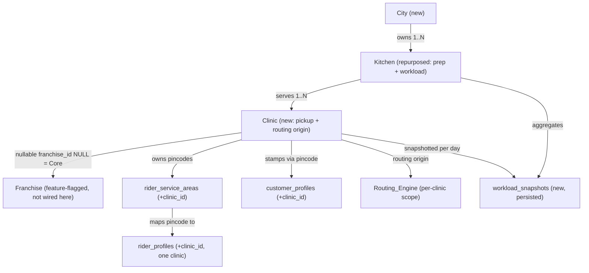
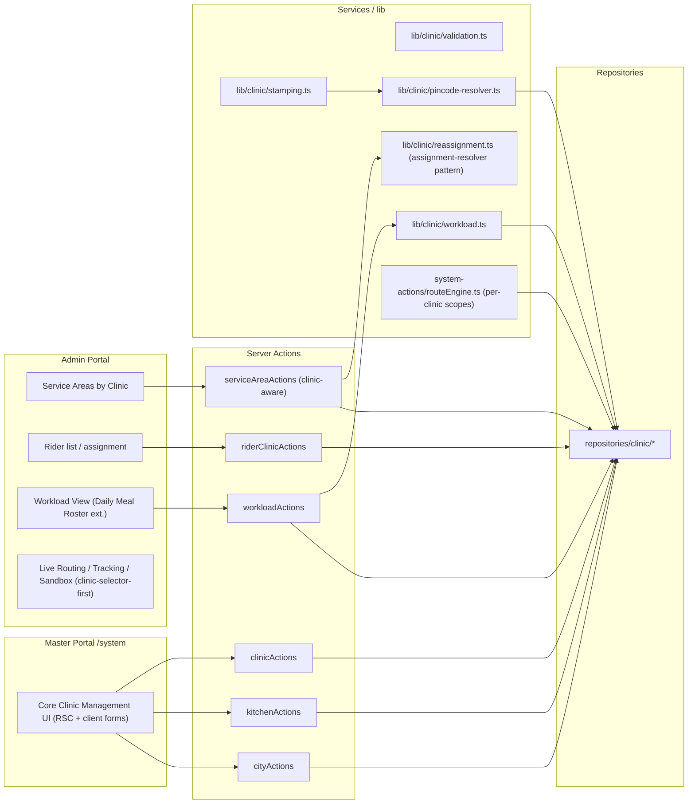
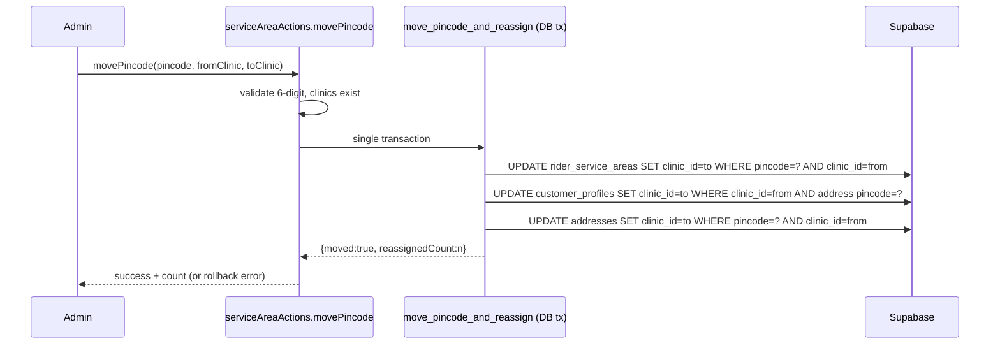

# Design Document

## Overview

This feature introduces a **City → Kitchen → Clinic** hierarchy to the ArogyaDiet CORE business. It repurposes the existing `kitchens` entity from a rider pickup / routing origin into a meal-preparation and workload-aggregation entity, and introduces a new **Clinic** entity that becomes the rider pickup origin and the geographic routing origin.

The design is deliberately **franchise-ready but franchise-inert**. A Clinic carries a nullable `franchise_id` (where `NULL` denotes a Core Clinic), and all franchise-specific reads/writes/side effects remain gated behind the existing `FRANCHISE_FEATURES_ENABLED` flag. This spec implements only the CORE path; franchise wiring, scope-based access control, and warehouse relocation belong to later sequenced specs.

The implementation follows ArogyaDiet's established conventions:

- **Server-first**: data fetching in React Server Components; mutations through Next.js Server Actions in `src/actions/`.
- **Portal isolation**: master portal (`/system`) owns clinic/kitchen/city CRUD; admin portal owns service-area, rider, customer, routing and workload views. No cross-portal imports.
- **Layered access**: Server Actions → services (business logic) → repositories (data access) → Supabase. Background/automation code uses `createAdminClient` (service role, bypasses RLS) exactly as `routeEngine.ts` does today.
- **Additive SQL**: schema changes ship as additive scripts in `/scripts`, respecting Supabase RLS, mirroring the franchise migration pattern.

The design reuses two existing franchise primitives directly:
- The **batch-assignment pattern** in `assignment-resolver.ts` (`assignWaitlistedCustomers`) is the template for customer auto-reassignment on pincode moves (Requirement 7.4).
- The **scope-based dispatch** structure in `routeEngine.ts` (`DispatchScope`, `dispatchScope`) is generalized so each Clinic becomes an independent routing scope.

### Goals

- Establish City, Clinic entities and repurpose Kitchen, without dropping `kitchens`.
- Enforce the **one-pincode-one-clinic** invariant at the database level.
- Persist customer→clinic linkage (stamping) and auto-reassign customers when pincodes move.
- Constrain riders to exactly one clinic and constrain their service areas to that clinic's pincodes.
- Make routing per-clinic (one batch per active rider per clinic), with payout originating from the clinic location.
- Extend the daily automation pipeline to produce and **persist** per-clinic workload snapshots.
- Provide master-portal clinic management and admin-portal clinic visibility/filtering and clinic-selector-first operational views.
- Ship an idempotent, transactional migration seeding a single Madhapur Clinic.

### Non-Goals (Out of Scope)

- Franchise-to-clinic 1:1 wiring and franchise warehouse / stock transfer.
- Scope-based access-control overhaul.
- `shop_products` → warehouse relocation.
- Activating any franchise runtime behavior (flag stays off).

## Architecture

### Hierarchy



### Layered Component Map



### Key Architectural Decisions

1. **Clinic as routing origin via a generalized scope.** `routeEngine.ts` already abstracts routing into `DispatchScope` (with `kitchenLat`/`kitchenLng` origin). We generalize the scope so the origin coordinate is the **Clinic** coordinate and one scope is produced per Clinic. The internal grouping/commit logic is untouched, minimizing risk. The franchise scoping branch is preserved and inert per Requirement 18.

   *Rationale*: reuses tested routing internals; satisfies Requirement 10 and Requirement 18.6 (identical results when flag off given same inputs, because a single Madhapur Clinic origin equals the former single-kitchen origin after migration).

2. **Database-enforced one-pincode-one-clinic.** A global `UNIQUE` constraint on `rider_service_areas.pincode` (present in the live schema as `uq_service_area_pincode`) is the source of truth. Application code surfaces friendly errors, but correctness does not depend on app-level checks.

   *Rationale*: makes Requirement 4 robust against concurrency (4.5).

3. **Stamping is write-time, persisted.** `customer_profiles.clinic_id` and `addresses.clinic_id` are written during signup/address-update, never recomputed at read time (Requirement 6.3). Resolution is a pure function over the pincode→clinic map.

4. **Move + reassignment is atomic.** A pincode move and the customer reassignment that follows execute through a single transactional RPC so partial states never persist (Requirements 4.4, 7.5).

5. **Workload snapshots are persisted, immutable, and de-duplicated.** A unique `(clinic_id, kitchen_id, target_date)` constraint makes finalize idempotent-by-rejection (Requirement 12.2). Statistics read only persisted rows (Requirement 12.4).

6. **Franchise inertness.** All new clinic logic is independent of `franchise_id`. Where the routing engine branches on `FRANCHISE_FEATURES_ENABLED`, the existing branches are retained unchanged (Requirement 18.3).

### Request / Mutation Flow Examples

Service-area pincode **move** with auto-reassignment (Requirements 4.4, 5.7, 7):



## Components and Interfaces

### Master Portal — Core Clinic Management (Requirements 1, 2, 3, 14)

- Location: `src/app/master/(main)/system/` — a "Core Clinic Management" card (Requirement 14.1).
- Server Components render the city/kitchen/clinic lists; client leaf components host the create/edit forms (React Hook Form + Zod).
- Server Actions in `src/actions/master-actions/` (or `admin-actions` following existing layout; master-scoped):
  - `cityActions.ts`: `createCity`, `updateCity`, `deleteCity`.
  - `kitchenActions.ts`: `createKitchen`, `updateKitchen`, `deleteKitchen` (each requires a valid `city_id`).
  - `clinicActions.ts`: `createClinic`, `updateClinic`, `deleteClinic`.

Representative interface:

```typescript
// src/actions/master-actions/clinicActions.ts
"use server";

export type ActionResult<T = void> =
  | { success: true; data: T }
  | { success: false; error: string; field?: string };

export async function createClinic(
  input: ClinicCreateInput
): Promise<ActionResult<{ id: string }>>;

export async function updateClinic(
  id: string,
  input: ClinicUpdateInput
): Promise<ActionResult>;

// Rejects when dependent records exist (service areas, riders, customers, snapshots).
export async function deleteClinic(id: string): Promise<ActionResult>;
```

Validation lives in pure, reusable functions so it can be unit/property tested independently of Supabase:

```typescript
// src/lib/clinic/validation.ts
export type ClinicValidationError =
  | { field: "name"; reason: "empty" | "too_long" }
  | { field: "address"; reason: "empty" | "too_long" }
  | { field: "latitude"; reason: "missing" | "out_of_range" }
  | { field: "longitude"; reason: "missing" | "out_of_range" }
  | { field: "kitchen_id"; reason: "missing" };

// Pure. Returns [] when valid, else the list of specific failures.
export function validateClinicInput(input: ClinicInput): ClinicValidationError[];

export function validateCityName(
  name: string,
  existingNamesLower: Set<string>,
  currentIdLowerName?: string
): { ok: true } | { ok: false; reason: "empty" | "too_long" | "duplicate" };

export function isValidPincode(value: string): boolean; // exactly 6 digits
```

Note on bounds: Requirement 3 specifies clinic name 1–120 / address 1–255 while Requirement 14 specifies 1–200 / 1–500. The design treats these as **two layers**: the master-portal form accepts up to 14's bounds, while the persisted column widths and the canonical domain validator use the **stricter** Requirement 3 bounds for create. To avoid contradiction, the validator is parameterized with explicit max lengths and the master UI passes the bounds defined for its surface. The verification phase flagged this overlap; the resolution adopted here is "validate against the field's declared bound for the surface, persist within column width." (See Error Handling.)

### Admin Portal — Service Areas by Clinic (Requirements 4, 5, 7, 9)

- Location: existing Service Areas section, reorganized into per-Clinic subsections.
- Server Actions `src/actions/admin-actions/serviceAreaActions.ts` (extends existing service-area handling):

```typescript
export async function addPincodeToClinic(
  clinicId: string,
  pincode: string
): Promise<ActionResult>; // rejects duplicate (already-assigned) and bad format

export async function editPincode(
  serviceAreaId: string,
  newPincode: string
): Promise<ActionResult>;

export async function deletePincode(serviceAreaId: string): Promise<ActionResult>;

// Atomic move + cascade customer reassignment.
export async function movePincode(
  pincode: string,
  fromClinicId: string,
  toClinicId: string
): Promise<ActionResult<{ reassignedCount: number; riderWarnings: RiderClinicWarning[] }>>;
```

`RiderClinicWarning` carries the affected rider and pincode when a moved pincode no longer matches a mapping rider's clinic (Requirement 9.4).

### Customer Stamping (Requirement 6)

A clinic analog of the franchise resolver/stamper, kept independent of franchise logic:

```typescript
// src/lib/clinic/pincode-resolver.ts
export type ClinicResolution =
  | { type: "resolved"; clinic_id: string }
  | { type: "none"; clinic_id: null }
  | { type: "ambiguous"; clinic_id: null }; // defensive; DB unique makes this unreachable

export async function resolveClinicForPincode(
  pincode: string
): Promise<ClinicResolution>;
```

`addressActions.ts` and the signup flow call the resolver and persist `clinic_id` within the **same operation** that writes the address/profile (Requirement 6.1, 6.2), set `NULL` when unresolved (6.4, 6.5), and leave it unchanged on ambiguity (6.6). Existing inputs/outputs/completion behavior are preserved; only the stamp is added (6.7).

### Customer Auto-Reassignment (Requirement 7)

```typescript
// src/lib/clinic/reassignment.ts — mirrors assignWaitlistedCustomers batch pattern
export async function reassignCustomersOnPincodeMove(params: {
  pincode: string;
  fromClinicId: string;
  toClinicId: string;
}): Promise<{ reassigned: number; error?: string }>;
```

Executed inside the move transaction so a failure leaves all affected `clinic_id` values unchanged (7.5) and a clean run returns the count (7.3, returns `0` when none match).

### Order Clinic Stamping (Requirement 19)

Delivery orders and batches each carry an **immutable** `clinic_id` recorded at the moment they are created. This is the authoritative basis for per-clinic workload snapshots, routing, and delivery history — it must never drift when a customer later moves between clinics.

```typescript
// src/lib/clinic/order-stamp.ts
// Pure resolver of the stamp value at creation time; persistence happens within
// the same write that creates the order/batch (no separate update step).

// Order stamp = the customer's resolved clinic for the delivery address at
// creation time. Reuses pincode-resolver / the customer stamp already on the
// address. Null when unresolved (Req 19.2, 19.8).
export function resolveOrderClinicStamp(
  addressClinicId: string | null
): string | null;

// Batch stamp = the rider's linked clinic for the routing scope at routing
// time. Null when the rider has no linked clinic (Req 19.3, 19.9).
export function resolveBatchClinicStamp(
  riderClinicId: string | null
): string | null;

// Immutability guard used by every order/batch writer. Returns ok only when the
// stamp is being set for the first time (current === null). Any attempt to
// change an already-set stamp is rejected (Req 19.4, 19.5).
export function assertStampImmutable(
  current: string | null,
  incoming: string | null
): { ok: true } | { ok: false; reason: "immutable" };
```

Stamping rules:

- **Order stamp (creation-time).** When a `delivery_orders` row is created, its `clinic_id` is set exactly once from the customer's resolved clinic for the delivery address at that time — reusing the same `pincode-resolver` / customer stamp used at signup/address-update (Req 19.2). If the address resolves to no clinic, `clinic_id` is left `null` and order creation is **not** blocked (Req 19.8).
- **Batch stamp (routing-time).** When a `delivery_batches` row is created during routing, its `clinic_id` is set exactly once to the rider's linked clinic for that routing scope (Req 19.3). If the rider has no linked clinic, `clinic_id` is left `null` and batch creation is not blocked (Req 19.9).
- **Immutability at the write layer.** No code path issues an `UPDATE` of `delivery_orders.clinic_id` or `delivery_batches.clinic_id` after creation. A customer clinic change, a pincode move, and customer auto-reassignment (`reassignCustomersOnPincodeMove`, Requirement 7) explicitly scope their writes to `customer_profiles` / `addresses` and never touch order or batch stamps (Req 19.4). Any operation that attempts to modify an existing stamp is rejected via `assertStampImmutable` with an "immutable" error, leaving the original value intact (Req 19.5).
- **History stability.** Because the stamp is frozen at creation, a customer's prior orders remain attributed to the clinic that served them even after the customer is moved to a different clinic (Req 19.6, 19.7).

```mermaid
sequenceDiagram
  participant Create as Order Creation (pipeline)
  participant Addr as addresses.clinic_id (customer stamp)
  participant DO as delivery_orders
  participant Move as Pincode Move / Reassignment
  Create->>Addr: read resolved clinic for delivery address
  Create->>DO: INSERT delivery_order (clinic_id := resolved | null)  [set once]
  Note over DO: clinic_id is now frozen
  Move->>Addr: UPDATE customer/address clinic_id (A → B)
  Move--xDO: never UPDATEs delivery_orders.clinic_id (Req 19.4)
```

### Rider ↔ Clinic Linkage and Service-Area Constraint (Requirements 8, 9)

```typescript
// src/actions/admin-actions/riderClinicActions.ts
export async function assignRiderToClinic(
  riderId: string,
  clinicId: string
): Promise<ActionResult>; // replaces any existing linkage; rejects invalid/inactive clinic

// Pincodes selectable for a rider = pincodes belonging to the rider's linked clinic.
export async function getAssignablePincodesForRider(
  riderId: string
): Promise<ActionResult<string[]>>;

export async function assignServiceAreaToRider(
  riderId: string,
  pincode: string
): Promise<ActionResult>; // rejects when no clinic linked or pincode outside clinic
```

Rider→clinic linkage is stored as `rider_profiles.clinic_id` (single active clinic; reassignment overwrites — Requirement 8.1–8.3). Assignment is manual-only; no automatic creation/modification (8.4).

### Routing Engine — Per-Clinic Scopes (Requirement 10)

`routeEngine.ts` is extended so scope construction enumerates Clinics instead of a single kitchen:

```typescript
type DispatchScope = {
  clinicId: string;          // new — clinic is the scope key
  franchiseId: string | null;
  label: string;             // e.g. `clinic:<name>`
  originLat: number;         // clinic latitude (was kitchenLat)
  originLng: number;         // clinic longitude (was kitchenLng)
  scopedByFranchise: boolean;
};
```

Scope builder logic:
- For each Core Clinic (`franchise_id IS NULL`) with valid coordinates, build one scope with the clinic coordinate as origin (10.1).
- Skip clinics with missing/out-of-range coordinates, record an error indication identifying the clinic, continue others (10.7).
- Within a scope, orders are grouped to active riders **assigned to that clinic**; one batch per active rider (10.2), total batches = sum of active riders across clinics with routable orders (10.3).
- Each per-clinic batch records `delivery_batches.clinic_id` = the scope's clinic (the rider's linked clinic at routing time) as its immutable Order_Clinic_Stamp (Req 19.3); a rider with no linked clinic yields a `null` batch stamp without blocking routing (Req 19.9). The orders grouped into the batch already carry their own creation-time `delivery_orders.clinic_id` stamp and are never re-stamped here (Req 19.4).
- Skip scopes with zero routable orders or zero active riders without error (10.6).
- Payout per leg = `Haversine(origin→stop or stop→stop) × 1.3 × payoutPerKm`, summed and rounded to 2 dp; `route_sequence` stays 1..n consecutive (10.4, 10.5). This already exists in `computeOpenLoopHaversineRoute` / `computeOpenLoopRoute`; only the origin source changes.
- When `FRANCHISE_FEATURES_ENABLED` is false, only Core Clinics route; franchise scope branches retained and inactive (10.8, 18.3, 18.6).

### Automation Pipeline Extension (Requirement 11)

The central pipeline runs sequentially: **order creation → product linking → snapshotting → routing** (11.6), orchestrated by a single entry point that calls `generateDailyOrders`, the product-linking step, the new snapshot finalizer, then `executeAutomatedDispatch`.

```typescript
// src/actions/system-actions/dailyPipeline.ts
export async function runDailyPipeline(targetDate: string): Promise<PipelineResult>;
```

- Order creation at 5:15 PM IST after the 5:00 PM cutoff produces preliminary per-clinic workload within 30 min (11.1). At this step each created `delivery_orders` row is stamped with `clinic_id` = the customer's resolved clinic for the delivery address at creation time, set exactly once and immutable thereafter (Req 19.2); unresolved addresses leave the stamp `null` without blocking creation (Req 19.8).
- Cutoff enforcement rejects next-day meal-planner edits / address changes / pauses after 5:00 PM IST (11.2) — enforced in the relevant customer actions using IST helpers in `src/lib/dates/ist.ts`.
- Product linking at 12:05 AM IST attributes purchases from 12:00–11:59 the previous day (11.3).
- On link completion, produce exactly one finalized snapshot per clinic with veg/non-veg/egg + shop product counts as non-negative integers (11.4), then route within 60 s using each clinic origin (11.5). Meal counts for a (clinic, date) are derived by counting the `delivery_orders` whose **stamped** `clinic_id` equals that clinic and whose `delivery_date` equals the target date — never via the customer's current `clinic_id` (Req 19.6).
- On any step failure: halt, retain last good output, record failing step (11.7); order-creation and product-linking steps retry up to 3 times before halting (11.8).

### Persisted Workload Snapshots & Statistics (Requirements 12, 13)

```typescript
// src/lib/clinic/workload.ts
export async function finalizeWorkloadSnapshot(
  input: WorkloadSnapshotInput
): Promise<ActionResult<{ id: string }>>; // rejects duplicate (clinic,kitchen,date)

export function aggregateSnapshots(
  rows: WorkloadSnapshot[],
  grouping: "day" | "week" | "month"
): WorkloadAggregate[]; // pure aggregation, empty/zero result when no rows
```

Statistics requests validate `start <= end` (12.5), aggregate persisted rows in range grouped day/week/month per clinic and per kitchen (12.4), and return zeroed empty results when no rows match (12.6, 13.3). Snapshot meal counts are themselves derived from the **order stamp**: for a (clinic, date) the veg/non-veg/egg tallies count `delivery_orders` whose stamped `clinic_id` equals that clinic and whose `delivery_date` equals the target date, so historical attribution stays stable when customers later change clinics (Req 19.6, 19.7) — it is never recomputed from the customer's current `clinic_id`. The workload view extends the existing Daily Meal Roster in the admin Operations area (13.1), shows the most recent 30 days of history (13.2), and is restricted to `ADMIN` and `MASTER_ADMIN` (13.4); franchise admin role is denied (13.5).

### Clinic Visibility, Filters, Selector-First Views (Requirements 16, 17)

- Rider List and Rider Activity gain a "Clinic" column; unlinked shows a placeholder ("—"/"Unassigned") (16.1–16.3, 16.7).
- A Clinic filter control on each Rider/Customer table title bar, populated with clinics + "All Clinics" (16.4–16.6). Filtering is a pure predicate over the loaded rows.
- Live Routing Board, Live Tracking, and Sandbox are **clinic-selector-first**: no rider/route/tracking data until a clinic is selected; selecting shows only that clinic's riders; changing replaces within 3 s; empty-state when zero riders; selector restricted to authorized clinics (17.1–17.9).

### Migration & Seed (Requirement 15)

Additive SQL in `/scripts` (e.g., `create-clinic-hierarchy-tables.sql`, `add-clinic-stamp-to-orders.sql`, `seed-madhapur-clinic.sql`), respecting RLS, idempotent and transactional. Seeds exactly one Madhapur Clinic from the central kitchen's address and `lat`/`lng` (the kitchen's live coordinate columns) (15.1–15.2), stamps all customers, links all riders, associates all service-area pincodes to it (15.3–15.5), leaves zero orphans (15.6), is idempotent on re-run (15.7), and rolls back fully on failure (15.8). The same seed also **back-stamps** existing history so prior orders are attributed: it sets `delivery_orders.clinic_id` and `delivery_batches.clinic_id` to the Madhapur Clinic for all pre-existing rows whose stamp is still `null`. This back-stamp is idempotent (only fills `null` stamps, never overwrites an existing stamp — honoring the immutability rule of Req 19.4/19.5) and runs inside the same transaction so a partial failure rolls back fully (Req 19.6, 19.7).

## Data Models

### New / Modified Tables

```sql
-- cities (new)
CREATE TABLE public.cities (
  id UUID PRIMARY KEY DEFAULT gen_random_uuid(),
  name VARCHAR(100) NOT NULL,
  created_at TIMESTAMPTZ NOT NULL DEFAULT now(),
  updated_at TIMESTAMPTZ NOT NULL DEFAULT now()
);
-- case-insensitive uniqueness (Req 1.1)
CREATE UNIQUE INDEX uq_cities_name_lower ON public.cities (lower(name));

-- kitchens (existing, retained — add city_id; Req 2)
-- NOTE: kitchen coordinate columns in the live schema are `lat` / `lng`
-- (numeric, NOT NULL), NOT `latitude` / `longitude`. Kitchens are no longer
-- the routing origin (Req 2.4); these coordinates are retained only as the
-- placeholder source for the Madhapur seed (Req 15.1).
ALTER TABLE public.kitchens
  ADD COLUMN IF NOT EXISTS city_id UUID REFERENCES public.cities(id);

-- clinics (new; Req 3, 18)
CREATE TABLE public.clinics (
  id UUID PRIMARY KEY DEFAULT gen_random_uuid(),
  name VARCHAR(200) NOT NULL,                 -- widest declared bound (Req 14)
  address VARCHAR(500) NOT NULL,
  latitude  DOUBLE PRECISION NOT NULL CHECK (latitude  BETWEEN -90  AND 90),
  longitude DOUBLE PRECISION NOT NULL CHECK (longitude BETWEEN -180 AND 180),
  kitchen_id   UUID NOT NULL REFERENCES public.kitchens(id),
  franchise_id UUID NULL REFERENCES public.franchises(id), -- NULL = Core Clinic
  created_at TIMESTAMPTZ NOT NULL DEFAULT now(),
  updated_at TIMESTAMPTZ NOT NULL DEFAULT now()
);
CREATE INDEX idx_clinics_kitchen   ON public.clinics(kitchen_id);
CREATE INDEX idx_clinics_franchise ON public.clinics(franchise_id);

-- rider_service_areas (existing — add clinic_id + enforce one-pincode-one-clinic; Req 4)
ALTER TABLE public.rider_service_areas
  ADD COLUMN IF NOT EXISTS clinic_id UUID REFERENCES public.clinics(id);
-- Global unique pincode (one pincode → one clinic). The live schema already
-- defines this as uq_service_area_pincode; retained/aligned here.
CREATE UNIQUE INDEX IF NOT EXISTS uq_service_area_pincode
  ON public.rider_service_areas(pincode);
CREATE INDEX IF NOT EXISTS idx_service_areas_clinic
  ON public.rider_service_areas(clinic_id);

-- rider_profiles (existing — single clinic linkage; Req 8)
ALTER TABLE public.rider_profiles
  ADD COLUMN IF NOT EXISTS clinic_id UUID REFERENCES public.clinics(id);

-- customer_profiles (existing — stamped clinic; Req 6)
ALTER TABLE public.customer_profiles
  ADD COLUMN IF NOT EXISTS clinic_id UUID REFERENCES public.clinics(id);

-- addresses (existing — clinic stamp mirrors customer; Req 6.2, 7.2)
ALTER TABLE public.addresses
  ADD COLUMN IF NOT EXISTS clinic_id UUID REFERENCES public.clinics(id);

-- delivery_orders / delivery_batches (existing — order-level clinic stamp; Req 19)
-- Shipped as an additive script: scripts/add-clinic-stamp-to-orders.sql
-- These stamps are IMMUTABLE after creation (Req 19.4, 19.5): once written at
-- order/batch creation they are never updated by pincode moves, customer moves,
-- or auto-reassignment. Nullable so an unresolved clinic never blocks creation
-- (Req 19.8, 19.9). Indexed on (clinic_id, delivery_date) to drive per-clinic
-- workload aggregation and history off the stamp (Req 19.6, 12).
ALTER TABLE public.delivery_orders
  ADD COLUMN IF NOT EXISTS clinic_id UUID REFERENCES public.clinics(id);
CREATE INDEX IF NOT EXISTS idx_delivery_orders_clinic_date
  ON public.delivery_orders(clinic_id, delivery_date);

ALTER TABLE public.delivery_batches
  ADD COLUMN IF NOT EXISTS clinic_id UUID REFERENCES public.clinics(id);
CREATE INDEX IF NOT EXISTS idx_delivery_batches_clinic_date
  ON public.delivery_batches(clinic_id, delivery_date);
-- addon_orders inherit their clinic via delivery_order_id (their parent
-- Delivery_Order's stamp); no own clinic_id column is required.

-- workload_snapshots (new, persisted; Req 12)
CREATE TABLE public.workload_snapshots (
  id UUID PRIMARY KEY DEFAULT gen_random_uuid(),
  clinic_id  UUID NOT NULL REFERENCES public.clinics(id),
  kitchen_id UUID NOT NULL REFERENCES public.kitchens(id),
  target_date DATE NOT NULL,
  veg_count     INTEGER NOT NULL DEFAULT 0 CHECK (veg_count     BETWEEN 0 AND 100000),
  non_veg_count INTEGER NOT NULL DEFAULT 0 CHECK (non_veg_count BETWEEN 0 AND 100000),
  egg_count     INTEGER NOT NULL DEFAULT 0 CHECK (egg_count     BETWEEN 0 AND 100000),
  shop_product_counts JSONB NOT NULL DEFAULT '{}'::jsonb, -- {productId: count(0..100000)}
  created_at TIMESTAMPTZ NOT NULL DEFAULT now(),
  CONSTRAINT uq_snapshot_clinic_kitchen_date UNIQUE (clinic_id, kitchen_id, target_date)
);
CREATE INDEX idx_snapshots_target_date ON public.workload_snapshots(target_date);
CREATE INDEX idx_snapshots_clinic      ON public.workload_snapshots(clinic_id);
```

### TypeScript Types

```typescript
// src/types/clinic.ts
export interface City   { id: string; name: string; }
export interface Clinic {
  id: string;
  name: string;
  address: string;
  latitude: number;
  longitude: number;
  kitchen_id: string;
  franchise_id: string | null; // null = Core Clinic
}
export interface WorkloadSnapshot {
  id: string;
  clinic_id: string;
  kitchen_id: string;
  target_date: string; // ISO date
  veg_count: number;
  non_veg_count: number;
  egg_count: number;
  shop_product_counts: Record<string, number>;
}
export interface WorkloadAggregate {
  clinic_id: string;
  kitchen_id: string;
  bucket: string; // day/week/month key
  veg_count: number;
  non_veg_count: number;
  egg_count: number;
  shop_product_counts: Record<string, number>;
}

// Order-level clinic stamp (Req 19). Set once at creation, immutable thereafter.
// `clinic_id` is null when the address/rider did not resolve to a clinic at
// creation/routing time (Req 19.8, 19.9).
export interface OrderClinicStamp {
  clinic_id: string | null;
  delivery_date: string; // ISO date
}
```

### Zod Schemas

```typescript
// src/validations/clinic.ts
export const pincodeSchema = z.string().regex(/^\d{6}$/, "Pincode must be exactly 6 digits");
export const clinicCreateSchema = z.object({
  name: z.string().min(1).max(120),       // Req 3 create bounds
  address: z.string().min(1).max(255),
  latitude: z.number().min(-90).max(90),
  longitude: z.number().min(-180).max(180),
  kitchen_id: z.string().uuid(),
});
export const citySchema = z.object({ name: z.string().min(1).max(100) });
```

### Database Constraints as Invariants

| Invariant | Mechanism | Requirement |
| --- | --- | --- |
| One pincode → one clinic | `uq_service_area_pincode` UNIQUE | 4.1, 4.2, 4.5 |
| City name unique (case-insensitive) | `uq_cities_name_lower` | 1.1 |
| Clinic coordinates in range | `CHECK` on latitude/longitude | 3.6 |
| Clinic belongs to one kitchen | `kitchen_id NOT NULL FK` | 3.2 |
| One snapshot per (clinic,kitchen,date) | `uq_snapshot_clinic_kitchen_date` | 12.2 |
| Snapshot counts bounded 0..100000 | `CHECK` constraints | 12.1 |
| Core Clinic | `franchise_id IS NULL` | 3.4, 18.1 |
| Order/batch clinic stamp is immutable | write-layer guard (never `UPDATE clinic_id`) | 19.4, 19.5 |

## Correctness Properties

*A property is a characteristic or behavior that should hold true across all valid executions of a system — essentially, a formal statement about what the system should do. Properties serve as the bridge between human-readable specifications and machine-verifiable correctness guarantees.*

The properties below were derived from the acceptance-criteria prework. Logically redundant criteria were consolidated (e.g. service-area move/duplicate-add, the three clinic-selector-first views, and the flag-off equivalence) so each property carries unique validation value. Properties are organized by domain. Examples, edge cases, smoke and integration checks from the prework are covered in the Testing Strategy rather than as universal properties.

### Property 1: City name validity and case-insensitive uniqueness

*For any* candidate city name and any set of existing city names, the city-name validator accepts the candidate if and only if it is non-empty, at most 100 characters, and not a case-insensitive duplicate of any other existing name (a city editing to its own current name is allowed); rejection reports the specific reason (empty, too long, or duplicate) and leaves existing records unchanged.

**Validates: Requirements 1.1, 1.3, 1.4**

### Property 2: Dependency-guarded deletion

*For any* City, Kitchen, or Clinic and any number of dependent records referencing it, deletion succeeds if and only if the dependent count is zero; when dependents exist the record and its associations are retained and an error indicating dependents is returned.

**Validates: Requirements 1.5, 1.6, 14.5, 14.6**

### Property 3: Kitchen requires a valid city, and clinic–kitchen must share a city

*For any* Kitchen save input, the save is accepted only when it references an existing City; and *for any* Clinic-to-Kitchen association, the association is accepted if and only if the Kitchen and Clinic belong to the same City — otherwise the operation is rejected and existing associations are left unchanged.

**Validates: Requirements 2.6, 2.7**

### Property 4: Clinic input validation identifies every offending field

*For any* clinic create/edit input, the validator returns no errors if and only if the name is non-empty within its declared maximum, the address is non-empty within its declared maximum, the latitude is present and within -90..90 inclusive, the longitude is present and within -180..180 inclusive, and the kitchen reference is present; otherwise it returns an error for each offending field (name, address, latitude, longitude, or kitchen) and persists no record.

**Validates: Requirements 3.5, 3.6, 3.7, 14.2, 14.3**

### Property 5: Clinic persistence round-trip

*For any* valid clinic input, creating the clinic and then reading it back yields equal values for name, address, latitude, longitude, and kitchen_id; and editing to new valid values then reading back yields the updated values.

**Validates: Requirements 3.1, 14.4**

### Property 6: Core Clinic classification

*For any* clinic, the clinic is classified as a Core Clinic if and only if its `franchise_id` is `NULL`.

**Validates: Requirements 3.4, 18.1**

### Property 7: One pincode belongs to exactly one clinic

*For any* sequence of add, edit, delete, and move operations on service areas, at every resulting state each pincode is associated with at most one clinic, and the database unique constraint causes any operation that would create a second association for an already-assigned pincode to be rejected with the current owner identified, leaving the existing association unchanged.

**Validates: Requirements 4.1, 4.3, 5.3**

### Property 8: Pincode move is atomic and single-homed

*For any* pincode currently associated with a source clinic, a successful move associates the pincode only with the destination clinic; if the move fails, the pincode remains associated only with the source clinic. In no observable state is the pincode associated with both.

**Validates: Requirements 4.4, 5.7**

### Property 9: Pincode format validation

*For any* string, the pincode validator accepts it if and only if it consists of exactly six numeric digits; rejected add/edit attempts make no change to any service-area record.

**Validates: Requirements 5.4**

### Property 10: Service areas partition by clinic

*For any* set of service-area records, grouping them by clinic produces a partition: the union of all clinic groups equals the input set and the groups are pairwise disjoint (each pincode appears under exactly one clinic).

**Validates: Requirements 5.1**

### Property 11: Customer clinic stamping reflects pincode resolution

*For any* pincode-to-clinic mapping, when a customer signs up or updates a delivery address: if the pincode resolves to exactly one clinic the customer's stamped `clinic_id` and the matching address `clinic_id` equal that clinic; if it resolves to no clinic the stamped `clinic_id` is set to unset; and the persisted value read back equals the value written at operation time (not recomputed at read time).

**Validates: Requirements 6.1, 6.2, 6.3, 6.4, 6.5**

### Property 12: Customer auto-reassignment selects exactly the matching subset

*For any* set of customers and any pincode move from clinic A to clinic B, exactly the customers whose stamped address pincode equals the moved pincode and whose current stamped clinic is A are reassigned to B (both their `clinic_id` and their matching address `clinic_id` become B); all other customers are unchanged; and the returned reassigned count equals the size of that matching subset (zero when none match).

**Validates: Requirements 7.1, 7.2, 7.3**

### Property 13: Reassignment is atomic on failure

*For any* reassignment batch that fails, the stamped `clinic_id` of every affected customer is left unchanged and an error indication describing the failure is returned.

**Validates: Requirements 7.5**

### Property 14: Rider has at most one clinic, replaced on reassignment

*For any* sequence of rider-to-clinic assignment and reassignment operations against existing active clinics, each rider retains at most one active clinic linkage, and after a reassignment the single remaining linkage equals the most recently assigned clinic.

**Validates: Requirements 8.1, 8.3**

### Property 15: Rider–clinic assignment rejects invalid targets

*For any* assignment targeting a clinic that does not exist or is not active, the assignment is rejected and any existing rider-to-clinic linkage is left unchanged.

**Validates: Requirements 8.5**

### Property 16: Service-area assignment is bounded by the rider's clinic

*For any* rider, if the rider has no linked clinic then every service-area assignment is rejected with a clinic-required error and no change is made; if the rider is linked to a clinic, the set of assignable pincodes equals exactly that clinic's pincodes, and an attempt to assign any pincode outside that clinic is rejected leaving existing associations unchanged.

**Validates: Requirements 9.1, 9.2, 9.3**

### Property 17: Pincode-move clinic-mismatch warning

*For any* pincode move, for every rider that maps the moved pincode and whose linked clinic differs from the destination clinic, the system emits a warning identifying that rider and that pincode.

**Validates: Requirements 9.4**

### Property 18: Routing uses each clinic as its own origin

*For any* set of clinics with valid coordinates, the routing engine builds one independent scope per clinic whose route origin coordinate equals that clinic's stored latitude and longitude, and never uses kitchen coordinates as the routing origin.

**Validates: Requirements 10.1, 2.4**

### Property 19: One batch per active rider, and total batches equal the sum across clinics

*For any* configuration of clinics, active riders, and routable orders, each active rider with routable orders within a clinic scope produces exactly one batch, and the total number of batches produced equals the sum, over all clinics having at least one routable order, of the active riders in that clinic.

**Validates: Requirements 10.2, 10.3**

### Property 20: Rider payout formula

*For any* clinic origin, ordered list of stops, and `Payout_Per_Km` setting, the computed rider payout equals the sum of per-leg distances — where each leg distance is the Haversine distance multiplied by 1.3, covering the leg from the clinic origin to the first stop and each leg between consecutive stops — multiplied by `Payout_Per_Km` and rounded to two decimal places.

**Validates: Requirements 10.4**

### Property 21: Route sequence is a gapless 1..n ordering

*For any* batch of n stops, the assigned `route_sequence` values are exactly the consecutive integers 1 through n in delivery order, with no gaps and no duplicates.

**Validates: Requirements 10.5**

### Property 22: Routing skips degenerate and invalid scopes without aborting

*For any* mix of clinic scopes, a scope with zero routable orders or zero active riders is skipped without raising an error, and a clinic with missing or out-of-range coordinates is skipped with an error indication identifying that clinic; in both cases the remaining valid clinic scopes are still routed.

**Validates: Requirements 10.6, 10.7**

### Property 23: Next-day cutoff enforcement

*For any* customer attempt to edit the meal planner, change an address, or pause for the next delivery day, the operation is rejected with a cutoff-passed error and the affected data is left unchanged if and only if the attempt occurs at or after the 5:00 PM IST cutoff for that delivery day.

**Validates: Requirements 11.2**

### Property 24: Purchase day-attribution window

*For any* shop-purchase timestamp, the product-linking step attributes the purchase to the calendar day whose IST window is 12:00 AM through 11:59 PM containing that timestamp, such that a purchase at 12:01 AM IST is attributed to that day's run and excluded from the prior day's run.

**Validates: Requirements 11.3**

### Property 25: Snapshot finalization produces one well-formed snapshot per clinic

*For any* set of clinics with order and shop-purchase data, finalization produces exactly one Workload_Snapshot per clinic, each containing veg, non-veg, and egg meal counts plus shop product counts, every count being a non-negative integer that matches the tallied source data.

**Validates: Requirements 11.4, 12.1**

### Property 26: Pipeline halts at the failing step and preserves prior output

*For any* pipeline step that fails, the pipeline halts at that step, retains the last successfully produced output of earlier steps, and records which step failed.

**Validates: Requirements 11.7**

### Property 27: Snapshot persistence is unique per (clinic, kitchen, date)

*For any* finalize request whose (clinic, kitchen, target date) combination already has a persisted snapshot, the duplicate persistence is rejected, the existing record is retained unchanged, and an already-exists error is returned; the first finalize for a combination persists a record whose values read back equal those written (round trip).

**Validates: Requirements 12.1, 12.2**

### Property 28: Workload aggregation correctness over a valid range

*For any* set of persisted snapshots, any date range with start on or before end, and any grouping of day, week, or month, the aggregated result groups the in-range snapshots by the requested bucket per clinic and per kitchen, where each aggregated count equals the sum of the corresponding counts of the in-range snapshots in that bucket; when no snapshot falls in range the result is empty with all counts reported as zero.

**Validates: Requirements 12.4, 12.6, 13.3**

### Property 29: Invalid date range is rejected

*For any* statistics request whose start date is after its end date, the request is rejected with an invalid-range error.

**Validates: Requirements 12.5**

### Property 30: Workload-view authorization

*For any* user role, access to the workload view (including its kitchen breakdown) is granted if and only if the role is `ADMIN` or `MASTER_ADMIN`; all other roles, including franchise admin, are denied and no clinic or kitchen workload data is returned.

**Validates: Requirements 13.4, 13.5**

### Property 31: Clinic display name or placeholder

*For any* rider or customer record, the displayed Clinic value is the linked clinic's name when a clinic is linked, and a placeholder (for example "—" or "Unassigned") when no clinic is linked.

**Validates: Requirements 16.3, 16.7**

### Property 32: Clinic filter predicate

*For any* set of rider or customer rows and any clinic filter selection, the displayed rows are exactly those whose linked clinic matches the selection; when "All Clinics" is selected or the filter is cleared, all rows are displayed.

**Validates: Requirements 16.5, 16.6**

### Property 33: Clinic-selector-first gating

*For any* operational view among the Live Routing Board, Live Tracking, and the Sandbox, while no clinic is selected no rider, route, or tracking data is displayed (only the selector); and when a clinic is selected the displayed riders are exactly those assigned to the selected clinic, excluding all riders of other clinics, with an empty-state shown when the selected clinic has zero riders.

**Validates: Requirements 17.1, 17.2, 17.3, 17.4, 17.5, 17.6, 17.8**

### Property 34: Selection change retains no stale riders

*For any* sequence of clinic selections in an operational view, the displayed rider set equals only the most recently selected clinic's riders, with no riders from any previously selected clinic retained.

**Validates: Requirements 17.7**

### Property 35: Selector restricted to authorized clinics

*For any* authenticated user, the clinic selector options in the operational views equal the set of clinics the user is authorized to access.

**Validates: Requirements 17.9**

### Property 36: Feature-flag-off equivalence

*For any* set of routing and customer-assignment inputs, while `FRANCHISE_FEATURES_ENABLED` is false (including when the environment variable is unset, which resolves to false), the routing engine routes only Core Clinics and produces routing batches and customer-assignment outcomes identical to those produced before the `clinics.franchise_id` column was introduced, given the same inputs, with no franchise-specific reads, writes, or side effects.

**Validates: Requirements 10.8, 18.3, 18.4, 18.6**

### Property 37: Order and batch clinic stamps are set once at creation

*For any* pincode-to-clinic mapping, set of customer addresses, and rider-to-clinic linkages: when a Delivery_Order is created, its `clinic_id` equals the clinic the customer's delivery address resolves to at that time (and is `null` when the address resolves to no clinic, without blocking creation); and when a Delivery_Batch is created during routing, its `clinic_id` equals the routing rider's linked clinic at that time (and is `null` when the rider has no linked clinic, without blocking creation). In every case the stamp equals the resolved clinic at creation time and is written exactly once.

**Validates: Requirements 19.2, 19.3, 19.8, 19.9**

### Property 38: Clinic stamp is immutable after creation

*For any* set of existing Delivery_Orders and Delivery_Batches carrying clinic stamps, and *for any* subsequent sequence of customer clinic changes, pincode moves, and customer auto-reassignments, the `clinic_id` of every already-created Delivery_Order and Delivery_Batch is left unchanged; and *for any* direct attempt to modify an existing (non-null) stamp to a different value, the operation is rejected with an immutability error and the original stamped value is retained (a stamp may only transition from unset to set, never set-to-different).

**Validates: Requirements 19.4, 19.5**

### Property 39: Per-clinic workload and history derive from the order stamp

*For any* set of Delivery_Orders whose stamped `clinic_id` may differ from their customers' current `clinic_id`, the per-clinic workload snapshot counts and the per-clinic routing/delivery history for a (clinic, date) are computed by attributing each order to its stamped `clinic_id` and `delivery_date`, never to the customer's current `clinic_id`; consequently moving a customer to a different clinic leaves the attribution of that customer's prior orders unchanged.

**Validates: Requirements 19.6, 19.7**

## Error Handling

All Server Actions return a discriminated `ActionResult` (`{ success: true, data }` or `{ success: false, error, field? }`) rather than throwing across the client boundary. UI surfaces the message and highlights `field` where present.

### Validation Errors (client-recoverable)

- **City/Kitchen/Clinic field validation** (Requirements 1.3, 2.6, 3.6, 3.7, 14.3): pure validators return the specific offending field(s) and reason. Zod schemas guard the form layer; the canonical domain validators (`validateClinicInput`, `validateCityName`) are the source of truth and are independently testable.
- **Pincode format** (Requirement 5.4): `isValidPincode` rejects non-6-digit values before any DB write.
- **Bound overlap (Req 3 vs Req 14)**: validators are parameterized with explicit maximum lengths. The master-portal surface uses the Requirement 14 bounds (name ≤ 200, address ≤ 500), matching the column widths. The Requirement 3 create path uses the stricter bounds (name ≤ 120, address ≤ 255). Persistence always stays within the column widths, so no valid input is ever truncated. This resolves the apparent contradiction flagged during requirements verification.

### Conflict / Constraint Errors (DB-enforced)

- **One-pincode-one-clinic** (Requirements 4.3, 4.5): the `uq_service_area_pincode` unique constraint is authoritative. Application code pre-checks for a friendly message identifying the current owner, but the constraint guarantees correctness under concurrency; a unique-violation is caught and mapped to an "already assigned" error.
- **Duplicate snapshot** (Requirement 12.2): `uq_snapshot_clinic_kitchen_date` violation is caught and mapped to an already-exists error; the existing record is never modified.
- **Immutable order/batch stamp** (Requirements 19.4, 19.5): the write layer never issues an `UPDATE` of `delivery_orders.clinic_id` or `delivery_batches.clinic_id` after creation, and `assertStampImmutable` rejects any attempt to change an already-set stamp, returning an "Order_Clinic_Stamp is immutable" error while retaining the original value. Pincode-move and customer auto-reassignment writes are scoped to `customer_profiles`/`addresses` only and never touch order/batch stamps.

### Transactional / Atomic Errors

- **Pincode move + customer reassignment** (Requirements 4.4, 7.5): executed in a single Postgres transaction via an RPC (`move_pincode_and_reassign`). Any failure rolls back so neither the pincode association nor any customer `clinic_id` changes persist; the action returns the failure cause.
- **Migration** (Requirement 15.8): wrapped in a transaction; partial failure rolls back fully and surfaces an error.

### Routing / Pipeline Errors (resilient, logged)

- **Per-scope isolation** (Requirements 10.6, 10.7): a clinic with no orders, no active riders, or invalid coordinates is skipped; invalid coordinates record an error indication identifying the clinic (consistent with the existing `coordinateAudit`/`skipped*` accumulators in `routeEngine.ts`). One bad clinic never aborts the run.
- **Per-rider isolation**: `processRiderDispatchSafe` already isolates rider-level failures; retained.
- **Pipeline halt + retry** (Requirements 11.7, 11.8): the orchestrator halts at the first failing step, preserves prior outputs, records the failing step, and retries the order-creation and product-linking steps up to 3 times before halting.

### Authorization Errors

- **Workload view** (Requirements 13.4, 13.5): a non-`ADMIN`/`MASTER_ADMIN` role receives an access-denied result with no workload data. Enforced in the Server Component/action layer and reinforced by RLS.

## Testing Strategy

This feature mixes pure logic (validation, resolution, stamping, reassignment selection, payout math, sequencing, aggregation, filtering, authorization) with infrastructure (migrations, scheduler timing, RLS). Property-based testing applies to the pure-logic layer; unit, integration, and smoke tests cover the rest.

### Dual Approach

- **Property tests** verify the universal properties above across many generated inputs.
- **Unit tests** cover specific examples, positive happy-paths, and edge cases (e.g. Requirements 1.2, 1.7, 2.5, 5.2, 5.5, 8.2, 14.1, 14.5, 15.9, 16.1, 16.2, 16.4).
- **Integration tests** (1–3 examples) cover scheduler timing and ordering and transactional rollback (Requirements 11.1, 11.5, 11.6, 11.8, 15.8).
- **Smoke / migration tests** verify schema and one-shot migration outcomes (Requirements 2.1–2.3, 2.8, 3.2, 3.3, 4.2, 12.3, 15.1–15.7, 15.10, 18.2, 18.5, 19.1) — including the additive `delivery_orders`/`delivery_batches` `clinic_id` columns and the idempotent back-stamp of pre-existing orders/batches to the Madhapur Clinic.

### Property-Based Testing Setup

- **Library**: `fast-check` with the existing test runner (the repo already uses Vitest/Jest-style tests, e.g. `src/lib/franchise/__tests__/assignment-resolver.test.ts`). Do not hand-roll generators or a PBT harness.
- **Iterations**: each property test runs a minimum of 100 generated cases (`fc.assert(fc.property(...), { numRuns: 100 })`).
- **Tagging**: each property test carries a comment in the form
  `// Feature: core-clinic-architecture, Property {number}: {property text}`.
- **Isolation of pure logic**: extract decision logic into pure functions (`src/lib/clinic/validation.ts`, `pincode-resolver.ts`, `stamping.ts`, `reassignment.ts`, `workload.ts`, and a pure routing-core helper) so properties test logic without live Supabase. Database-touching behavior (unique-constraint rejection, transactional rollback) is verified with integration tests against a test database or with the service-role client and mocks, using 1–3 representative cases.
- **Generators**: build reusable arbitraries for pincodes (6-digit and adversarial non-6-digit strings, including whitespace and unicode digits), coordinates (in-range, boundary, out-of-range, missing), clinic/kitchen/city graphs, customer/address sets, rider→clinic linkages (including riders with no linked clinic for the Req 19.9 edge case), order/stop lists (including orders whose address resolves to no clinic for the Req 19.8 edge case, and orders whose stamp differs from the customer's current clinic), order/batch clinic stamps, snapshot rows, date ranges, roles, and the feature flag state.

### Property-to-Test Mapping

Each of Properties 1–39 maps to exactly one property-based test. Notable coverage:
- Round-trips: Property 5 (clinic), Property 27 (snapshot), Property 11 (stamping write/read).
- Invariants: Properties 7, 8, 10, 14, 21, 38 (single-home pincode, partition, single clinic, gapless sequence, immutable order/batch stamp).
- Creation-time stamping: Property 37 (order/batch stamp set once from resolved clinic, with null edge cases for unresolved address / unlinked rider).
- Stamp-derived attribution: Property 39 (workload/history derive from the order stamp, not the customer's current clinic).
- Model-based / metamorphic: Property 36 compares flag-off output against a reference implementation of the pre-column behavior; Property 20 compares payout against a reference Haversine open-loop computation.
- Selection/filter predicates: Properties 12, 32, 33, 34, 35.
- Boundary-heavy: Properties 4, 9, 23, 24, 28, 29 (length/coordinate/time/date boundaries).

### Regression Coverage

Requirement 6.7 (preserve existing signup/address outcomes) and Requirement 18.6 (flag-off parity) are guarded by regression and equivalence tests so the clinic additions never alter pre-existing behavior when the franchise flag is off.

### Verification Notes

The requirements verification phase flagged the name/address bound overlap between Requirement 3 and Requirement 14; the resolution (surface-specific parameterized bounds, persistence within column width) is documented under Error Handling and reflected in Property 4. If, during review, additional gaps surface in the routing equivalence guarantees (Requirement 18.6) or the cutoff/window timing (Requirements 11.2, 11.3), we can return to requirements clarification before implementation.
