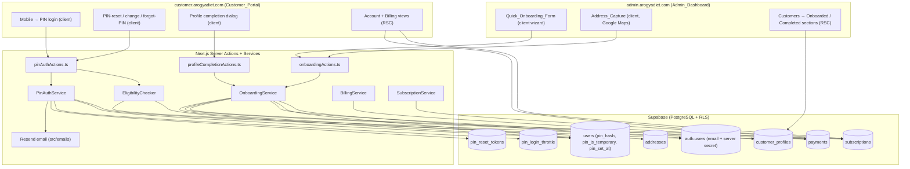
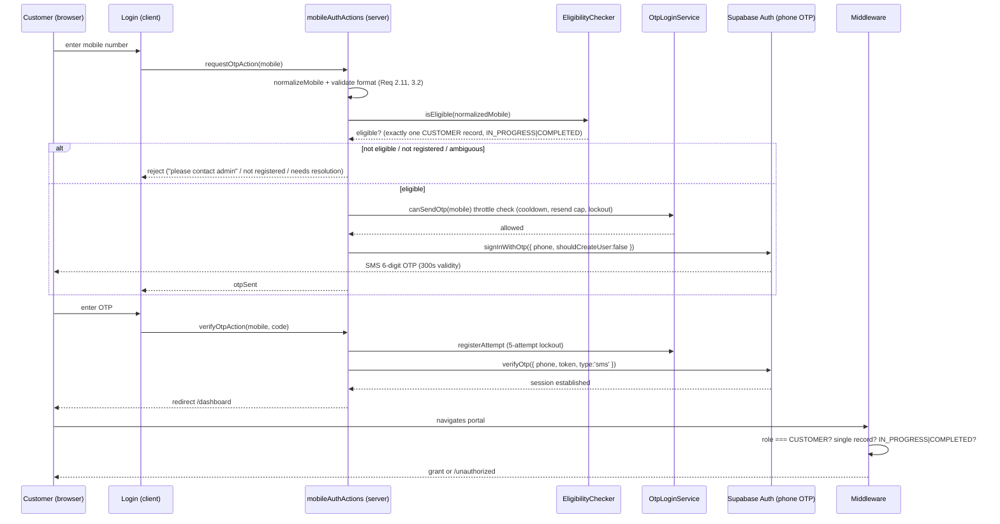
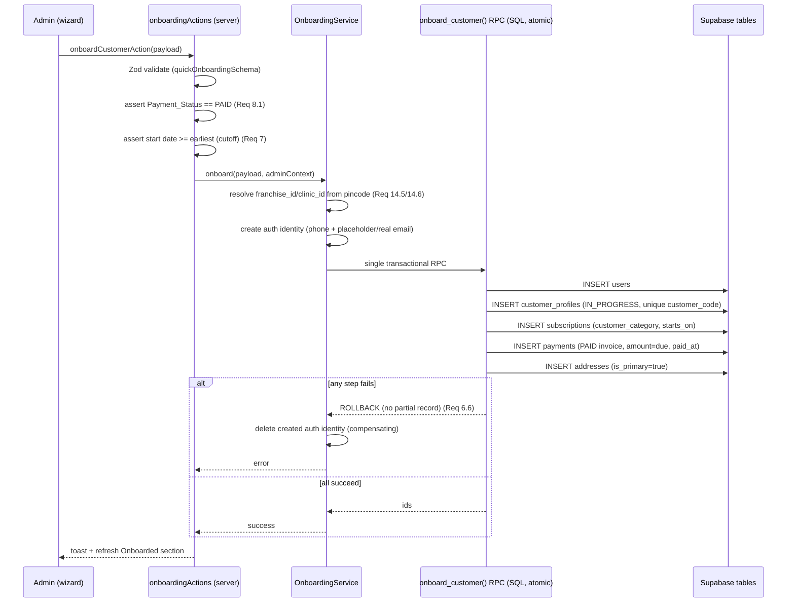
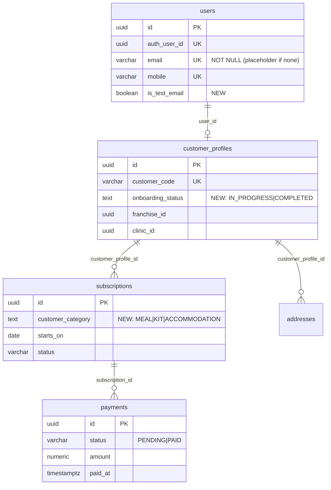

# Design Document — Customer Mobile Onboarding

## Overview

This feature converts the ArogyaDiet customer experience from an email-first, self-service model to a **mobile-first, admin-initiated onboarding** model, spanning three layers (database, backend, UI) inside the existing modular monolith.

The core flow:

1. **Admin** opens a new **Quick_Onboarding_Form** under `admin.arogyadiet.com` → Customers, captures priority info (name, mobile, gender, diet, one Primary_Category, a subscription plan + start date, a map-captured primary address, and payment status), marks payment **PAID**, and clicks **Onboard Customer**.
2. The **Onboarding_Service** transactionally creates the Supabase Auth identity + `users` row + `customer_profiles` row (`onboarding_status = IN_PROGRESS`) + `subscriptions` row (with a `customer_category`) + `payments` row (invoice) + primary `addresses` row, resolving `franchise_id`/`clinic_id` from the address pincode. Any failure rolls the whole thing back.
3. The customer later opens `customer.arogyadiet.com`, logs in with **mobile number + a 6-digit PIN only** (no signup, no Google, no email/password, no SMS code): they enter the mobile number, press **Next** (which runs the eligibility check), and then enter their PIN. On the **first login with the admin-set Temporary_PIN** they are forced onto a **PIN-reset screen** and cannot reach the rest of the app until a new PIN is set. Thereafter they may **change the PIN in-dashboard** (Profile), or recover it via a **"Forgot PIN" email link**, and the admin can **set/reset the PIN from the Customer 360 view** at any time. After PIN reset they are presented a **profile-completion popup** to fill remaining fields at their own pace, or mark onboarding **COMPLETED**.
4. After completion the customer immediately sees their subscription and invoice, and gains the same access as legacy customers.

### Why mobile + PIN instead of SMS OTP (cost-avoidance rationale)

Authentication deliberately uses a **mobile number + admin-provisioned 6-digit PIN** rather than SMS OTP. Every customer is onboarded in person at the clinic, so the admin can hand over a Temporary_PIN at the counter without any messaging round-trip. Choosing PIN over OTP **eliminates the recurring per-SMS OTP charges and the one-time SMS-gateway activation fees** an OTP model would incur, while preserving the "only clinic-registered mobiles can log in" guarantee (the eligibility check still gates the PIN screen). The PIN is stored **only as a bcrypt hash** — never in plaintext or logs — and the admin never learns the customer's permanent PIN because the Temporary_PIN forces a reset on first use.

The immediate implementation target is the **MEAL** category. **KIT** and **ACCOMMODATION** are modeled in the data layer and category-validation logic so they can be added later as separately paid add-on subscriptions without schema rework — at most one active subscription per category per customer.

### Design Principles (from steering)

- **Server-first**: pages/layouts are React Server Components; only interactive leaves (the mobile→PIN login form, the PIN-reset/change/forgot-PIN forms, the map, the wizard, the profile dialog) are `"use client"`.
- **Portal isolation**: no imports across `src/app/admin` ↔ `src/app/customer`; all shared UI lives in `src/shared/components`, shared logic in `src/lib`, `src/services`, `src/repositories`, `src/validations`.
- **RLS + scoping**: every new row carries `franchise_id`/`clinic_id`, and access is enforced by middleware role checks plus PostgreSQL RLS.
- **Zod everywhere**: all form and server-action input is validated with Zod schemas in `src/validations`.
- **Additive, idempotent migrations**: SQL scripts under `/scripts` follow the existing header/rollback/`IF NOT EXISTS` conventions and never drop or rewrite existing data.

### Key Grounding Facts (verified against the live database)

- `users`: `email` is **UNIQUE + NOT NULL**, `mobile` is **UNIQUE** (nullable), `auth_user_id` is UNIQUE. This is the central constraint challenge for mobile-first identity (addressed in Data Models).
- `customer_profiles`: `customer_code` UNIQUE, `user_id` UNIQUE, has `gender`, `dietary_preference`, `allergies`, `franchise_id`, `clinic_id`. **No `onboarding_status` column exists yet.**
- `subscriptions`: `status` defaults `PENDING`; has `starts_on`, `plan_id`, `franchise_id`. **No `customer_category` column exists yet.**
- `payments`: `status` defaults `PENDING`, has `paid_at`, `amount`, `invoice_type` (default `SUBSCRIPTION`), `franchise_id`.
- `addresses`: `tag` defaults `'Home'`, has `lat`/`lng` (numeric), `is_primary`, `city`/`state` defaults, `customer_profile_id`, `franchise_id`, `clinic_id`.
- Clinic/franchise resolution already exists: `resolveClinicForPincode` + `stampCustomerByPrimaryAddress` (`src/lib/clinic/stamping.ts`) persist `clinic_id`/`franchise_id` from the primary-address pincode.
- Tooling: **vitest** (`npm run test` → `vitest run`) + **fast-check 4.x** for property testing; `@react-google-maps/api` for maps; `sonner` for toasts; Shadcn UI / Radix primitives; **Resend** (`resend` in `package.json`, templates under `src/emails`) for transactional email (used by the Forgot-PIN flow).
- **PIN hashing library**: `package.json` currently ships **no JavaScript hashing library** (no `bcrypt`/`bcryptjs`/`argon2`). This design therefore specifies **`bcryptjs`** (pure-JS, no native build step — safe for Vercel serverless) as the hashing dependency to add. PIN hashing/verification runs **inside the service layer (server-only, impure)**, never in the pure `src/lib` helpers and never in the browser. (Note: Supabase/GoTrue already hashes its own auth passwords with bcrypt via the `pgcrypto` extension; the customer PIN is a **separate secret** from the Supabase Auth password — see the Authentication flow below.)

## Architecture

### System Context



### Authentication & Access Flow (mobile + PIN)



Notes on the OTP orchestration boundary:

- **Supabase Auth (phone provider)** performs SMS delivery, code generation, and code verification. `shouldCreateUser: false` guarantees that a mobile with no pre-provisioned auth identity cannot self-register (Requirement 1.4, 1.5, 12.1) — the onboarding step is the only path that creates the phone identity.
- **`OtpLoginService`** is a thin application layer that owns the *policy* semantics the requirements pin down precisely (300s validity window bookkeeping, 5-failed-attempt lockout for 900s, 30s resend cooldown, max 3 resends per 900s window). These are implemented as a **pure decision function** over a persisted throttle record (`otp_login_throttle`), which makes them deterministic and property-testable independent of Supabase.
- **`EligibilityChecker`** decides *before* any OTP send whether the mobile maps to exactly one `CUSTOMER` record in an allowed onboarding state.

### Onboarding Transaction Flow



Atomicity decision: the multi-table write (users → profile → subscription → payment → address) is wrapped in a **single PostgreSQL function (`onboard_customer` RPC)** invoked with the admin service client, so the database guarantees all-or-nothing (Requirement 6.6). The only step outside the DB transaction is the Supabase Auth identity creation (a separate system); it is created **before** the RPC and **compensated by deletion** if the RPC fails, keeping the observable "no partial Customer_Record" invariant.

### Category Extensibility

```mermaid
flowchart LR
    CUST[customer_profiles] -->|1..*| SUB[subscriptions]
    SUB -->|customer_category| CAT{MEAL | KIT | ACCOMMODATION}
    subgraph Constraint
      UQ["partial UNIQUE index:\nat most one ACTIVE/PENDING subscription\nper (customer_profile_id, customer_category)"]
    end
    SUB -.enforced by.-> UQ
```

The **Primary_Category** chosen at onboarding is simply the `customer_category` of the first subscription. **Add_On_Category** activation later creates an additional subscription row with a different `customer_category`, gated on successful payment. MEAL is fully wired into delivery routing today; KIT/ACCOMMODATION rows are accepted and stored but their routing/fulfilment flows are out of scope for this iteration.

## Components and Interfaces

### Backend — Validations (`src/validations`)

**`onboardingSchema.ts`** (new)

```ts
export const CUSTOMER_CATEGORIES = ["MEAL", "KIT", "ACCOMMODATION"] as const;
export const PAYMENT_STATUSES = ["PAID", "PENDING"] as const;

export const quickOnboardingSchema = z.object({
  fullName: z.string().min(1).max(100),                       // Req 4.1
  mobile: z.string().regex(/^[6-9]\d{9}$/),                   // Req 4.1, 3.2
  gender: z.enum(["Male", "Female", "Other"]),               // Req 4.1
  dietaryPreference: z.enum(["Veg", "Non-Veg"]),             // Req 4.2
  allergies: z.string().max(500).optional(),                 // Req 4.3
  email: z.string().max(254).email().optional(),             // Req 10.2
  isTestEmail: z.boolean().default(false),                   // Req 10.2/10.3
  primaryCategory: z.enum(CUSTOMER_CATEGORIES),              // Req 13.2 (exactly one)
  planId: z.string().uuid(),                                 // Req 4.4
  startDate: z.string(),                                     // ISO date, Req 4.4 (refined vs cutoff at action time)
  paymentStatus: z.enum(PAYMENT_STATUSES),                   // Req 4.4
  cutoffAcknowledged: z.boolean().default(false),            // Req 7.2/7.3
  address: addressCaptureSchema,                             // Req 4.5/5
});
```

**`addressCaptureSchema.ts`** (new — distinct from legacy `addressSchema`, adds Home/Office tag + flat/floor)

```ts
export function createAddressCaptureSchema(serviceAreaPincodes: string[] = []) {
  return z.object({
    tag: z.enum(["Home", "Office"]).default("Home"),   // Req 5.1
    searchText: z.string().min(1).max(255).optional(),  // Req 5.2
    flatNumber: z.string().min(1).max(50),              // Req 5.4/5.8 (required)
    floorNumber: z.string().max(20).optional(),         // Req 5.4
    area: z.string().min(1),                            // auto-filled, Req 5.3
    city: z.string().min(1),
    state: z.string().min(1),
    pincode: z.string().superRefine(/* serviceable check, Req 5.6 */),
    lat: z.number(), lng: z.number(),                   // Req 5.3
  });
}
```

**`realEmailSchema.ts`** (new): `z.string().min(1).max(254).email()` for the customer-supplied real email (Req 10.5/10.6/10.8).

**`profileCompletionSchema.ts`** (new): every field optional and independently format-validated (Req 9.2/9.3/9.7); mirrors `customer_profiles` completable fields (`date_of_birth`, `gender`, `dietary_preference`, `allergies`, `medical_history_notes`, and optional real email).

### Backend — Repositories (`src/repositories`)

**`customerOnboardingRepository.ts`** (new) — the only module that talks to the DB for onboarding:

```ts
findCustomerByMobile(mobile: string): Promise<CustomerLookup[]>          // 0..n records; drives eligibility + dup check (Req 3, 12.4)
onboardCustomerAtomic(input: OnboardCustomerRpcInput): Promise<OnboardResult>  // calls onboard_customer() RPC (Req 6.6)
generateUniqueCustomerCode(): Promise<string>                            // retry until unique (Req 14.7/14.8)
listByOnboardingStatus(status, scope): Promise<CustomerRow[]>            // dashboard sections (Req 6.9/6.10)
setOnboardingCompleted(profileId): Promise<void>                          // Req 9.4/14.3
updateProfileFields(profileId, patch): Promise<void>                     // Req 9.3
replaceTestEmailWithReal(userId, email): Promise<Result>                 // Req 10.6/10.7/10.8
```

**`otpThrottleRepository.ts`** (new): `getThrottle(mobile)`, `saveThrottle(mobile, state)` over `otp_login_throttle`.

### Backend — Services (`src/services`)

**`OnboardingService.ts`** (new)

```ts
onboard(payload: QuickOnboardingInput, admin: AdminContext): Promise<OnboardOutcome>
completeProfile(profileId, patch): Promise<Result>          // persists + can transition to COMPLETED (Req 9)
activateAddOnCategory(customerId, category, payment): Promise<Result>  // Req 13.7–13.11
```

Responsibilities: scope resolution (`franchise_id`/`clinic_id` via `resolveClinicForPincode`; reject if unresolved — Req 14.5/14.6), auth-identity creation + compensation, delegating the atomic write to the repository RPC, and enforcing the PAID precondition and single-invoice guarantee.

**`OtpLoginService.ts`** (new) — wraps Supabase phone OTP and applies the pure `evaluateOtpPolicy` decision (see `src/lib/otp`).

```ts
requestOtp(mobile): Promise<{ status: "SENT" | "COOLDOWN" | "LOCKED" | "RESEND_EXCEEDED" | "SEND_FAILED"; retryAfterSec?: number }>
verifyOtp(mobile, code): Promise<{ status: "OK" | "INVALID" | "EXPIRED" | "LOCKED" }>
```

**`EligibilityChecker.ts`** (new)

```ts
check(mobile): Promise<
  | { eligible: true; profileId: string; status: "IN_PROGRESS" | "COMPLETED" }
  | { eligible: false; reason: "INVALID_FORMAT" | "NOT_REGISTERED" | "BAD_STATUS" | "AMBIGUOUS" }
>
```

**`BillingService.ts`** (new): `recordOnboardingInvoice(subscription, admin)` — inserts exactly one PAID `payments` row with `amount` = subscription amount due and `paid_at` = now; rejects if a PAID row already exists for the subscription (Req 8.3/8.4/8.6). Read helpers back the customer Billing view (Req 11.3/11.4).

### Backend — Pure logic (`src/lib`)

- **`src/lib/mobile/normalizeMobile.ts`**: `normalizeMobile(raw): { ok: true; value: string } | { ok: false }` — strips spaces/`+91`/leading `0`, validates 10-digit `[6-9]\d{9}`, idempotent (Req 2.11, 3.2).
- **`src/lib/otp/otpPolicy.ts`**: `evaluateOtpPolicy(state, action, now)` — pure state machine for validity/attempts/lockout/resend (Req 2.3/2.5/2.6/2.7/2.9/2.10).
- **`src/lib/onboarding/cutoff.ts`**: `earliestStartDate(now, cutoff=17:00 IST)` and `isStartDateAllowed(startDate, now)` (Req 7.5/7.6/7.7).
- **`src/lib/onboarding/category.ts`**: `assertValidCategory`, `assertSinglePrimary(selection[])` (Req 13.1–13.4).
- **`src/lib/onboarding/testEmail.ts`**: `placeholderEmailFor(mobile)` + `isDisplayableEmail(user)` (Req 10.4).

### Backend — Server Actions (`src/actions`)

- **`src/actions/admin-actions/onboardingActions.ts`**: `onboardCustomerAction`, `listOnboardedCustomersAction`, `listCompletedCustomersAction`, `activateAddOnCategoryAction`. Admin-only.
- **`src/actions/mobileAuthActions.ts`** (customer portal): `requestOtpAction`, `verifyOtpAction`, `resendOtpAction`.
- **`src/actions/profileCompletionActions.ts`** (customer portal): `saveProfileCompletionAction`, `markOnboardingCompletedAction`, `submitRealEmailAction`.

Legacy `signupActions.ts` / customer signup routes are neutralized (redirect to mobile login) but the **legacy 3-step admin customer creation flow is retained** (Req 4.8).

### UI — Customer Portal (`src/app/customer`)

| Screen | Path | Type | Notes |
|---|---|---|---|
| Mobile OTP login | `(auth)/login/page.tsx` (rewritten) | RSC shell + `MobileOtpLoginForm` client leaf | Single mobile field → OTP entry; **removes** signup link, Google button, email/password (Req 1, 2, 15.1/15.5) |
| Signup route | `(auth)/signup/page.tsx` | RSC | Replaced with `redirect("/login")` (Req 1.4) |
| Profile completion dialog | `shared/components/customer/ProfileCompletionDialog.tsx` | client (Radix Dialog) | Shown on dashboard when `IN_PROGRESS`; all fields optional; "mark completed onboarding" (Req 9, 10.5) |
| Account view | `(main)/subscription/page.tsx` | RSC | Shows onboarding subscription (Req 11.1/11.2) |
| Billing view | `(main)/subscription/manage` or billing section | RSC | Shows onboarding invoice (Req 11.3/11.4) |

### UI — Admin Portal (`src/app/admin`)

| Screen | Path | Type | Notes |
|---|---|---|---|
| Quick Onboarding wizard | `(main)/customers/quick-onboard/page.tsx` + `QuickOnboardingForm.tsx` | RSC shell + client wizard | Multi-step: Details → Category/Plan → Address → Payment/Review; cutoff warning + ack checkbox (Req 4, 7, 8, 13) |
| Address_Capture | `shared/components/address/AddressCaptureMap.tsx` | client | Google Map + search autocomplete + auto-fill area/city/state/pincode; Home/Office tag; flat/floor; serviceability warning (Req 5, 15.13) |
| Onboarded section | `(main)/customers/page.tsx` (tabs) | RSC | `IN_PROGRESS` customers (Req 6.9/6.11) |
| Completed section | `(main)/customers/page.tsx` (tabs) | RSC | `COMPLETED` customers (Req 6.10/6.11) |
| Test-email control | inside `QuickOnboardingForm` | client | email field + "test email" checkbox (Req 10.2) |

`AddressCaptureMap` reuses the map interaction pattern from `src/shared/components/customer/address-picker-map.tsx` (draggable pin, `useJsApiLoader`, locate button) and adds a Google Places Autocomplete search box plus reverse-geocoding auto-fill, matching the legacy address-capture visual layout (Req 15.13).

## Data Models

### Migration 1 — `scripts/add-onboarding-status-to-customer-profiles.sql`

Adds the lifecycle state to `customer_profiles` (Req 14.1/14.2).

```sql
ALTER TABLE public.customer_profiles
  ADD COLUMN IF NOT EXISTS onboarding_status TEXT NOT NULL DEFAULT 'IN_PROGRESS';

ALTER TABLE public.customer_profiles
  ADD CONSTRAINT customer_profiles_onboarding_status_chk
  CHECK (onboarding_status IN ('IN_PROGRESS', 'COMPLETED'));   -- Req 14.1

CREATE INDEX IF NOT EXISTS idx_customer_profiles_onboarding_status
  ON public.customer_profiles(onboarding_status, franchise_id);  -- drives dashboard sections (Req 6.9/6.10)
```

Rollback: drop index, drop constraint, drop column. Existing rows default to `IN_PROGRESS`; a companion data step may back-fill pre-existing (legacy) customers to `COMPLETED` so they are unaffected by the completion dialog.

### Migration 2 — `scripts/add-customer-category-to-subscriptions.sql`

Adds category to `subscriptions` and enforces at-most-one-active-per-category (Req 13.11).

```sql
ALTER TABLE public.subscriptions
  ADD COLUMN IF NOT EXISTS customer_category TEXT NOT NULL DEFAULT 'MEAL';

ALTER TABLE public.subscriptions
  ADD CONSTRAINT subscriptions_customer_category_chk
  CHECK (customer_category IN ('MEAL', 'KIT', 'ACCOMMODATION'));  -- Req 13.1

-- At most one non-terminal subscription per (customer, category) (Req 13.11)
CREATE UNIQUE INDEX IF NOT EXISTS uq_active_subscription_per_category
  ON public.subscriptions(customer_profile_id, customer_category)
  WHERE status IN ('PENDING', 'ACTIVE');
```

Existing meal subscriptions default cleanly to `MEAL`. Rollback drops index, constraint, column.

### Migration 3 — `scripts/add-test-email-flag-to-users.sql`

Adds the Test_Email flag and resolves the mobile-first identity constraint (Req 10, 14.4).

```sql
ALTER TABLE public.users
  ADD COLUMN IF NOT EXISTS is_test_email BOOLEAN NOT NULL DEFAULT false;  -- Req 14.4
```

**`users.email` NOT NULL + UNIQUE decision.** Rather than dropping a constraint that many flows and RLS policies depend on (a hard-to-reverse, high-blast-radius change), the design **keeps `email` NOT NULL + UNIQUE** and satisfies mobile-first identity by writing a **deterministic placeholder email** when the admin supplies none:

```
placeholder = "m<normalizedMobile>@placeholder.arogyadiet.internal"
```

with `is_test_email = true`. Because the placeholder is derived from the (unique) mobile it is itself unique, never collides with real emails (reserved internal domain), is hidden from the customer (Req 10.4), and is replaceable later by a real email that clears the flag (Req 10.6). If the admin types a real email + leaves the checkbox unchecked, that email is stored verbatim with `is_test_email = false`.

Rollback: drop column.

### Migration 4 — `scripts/create-otp-login-throttle-table.sql`

Backs the OTP policy state machine (Req 2.5/2.7/2.9/2.10). Keyed by normalized mobile.

```sql
CREATE TABLE IF NOT EXISTS public.otp_login_throttle (
  mobile              TEXT PRIMARY KEY,
  window_started_at   TIMESTAMPTZ NOT NULL DEFAULT now(),
  failed_attempts     INTEGER NOT NULL DEFAULT 0,
  resend_count        INTEGER NOT NULL DEFAULT 0,
  last_sent_at        TIMESTAMPTZ,
  locked_until        TIMESTAMPTZ,
  updated_at          TIMESTAMPTZ NOT NULL DEFAULT now()
);
```

RLS: enabled, no anon/customer policies — reachable only through the service-role client inside `mobileAuthActions`. Rollback drops the table.

### Migration 5 — `scripts/create-onboard-customer-rpc.sql`

The atomic onboarding transaction (Req 6.6). A `SECURITY DEFINER` PL/pgSQL function that inserts `users`, `customer_profiles`, `subscriptions`, `payments`, and the primary `addresses` row in one transaction and returns the created ids, raising (and thus rolling back) on any failure.

```sql
CREATE OR REPLACE FUNCTION public.onboard_customer(payload JSONB)
RETURNS JSONB
LANGUAGE plpgsql SECURITY DEFINER
AS $$
DECLARE v_user_id UUID; v_profile_id UUID; v_sub_id UUID;
BEGIN
  INSERT INTO public.users (...) RETURNING id INTO v_user_id;              -- Req 6.1
  INSERT INTO public.customer_profiles (..., onboarding_status)
    VALUES (..., 'IN_PROGRESS') RETURNING id INTO v_profile_id;           -- Req 6.1/14.2
  INSERT INTO public.subscriptions (..., customer_category, starts_on)
    RETURNING id INTO v_sub_id;                                           -- Req 6.2
  INSERT INTO public.payments (..., status, amount, paid_at)
    VALUES (..., 'PAID', v_amount_due, now());                           -- Req 8.3/8.6
  INSERT INTO public.addresses (..., is_primary) VALUES (..., true);      -- Req 6.3/5.5
  RETURN jsonb_build_object('user_id', v_user_id, 'profile_id', v_profile_id, 'subscription_id', v_sub_id);
EXCEPTION WHEN OTHERS THEN
  RAISE;  -- transaction rolls back atomically; no partial record (Req 6.6)
END; $$;
```

### Entity relationships (after migrations)



## Correctness Properties

*A property is a characteristic or behavior that should hold true across all valid executions of a system — essentially, a formal statement about what the system should do. Properties serve as the bridge between human-readable specifications and machine-verifiable correctness guarantees.*

These properties target the **pure decision logic** of the feature (mobile normalization, OTP policy, eligibility, cutoff dates, category rules, invoice invariants, and the atomicity contract) which is factored into pure functions in `src/lib` and thin services with mockable repositories. UI rendering, responsiveness, accessibility, SMS delivery, Google geocoding, and Supabase session establishment are validated by example, snapshot, integration, and manual-review tests instead (see Testing Strategy), because their behavior does not vary meaningfully with input or depends on external services.

### Property 1: Mobile normalization is canonical and idempotent

*For any* input string, `normalizeMobile` either rejects it as invalid or produces a canonical 10-digit `[6-9]\d{9}` value; and for any input, normalizing an already-normalized value yields the same value (`normalize(normalize(x)) == normalize(x)`).

**Validates: Requirements 2.11, 3.2**

### Property 2: Eligibility decision is exactly-one-allowed-customer

*For any* set of user/customer records and any submitted mobile, the eligibility check returns `eligible` **if and only if** the normalized mobile is associated with exactly one record whose role is `CUSTOMER` and whose `onboarding_status` is `IN_PROGRESS` or `COMPLETED`; zero matches yield `NOT_REGISTERED`, a non-allowed status yields `BAD_STATUS`, more than one match yields `AMBIGUOUS`, and in every non-eligible case no OTP is sent and no session is created.

**Validates: Requirements 3.1, 3.4, 3.5, 9.6, 9.9, 12.1, 12.2, 12.3, 12.4**

### Property 3: OTP validity window

*For any* passcode generation time and any check time, a submitted passcode is treated as within its validity window **if and only if** `checkTime - generationTime < 300 seconds`; outside the window the submission is rejected as expired and no session is established.

**Validates: Requirements 2.3, 2.6**

### Property 4: OTP throttle policy state machine

*For any* prior throttle state and clock time, `evaluateOtpPolicy` satisfies all of: a failed verification increments `failed_attempts` by exactly one and leaves the current validity window unchanged; reaching 5 failed attempts within a window sets a lockout that blocks all submissions and resends for 900 seconds; a resend is permitted **only if** at least 30 seconds have elapsed since the last send and fewer than 3 resends have occurred in the current 900-second window; and a send that reports delivery failure leaves `resend_count` unchanged so it does not consume a resend.

**Validates: Requirements 2.5, 2.7, 2.8, 2.9, 2.10**

### Property 5: Onboarding precondition gate and created-record shape

*For any* Quick_Onboarding_Form payload, the onboarding operation persists a Customer_Record **if and only if** every required field (name, mobile, gender, diet preference, plan, start date, primary address) is present and valid, exactly one valid Primary_Category is selected, the mobile is not already used by an existing Customer_Record, and `Payment_Status == PAID`; and whenever a record is created it has `onboarding_status == IN_PROGRESS`, exactly one attached subscription with the submitted `starts_on` and `customer_category`, and a primary address with `is_primary == true`. When the gate fails, no record is created and the returned error identifies the missing field or unmet payment condition.

**Validates: Requirements 4.1, 4.2, 4.5, 4.6, 4.7, 5.5, 6.1, 6.2, 6.3, 6.5, 8.1, 8.2, 14.2**

### Property 6: Onboarding atomicity (no partial record)

*For any* onboarding attempt in which any step fails (a table insert error, an unresolved `franchise_id`/`clinic_id`, or a compensated auth-identity failure), the persisted state after the attempt equals the state before it — no partial `users`, `customer_profiles`, `subscriptions`, `payments`, or `addresses` row survives — and an error indication is returned. The same all-or-nothing guarantee holds for a failed profile-completion persistence (no partial field update).

**Validates: Requirements 6.6, 9.8, 14.6**

### Property 7: Routing eligibility follows start date

*For any* onboarded subscription with start date `S` and any current date `D`, the subscription is included in delivery routing **if and only if** `D >= S`.

**Validates: Requirements 6.7, 6.8**

### Property 8: Dashboard section partition

*For any* set of Customer_Records, each record appears in exactly one admin section — the "onboarded" section when its `onboarding_status` is `IN_PROGRESS` and the "onboarding completed" section when it is `COMPLETED` — so a status transition moves the record from one section to the other and never duplicates or drops it.

**Validates: Requirements 6.11**

### Property 9: Earliest selectable start date from cutoff

*For any* current timestamp evaluated in the Cutoff_Time zone (17:00 IST), the earliest selectable subscription start date is `today + 1 day` when the time is before the cutoff and `today + 2 days` when at or after the cutoff; and `isStartDateAllowed` accepts a submitted start date **if and only if** it is on or after that earliest date.

**Validates: Requirements 7.5, 7.6, 7.7**

### Property 10: Single PAID invoice with correct amount

*For any* subscription onboarded with payment marked PAID, exactly one `payments` row is created for that subscription with `status == PAID`, `amount` equal to the subscription's amount due, and a non-null `paid_at`; and a second attempt to mark payment done for a subscription that already has a PAID row creates no additional PAID row and leaves the existing one unchanged.

**Validates: Requirements 8.3, 8.4, 8.6**

### Property 11: Exactly one valid Primary_Category

*For any* set of selected categories submitted with the form, onboarding proceeds **if and only if** the selection is exactly one value drawn from `{MEAL, KIT, ACCOMMODATION}`; zero, more than one, or any value outside the set is rejected with no record created and the entered values preserved.

**Validates: Requirements 13.1, 13.2, 13.3, 13.4**

### Property 12: At most one active subscription per category

*For any* customer and any Customer_Category, at most one subscription with status `PENDING` or `ACTIVE` exists for that (customer, category) pair; an activation request targeting a category the customer already actively subscribes to is rejected without initiating payment or creating a duplicate subscription.

**Validates: Requirements 13.10, 13.11**

### Property 13: Add-on activation is payment-gated and isolated

*For any* add-on category activation, the add-on subscription is started (as a separate subscription associated with the customer) **if and only if** its payment completes successfully; when payment fails the add-on is not started and the customer's existing subscriptions remain unchanged.

**Validates: Requirements 13.7, 13.8, 13.9**

### Property 14: Profile-completion optional-field validation and persistence

*For any* subset of the displayed profile-completion fields (including the empty subset), the dialog submission is accepted when every provided value passes its format rule, and exactly those provided values are persisted to their matching `customer_profiles` columns; if any provided value fails its format rule the submission is rejected, the entered values are retained, and each invalid field is identified.

**Validates: Requirements 9.2, 9.3, 9.7**

### Property 15: Onboarding status drives completion and dialog visibility

*For any* Customer_Record, selecting "mark completed onboarding" transitions `onboarding_status` to `COMPLETED` regardless of how many fields were provided, and the profile-completion dialog is presented **if and only if** the record's status is `IN_PROGRESS`.

**Validates: Requirements 9.4, 9.5, 14.1, 14.3**

### Property 16: Test-email placeholder is unique, hidden, and replaceable

*For any* onboarding without a customer-provided email, a placeholder email derived from the (unique) normalized mobile is generated with `is_test_email == true`, and while flagged it is never returned by the customer-facing email accessor. *For any* valid real email not already associated with another user, submitting it replaces the placeholder and clears the flag; a real email already in use or failing the format/length rule is rejected, leaving the existing test email and its flag unchanged.

**Validates: Requirements 10.1, 10.3, 10.4, 10.6, 10.7, 10.8, 14.4**

### Property 17: Serviceable-pincode gate for captured address

*For any* selected pincode and any franchise serviceable-pincode set, the captured address is savable **if and only if** the pincode is in the serviceable set (and the flat number is present); an out-of-area pincode surfaces a not-serviceable warning and blocks the save.

**Validates: Requirements 5.6, 5.8**

### Property 18: Unique customer code generation

*For any* set of existing `customer_code` values, `generateUniqueCustomerCode` returns a code not present in that set, regenerating on collision so no duplicate `customer_code` is ever persisted.

**Validates: Requirements 14.7, 14.8**

## Error Handling

### Validation errors (client + server)

- **Zod-first**: every server action re-validates its input with the relevant schema (`quickOnboardingSchema`, `addressCaptureSchema`, `realEmailSchema`, `profileCompletionSchema`) even though the client validates with React Hook Form, because server actions are a trust boundary. Field-level issues are returned as `{ error, fieldErrors }` and rendered inline next to each field (Req 4.6, 9.7, 15.9), preserving entered values.
- **Duplicate mobile / duplicate PAID invoice / email-in-use**: surfaced as specific, non-generic messages ("mobile already registered", "payment already recorded", "email already in use") mapped from the repository result, not from raw Postgres constraint errors.

### OTP + auth errors

| Condition | Handling | Requirement |
|---|---|---|
| Invalid mobile format | Reject before send, inline message, no OTP | 3.2 |
| Not registered / ambiguous | "please contact admin" / resolution message, no OTP, no session | 3.4, 12.1, 12.4 |
| Wrong code | Increment attempts, invalid-code message, retain mobile, preserve window | 2.5 |
| Expired code | Expired message, offer resend, no session | 2.6 |
| 5 failed attempts | Lock 900s, show retry-at time | 2.7 |
| Resend too soon / cap reached | Reject, show next-allowed time, no new code | 2.10 |
| SMS delivery failure | Delivery-failure message, do not consume resend | 2.8, 3.6 |

### Onboarding transaction errors

- The `onboard_customer` RPC raises on any failed insert, rolling back the whole transaction; `OnboardingService` catches the failure, **deletes the pre-created Supabase Auth identity** (compensating action), and returns a "onboarding did not complete" error (Req 6.6). No partial Customer_Record is ever observable.
- Unresolved `franchise_id`/`clinic_id` (pincode resolves to no clinic) is treated as a pre-RPC gate failure: the operation returns a "scope could not be resolved" error and creates nothing (Req 14.6).

### Read-view errors (customer)

- Account view with no subscription and Billing view with no invoice render a specific empty/error state without mutating data (Req 11.2, 11.4), using the portal's existing empty-state styling (Req 15.10).

### Maps / geocoding errors

- Missing `NEXT_PUBLIC_GOOGLE_MAPS_API_KEY` or map load error renders the same graceful fallback used by `address-picker-map.tsx`.
- Unresolved locality (reverse-geocode gap) leaves unresolved fields empty and shows an "address could not be resolved" error while retaining entered values (Req 5.7).

### Security posture

- All new customer-portal routes remain behind middleware role checks (`CUSTOMER`) plus RLS. The OTP flow uses `shouldCreateUser: false` so the customer portal cannot mint new identities (Req 1.4/1.5/12.1). The `otp_login_throttle` table is service-role only. `SECURITY DEFINER` on the onboarding RPC is scoped to inserts on the five onboarding tables and invoked exclusively by admin server actions.

## Testing Strategy

### Dual approach

- **Property-based tests (vitest + fast-check)** verify the 18 correctness properties above against generated inputs. This is the right tool here because the target logic is pure or thinly wrapped over mockable repositories, the input spaces are large (arbitrary mobiles, times, record sets, category selections, plan amounts), and 100+ iterations meaningfully exercise edge cases (boundary times around the 300s window and 17:00 cutoff, empty/whitespace names, collision sets for customer codes, ambiguous record sets).
- **Example / snapshot / component tests** verify concrete UI behavior and rendering: login screen omits signup/Google/email-password (Req 1.1–1.3), signup route redirects (Req 1.4), Home/Office tag default (Req 5.1), test-email checkbox presence (Req 10.2), account/billing display and empty states (Req 11), and the cutoff-warning enable/disable toggle (Req 7.1–7.4). Portal styling, mobile-first 360px layout, loading/disabled/empty/success states, and layout alignment (Req 15.1–15.11, 15.13) are covered by component/snapshot tests.
- **Integration tests (1–3 examples)** verify external-service wiring that does not vary meaningfully with input: Supabase phone OTP send/verify and session establishment (Req 2.2/2.4/3.3), OAuth/signup callback rejection (Req 1.5), Google reverse-geocode auto-fill (Req 5.3), and access parity for onboarded customers (Req 11.5).
- **Manual / assistive-technology review** is required for full accessibility validation (Req 15.12); automated checks (axe on the new screens) cover the mechanical subset (labels, focus trap, contrast tokens) but WCAG 2.1 AA conformance requires manual testing with assistive technologies and expert review.

### Property test configuration

- Each property test uses **fast-check** with a minimum of **100 iterations** (`fc.assert(fc.property(...), { numRuns: 100 })`).
- Each property test is tagged with a comment referencing its design property, in the format:
  `// Feature: customer-mobile-onboarding, Property {number}: {property_text}`
- Each of the 18 properties is implemented by a **single** property-based test. Repositories and Supabase clients are mocked (in-memory record sets) so properties test logic, not I/O.

### Suggested test locations

```
src/lib/mobile/__tests__/normalizeMobile.property.test.ts        # Property 1
src/services/__tests__/eligibilityChecker.property.test.ts       # Property 2
src/lib/otp/__tests__/otpPolicy.property.test.ts                 # Properties 3, 4
src/services/__tests__/onboardingService.property.test.ts        # Properties 5, 6, 11, 16, 18
src/lib/onboarding/__tests__/routing.property.test.ts            # Property 7
src/lib/onboarding/__tests__/sections.property.test.ts           # Property 8
src/lib/onboarding/__tests__/cutoff.property.test.ts             # Property 9
src/services/__tests__/billingService.property.test.ts           # Property 10
src/services/__tests__/subscriptionService.property.test.ts      # Properties 12, 13
src/services/__tests__/profileCompletion.property.test.ts        # Properties 14, 15
src/lib/address/__tests__/serviceablePincode.property.test.ts    # Property 17
```

### Data-layer verification

- Migration scripts are validated by running them against a scratch schema and asserting: the CHECK constraints reject out-of-enum values (`onboarding_status`, `customer_category`), the partial unique index blocks a second PENDING/ACTIVE subscription per category, and the `onboard_customer` RPC rolls back fully on an injected failure. These DB-level assertions complement Property 6 and Property 12.

### Build/lint gate

- After implementation, `npm run lint` and `npm run test` (vitest run) must pass. Because this repo runs on Next.js 16 with breaking changes from prior versions, implementers must consult `node_modules/next/dist/docs/` before writing route/server-action code.
