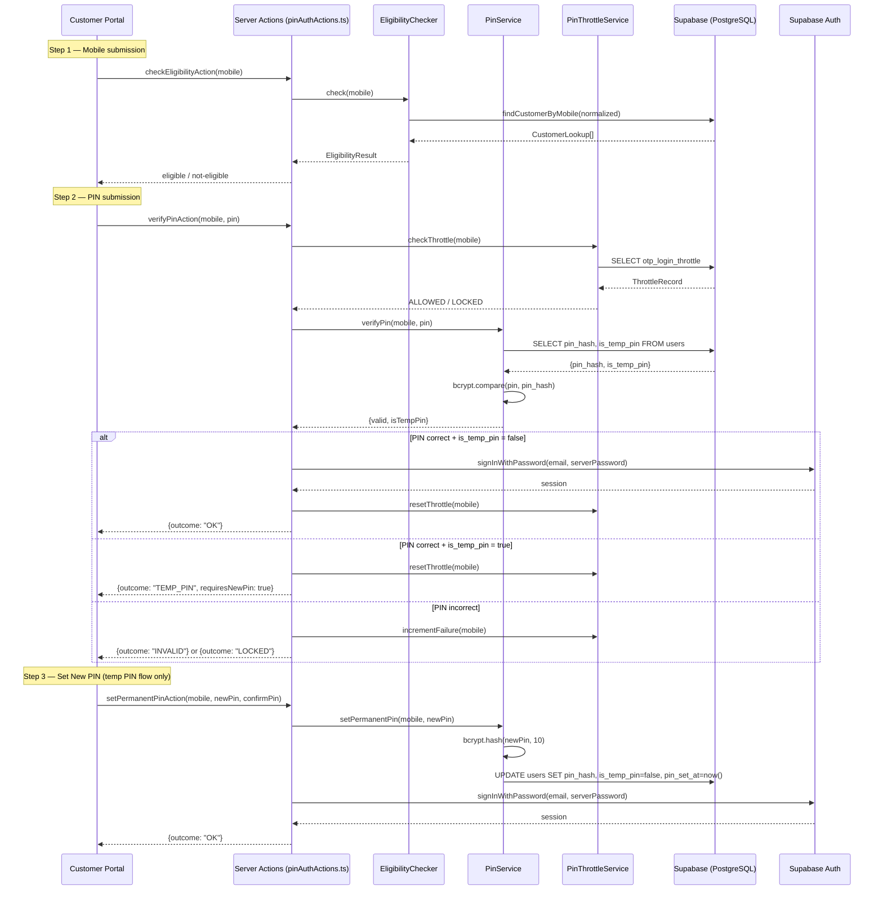
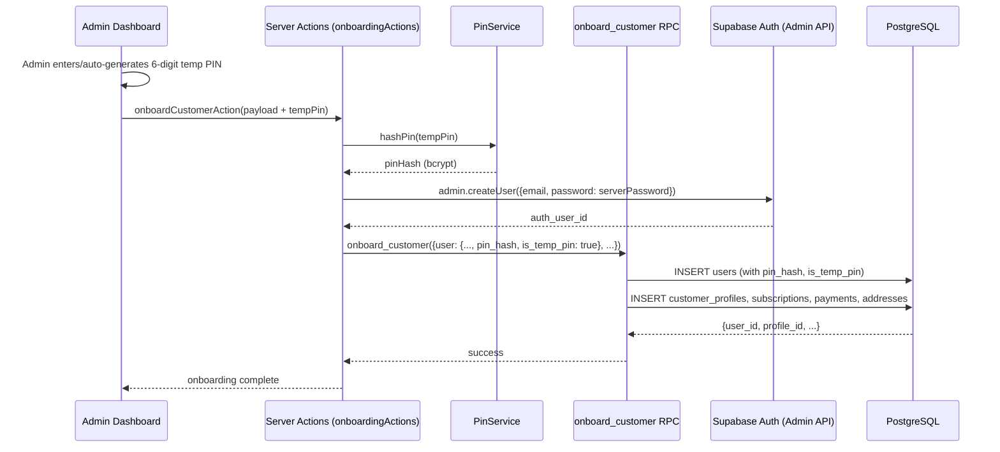

# Design Document: Customer PIN Authentication

## Overview

This design replaces the SMS OTP customer login flow with a PIN-based authentication model. The core architectural change is eliminating the Supabase phone OTP provider dependency and replacing it with a server-side PIN verification service that uses bcrypt hashing and the existing `otp_login_throttle` table for brute-force protection.

**Key design decisions:**
1. **Supabase `signInWithPassword` for session establishment** — After PIN verification succeeds server-side, we establish a Supabase session using the customer's placeholder email + a server-managed password. This ensures full compatibility with existing middleware and RLS without changes.
2. **Reuse of `EligibilityChecker`** — The pre-login mobile eligibility gate is unchanged; it already supports the PIN flow (its comments already reference "PIN entry screen").
3. **Reuse of `otp_login_throttle` table** — Same table, same columns, same service-role-only access pattern. Only `failed_attempts`, `locked_until`, `window_started_at`, and `updated_at` are used; `resend_count` and `last_sent_at` are ignored.
4. **Additive schema changes only** — Three new columns on `users` (`pin_hash`, `is_temp_pin`, `pin_set_at`), no existing columns/constraints touched.
5. **Admin-assisted PIN lifecycle** — Admin sets temp PIN at onboarding, admin resets PIN from Customer 360. No self-service reset.

## Architecture



### Admin Onboarding Flow (PIN Addition)



## Components and Interfaces

### 1. PinService (`src/services/PinService.ts`)

The core service responsible for PIN hashing, verification, and lifecycle management.

```typescript
// src/services/PinService.ts

export interface PinVerifyResult {
  valid: boolean;
  isTempPin: boolean;
}

export interface PinService {
  /**
   * Hash a PIN using bcrypt with cost factor 10.
   * Returns the hash string. Never stores or logs the plaintext PIN.
   */
  hashPin(pin: string): Promise<string>;

  /**
   * Verify a submitted PIN against the stored hash for a mobile number.
   * Uses bcrypt.compare (constant-time).
   * Returns validity and whether the current PIN is temporary.
   */
  verifyPin(mobile: string, pin: string): Promise<PinVerifyResult | null>;

  /**
   * Set a permanent PIN for a customer (temp-to-permanent transition).
   * Hashes the new PIN, updates pin_hash, sets is_temp_pin=false,
   * records pin_set_at timestamp.
   */
  setPermanentPin(mobile: string, newPin: string): Promise<void>;

  /**
   * Admin reset: replace PIN hash and set is_temp_pin=true.
   * Used from Customer 360 "Reset PIN" action.
   */
  resetPinToTemporary(userId: string, newPin: string): Promise<void>;
}
```

### 2. PinThrottleService (`src/services/PinThrottleService.ts`)

Manages brute-force protection using the existing `otp_login_throttle` table.

```typescript
// src/services/PinThrottleService.ts

export type ThrottleStatus = "ALLOWED" | "LOCKED";

export interface ThrottleCheckResult {
  status: ThrottleStatus;
  lockedUntil?: Date;       // present when LOCKED
  retryAfterSeconds?: number; // seconds until unlock
}

export interface PinThrottleService {
  /**
   * Check if a mobile is currently locked out.
   * If locked_until is in the future, return LOCKED.
   * If lock has expired, reset failed_attempts and return ALLOWED.
   */
  checkThrottle(mobile: string): Promise<ThrottleCheckResult>;

  /**
   * Increment failed_attempts for a mobile.
   * If failed_attempts reaches 5, set locked_until = now + 15 minutes.
   * Returns the new throttle status.
   */
  incrementFailure(mobile: string): Promise<ThrottleCheckResult>;

  /**
   * Reset failed_attempts to 0 on successful PIN verification.
   */
  resetThrottle(mobile: string): Promise<void>;
}
```

### 3. Server Actions (`src/actions/pinAuthActions.ts`)

Replaces `mobileAuthActions.ts` for the customer login flow.

```typescript
// src/actions/pinAuthActions.ts

export type CheckEligibilityResult =
  | { outcome: "ELIGIBLE" }
  | { outcome: "NOT_ELIGIBLE"; message: string };

export type VerifyPinResult =
  | { outcome: "OK" }                              // session established, redirect to dashboard
  | { outcome: "TEMP_PIN" }                        // PIN correct but temp; redirect to set-new-pin
  | { outcome: "INVALID"; message: string }        // wrong PIN
  | { outcome: "LOCKED"; message: string; retryAfterSeconds?: number };

export type SetPermanentPinResult =
  | { outcome: "OK" }                              // PIN set, session established
  | { outcome: "MISMATCH"; message: string }       // new and confirm don't match
  | { outcome: "INVALID_FORMAT"; message: string } // not 6 digits
  | { outcome: "ERROR"; message: string };         // unexpected failure

export async function checkEligibilityAction(mobile: string): Promise<CheckEligibilityResult>;
export async function verifyPinAction(mobile: string, pin: string): Promise<VerifyPinResult>;
export async function setPermanentPinAction(
  mobile: string,
  newPin: string,
  confirmPin: string,
): Promise<SetPermanentPinResult>;
```

### 4. Admin Actions

**`src/actions/admin-actions/adminPinActions.ts`** — PIN-related admin operations.

```typescript
export async function resetCustomerPinAction(
  userId: string,
  newPin: string,
): Promise<{ success: boolean; error?: string }>;
```

The existing `onboardCustomerAction` is modified to accept and hash the temporary PIN before passing `pin_hash` and `is_temp_pin` to the `onboard_customer` RPC.

### 5. UI Components

| Component | Location | Purpose |
|-----------|----------|---------|
| `MobilePinLoginForm` | `src/shared/components/customer/MobilePinLoginForm.tsx` | Replaces `MobileOtpLoginForm`. Two-step form: mobile → PIN entry |
| `SetNewPinForm` | `src/shared/components/customer/SetNewPinForm.tsx` | New PIN + confirm PIN form for temp-to-permanent transition |
| `PinInput` | `src/shared/components/customer/PinInput.tsx` | 6-digit numeric input (six individual boxes or single masked field) |
| `ResetPinDialog` | `src/shared/components/admin/ResetPinDialog.tsx` | Admin dialog for PIN reset from Customer 360 |
| `TempPinField` | `src/shared/components/admin/TempPinField.tsx` | PIN input + auto-generate button for onboarding form |

### 6. PIN Utility (`src/lib/pin/pinUtils.ts`)

```typescript
/**
 * Validate that a string is exactly 6 numeric digits.
 */
export function isValidPinFormat(pin: string): boolean;

/**
 * Generate a cryptographically random 6-digit numeric PIN.
 */
export function generateTemporaryPin(): string;

/**
 * Normalize mobile number (delegates to existing normalizeMobile).
 */
export { normalizeMobile } from "@/lib/mobile/normalizeMobile";
```

## Data Models

### Schema Changes (Migration Script)

Three new columns added to the `users` table:

```sql
-- New columns on public.users
ALTER TABLE public.users ADD COLUMN IF NOT EXISTS pin_hash TEXT;
ALTER TABLE public.users ADD COLUMN IF NOT EXISTS is_temp_pin BOOLEAN NOT NULL DEFAULT true;
ALTER TABLE public.users ADD COLUMN IF NOT EXISTS pin_set_at TIMESTAMPTZ;
```

### Updated Users Table (Relevant Columns)

| Column | Type | Nullable | Default | Description |
|--------|------|----------|---------|-------------|
| `id` | uuid | NO | gen_random_uuid() | Primary key |
| `auth_user_id` | uuid | YES | — | FK to auth.users |
| `email` | varchar | NO | — | Placeholder email for customers |
| `mobile` | varchar | YES | — | 10-digit mobile (unique) |
| `pin_hash` | text | YES | — | bcrypt hash of PIN (null for non-customers) |
| `is_temp_pin` | boolean | NO | true | Whether current PIN is admin-set temporary |
| `pin_set_at` | timestamptz | YES | — | When PIN was last set/changed |

### otp_login_throttle Table (Unchanged)

| Column | Type | Used by PIN | Description |
|--------|------|-------------|-------------|
| `mobile` | text (PK) | ✅ | Normalized 10-digit mobile |
| `window_started_at` | timestamptz | ✅ | Start of current throttle window |
| `failed_attempts` | integer | ✅ | Failed PIN attempts in current window |
| `resend_count` | integer | ❌ | OTP-specific, ignored |
| `last_sent_at` | timestamptz | ❌ | OTP-specific, ignored |
| `locked_until` | timestamptz | ✅ | Lockout expiry timestamp |
| `updated_at` | timestamptz | ✅ | Last modification time |

### onboard_customer RPC Payload Extension

The `user` object in the RPC payload gains two new fields:

```json
{
  "user": {
    "...existing fields...",
    "pin_hash": "<bcrypt hash string>",
    "is_temp_pin": true
  }
}
```

The RPC INSERT for the `users` table is extended to include `pin_hash` and `is_temp_pin` columns.

## Correctness Properties

*A property is a characteristic or behavior that should hold true across all valid executions of a system — essentially, a formal statement about what the system should do. Properties serve as the bridge between human-readable specifications and machine-verifiable correctness guarantees.*

### Property 1: PIN hash round-trip with minimum cost

*For any* valid 6-digit numeric PIN, hashing it with `PinService.hashPin` and then comparing the original PIN against the resulting hash with `bcrypt.compare` SHALL return `true`, and the hash string SHALL indicate a bcrypt cost factor of at least 10.

**Validates: Requirements 1.4, 2.2, 9.1, 9.5**

### Property 2: Distinct PINs never collide on comparison

*For any* two distinct 6-digit numeric PINs (pin1 ≠ pin2), `bcrypt.compare(pin1, hashPin(pin2))` SHALL return `false`.

**Validates: Requirements 2.2, 3.3**

### Property 3: PIN mismatch rejection preserves state

*For any* two distinct 6-digit numeric PINs submitted as `newPin` and `confirmPin` to `setPermanentPinAction`, the action SHALL return `{outcome: "MISMATCH"}` and the stored `pin_hash` and `is_temp_pin` values SHALL remain unchanged.

**Validates: Requirements 2.5**

### Property 4: Set permanent PIN clears temp flag

*For any* valid 6-digit numeric PIN, after `setPermanentPin(mobile, pin)` completes successfully, verifying that PIN against the stored hash SHALL return `true`, `is_temp_pin` SHALL be `false`, and `pin_set_at` SHALL be non-null and recent.

**Validates: Requirements 2.6**

### Property 5: Temp PIN flag blocks all protected routes

*For any* authenticated session where `is_temp_pin` is `true`, access to any protected customer route (dashboard, profile, subscription, billing) SHALL be denied and the customer SHALL be redirected to the set-new-pin screen.

**Validates: Requirements 2.8**

### Property 6: Incorrect PIN increments failed_attempts

*For any* mobile number with an existing PIN hash and any submitted PIN that does not match the stored hash, after `verifyPinAction` completes, the `failed_attempts` value in `otp_login_throttle` for that mobile SHALL be exactly one greater than before the attempt.

**Validates: Requirements 3.3, 5.1**

### Property 7: Lockout engages at threshold

*For any* mobile number, after exactly 5 consecutive incorrect PIN submissions within a single throttle window, the `locked_until` column SHALL be set to a timestamp approximately 15 minutes (900 seconds) in the future, and all subsequent PIN verification attempts SHALL be rejected with status `LOCKED`.

**Validates: Requirements 5.2**

### Property 8: Locked state rejects all PIN attempts

*For any* mobile number where `locked_until` is in the future, submitting any PIN (including the correct one) SHALL be rejected with status `LOCKED` and a message indicating when retry is allowed.

**Validates: Requirements 5.3**

### Property 9: Lock expiry resets throttle and allows attempts

*For any* mobile number where `locked_until` is in the past, the next PIN verification attempt SHALL proceed normally (not be rejected with LOCKED), and `failed_attempts` SHALL be reset to 0.

**Validates: Requirements 5.4**

### Property 10: Correct PIN resets failed_attempts

*For any* mobile number with `failed_attempts > 0`, a successful PIN verification (correct PIN, not locked) SHALL reset `failed_attempts` to 0.

**Validates: Requirements 5.5**

### Property 11: PIN format validation rejects non-6-digit-numeric strings

*For any* string that does not match the pattern `/^\d{6}$/` (including empty strings, strings with letters, strings shorter or longer than 6 characters, and strings with spaces), `isValidPinFormat` SHALL return `false`.

**Validates: Requirements 3.5, 4.2, 6.3, 7.3**

### Property 12: Auto-generate always produces valid PIN format

*For any* invocation of `generateTemporaryPin()`, the returned string SHALL be exactly 6 characters long, consist entirely of numeric digits (0-9), and pass `isValidPinFormat` validation.

**Validates: Requirements 6.2**

### Property 13: Store temporary PIN produces verifiable hash with temp flag

*For any* valid 6-digit numeric PIN passed through the onboarding or admin-reset flow, the resulting `pin_hash` stored in the database SHALL verify as `true` when compared with the original PIN via `bcrypt.compare`, and `is_temp_pin` SHALL be `true`.

**Validates: Requirements 6.4, 6.6, 7.4**

## Error Handling

| Scenario | Action | User Message |
|----------|--------|-------------|
| Eligibility check: mobile not registered | Return NOT_ELIGIBLE | "please contact admin" |
| Eligibility check: invalid format | Return NOT_ELIGIBLE | "Please enter a valid 10-digit mobile number." |
| PIN verification: wrong PIN | Increment throttle, return INVALID | "Invalid PIN" |
| PIN verification: account locked | Return LOCKED | "Too many attempts. Please try again after {time}." |
| PIN verification: signInWithPassword fails | Log error, return ERROR | "Something went wrong. Please try again." |
| Set new PIN: mismatch | Return MISMATCH | "PINs do not match" |
| Set new PIN: invalid format | Return INVALID_FORMAT | "PIN must be exactly 6 digits" |
| Admin reset: DB error | Return error | "Failed to reset PIN. Please try again." |
| Onboarding: RPC failure | Compensate (delete auth user), return error | "Onboarding failed. Please try again." |

**Logging rules:**
- Log all failed `signInWithPassword` calls with mobile (not PIN) for admin investigation
- Never log PIN values in plaintext
- Log throttle lockout events for security monitoring

## Testing Strategy

### Property-Based Tests (PBT)

**Library:** `fast-check` (already available in the JS/TS ecosystem, pairs with Vitest)

**Configuration:** Minimum 100 iterations per property test.

Each correctness property (1–13) maps to a single property-based test tagged with:
```
Feature: customer-pin-auth, Property {N}: {property_text}
```

Key PBT targets:
- `PinService.hashPin` + `bcrypt.compare` round-trip (Properties 1, 2)
- `isValidPinFormat` against arbitrary strings (Property 11)
- `generateTemporaryPin` output validation (Property 12)
- `PinThrottleService` state machine transitions (Properties 6–10)
- `setPermanentPinAction` mismatch/success paths (Properties 3, 4)
- Temp PIN storage round-trip (Property 13)

### Unit Tests (Example-Based)

- UI component rendering (login form steps, Set New PIN screen, Forgot PIN link)
- Eligibility check integration (already tested, verify no regression)
- Admin Reset PIN dialog behavior
- Server action error paths (signInWithPassword failure, DB errors)

### Integration Tests

- Full login flow: mobile → PIN → dashboard (happy path)
- Temp PIN flow: mobile → temp PIN → set new PIN → dashboard
- Admin onboarding with PIN: form submit → RPC → users row verification
- Admin PIN reset → customer re-login flow
- Middleware still gates protected routes correctly after PIN-based session

### Smoke Tests

- Migration is idempotent (run twice, no errors)
- No `signInWithOtp` or `verifyOtp` references in customer login code paths
- System boots and authenticates without Supabase phone provider
- `otp_login_throttle` table is unmodified
