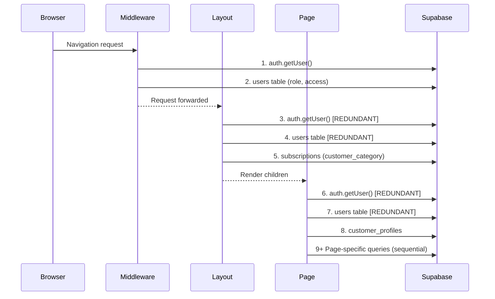
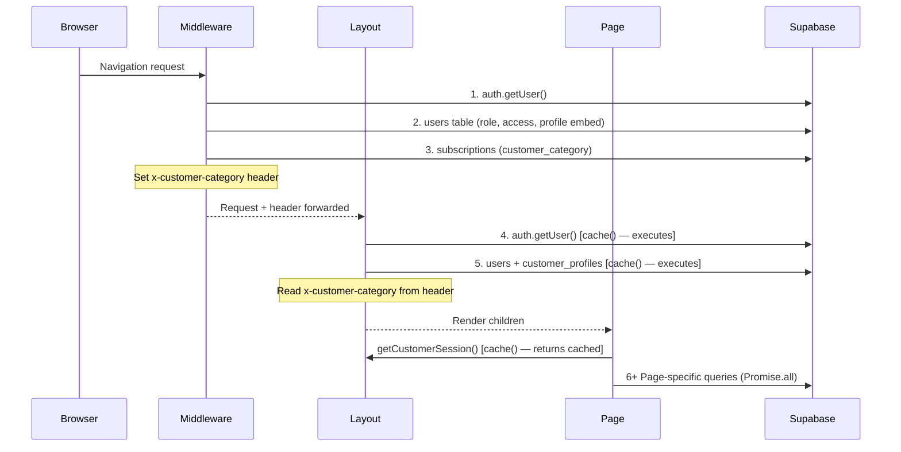

# Design Document: Customer Portal Data Optimization

## Overview

This feature eliminates redundant Supabase/auth round-trips in the customer portal by applying four complementary strategies:

1. **Middleware-to-Layout Header Propagation** — The middleware already authenticates the user and resolves their profile. We extend it to also resolve `customer_category` from the active subscription, then pass it downstream via an `x-customer-category` request header. The layout reads this header instead of making its own database call.

2. **Unified Session Helper** — All customer pages migrate to the existing `cache()`-wrapped `getCustomerSession()` helper, extended to also return `customerProfileId`. React's `cache()` guarantees that within a single request lifecycle, the underlying queries execute at most once regardless of how many components call the helper.

3. **Nested Sub-Select Elimination** — Pages that embed a `users` table query inside a filter expression (e.g., `.eq("user_id", (await supabase.from("users")...).data?.id)`) are refactored to use the pre-resolved `profile.id` or `customerProfileId` from the session helper.

4. **Query Parallelization** — Independent data-fetching queries that currently run sequentially are batched using `Promise.all`.

**Expected Outcome:** Per-navigation Supabase round-trips drop from 4-6+ to 2-3, yielding ~100-300ms TTFB improvement.

## Architecture

### Current Data Flow (Before)



### Optimized Data Flow (After)



### Key Design Decisions

| Decision | Rationale |
|----------|-----------|
| Header propagation for category instead of extending cache() | Middleware runs in Edge Runtime and cannot share React `cache()` with Server Components. Headers are the canonical cross-boundary data channel in Next.js. |
| Extend `getCustomerSession()` with `customerProfileId` | Most pages need this ID. Resolving it once in the helper (which is already cached per-request) eliminates repeated `customer_profiles` lookups. |
| Keep `getCustomerSession()` as the single entry point | Using `cache()` guarantees exactly-once execution per request. All pages and the layout share the same cached result. |
| `Promise.all` for independent queries | Queries that don't depend on each other's results can execute concurrently, reducing wall-clock time by eliminating unnecessary sequential waterfalls. |
| Middleware uses existing Supabase client | The middleware already creates a Supabase client for auth. The category lookup reuses this instance — no additional client instantiation overhead. |

## Components and Interfaces

### 1. Middleware Extension (`src/middleware.ts`)

**Change:** After resolving the user's role and confirming `roleCode === "CUSTOMER"`, query the `subscriptions` table for the active subscription's `customer_category`. Set the result as `x-customer-category` header on the rewritten response.

```typescript
// Pseudocode — new addition inside the customer portal branch
if (currentSubdomain === "customer" && roleCode === "CUSTOMER") {
  // userProfile already resolved above with customer_profiles embed
  const customerProfileId = profileList[0]?.id; // from the embed
  
  let customerCategory = "";
  if (customerProfileId) {
    const { data: catRow } = await supabase
      .from("subscriptions")
      .select("customer_category")
      .eq("customer_profile_id", customerProfileId)
      .eq("status", "ACTIVE")
      .order("created_at", { ascending: false })
      .limit(1)
      .maybeSingle();
    customerCategory = catRow?.customer_category ?? "";
  }
  
  response.headers.set("x-customer-category", customerCategory);
}
```

**Constraint:** This runs only for `CUSTOMER` role on the `customer` subdomain, after the existing gatekeeper check passes. No new Supabase client is created.

### 2. Extended GetCustomerSession Helper (`src/lib/customer/get-session.ts`)

**Interface Change:**

```typescript
export type CustomerSession = {
  supabase: Awaited<ReturnType<typeof createClient>>;
  user: User | null;
  profile: CustomerUserProfile | null;
  customerProfileId: string | null;  // NEW
  error: AuthError | null;
};
```

**Implementation:** After fetching the `users` row, perform a single additional query to resolve `customer_profiles.id`:

```typescript
export const getCustomerSession = cache(async (): Promise<CustomerSession> => {
  const supabase = await createClient();
  const { data: { user }, error: userError } = await supabase.auth.getUser();

  if (userError || !user) {
    return { supabase, user: null, profile: null, customerProfileId: null, error: userError };
  }

  const { data: profile } = await supabase
    .from("users")
    .select("id, full_name, mobile")
    .eq("auth_user_id", user.id)
    .maybeSingle();

  // Resolve customer profile ID
  let customerProfileId: string | null = null;
  if (profile?.id) {
    const { data: cp } = await supabase
      .from("customer_profiles")
      .select("id")
      .eq("user_id", profile.id)
      .maybeSingle();
    customerProfileId = cp?.id ?? null;
  }

  return { supabase, user, profile: profile ?? null, customerProfileId, error: null };
});
```

### 3. Customer Layout (`src/app/customer/(main)/layout.tsx`)

**Change:** Remove the inline `createClient()` + nested sub-select for `customer_category`. Read from `headers()` instead.

```typescript
import { headers } from "next/headers";

export default async function CustomerLayout({ children }) {
  const { user, profile, error } = await getCustomerSession();
  if (error || !user) redirect("/login");

  const headerStore = await headers();
  const customerCategory = headerStore.get("x-customer-category") || null;

  // Pass to Sidebar and Header as before
  return (
    <CustomerSidebar customerCategory={customerCategory} />
    <CustomerHeader customerCategory={customerCategory} />
  );
}
```

### 4. Customer Pages (Unified Pattern)

Each customer page follows this pattern:

```typescript
export default async function SomePage() {
  const { supabase, user, profile, customerProfileId, error } = await getCustomerSession();
  if (error || !user) redirect("/login");
  if (!customerProfileId) redirect("/dashboard");

  // Page-specific queries use `supabase` from session helper
  // Independent queries are batched with Promise.all
  const [dataA, dataB] = await Promise.all([
    supabase.from("table_a").select("*").eq("customer_profile_id", customerProfileId),
    supabase.from("table_b").select("*").eq("some_id", profile!.id),
  ]);

  // Dependent queries run after
  const dataC = await supabase.from("table_c").select("*").eq("a_id", dataA.data?.id);
}
```

### 5. Pages Requiring Refactoring

| Page | Current Pattern | After |
|------|----------------|-------|
| `subscription/page.tsx` | Own `createClient()` + `auth.getUser()` + `users` + sequential profile/plans | `getCustomerSession()` + `Promise.all([profile, plans])` |
| `profile/page.tsx` | Own `createClient()` + `auth.getUser()` + `users` + sequential profile/addresses | `getCustomerSession()` + `Promise.all([profile, addresses, documents])` |
| `meals/page.tsx` | Own `createClient()` + `auth.getUser()` + `users` + `customer_profiles` | `getCustomerSession()` (already has `Promise.all` for today's order/pref) |
| `shop/orders/page.tsx` | Own `createClient()` + `auth.getUser()` + `users` + `customer_profiles` + orders | `getCustomerSession()` + orders query |
| `manage/address/page.tsx` | Nested sub-select for profile.id | `getCustomerSession()` → use `customerProfileId` directly |
| `manage/planner/page.tsx` | Nested sub-select for profile.id | `getCustomerSession()` → use `customerProfileId` directly |

## Data Models

### Modified Type: `CustomerSession`

```typescript
export type CustomerUserProfile = {
  id: string;
  full_name: string | null;
  mobile: string | null;
};

export type CustomerSession = {
  supabase: Awaited<ReturnType<typeof createClient>>;
  user: User | null;
  profile: CustomerUserProfile | null;
  customerProfileId: string | null;  // NEW — customer_profiles.id
  error: AuthError | null;
};
```

### Request Header Contract

| Header | Set By | Read By | Values |
|--------|--------|---------|--------|
| `x-customer-category` | Middleware | Customer Layout | `"KIT"`, `"MEAL"`, or `""` (empty = no active subscription / null category) |

### Database Queries Per Component (After Optimization)

| Component | Queries | Details |
|-----------|---------|---------|
| Middleware | 2 (existing) + 1 (new) | `auth.getUser()` + `users` (with profile embed) + `subscriptions` (category) |
| Layout | 0 new | Reads header; `getCustomerSession()` is called but cache handles execution |
| `getCustomerSession()` | 3 total (cached) | `auth.getUser()` + `users` + `customer_profiles` |
| Page | N (page-specific) | Only page-specific data queries, parallelized where possible |

**Net per-navigation:** Middleware executes its 2-3 queries (already happens today for auth). Layout + Page share the `getCustomerSession()` cache, adding 0 additional session queries. Page-specific queries are parallelized. Total session resolution: **2-3 round-trips** (down from 4-6+).

## Correctness Properties

*A property is a characteristic or behavior that should hold true across all valid executions of a system — essentially, a formal statement about what the system should do. Properties serve as the bridge between human-readable specifications and machine-verifiable correctness guarantees.*

### Property 1: Session Cache Deduplication

*For any* request lifecycle in which `getCustomerSession()` is called N times (N ≥ 1), the underlying database queries (`auth.getUser()`, `users` table lookup, `customer_profiles` lookup) SHALL execute exactly once, and all N calls SHALL return references to the same result object.

**Validates: Requirements 3.3, 4.7, 8.3**

### Property 2: Auth Redirect on Null Session

*For any* customer page, when `getCustomerSession()` returns a `null` user or a non-null `error`, the page SHALL redirect to `/login` without executing any further queries or rendering any content.

**Validates: Requirements 7.4**

### Property 3: Maximum Round-Trips Per Navigation

*For any* customer page navigation, the combined session-resolution queries across Middleware + Layout + Page SHALL total no more than 3 Supabase round-trips (auth.getUser + users + customer_profiles), with subsequent page-specific queries being additive but independent of session resolution.

**Validates: Requirements 8.1**

## Error Handling

### Middleware Failures

| Scenario | Handling |
|----------|----------|
| `subscriptions` query fails or times out | Set `x-customer-category` to empty string. Do NOT block navigation — the layout treats empty as `null` and renders the full sidebar. |
| Middleware Supabase client creation fails | Existing behavior preserved — user is redirected to `/login`. |
| `customer_profiles` embed returns unexpected shape | Normalize gracefully (existing code already handles array/object/null polymorphism). |

### GetCustomerSession Failures

| Scenario | Handling |
|----------|----------|
| `auth.getUser()` returns error | Return `{ user: null, profile: null, customerProfileId: null, error }`. Pages redirect to `/login`. |
| `users` query returns no row | Return `{ user, profile: null, customerProfileId: null, error: null }`. Pages handle null profile gracefully. |
| `customer_profiles` query returns no row | Set `customerProfileId` to `null`. Pages that require it redirect to `/dashboard` or show appropriate UI. |

### Page-Level Query Failures

| Scenario | Handling |
|----------|----------|
| Any query in `Promise.all` rejects | Use individual `.then()` error handling or destructure with fallback. Pages should NOT crash — show degraded UI or empty state. |
| Data dependency violation (query placed in wrong Promise.all batch) | Compile-time type errors if result is used before resolution. Runtime: `undefined` propagates and the dependent query returns no results — not a crash, but incorrect data. Guard with null checks. |

### Header Propagation Edge Cases

| Scenario | Handling |
|----------|----------|
| `x-customer-category` header is stripped by CDN/proxy | Layout falls back to `null` — shows full sidebar (safe degradation). |
| Header contains unexpected value (not KIT/MEAL/"") | Layout passes it through; Sidebar components already handle unknown values by showing the full menu. |

## Testing Strategy

### Unit Tests (Example-Based)

| Test | Coverage |
|------|----------|
| Middleware sets `x-customer-category` to "KIT" for user with active KIT subscription | Req 1.1, 1.2 |
| Middleware sets `x-customer-category` to "" for user with no active subscription | Req 1.3 |
| Layout reads header and passes correct value to Sidebar/Header | Req 2.1, 2.3 |
| Layout treats empty/absent header as null | Req 2.4 |
| `getCustomerSession()` returns `customerProfileId` when profile exists | Req 3.1, 3.2 |
| `getCustomerSession()` returns `customerProfileId: null` when no profile | Req 3.4 |
| Each refactored page redirects to `/login` on auth failure | Req 7.4 |

### Property-Based Tests

Property-based testing is applicable here for the session caching behavior and the redirect contract, as these are universal properties that hold across all valid inputs.

**Library:** [fast-check](https://github.com/dubzzz/fast-check) (TypeScript PBT library)

| Property Test | Config |
|--------------|--------|
| Property 1: Cache deduplication — for any generated user state, calling `getCustomerSession()` multiple times returns same reference | Min 100 iterations |
| Property 2: Auth redirect — for any generated auth error or null user, page handler calls redirect("/login") | Min 100 iterations |
| Property 3: Round-trip count — for any generated page navigation scenario, session queries ≤ 3 | Min 100 iterations |

Each property test is tagged with:
```
// Feature: customer-portal-data-optimization, Property {N}: {property_text}
```

### Integration Tests

| Test | Coverage |
|------|----------|
| Full navigation flow: middleware → layout → page with authenticated user | Req 7.1, 7.2, 7.5, 8.1 |
| Verify RLS enforcement: page queries only return data for the authenticated user | Req 7.3 |
| Existing gatekeeper tests pass without modification | Req 1.5, 7.2 |

### Regression Tests

- All existing customer portal E2E flows continue to pass
- Sidebar renders correct items for KIT vs MEAL customers
- Pages load without errors for users with/without active subscriptions
- Auth redirects work correctly for unauthenticated users

### Smoke Tests

- No `createClient()` calls remain in refactored pages (static analysis / grep)
- No nested sub-select patterns remain in address/planner pages
- Middleware creates exactly one Supabase client instance
- `getCustomerSession()` remains wrapped in `cache()`
