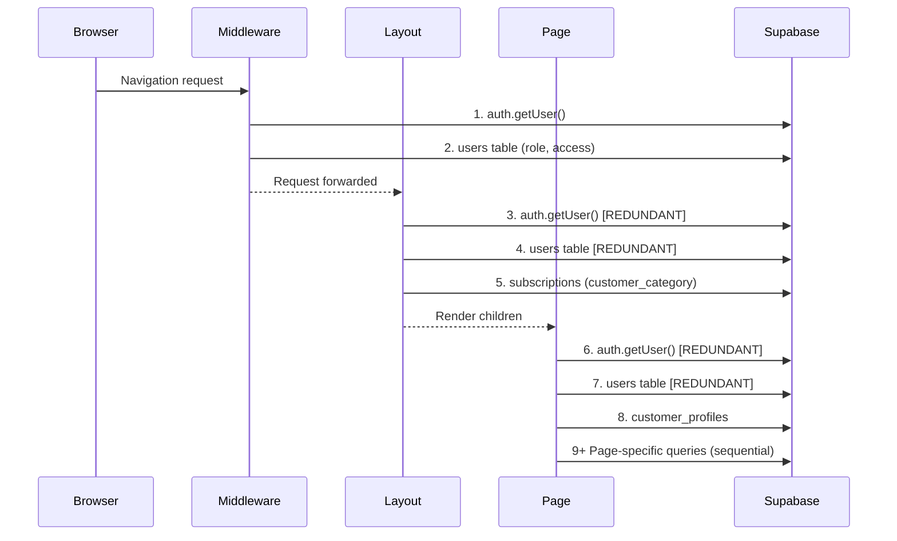
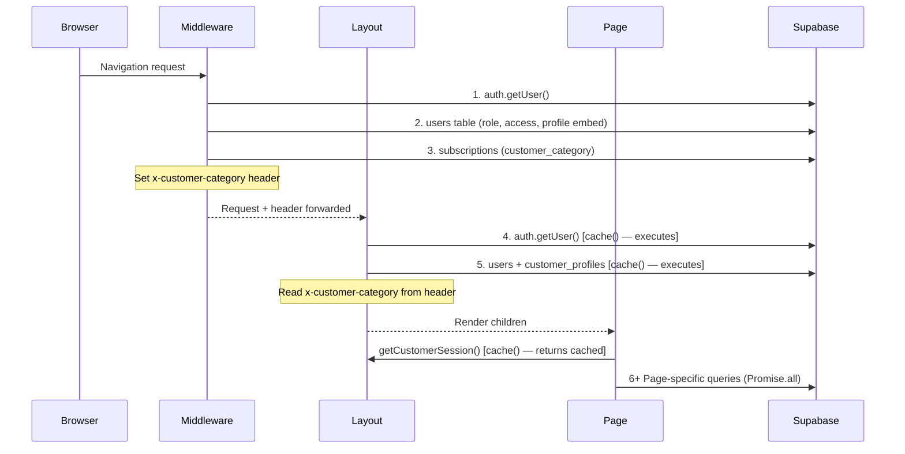
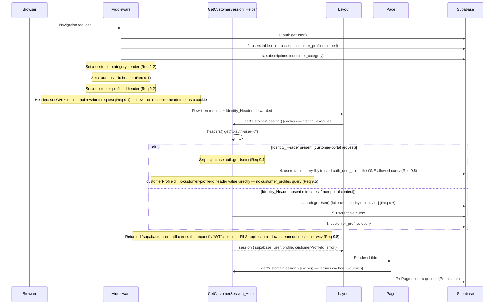

# Design Document: Customer Portal Data Optimization

## Overview

This feature eliminates redundant Supabase/auth round-trips in the customer portal by applying four complementary strategies:

1. **Middleware-to-Layout Header Propagation** — The middleware already authenticates the user and resolves their profile. We extend it to also resolve `customer_category` from the active subscription, then pass it downstream via an `x-customer-category` request header. The layout reads this header instead of making its own database call.

2. **Unified Session Helper** — All customer pages migrate to the existing `cache()`-wrapped `getCustomerSession()` helper, extended to also return `customerProfileId`. React's `cache()` guarantees that within a single request lifecycle, the underlying queries execute at most once regardless of how many components call the helper.

3. **Nested Sub-Select Elimination** — Pages that embed a `users` table query inside a filter expression (e.g., `.eq("user_id", (await supabase.from("users")...).data?.id)`) are refactored to use the pre-resolved `profile.id` or `customerProfileId` from the session helper.

4. **Query Parallelization** — Independent data-fetching queries that currently run sequentially are batched using `Promise.all`.

**Expected Outcome:** Per-navigation Supabase round-trips drop from 4-6+ to 2-3, yielding ~100-300ms TTFB improvement.

## Architecture

### Current Data Flow (Before)



### Optimized Data Flow (After)



### Key Design Decisions

| Decision | Rationale |
|----------|-----------|
| Header propagation for category instead of extending cache() | Middleware runs in Edge Runtime and cannot share React `cache()` with Server Components. Headers are the canonical cross-boundary data channel in Next.js. |
| Extend `getCustomerSession()` with `customerProfileId` | Most pages need this ID. Resolving it once in the helper (which is already cached per-request) eliminates repeated `customer_profiles` lookups. |
| Keep `getCustomerSession()` as the single entry point | Using `cache()` guarantees exactly-once execution per request. All pages and the layout share the same cached result. |
| `Promise.all` for independent queries | Queries that don't depend on each other's results can execute concurrently, reducing wall-clock time by eliminating unnecessary sequential waterfalls. |
| Middleware uses existing Supabase client | The middleware already creates a Supabase client for auth. The category lookup reuses this instance — no additional client instantiation overhead. |

---

## Architecture Extension: Requirements 9-14 (Measured-Findings Phase)

The sections below extend the architecture above to address the dominant remaining cost identified by direct profiling: a duplicate identity resolution between the Edge_Runtime (Middleware) and Node_Runtime (`getCustomerSession()`), several pages that never adopted the Requirement 4 pattern, unparallelized query chains on the KIT pages, a slow/duplicated notifications route, and a broken client-side timing measurement. Nothing in this extension changes the Requirements 1-8 flow described above — it adds a new header channel (Identity_Header) alongside the existing `x-customer-category` header, and layers additional optimizations on top of the already-unified `getCustomerSession()` helper.

### Updated Data Flow (After Requirement 9 — Identity Header Trust)

This diagram supersedes the "Optimized Data Flow (After)" diagram above for the specific case where Middleware has already resolved a verified `CUSTOMER` identity. The Middleware's `auth.getUser()` + `users` query (step 1-2) is unchanged from the diagram above — the only change is that the *already-resolved* result is now also carried forward as Identity_Headers, letting `getCustomerSession()` skip its own `auth.getUser()` call.



**Why the identity is still verified, not merely repeated:** Middleware already called `supabase.auth.getUser()` against the Supabase Auth server (which validates the session JWT) before setting the Identity_Headers. `getCustomerSession()` trusting `x-auth-user-id` is not equivalent to trusting an arbitrary client-supplied header — the header is set exclusively by Middleware on the internal request object (Req 9.7), which the framework guarantees Server Components cannot inject or overwrite from outside (there is no code path from `NextRequest` cookies/headers into a rewritten-request header other than Middleware's own `NextResponse.rewrite`/`next({ request })` mechanism). The Supabase client returned by `getCustomerSession()` is still constructed from the request's own cookies in both branches (Req 9.8), so even if the trusted identity were somehow wrong, RLS at the database layer would still constrain query results to whatever JWT is actually present in the cookies — the header only shortcuts the *lookup*, never the *authorization boundary*.

### Open Question / Constraint: `/api` Routes and the Middleware Early Return

`src/middleware.ts` currently begins with:

```typescript
if (request.nextUrl.pathname.startsWith("/api")) {
  return NextResponse.next();
}
```

This means `/api/notifications` (Requirement 12) **never reaches** the block below that resolves `roleCode`, `customerProfileId`, or sets any header — including the new Identity_Headers from Requirement 9. Two open items must be resolved during implementation, not assumed here:

1. **Does `headers()` even work the same way in a Route Handler as in a Server Component?** Route Handlers can read incoming request headers via `headers()` (or the `Request` object directly) just like Server Components, so *if* an Identity_Header were present on the request to `/api/notifications`, reading it would work identically. The open question is item 2, not this one.
2. **Should the `/api` early return be narrowed so identity-resolving middleware logic also runs for `/api/notifications` specifically, or should Requirement 12 be implemented independently of Requirement 9's headers?** Narrowing the early return has a blast radius beyond this feature — it would cause the Supabase client creation, gatekeeper redirects, and portal-rewrite logic to start running for every route under `/api`, including routes with no relationship to the customer portal (webhooks, cron endpoints, admin APIs). That is a change to a shared, high-traffic entry point, not a change local to this feature.

**Decision deferred to implementation. Two viable directions, either acceptable, to be chosen during task execution:**
- **(a)** Leave the `/api` early return untouched, and implement Requirement 12 using *only* the "at most one combined identity-resolution step" language (Req 12.1) independent of Identity_Headers — e.g., resolve `auth.getUser()` once and use its `user.id` to query `users` directly with the SSR client (dropping the separate `createAdminClient()` round-trip) rather than depending on Middleware headers at all.
- **(b)** Add a narrow, additive exception inside the existing early-return block that runs the identity-resolution (not the full gatekeeper/rewrite logic) specifically for `/api/notifications`, gated so it cannot affect any other `/api` route.

This design does not silently pick one; the Components and Interfaces section for Requirement 12 below specifies the fallback-safe contract (Req 12.1-12.4) that holds regardless of which direction is chosen.

## Components and Interfaces

### 1. Middleware Extension (`src/middleware.ts`)

**Change:** After resolving the user's role and confirming `roleCode === "CUSTOMER"`, query the `subscriptions` table for the active subscription's `customer_category`. Set the result as `x-customer-category` header on the rewritten response.

```typescript
// Pseudocode — new addition inside the customer portal branch
if (currentSubdomain === "customer" && roleCode === "CUSTOMER") {
  // userProfile already resolved above with customer_profiles embed
  const customerProfileId = profileList[0]?.id; // from the embed
  
  let customerCategory = "";
  if (customerProfileId) {
    const { data: catRow } = await supabase
      .from("subscriptions")
      .select("customer_category")
      .eq("customer_profile_id", customerProfileId)
      .eq("status", "ACTIVE")
      .order("created_at", { ascending: false })
      .limit(1)
      .maybeSingle();
    customerCategory = catRow?.customer_category ?? "";
  }
  
  response.headers.set("x-customer-category", customerCategory);
}
```

**Constraint:** This runs only for `CUSTOMER` role on the `customer` subdomain, after the existing gatekeeper check passes. No new Supabase client is created.

### 2. Extended GetCustomerSession Helper (`src/lib/customer/get-session.ts`)

**Interface Change:**

```typescript
export type CustomerSession = {
  supabase: Awaited<ReturnType<typeof createClient>>;
  user: User | null;
  profile: CustomerUserProfile | null;
  customerProfileId: string | null;  // NEW
  error: AuthError | null;
};
```

**Implementation:** After fetching the `users` row, perform a single additional query to resolve `customer_profiles.id`:

```typescript
export const getCustomerSession = cache(async (): Promise<CustomerSession> => {
  const supabase = await createClient();
  const { data: { user }, error: userError } = await supabase.auth.getUser();

  if (userError || !user) {
    return { supabase, user: null, profile: null, customerProfileId: null, error: userError };
  }

  const { data: profile } = await supabase
    .from("users")
    .select("id, full_name, mobile")
    .eq("auth_user_id", user.id)
    .maybeSingle();

  // Resolve customer profile ID
  let customerProfileId: string | null = null;
  if (profile?.id) {
    const { data: cp } = await supabase
      .from("customer_profiles")
      .select("id")
      .eq("user_id", profile.id)
      .maybeSingle();
    customerProfileId = cp?.id ?? null;
  }

  return { supabase, user, profile: profile ?? null, customerProfileId, error: null };
});
```

### 3. Customer Layout (`src/app/customer/(main)/layout.tsx`)

**Change:** Remove the inline `createClient()` + nested sub-select for `customer_category`. Read from `headers()` instead.

```typescript
import { headers } from "next/headers";

export default async function CustomerLayout({ children }) {
  const { user, profile, error } = await getCustomerSession();
  if (error || !user) redirect("/login");

  const headerStore = await headers();
  const customerCategory = headerStore.get("x-customer-category") || null;

  // Pass to Sidebar and Header as before
  return (
    <CustomerSidebar customerCategory={customerCategory} />
    <CustomerHeader customerCategory={customerCategory} />
  );
}
```

### 4. Customer Pages (Unified Pattern)

Each customer page follows this pattern:

```typescript
export default async function SomePage() {
  const { supabase, user, profile, customerProfileId, error } = await getCustomerSession();
  if (error || !user) redirect("/login");
  if (!customerProfileId) redirect("/dashboard");

  // Page-specific queries use `supabase` from session helper
  // Independent queries are batched with Promise.all
  const [dataA, dataB] = await Promise.all([
    supabase.from("table_a").select("*").eq("customer_profile_id", customerProfileId),
    supabase.from("table_b").select("*").eq("some_id", profile!.id),
  ]);

  // Dependent queries run after
  const dataC = await supabase.from("table_c").select("*").eq("a_id", dataA.data?.id);
}
```

### 5. Pages Requiring Refactoring

| Page | Current Pattern | After |
|------|----------------|-------|
| `subscription/page.tsx` | Own `createClient()` + `auth.getUser()` + `users` + sequential profile/plans | `getCustomerSession()` + `Promise.all([profile, plans])` |
| `profile/page.tsx` | Own `createClient()` + `auth.getUser()` + `users` + sequential profile/addresses | `getCustomerSession()` + `Promise.all([profile, addresses, documents])` |
| `meals/page.tsx` | Own `createClient()` + `auth.getUser()` + `users` + `customer_profiles` | `getCustomerSession()` (already has `Promise.all` for today's order/pref) |
| `shop/orders/page.tsx` | Own `createClient()` + `auth.getUser()` + `users` + `customer_profiles` + orders | `getCustomerSession()` + orders query |
| `manage/address/page.tsx` | Nested sub-select for profile.id | `getCustomerSession()` → use `customerProfileId` directly |
| `manage/planner/page.tsx` | Nested sub-select for profile.id | `getCustomerSession()` → use `customerProfileId` directly |

---

## Components and Interfaces Extension: Requirements 9-14

### 6. Middleware Identity Header Propagation (`src/middleware.ts`) — Req 9

**Change:** Inside the existing `currentSubdomain === "customer"` branch (the same block that currently sets `x-customer-category`, immediately after the temp-PIN check and before the category lookup), set two additional headers using data already resolved by the single `users` query at the top of `middleware()` — `user.id` (the `auth_user_id`) and `customerProfileId` (already extracted from the `customer_profiles` embed for the category lookup). No new Supabase client and no new query are introduced.

```typescript
// Inside: if (currentSubdomain === "customer") { ... } — after the isTempPin check,
// alongside the existing x-customer-category header assignment.
// user and customerProfileId are already in scope from the users query above.
response.headers.set("x-auth-user-id", user.id);
if (customerProfileId) {
  response.headers.set("x-customer-profile-id", customerProfileId);
}
```

**Critical constraint (Req 9.7):** `response` here is the `NextResponse.rewrite(...)` / `NextResponse.next({ request })` object used to construct the *forwarded request* — headers set on it via `response.headers.set(...)` become part of the rewritten request that downstream Server Components see via `headers()`. They are **not** copied onto the outer HTTP response that the browser receives; Next.js's rewrite mechanism keeps the browser-visible response headers separate from the internal request headers propagated to the matched route. This must be verified in code review during implementation (see Testing Strategy — Smoke Tests below) rather than assumed, since accidentally using a response-cookie API (`response.cookies.set`) instead of `response.headers.set` would leak the identity to the client.

### 7. GetCustomerSession Helper — Identity Header Trust Branch (`src/lib/customer/get-session.ts`) — Req 9

**Interface:** Unchanged — `CustomerSession` keeps the same shape from Requirement 3. Only the internal resolution strategy branches.

```typescript
export const getCustomerSession = cache(async (): Promise<CustomerSession> => {
  const timer = createServerTimer("getCustomerSession");
  const supabase = await createClient(); // unchanged — still wired to request cookies/JWT (Req 9.8)
  const headerStore = await headers();
  const trustedAuthUserId = headerStore.get("x-auth-user-id");

  let user: User | null;
  let userError: AuthError | null = null;

  if (trustedAuthUserId) {
    // Req 9.4 — trust the Identity_Header, skip supabase.auth.getUser()
    user = { id: trustedAuthUserId } as User; // minimal shape needed downstream
  } else {
    // Req 9.6 — fallback: today's behavior, unchanged
    const authResult = await supabase.auth.getUser();
    user = authResult.data.user;
    userError = authResult.error;
  }

  if (userError || !user) {
    return { supabase, user: null, profile: null, customerProfileId: null, error: userError };
  }

  // Req 9.5 — exactly one query in the trusted-header branch: resolve the users row
  const { data: profile } = await supabase
    .from("users")
    .select("id, full_name, mobile")
    .eq("auth_user_id", user.id)
    .maybeSingle();

  let customerProfileId: string | null;
  const trustedProfileId = headerStore.get("x-customer-profile-id");
  if (trustedAuthUserId && trustedProfileId) {
    // Req 9.5 — use the header value directly, no customer_profiles query
    customerProfileId = trustedProfileId;
  } else if (profile?.id) {
    // Fallback branch — same as today
    const { data: cp } = await supabase
      .from("customer_profiles")
      .select("id")
      .eq("user_id", profile.id)
      .maybeSingle();
    customerProfileId = cp?.id ?? null;
  } else {
    customerProfileId = null;
  }

  return { supabase, user, profile: profile ?? null, customerProfileId, error: null };
});
```

**Note on `user` shape:** Downstream code only relies on `user.id` and the null/non-null check (`if (error || !user) redirect("/login")`), per the existing `CustomerSession` consumers. The trusted-header branch constructs a minimal `User`-shaped object carrying only `id`; it does not fabricate `email`, `aud`, or other Supabase Auth fields. Any page code that reads other `User` fields off `getCustomerSession().user` (audited during implementation) would need to fall back to the untrusted path or use `profile` instead — no current consumer does this.

### 8. Migrated Pages (Req 10)

Same unified pattern as Requirement 4's "Customer Pages (Unified Pattern)" above, applied to the five remaining pages:

| Page | Current Pattern | After |
|------|----------------|-------|
| `subscription/manage/billing/page.tsx` | Own `createClient()` + `auth.getUser()` + `users` + `customer_profiles` (all sequential, via `.single()`) | `getCustomerSession()` → use `customerProfileId` directly; existing `Promise.all([addonOrders, subscriptions])` batch is unchanged |
| `subscription/checkout/page.tsx` | Own `createClient()` + `auth.getUser()`, then `customer_profiles` filtered by embedded `users!inner(auth_user_id)` join | `getCustomerSession()` for identity; separate `customer_profiles` query `.select("dietary_preference, franchise_id").eq("id", customerProfileId)` keyed on the helper's `customerProfileId` instead of the `users!inner` join filter; existing `Promise.all([plans, latestSubscription, categories])` batch is unchanged and still depends on the resolved profile |
| `tracking/[orderId]/page.tsx` | Own `createClient()` + `auth.getUser()` (profile/category not needed by this page) | `getCustomerSession()` for the `user`/`error` null-check only; `delivery_orders` query unchanged |
| `shop/page.tsx` | Own `createClient()` + `auth.getUser()` + `users` + `customer_profiles` (three sequential steps to reach `franchise_id`) | `getCustomerSession()` for identity + `customerProfileId`; single `customer_profiles.select("franchise_id").eq("id", customerProfileId)` query replaces the three-step chain |
| `kit-tracker/page.tsx` | `getCustomerSession()` already used for `user`/`profile`, but a **redundant** second `createClient()` + `customer_profiles` query resolves `cpRow.id` from `profile.id` | Remove the redundant query entirely; use `customerProfileId` already returned by `getCustomerSession()` in its place (the subsequent `subscriptions`/`kit_daily_logs` queries are unchanged, just keyed on `customerProfileId` instead of `cpRow.id`) |

**Consistent migration contract across all five pages (Req 10.6, 10.7):**
```typescript
const { user, customerProfileId, error, supabase } = await getCustomerSession();
if (error || !user) redirect("/login");
// no independent auth.getUser() or users-table query follows anywhere in the page
```

### 9. Kit Tracker Page Parallelization (Req 11)

**Dependency analysis:**
- `customerProfileId` (from `getCustomerSession()`, Req 10) — **no dependency**, available immediately.
- Active-subscription-category check (`subscriptions` query for `id, customer_category`) — depends only on `customerProfileId`. **Independent of** `getKitTrackerStateAction()`, which depends only on the server-resolved `customerProfileId` internally (via `authenticateCustomer()`) — the two do not consume each other's results, so today's sequential ordering (category check, *then* `getKitTrackerStateAction()`) is unnecessary serialization.
- The subscription refetch with tracker fields (`starts_on, kit_duration_days, ...`) — depends on the branch outcome of `getKitTrackerStateAction()` (only runs when `state.type === "active"`). **Genuinely sequential** — cannot be parallelized with the state-action call it depends on.
- `kit_daily_logs` count/fetch — depends on the tracker-fields subscription query's result (`subscription.id`). **Genuinely sequential.**

**Refactored shape:**
```typescript
const { customerProfileId, error, user } = await getCustomerSession();
if (error || !user) redirect("/login");
if (!customerProfileId) redirect("/dashboard?msg=kit-tracker-unavailable");

// Independent — run concurrently (Req 11.1, 11.2)
const [activeSubResult, stateResult] = await Promise.all([
  supabase
    .from("subscriptions")
    .select("id, customer_category")
    .eq("customer_profile_id", customerProfileId)
    .in("status", ["ACTIVE", "PENDING"])
    .order("created_at", { ascending: false })
    .limit(1)
    .maybeSingle(),
  getKitTrackerStateAction(),
]);

if (activeSubResult.data && activeSubResult.data.customer_category !== "KIT") {
  redirect("/dashboard?msg=kit-tracker-unavailable");
}

// stateResult branching unchanged from today; the tracker-fields subscription
// query and kit_daily_logs query remain sequential (Req 11.3) since each
// depends on the previous step's result.
```

### 10. Kit History Chain Instrumentation and Parallelization (Req 11.4-11.6)

**Instrumentation:** `getKitHistory()` in `src/repositories/kitLifecycleRepository.ts` currently performs a single Supabase query with embedded joins (`kit_products`, `kit_shipping_info`, `kit_daily_logs`) — there is no sequential chain of separate round-trips inside the repository function itself today. Per Req 11.4, add a `createServerTimer("getKitHistoryAction")` in `getKitHistoryAction()` (the action wrapping the repository call) with marks around `authenticateCustomer()` and the `KitLifecycleService.getKitHistory(...)` call, consistent with the pattern already used in `getCustomerSession()`:

```typescript
export async function getKitHistoryAction() {
  const timer = createServerTimer("getKitHistoryAction");
  let auth: Awaited<ReturnType<typeof authenticateCustomer>>;
  await timer.measure("authenticateCustomer()", async () => { auth = await authenticateCustomer(); });
  if (!auth.success) { timer.done(); return { success: false, error: auth.error }; }

  try {
    let history: KitHistoryEntry[];
    await timer.measure("KitLifecycleService.getKitHistory()", async () => {
      history = await KitLifecycleService.getKitHistory(auth.customerProfileId);
    });
    timer.done();
    return { success: true, history };
  } catch (error) {
    timer.done();
    // ...unchanged error handling
  }
}
```

**Parallelization outcome (Req 11.5):** Because `authenticateCustomer()` must resolve `customerProfileId` before `getKitHistory(customerProfileId)` can run, these two steps are genuinely sequential and instrumentation is expected to confirm this — there is no independent-query opportunity between them. If instrumentation run during implementation instead reveals that the repository's single embedded-join query has been split into separate round-trips (e.g., during a future refactor), those independently-fetchable pieces (e.g., `kit_products` lookup vs. `kit_shipping_info` lookup for a given subscription set, neither of which depends on the other) would be batched with `Promise.all` at that time. The instrumentation added now is the prerequisite that makes such a future finding measurable (Req 11.4); it does not itself assume there is parallelization work available today, consistent with the requirement's own conditional phrasing ("WHEN the instrumented chain reveals independent queries...").

### 11. Notifications Route Optimization (`src/app/api/notifications/route.ts`) — Req 12

**Constraint:** Per the Open Question above, this design specifies the *contract*, not a specific header-dependent mechanism, since whether Identity_Headers reach `/api` routes is unresolved:

```typescript
async function resolveAuthenticatedUserId(): Promise<{ userId: string | null; unauthenticated: boolean }> {
  const headerStore = await headers();
  const trustedAuthUserId = headerStore.get("x-auth-user-id"); // present only if the Open Question is resolved as option (b)
  const trustedUserId = headerStore.get("x-customer-profile-id"); // NOTE: notifications key off `users.id`, not customer_profile_id — see below

  const supabase = await createClient();

  if (trustedAuthUserId) {
    // Req 12.2 — combined identity resolution: one users query, keyed on the trusted auth_user_id
    const { data: profile } = await supabase
      .from("users")
      .select("id")
      .eq("auth_user_id", trustedAuthUserId)
      .maybeSingle();
    return { userId: profile?.id ?? null, unauthenticated: false };
  }

  // Req 12.3 — fallback: existing auth.getUser() + users lookup, but using the
  // already-created SSR client instead of a second createAdminClient() round-trip
  const { data: { user }, error: authError } = await supabase.auth.getUser();
  if (authError || !user) return { userId: null, unauthenticated: true };

  const { data: profile } = await supabase
    .from("users")
    .select("id")
    .eq("auth_user_id", user.id)
    .maybeSingle();
  return { userId: profile?.id ?? null, unauthenticated: false };
}
```

**Round-trip accounting (Req 12.4):** Header-trusted path = 1 round-trip for identity + 1 for notifications = 2 total. Fallback path = `auth.getUser()` (1) + `users` query (1) + notifications query (1) = 3 total, same as today's baseline minus the `createAdminClient()` split (today's code uses a *separate* admin client for the `users` lookup than the SSR client used for `auth.getUser()`; using one client for both does not add a round-trip, it just avoids a second client instantiation). Note that Req 12.4's "at most two sequential round-trips" bound is only achievable when the Identity_Header path is available (option (b) of the Open Question) — if option (a) is chosen instead, the fallback path (3 round-trips) is the only path, and Req 12.4 could not be met as literally written; **this is flagged as a dependency of the Open Question resolution, not silently reconciled here.**

**`unreadCount` correctness (Req 12.7, 12.8):** The response-shaping logic (`{ notifications: [], unreadCount: 0 }` for unauthenticated; computed count otherwise) is unchanged from today's implementation and is preserved as-is by this optimization — only the identity-resolution step above changes.

### 12. NotificationBell Fetch Guard (`src/shared/components/shared/NotificationBell.tsx`) — Req 12.5, 12.6

**Root cause to confirm during implementation:** `fetchNotifications` is invoked from three independent `useEffect`s (mount/`userId` change, refresh-event listener, poll interval) plus the popover-open handler, with no shared in-flight guard. A rapid double-fetch on navigation is most likely caused by the mount-effect firing on every `NotificationBell` remount (e.g., if the component unmounts/remounts across an SPA transition inside `CustomerLayout`, or if `userId` reference changes) rather than a single effect firing twice. Add an in-flight ref guard:

```typescript
const inFlightRef = useRef(false);

const fetchNotifications = useCallback(async (options?: { silent?: boolean }) => {
  if (inFlightRef.current) return; // Req 12.6 — prevent concurrent/rapid duplicate fetches
  inFlightRef.current = true;
  try {
    // ...existing fetch logic unchanged
  } finally {
    inFlightRef.current = false;
  }
}, []);
```

This preserves the existing legitimate triggers (mount, refresh event, popover open, poll interval — Req 12.5) while collapsing accidental concurrent duplicate calls into a single in-flight request.

### 13. HydrationTimer Redesign (`src/shared/components/perf/HydrationTimer.tsx`) — Req 13

**Root cause:** `HydrationTimer` is mounted once inside the persistent `CustomerLayout` (which does not remount on SPA transitions), so its `mountedRef.current` flag permanently flips to `true` after the first render, and the `else` (SPA transition) branch's `useEffect` callback only re-runs when the component's dependency array changes — but the component currently has an empty-dependency-shaped `useEffect(() => {...})` with no array at all (Rules of Hooks: it re-runs every render since there's no dependency array), so in practice it *does* re-run on every render — the actual gap is that `CustomerLayout` (and therefore `HydrationTimer`) only re-renders when its own props/children change identity in a way that triggers React reconciliation, which does not reliably happen on every App Router segment swap since Server Component payload streaming can update only the nested `Page` segment without re-rendering the `Layout` boundary.

**Fix — key the component by `usePathname()`, forcing remount semantics for the "first mount vs. subsequent" distinction to instead become "first pathname vs. subsequent pathname":**

```typescript
"use client";
import { useEffect, useRef } from "react";
import { usePathname } from "next/navigation";

function HydrationTimerInner({ pathname }: { pathname: string }) {
  const isFirstPathnameRef = useRef(true);

  useEffect(() => {
    if (process.env.NEXT_PUBLIC_PERF_TIMING !== "1") return;
    const now = performance.now();

    if (isFirstPathnameRef.current) {
      isFirstPathnameRef.current = false;
      // Full-page-load branch — fires only once, on true initial mount (Req 13.4)
      // ...unchanged full-page-load logging logic
      return;
    }

    // Req 13.1, 13.2, 13.3 — re-executes on every committed route change because
    // `pathname` is in the dependency array below, not because of remounting.
    const marks = performance.getEntriesByName("route-transition-start", "mark");
    const lastMark = marks[marks.length - 1];
    if (lastMark) {
      // Req 13.5 — only logs if a real mark exists; no fabricated/repeated entry otherwise
      const transitionTime = now - lastMark.startTime;
      console.log(`⏱ [PERF] SPA route transition: ${transitionTime.toFixed(1)}ms (click → hydrated)`);
      performance.clearMarks("route-transition-start"); // Req 13.6 — prevents reuse of a stale mark on the next navigation
    }
  }, [pathname]);

  return null;
}

export function HydrationTimer() {
  const pathname = usePathname();
  return <HydrationTimerInner pathname={pathname} />;
}
```

The `isFirstPathnameRef` ref (module-instance-scoped to the single `HydrationTimerInner` element that lives for the whole browser session, since `HydrationTimer` itself is not re-keyed) preserves the one-time-only full-page-load branch (Req 13.4) while the `[pathname]` dependency array is what makes the transition-logging logic re-execute on every route change (Req 13.1-13.3), without needing to force a full component remount via a `key` prop (which would itself reset `isFirstPathnameRef` on every navigation and break the one-time-only guarantee).

### 14. OneSignal Domain Guard (`src/shared/components/notifications/OneSignalProvider.tsx`) — Req 14

```typescript
const ALLOWED_ONESIGNAL_HOSTNAMES = (process.env.NEXT_PUBLIC_ONESIGNAL_ALLOWED_HOSTNAMES ?? "customer.arogyadiet.com")
  .split(",")
  .map((h) => h.trim())
  .filter(Boolean);

function isOneSignalDomainAllowed(): boolean {
  try {
    if (typeof window === "undefined") return true; // Req 14.5 — inconclusive (SSR) → proceed
    if (ALLOWED_ONESIGNAL_HOSTNAMES.length === 0) return true; // Req 14.5 — inconclusive (no config) → proceed
    return ALLOWED_ONESIGNAL_HOSTNAMES.includes(window.location.hostname);
  } catch {
    return true; // Req 14.5 — check failed → fail open, proceed with init
  }
}
```

Called once at the top of the existing `runWithOneSignal` function (web path only — the native/Cordova path in `initializeNativeOneSignal` has no `window.location.hostname` concept and is unaffected):

```typescript
const runWithOneSignal = async (OneSignal: OneSignalClient) => {
  if (!isOneSignalDomainAllowed()) {
    return; // Req 14.2 — skip init/login for this page load; no re-run/retry loop
  }
  try {
    if (!initStartedRef.current) {
      // ...existing OneSignal.init() logic unchanged (Req 14.3, 14.4)
```

Because `isOneSignalDomainAllowed()` fails open (returns `true`) on any error, missing config, or SSR context (Req 14.5), and because a correctly configured production hostname is by definition in `ALLOWED_ONESIGNAL_HOSTNAMES`, production behavior is unchanged (Req 14.4).

## Data Models

### Modified Type: `CustomerSession`

```typescript
export type CustomerUserProfile = {
  id: string;
  full_name: string | null;
  mobile: string | null;
};

export type CustomerSession = {
  supabase: Awaited<ReturnType<typeof createClient>>;
  user: User | null;
  profile: CustomerUserProfile | null;
  customerProfileId: string | null;  // NEW — customer_profiles.id
  error: AuthError | null;
};
```

### Request Header Contract

| Header | Set By | Read By | Values |
|--------|--------|---------|--------|
| `x-customer-category` | Middleware | Customer Layout | `"KIT"`, `"MEAL"`, or `""` (empty = no active subscription / null category) |
| `x-auth-user-id` | Middleware (Req 9.1) | `getCustomerSession()`, and `/api/notifications` if the Open Question is resolved as option (b) | The verified `auth_user_id` (Supabase Auth `user.id`) for `roleCode === "CUSTOMER"` sessions only. Absent for all other roles/subdomains and for unauthenticated requests. Set only on the internal rewritten request object — never a response header or cookie (Req 9.7). |
| `x-customer-profile-id` | Middleware (Req 9.2) | `getCustomerSession()` | The resolved `customer_profiles.id`. Absent if the customer has no profile row. Same internal-only constraint as `x-auth-user-id` (Req 9.7). |

### Data Model Extension: Notifications Route Identity Resolution (Req 12)

No new persisted data model — `resolveAuthenticatedUserId()`'s return shape (`{ userId: string | null; unauthenticated: boolean }`) is unchanged. The internal resolution strategy branches on header presence as described in Components and Interfaces #11 above.

### Database Queries Per Component (After Optimization — Updated for Req 9)

| Component | Queries | Details |
|-----------|---------|---------|
| Middleware | 2 (existing) + 1 (category, existing) | `auth.getUser()` + `users` (with profile embed) + `subscriptions` (category). **Header count increases from 1 to 3** (`x-customer-category`, `x-auth-user-id`, `x-customer-profile-id`) with zero additional queries (Req 9.3) — all three headers are set from data the existing 2 queries already resolved. |
| Layout | 0 new | Reads headers; `getCustomerSession()` is called but cache handles execution |
| `getCustomerSession()` — Identity_Header present (Req 9.4-9.5) | **1 total (cached)** | Only the `users` table query. `auth.getUser()` is skipped (header trusted); `customer_profiles` query is skipped (`customerProfileId` taken directly from `x-customer-profile-id` header). |
| `getCustomerSession()` — Identity_Header absent (Req 9.6, fallback) | 3 total (cached) | Unchanged from the Requirements 1-8 baseline: `auth.getUser()` + `users` + `customer_profiles`. |
| Page | N (page-specific) | Only page-specific data queries, parallelized where possible |

**Net per-navigation (updated):** For the common case — an authenticated `CUSTOMER` request through Middleware — total session-resolution round-trips drop to Middleware's 2-3 (unchanged, this cost already existed for auth) **plus only 1 additional query in `getCustomerSession()`** (down from 3), since `auth.getUser()` and the `customer_profiles` lookup are both skipped via trusted headers. This is the direct fix for the ~55%/~1.2s duplicate-identity-resolution cost identified by profiling. The fallback path (headers absent) preserves the original 2-3 round-trip total from Requirement 8 unchanged.

## Correctness Properties

*A property is a characteristic or behavior that should hold true across all valid executions of a system — essentially, a formal statement about what the system should do. Properties serve as the bridge between human-readable specifications and machine-verifiable correctness guarantees.*

### Property 1: Session Cache Deduplication

*For any* request lifecycle in which `getCustomerSession()` is called N times (N ≥ 1), the underlying database queries (`auth.getUser()`, `users` table lookup, `customer_profiles` lookup) SHALL execute exactly once, and all N calls SHALL return references to the same result object.

**Validates: Requirements 3.3, 4.7, 8.3**

### Property 2: Auth Redirect on Null Session

*For any* customer page, when `getCustomerSession()` returns a `null` user or a non-null `error`, the page SHALL redirect to `/login` without executing any further queries or rendering any content.

**Validates: Requirements 7.4**

### Property 3: Maximum Round-Trips Per Navigation

*For any* customer page navigation, the combined session-resolution queries across Middleware + Layout + Page SHALL total no more than 3 Supabase round-trips (auth.getUser + users + customer_profiles), with subsequent page-specific queries being additive but independent of session resolution.

**Validates: Requirements 8.1**

---

### Correctness Properties Extension: Requirements 9-14

The properties below continue the numbering from Property 3 and were derived from the acceptance-criteria prework analysis, after a redundancy reflection pass that unified per-criterion checks into single universally-quantified properties where multiple criteria described the same underlying code path (see prework notes).

### Property 4: Middleware Identity Header Propagation

*For any* authenticated request where Middleware resolves `roleCode === "CUSTOMER"` and grants access, the rewritten request forwarded downstream SHALL carry an `x-auth-user-id` header equal to the resolved `auth_user_id`, and — when a Customer_Profile_ID was resolved — an `x-customer-profile-id` header equal to that value, and the number of Supabase queries Middleware executes SHALL be identical to the number it would execute with these two headers omitted (i.e., no additional round-trip is introduced by setting them).

**Validates: Requirements 9.1, 9.2, 9.3**

### Property 5: Identity Header Trust Fallback

*For any* incoming request to `getCustomerSession()`:
- IF an `x-auth-user-id` header is present, THEN `getCustomerSession()` SHALL NOT invoke `supabase.auth.getUser()`, SHALL execute exactly one Supabase query (the `users` table lookup), and SHALL set `customerProfileId` to the `x-customer-profile-id` header value directly without querying `customer_profiles`.
- IF the `x-auth-user-id` header is absent, THEN `getCustomerSession()`'s behavior (queries executed, in order, and the resulting session shape) SHALL be equivalent to the pre-Requirement-9 implementation (`auth.getUser()` → `users` → `customer_profiles`, three total queries).

**Validates: Requirements 9.4, 9.5, 9.6**

### Property 6: RLS Client Construction Is Identity-Source-Independent

*For any* invocation of `getCustomerSession()`, regardless of whether the returned `user`/`customerProfileId` were obtained via a trusted Identity_Header or via the fallback `auth.getUser()` resolution, the returned `supabase` client SHALL be constructed identically from the request's own cookies, such that all queries made with it remain subject to RLS.

**Validates: Requirements 9.8**

### Property 7: Identity Headers Never Leak to the Client

*For any* request processed by Middleware that results in `x-auth-user-id` and/or `x-customer-profile-id` being set on the internal rewritten request, the outer HTTP response observed by the browser (its `Headers` and any `Set-Cookie` entries) SHALL NOT contain `x-auth-user-id` or `x-customer-profile-id` under any key or cookie name.

**Validates: Requirements 9.7**

### Property 8: Page Migration Completeness

*For any* page in the finite set `{subscription/manage/billing/page.tsx, subscription/checkout/page.tsx, tracking/[orderId]/page.tsx, shop/page.tsx, kit-tracker/page.tsx}` and *for any* generated `getCustomerSession()` result:
- IF the result has a `null` user or a non-null `error`, THEN the page SHALL redirect to `/login` without executing any independent `auth.getUser()` call or `users`/`customer_profiles` query.
- IF the result resolves successfully, THEN the page SHALL render using only `getCustomerSession()`'s returned `user`, `profile`, and `customerProfileId` for identity purposes, performing zero independent `auth.getUser()` calls and zero independent `users` table queries.

**Validates: Requirements 10.1, 10.2, 10.3, 10.4, 10.5, 10.6, 10.7**

### Property 9: Kit Tracker/History Parallelization Output Equivalence

*For any* generated fixture of `customer_profiles`, `subscriptions` (with varying `status`/`customer_category`/tracker fields), `kit_shipping_info`, and `kit_daily_logs` rows, the parallelized Kit_Tracker_Page and Kit_History_Page data-fetching logic SHALL produce the same rendered branch (e.g., `start_flow` | `receipt_flow` | `processing` | `expiration` | `active` | package-receipt vs. daily-tracker) and the same resulting props/data shape as a sequential reference implementation, for every fixture — including fixtures with no active subscription, non-KIT category, and empty history.

**Validates: Requirements 11.1, 11.2, 11.3, 11.5, 11.6**

### Property 10: Notifications Route Identity Resolution Equivalence

*For any* generated request scenario (Identity_Header present with a matching `users` row, Identity_Header present with no matching row, Identity_Header absent with a valid session, Identity_Header absent with no session), the Notification_Route SHALL resolve to the same `userId`/`unauthenticated` outcome as the reference (pre-optimization) resolution logic, and SHALL execute at most one identity-resolution round-trip before the notifications query when a valid Identity_Header is available, or the existing `auth.getUser()` + `users` round-trips otherwise.

**Validates: Requirements 12.1, 12.2, 12.3, 12.4**

### Property 11: Notification Bell Fetch Deduplication

*For any* generated sequence of NotificationBell lifecycle events (mount, `userId`-unchanged re-render, refresh event, popover open, poll-interval tick) for a fixed `userId`, the number of actual network fetch calls made to `/api/notifications` SHALL NOT exceed the number of legitimate trigger occurrences in that sequence — concurrent or rapidly repeated calls triggered by the same underlying event SHALL collapse into a single in-flight request.

**Validates: Requirements 12.5, 12.6**

### Property 12: Notification Unread Count Accuracy

*For any* generated set of notification rows for a user: IF the request is unauthenticated (no user, or an auth error), THEN the response SHALL be `{ notifications: [], unreadCount: 0 }` regardless of any internal unread-count computation that may have occurred first. IF the request resolves to a valid `userId`, THEN the response's `unreadCount` SHALL equal the exact count of that user's rows where `is_read` is `false`, with no cap applied.

**Validates: Requirements 12.7, 12.8**

### Property 13: SPA Transition Timer Fires Exactly Once Per Navigation Without Fabrication

*For any* generated sequence of N simulated route changes (each optionally preceded by a `route-transition-start` performance mark):
- The full-page-load timing branch SHALL fire exactly once, on the first pathname only.
- For each subsequent pathname change that IS preceded by a mark, the SPA-transition branch SHALL log exactly one measured duration for that change.
- For each subsequent pathname change that is NOT preceded by a mark, the SPA-transition branch SHALL NOT log any duration (no fabrication, no reuse of a stale prior mark).

**Validates: Requirements 13.1, 13.2, 13.3, 13.4, 13.5**

### Property 14: SPA Transition Timing Values Are Physically Valid

*For any* logged SPA_Transition duration produced by Hydration_Timer, the value SHALL be greater than or equal to zero, and for any two distinct navigations in the same session, their logged mark timestamps SHALL NOT be identical.

**Validates: Requirements 13.6**

### Property 15: OneSignal Domain Guard Correctness

*For any* generated `window.location.hostname` value and *for any* generated allowed-domains configuration, `OneSignal.init()` SHALL be invoked if and only if the hostname is a member of the allowed-domains set (a production hostname that is correctly configured as a member SHALL behave identically to today — init runs).

**Validates: Requirements 14.1, 14.2, 14.3, 14.4**

### Property 16: OneSignal Guard Fails Open on Error or Inconclusive Result

*For any* scenario where the domain-mismatch detection logic throws an exception or is otherwise unable to produce a conclusive true/false result (e.g., `window` undefined, empty configuration), the guard SHALL treat the outcome as "no mismatch detected" and `OneSignal.init()` SHALL still be invoked.

**Validates: Requirements 14.5**

## Error Handling

### Middleware Failures

| Scenario | Handling |
|----------|----------|
| `subscriptions` query fails or times out | Set `x-customer-category` to empty string. Do NOT block navigation — the layout treats empty as `null` and renders the full sidebar. |
| Middleware Supabase client creation fails | Existing behavior preserved — user is redirected to `/login`. |
| `customer_profiles` embed returns unexpected shape | Normalize gracefully (existing code already handles array/object/null polymorphism). |

### GetCustomerSession Failures

| Scenario | Handling |
|----------|----------|
| `auth.getUser()` returns error | Return `{ user: null, profile: null, customerProfileId: null, error }`. Pages redirect to `/login`. |
| `users` query returns no row | Return `{ user, profile: null, customerProfileId: null, error: null }`. Pages handle null profile gracefully. |
| `customer_profiles` query returns no row | Set `customerProfileId` to `null`. Pages that require it redirect to `/dashboard` or show appropriate UI. |

### Page-Level Query Failures

| Scenario | Handling |
|----------|----------|
| Any query in `Promise.all` rejects | Use individual `.then()` error handling or destructure with fallback. Pages should NOT crash — show degraded UI or empty state. |
| Data dependency violation (query placed in wrong Promise.all batch) | Compile-time type errors if result is used before resolution. Runtime: `undefined` propagates and the dependent query returns no results — not a crash, but incorrect data. Guard with null checks. |

### Header Propagation Edge Cases

| Scenario | Handling |
|----------|----------|
| `x-customer-category` header is stripped by CDN/proxy | Layout falls back to `null` — shows full sidebar (safe degradation). |
| Header contains unexpected value (not KIT/MEAL/"") | Layout passes it through; Sidebar components already handle unknown values by showing the full menu. |

---

### Error Handling Extension: Requirements 9-14

#### Identity Header Trust Failures (Req 9)

| Scenario | Handling |
|----------|----------|
| `x-auth-user-id` header present but the `users` row lookup by that ID returns no row | Return `{ user: { id: trustedAuthUserId }, profile: null, customerProfileId: null, error: null }` — consistent with today's "no `users` row" handling; pages that require `profile` handle `null` gracefully as they already do. |
| `x-auth-user-id` present but `x-customer-profile-id` absent (e.g., customer has no profile row) | `customerProfileId` resolves to `null` directly (no fallback query attempted) — same downstream handling as "no customer profile exists" in Requirement 3. |
| Header value is present but malformed (not a valid UUID) | The subsequent `users` query by that value simply returns no row (Supabase returns an empty result for a non-matching filter, not an error, for a `.eq()` on a UUID column with a non-UUID string — this is validated during implementation; if the client throws instead, the page's existing `if (error || !user) redirect("/login")` guard on the eventual auth check downstream still applies since `profile`/`customerProfileId` end up null). |
| Middleware fails to resolve `customerProfileId` (no customer profile) | `x-customer-profile-id` header is simply omitted (not set to empty string) — `getCustomerSession()` treats an absent header the same as a `null` `customerProfileId`, never as an empty-string sentinel, avoiding ambiguity with the `x-customer-category` empty-string convention used for a different header. |

#### Page Migration Failures (Req 10)

| Scenario | Handling |
|----------|----------|
| Any of the five migrated pages' `getCustomerSession()` returns null user/error | Redirect to `/login`, unchanged from Requirement 7.4's existing contract. |
| `checkout/page.tsx`'s new `customer_profiles` query (keyed on `customerProfileId`) returns no row | `profile` data passed to `CheckoutWizard` is `null`/`undefined`, matching today's `maybeSingle()` null-safety — no crash, existing downstream null handling in `CheckoutWizard` is unchanged. |
| `shop/page.tsx`'s new single `customer_profiles` query fails | `franchiseId` resolves to `null`, falling back to `fetchCatalogProducts()` (the existing "core customer" path) — matches today's behavior when no profile/franchise is found. |

#### Kit Tracker/History Parallelization Failures (Req 11)

| Scenario | Handling |
|----------|----------|
| One query in the new `Promise.all([activeSubResult, stateResult])` batch rejects while the other resolves | Follow the existing Promise.all error-handling convention from Requirement 6/Error Handling above — wrap in try/catch or check `.error` per-result; a rejection must not crash the page, and should be treated equivalently to that query returning no data (safe degradation, consistent with the existing pattern for `Promise.all` failures documented above). |
| `getKitTrackerStateAction()` and the active-subscription-category check disagree (e.g., category check says non-KIT but state action returns an "active" KIT state) | This is a genuine data-consistency scenario, not a network error — the existing precedence (category check redirect happens first, before checking `stateResult`) is preserved unchanged by parallelizing the *fetch*, since only the fetch is concurrent, not the branching logic that consumes the results. |

#### Notifications Route Failures (Req 12)

| Scenario | Handling |
|----------|----------|
| Identity_Header path chosen but header absent on `/api/notifications` (e.g., Open Question resolved as option (a), or middleware doesn't reach `/api`) | Falls back to existing `auth.getUser()` + `users` resolution — the route must not assume the header will always be present, per Req 12.3. |
| `users` lookup (either path) returns no row for a resolved identity | `userId` is `null`, `unauthenticated` is `false` — route returns the empty/zero response per today's existing "no internal user id resolved" branch, unchanged. |
| NotificationBell's new in-flight guard is active when a legitimate refresh event fires | The refresh event's fetch call is dropped (guarded) if a fetch is already in-flight; this is treated as acceptable per Req 12.5's phrasing ("at most once per mount... unless triggered by...") — an in-flight fetch already satisfies the pending trigger's intent, so no data is lost, only a redundant simultaneous request. |

#### HydrationTimer Failures (Req 13)

| Scenario | Handling |
|----------|----------|
| `NEXT_PUBLIC_PERF_TIMING` is not `"1"` | All logic remains a no-op, unchanged from today — the redesign only changes re-execution semantics when timing is enabled. |
| A route change occurs with no preceding `route-transition-start` mark (e.g., programmatic `router.push` outside of `RouteProgressBar`'s click handler) | No duration is logged for that transition (Req 13.5) — this is treated as an expected gap in coverage, not an error, consistent with the requirement's explicit "SHALL NOT log a fabricated... duration" instruction. |

#### OneSignal Domain Guard Failures (Req 14)

| Scenario | Handling |
|----------|----------|
| `NEXT_PUBLIC_ONESIGNAL_ALLOWED_HOSTNAMES` is unset | Defaults to the production hostname (`customer.arogyadiet.com`); production behavior is unaffected. If this default itself does not match the actual configured OneSignal allowed domain in some environment, this is a configuration issue to catch via the smoke test below, not a runtime error. |
| `window.location.hostname` access throws (should not happen in a browser context, but guarded defensively) | Fails open — `isOneSignalDomainAllowed()` returns `true`, `OneSignal.init()` proceeds (Req 14.5). |

## Testing Strategy

### Unit Tests (Example-Based)

| Test | Coverage |
|------|----------|
| Middleware sets `x-customer-category` to "KIT" for user with active KIT subscription | Req 1.1, 1.2 |
| Middleware sets `x-customer-category` to "" for user with no active subscription | Req 1.3 |
| Layout reads header and passes correct value to Sidebar/Header | Req 2.1, 2.3 |
| Layout treats empty/absent header as null | Req 2.4 |
| `getCustomerSession()` returns `customerProfileId` when profile exists | Req 3.1, 3.2 |
| `getCustomerSession()` returns `customerProfileId: null` when no profile | Req 3.4 |
| Each refactored page redirects to `/login` on auth failure | Req 7.4 |

### Property-Based Tests

Property-based testing is applicable here for the session caching behavior and the redirect contract, as these are universal properties that hold across all valid inputs.

**Library:** [fast-check](https://github.com/dubzzz/fast-check) (TypeScript PBT library)

| Property Test | Config |
|--------------|--------|
| Property 1: Cache deduplication — for any generated user state, calling `getCustomerSession()` multiple times returns same reference | Min 100 iterations |
| Property 2: Auth redirect — for any generated auth error or null user, page handler calls redirect("/login") | Min 100 iterations |
| Property 3: Round-trip count — for any generated page navigation scenario, session queries ≤ 3 | Min 100 iterations |

Each property test is tagged with:
```
// Feature: customer-portal-data-optimization, Property {N}: {property_text}
```

### Integration Tests

| Test | Coverage |
|------|----------|
| Full navigation flow: middleware → layout → page with authenticated user | Req 7.1, 7.2, 7.5, 8.1 |
| Verify RLS enforcement: page queries only return data for the authenticated user | Req 7.3 |
| Existing gatekeeper tests pass without modification | Req 1.5, 7.2 |

### Regression Tests

- All existing customer portal E2E flows continue to pass
- Sidebar renders correct items for KIT vs MEAL customers
- Pages load without errors for users with/without active subscriptions
- Auth redirects work correctly for unauthenticated users

### Smoke Tests

- No `createClient()` calls remain in refactored pages (static analysis / grep)
- No nested sub-select patterns remain in address/planner pages
- Middleware creates exactly one Supabase client instance
- `getCustomerSession()` remains wrapped in `cache()`

---

## Testing Strategy Extension: Requirements 9-14

### Unit Tests (Example-Based)

| Test | Coverage |
|------|----------|
| Middleware sets `x-auth-user-id` and `x-customer-profile-id` on the rewritten request for an authenticated CUSTOMER, and does NOT set them on the outer `NextResponse`'s client-visible headers/cookies | Req 9.1, 9.2, 9.7 |
| `getCustomerSession()` skips `auth.getUser()` when `x-auth-user-id` is present (assert mock call count) | Req 9.4 |
| `getCustomerSession()` uses `x-customer-profile-id` directly without querying `customer_profiles` | Req 9.5 |
| `getCustomerSession()` falls back to `auth.getUser()` + `users` + `customer_profiles` when headers are absent | Req 9.6 |
| Each of the 5 migrated pages (billing, checkout, tracking, shop, kit-tracker) redirects to `/login` on null user/error | Req 10.6 |
| `checkout/page.tsx` resolves `franchise_id`/`dietary_preference` via a `customerProfileId`-keyed query, not the `users!inner` join | Req 10.2 |
| `shop/page.tsx` resolves `franchise_id` via a single `customer_profiles` query keyed on `customerProfileId` | Req 10.4 |
| `kit-tracker/page.tsx` no longer calls `createClient()` a second time to resolve `cpRow.id` | Req 10.5 |
| Notification_Route resolves `userId` via a single combined step when an Identity_Header is present | Req 12.2 |
| Notification_Route falls back to `auth.getUser()` + `users` when no Identity_Header is present | Req 12.3 |
| Notification_Route returns `{ notifications: [], unreadCount: 0 }` for unauthenticated requests | Req 12.7 |
| NotificationBell in-flight guard drops a concurrent duplicate call | Req 12.6 |
| HydrationTimer logs the full-page-load branch exactly once across multiple simulated pathname changes | Req 13.4 |
| HydrationTimer does not log a duration when no `route-transition-start` mark exists | Req 13.5 |
| OneSignal guard skips `init()` when hostname is not in the allowed list | Req 14.1, 14.2 |
| OneSignal guard proceeds with `init()` when hostname matches | Req 14.3, 14.4 |
| OneSignal guard proceeds with `init()` when the detection check throws | Req 14.5 |

### Property-Based Tests

Property-based testing is applicable to the new Requirements 9-14 logic for the same reasons as Requirements 1-8: these are pure-function-shaped decisions (header trust vs. fallback, migrated-page redirect contracts, parallelization output equivalence, notification identity resolution, timer firing state machine, and the domain-guard predicate) with universal properties that must hold across a wide input space, and can be tested with mocked Supabase clients/headers/`fetch`/`performance` APIs to keep iteration cost low.

**Library:** [fast-check](https://github.com/dubzzz/fast-check) (TypeScript PBT library) — same as Requirements 1-8.

| Property Test | Config |
|--------------|--------|
| Property 4: Middleware Identity Header Propagation — for any generated resolved `auth_user_id`/`customerProfileId`, headers are set correctly with no added query count | Min 100 iterations |
| Property 5: Identity Header Trust Fallback — for any generated header-present/absent scenario, correct branch (query count, `customerProfileId` source) is taken | Min 100 iterations |
| Property 6: RLS Client Construction Is Identity-Source-Independent — for any generated identity source, `supabase` client construction call is identical | Min 100 iterations |
| Property 7: Identity Headers Never Leak to the Client — for any generated identity values, outer response headers/cookies never contain the identity header names | Min 100 iterations |
| Property 8: Page Migration Completeness — for any of the 5 pages × any generated session result, redirect/render contract holds with zero independent identity calls | Min 100 iterations |
| Property 9: Kit Tracker/History Parallelization Output Equivalence — for any generated subscription/shipping/log fixture, parallelized output equals sequential reference output | Min 100 iterations |
| Property 10: Notifications Route Identity Resolution Equivalence — for any generated request scenario, resolved `userId`/`unauthenticated` matches reference logic and round-trip bound is respected | Min 100 iterations |
| Property 11: Notification Bell Fetch Deduplication — for any generated event sequence, fetch call count does not exceed legitimate trigger count | Min 100 iterations |
| Property 12: Notification Unread Count Accuracy — for any generated notification set, `unreadCount` is exact and correctly gated by auth state | Min 100 iterations |
| Property 13: SPA Transition Timer Fires Exactly Once Per Navigation Without Fabrication — for any generated navigation/mark sequence, firing state machine holds | Min 100 iterations |
| Property 14: SPA Transition Timing Values Are Physically Valid — for any generated navigation sequence, all logged durations ≥ 0 and distinct navigations have distinct timestamps | Min 100 iterations |
| Property 15: OneSignal Domain Guard Correctness — for any generated hostname/allowlist pair, `init()` call state matches membership | Min 100 iterations |
| Property 16: OneSignal Guard Fails Open on Error or Inconclusive Result — for any generated throwing/inconclusive detection scenario, `init()` is still invoked | Min 100 iterations |

Each property test is tagged with:
```
// Feature: customer-portal-data-optimization, Property {N}: {property_text}
```

### Integration Tests

| Test | Coverage |
|------|----------|
| Full navigation flow through Middleware → `getCustomerSession()` with Identity_Headers trusted end-to-end (no mocks, against a real/test Supabase project) confirms `auth.getUser()` is genuinely skipped and RLS still applies | Req 9.4, 9.5, 9.8 |
| `/api/notifications` request/response cycle, exercising whichever direction the Open Question is resolved with (header-based or `auth.getUser()`-only optimization) | Req 12.1-12.4 |
| End-to-end KIT tracker page load across each `getKitTrackerStateAction()` state (`start_flow`, `receipt_flow`, `processing`, `expiration`, `active`) after parallelization, confirming rendered output is unchanged from pre-parallelization behavior | Req 11.6 |
| End-to-end SPA navigation sequence (3+ page transitions) in a browser/e2e test with `NEXT_PUBLIC_PERF_TIMING=1`, confirming a distinct console log per transition | Req 13.1, 13.2 |

### Regression Tests

- All existing customer portal E2E flows continue to pass (unchanged from Requirements 1-8 baseline)
- The 5 newly migrated pages (billing, checkout, tracking, shop, kit-tracker) render identically to their pre-migration output for representative fixtures
- KIT tracker and KIT history pages preserve existing UI/branching for each lifecycle state after parallelization
- NotificationBell continues to display correct unread counts and mark-as-read behavior after the fetch-guard change
- OneSignal push notifications continue to function unchanged in the production environment

### Smoke Tests (Extension)

- `x-auth-user-id` and `x-customer-profile-id` never appear in the browser's Network tab response headers or `document.cookie` for a real customer-portal navigation (manual/E2E check, directly validating Req 9.7 in a way a unit test with mocks cannot fully guarantee)
- No `createClient()` calls remain in the 5 Requirement 10 pages beyond the one inside `getCustomerSession()` itself (static analysis / grep)
- `kit-tracker/page.tsx` contains no second `createClient()` call
- `getKitHistoryAction()` contains `createServerTimer` instrumentation
- The `/api` middleware early-return question (see Architecture — Open Question) is explicitly resolved (either direction) and documented in code comments before Requirement 12 is marked complete — this is a implementation-readiness gate, not a runtime check
