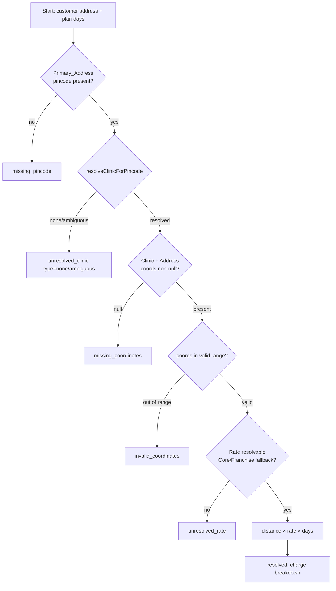

# Design Document

## Overview

This feature adds **distance-based delivery charges** to the ArogyaDiet platform and introduces a **multi-tenant per-km rate configuration store** that also becomes the single source of truth for rider-payout-per-km rates.

The delivery charge for a subscription is:

```
distance_km            = round2( Haversine( Primary_Address, serving Clinic ) )   // NO 1.3 road multiplier (D1)
per_day_delivery_charge = round2( Delivery_Rate × distance_km )
total_delivery_charge   = round2( per_day_delivery_charge × Total_Plan_Days )
total_payable           = round2( Plan_Price + total_delivery_charge )
```

All rounding is **round-half-up to 2 decimal places** (D2).

The design is deliberately layered so the same pure logic drives all four surfaces:

- **`src/lib/delivery/deliveryCharge.ts`** — pure, dependency-free calculator (distance rounding, per-day/total charge, total payable, input validation). Property-tested.
- **`src/services/RateConfigService.ts`** — resolves the applicable `Delivery_Rate` / `Rider_Payout_Rate` for a clinic or pincode, applying the Core→Franchise fallback and defaults. Reads the new `rate_configs` table.
- **`src/services/DeliveryChargeService.ts`** — orchestrates pincode → clinic → coordinates → rate → charge, returning a single discriminated-union outcome that every surface renders.
- **Server actions** expose calculation to the admin surfaces and the customer checkout; the checkout recomputes server-side and rejects mismatched client values.
- **Master card** (`RateConfigCard`) on `master/(main)/system` performs CRUD on `rate_configs` only; it never computes charges.
- **Rider payout** reads the Core/Franchise rate from `RateConfigService` instead of `system_settings.rider_payout_per_km`, keeping the existing Haversine×1.3 road-distance formula.

### Grounding in the existing codebase

| Concern | Reused building block |
| --- | --- |
| Clinic resolution from pincode | `resolveClinicForPincode(pincode)` — `src/lib/clinic/pincode-resolver.ts` (returns `resolved` / `none` / `ambiguous`) |
| Straight-line distance | `calculateHaversineDistanceKm(lat1,lng1,lat2,lng2)` — `src/lib/distance.ts` |
| Rider road distance | `estimateRoadDistanceKm(km) = km × 1.3` — `src/lib/distance.ts` |
| Rider payout formula | `computeOpenLoopHaversineRoute(...)` and dispatch in `src/actions/system-actions/routeEngine.ts` |
| Legacy payout editor | `SettingsTab` — `src/shared/components/admin/finance/SettingsTab.tsx` (rider-payout input removed) |
| Legacy payout storage | `system_settings.rider_payout_per_km` (read replaced by `rate_configs`) |
| Payment / subscription persistence | `payments` + `subscriptions` tables; `addSubscription` (`adminSubscriptionActions.ts`), `verifyAndActivateSubscriptionAction` (`checkoutActions.ts`), `OnboardingService.onboard` + `onboard_customer` RPC |
| Audit trail | `logAdminAction` → `admin_activity_logs` (`src/lib/logger.ts`) |
| Master config UI pattern | `master/(main)/system/page.tsx`, `CoreBusinessSection` |

### Design decisions carried from requirements

- **D1** — Delivery charge uses Haversine distance **without** the 1.3 multiplier. Rider payout keeps ×1.3.
- **D2** — Round half-up to 2 decimals for distance, per-day charge, total charge, and total payable.
- **D4** — Only the admin Quick Onboarding wizard is in scope; the franchise-portal quick-onboard is not.
- **D5** — Charges apply only to subscriptions created after deployment; no back-charging.

## Architecture

### Layered flow

```mermaid
flowchart TD
    subgraph Surfaces
        QO[Admin Quick Onboarding<br/>Payment & Review]
        A360[Admin Customer 360<br/>Add Subscription]
        CO[Customer Checkout<br/>Review step]
        MC[Master Rate Config Card]
    end

    subgraph Actions[Server Actions]
        CALC[calculateDeliveryChargeAction]
        RCFG[rateConfigActions<br/>get / upsert]
        COACT[checkoutActions<br/>server-side recompute]
    end

    subgraph Services
        DCS[DeliveryChargeService]
        RCS[RateConfigService]
    end

    subgraph Pure[Pure libs]
        CALCLIB[deliveryCharge.ts]
        DIST[distance.ts<br/>Haversine]
        PIN[pincode-resolver.ts]
    end

    subgraph DB[(Supabase)]
        RC[(rate_configs)]
        AUD[(rate_config_audit_logs)]
        PAY[(payments)]
        SUB[(subscriptions)]
    end

    QO --> CALC
    A360 --> CALC
    CO --> COACT
    MC --> RCFG

    CALC --> DCS
    COACT --> DCS
    DCS --> RCS
    DCS --> PIN
    DCS --> CALCLIB
    CALCLIB --> DIST
    RCS --> RC
    RCFG --> RC
    RCFG --> AUD
    COACT --> PAY
    COACT --> SUB

    RE[routeEngine dispatch] --> RCS
```

### Delivery-charge resolution pipeline

`DeliveryChargeService.computeForCustomer` runs a fixed sequence, short-circuiting to a typed failure at the first problem so each surface can render a precise message:



### Multi-tenancy and rate scoping

- A **Core Clinic** has `clinics.franchise_id IS NULL` → uses the `CORE_BUSINESS` scope rate.
- A **Franchise Clinic** has `clinics.franchise_id = <id>` → uses that franchise's rate, falling back to the Core rate when the franchise has no configured value, and finally to the built-in default (₹13.00 delivery / ₹16.00 payout) when Core is unset.

## Components and Interfaces

### 1. `src/lib/delivery/deliveryCharge.ts` (pure calculator)

No I/O. Deterministic. This is the primary property-tested unit.

```typescript
export const DEFAULT_DELIVERY_RATE_PER_KM = 13.0;
export const DEFAULT_RIDER_PAYOUT_RATE_PER_KM = 16.0;

/** Money/coordinate bounds shared across the feature. */
export const MAX_RATE_PER_KM = 999_999.99;         // Rate_Config_Store hard bound (Req 1.7)
export const MASTER_CARD_MAX_RATE_PER_KM = 9_999.99; // Master card bound (Req 10.7/10.8)
export const MAX_DELIVERY_CHARGE = 999_999.99;      // per-subscription charge bound (Req 6.1, 9.2)
export const MIN_PLAN_DAYS = 1;
export const MAX_PLAN_DAYS = 365;                   // checkout/onboarding (Req 4.2)

/** Round half-up to `decimals` places, immune to binary-float bias. */
export function roundHalfUp(value: number, decimals?: number): number;

export type Coordinate = { lat: number; lng: number };

export function isValidLat(lat: number): boolean;   // -90..90 inclusive
export function isValidLng(lng: number): boolean;   // -180..180 inclusive

/** Distance outcome — separates "missing" from "invalid" (Req 3.3–3.5). */
export type DistanceResult =
  | { ok: true; distanceKm: number }                 // already round2
  | { ok: false; reason: "missing_coordinates" }
  | { ok: false; reason: "invalid_coordinates" };

export function computeDeliveryDistanceKm(
  address: { lat: number | null; lng: number | null },
  clinic: { latitude: number | null; longitude: number | null },
): DistanceResult;

/** Amount outcome (Req 4). */
export type ChargeInput = { ratePerKm: number; distanceKm: number; planDays: number };
export type ChargeResult =
  | {
      ok: true;
      distanceKm: number;          // round2
      ratePerKm: number;
      perDayCharge: number;        // round2
      totalDeliveryCharge: number; // round2
    }
  | { ok: false; reason: "invalid_input"; field: "ratePerKm" | "distanceKm" | "planDays" };

export function calculateDeliveryCharge(input: ChargeInput): ChargeResult;

/** Total_Payable = round2(planPrice + totalDeliveryCharge) (Req 4.6). */
export function calculateTotalPayable(planPrice: number, totalDeliveryCharge: number): number;
```

Rules encoded here:
- `computeDeliveryDistanceKm` returns `missing_coordinates` if any coordinate is `null`, `invalid_coordinates` if any non-null coordinate is out of range, otherwise `round2(haversine(...))`.
- `calculateDeliveryCharge` rejects (`invalid_input`) when `ratePerKm < 0`, `distanceKm < 0`, `planDays < 1`, `planDays` non-integer, or any input is `null`/`NaN`/non-finite; otherwise computes `perDay = round2(rate × round2(distance))`, `total = round2(perDay × planDays)`. No tax applied (Req 4.4).
- `roundHalfUp` is implemented with integer scaling (`Math.round((value + Number.EPSILON) * 10^d) / 10^d` guarded for negatives) so `2.675 → 2.68`. It replaces the naive `.toFixed(2)` used elsewhere for delivery-charge math.

### 2. `src/services/RateConfigService.ts` (rate resolution + persistence)

Server-only. Injectable Supabase client (mirrors `BillingService` pattern) so it is testable with an in-memory fake.

```typescript
export type RateScope =
  | { type: "CORE_BUSINESS" }
  | { type: "FRANCHISE"; franchiseId: string };

export type ResolvedRates = {
  deliveryRatePerKm: number;
  riderPayoutRatePerKm: number;
  deliveryRateSource: "franchise" | "core" | "default";
  payoutRateSource: "franchise" | "core" | "default";
};

/** Resolve both rates for a clinic, applying franchise→core→default fallback (Req 1.3–1.6, 2.1–2.2). */
export async function resolveRatesForClinic(
  db: SupabaseClient,
  clinic: { id: string; franchise_id: string | null },
): Promise<ResolvedRates>;

/** Resolve the delivery rate scope only (used by delivery-charge pipeline). */
export async function resolveDeliveryRateForClinic(
  db: SupabaseClient,
  clinic: { id: string; franchise_id: string | null },
): Promise<{ ratePerKm: number; source: "franchise" | "core" | "default" }>;

/** Master card reads: Core row + one row per franchise (Req 10). */
export async function listRateConfigs(db: SupabaseClient): Promise<{
  core: { deliveryRatePerKm: number | null; riderPayoutRatePerKm: number | null };
  franchises: Array<{
    franchiseId: string;
    franchiseName: string;
    deliveryRatePerKm: number | null;
    riderPayoutRatePerKm: number | null;
  }>;
}>;

export type RateField = "delivery_rate_per_km" | "rider_payout_rate_per_km";

/** Upsert a single rate for a scope after validation (Req 1.8, 10.6, 10.9). */
export async function upsertRate(
  db: SupabaseClient,
  scope: RateScope,
  field: RateField,
  value: number,
): Promise<{ ok: true; previous: number | null } | { ok: false; error: string }>;
```

Resolution algorithm (`resolveDeliveryRateForClinic`):
1. If `franchise_id` set → read that franchise row's `delivery_rate_per_km`; if non-null → `{ rate, "franchise" }`.
2. Read the Core row's `delivery_rate_per_km`; if non-null → `{ rate, "core" }`.
3. Else → `{ DEFAULT_DELIVERY_RATE_PER_KM, "default" }`.

`resolveRatesForClinic` applies the identical fallback independently to each of the two rate fields. Rider payout uses `DEFAULT_RIDER_PAYOUT_RATE_PER_KM` (₹16.00) as the terminal default (Req 1.4, 11.4).

Validation in `upsertRate` (Req 1.8): reject when value is negative, `> MAX_RATE_PER_KM`, or has more than 2 decimals; on rejection the stored row is untouched and an error string is returned.

### 3. `src/services/DeliveryChargeService.ts` (orchestration)

```typescript
export type DeliveryChargeOutcome =
  | {
      ok: true;
      distanceKm: number;
      ratePerKm: number;
      rateSource: "franchise" | "core" | "default";
      perDayCharge: number;
      totalDeliveryCharge: number;
      clinicId: string;
    }
  | { ok: false; reason: "missing_pincode" }
  | { ok: false; reason: "unresolved_clinic"; clinicResolution: "none" | "ambiguous" }
  | { ok: false; reason: "missing_coordinates" }
  | { ok: false; reason: "invalid_coordinates" }
  | { ok: false; reason: "unresolved_rate" }
  | { ok: false; reason: "invalid_input"; field: string };

export async function computeForCustomer(
  db: SupabaseClient,
  args: { customerProfileId: string; planDays: number },
): Promise<DeliveryChargeOutcome>;

/** Variant used when the caller already holds the address (checkout/onboarding). */
export async function computeForAddress(
  db: SupabaseClient,
  args: {
    address: { pincode: string | null; lat: number | null; lng: number | null };
    planDays: number;
  },
): Promise<DeliveryChargeOutcome>;
```

Pipeline (matches the flowchart): load Primary_Address → `missing_pincode` guard → `resolveClinicForPincode` → `unresolved_clinic` guard → load clinic coords → `computeDeliveryDistanceKm` (missing/invalid) → `resolveDeliveryRateForClinic` → `calculateDeliveryCharge`. On success the service also clamps `totalDeliveryCharge` to `[0, MAX_DELIVERY_CHARGE]`; a computed value above the bound is reported as `invalid_input` rather than silently truncated.

### 4. Server actions

**`src/actions/admin-actions/deliveryChargeActions.ts`**

```typescript
"use server";
// Gated by admin authorization (checkGroupManage("customers")).
export async function calculateDeliveryChargeAction(input: {
  customerProfileId: string;
  planDays: number;          // 1..365 existing plan; 1..999 custom (validated per surface)
}): Promise<
  | { success: true; outcome: DeliveryChargeOutcome }
  | { success: false; error: string }
>;
```

Returns the full outcome so the admin UI can display the distance-and-rate note (Req 7.3, 8.4) or the precise failure message (Req 7.5, 8.8). Completes within 3 seconds (single pincode lookup + one clinic read + one rate read; no external map calls).

**`src/actions/master-actions/rateConfigActions.ts`**

```typescript
"use server";
// Gated by master portal authorization (Req 12.1, 12.2).
export async function getRateConfigsAction(): Promise<
  | { success: true; data: RateConfigView }
  | { success: false; error: string }
>;

export async function upsertRateAction(input: {
  scope: RateScope;
  field: RateField;
  value: number;
}): Promise<{ success: true } | { success: false; error: string; field?: string }>;
```

`upsertRateAction` validates against the **master-card** bound (`MASTER_CARD_MAX_RATE_PER_KM` = ₹9,999.99, Req 10.7/10.8), persists via `RateConfigService.upsertRate`, writes a `rate_config_audit_logs` row (previous value, new value, actor, timestamp — Req 12.3), and `revalidatePath("/master/system")`.

**`checkoutActions.ts` changes** — `createRazorpayOrderAction` and `verifyAndActivateSubscriptionAction` compute `totalDeliveryCharge` server-side via `DeliveryChargeService.computeForCustomer`, add it to the order amount, persist it, and reject any client-supplied delivery value that differs from the server value (Req 9.5, 9.6). If the outcome is a failure, order creation is refused with the typed reason (Req 9.7).

### 5. Surface UI components

**Customer checkout — `step-5-preview.tsx`**
Replace the hard-coded `Delivery … Free` row. On reaching the Review step, call a new server action (or fold into `createRazorpayOrderAction`'s preview path) to fetch `totalDeliveryCharge`; render it in Price Details and add it to the Total. On a failure outcome, show the specific message (unresolved clinic vs missing coordinates), disable "Proceed to Pay", and retain entered data (Req 9.7). No manual override control (Req 5.5).

**Admin Quick Onboarding — `QuickOnboardingForm.tsx`**
Add to the Payment & Review step: a "Calculate Delivery Charges" button, an editable `deliveryCharge` numeric field, and a distance/rate note. Calculation calls `calculateDeliveryChargeAction` using the selected plan's `durationDays`. `Total_Payable = plan amount + deliveryCharge` becomes the amount marked paid. On failure, show the reason and leave the field empty and editable (Req 7.5–7.7). The delivery charge flows into the onboarding payload → `OnboardingService` → `onboard_customer` RPC.

**Admin Customer 360 — `AdminAddSubscriptionForm.tsx`**
Add a "Calculate Delivery Charges" control and editable `deliveryCharge` field in both modes. Existing mode uses `selectedPlan.duration_days`; Custom mode uses the admin-entered duration (1..999). `totalAmount` (already tracked) becomes `plan amount + deliveryCharge`, recomputed whenever the field is edited (Req 8.3, 8.6). The charge is passed through `addSubscription` to persist on the payment.

**Master card — `src/shared/components/master/rates/RateConfigCard.tsx`** (client) rendered by `master/(main)/system/page.tsx`.
Displays Core delivery + payout rates and a per-franchise table of both rates. Each field is a 2-decimal INR input with a Save action calling `upsertRateAction`, a success toast within 3 seconds (Req 10.6), and inline validation errors (Req 10.7). It performs no charge/payout calculation (Req 10.10).

**Legacy consolidation — `SettingsTab.tsx`**
Remove the `payout-per-km` input entirely (Req 11.1). `updateSystemSettings` ignores any `rider_payout_per_km` in the submission (Req 11.2). The dispatch path in `routeEngine.ts` reads the Core/Franchise payout rate from `RateConfigService` per scope (Req 11.3, 11.5–11.8) instead of `system_settings.rider_payout_per_km`, keeping the Haversine×1.3 formula unchanged.

## Data Models

### New table: `rate_configs`

One row per rate scope holding both per-km rates. A `NULL` rate column means "not configured for this scope" (fallback applies).

```sql
CREATE TABLE IF NOT EXISTS public.rate_configs (
  id                       UUID PRIMARY KEY DEFAULT gen_random_uuid(),
  scope_type               TEXT NOT NULL CHECK (scope_type IN ('CORE_BUSINESS','FRANCHISE')),
  franchise_id             UUID REFERENCES public.franchises(id) ON DELETE CASCADE,
  delivery_rate_per_km     NUMERIC(8,2) CHECK (delivery_rate_per_km     >= 0 AND delivery_rate_per_km     <= 999999.99),
  rider_payout_rate_per_km NUMERIC(8,2) CHECK (rider_payout_rate_per_km >= 0 AND rider_payout_rate_per_km <= 999999.99),
  created_at               TIMESTAMPTZ NOT NULL DEFAULT now(),
  updated_at               TIMESTAMPTZ NOT NULL DEFAULT now(),

  -- CORE row has no franchise; FRANCHISE row must have one.
  CONSTRAINT rate_configs_scope_shape CHECK (
    (scope_type = 'CORE_BUSINESS' AND franchise_id IS NULL) OR
    (scope_type = 'FRANCHISE'     AND franchise_id IS NOT NULL)
  )
);

-- Exactly one Core row (Req 1.1).
CREATE UNIQUE INDEX IF NOT EXISTS uq_rate_configs_core
  ON public.rate_configs ((true)) WHERE scope_type = 'CORE_BUSINESS';

-- At most one row per franchise (Req 1.2).
CREATE UNIQUE INDEX IF NOT EXISTS uq_rate_configs_franchise
  ON public.rate_configs (franchise_id) WHERE scope_type = 'FRANCHISE';
```

Seed: a single Core row is inserted with `delivery_rate_per_km = 13.00` and `rider_payout_rate_per_km` copied from the existing `system_settings.rider_payout_per_km` (default 16.00) so payout behavior is preserved at cutover.

### New table: `rate_config_audit_logs` (append-only)

```sql
CREATE TABLE IF NOT EXISTS public.rate_config_audit_logs (
  id            UUID PRIMARY KEY DEFAULT gen_random_uuid(),
  actor_user_id UUID NOT NULL,
  scope_type    TEXT NOT NULL,
  franchise_id  UUID,
  field         TEXT NOT NULL,             -- 'delivery_rate_per_km' | 'rider_payout_rate_per_km'
  previous_value NUMERIC(10,2),
  new_value      NUMERIC(10,2) NOT NULL,
  created_at     TIMESTAMPTZ NOT NULL DEFAULT now()
);
```

RLS: `INSERT` allowed for master-authorized sessions; **no** `UPDATE`/`DELETE` policy exists, so records are immutable (Req 12.5). Manual delivery-charge overrides (Req 12.4) are logged through the same append-only mechanism (a dedicated `entity_type = "delivery_charge_override"` audit row with system-calculated vs overridden amounts) reusing `logAdminAction`/`admin_activity_logs`, which is likewise write-only in practice.

### Altered table: `payments`

Add a delivery-charge column, distinct from `base_amount` / `tax_amount` / `discount_amount` (Req 6.3):

```sql
ALTER TABLE public.payments
  ADD COLUMN IF NOT EXISTS delivery_charge NUMERIC(10,2) NOT NULL DEFAULT 0
    CHECK (delivery_charge >= 0 AND delivery_charge <= 999999.99);
```

- `payments.amount` = `Total_Payable` (plan amount + delivery charge) (Req 6.2, 9.5).
- `payments.delivery_charge` = `Total_Delivery_Charge` (Req 6.1, 6.3).
- Delivery-charge tax is always ₹0.00 (Req 6.4) — no separate tax column needed; the delivery portion contributes nothing to `tax_amount`.

### Altered table: `subscriptions`

```sql
ALTER TABLE public.subscriptions
  ADD COLUMN IF NOT EXISTS delivery_charge NUMERIC(10,2) NOT NULL DEFAULT 0
    CHECK (delivery_charge >= 0 AND delivery_charge <= 999999.99);
```

Stores the Total_Delivery_Charge associated with the subscription so invoices/totals are auditable (Req 6.1).

### Existing tables (read-only references)

- `clinics(id, latitude double precision NOT NULL, longitude double precision NOT NULL, franchise_id UUID NULL)` — clinic coordinates and scope.
- `addresses(id, pincode text, lat numeric NULL, lng numeric NULL, is_primary boolean, customer_profile_id)` — Primary_Address is `is_primary = true`.
- `franchises(id, name, ...)` — franchise scopes for the master card.
- `businesses(type = 'Core')` — identifies the Core business.
- `rider_service_areas(pincode, clinic_id)` — backing data for `resolveClinicForPincode`.
- `system_settings(rider_payout_per_km)` — legacy value; read path is superseded by `rate_configs`.

## Correctness Properties

*A property is a characteristic or behavior that should hold true across all valid executions of a system — essentially, a formal statement about what the system should do. Properties serve as the bridge between human-readable specifications and machine-verifiable correctness guarantees.*

These properties are derived from the acceptance-criteria prework. Redundant criteria have been consolidated so each property carries unique validation value. Every property is universally quantified and implemented as a single `fast-check` property test (≥ 100 iterations).

### Property 1: Rate writes respect store bounds and precision

*For any* candidate rate value, `RateConfigService.upsertRate` accepts and stores it verbatim **iff** the value is numeric, `≥ 0`, `≤ ₹999,999.99`, and has at most 2 decimal places; any other value is rejected and the previously stored value for that scope is left unchanged.

**Validates: Requirements 1.7, 1.8**

### Property 2: Rate resolution follows franchise → core → default precedence

*For any* clinic and any configuration of the Core and franchise rate rows, `RateConfigService` resolves each rate field (delivery and payout) to the franchise value when set, otherwise the Core value when set, otherwise the built-in default (₹13.00 delivery, ₹16.00 payout); a Core clinic (`franchise_id = null`) always resolves to the Core (or default) value, and exactly one numeric rate is returned.

**Validates: Requirements 1.3, 1.4, 1.5, 1.6, 2.1, 2.2, 2.4, 11.5, 11.6, 11.7**

### Property 3: Distance equals the rounded Haversine distance

*For any* Primary_Address and Clinic with non-null coordinates in valid ranges, `computeDeliveryDistanceKm` returns `round-half-up(calculateHaversineDistanceKm(address, clinic), 2)` — a non-negative value with at most 2 decimal places and no 1.3 road multiplier.

**Validates: Requirements 3.1, 3.2**

### Property 4: Missing coordinates yield a missing-coordinates outcome

*For any* input where the address `lat`/`lng` or the clinic `latitude`/`longitude` is null, `computeDeliveryDistanceKm` returns `missing_coordinates` and produces no distance or charge.

**Validates: Requirements 3.3, 3.4**

### Property 5: Out-of-range coordinates yield an invalid-coordinates outcome

*For any* input where a coordinate is non-null but outside its valid range (latitude ∉ [-90, 90] or longitude ∉ [-180, 180]), `computeDeliveryDistanceKm` returns `invalid_coordinates` and produces no charge.

**Validates: Requirements 3.5**

### Property 6: Delivery charge formula, rounding, clamp, and no tax

*For any* valid delivery rate, distance, and plan-days (integer 1..365), `calculateDeliveryCharge` produces `perDayCharge = round-half-up(rate × round-half-up(distance, 2), 2)` and `totalDeliveryCharge = round-half-up(perDayCharge × planDays, 2)`, with no tax added, both values non-negative with at most 2 decimals, and the total constrained to `[0, ₹999,999.99]`.

**Validates: Requirements 4.1, 4.2, 4.3, 4.4, 9.2**

### Property 7: Total payable is the rounded sum of plan price and delivery charge

*For any* non-negative plan price and delivery charge, `calculateTotalPayable` returns `round-half-up(planPrice + deliveryCharge, 2)`; this holds whether the delivery charge is auto-calculated or an admin-entered override.

**Validates: Requirements 4.6, 5.2, 8.6**

### Property 8: Admin override validation

*For any* admin-entered delivery charge, the override is accepted and used to recompute Total_Payable **iff** it is numeric, `≥ 0`, `≤ ₹999,999.99` (or `≤ ₹999,999,999.99` in the Customer 360 form), and has at most 2 decimals; otherwise it is rejected and the previously accepted charge and Total_Payable are retained.

**Validates: Requirements 5.1, 5.4, 7.7, 8.7**

### Property 9: Master card rate validation

*For any* rate entered in the master card, the value is accepted **iff** it is numeric, within `[₹0.00, ₹9,999.99]`, and has at most 2 decimals; any other value is rejected with a field-specific message and is not persisted.

**Validates: Requirements 10.7, 10.8**

### Property 10: Unresolvable clinic or missing pincode yields a typed no-charge outcome

*For any* customer whose Primary_Address pincode is null/empty/whitespace, `DeliveryChargeService` returns `missing_pincode` without calling the clinic resolver; *for any* pincode whose resolution is `none` or `ambiguous`, it returns `unresolved_clinic` naming that resolution; in both cases no delivery charge amount is produced.

**Validates: Requirements 2.5, 2.6**

### Property 11: Invalid calculator inputs are rejected with no output

*For any* input where the rate is `< 0`, the distance is `< 0`, plan-days is `< 1` or non-integer, or any input is null/`NaN`/non-finite, `calculateDeliveryCharge` returns `invalid_input` identifying the offending field and produces no per-day charge, total charge, or total payable.

**Validates: Requirements 4.8**

### Property 12: Checkout uses the server-computed charge authoritatively

*For any* client-supplied delivery charge value that differs from the server-computed Total_Delivery_Charge, the checkout order-creation action rejects the request; the order amount is always derived from the server-computed value.

**Validates: Requirements 9.6**

### Property 13: Legacy payout submission is a no-op for the stored rate

*For any* value submitted through the legacy `updateSystemSettings` path for `rider_payout_per_km`, the Core_Business Rider_Payout_Rate in the Rate_Config_Store is left unchanged.

**Validates: Requirements 11.2**

### Property 14: Rider payout uses the resolved rate over the road distance

*For any* clinic coordinates, order coordinates, and resolved Rider_Payout_Rate, the rider payout equals `round-half-up(resolvedRate × (Haversine × 1.3), 2)` — the existing road-distance formula with only the rate's source and scoping changed.

**Validates: Requirements 11.8**

## Error Handling

Failures are represented as **typed discriminated-union outcomes**, never thrown across layers, so each surface renders a precise, actionable message.

| Condition | Outcome | Surface behavior |
| --- | --- | --- |
| No Primary_Address / empty pincode | `missing_pincode` (Req 2.6) | Admin: message + empty editable field. Checkout: message, payment disabled (Req 9.7). |
| Clinic unresolved (`none`/`ambiguous`) | `unresolved_clinic` (Req 2.5) | Same as above; message names "unresolved clinic". |
| Address or clinic coord null | `missing_coordinates` (Req 3.3, 3.4) | Message names "missing coordinates"; existing charge left unchanged. |
| Coord out of valid range | `invalid_coordinates` (Req 3.5) | No charge returned. |
| Rate unresolved after fallback | `unresolved_rate` (Req 2.7) | No charge returned (defensive; default guarantees this is unreachable once Core is seeded). |
| Bad calculator input (negative/`NaN`/days<1) | `invalid_input` (Req 4.8) | Validation error naming the field; no charge produced. |
| Invalid rate write | `upsertRate` error (Req 1.8, 10.7, 10.9) | Card shows field + accepted range; previous value retained. |
| Invalid admin override entry | rejected (Req 5.4, 7.7, 8.7) | Message; previous accepted charge and Total_Payable retained. |
| Persistence failure | action returns error (Req 6.5) | Neither subscription nor payment is created. |
| Client tampering with delivery charge | rejected server-side (Req 9.6) | Order creation refused. |
| Payout rate read timeout / unresolved franchise | default ₹16.00 with flag recorded (Req 11.4, 11.6) | Dispatch proceeds; indication logged. |
| Unauthorized master access | denied (Req 12.2) | No rate data returned. |

Persistence writes for a subscription+payment are performed together (admin path via the ordered inserts in `addSubscription`; onboarding path via the atomic `onboard_customer` RPC; checkout via `verifyAndActivateSubscriptionAction`). If the delivery-charge or amount write fails, the surrounding creation returns an error and does not leave a partial record.

## Testing Strategy

Property-based testing **applies** to this feature: the calculator and rate resolver are pure/near-pure functions with universal properties (rounding invariants, the worked example, fallback precedence, monotonic scaling, input validation) over large numeric input spaces. UI wiring and persistence are covered by example/integration tests instead.

### Tooling

- **Framework**: Vitest (already used across `src/lib/__tests__` and `src/services/__tests__`).
- **PBT library**: `fast-check` (already used, e.g. `payout-formula.property.test.ts`). Do **not** hand-roll generators for randomization.
- **Iterations**: every property test runs **≥ 100 iterations** (`fc.assert(..., { numRuns: 100 })` or higher).
- **Tagging**: each property test is tagged with a comment `Feature: delivery-charges-management, Property {n}: {property text}`.
- **Service tests**: `RateConfigService` / `DeliveryChargeService` use injected in-memory fake Supabase clients (mirroring `BillingService.property.test.ts` and `onboardingService.property.test.ts`).

### Unit / example tests

- The worked examples: ₹13 × 10.00 km × 30 = ₹130.00 / ₹3900.00 (Req 4.5); ₹26,250 + ₹3,900 = ₹30,150.00 (Req 4.7).
- `roundHalfUp` boundary cases: `2.675 → 2.68`, `2.005 → 2.01`, negative and zero inputs.
- Each pipeline failure branch (`missing_pincode`, `unresolved_clinic` none/ambiguous, `missing_coordinates`, `invalid_coordinates`, `unresolved_rate`).
- Master card validation rejections (negative, > ₹9,999.99, > 2 decimals) and a successful save round-trip.
- Legacy `SettingsTab` no longer renders a payout input; `updateSystemSettings` ignores a supplied `rider_payout_per_km`.

### Integration tests (1–3 examples each)

- Admin override persists to `payments.delivery_charge` and updates `payments.amount`; `subscriptions.delivery_charge` set.
- Checkout server-side recompute rejects a mismatched client-supplied charge.
- Rider dispatch resolves a franchise-scoped payout rate and falls back to Core.
- Master rate save writes an immutable `rate_config_audit_logs` row; update/delete on that table is rejected.
- Unauthorized (non-master) access to the rate config actions is denied.
