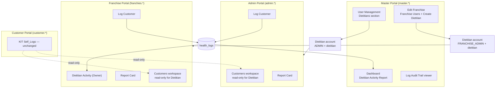
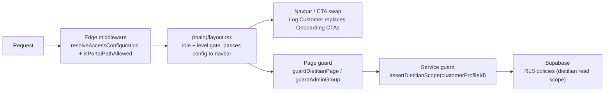
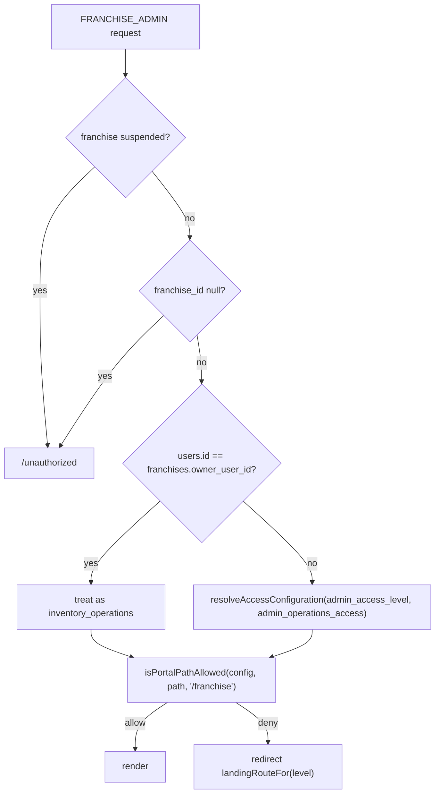
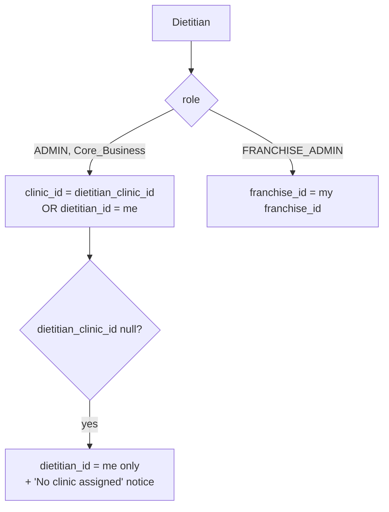
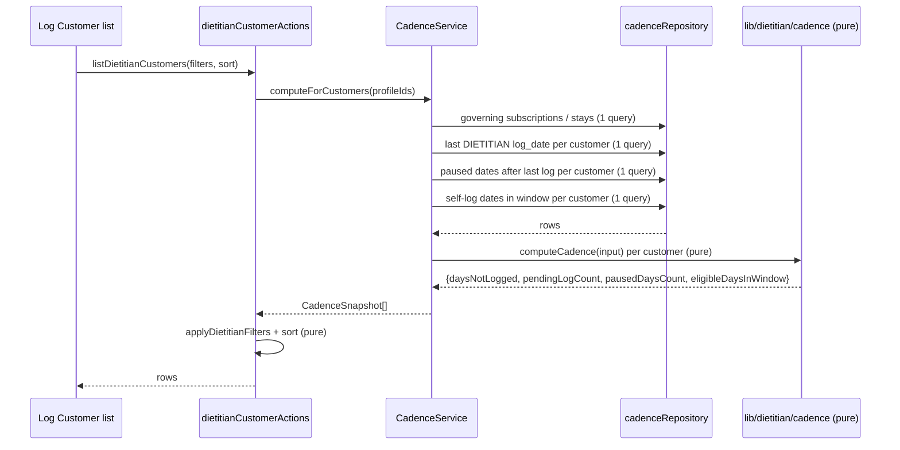

# Design Document

## Overview

This feature adds a **Dietitian** to ArogyaDiet as a fourth `admin_access_level` (`dietitian`) layered on the two existing roles that already own a portal — `ADMIN` (Core_Business, admin portal) and `FRANCHISE_ADMIN` (Franchise, franchise portal). No new role code is introduced, so the existing subdomain role gate and the franchise RLS boundary (`is_global_role()` / `current_franchise_id()`) apply to Dietitians without modification.

The design extends existing primitives instead of adding parallel ones:

- **Access model** — `src/lib/auth/adminAccessCore.ts` already centralises access levels, path classification, the path gate and landing-route resolution as *pure, edge-safe, role-neutral* functions. `dietitian` is added there as a fourth level with an allow-list path gate and `/customers` as its landing route. The `admin-access-control` design already declared these primitives role-neutral for exactly this reuse, so applying the same gate to franchise routes (Requirement 21.5) is a wiring change, not a model change.
- **Health data** — a new `health_logs` table becomes the single write target for Dietitian_Logs, while the three existing log tables (`admin_health_logs`, `customer_health_logs`, `kit_daily_logs`) are left untouched and surfaced through a read-only SQL view. Nothing is migrated out of them, so Accommodation health logging and the Customer_Portal KIT tracker keep working byte-for-byte.
- **Cadence** — the "how overdue is this dietitian" question gets exactly one implementation: a pure module (`src/lib/dietitian/cadence.ts`) over plain date strings, consumed by the Log Customer list, the dietitian filters, the Report_Card and both activity reports. Requirements 14, 17, 19, 20 and 24 all resolve to that one function, which is why 24.6 (master and franchise report agreement) is a consequence of the architecture rather than a thing to test twice.
- **Layering** — pure logic in `src/lib/dietitian/*`, Zod schemas in `src/validations/`, data access in `src/repositories/dietitian/*`, business rules in `src/services/*`, `"use server"` wrappers in `src/actions/*`, Server Components by default with client leaves for the log form and the filter bar. This mirrors `core-clinic-architecture` and `kit-lifecycle-management`.

### Goals

- One governed provisioning path for Dietitian accounts, in the Master_Portal, with clinic assignment, franchise cardinality and audit logging enforced at both the application and database layers.
- A strictly read-only, scope-limited customer workspace for Dietitians in the portal their organisation already uses.
- A single Health_Log model that supports a fixed field set per Customer_Category plus operator-defined Custom_Parameters with no schema change.
- One Cadence_Engine feeding every pending/overdue number in the product.
- An append-only audit trail covering accepted **and** rejected write attempts.
- A purely additive, idempotent rollout: every non-`dietitian` access level behaves exactly as before.

### Non-Goals

- No change to Customer_Portal behaviour. Self_Log capture (`kit_daily_logs`, `customer_health_logs`) is read by Dietitians and never written by them.
- No migration or rewrite of `admin_health_logs` / `customer_health_logs` / `kit_daily_logs`. They stay authoritative for their existing flows.
- No new role code, no change to the subdomain map, no Zone concepts (the pincode architecture is untouched).
- No Dietitian write access to any operational entity (customers, addresses, subscriptions, payments, shop orders, onboarding).
- No per-group (`admin_operations_access`) configuration for Dietitians — `dietitian` resolves to an empty operations-group map.

### Key design decisions

| Decision | Rationale |
|---|---|
| `dietitian` as a 4th `admin_access_level`, not a new role | Requirement assumption 3. The `admin`/`franchies` subdomain role gates and franchise RLS already work; a new role code would need new policies on every table. |
| Dietitian_Clinic_Link as `users.dietitian_clinic_id`, not a join table | The link is 0..1 per Dietitian. A column lets the franchise cardinality rule (Req 10.2, 10.5) be a single partial unique index on `users(franchise_id)`, which is also what makes concurrent creates safe (Req 2.12) without advisory locks. |
| Dietitian_Link as `customer_profiles.dietitian_id` | 0..1 per Customer_Record (Req 6.1). `ON DELETE SET NULL` gives Req 6.5 for free and makes the write idempotent (Req 6.6) and round-tripping (Req 6.7) by construction. |
| New `health_logs` table + read-only union view over the legacy tables | Req 26.3/26.4 require retention *and* exposure. A view avoids a data migration, so rollback is `DROP VIEW`. |
| Parameter values in a single `parameters` JSONB, absent key = no value | Req 11.5 (all-empty accepted), 11.12/11.13 (unit stored iff value present) and 11.14 (round-trip) all fall out of "absent key means absent value and absent unit". A 28-column table would need 28 nullable unit columns to express the same thing. |
| Dietitian **reads** go through the SSR client (`createClient`), writes through the service-role client after a service-layer scope assertion | Service-role bypasses RLS. Routing dietitian reads through the anon-key SSR client is what makes the RLS policies of Req 5.7 actually load-bearing rather than decorative. |
| Audit-trail immutability enforced by a trigger, not only RLS | Every server action uses the service-role key, which bypasses RLS. A `BEFORE UPDATE OR DELETE` trigger is the only enforcement that also binds the admin client (Req 18.7). |
| Dietitian actions live in a new `src/actions/dietitian-actions/` folder | Both the admin and franchise portals call the same logging flow. `admin-actions` must not be called from the franchise portal, and duplicating the flow into `franchise-actions` would break the single-Cadence_Engine guarantee (Req 23.4, 24.6) and Req 23.7. |
| Seeding is split: DDL in SQL, the four accounts in an idempotent Node seed script | Supabase Auth identities cannot be created from SQL without writing into `auth.users` directly. The seed script uses the Admin API, mirroring `createAdminUser`, and skips-and-reports existing email/mobile rows (Req 4.6). |

## Architecture

### Where a Dietitian lives



### Access resolution and enforcement layers



Route layers gate **reachability**, the service layer gates **mutations and cross-scope reads**, RLS is the backstop for anything that reaches the database on the anon key. Navigation/CTA changes are cosmetic only — a Dietitian who hand-crafts a URL is stopped by the middleware allow-list, and a Dietitian who hand-crafts an action call is stopped by `assertDietitianScope`.

### Access-level model after this feature

| Access_Level | Areas | Operations groups | Landing route | Reachable prefixes |
|---|---|---|---|---|
| `inventory` | inventory | `{}` | `/inventory` | unchanged |
| `operations` | operations | configured | `/dashboard` | unchanged |
| `inventory_operations` | both | `{}` (implicit full) | `/dashboard` | unchanged |
| `dietitian` | none | `{}` | `/customers` | `/customers`, `/log-customer`, `/profile` |

`dietitian` is an **allow-list** level: `isPortalPathAllowed` short-circuits before area/group classification and permits only the three prefixes above (matched at a path-segment boundary, case-sensitive, consistent with the existing matcher). The Report_Card lives at `/customers/[id]/report-card`, so it is covered by the `customers` prefix (Req 5.4). Everything else redirects to `landingRouteFor("dietitian")` = `/customers`.

### Portal-neutral path gate

The existing classifiers are hard-coded to the rewritten `/admin/...` base. They are generalised by normalising the portal base before classification:

```ts
export type PortalBase = "/admin" | "/franchise";

/** Rewrites `/franchise/customers` → `/admin/customers` so one classifier serves both portals. */
function toCanonicalPath(pathname: string, base: PortalBase): string;

/** Portal-aware gate. `isAdminPathAllowed(config, path)` becomes a thin wrapper with base "/admin". */
export function isPortalPathAllowed(
  config: AccessConfiguration,
  pathname: unknown,
  base?: PortalBase,
): boolean;
```

This is what gives Requirement 21.5 (same Access_Level gate on franchise routes) without a second copy of the group/prefix tables, and keeps the "franchise portal imports nothing from `src/app/admin`" rule (Req 23.7) intact — the shared code lives in `src/lib` and `src/shared`.

### Franchise portal becomes multi-user

Today the franchise portal admits any `FRANCHISE_ADMIN` with a franchise and an unsuspended status. This feature adds an Access_Level gate on top, with one override:



The owner override (Req 21.6) is resolved in the same query the franchise layout already runs, by selecting `franchises.owner_user_id` alongside `franchises.status`.

### Dietitian read scope



A Core_Business Dietitian with no Clinic sees only explicitly-linked Customer_Records (Req 4.4 as reconciled) — the predicate degenerates to the `dietitian_id = me` disjunct rather than widening. This is expressed once as a pure predicate and once as an RLS policy, deliberately mirrored the way `scopePermits` mirrors the franchise RLS clause today.

### Cadence flow



Four batched queries regardless of list size, then pure computation — the same shape the dashboard metrics services use. Filtering and sorting are pure functions over the assembled rows so Requirement 17's conjunction, monotonicity and permutation guarantees are testable without a database.

## Components and Interfaces

### 1. Access model — `src/lib/auth/adminAccessCore.ts` (extended, pure)

```ts
export const ADMIN_ACCESS_LEVELS = [
  "inventory",
  "operations",
  "inventory_operations",
  "dietitian",
] as const;

export const DIETITIAN_ACCESS_LEVEL = "dietitian" as const;

/** Prefixes a Dietitian may reach, relative to the canonical /admin base. */
export const DIETITIAN_ALLOWED_PREFIXES = [
  "/admin/customers",
  "/admin/log-customer",
  "/admin/profile",
] as const;

export function isDietitianLevel(
  levelOrConfig: AdminAccessLevel | AccessConfiguration,
): boolean;

/** dietitian → "/customers"; existing levels unchanged. */
export function landingRouteFor(
  level: AdminAccessLevel,
): "/dashboard" | "/inventory" | "/customers";

export function isPortalPathAllowed(
  config: AccessConfiguration,
  pathname: unknown,
  base?: PortalBase,
): boolean;
```

Preserved invariants: `resolveAccessLevel` still coerces NULL/unknown/non-string to `inventory_operations` (Req 1.4); `resolveAccessConfiguration` still populates `groups` only for `operations`, so `dietitian` resolves to `{}` (Req 1.5); `canAccess("dietitian", area)` is `false` for both areas, and every existing level's truth table is byte-identical (Req 26.5, 26.6).

### 2. Server-side guards — `src/lib/auth/adminAccess.ts` (extended)

```ts
export interface DietitianContext {
  userId: string;          // users.id
  roleCode: "ADMIN" | "FRANCHISE_ADMIN";
  clinicId: string | null; // users.dietitian_clinic_id
  franchiseId: string | null;
}

/** Redirect-style page guard: non-Dietitian → /unauthorized. */
export async function guardDietitianPage(): Promise<DietitianContext>;

/** Result-style guard used by every dietitian action. */
export async function checkDietitianScope(
  customerProfileId: string,
): Promise<{ ok: true; ctx: DietitianContext } | { ok: false; error: string }>;
```

`checkDietitianScope` returns the exact message `Customer is not in your scope` on a scope miss (Req 5.9) and is the single choke point for Req 5.8/5.10 and 16.5.

### 3. Cadence_Engine — `src/lib/dietitian/cadence.ts` (pure)

```ts
export type CustomerCategory = "MEAL" | "KIT" | "ACCOMMODATION";

export const CADENCE_INTERVALS: Record<CustomerCategory, number> = {
  ACCOMMODATION: 1,
  MEAL: 3,
  KIT: 3,
};

export function cadenceIntervalFor(category: CustomerCategory): number;

export interface CadenceInput {
  category: CustomerCategory;
  /** Logging_Window start, YYYY-MM-DD (subscription starts_on or stay start_date). */
  windowStart: string;
  /** Logging_Window end before clamping, YYYY-MM-DD. */
  windowEnd: string;
  /** Current IST calendar date, YYYY-MM-DD (injected, never read from the clock). */
  today: string;
  /** Paused IST dates for the governing subscription. */
  pausedDates: readonly string[];
  /** Most recent DIETITIAN log_date, or null when none exists. */
  lastDietitianLogDate: string | null;
  /** Governing subscription status; anything other than ACTIVE zeroes the counts. */
  subscriptionStatus: string;
}

export interface CadenceSnapshot {
  cadenceInterval: number;
  /** windowStart − 1 day when lastDietitianLogDate is null (Req 14.6). */
  effectiveLastLogDate: string;
  daysNotLogged: number;
  pendingLogCount: number;
  pausedDaysCount: number;
  eligibleDaysInWindow: number;
}

export function computeCadence(input: CadenceInput): CadenceSnapshot;
```

Rules encoded: window end is `min(windowEnd, today)`; an Eligible_Day is a date in the window that is not paused; `daysNotLogged` counts Eligible_Days strictly after `effectiveLastLogDate` through `today`; `pendingLogCount = floor(daysNotLogged / cadenceInterval)`; a non-`ACTIVE` subscription yields zeros. Every date is a `YYYY-MM-DD` string compared lexicographically, and `today` is supplied by the caller via `getISTDateString()` — so the module is deterministic and IST correctness lives in one already-tested place (`src/lib/dates/ist.ts`, Req 14.14).

### 4. Field sets — `src/lib/dietitian/fieldSets.ts` (pure)

```ts
export type FieldKind = "number" | "boolean" | "enum" | "text" | "bp";

export interface FieldDefinition {
  key: string;            // stable storage key, e.g. "weight"
  label: string;          // UI label, e.g. "Weight"
  kind: FieldKind;
  unit?: string;          // persisted alongside the value when a value is present
  min?: number;
  max?: number;
  options?: readonly string[]; // enum only
  /** Excluded from the MEAL/KIT set. */
  accommodationOnly?: boolean;
}

export const HEALTH_LOG_FIELDS: readonly FieldDefinition[];        // 28 entries
export const ACCOMMODATION_FIELD_SET: readonly FieldDefinition[];  // 28
export const MEAL_KIT_FIELD_SET: readonly FieldDefinition[];       // 22

export function fieldSetFor(category: CustomerCategory): readonly FieldDefinition[];
export function fieldByKey(key: string): FieldDefinition | undefined;
```

`MEAL_KIT_FIELD_SET` is *derived* as `HEALTH_LOG_FIELDS.filter(f => !f.accommodationOnly)`, so the 28/22 relationship of Req 11.2 is structural rather than a second hand-maintained list.

| # | key | kind | unit | range | ACC only |
|---|---|---|---|---|---|
| 1 | `weight` | number | kg | 20–300 | |
| 2 | `bp` | bp | mmHg | sys 60–250, dia 40–150 | |
| 3 | `bp_medication_in_use` | boolean | | | |
| 4 | `fasting_sugar` | number | mg/dL | 30–600 | |
| 5 | `pbs` | number | mg/dL | 30–600 | |
| 6 | `insulin_units` | number | units | 0–1000 † | |
| 7 | `fat_content_taken` | number | ml | 0–5000 † | |
| 8 | `buttermilk_content` | number | litre | 0–20 † | |
| 9 | `soup` | number | litre | 0–20 † | |
| 10 | `multivitamin` | boolean | | | |
| 11 | `omega` | boolean | | | |
| 12 | `ayurcalvita` | boolean | | | |
| 13 | `pcod` | boolean | | | |
| 14 | `meal_type` | enum | | Veg / Non-veg / Eggetarian | |
| 15 | `triglycerides_soup` | boolean | | | |
| 16 | `vegetable_juice` | boolean | | | |
| 17 | `walk` | boolean | | | |
| 18 | `step_count` | number | steps | 0–100000 | |
| 19 | `yoga` | boolean | | | ✓ |
| 20 | `zumba` | boolean | | | ✓ |
| 21 | `water_intake` | number | litres | 0–15 | |
| 22 | `sleep` | number | hrs | 0–24 | |
| 23 | `panchakarma` | boolean | | | ✓ |
| 24 | `physiotherapy` | boolean | | | ✓ |
| 25 | `evening_activities` | boolean | | | ✓ |
| 26 | `remarks_activity_description` | text | | ≤ 1000 chars | ✓ |
| 27 | `dietitian_doctor_remarks` | text | | ≤ 2000 chars | |
| 28 | `any_emergency_medication` | text | | ≤ 1000 chars | |

† Requirements 11.6–11.10 specify ranges for Weight, BP, Fasting Sugar, PBS, Step count, Water Intake and Sleep only. The marked bounds are **design decisions** chosen as generous physiological sanity limits; they exist so no numeric field accepts unbounded or negative input, and they are declared in one table so the operator can revise them without touching validation code. Text lengths are likewise design decisions.

### 5. Custom_Parameters — `src/lib/dietitian/customParameters.ts` (pure)

```ts
export interface CustomParameter { label: string; value: string; unit: string }

export const MAX_CUSTOM_PARAMETERS = 20;

export type CustomParameterValidation =
  | { ok: true; value: CustomParameter[] }
  | { ok: false; error: string };

/** Trims, enforces lengths/count, rejects empty and case-insensitively duplicate labels. */
export function validateCustomParameters(raw: unknown): CustomParameterValidation;

/** JSONB round-trip helpers — order-preserving. */
export function serializeCustomParameters(list: readonly CustomParameter[]): unknown;
export function deserializeCustomParameters(raw: unknown): CustomParameter[];
```

Messages returned verbatim: `Custom parameter label is required` (Req 12.4) and `Custom parameter labels must be unique` (Req 12.5).

### 6. Dietitian scope predicate — `src/lib/dietitian/scope.ts` (pure)

```ts
export type DietitianScope =
  | { kind: "core"; dietitianUserId: string; clinicId: string | null }
  | { kind: "franchise"; dietitianUserId: string; franchiseId: string };

export interface ScopableCustomer {
  clinic_id: string | null;
  franchise_id: string | null;
  dietitian_id: string | null;
}

/** Mirrors the RLS policy predicate exactly. */
export function dietitianCanRead(scope: DietitianScope, customer: ScopableCustomer): boolean;

/** Applies the scope to a Supabase query builder (.eq / .or). */
export function applyDietitianScope<Q>(query: Q, scope: DietitianScope): Q;
```

### 7. List filters and sorting — `src/lib/dietitian/listFilters.ts` (pure)

```ts
export interface DietitianCustomerRow {
  customerProfileId: string;
  customerCode: string | null;
  name: string;
  mobile: string | null;
  category: CustomerCategory;
  assignedDietitianName: string | null;
  lastDietitianLogDate: string | null;
  daysNotLogged: number;
  pendingLogCount: number;
  pausedDaysCount: number;
  skippedSelfLogCount: number;
  datesWithoutSelfLogCount: number;
}

export interface DietitianFilters {
  search?: string;                 // name | mobile | customer code
  missingSelfLog?: boolean;        // datesWithoutSelfLogCount > 0
  pendingOnly?: boolean;           // pendingLogCount > 0
  minDaysNotLogged?: number;       // daysNotLogged >= n
}

export type DietitianSortKey = "lastDietitianLogDate" | "daysNotLogged";
export type SortDirection = "asc" | "desc";

export function applyDietitianFilters(
  rows: readonly DietitianCustomerRow[],
  filters: DietitianFilters,
): DietitianCustomerRow[];

/** null lastDietitianLogDate sorts as the earliest orderable value in both directions. */
export function sortDietitianRows(
  rows: readonly DietitianCustomerRow[],
  key: DietitianSortKey,
  direction: SortDirection,
): DietitianCustomerRow[];
```

Filters compose by conjunction (Req 17.7) because each predicate is `&&`-folded over the same row set; sorting is a copy-then-sort so the multiset is preserved (Req 17.9).

### 8. Validation — `src/validations/dietitianSchema.ts`, `src/validations/healthLogSchema.ts`

```ts
// dietitianSchema.ts
export const createDietitianSchema = z.object({
  fullName: z.string().trim().min(1),
  email: z.string().trim().toLowerCase().email(),
  mobile: z.string().regex(/^\d{10}$/, "Enter a 10-digit mobile number"),
  password: z.string().min(6),
  clinicId: z.string().uuid().nullable(),
});

export const updateDietitianSchema = createDietitianSchema
  .omit({ password: true, email: true })
  .extend({ clinicId: z.string().uuid().nullable() });

export const assignDietitianSchema = z.object({
  customerProfileId: z.string().uuid(),
  dietitianUserId: z.string().uuid().nullable(),
});

// healthLogSchema.ts — built FROM the field set so validation and rendering cannot drift
export function healthLogSchemaFor(category: CustomerCategory): z.ZodType<HealthLogInput>;

export interface HealthLogInput {
  customerProfileId: string;
  logDate: string;                       // YYYY-MM-DD
  parameters: Record<string, ParameterValue>;  // sparse — absent key = no value
  customParameters: CustomParameter[];
  closingComment: string;                // 1..2000
}
```

An empty Mobile number is reported as `Mobile number is required for a dietitian` (Req 2.4) before the digit check, so 2.4 and 2.5 stay distinguishable. Out-of-range parameter errors are rendered from the field table as `{label} must be between {min} and {max} {unit}` (Req 11.11).

### 9. Repositories — `src/repositories/dietitian/`

| Module | Responsibility |
|---|---|
| `dietitianRepository.ts` | List/insert/update Dietitian `users` rows, read `dietitian_clinic_id`, list Clinics with owning Franchise name, count active Dietitians per Franchise, list active Dietitians for a Clinic. |
| `assignmentRepository.ts` | Read/write `customer_profiles.dietitian_id`, verify a candidate user is a Dietitian, clear links on Dietitian delete. |
| `healthLogRepository.ts` | Insert/update `health_logs`, upsert on the `(customer_profile_id, log_date) WHERE author_type='DIETITIAN'` conflict target, read a customer's timeline from the union view, distinct Custom_Parameter labels per customer. |
| `auditRepository.ts` | Append-only insert into `health_log_audit_entries`, reverse-chronological read per customer. |
| `cadenceRepository.ts` | The four batched cadence queries: governing subscription/stay, last dietitian log date, paused dates after a cutoff, self-log dates in window. |

Data access only — no validation, no `"use server"`, mirroring `src/repositories/clinic/`.

### 10. Services

| Service | Responsibility | Requirements |
|---|---|---|
| `DietitianAccountService.ts` | Create/edit/deactivate Dietitians; role + `franchise_id` derivation from the Clinic's `franchise_id`; franchise uniqueness; auth-account compensation on failure; `admin_activity_logs` entries. | 2, 3, 4, 10, 22 |
| `AssignmentService.ts` | Read/write Dietitian_Link, dietitian validity check, clinic-change reconciliation per Customer_Category, audit entry. | 6, 7, 8, 9 |
| `HealthLogService.ts` | Validate + persist Health_Logs, resolve author/timestamp, enforce the edit window and authorship, reject deletes, write the audit entry for accepted **and** rejected attempts. | 11, 12, 13, 15, 18, 25 |
| `CadenceService.ts` | Assemble cadence inputs (batched) and delegate to the pure engine. | 14, 17, 19, 20, 24 |
| `DietitianReportService.ts` (+ `DietitianReportTemplate.tsx`) | Report_Card assembly, trend series, adherence summary, `@react-pdf/renderer` PDF export. | 19 |

`DietitianReportService` follows `KitReportService`: assemble → `renderToBuffer` → return `Buffer`, with a generation timeout.

The atomicity of Dietitian creation (Req 2.14, 22.7) reuses the pattern already proven in `OnboardingService`/`createUnassignedFranchiseAdmin`: resolve the role id first, create the Supabase Auth identity, then write the `users` row; on any post-auth failure delete the auth identity so no partial account is observable. The franchise-uniqueness check is *not* a read-then-write race — the partial unique index rejects the second concurrent insert, and the service maps that constraint violation to `This franchise already has a dietitian` (Req 2.11, 2.12, 10.4).

### 11. Server Actions

| File | Actions |
|---|---|
| `src/actions/master-actions/dietitianActions.ts` | `listDietitians`, `listClinicsForDietitianAssignment`, `createDietitian`, `updateDietitian`, `toggleDietitianActive` |
| `src/actions/master-actions/dietitianActivityActions.ts` | `listActiveDietitians`, `getDietitianActivityReport(dietitianUserId)`, `listHealthLogAuditEntries(customerProfileId)` |
| `src/actions/master-actions/franchiseUserActions.ts` | `listFranchiseUsers(franchiseId)`, `createFranchiseUser`, `createFranchiseDietitian` |
| `src/actions/dietitian-actions/dietitianCustomerActions.ts` | `listDietitianCustomers(filters, sort)`, `getDietitianCustomerDetail(id)`, `getCustomParameterSuggestions(id)` |
| `src/actions/dietitian-actions/healthLogActions.ts` | `submitHealthLog(input)`, `getHealthLogTimeline(customerProfileId)`, `getSelfLogForDate(customerProfileId, date)` |
| `src/actions/dietitian-actions/reportCardActions.ts` | `getReportCard(customerProfileId)`, `exportReportCardPdf(customerProfileId)` |
| `src/actions/admin-actions/dietitianAssignmentActions.ts` | `assignCustomerDietitian(customerProfileId, dietitianUserId \| null)`, `listDietitiansForClinic(clinicId)` |

All return the established `{ success: true, data } | { success: false, error, field? }` shape. `dietitian-actions` are portal-neutral and self-gating via `checkDietitianScope`; `admin-actions/dietitianAssignmentActions` is the admin-only write path used by Customer_360 and is gated by `checkGroupManage("customers")`.

### 12. Shared UI — `src/shared/components/dietitian/`

| Component | Type | Purpose |
|---|---|---|
| `LogCustomerList.tsx` | client | Searchable, filterable, sortable list of in-scope customers with cadence columns (Req 15.3–15.4, 17). |
| `HealthLogForm.tsx` | client | Renders `fieldSetFor(category)`, the Custom_Parameter editor and the Closing_Comment as the final field; submits `submitHealthLog`. |
| `CustomParameterEditor.tsx` | client | Add/remove rows, label suggestions from prior logs (Req 12.9). |
| `SelfLogReferencePanel.tsx` | server-fed | Read-only Self_Log values beside the form for the selected date (Req 25.6); never pre-fills the form (Req 25.7). |
| `HealthLogTimeline.tsx` | server-fed | Single date-ordered timeline labelling author type (Req 25.3), Closing_Comment with author + timestamp (Req 13.5). |
| `SelfLogAdherencePanel.tsx` | server-fed | Self_Logs, skipped count, missing-date count, Paused_Days_Count (Req 16.3/16.4). |
| `DietitianActivityReport.tsx` | client | Shared by the Master dashboard and the Franchise Owner page (Req 20, 24). |
| `ReportCardView.tsx` | client | Parameter table, Recharts trends, adherence summary, comment history, PDF export button (Req 19). |

Placing all of these under `src/shared/components/dietitian/` is what satisfies Requirement 23.7: the franchise portal imports from `src/shared` only, exactly as it already does for `Customer360Dashboard`.

### 13. Pages and existing-surface changes

| Path | Change |
|---|---|
| `src/app/admin/(main)/log-customer/page.tsx` | New. `guardDietitianPage()` then `LogCustomerList`. |
| `src/app/admin/(main)/customers/[id]/report-card/page.tsx` | New. Report_Card for KIT/ACCOMMODATION (Req 19.1). |
| `src/app/franchise/(main)/log-customer/page.tsx` | New. Same shared components. |
| `src/app/franchise/(main)/customers/[id]/report-card/page.tsx` | New. |
| `src/app/franchise/(main)/dietitian-activity/page.tsx` | New. Franchise_Owner activity report (Req 24). |
| `src/app/admin/(main)/layout.tsx` | Dietitian branch: skip the `canAccess(level, "operations")` redirect for `dietitian` (it would otherwise bounce to a path inside the same group), pass `config` to the navbar. |
| `src/app/franchise/(main)/layout.tsx` | Add the owner override + Access_Level gate; pass `config` to `FranchiseNavbar`. |
| `AdminNavbar.tsx` / `FranchiseNavbar.tsx` | Trim to Customers / Log Customer / Profile for Dietitians. |
| `CustomerDashboard.tsx` | Replace the Shop Orders + Onboarding CTAs with Log Customer for a Dietitian; hide create/edit/deactivate/bulk-import controls (Req 16.1). |
| `FranchiseCustomerDashboard.tsx` | Replace Quick Onboard + Create Customer with Log Customer for a Franchise Dietitian; leave other access levels untouched (Req 23.2). |
| `Customer360Dashboard.tsx` | Dietitian dropdown in the Clinic Assignment card (KIT), editable dropdown for ACCOMMODATION, read-only Dietitian text for franchise customers, Health_Log timeline + adherence panel + Report Card action. |
| `QuickOnboardingForm.tsx` | Dietitian dropdown after the address step for MEAL (Core), read-only single Dietitian for franchise sessions. |
| Accommodation onboarding wizard | Dietitian dropdown in the Category & Plan step (Req 9.1). |
| `UserManagement.tsx` | Dietitians section, unassigned-clinic warning banner, `Dietitian` option in the Access Level dropdown with Mobile + Assign Clinic fields. |
| Master Edit Franchise workspace | Franchise Users section, Create Franchise User, Create/Edit Dietitian action. |
| Master dashboard | Dietitian dropdown + activity report. |

## Data Models

### Migration — `scripts/create-dietitian-management.sql` (additive, idempotent)

```sql
-- 1. Access level -------------------------------------------------------------
ALTER TABLE public.users DROP CONSTRAINT IF EXISTS users_admin_access_level_check;
ALTER TABLE public.users ADD CONSTRAINT users_admin_access_level_check
  CHECK (admin_access_level IS NULL OR admin_access_level = ANY (ARRAY[
    'inventory','operations','inventory_operations','dietitian'
  ]));

-- 2. Dietitian_Clinic_Link ----------------------------------------------------
ALTER TABLE public.users
  ADD COLUMN IF NOT EXISTS dietitian_clinic_id uuid
    REFERENCES public.clinics(id) ON DELETE SET NULL;

-- Mobile is mandatory and exactly 10 digits for a Dietitian (Req 2.7).
ALTER TABLE public.users DROP CONSTRAINT IF EXISTS users_dietitian_mobile_check;
ALTER TABLE public.users ADD CONSTRAINT users_dietitian_mobile_check
  CHECK (
    admin_access_level IS DISTINCT FROM 'dietitian'
    OR (mobile IS NOT NULL AND mobile ~ '^[0-9]{10}$')
  );

-- At most one ACTIVE Dietitian per Franchise (Req 10.2, 10.5, 10.6).
-- Core_Business rows (franchise_id IS NULL) are excluded, so a Core Clinic may
-- carry many Dietitians (Req 10.1).
CREATE UNIQUE INDEX IF NOT EXISTS users_one_active_dietitian_per_franchise
  ON public.users (franchise_id)
  WHERE admin_access_level = 'dietitian' AND is_active AND franchise_id IS NOT NULL;

CREATE INDEX IF NOT EXISTS idx_users_dietitian_clinic_id
  ON public.users (dietitian_clinic_id)
  WHERE admin_access_level = 'dietitian';

-- 3. Dietitian_Link -----------------------------------------------------------
ALTER TABLE public.customer_profiles
  ADD COLUMN IF NOT EXISTS dietitian_id uuid
    REFERENCES public.users(id) ON DELETE SET NULL;

CREATE INDEX IF NOT EXISTS idx_customer_profiles_dietitian_id
  ON public.customer_profiles (dietitian_id);

-- 4. Health_Log ---------------------------------------------------------------
CREATE TABLE IF NOT EXISTS public.health_logs (
  id                  uuid PRIMARY KEY DEFAULT gen_random_uuid(),
  customer_profile_id uuid NOT NULL REFERENCES public.customer_profiles(id) ON DELETE CASCADE,
  log_date            date NOT NULL,
  author_type         text NOT NULL CHECK (author_type IN ('DIETITIAN','CUSTOMER')),
  author_user_id      uuid NOT NULL REFERENCES public.users(id),
  customer_category   text NOT NULL CHECK (customer_category IN ('MEAL','KIT','ACCOMMODATION')),
  parameters          jsonb NOT NULL DEFAULT '{}'::jsonb,
  custom_parameters   jsonb NOT NULL DEFAULT '[]'::jsonb,
  closing_comment     text NOT NULL CHECK (char_length(closing_comment) BETWEEN 1 AND 2000),
  submitted_at        timestamptz NOT NULL DEFAULT now(),
  submission_date_ist date NOT NULL,
  clinic_id           uuid REFERENCES public.clinics(id),
  franchise_id        uuid REFERENCES public.franchises(id),
  created_at          timestamptz NOT NULL DEFAULT now(),
  updated_at          timestamptz NOT NULL DEFAULT now()
);

-- At most one Dietitian_Log per Customer_Record per log_date (Req 15.11).
CREATE UNIQUE INDEX IF NOT EXISTS health_logs_one_dietitian_log_per_day
  ON public.health_logs (customer_profile_id, log_date)
  WHERE author_type = 'DIETITIAN';

CREATE INDEX IF NOT EXISTS idx_health_logs_customer_date
  ON public.health_logs (customer_profile_id, log_date DESC);
CREATE INDEX IF NOT EXISTS idx_health_logs_author
  ON public.health_logs (author_user_id, log_date DESC);

-- 5. Log_Audit_Trail (append-only) -------------------------------------------
CREATE TABLE IF NOT EXISTS public.health_log_audit_entries (
  id                  uuid PRIMARY KEY DEFAULT gen_random_uuid(),
  health_log_id       uuid REFERENCES public.health_logs(id) ON DELETE SET NULL,
  customer_profile_id uuid NOT NULL REFERENCES public.customer_profiles(id) ON DELETE CASCADE,
  log_date            date NOT NULL,
  actor_user_id       uuid REFERENCES public.users(id),
  action              text NOT NULL CHECK (action IN ('CREATE','UPDATE','DELETE')),
  outcome             text NOT NULL CHECK (outcome IN ('ACCEPTED','REJECTED')),
  rejection_reason    text,
  changed_values      jsonb,
  created_at          timestamptz NOT NULL DEFAULT now()
);

CREATE INDEX IF NOT EXISTS idx_health_log_audit_customer
  ON public.health_log_audit_entries (customer_profile_id, created_at DESC);

-- Immutability. RLS alone is insufficient because every server action uses the
-- service-role key, which bypasses RLS (Req 18.7).
CREATE OR REPLACE FUNCTION public.reject_audit_mutation()
RETURNS trigger LANGUAGE plpgsql AS $$
BEGIN
  RAISE EXCEPTION 'health_log_audit_entries is append-only';
END;
$$;

DROP TRIGGER IF EXISTS trg_health_log_audit_immutable ON public.health_log_audit_entries;
CREATE TRIGGER trg_health_log_audit_immutable
  BEFORE UPDATE OR DELETE ON public.health_log_audit_entries
  FOR EACH ROW EXECUTE FUNCTION public.reject_audit_mutation();
```

Every statement is `IF NOT EXISTS` / `DROP … IF EXISTS` + recreate, so a second execution leaves the schema and data unchanged (Req 1.3, 26.8).

### Health_Log read model — union view

```sql
CREATE OR REPLACE VIEW public.v_health_log_timeline AS
  -- New Health_Logs
  SELECT h.id, h.customer_profile_id, h.log_date, h.author_type,
         h.author_user_id, 'health_logs'::text AS source,
         h.parameters, h.custom_parameters, h.closing_comment, h.submitted_at
  FROM public.health_logs h
  UNION ALL
  -- Legacy Accommodation admin logs (weight / BP / sugar / notes)
  SELECT a.id, a.customer_profile_id, a.log_date, 'DIETITIAN', NULL,
         'admin_health_logs',
         jsonb_strip_nulls(jsonb_build_object(
           'weight',        CASE WHEN a.weight_kg IS NULL THEN NULL
                                 ELSE jsonb_build_object('value', a.weight_kg, 'unit', 'kg') END,
           'bp',            CASE WHEN a.bp_systolic IS NULL AND a.bp_diastolic IS NULL THEN NULL
                                 ELSE jsonb_build_object('systolic', a.bp_systolic,
                                                         'diastolic', a.bp_diastolic,
                                                         'unit', 'mmHg') END,
           'fasting_sugar', CASE WHEN a.sugar_level_mgdl IS NULL THEN NULL
                                 ELSE jsonb_build_object('value', a.sugar_level_mgdl, 'unit', 'mg/dL') END
         )),
         '[]'::jsonb, a.notes, a.created_at
  FROM public.admin_health_logs a
  UNION ALL
  -- Legacy Accommodation customer logs (water / activity)
  SELECT c.id, c.customer_profile_id, c.log_date, 'CUSTOMER', NULL,
         'customer_health_logs', /* water_intake + activity mapping */ '{}'::jsonb,
         '[]'::jsonb, NULL, c.created_at
  FROM public.customer_health_logs c
  UNION ALL
  -- KIT Self_Logs
  SELECT k.id, s.customer_profile_id, k.log_date, 'CUSTOMER', NULL,
         'kit_daily_logs', /* weight / steps / water / activity mapping */ '{}'::jsonb,
         '[]'::jsonb, NULL, k.created_at
  FROM public.kit_daily_logs k
  JOIN public.subscriptions s ON s.id = k.subscription_id;
```

The view is read-only by construction (`UNION ALL`), which is precisely the guarantee Requirement 25.4 needs: there is no writable path from a Dietitian to a Self_Log. The Self_Log **adherence** panel (Req 16.3) reads `kit_daily_logs` directly, since `status ∈ {FOOD_TAKEN, FOOD_SKIPPED}` only exists there and Req 16.4 zeroes the counts for MEAL and ACCOMMODATION.

### RLS policies

```sql
ALTER TABLE public.health_logs ENABLE ROW LEVEL SECURITY;
ALTER TABLE public.health_log_audit_entries ENABLE ROW LEVEL SECURITY;

-- Helper: is the caller a Dietitian, and what is their Clinic?
CREATE OR REPLACE FUNCTION public.current_dietitian()
RETURNS TABLE (user_id uuid, clinic_id uuid, franchise_id uuid)
LANGUAGE sql STABLE SECURITY DEFINER SET search_path TO 'public' AS $$
  SELECT u.id, u.dietitian_clinic_id, u.franchise_id
  FROM public.users u
  WHERE u.auth_user_id = auth.uid()
    AND u.admin_access_level = 'dietitian'
    AND u.is_active
  LIMIT 1
$$;

-- Readable Customer_Records for a Dietitian (Req 5.5, 5.6, 5.7, 5.11).
CREATE OR REPLACE FUNCTION public.dietitian_can_read_customer(p_profile_id uuid)
RETURNS boolean LANGUAGE sql STABLE SECURITY DEFINER SET search_path TO 'public' AS $$
  SELECT EXISTS (
    SELECT 1
    FROM public.current_dietitian() d
    JOIN public.customer_profiles cp ON cp.id = p_profile_id
    WHERE (d.franchise_id IS NOT NULL AND cp.franchise_id = d.franchise_id)
       OR (d.franchise_id IS NULL AND (
             cp.dietitian_id = d.user_id
             OR (d.clinic_id IS NOT NULL AND cp.clinic_id = d.clinic_id)
           ))
  )
$$;
```

- `customer_profiles`: additive `SELECT` policy `dietitian_can_read_customer(id)`; no new write policy, so Req 5.10 / 16.5 hold at the database layer too.
- `health_logs`: `SELECT` where `is_global_role() OR dietitian_can_read_customer(customer_profile_id)`; `INSERT`/`UPDATE` `WITH CHECK` adds `author_user_id = current_app_user_id() AND author_type = 'DIETITIAN'`; **no `DELETE` policy** (Req 18.4 at the data layer).
- `health_log_audit_entries`: `SELECT` for `is_global_role()`; `INSERT` for the service role; no `UPDATE`/`DELETE` policy, plus the immutability trigger.

Franchise-scoped rows keep working through the existing `is_global_role()` / `current_franchise_id()` predicates, so a Franchise Dietitian is confined to its tenant by the same mechanism that already confines the Franchise Owner (Req 21.8, 21.11).

### TypeScript types — `src/types/dietitian.ts`

```ts
export interface DietitianAccount {
  id: string;                    // users.id
  authUserId: string;
  fullName: string;
  email: string;
  mobile: string;                // exactly 10 digits
  roleCode: "ADMIN" | "FRANCHISE_ADMIN";
  clinicId: string | null;
  clinicName: string | null;
  franchiseId: string | null;
  franchiseName: string | null;
  isActive: boolean;
  createdAt: string;
}

export type ParameterValue =
  | { value: number; unit: string | null }
  | { value: boolean }
  | { value: string }
  | { systolic: number; diastolic: number; unit: "mmHg" };

export interface HealthLog {
  id: string;
  customerProfileId: string;
  logDate: string;
  authorType: "DIETITIAN" | "CUSTOMER";
  authorUserId: string | null;
  authorName: string | null;
  category: CustomerCategory;
  parameters: Record<string, ParameterValue>;
  customParameters: CustomParameter[];
  closingComment: string | null;
  submittedAt: string;
  submissionDateIst: string;
  source: "health_logs" | "admin_health_logs" | "customer_health_logs" | "kit_daily_logs";
}

export interface AuditEntry {
  id: string;
  healthLogId: string | null;
  customerProfileId: string;
  logDate: string;
  actorUserId: string | null;
  actorName: string | null;
  action: "CREATE" | "UPDATE" | "DELETE";
  outcome: "ACCEPTED" | "REJECTED";
  rejectionReason: string | null;
  changedValues: Record<string, unknown> | null;
  createdAt: string;
}

export interface DietitianActivitySummary {
  dietitianUserId: string;
  dietitianName: string;
  clinicName: string | null;
  customersWithPendingLogs: number;
  maxDaysNotLogged: number;
  customersMissingSelfLog: number;
  rows: DietitianCustomerRow[];
}
```

### Seed routine — `scripts/seed-dietitians.mjs`

Run once with the service-role key. For each of the four Dietitians (`Avinash`/`9154850031`, `Nandini`/`9154850030`, `Divya`/`9154850029`, `Joshitha`/`9059410172`): if a `users` row already carries that email or mobile, skip it and report the skip (Req 4.6); otherwise create the Supabase Auth identity and insert `users` with role `ADMIN`, `admin_access_level = 'dietitian'`, `franchise_id = NULL`, `dietitian_clinic_id = NULL`, `is_active = true`, `force_password_change = true` (Req 4.1–4.3). Re-running is a no-op because the second pass finds every row (Req 1.3, 26.8).

### Clinic-change reconciliation (Req 8.4–8.6)

| Customer_Category | Clinic changes → Dietitian_Link |
|---|---|
| `KIT` | New Clinic has exactly one active Dietitian → set to that Dietitian. Existing link not on the new Clinic → set to empty. Otherwise unchanged. |
| `MEAL` | Unchanged. |
| `ACCOMMODATION` | Unchanged. |

This reconciliation lives in `AssignmentService.reconcileOnClinicChange(profileId, category, newClinicId)` and is invoked from the existing `adminAssignCustomerClinic` action, so there is a single place where a clinic change can touch a Dietitian_Link.

## Correctness Properties

*A property is a characteristic or behavior that should hold true across all valid executions of a system — essentially, a formal statement about what the system should do. Properties serve as the bridge between human-readable specifications and machine-verifiable correctness guarantees.*

The 250-odd acceptance criteria were classified individually and then consolidated: criteria that are two branches of one total function, or where one criterion logically implies another, collapse into a single property. Infrastructure checks (migration idempotence, RLS enforcement on a live database, Supabase Auth ban behaviour, audit-trail trigger immutability), architectural reuse claims and PDF generation are covered by integration and smoke tests instead — see Testing Strategy.

### Property 1: Access_Level resolution round-trips and defaults safely

*For any* raw `admin_access_level` value — a recognised level, an unrecognised string, `null`, or a non-string — `resolveAccessLevel` returns that value unchanged when it is recognised and `inventory_operations` otherwise; and *for all* recognised levels, resolving a persisted level then persisting the resolved level yields the original stored value. *For any* raw operations-group payload, `resolveAccessConfiguration` yields an empty group map for every level other than `operations`, including `dietitian`.

**Validates: Requirements 1.1, 1.4, 1.5, 1.6**

### Property 2: The portal path gate is total, allow-listed for Dietitians, and unchanged for every other level

*For any* combination of role code, resolved access configuration, portal base (`/admin` or `/franchise`) and arbitrary path string, the gate returns exactly one decision: a Dietitian is permitted iff the path matches one of the Dietitian allow-list prefixes at a path-segment boundary, a Dietitian on a portal that does not match its role is redirected to `/unauthorized`, a denied Dietitian is redirected to `landingRouteFor("dietitian")`, and for every pre-existing access level the decision is identical to the pre-feature decision regardless of the portal base. A Franchise user whose `franchise_id` is empty, or whose Franchise status is `suspended`, is redirected to `/unauthorized`.

**Validates: Requirements 5.1, 5.2, 5.3, 5.4, 21.5, 21.7, 21.9, 21.10, 26.5, 26.6**

### Property 3: Dietitian read scope is sound — no record outside the scope predicate is ever readable

*For any* Dietitian scope (core with a Clinic, core without a Clinic, or franchise) and *any* set of Customer_Records, the readable set equals exactly the records satisfying that scope's predicate: franchise scope matches on `franchise_id`; core scope matches on `clinic_id` equal to the Dietitian's Clinic or on `dietitian_id` equal to the Dietitian; a core Dietitian with no Clinic reads only explicitly linked records. The same predicate governs Health_Log and Self_Log reads and Health_Log writes, and an out-of-scope submission is rejected with `Customer is not in your scope`.

**Validates: Requirements 4.4, 5.5, 5.6, 5.8, 5.9, 5.11, 21.8, 21.11, 22.8, 25.1, 25.2**

### Property 4: Every operational write is denied to a Dietitian

*For any* Dietitian caller and *any* guarded write operation over the enumerated set — Customer_Record, address, subscription, payment, shop order, onboarding, Self_Log, and franchise-user create/edit/delete — the operation is rejected with an authorization error and leaves the stored state unchanged.

**Validates: Requirements 5.10, 16.5, 21.4, 25.4**

### Property 5: Dietitian account fields are derived from the assigned Clinic

*For any* Clinic, creating or reassigning a Dietitian for that Clinic yields role `ADMIN` with `franchise_id` NULL when the Clinic's `franchise_id` is NULL, and role `FRANCHISE_ADMIN` with `franchise_id` equal to the Clinic's `franchise_id` otherwise; in both cases the stored Dietitian_Clinic_Link equals the Clinic and an `admin_activity_logs` entry records the acting user, the Dietitian and the Clinic.

**Validates: Requirements 2.9, 2.10, 3.6, 22.3**

### Property 6: At most one active Dietitian per Franchise

*For any* sequence of Dietitian create, reassign, deactivate and reactivate operations across any set of Clinics and Franchises, the resulting state never contains two active Dietitians linked to the same Franchise, every rejected operation returns `This franchise already has a dietitian` and leaves the state unchanged, and Clinics whose `franchise_id` is NULL accept arbitrarily many active Dietitians.

**Validates: Requirements 2.11, 3.7, 10.1, 10.2, 10.3, 10.4, 10.6**

### Property 7: Account and onboarding creation are atomic

*For any* choice of failing step after the authentication account is created, the observable end state contains neither the authentication account nor a `users` row; and *for any* failing step during onboarding, the end state contains neither a Customer_Record nor a Dietitian_Link. On success the Customer_Record and its Dietitian_Link are both present.

**Validates: Requirements 2.14, 7.7, 9.4, 22.7**

### Property 8: Dietitian_Link writes round-trip and are idempotent

*For any* Customer_Record of any Customer_Category and *any* Dietitian_Link value including empty, reading the persisted link and writing the read value back leaves the stored link unchanged, and writing the same value twice produces the same stored state as writing it once. *For any* candidate user that is not a Dietitian, the write is rejected with `Selected user is not a dietitian` and nothing is stored.

**Validates: Requirements 6.2, 6.4, 6.6, 6.7**

### Property 9: Clinical history and links survive every Dietitian lifecycle change

*For any* set of Health_Logs, audit entries and Dietitian_Links belonging to a Dietitian, and *any* sequence of clinic reassignment, deactivation, ban and deletion operations on that Dietitian, the Health_Log and audit-entry multisets are unchanged; links are retained on reassignment and deactivation, and on deletion every referencing link becomes empty while every referencing Customer_Record is retained.

**Validates: Requirements 3.8, 3.10, 6.5**

### Property 10: Dietitian_Link audit entries record both endpoints

*For any* sequence of Dietitian_Link changes on a Customer_Record, the audit trail contains exactly one entry per change, each identifying the acting user, the Customer_Record, the previous Dietitian and the new Dietitian.

**Validates: Requirements 6.8**

### Property 11: Clinic-scoped Dietitian options are complete and exclusive

*For any* mapping of Clinics to Dietitians and *any* resolved Clinic, the offered option list equals exactly the active Dietitians linked to that Clinic, no Dietitian of another Clinic appears, a list of exactly one option is pre-selected, and submitting a Dietitian not linked to the resolved Clinic is rejected with `Selected dietitian does not belong to the resolved clinic`.

**Validates: Requirements 7.1, 7.4, 7.8, 8.2, 8.8**

### Property 12: Unscoped Dietitian and Clinic option lists are complete and correctly labelled

*For any* set of Clinics, the Clinic option list contains every Clinic and shows the owning Franchise name exactly for Clinics whose `franchise_id` is set; and *for any* set of Dietitians, the clinic-independent Dietitian option list contains exactly the active Dietitians, each labelled with its assigned Clinic name or `Unassigned`. *For any* set of Dietitians, the Master warning banner appears iff at least one Dietitian has no Clinic and names exactly those Dietitians.

**Validates: Requirements 2.3, 3.3, 3.4, 3.5, 4.5, 9.2, 9.5, 20.1**

### Property 13: Clinic changes reconcile the Dietitian_Link by Customer_Category

*For any* Customer_Category, current Dietitian_Link and (old Clinic, new Clinic) pair, changing the assigned Clinic sets the link to the new Clinic's sole active Dietitian when the category is `KIT` and exactly one exists, empties the link when the category is `KIT` and the existing link is not linked to the new Clinic, and leaves the link unchanged for `MEAL` and `ACCOMMODATION`. In an onboarding form, a previously selected Dietitian survives a Clinic change iff that Dietitian is linked to the new Clinic.

**Validates: Requirements 7.3, 8.4, 8.5, 8.6**

### Property 14: Dietitians are partitioned out of the Admin Users list

*For any* set of `users` rows, the Master User Management page renders each row in exactly one of the Dietitians section or the Admin Users section, and a row appears in the Dietitians section iff its Access_Level is `dietitian`.

**Validates: Requirements 3.1, 3.2**

### Property 15: The rendered field set matches the Customer_Category

*For any* Customer_Category, the log form renders exactly the parameters of that category's field set — 28 for `ACCOMMODATION`, the same set minus the six activity-specific parameters for `MEAL` and `KIT` — with the Closing_Comment as the final field and no parameter from outside the set.

**Validates: Requirements 11.3, 11.4, 13.1**

### Property 16: Parameter range validation rejects out-of-range values and names the range

*For any* parameter in the field set and *any* submitted value, the submission is accepted iff every provided value lies within that parameter's validated range, and a rejection message names the offending parameter and both of its bounds. A submission in which every parameter except the Closing_Comment is empty is accepted.

**Validates: Requirements 11.5, 11.6, 11.7, 11.8, 11.9, 11.10, 11.11**

### Property 17: Health_Log persistence round-trips, with units present exactly when values are

*For any* valid Health_Log, persisting it and then reading it yields equal parameter values, equal units, an equal ordered Custom_Parameter list and an equal Closing_Comment, together with the authoring user identifier, author type and submission timestamp; a unit is stored for a numeric parameter iff that parameter carries a value.

**Validates: Requirements 11.12, 11.13, 11.14, 12.2, 13.4, 15.12**

### Property 18: Custom_Parameter lists validate and serialize round-trip

*For any* list of Custom_Parameters, serializing then deserializing yields an equal list in the same order; and the list is accepted iff it has at most 20 entries, every label is 1–60 characters after trimming, every value is 1–200 characters, every unit is 0–20 characters, and no two labels are equal after trimming and case folding — rejections returning `Custom parameter label is required` for an empty label and `Custom parameter labels must be unique` for a duplicate.

**Validates: Requirements 12.3, 12.4, 12.5, 12.6, 12.8**

### Property 19: The Closing_Comment is mandatory and length-bounded

*For any* submitted Closing_Comment, the submission is accepted iff the trimmed comment is 1–2000 characters, and an empty or whitespace-only comment is rejected with `A closing comment is required`.

**Validates: Requirements 13.2, 13.3**

### Property 20: The Cadence_Engine agrees with a naive day-by-day reference model

*For any* Customer_Category, Logging_Window, current IST date, set of Paused_Days, Last_Dietitian_Log_Date (including none) and subscription status, `computeCadence` produces the same Cadence_Interval, Days_Not_Logged, Pending_Log_Count and Paused_Days_Count as a reference implementation that enumerates the window day by day; and the results satisfy: Days_Not_Logged is between 0 and the count of Eligible_Days in the window, Pending_Log_Count equals `floor(Days_Not_Logged / Cadence_Interval)` and is greater than 0 iff Days_Not_Logged is at least the Cadence_Interval, a non-`ACTIVE` status yields zeros, a log dated today yields zeros, and no Paused_Day contributes to Days_Not_Logged.

**Validates: Requirements 14.1, 14.2, 14.3, 14.4, 14.5, 14.6, 14.7, 14.8, 14.9, 14.10, 14.12, 14.13, 19.9**

### Property 21: Pausing an Eligible_Day never increases Days_Not_Logged

*For any* cadence input and *any* Eligible_Day within its window, converting that day into a Paused_Day yields a Days_Not_Logged value less than or equal to the original.

**Validates: Requirements 14.11**

### Property 22: The Health_Log write gate enforces one log per day, the edit window, authorship and no deletion

*For any* sequence of Health_Log submissions and delete attempts over a Customer_Record, the persisted state never contains more than one Dietitian_Log per log date; a resubmission by the same Dietitian for an existing log date updates that log rather than creating a second one; a create on a Paused_Day is rejected with `The selected date is paused for this customer` while an update to an existing log on a date that has since become paused is permitted; an update is permitted iff the current IST date equals the log's submission date, otherwise rejected with `This log can no longer be edited`; an update by a different Dietitian is rejected with `You can only edit your own logs`; a log date after the current IST date is rejected with `Log date cannot be in the future`; a missing author identifier or timestamp is rejected with `Could not identify the author of this log`; and every delete attempt is rejected with `Health logs cannot be deleted` leaving the state unchanged.

**Validates: Requirements 15.7, 15.8, 15.9, 15.10, 15.11, 15.13, 18.1, 18.2, 18.3, 18.4**

### Property 23: The audit trail accounts for every write attempt

*For any* sequence of Health_Log create and update attempts, the number of audit entries equals the number of attempted operations; the number of entries whose outcome is `ACCEPTED` equals the number of persisted Health_Log versions; every accepted entry records the acting user, action, timestamp, Customer_Record, log date and changed parameter values; every rejected entry additionally records the rejection reason; and the rendered Master view lists entries in reverse chronological order with each entry's outcome.

**Validates: Requirements 18.5, 18.6, 18.8, 18.9, 18.10**

### Property 24: Selectable log dates are the Eligible_Days of the trailing 7 days

*For any* Logging_Window, set of Paused_Days and current IST date, the set of log dates the form offers equals the Eligible_Days that fall within the trailing 7 days up to and including the current IST date.

**Validates: Requirements 15.6**

### Property 25: The Dietitian customer list shows exactly the in-scope rows with their cadence values, and search matches any of three fields

*For any* set of Customer_Records in scope and *any* search query, the rendered list contains exactly the records whose name, mobile or customer code matches the query, and every rendered row carries that record's name, mobile, Customer_Category, Last_Dietitian_Log_Date, Days_Not_Logged, Pending_Log_Count and assigned Dietitian name.

**Validates: Requirements 15.3, 15.4, 16.6**

### Property 26: Filters compose by conjunction and never grow the result

*For any* set of rows and *any* combination of the missing-Self_Log, pending-logs and minimum-days filters, the displayed rows equal the intersection of the rows each active filter would select individually, and the displayed row count is less than or equal to the unfiltered count.

**Validates: Requirements 17.1, 17.2, 17.3, 17.7, 17.8**

### Property 27: Sorting orders correctly, treats a missing last-log date as earliest, and preserves the multiset

*For any* set of rows, *any* sort key and *any* direction, the output is ordered by that key in that direction, rows with no Last_Dietitian_Log_Date are placed as the earliest orderable value in every ordering including the default, and the output is a permutation of the input.

**Validates: Requirements 17.4, 17.5, 17.6, 17.9**

### Property 28: The read-only workspace renders the customer's data and adherence numbers, with all mutating controls removed

*For any* Customer_Record and *any* Access_Level, the Customers workspace renders the profile, addresses, governing subscription summary and Health_Log history; the Self_Log adherence panel shows the Self_Log list, Skipped_Self_Log count, missing-Self_Log-date count and Paused_Days_Count computed for that record, with all three counts zero and the list empty when the Customer_Category is `MEAL` or `ACCOMMODATION`; and every create, edit, deactivate, mutating-export and bulk-import control is absent iff the Access_Level is `dietitian`, while for every other Access_Level the control set is the pre-feature set.

**Validates: Requirements 16.1, 16.2, 16.3, 16.4, 23.1, 23.2**

### Property 29: The Log Customer call to action replaces the onboarding calls to action for Dietitians

*For any* Access_Level, the admin Customers workspace renders the Log Customer call to action and omits the Shop Orders and Onboarding calls to action iff the Access_Level is `dietitian`, and the franchise Customers workspace renders Log Customer and omits Quick Onboard and Create Customer iff the Access_Level is `dietitian`.

**Validates: Requirements 15.1, 15.2, 23.3**

### Property 30: The Health_Log timeline contains every log exactly once, date-ordered and author-labelled

*For any* set of Dietitian_Logs, Self_Logs and legacy `admin_health_logs` / `customer_health_logs` / `kit_daily_logs` rows for a Customer_Record, the timeline contains each of them exactly once, mapped to the correct Customer_Record and log date, in date order, each labelled with its author type, and each Closing_Comment displayed with its author name and submission timestamp.

**Validates: Requirements 12.7, 13.5, 25.3, 26.4**

### Property 31: Self_Logs are reference-only and never leak into a Dietitian_Log

*For any* Self_Log present for the selected log date, the reference panel displays every recorded Self_Log value, every log form field starts empty, and the persisted Health_Log parameters equal exactly the values the Dietitian entered, containing no value derived from the Self_Log.

**Validates: Requirements 25.6, 25.7, 25.8**

### Property 32: The Report_Card contains every recorded value, its trends, adherence numbers and comment history

*For any* Customer_Record with at least one Health_Log, the Report_Card is offered iff the Customer_Category is `KIT` or `ACCOMMODATION`, its parameter table contains every recorded parameter value exactly once in date order, the Weight, BP and Fasting Sugar trend series contain exactly the dated values recorded for those parameters within the Logging_Window, the adherence summary equals the computed count of Dietitian_Logs, Pending_Log_Count, Self_Log count, Skipped_Self_Log count and Paused_Days_Count, and Closing_Comments are listed in reverse chronological order with author names.

**Validates: Requirements 19.1, 19.2, 19.3, 19.4, 19.5**

### Property 33: The Dietitian_Activity_Report aggregates its own per-customer table consistently, in both portals

*For any* Dietitian and *any* set of that Dietitian's linked Customer_Records, the report's count of records with Pending_Log_Count greater than 0 equals the number of such rows in its per-customer table and is less than or equal to the total linked-record count, Max_Days_Not_Logged equals the maximum Days_Not_Logged in that table, the missing-Self_Log count equals the number of rows with at least one window date lacking a Self_Log, every table row carries all seven reported values, and the Franchise-scoped report restricted to a Franchise yields values equal to those the Master report produces for the same Dietitian.

**Validates: Requirements 20.2, 20.3, 20.4, 20.5, 20.9, 20.10, 24.2, 24.6**

### Property 34: Franchise user provisioning derives role and tenant, and the Dietitian action reflects franchise state

*For any* Franchise, a user created through the Create Franchise User action receives role `FRANCHISE_ADMIN` and `franchise_id` equal to that Franchise, the Franchise Users section lists exactly the `users` rows whose `franchise_id` equals the selected Franchise, and the Edit Franchise dialog offers Create Dietitian iff the Franchise has a Clinic and no active Dietitian, and Edit Dietitian iff it already has an active Dietitian.

**Validates: Requirements 21.1, 21.3, 22.5, 22.6**

### Property 35: The Franchise_Owner resolves to full access; other franchise users resolve to their stored level

*For any* Franchise user, the effective access configuration is `inventory_operations` iff that user's id equals `franchises.owner_user_id` for its Franchise, and otherwise equals the configuration resolved from the stored `admin_access_level` and `admin_operations_access`; and access to the Dietitian Activity page is granted iff the effective configuration grants the customers group.

**Validates: Requirements 21.6, 24.3**

### Property 36: The Franchise Portal imports nothing from the Admin Portal

*For all* files under `src/app/franchise`, no import specifier resolves into `src/app/admin`, and every shared logging component import resolves into `src/shared`.

**Validates: Requirements 23.7**

### Property 37: Seeding skips and reports pre-existing Dietitians

*For any* subset of the four seeded Dietitians already present in `users` by email or mobile, running the seed routine leaves those rows unchanged, reports each of them as skipped, and creates exactly the remaining Dietitians.

**Validates: Requirements 4.6**

## Error Handling

### Result convention

Every Server Action returns the shape already used across the codebase:

```ts
type ActionResult<T> =
  | { success: true; data: T }
  | { success: false; error: string; field?: string };
```

Services return discriminated outcomes (`{ ok: true, ... } | { ok: false, reason, message }`) so an action can map a reason to a field-level error without string matching, mirroring `OnboardingService.OnboardOutcome`. Repositories throw on unexpected Supabase errors; services catch, log via `console.error` with the module prefix, and return a non-leaking message.

### Exact messages

Requirements pin the following user-visible strings. They live as exported constants in `src/lib/dietitian/messages.ts` so the tests and the UI reference one definition:

| Message | Raised by | Requirement |
|---|---|---|
| `Mobile number is required for a dietitian` | `dietitianSchema` | 2.4 |
| `Enter a 10-digit mobile number` | `dietitianSchema` | 2.5 |
| `This mobile number is already registered` | `DietitianAccountService` (maps `users_mobile_key`) | 2.6 |
| `This franchise already has a dietitian` | `DietitianAccountService` (maps the partial unique index) | 2.11, 3.7, 10.4 |
| `No clinic assigned. Contact the master admin.` | Dietitian Customers workspace | 4.4 |
| `Customer is not in your scope` | `checkDietitianScope` | 5.9 |
| `Selected user is not a dietitian` | `AssignmentService` | 6.4 |
| `Complete the address to load dietitians` | Onboarding Dietitian dropdown placeholder | 7.2 |
| `No dietitian is assigned to this clinic` | Onboarding Dietitian dropdown | 7.5 |
| `Selected dietitian does not belong to the resolved clinic` | `AssignmentService` | 7.8 |
| `Assign a clinic first` | Customer_360 dropdown placeholder | 8.3 |
| `A closing comment is required` | `healthLogSchema` | 13.2 |
| `Custom parameter label is required` | `validateCustomParameters` | 12.4 |
| `Custom parameter labels must be unique` | `validateCustomParameters` | 12.5 |
| `Log date cannot be in the future` | `HealthLogService` | 15.7 |
| `The selected date is paused for this customer` | `HealthLogService` | 15.8 |
| `Could not identify the author of this log` | `HealthLogService` | 15.13 |
| `This log can no longer be edited` | `HealthLogService` | 18.2 |
| `You can only edit your own logs` | `HealthLogService` | 18.3 |
| `Health logs cannot be deleted` | `HealthLogService` | 18.4 |
| `No health logs recorded yet` | Report_Card | 19.8 |
| `No customers are assigned to this dietitian` | Dietitian_Activity_Report | 20.7 |
| `Wire a clinic to this franchise first` | Master Edit Franchise dialog | 22.4 |
| `No dietitian is assigned to this franchise` | Franchise Dietitian Activity page | 24.4 |

Out-of-range parameter errors are generated from the field table as `{label} must be between {min} and {max} {unit}` (Req 11.11).

### Failure handling by class

- **Validation failures** — Zod issues are flattened into `{ field: message }` and returned without touching the database; the audit trail records a `REJECTED` entry for Health_Log attempts (Req 18.6).
- **Authorization failures** — `checkDietitianScope` / `checkGroupManage` return a stable message; page-level guards `redirect()` instead. Nothing is written and no data is echoed back.
- **Constraint violations** — the partial unique index and `users_mobile_key` are mapped to their user-facing messages rather than surfaced raw, which is also what makes the concurrent-create case (Req 2.12) return a sensible error rather than a 500.
- **Partial-creation failures** — the auth identity created before the `users` insert is deleted on any subsequent failure (Req 2.14, 22.7), reusing the `safeDeleteAuthUser` compensation pattern.
- **Audit-write failures** — an audit insert failure aborts the Health_Log write and returns an error, because Requirement 18.9's accounting invariant cannot hold if a log is persisted without its entry. This is the opposite of the `logAdminAction` convention (which deliberately swallows errors) and is a deliberate difference: `admin_activity_logs` is operational telemetry, the Log_Audit_Trail is a clinical record.
- **PDF generation failures** — `DietitianReportService` wraps rendering in a 30-second timeout and returns a `ReportError`, mirroring `KitReportService`.
- **Missing governing subscription or stay** — the Cadence_Engine treats the customer as non-`ACTIVE` and reports zeros rather than throwing, so one broken record cannot blank an entire list.

## Testing Strategy

Property-based testing applies to this feature: the cadence engine, field-set validation, custom-parameter handling, the access gate, the scope predicate, list filters/sorts and the write gate are all pure functions over large input spaces with universal properties. The stack is already in place — `vitest` with `fast-check` — and the repository has an established convention for these tests.

### Property tests

- **Library**: `fast-check` (already a dev dependency). Property-based testing is never hand-rolled.
- **Iterations**: every property test runs a minimum of 100 iterations (`fc.assert(..., { numRuns: 100 })`).
- **One test per property**: each of the 37 correctness properties is implemented by a single property-based test.
- **Tagging**: each test file opens with a comment in the established format:
  `// Feature: dietitian-management, Property {number}: {property text}` followed by `// Validates: Requirements X.Y, ...`.
- **Location**: pure-module properties live beside their module (`src/lib/dietitian/__tests__/*.property.test.ts`, `src/lib/auth/__tests__/*.property.test.ts`); service properties live in `src/services/__tests__/*.property.test.ts` against modelled in-memory stores, following `onboardingService.property.test.ts`; component properties live in `src/test/dietitian/*.property.test.ts` using `@testing-library/react` with jsdom.
- **Model-based testing**: Property 20 compares `computeCadence` against a deliberately naive reference implementation that enumerates the window day by day. The naive version is the specification; the shipped version is the optimised one.
- **Generators**: shared arbitraries live in `src/test/dietitian/arbitraries.ts` — IST date strings, Logging_Windows with paused subsets, Customer_Records across the three categories with varied clinic/franchise/link combinations, sparse parameter maps including all-empty, Custom_Parameter lists with case/whitespace-variant duplicate labels, and access configurations across all four levels. Edge cases called out in the prework (whitespace-only strings, empty lists, null last-log dates, non-ASCII text, boundary values at each range endpoint) are folded into these generators rather than written as separate tests.

### Unit and example tests

Kept deliberately few, covering what varies little with input: the Access Level dropdown option, the conditional Mobile/Assign Clinic reveal, the duplicate-mobile message, the deactivate side effects, the four seeded rows' field values, the default log date, the success toast and navigation, the Report Card row link, and the field-set constants (28 entries and the 22-entry derivation).

### Integration tests

Run against a scratch Supabase database, 1–3 examples each:

- Migration executes twice with identical resulting schema and data (Req 1.3, 26.8).
- The extended `admin_access_level` check constraint and the Dietitian 10-digit mobile constraint accept and reject direct writes correctly (Req 1.2, 2.7).
- Two concurrent Franchise Dietitian inserts: exactly one succeeds (Req 2.12, 10.5).
- RLS: querying `customer_profiles` and `health_logs` on the anon key as each kind of Dietitian returns exactly the set the pure predicate returns for the same fixtures (Req 5.7).
- `UPDATE` and `DELETE` on `health_log_audit_entries` both raise, including via the service-role key (Req 18.7).
- `admin_health_logs`, `customer_health_logs` and `kit_daily_logs` are byte-identical before and after the migration (Req 26.3).
- A banned Dietitian auth account cannot sign in (Req 3.11).

### Smoke tests

Single-execution checks: the five storages, their indexes and their RLS policies exist (Req 26.1, 26.2, 26.7); `users_mobile_key` exists (Req 2.8); the Master and Franchise activity paths both call the shared cadence module (Req 20.8, 24.5); the franchise Log Customer page renders the shared form, filters and report view (Req 23.4, 23.5, 23.6); one Report_Card PDF renders to a non-empty buffer (Req 19.6); the existing KIT tracker and accommodation health-log test suites pass unchanged (Req 25.5).

### Regression guard

Requirement 26.5/26.6 (no behaviour change for existing access levels) is covered twice on purpose: Property 2 asserts decision equality against the pre-feature gate for every existing level, and the existing `src/lib/auth/__tests__` suite must pass unmodified. If a change to `adminAccessCore.ts` requires editing an existing test's expectations, that is the signal that the additive constraint has been broken.
