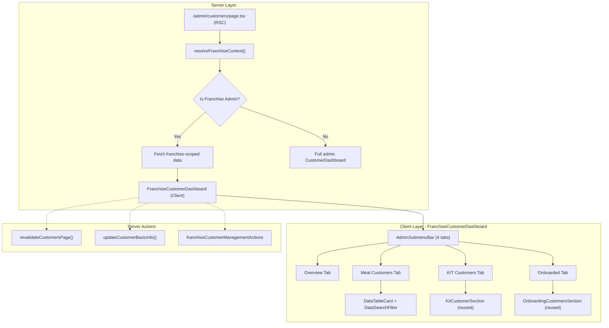

# Design Document: Franchise Customer Dashboard Enhancement

## Overview

This design specifies the enhanced franchise `/customers` page, bringing it to near feature-parity with the admin `/customers` page while respecting franchise-specific constraints (no Bulk Import, no Clinic filter, no subscription analytics). The page will feature a tabbed interface (Overview, Meal Customers, KIT Customers, Onboarded), column-selector search, status/diet/medical filters, row-level actions (View 360, Quick Edit, Shipping), a Quick Onboard route, and a Refresh button with ISR revalidation.

The implementation leverages the existing shared component library (`DataTableCard`, `AdminSubmenuBar`, `DataSearchFilter`, `StatusBadge`, `ExportButton`, `RefreshButton`, `QuickOnboardingForm`) while building a franchise-specific orchestrating component (`FranchiseCustomerDashboard`) that enforces franchise data boundaries via `resolveFranchiseContext()`.

### Key Design Decisions

1. **Server Component page shell + Client Component dashboard leaf**: The page route (`src/app/admin/(main)/customers/page.tsx`) remains the server-side data fetcher. The franchise-scoped variant will use a new `FranchiseCustomerDashboard` client component that receives pre-filtered, franchise-scoped data as props — matching the existing `AdminCustomersWrapper` → `CustomerDashboard` pattern.

2. **Reuse existing shared components**: Rather than creating parallel implementations, the franchise dashboard reuses `DataTableCard`, `DataSearchFilter`, `AdminSubmenuBar`, `StatusBadge`, `ExportButton`, `RefreshButton`, and `QuickOnboardingForm` from `src/shared/components/admin/`.

3. **Franchise-scoped data at the server level**: The server page fetches data using `createAdminClient` with a `.eq("franchise_id", franchiseId)` filter, ensuring RLS enforcement at the query level. The `resolveFranchiseContext()` utility resolves the franchise_id from the authenticated session.

4. **Tab routing via URL search params**: Tabs use `?tab=overview|meal|kit|onboarded` in the URL for bookmarkability and direct linking, managed client-side with `useSearchParams` and `router.replace` — no full page reload.

5. **No subscription analytics on Overview**: The franchise Overview tab displays only customer-focused metrics (demographics, activity, health), deliberately excluding subscription BI data to enforce access boundaries for restricted-access franchise admins.

---

## Architecture



### Routing Structure

```
src/app/admin/(main)/customers/
├── page.tsx                          # Server shell — branches based on user role
├── AdminCustomersWrapper.tsx         # Existing admin wrapper (unchanged)
├── FranchiseCustomerDashboard.tsx    # NEW: Franchise-specific client component
├── FranchiseCustomerOverview.tsx     # NEW: Customer-only analytics
├── quick-onboard/page.tsx           # Existing — already shared
├── onboarding/page.tsx              # Existing — already shared
└── [id]/page.tsx                    # Existing 360 dashboard — already shared
```

### Data Flow

1. `page.tsx` resolves the user's franchise context via `resolveFranchiseContext()`
2. If the user is a `FRANCHISE_ADMIN`, the page fetches `customer_profiles` filtered by `franchise_id`
3. Data is transformed into the `CustomerData[]` shape (matching the existing interface)
4. The `FranchiseCustomerDashboard` client component receives the data and renders the tabbed UI
5. Filters and search operate client-side on the pre-fetched dataset
6. The Onboarded tab fetches its data on-demand via server action (matching existing `OnboardingCustomersSection` pattern)

---

## Components and Interfaces

### New Components

#### `FranchiseCustomerDashboard`

**Location**: `src/app/admin/(main)/customers/FranchiseCustomerDashboard.tsx`

```typescript
"use client";

interface FranchiseCustomerDashboardProps {
  customers: CustomerData[];
  franchiseId: string;
}
```

**Responsibilities**:
- Tab navigation (Overview, Meal Customers, KIT Customers, Onboarded)
- URL-based tab state management via `?tab=` search param
- Client-side filtering (search, diet, status, medical, archived)
- Quick Edit modal management
- ISR refresh trigger
- Export to Excel

#### `FranchiseCustomerOverview`

**Location**: `src/app/admin/(main)/customers/FranchiseCustomerOverview.tsx`

```typescript
"use client";

interface FranchiseCustomerOverviewProps {
  customers: CustomerData[];
}
```

**Responsibilities**:
- Total customer count, active count, no-plan count
- Medical history and allergy counts
- Dietary preference distribution (Veg/Non-Veg with progress bars)
- Customer status mix (Active/Pending/Stopped/Expired/No Plan with progress bars)
- Empty state when zero customers
- NO subscription analytics

#### `QuickEditModal`

**Location**: `src/app/admin/(main)/customers/FranchiseQuickEditModal.tsx`

```typescript
"use client";

interface FranchiseQuickEditModalProps {
  isOpen: boolean;
  onClose: () => void;
  customer: CustomerData | null;
  onSuccess: () => void;
}
```

**Responsibilities**:
- Editable fields: full name, mobile, gender, DOB, dietary preference
- Zod validation with field-level errors
- Calls `franchiseUpdateCustomerBasicInfo` server action
- Success toast + list refresh on save

### Reused Components

| Component | Source | Usage |
|-----------|--------|-------|
| `AdminSubmenuBar` | `src/shared/components/admin/core/` | Tab navigation bar |
| `DataTableCard` | `src/shared/components/admin/core/` | Table container with header/controls/actions |
| `DataSearchFilter` | `src/shared/components/admin/core/` | Column selector + search input |
| `StatusBadge` | `src/shared/components/admin/core/` | Status display badges |
| `ExportButton` | `src/shared/components/admin/core/` | Excel export trigger |
| `RefreshButton` | `src/shared/components/admin/core/` | ISR revalidation trigger |
| `AdminPageHeader` | `src/shared/components/admin/core/` | Page title and description |
| `QuickOnboardingForm` | `src/shared/components/admin/customers/` | Quick onboard wizard |
| `OnboardingCustomersSection` | `src/shared/components/admin/customers/` | Onboarded customers listing |
| `KitCustomerSection` | `src/shared/components/admin/customers/` | KIT customers with shipping |

### Server Actions

| Action | Location | Purpose |
|--------|----------|---------|
| `revalidateCustomersPage()` | `src/actions/admin-actions/customerActions.ts` | ISR revalidation |
| `franchiseUpdateCustomerBasicInfo()` | `src/actions/franchise-actions/franchiseCustomerManagementActions.ts` | Quick edit with franchise guard |
| `listOnboardedCustomersAction()` | `src/actions/admin-actions/onboardingActions.ts` | Fetch onboarded customers |
| `getBulkKitShippingStatusAction()` | `src/actions/admin-actions/kitCustomerShippingActions.ts` | KIT shipping status |
| `getServiceAreaPincodesAction()` | `src/actions/pincodeActions.ts` | Quick onboard pincodes |
| `listKitProductsAction()` | `src/actions/admin-actions/kitProductActions.ts` | Quick onboard KIT products |

---

## Data Models

### `CustomerData` (Existing Interface — Reused)

```typescript
export interface CustomerData {
  id: string;
  userId?: string;
  fullName: string;
  email: string;
  mobile: string;
  dietary_preference: string;
  primary_pincode: string;
  status: string;           // "Active" | "Pending" | "Stopped" | "Expired" | "No Plan"
  gender: string;
  dateOfBirth: string;
  age: number | null;
  allergies: string | null;
  hasMedicalHistory: boolean;
  activePlanName: string | null;
  customerCategory: string | null;  // "MEAL" | "KIT" | null
  isActive: boolean;
  clinic_id: string | null;
  clinicName: string | null;
}
```

### Supabase Query Shape (Franchise-Scoped)

```sql
SELECT
  cp.id, cp.is_active, cp.dietary_preference, cp.gender, cp.date_of_birth,
  cp.allergies, cp.has_medical_history, cp.franchise_id, cp.clinic_id,
  clinics.name,
  users.id, users.full_name, users.email, users.mobile, users.is_active,
  addresses.pincode, addresses.is_primary,
  subscriptions.status, subscriptions.customer_category,
    subscription_plans.name, kit_products.name
FROM customer_profiles cp
  JOIN users ON users.id = cp.user_id
  LEFT JOIN clinics ON clinics.id = cp.clinic_id
  LEFT JOIN addresses ON addresses.customer_profile_id = cp.id
  LEFT JOIN subscriptions ON subscriptions.customer_profile_id = cp.id
    LEFT JOIN subscription_plans ON subscription_plans.id = subscriptions.plan_id
    LEFT JOIN kit_products ON kit_products.id = subscriptions.kit_product_id
WHERE cp.franchise_id = :franchise_id
```

### Quick Edit Validation Schema

```typescript
const quickEditSchema = z.object({
  fullName: z.string().min(2).max(100),
  mobile: z.string().regex(/^[6-9]\d{9}$/),
  gender: z.enum(["Male", "Female", "Other"]),
  dateOfBirth: z.string().refine(val => {
    const date = new Date(val);
    const now = new Date();
    const minDate = new Date(now.getFullYear() - 120, now.getMonth(), now.getDate());
    return date <= now && date >= minDate;
  }),
  dietaryPreference: z.enum(["Veg", "Non-Veg"]),
});
```

### Filter State Model

```typescript
interface FranchiseDashboardFilters {
  activeTab: "overview" | "meal" | "kit" | "onboarded";
  searchColumn: "fullName" | "mobile" | "email" | "primary_pincode";
  searchTerm: string;
  filterDiet: "ALL" | "VEG" | "NON_VEG" | "NOT_SET";
  filterStatus: "ALL" | "Active" | "Pending" | "Stopped" | "Expired" | "No Plan";
  filterMedical: "ALL" | "HAS_MEDICAL" | "NO_MEDICAL";
  filterAllergy: "ALL" | "HAS_ALLERGY" | "NO_ALLERGY";
  showArchived: boolean;
  showExpired: boolean;  // KIT tab only
}
```

### Status Derivation Priority

Status is derived from subscriptions using priority order:
1. **Active** — has any subscription with status `ACTIVE`
2. **Pending** — has any subscription with status `PENDING`
3. **Stopped** — has any subscription with status `STOPPED` or `CANCELLED`
4. **Expired** — has any subscription with status `EXPIRED`
5. **No Plan** — has no subscriptions

---

## Correctness Properties

*A property is a characteristic or behavior that should hold true across all valid executions of a system — essentially, a formal statement about what the system should do. Properties serve as the bridge between human-readable specifications and machine-verifiable correctness guarantees.*

### Property 1: Franchise data isolation

*For any* customer dataset and any franchise admin session, the displayed customer list SHALL contain only customers whose `franchise_id` exactly matches the authenticated user's resolved `franchise_id` — never customers from other franchises or core (null franchise_id) customers.

**Validates: Requirements 17.1**

### Property 2: Column selector search correctness

*For any* customer list, any search term, and any selected column (Name, Phone, Email, Pincode), the filtered result SHALL contain only rows where the selected column's value contains the search term as a case-insensitive substring, and SHALL contain all such rows from the original list.

**Validates: Requirements 9.2, 9.3**

### Property 3: AND-logic filter composition

*For any* combination of active filters (diet, status, medical, allergy, archived), the displayed customer list SHALL equal the intersection of each individual filter applied independently — i.e., a customer appears only if it satisfies ALL active filter predicates simultaneously.

**Validates: Requirements 10.5**

### Property 4: Status derivation priority correctness

*For any* customer with multiple subscriptions of varying statuses, the derived display status SHALL follow the priority order Active > Pending > Stopped > Expired > No Plan — specifically, if any subscription is ACTIVE, the status SHALL be "Active" regardless of other subscription statuses.

**Validates: Requirements 12.3**

### Property 5: Show Archived toggle invariant

*For any* customer list, when the Show Archived toggle is inactive, the displayed list SHALL contain zero customers where `isActive` is false. When active, the list SHALL be a superset of the inactive-toggle list (containing all active customers plus any archived ones matching other filters).

**Validates: Requirements 11.2, 11.3, 11.4**

### Property 6: Quick Edit validation round-trip

*For any* valid Quick Edit form submission (name 2-100 chars, valid 10-digit mobile, valid gender, valid past DOB, valid diet), submitting and re-reading the customer record SHALL produce the same values that were submitted.

**Validates: Requirements 14.3, 14.5**

### Property 7: Meal tab customer category filtering

*For any* customer list, the Meal Customers tab SHALL display only customers whose `customerCategory` is "MEAL" or null (no subscription) — never customers with `customerCategory` equal to "KIT".

**Validates: Requirements 3.1**

### Property 8: KIT tab customer category filtering

*For any* customer list with default toggles (Show Archived off, Show Expired off), the KIT Customers tab SHALL display only customers whose `customerCategory` is "KIT" AND whose `isActive` is true AND whose status is "Active" or "Pending".

**Validates: Requirements 4.1**

### Property 9: Tab URL synchronization

*For any* tab selection action, the URL search parameter `tab` SHALL reflect the currently active tab, and for any valid `tab` URL parameter on page load, the displayed content SHALL correspond to that tab.

**Validates: Requirements 1.2, 1.5**

### Property 10: Empty search restores full list

*For any* customer list with an active search term, clearing the search input SHALL restore the displayed list to show all customers subject only to non-search filters (status, diet, medical, allergy, archived).

**Validates: Requirements 9.4**

---

## Error Handling

| Scenario | Handling Strategy |
|----------|-------------------|
| Franchise context resolution fails | Hide franchise-specific actions; show generic error boundary |
| Customer data fetch fails on page load | Display error state with retry link; log error server-side |
| Quick Edit server action fails | Keep modal open, preserve form data, show error toast |
| ISR revalidation times out (>10s) | Show error toast, re-enable Refresh button |
| Onboarded customers fetch fails | Show error message with retry button (existing `OnboardingCustomersSection` pattern) |
| Quick Onboard clinic resolution fails | Reject onboarding with "franchise clinic configuration incomplete" error message |
| Invalid tab parameter in URL | Default to Meal Customers tab (Requirement 1.3) |
| Export with zero rows | Disable Export button (no-op) |

### Error Boundaries

- The `FranchiseCustomerDashboard` component will be wrapped in a React Error Boundary that catches render errors and displays a fallback UI with a "Reload Page" action.
- Server action errors are caught at the call site and surfaced via `toast.error()` notifications.

---

## Testing Strategy

### Unit Tests (Example-Based)

- Tab navigation renders correct content for each tab
- URL parameter parsing and default tab behavior
- Empty states render for zero-customer scenarios
- Quick Edit modal validation rejects invalid inputs (specific examples: empty name, 9-digit phone, future DOB)
- Franchise guard rejects non-franchise-admin access
- Shipping action only appears on KIT tab rows
- Overview tab does NOT render subscription analytics components
- Diet/Allergy column renders correctly for various data states (no allergy, long allergy text truncation)

### Property-Based Tests

Property-based testing is appropriate for this feature because the core filtering, searching, and status derivation logic involves pure functions operating over varied input spaces (customer lists of arbitrary size and composition, arbitrary search terms, filter combinations).

**Library**: `fast-check` (already used in this project)
**Configuration**: Minimum 100 iterations per property test

Tests to implement:
- **Property 1** (Franchise isolation): Generate random customer lists with mixed franchise_ids, verify filtering produces only matching rows
- **Property 2** (Search correctness): Generate random customer lists and search terms, verify substring matching
- **Property 3** (AND-logic filters): Generate random filter combinations, verify intersection semantics
- **Property 4** (Status derivation): Generate random subscription arrays, verify priority order
- **Property 5** (Show Archived): Generate random customer lists with mixed isActive, verify toggle behavior
- **Property 7** (Meal tab filtering): Generate random customer lists with mixed categories, verify exclusion of KIT
- **Property 8** (KIT tab filtering): Generate random customer lists, verify KIT-only + active constraints
- **Property 10** (Empty search restores): Generate list + search, verify clearing search restores original filtered list

### Integration Tests

- Full page render with franchise-scoped Supabase data
- Quick Edit flow: open modal → edit → submit → verify database update
- ISR refresh: trigger → verify `revalidatePath` called → router.refresh()
- Quick Onboard navigation and form rendering with franchise plans
- 360 Dashboard navigation from row action (Meal vs KIT tab configurations)

### Tag Format

```
// Feature: franchise-customer-dashboard-enhancement, Property 1: Franchise data isolation
// Feature: franchise-customer-dashboard-enhancement, Property 2: Column selector search correctness
```
