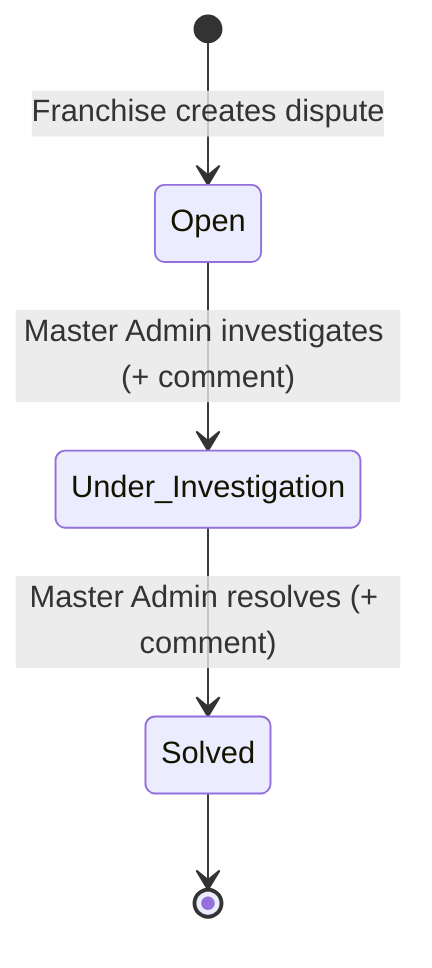

# Design Document: Franchise Dispute Management

## Overview

The Franchise Dispute Management feature introduces a one-directional dispute resolution workflow between franchise owners and master admins. Franchise owners raise disputes categorized by business domain (Inventory, Customer, Subscriptions, KIT, Rider, Shop Products, Operations, Others) from the franchise portal. Master admins review, investigate, and resolve disputes from the master portal through a linear status lifecycle: Open → Under_Investigation → Solved.

The feature integrates with the existing multi-tenant architecture by leveraging the `resolveScope()` pattern for authorization, the `x-franchise-id` cookie for franchise context, Supabase RLS for data isolation, and the established Server Action / Repository / Service layered architecture.

### Key Design Decisions

1. **Single table design** — All disputes live in one `franchise_disputes` table with RLS enforcing tenant isolation, consistent with the project's existing RLS-first security model.
2. **Server Action mutations with `createAdminClient`** — Mutations bypass RLS via the service role key (matching the `franchiseInventoryActions` pattern) while reads use the user-scoped `createClient`.
3. **Scope Resolver for authorization** — Reuses `resolveScope()` to determine caller identity, avoiding custom auth checks.
4. **Linear status machine** — Only forward transitions (Open → Under_Investigation → Solved) are permitted, simplifying the UI and preventing inconsistent states.
5. **72-hour window for order linking** — Limits inventory dispute context to recent transfers, keeping the dropdown manageable and relevant.

## Architecture

```mermaid
graph TD
    subgraph "Franchise Portal"
        FDP[Disputes Page<br/>/franchise/(main)/disputes]
        FDF[Dispute Form<br/>Client Component]
        FDT[Disputes Table<br/>Client Component]
    end

    subgraph "Master Portal"
        MDP[Disputes Page<br/>/master/(main)/disputes]
        MDT[Disputes Table<br/>Client Component]
        MDR[Resolution Dialog<br/>Client Component]
    end

    subgraph "Server Actions"
        CA[createDisputeAction<br/>franchise-actions/]
        UA[updateDisputeStatusAction<br/>master-actions/]
        FA[fetchDisputesAction<br/>shared read]
        FO[fetchReceivedOrdersAction<br/>franchise-actions/]
    end

    subgraph "Data Layer"
        DR[disputeRepository.ts<br/>src/repositories/]
        DB[(franchise_disputes<br/>+ RLS policies)]
        ST[(franchise_stock_transfers<br/>existing table)]
    end

    FDP --> FDT
    FDP --> FDF
    FDF -->|submit| CA
    FDF -->|fetch orders| FO
    FDT -->|read| FA

    MDP --> MDT
    MDP --> MDR
    MDT -->|read| FA
    MDR -->|update| UA

    CA --> DR
    UA --> DR
    FA --> DR
    FO --> DR
    DR --> DB
    DR --> ST
```

### Request Flow

1. **Franchise reads**: Page server component reads `x-franchise-id` cookie → calls repository with franchise filter → `createClient` (RLS-scoped) returns only own disputes.
2. **Franchise creates**: Client form submits → `createDisputeAction` → `resolveScope()` validates FRANCHISE_ADMIN + extracts `franchise_id` → validates with Zod → inserts via `createAdminClient` → revalidates path.
3. **Master reads**: Page server component → calls repository without franchise filter → `createAdminClient` returns all disputes joined with franchise name.
4. **Master updates**: Resolution dialog submits → `updateDisputeStatusAction` → `resolveScope()` validates MASTER_ADMIN → validates transition + comment with Zod → updates via `createAdminClient` → revalidates path.

## Components and Interfaces

### Server Actions

#### `src/actions/franchise-actions/franchiseDisputeActions.ts`

```typescript
// Creates a new dispute for the authenticated franchise owner
export async function createDisputeAction(formData: FormData): Promise<ActionResult<{ id: string }>>

// Fetches received orders within 72h for the current franchise (inventory disputes)
export async function fetchReceivedOrdersAction(): Promise<ActionResult<ReceivedOrderOption[]>>
```

#### `src/actions/master-actions/disputeActions.ts`

```typescript
// Updates dispute status with required comment (Master Admin only)
export async function updateDisputeStatusAction(formData: FormData): Promise<ActionResult<{ id: string }>>
```

### Repository

#### `src/repositories/disputeRepository.ts`

```typescript
export interface DisputeRow {
  id: string;
  franchise_id: string;
  category: DisputeCategory;
  description: string;
  status: DisputeStatus;
  master_admin_comment: string | null;
  related_order_ids: string[] | null;
  created_at: string;
  updated_at: string;
}

export interface DisputeWithFranchise extends DisputeRow {
  franchise_name: string;
}

// Fetches disputes for a specific franchise (franchise portal)
export async function getDisputesByFranchise(franchiseId: string): Promise<DisputeRow[]>

// Fetches all disputes with franchise name (master portal)
export async function getAllDisputes(franchiseFilter?: string): Promise<DisputeWithFranchise[]>

// Creates a new dispute record
export async function createDispute(data: CreateDisputeInput): Promise<{ id: string }>

// Updates dispute status and comment
export async function updateDisputeStatus(id: string, status: DisputeStatus, comment: string): Promise<void>

// Fetches received stock transfers within 72h for a franchise
export async function getReceivedOrdersForFranchise(franchiseId: string): Promise<ReceivedOrderOption[]>

// Fetches franchises that have at least one dispute (for master filter dropdown)
export async function getFranchisesWithDisputes(): Promise<{ id: string; name: string }[]>
```

### UI Components

#### Franchise Portal

| Component | Type | Location |
|-----------|------|----------|
| `DisputesPage` | Server Component | `src/app/franchise/(main)/disputes/page.tsx` |
| `DisputesClient` | Client Component | `src/app/franchise/(main)/disputes/DisputesClient.tsx` |
| `RaiseDisputeForm` | Client Component | `src/app/franchise/(main)/disputes/RaiseDisputeForm.tsx` |
| `DisputeHistoryTable` | Client Component | `src/app/franchise/(main)/disputes/DisputeHistoryTable.tsx` |

#### Master Portal

| Component | Type | Location |
|-----------|------|----------|
| `DisputesPage` | Server Component | `src/app/master/(main)/disputes/page.tsx` |
| `DisputesClient` | Client Component | `src/app/master/(main)/disputes/DisputesClient.tsx` |
| `DisputeListTable` | Client Component | `src/app/master/(main)/disputes/DisputeListTable.tsx` |
| `ResolveDisputeDialog` | Client Component | `src/app/master/(main)/disputes/ResolveDisputeDialog.tsx` |

### Validation Schemas

#### `src/validations/disputeSchema.ts`

```typescript
import { z } from "zod";

export const DISPUTE_CATEGORIES = [
  "Inventory", "Customer", "Subscriptions", "KIT",
  "Rider", "Shop_Products", "Operations", "Others"
] as const;

export const DISPUTE_STATUSES = ["Open", "Under_Investigation", "Solved"] as const;

export type DisputeCategory = typeof DISPUTE_CATEGORIES[number];
export type DisputeStatus = typeof DISPUTE_STATUSES[number];

export const createDisputeSchema = z.object({
  category: z.enum(DISPUTE_CATEGORIES, { required_error: "Category is required" }),
  description: z
    .string()
    .trim()
    .min(1, "Description is required")
    .max(2000, "Description cannot exceed 2000 characters"),
  related_order_ids: z.array(z.string().uuid()).optional(),
}).refine(
  (data) => {
    if (data.category === "Inventory") {
      return data.related_order_ids && data.related_order_ids.length > 0;
    }
    return true;
  },
  { message: "At least one received order must be selected for Inventory disputes", path: ["related_order_ids"] }
);

export const updateDisputeStatusSchema = z.object({
  dispute_id: z.string().uuid("Invalid dispute ID"),
  status: z.enum(["Under_Investigation", "Solved"]),
  comment: z
    .string()
    .trim()
    .min(10, "Comment must be at least 10 characters")
    .max(1000, "Comment cannot exceed 1000 characters"),
});

// Valid status transitions
export const VALID_TRANSITIONS: Record<DisputeStatus, DisputeStatus | null> = {
  Open: "Under_Investigation",
  Under_Investigation: "Solved",
  Solved: null, // terminal state
};

export function isValidTransition(current: DisputeStatus, next: DisputeStatus): boolean {
  return VALID_TRANSITIONS[current] === next;
}
```

## Data Models

### Database Schema

```sql
CREATE TABLE franchise_disputes (
  id UUID PRIMARY KEY DEFAULT gen_random_uuid(),
  franchise_id UUID NOT NULL REFERENCES franchises(id),
  category TEXT NOT NULL CHECK (category IN (
    'Inventory', 'Customer', 'Subscriptions', 'KIT',
    'Rider', 'Shop_Products', 'Operations', 'Others'
  )),
  description TEXT NOT NULL CHECK (char_length(description) <= 2000),
  status TEXT NOT NULL DEFAULT 'Open' CHECK (status IN (
    'Open', 'Under_Investigation', 'Solved'
  )),
  master_admin_comment TEXT,
  related_order_ids UUID[],
  created_at TIMESTAMPTZ NOT NULL DEFAULT now(),
  updated_at TIMESTAMPTZ NOT NULL DEFAULT now()
);

-- Auto-update updated_at trigger
CREATE OR REPLACE FUNCTION update_franchise_disputes_updated_at()
RETURNS TRIGGER AS $$
BEGIN
  NEW.updated_at = now();
  RETURN NEW;
END;
$$ LANGUAGE plpgsql;

CREATE TRIGGER trg_franchise_disputes_updated_at
  BEFORE UPDATE ON franchise_disputes
  FOR EACH ROW
  EXECUTE FUNCTION update_franchise_disputes_updated_at();

-- Enable RLS
ALTER TABLE franchise_disputes ENABLE ROW LEVEL SECURITY;

-- FRANCHISE_ADMIN: read own disputes
CREATE POLICY franchise_disputes_select_franchise
  ON franchise_disputes FOR SELECT
  USING (
    franchise_id = (
      SELECT franchise_id FROM users
      WHERE auth_user_id = auth.uid()
      AND role = 'FRANCHISE_ADMIN'
    )
  );

-- FRANCHISE_ADMIN: insert own disputes
CREATE POLICY franchise_disputes_insert_franchise
  ON franchise_disputes FOR INSERT
  WITH CHECK (
    franchise_id = (
      SELECT franchise_id FROM users
      WHERE auth_user_id = auth.uid()
      AND role = 'FRANCHISE_ADMIN'
    )
  );

-- MASTER_ADMIN: read all disputes
CREATE POLICY franchise_disputes_select_master
  ON franchise_disputes FOR SELECT
  USING (
    EXISTS (
      SELECT 1 FROM users
      WHERE auth_user_id = auth.uid()
      AND role = 'MASTER_ADMIN'
    )
  );

-- MASTER_ADMIN: update all disputes
CREATE POLICY franchise_disputes_update_master
  ON franchise_disputes FOR UPDATE
  USING (
    EXISTS (
      SELECT 1 FROM users
      WHERE auth_user_id = auth.uid()
      AND role = 'MASTER_ADMIN'
    )
  );

-- Index for franchise queries
CREATE INDEX idx_franchise_disputes_franchise_id ON franchise_disputes(franchise_id);
CREATE INDEX idx_franchise_disputes_created_at ON franchise_disputes(created_at DESC);
```

### TypeScript Types

#### `src/types/dispute.ts`

```typescript
import type { DisputeCategory, DisputeStatus } from "@/validations/disputeSchema";

export interface Dispute {
  id: string;
  franchise_id: string;
  category: DisputeCategory;
  description: string;
  status: DisputeStatus;
  master_admin_comment: string | null;
  related_order_ids: string[] | null;
  created_at: string;
  updated_at: string;
}

export interface DisputeWithFranchiseName extends Dispute {
  franchise_name: string;
}

export interface ReceivedOrderOption {
  id: string;
  product_name: string;
  quantity: number;
  received_at: string;
}

export interface CreateDisputeInput {
  franchise_id: string;
  category: DisputeCategory;
  description: string;
  related_order_ids?: string[];
}
```

### Status State Machine



## Correctness Properties

*A property is a characteristic or behavior that should hold true across all valid executions of a system — essentially, a formal statement about what the system should do. Properties serve as the bridge between human-readable specifications and machine-verifiable correctness guarantees.*

### Property 1: Description truncation preserves content

*For any* description string, if its length exceeds 100 characters, the truncated display value shall be exactly the first 100 characters followed by "…"; if its length is 100 characters or fewer, the display value shall equal the original string unchanged.

**Validates: Requirements 3.2, 7.2**

### Property 2: Dispute list ordering invariant

*For any* list of disputes returned by the fetch function, each dispute's `created_at` timestamp shall be greater than or equal to the `created_at` timestamp of the subsequent dispute in the list (descending chronological order).

**Validates: Requirements 3.4, 7.3**

### Property 3: Valid dispute creation round-trip

*For any* valid category from the DISPUTE_CATEGORIES set and any non-empty description string of 1–2000 characters, creating a dispute with those values and then reading it back shall yield a dispute with matching category, description, status "Open", and the submitting franchise's franchise_id.

**Validates: Requirements 4.3**

### Property 4: Whitespace-only descriptions are rejected

*For any* string composed entirely of whitespace characters (spaces, tabs, newlines), the `createDisputeSchema` validation shall reject it with a validation error, and no dispute record shall be created.

**Validates: Requirements 4.4**

### Property 5: 72-hour received order window filter

*For any* stock transfer with `state = 'RECEIVED'` and `dest_franchise_id` matching the current franchise, it shall appear in the received orders list if and only if its `received_at` timestamp is within 72 hours of the current time.

**Validates: Requirements 5.2**

### Property 6: Franchise filter returns only matching disputes

*For any* franchise ID selected in the master portal filter dropdown, all disputes in the filtered result set shall have a `franchise_id` equal to the selected value.

**Validates: Requirements 7.5**

### Property 7: Status transitions require valid comments

*For any* status transition (Open → Under_Investigation, or Under_Investigation → Solved), the update shall succeed if and only if a comment between 10 and 1000 characters (after trimming) is provided. Comments shorter than 10 characters or longer than 1000 characters shall cause the transition to be rejected.

**Validates: Requirements 8.2, 8.3**

### Property 8: Invalid status transitions are rejected

*For any* dispute with a given current status, attempting a transition to any status other than the single valid next status (Open → Under_Investigation, Under_Investigation → Solved) shall be rejected, and the dispute's status and comment shall remain unchanged.

**Validates: Requirements 8.4**

## Error Handling

| Scenario | Handling | User Feedback |
|----------|----------|---------------|
| Missing `x-franchise-id` cookie | Server component redirects to login | Redirect to `/login` |
| Unauthenticated user | Middleware redirects before page loads | Redirect to portal login page |
| Scope resolution failure (`unresolved`) | Server action returns error result | Toast: "Please log in to continue" |
| Scope resolution failure (`no_franchise`) | Server action returns error result | Toast: "No franchise assigned to your account" |
| Invalid form data (Zod validation) | Server action returns field-level errors | Inline validation messages below fields |
| Invalid status transition attempted | Server action validates against `VALID_TRANSITIONS` map | Toast: "This status transition is not permitted" |
| Database constraint violation | Caught in repository layer, returns generic error | Toast: "Could not create dispute. Please try again." |
| Network/server error on create | Client catches error, preserves form state | Toast: "Failed to create dispute" + form data preserved |
| Network/server error on update | Client catches error, preserves comment | Toast: "Failed to update dispute" + comment preserved |
| No received orders in 72h window | UI shows disabled dropdown | Message: "No received orders available in the last 72 hours" |
| Empty dispute list | UI shows empty state illustration | Message: "No disputes have been raised yet" / "No disputes found" |

### Error Boundaries

- Each portal disputes page wraps content in a React Error Boundary with a fallback UI showing a generic "Something went wrong" message and a retry button.
- Server action errors are caught and returned as `ActionResult<T>` with `{ success: false, error: string }` — never thrown to the client.

## Testing Strategy

### Unit Tests (Example-Based)

| Test Area | What to Verify |
|-----------|----------------|
| `createDisputeSchema` | Valid inputs pass, invalid inputs fail with correct error messages |
| `updateDisputeStatusSchema` | Comment length bounds (10–1000), valid status enum values |
| `isValidTransition()` | All 3 valid transitions return true, all invalid combinations return false |
| `truncateDescription()` | Strings ≤100 chars unchanged, >100 chars truncated with "…" |
| Status badge color mapping | Each status maps to a distinct color class |
| Category dropdown options | All 8 categories present |

### Property-Based Tests

Property-based testing is appropriate for this feature because the validation logic, truncation function, filtering logic, and state machine transitions are pure functions with clear input/output behavior and universal properties that hold across wide input spaces.

**Library**: [fast-check](https://github.com/dubzzz/fast-check) (already available in the project's testing ecosystem via Vitest)

**Configuration**:
- Minimum 100 iterations per property test
- Each test tagged with: `Feature: franchise-dispute-management, Property {N}: {title}`

| Property | Generator Strategy |
|----------|-------------------|
| P1: Description truncation | Generate arbitrary strings of length 0–5000 |
| P2: Dispute list ordering | Generate arrays of dispute objects with random timestamps |
| P3: Valid creation round-trip | Generate valid categories (pick from enum) × descriptions (1–2000 chars) |
| P4: Whitespace rejection | Generate strings from whitespace character set (space, tab, \n, \r) |
| P5: 72-hour filter | Generate received_at timestamps spanning ±100 hours from now |
| P6: Franchise filter | Generate dispute arrays with random franchise_ids, select one to filter |
| P7: Comment validation | Generate strings of length 0–2000, verify acceptance iff 10 ≤ trimmed length ≤ 1000 |
| P8: Invalid transitions | Generate (currentStatus, attemptedStatus) pairs, verify rejection for all invalid pairs |

### Integration Tests

| Test Area | What to Verify |
|-----------|----------------|
| RLS policies | FRANCHISE_ADMIN can only see/create own disputes; MASTER_ADMIN sees all |
| `updated_at` trigger | Update a dispute, verify timestamp changed |
| FK constraint | Attempt insert with non-existent franchise_id, verify rejection |
| CHECK constraints | Attempt insert with invalid category/status, verify rejection |
| Full create flow | Create dispute via action, verify it appears in franchise list |
| Full resolve flow | Update status via action, verify new status + comment persisted |

### End-to-End Tests

| Scenario | Steps |
|----------|-------|
| Franchise raises dispute | Login as franchise → Navigate to disputes → Fill form → Submit → Verify in table |
| Inventory dispute with orders | Select Inventory → Pick orders → Submit → Verify order IDs stored |
| Master resolves dispute | Login as master → Find dispute → Mark Under_Investigation with comment → Mark Solved with comment |
| Access control | Login as wrong role → Attempt to access disputes → Verify redirect/rejection |
