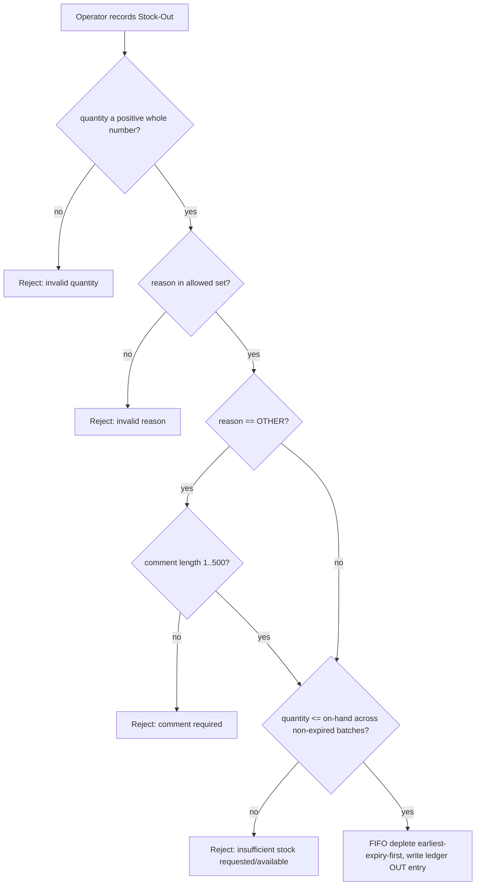

# Design Document

## Overview

The Franchise Inventory feature gives every franchise a **finished-product-only** inventory that mirrors the existing Central Kitchen Inventory's look, batching, and FIFO behavior, while restricting franchise operators to **stock movement only** (no product management). Stock enters a franchise inventory exclusively through a central-kitchen **Stock Transfer** that walks an explicit lifecycle — `DISPATCHED → ACCEPTED → RECEIVED`, with `DISPATCHED → REJECTED` as the only alternative terminal state — and leaves through operator-recorded **Stock-Outs** with defined reasons. Every movement is captured in a per-franchise audit ledger.

The design is **additive**: the Central Kitchen Inventory (`inventory_products`, `inventory_lots`, `inventory_transactions`, manufacturing tables) and its service `src/services/inventoryEngine.ts` are left functionally unchanged except for two narrow additions required by Requirement 13:

1. The dispatch destination selector lists all `active` franchises.
2. The central outgoing ledger records what was sent to each franchise, with a per-batch breakdown.

The franchise inventory is presented on the **franchise portal** at `https://franchies.arogyadiet.com/`, which the middleware already routes to the `src/app/franchise` route group and restricts to `FRANCHISE_ADMIN` users (with a suspended-franchise guard and an `x-franchise-id` cookie injected for downstream Server Components).

### Key design decisions

- **A dedicated, batch-aware franchise inventory model.** The pre-existing `franchise_warehouses` / `franchise_warehouse_stock` / `stock_transfers` tables from the `multi-tenant-franchise` spec are a simpler quantity-only model with no lifecycle and no batches. They do not satisfy this feature's batch/FIFO and Dispatch→Accept→Receive requirements, so this feature introduces its own set of tables (`franchise_inventories`, `franchise_inventory_lots`, `franchise_stock_transfers`, `franchise_stock_transfer_lines`, `franchise_inventory_ledger`). These coexist with — and do not modify — the warehouse model.
- **Atomic multi-step mutations run inside PostgreSQL `SECURITY DEFINER` RPCs.** A plpgsql function body executes in a single implicit transaction, so the source decrement, lifecycle change, lot writes, and ledger insert either all commit or all roll back. This mirrors the established `transfer_stock` and `create-group-with-kitchen-rpc` patterns and directly satisfies the rollback requirements (1.5, 6.x, 8.7, 11.7, 13.3).
- **On-hand excludes in-transit stock.** A finished product's `On_Hand_Quantity` for a franchise is the sum of `quantity_remaining` across its `ACTIVE` franchise lots. Lots are created **only** when a transfer reaches `RECEIVED`, so `DISPATCHED` and `ACCEPTED` transfers never contribute to on-hand (5.5, 7.5, 8.1).
- **FIFO by earliest expiry, ties broken by earliest received date** — identical to the central kitchen's lot depletion (orders by `expiry_date ASC`).
- **Tenant isolation reuses the existing Scope_Resolver + RLS.** Every franchise table carries a denormalized `franchise_id` so the existing `is_global_role()` / `current_franchise_id()` RLS predicate and `applyScope` query helper apply unchanged.
- **Reuse central kitchen UI.** The franchise portal reuses `ProductCard`, the batch-breakdown popover, product images, and ledger components from `src/shared/components/admin/inventory/`, driven by flags so the product-management and central-only controls are suppressed.

## Architecture

### Portal & layering

```
franchies.arogyadiet.com  ──(middleware rewrite)──►  src/app/franchise/*
                                                       │  (Server Components, RSC-first)
                                                       ▼
                          Server Actions  src/actions/franchise-actions/franchiseInventoryActions.ts
                                                       │  (auth via resolveScope, Zod validation)
                                                       ▼
                          Services        src/services/franchiseInventoryEngine.ts
                                                       │  (business logic; calls RPCs for atomic writes)
                                                       ▼
                          Repositories     src/repositories/franchise/franchiseInventoryRepository.ts
                                                       │  (data access only, applyScope, createAdminClient)
                                                       ▼
                          PostgreSQL (Supabase) + SECURITY DEFINER RPCs + RLS
```

The central kitchen dispatch path is extended on the admin side:

```
admin.arogyadiet.com /admin/inventory  ──►  DispatchStockModal (destination selector)
                                              │
                                              ▼
                          dispatchToFranchiseAction  (src/actions/admin-actions/inventoryActions or franchiseDispatchActions)
                                              │
                                              ▼
                          dispatch_to_franchise() RPC  (deduct central FIFO + create transfer + central ledger entry)
```

### Component responsibilities

| Layer | Module | Responsibility |
|-------|--------|----------------|
| UI (franchise) | `src/app/franchise/(main)/inventory/page.tsx` | RSC: read franchise inventory + incoming transfers, render reused cards |
| UI (franchise) | `src/app/franchise/(main)/inventory/ledger/page.tsx` | RSC: render the franchise audit ledger |
| UI (shared) | `src/shared/components/admin/inventory/ProductCard.tsx` | Reused; `productManagement={false}` hides add/edit/delete |
| UI (franchise) | `IncomingTransfersPanel`, `StockOutModal`, `ReceiveTransferControls` | Franchise-only interactive leaves |
| Action | `franchiseInventoryActions.ts` | Accept/Reject/Receive transfer, record Stock-Out; auth + validation |
| Action | admin `dispatchToFranchiseAction` | Dispatch finished product to an active franchise |
| Action | `master-actions/franchiseActions.ts` (`createFranchise`) | Extended to provision an inventory on creation |
| Service | `franchiseInventoryEngine.ts` | On-hand computation, transfer transitions, FIFO depletion, ledger reads |
| Repository | `franchiseInventoryRepository.ts` | Scoped reads/writes of franchise inventory tables |
| DB RPC | `provision_franchise_inventory`, `dispatch_to_franchise`, `accept_franchise_transfer`, `reject_franchise_transfer`, `receive_franchise_transfer`, `record_franchise_stock_out` | Atomic transactional mutations |

### Transfer state machine

```mermaid
stateDiagram-v2
    [*] --> DISPATCHED: central kitchen dispatches (central FIFO deducted, central ledger entry)
    DISPATCHED --> ACCEPTED: operator Accepts (no on-hand change — still in transit)
    DISPATCHED --> REJECTED: operator Rejects (terminal; no on-hand change)
    ACCEPTED --> RECEIVED: operator confirms physical Receipt (creates franchise lots, +on-hand, ledger IN)
    RECEIVED --> [*]
    REJECTED --> [*]
```

Allowed transitions are the only edges above. Any action requested from a non-matching source state is rejected with the state left unchanged (7.6, 8.5). `RECEIVED` is idempotent — a second Receive is a no-op (8.8). On-hand is affected **only** by the `ACCEPTED → RECEIVED` edge (increase) and by Stock-Out (decrease).

### Stock-out reason flow



## Components and Interfaces

### Service: `franchiseInventoryEngine.ts`

```typescript
// On-hand = sum of quantity_remaining over ACTIVE franchise lots for the product.
export async function getFranchiseInventoryCatalog(
  franchiseId: string,
  scope: Scope,
): Promise<FranchiseCatalogProduct[]>;

export async function getIncomingTransfers(
  franchiseId: string,
  scope: Scope,
): Promise<FranchiseStockTransfer[]>; // DISPATCHED + ACCEPTED (in-transit)

export async function acceptTransfer(
  transferId: string, franchiseId: string, scope: Scope,
): Promise<TransferActionResult>;

export async function rejectTransfer(
  transferId: string, franchiseId: string, scope: Scope,
): Promise<TransferActionResult>;

export async function receiveTransfer(
  transferId: string, franchiseId: string, scope: Scope,
): Promise<TransferActionResult>; // creates lots, increments on-hand, writes ledger IN

export async function recordStockOut(
  input: StockOutInput, franchiseId: string, scope: Scope,
): Promise<StockOutResult>; // FIFO deplete + ledger OUT

export async function getFranchiseLedger(
  franchiseId: string, scope: Scope, limit?: number,
): Promise<FranchiseLedgerEntry[]>; // newest-first, ties by descending insertion order

// Dispatch path (central kitchen side)
export async function listActiveFranchiseDestinations(): Promise<FranchiseDestination[]>;
export async function dispatchToFranchise(
  input: DispatchToFranchiseInput, actorUserId: string,
): Promise<DispatchResult>;
```

The mutating functions are thin wrappers that validate inputs, resolve/verify the caller's `Scope`, and delegate the atomic work to the corresponding RPC via `createAdminClient().rpc(...)`. Read functions use the repository with `applyScope`.

### Repository: `franchiseInventoryRepository.ts`

Data-access only (mirrors `warehouseRepository.ts`): `getInventoryByFranchise`, `listActiveLots(franchiseId, scope)`, `listTransfers(franchiseId, scope, states)`, `getTransferById(id, scope)`, `listLedgerEntries(franchiseId, scope, limit)`. All reads apply the caller's `Scope` on the denormalized `franchise_id` column so a franchise-scoped caller can never read another franchise's rows even if a different id is passed (mirrors RLS).

### Server Actions: `src/actions/franchise-actions/franchiseInventoryActions.ts`

`"use server"` functions returning the shared `ActionResult<T>` shape. Each one:
1. Calls `resolveScope()`; rejects `unresolved` / `no_franchise`; for a `franchise` scope uses `scope.franchise_id` as the authoritative franchise (never trusts a client-supplied id) (2.6, 11.6).
2. Validates input with a Zod schema from `src/validations/franchiseInventory.ts`.
3. Calls the service, then `revalidatePath` for the franchise inventory / ledger routes.

Actions: `acceptTransferAction`, `rejectTransferAction`, `receiveTransferAction`, `recordStockOutAction`. Product create/edit/delete actions are intentionally **absent** from the franchise portal; the franchise `ProductCard` is rendered with `productManagement={false}` and without Receive/Dispatch central modals (4.1–4.3).

### Central kitchen dispatch extension

- `DISPATCH_STOCK_REASONS` (fixed branch names in `product-schema.ts`) is replaced/augmented so the destination selector is populated from `listActiveFranchiseDestinations()` (5.1–5.7, 13.1). When no active franchise exists, the selector shows a "no destinations available" message and disables selection (5.7).
- A new `dispatchToFranchiseAction` (admin-side) validates the destination is an `Active_Franchise` and quantity > 0, then calls `dispatch_to_franchise()`.

## Data Models

All new tables are additive, carry a denormalized `franchise_id` for RLS, and use the `update_*_updated_at` trigger pattern already established in the franchise scripts. Scripts live under `/scripts` following the existing naming convention.

### `franchise_inventories` — one inventory per franchise (R1)

```sql
CREATE TABLE public.franchise_inventories (
  id UUID PRIMARY KEY DEFAULT gen_random_uuid(),
  franchise_id UUID NOT NULL UNIQUE REFERENCES public.franchises(id) ON DELETE CASCADE, -- 1:1 (R1.3)
  created_at TIMESTAMPTZ NOT NULL DEFAULT now(),
  updated_at TIMESTAMPTZ NOT NULL DEFAULT now()
);
```

The `UNIQUE(franchise_id)` constraint guarantees at most one inventory per franchise and makes provisioning idempotent under concurrency (1.3, 1.4, 1.6). An empty inventory has zero lots → product count 0 and on-hand 0 (1.2).

### `franchise_inventory_lots` — finished-product batches (R9, R10, R12)

```sql
CREATE TABLE public.franchise_inventory_lots (
  id UUID PRIMARY KEY DEFAULT gen_random_uuid(),
  franchise_id UUID NOT NULL REFERENCES public.franchises(id) ON DELETE CASCADE, -- denormalized for RLS
  inventory_id UUID NOT NULL REFERENCES public.franchise_inventories(id) ON DELETE CASCADE,
  product_id UUID NOT NULL REFERENCES public.inventory_products(id),
  batch_number TEXT NOT NULL,                       -- retained from source transfer (R12.1)
  quantity_remaining NUMERIC NOT NULL CHECK (quantity_remaining >= 0),
  expiry_date TIMESTAMPTZ NOT NULL,                 -- retained from source transfer (R12.1)
  received_at TIMESTAMPTZ NOT NULL DEFAULT now(),   -- FIFO tie-breaker
  source_transfer_id UUID NOT NULL REFERENCES public.franchise_stock_transfers(id), -- central source (R9.3)
  status TEXT NOT NULL DEFAULT 'ACTIVE' CHECK (status IN ('ACTIVE','DEPLETED','EXPIRED')),
  created_at TIMESTAMPTZ NOT NULL DEFAULT now(),
  updated_at TIMESTAMPTZ NOT NULL DEFAULT now()
);
CREATE INDEX idx_fil_franchise ON public.franchise_inventory_lots(franchise_id);
CREATE INDEX idx_fil_fifo ON public.franchise_inventory_lots(product_id, expiry_date ASC, received_at ASC)
  WHERE status = 'ACTIVE';
```

Lots are only ever inserted by `receive_franchise_transfer()`; the `product_id` must reference a `FINISHED_GOOD` (enforced in the RPC, R3). A NULL/absent batch number or expiry on a received line is rejected (R12.2).

### `franchise_stock_transfers` — transfer lifecycle header (R6, R7, R8)

```sql
CREATE TYPE franchise_transfer_state AS ENUM ('DISPATCHED','ACCEPTED','RECEIVED','REJECTED');

CREATE TABLE public.franchise_stock_transfers (
  id UUID PRIMARY KEY DEFAULT gen_random_uuid(),
  dest_franchise_id UUID NOT NULL REFERENCES public.franchises(id),     -- denormalized for RLS
  product_id UUID NOT NULL REFERENCES public.inventory_products(id),
  quantity NUMERIC NOT NULL CHECK (quantity > 0),
  state franchise_transfer_state NOT NULL DEFAULT 'DISPATCHED',
  source_central_kitchen_id UUID REFERENCES public.kitchens(id),        -- central source identifier (R9.3)
  dispatched_at TIMESTAMPTZ NOT NULL DEFAULT now(),
  accepted_at TIMESTAMPTZ,
  received_at TIMESTAMPTZ,
  rejected_at TIMESTAMPTZ,
  dispatched_by UUID REFERENCES public.users(id),
  acted_by UUID REFERENCES public.users(id),
  created_at TIMESTAMPTZ NOT NULL DEFAULT now(),
  updated_at TIMESTAMPTZ NOT NULL DEFAULT now()
);
CREATE INDEX idx_fst_dest_state ON public.franchise_stock_transfers(dest_franchise_id, state);
```

`franchise_id` for RLS = `dest_franchise_id`. State is mutated only by the lifecycle RPCs, which assert the source state before transitioning (7.6, 8.5, 8.6).

### `franchise_stock_transfer_lines` — per-batch breakdown of a transfer (R6.2, R7.2, R12.1)

```sql
CREATE TABLE public.franchise_stock_transfer_lines (
  id UUID PRIMARY KEY DEFAULT gen_random_uuid(),
  transfer_id UUID NOT NULL REFERENCES public.franchise_stock_transfers(id) ON DELETE CASCADE,
  franchise_id UUID NOT NULL REFERENCES public.franchises(id),  -- denormalized for RLS
  batch_number TEXT NOT NULL,
  quantity NUMERIC NOT NULL CHECK (quantity > 0),
  expiry_date TIMESTAMPTZ NOT NULL,
  source_lot_id UUID REFERENCES public.inventory_lots(id)       -- which central lot it came from
);
CREATE INDEX idx_fstl_transfer ON public.franchise_stock_transfer_lines(transfer_id);
```

The lines are the batch breakdown captured at dispatch (from central FIFO depletion). On `RECEIVED`, each line becomes a `franchise_inventory_lots` row with the same batch number and expiry (R8.4, R12.1). The sum of line quantities equals the transfer's `quantity` (invariant enforced by the dispatch RPC).

### `franchise_inventory_ledger` — per-franchise audit ledger (R11)

```sql
CREATE TYPE franchise_ledger_direction AS ENUM ('IN','OUT');

CREATE TABLE public.franchise_inventory_ledger (
  id BIGINT GENERATED ALWAYS AS IDENTITY PRIMARY KEY,   -- monotonic insertion order (tie-break, R11.4)
  franchise_id UUID NOT NULL REFERENCES public.franchises(id),
  direction franchise_ledger_direction NOT NULL,
  product_id UUID NOT NULL REFERENCES public.inventory_products(id),
  quantity NUMERIC NOT NULL CHECK (quantity > 0),
  batch_breakdown JSONB NOT NULL,                       -- [{batch_number, quantity, expiry_date}]
  -- IN entries:
  source_transfer_id UUID REFERENCES public.franchise_stock_transfers(id),
  source_central_kitchen_id UUID REFERENCES public.kitchens(id),
  -- OUT entries:
  stock_out_reason TEXT CHECK (stock_out_reason IN
    ('MEAL_SUBSCRIPTION_SALE','KIT_SUBSCRIPTION_SALE','ONE_TIME_PURCHASE_SALE','SPOILED','DAMAGED','OTHER')),
  comment TEXT CHECK (comment IS NULL OR char_length(comment) BETWEEN 1 AND 500),
  occurred_at TIMESTAMPTZ NOT NULL DEFAULT now(),       -- UTC, second precision (R11.1, R11.2)
  CONSTRAINT ck_ledger_direction CHECK (
    (direction = 'IN'  AND source_transfer_id IS NOT NULL AND stock_out_reason IS NULL) OR
    (direction = 'OUT' AND stock_out_reason  IS NOT NULL AND source_transfer_id IS NULL)
  )
);
CREATE INDEX idx_fledger_franchise_time ON public.franchise_inventory_ledger(franchise_id, occurred_at DESC, id DESC);
```

Ledger entries are written in the same RPC transaction as the movement they record, so a failed entry rolls the whole movement back (11.7). The `(occurred_at DESC, id DESC)` index backs the newest-first ordering with descending-insertion tie-break (11.4). Every entry is scoped to exactly one franchise via `franchise_id` (11.3).

### Central Kitchen Ledger additions (R13.2)

`inventory_transactions` is extended additively. The current `reason` column has a fixed CHECK constraint listing hardcoded branch names; that constraint is replaced and a destination-franchise reference is added:

```sql
ALTER TABLE public.inventory_transactions
  ADD COLUMN IF NOT EXISTS dest_franchise_id UUID REFERENCES public.franchises(id),
  ADD COLUMN IF NOT EXISTS franchise_transfer_id UUID REFERENCES public.franchise_stock_transfers(id);

-- Relax the legacy fixed-branch CHECK so dynamic "Sent to <franchise>" reasons are allowed.
ALTER TABLE public.inventory_transactions DROP CONSTRAINT IF EXISTS inventory_transactions_reason_check;
```

One outgoing `OUT` transaction per central lot depleted continues to be written by the existing engine; the dispatch-to-franchise RPC additionally stamps `dest_franchise_id` and `franchise_transfer_id` so the central ledger shows the destination franchise and links the per-batch breakdown (13.2). Raw-product, finished-product, and manufacturing records, schema, and quantities are otherwise unchanged (13.4).

### TypeScript types — `src/types/franchiseInventory.ts`

```typescript
export type FranchiseTransferState = 'DISPATCHED' | 'ACCEPTED' | 'RECEIVED' | 'REJECTED';
export type StockOutReason =
  | 'MEAL_SUBSCRIPTION_SALE' | 'KIT_SUBSCRIPTION_SALE' | 'ONE_TIME_PURCHASE_SALE'
  | 'SPOILED' | 'DAMAGED' | 'OTHER';

export interface FranchiseBatch { batchNumber: string; quantity: number; expiryDate: string; }
export interface FranchiseCatalogProduct {
  productId: string; name: string; imageUrl: string | null; baseUom: BaseUom;
  onHandQuantity: number;            // ACTIVE lots only — excludes in-transit
  batches: FranchiseBatch[];         // ordered by expiry ASC, then received ASC
}
export interface FranchiseStockTransfer {
  id: string; destFranchiseId: string; productId: string; productName: string;
  quantity: number; state: FranchiseTransferState; lines: FranchiseBatch[];
  dispatchedAt: string; sourceCentralKitchenId: string | null;
}
export interface FranchiseLedgerEntry {
  id: number; direction: 'IN' | 'OUT'; productName: string; quantity: number;
  batchBreakdown: FranchiseBatch[]; stockOutReason: StockOutReason | null;
  comment: string | null; sourceCentralKitchenId: string | null; occurredAt: string;
}
```

### RLS policies

New franchise tables follow the exact policy pattern in `create-franchise-rls-policies.sql` (SELECT/INSERT/UPDATE/DELETE gated by `is_global_role() OR franchise_id = current_franchise_id()`), so franchise operators see and mutate only their own rows and global roles (admin/master) see all. The mutating RPCs are `SECURITY DEFINER` and run as the service role after the action layer has authorized the caller, mirroring `transfer_stock`.

## Correctness Properties

*A property is a characteristic or behavior that should hold true across all valid executions of a system — essentially, a formal statement about what the system should do. Properties serve as the bridge between human-readable specifications and machine-verifiable correctness guarantees.*

The core franchise-inventory logic — the transfer state machine, on-hand computation (excluding in-transit), FIFO batch depletion, batch ordering, and input validation — is pure, deterministic logic with a large input space and clear universal invariants. Property-based testing applies strongly here. The pure logic is factored into testable units in `src/lib/franchise-inventory/` (a transfer-state reducer, an on-hand calculator, and a FIFO depletion function) so the properties below can be exercised with `fast-check` against in-memory models, independent of Supabase. Provisioning (DB unique constraint), RLS wiring, and reused-UI rendering are covered by example/integration tests instead (see Testing Strategy).

After the prework analysis and the reflection pass, the redundant criteria were consolidated. The properties below each provide unique validation value and together cover every testable acceptance criterion.

### Property 1: Provisioning yields exactly one inventory per franchise

*For any* franchise, provisioning its inventory results in exactly one `franchise_inventory` associated with that franchise, and no franchise is associated with more than one inventory and no inventory with more than one franchise.

**Validates: Requirements 1.1, 1.3, 1.6**

### Property 2: A newly provisioned inventory is empty

*For any* newly provisioned franchise inventory, its finished-product count is 0 and its total On_Hand_Quantity is 0.

**Validates: Requirements 1.2**

### Property 3: Provisioning is idempotent

*For any* franchise inventory holding an arbitrary set of lots, re-running provisioning returns the same inventory and leaves its lots and On_Hand_Quantity values unchanged (no duplicate inventory is created).

**Validates: Requirements 1.4**

### Property 4: On-hand counts only received, active stock

*For any* franchise inventory and any set of transfers in states `DISPATCHED` or `ACCEPTED`, the On_Hand_Quantity of each finished product equals the sum of `quantity_remaining` over its `ACTIVE` lots and is unaffected by in-transit transfers; and across any sequence of dispatch/accept/reject events with no receipt, On_Hand_Quantity never increases.

**Validates: Requirements 6.5, 8.1, 9.2**

### Property 5: Scope isolation hides other franchises' data

*For any* franchise scope and any set of rows (inventory, transfers, or ledger entries) belonging to mixed franchises, a scoped read returns only rows whose `franchise_id` equals the caller's franchise and never discloses another franchise's rows.

**Validates: Requirements 2.6, 11.3, 11.6**

### Property 6: Catalog reflects lots and contains only finished products

*For any* set of `ACTIVE` franchise lots, the derived catalog shows each product's On_Hand_Quantity equal to the sum of its lot quantities together with its batch breakdown, and every product appearing in the catalog has type `FINISHED_GOOD`.

**Validates: Requirements 2.4, 3.1**

### Property 7: Non-finished products are rejected everywhere

*For any* product whose type is not `FINISHED_GOOD`, both the franchise add/stock-in guard and the dispatch/receive guard reject the operation, leave the source and destination inventory unchanged, and return an error identifying the offending product.

**Validates: Requirements 3.2, 3.4**

### Property 8: Franchise permission predicate

*For any* franchise-portal action, the permission predicate permits it if and only if it is a Stock_In confirmation or a Stock_Out recording action; all create/edit/delete product-management actions are denied with the product catalog unchanged.

**Validates: Requirements 4.2, 4.3**

### Property 9: Destination selector lists exactly the active franchises

*For any* set of franchises with arbitrary statuses, the dispatch Destination_Selector's franchise entries equal exactly the franchises whose status is `active`, recomputed against current status, and exclude every franchise whose status is `onboarding`, `suspended`, or any non-`active` value.

**Validates: Requirements 5.1, 5.2, 5.3, 5.4, 5.5, 5.6, 13.1**

### Property 10: Valid dispatch creates one transfer and deducts central FIFO

*For any* active-franchise destination, finished product, and quantity greater than zero not exceeding central available stock, dispatch creates exactly one transfer in state `DISPATCHED` recording the destination, product, quantity, batch breakdown (whose line quantities sum to the dispatched quantity), and dispatch timestamp; and the Central_Kitchen_Inventory on-hand for that product decreases by exactly the dispatched quantity, depleting earliest-expiry lots first.

**Validates: Requirements 6.1, 6.2, 6.3**

### Property 11: Invalid dispatch is rejected with central stock unchanged

*For any* dispatch whose quantity exceeds central available stock, whose quantity is not a positive number, or whose destination is not an `Active_Franchise`, the dispatch is rejected, no transfer is created, the Central_Kitchen_Inventory on-hand is unchanged, and a corresponding error is returned.

**Validates: Requirements 6.4, 6.6, 6.7**

### Property 12: The transfer state machine permits only its legal edges

*For any* transfer state and any lifecycle event, the transition is permitted if and only if it is one of `DISPATCHED→ACCEPTED`, `DISPATCHED→REJECTED`, or `ACCEPTED→RECEIVED`; any other request leaves the transfer's state and the franchise's On_Hand_Quantity unchanged and returns an error. Accept and Reject succeed only from `DISPATCHED` (without changing on-hand), and Received succeeds only from `ACCEPTED`.

**Validates: Requirements 7.4, 7.5, 7.6, 8.3, 8.5, 8.6**

### Property 13: Receipt is a conserving, traceable stock-in

*For any* transfer received from state `ACCEPTED`, the franchise lots created have per-batch quantities and expiry dates equal to the transfer's lines, the total created quantity equals the transfer quantity, the destination On_Hand_Quantity increases by exactly that quantity, each created lot and the IN ledger entry carry the originating transfer's central-kitchen source identifier, and exactly one IN ledger entry is recorded capturing product, quantity, batch breakdown, source, and a UTC timestamp.

**Validates: Requirements 8.4, 9.1, 9.3, 11.1, 12.1**

### Property 14: Receipt is idempotent

*For any* transfer already in state `RECEIVED`, requesting Received again leaves the transfer in `RECEIVED`, creates no additional lots, and does not increase On_Hand_Quantity.

**Validates: Requirements 8.8**

### Property 15: Stock-in requires an authorized received transfer and a positive quantity

*For any* stock-in request that is not backed by a transfer in state `RECEIVED`, or whose quantity is less than or equal to zero, the stock-in is rejected, the On_Hand_Quantity is unchanged, and an error indicating the unauthorized source or invalid quantity is returned.

**Validates: Requirements 9.4, 9.5, 13.5**

### Property 16: Stock-out input validation

*For any* Stock_Out request, it is accepted only when the reason is in the allowed set, the quantity is a positive whole number, and — when the reason is `OTHER` — the comment length is between 1 and 500 characters; otherwise it is rejected with the batches and On_Hand_Quantity unchanged and a matching error.

**Validates: Requirements 10.1, 10.4, 10.5, 10.6**

### Property 17: Stock-out depletes FIFO by earliest expiry

*For any* set of non-expired batches and any valid quantity not exceeding their total, recording a Stock_Out depletes the earliest-expiry batch first (ties broken by earliest received date), fully consuming each batch before moving to the next, until the requested quantity is met, with the total depleted equal to the requested quantity.

**Validates: Requirements 10.2, 12.5**

### Property 18: Stock-out exceeding available is rejected

*For any* Stock_Out whose quantity exceeds the total quantity available across all non-expired batches of the finished product, the Stock_Out is rejected, all batch quantities and the On_Hand_Quantity are unchanged, and the error reports both the requested and the available quantity.

**Validates: Requirements 10.3, 12.6**

### Property 19: Stock-out records a complete outgoing ledger entry

*For any* successful Stock_Out, exactly one OUT ledger entry is recorded capturing the product, the quantity, the reason, the per-batch depleted quantities equal to the FIFO depletion plan, the optional comment, and a UTC timestamp with at least second-level precision.

**Validates: Requirements 10.7, 11.2**

### Property 20: Ledger is scoped and ordered newest-first

*For any* set of ledger entries, the ledger presented to a franchise contains exactly that franchise's entries, sorted by timestamp from newest to oldest with ties broken by descending insertion order.

**Validates: Requirements 11.4**

### Property 21: Received lines missing batch identity are rejected

*For any* received transfer containing a line with no batch identifier or no expiry date, that receipt is rejected, the existing franchise quantities are unchanged, and an error identifying the missing batch identifier or expiry date is returned.

**Validates: Requirements 12.2**

### Property 22: Displayed batch breakdown is ordered by expiry then received date

*For any* set of franchise lots for a product, the displayed batch breakdown is ordered by ascending expiry date, with batches sharing an expiry date ordered by ascending received date.

**Validates: Requirements 12.4**

### Property 23: Dispatch records a complete central outgoing ledger entry

*For any* dispatch of finished-product stock to a franchise, the Central_Ledger adds exactly one outgoing entry recording the destination franchise identifier, the total dispatched quantity, and the per-batch breakdown.

**Validates: Requirements 13.2**

## Error Handling

| Scenario | Handling | Requirements |
|----------|----------|--------------|
| Provisioning fails during franchise creation | The `createFranchise` action and `provision_franchise_inventory` run so that a provisioning failure aborts the franchise insert (single transaction / compensating delete); returns `{ success: false, error }` | 1.5 |
| Concurrent provisioning | `UNIQUE(franchise_id)` + `INSERT ... ON CONFLICT DO NOTHING`; the loser reads the winner's row | 1.6 |
| Inventory cannot be retrieved | Server Component throws → route `error.tsx` boundary renders an error state with a retry action | 2.7 |
| Cross-franchise access | `resolveScope` + `applyScope` + RLS deny; action returns an authorization-failure `ActionResult`; no data disclosed | 2.6, 11.6 |
| Non-finished product in transfer/add | RPC raises before any write; both inventories unchanged; error names the product | 3.2, 3.4 |
| Product-management attempt from franchise portal | Actions not exposed on the portal; any such call is rejected; catalog untouched | 4.3 |
| No active destinations | Selector shows "no destinations available" and disables selection | 5.7 |
| Dispatch insufficient / invalid qty / inactive destination | `dispatch_to_franchise` raises → transaction aborts → no transfer, central unchanged, error message returned | 6.4, 6.6, 6.7 |
| Accept/Reject/Receive from wrong state | Lifecycle RPC asserts source state; on mismatch raises with state unchanged | 7.6, 8.5 |
| Accept/Reject/Receive processing failure | RPC transaction rolls back; state and on-hand unchanged; failure surfaced | 7.7, 8.7 |
| Stock-out invalid (reason/qty/comment) | Zod + RPC guards reject; batches and on-hand unchanged; specific error | 10.1, 10.3, 10.4, 10.6, 12.6 |
| Received line missing batch/expiry | RPC raises; franchise quantities unchanged; error names missing field | 12.2 |
| Ledger write failure | Ledger insert is inside the movement RPC transaction; failure rolls the entire movement back | 11.7, 13.3 |

All Server Actions return the shared discriminated `ActionResult<T>` (`{ success: true, data } | { success: false, error, field? }`) and never throw across the client boundary. Service/RPC errors are caught and mapped to user-facing messages; secrets and raw SQL errors are not surfaced verbatim.

## Testing Strategy

### Dual approach

- **Unit / example tests** cover specific scenarios, UI composition, and boundaries: empty inventory state (2.3), out-of-stock indicator (2.5), absence of management controls (3.3, 4.1), incoming-transfer card rendering and Accept/Reject/Received controls (7.1, 7.2, 7.3, 8.2), reused `ProductCard` + batch popover (2.2, 12.3), empty ledger (11.5), and the "no active destinations" message (5.7).
- **Property-based tests** cover the 23 universal properties above. The pure logic (`transfer-state-reducer`, `on-hand-calculator`, `fifo-depletion`, `active-destination-filter`, `scope-predicate`, `stock-out-validation`) lives in `src/lib/franchise-inventory/` so it can be exercised in-memory without Supabase.
- **Integration tests** cover transactional rollback and DB-enforced guarantees that cannot be expressed as pure properties: provisioning rollback (1.5), provisioning concurrency (1.6), accept/reject/receive failure rollback (7.7, 8.7), ledger-write rollback (11.7, 13.3), central-ledger dispatch rollback (13.3), and central-kitchen non-regression (13.4). These run 1–3 representative examples against a test database (or a transaction-mocked admin client).

### Property test configuration

- Library: **`fast-check`** (already a dev dependency) with **`vitest`** (`npm run test`).
- Each property test runs a **minimum of 100 iterations** (`{ numRuns: 100 }`), matching the existing convention in `src/test/inventory/`.
- Each property is implemented by a **single** property-based test, tagged with a comment referencing the design property in the established format:

  `// Feature: franchise-inventory, Property 12: The transfer state machine permits only its legal edges`
  `// **Validates: Requirements 7.4, 7.5, 7.6, 8.3, 8.5, 8.6**`

- Generators (arbitraries) to build: arbitrary franchise/status sets, arbitrary lot sets (batch number, quantity ≥ 0, expiry, received date, status), arbitrary transfers across all four states with line breakdowns, arbitrary stock-out reasons/quantities/comments (including whitespace and boundary lengths), and arbitrary `Scope` values. Edge cases (empty inventories, zero/negative/non-integer quantities, expiry ties, all-whitespace comments, non-`FINISHED_GOOD` products) are produced by the generators rather than enumerated as separate tests.

### Files

```
src/lib/franchise-inventory/        # pure, property-tested logic
  transfer-state-reducer.ts
  on-hand-calculator.ts
  fifo-depletion.ts
  active-destination-filter.ts
  stock-out-validation.ts
src/test/franchise-inventory/       # vitest + fast-check
  provisioning.property.test.ts          # P1–P3
  on-hand.property.test.ts               # P4, P6
  scope-isolation.property.test.ts       # P5, P20
  finished-product-guard.property.test.ts# P7
  permissions.property.test.ts           # P8
  destination-filter.property.test.ts    # P9
  dispatch.property.test.ts              # P10, P11, P23
  transfer-state-machine.property.test.ts# P12, P13, P14
  stock-in-guard.property.test.ts        # P15
  stock-out.property.test.ts             # P16, P17, P18, P19
  receive-lines.property.test.ts         # P21
  batch-ordering.property.test.ts        # P22
  *.integration.test.ts                  # rollback + concurrency (1.5, 1.6, 7.7, 8.7, 11.7, 13.3, 13.4)
  *.component.test.tsx                    # reused-UI / empty-state examples
```
