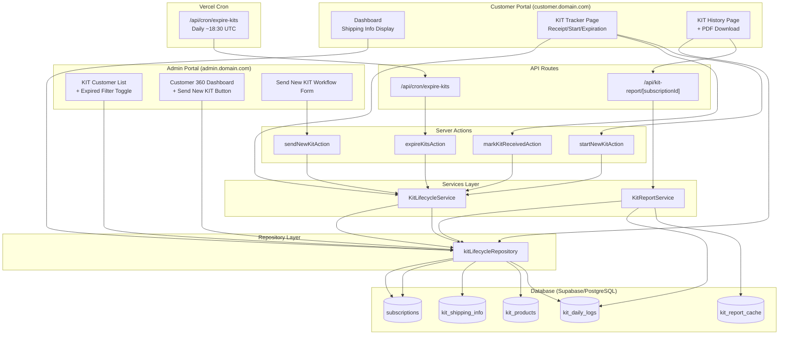
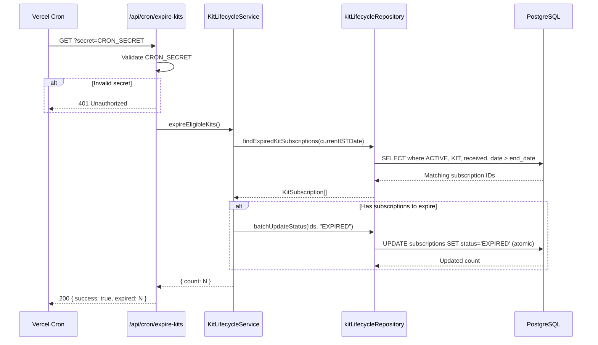
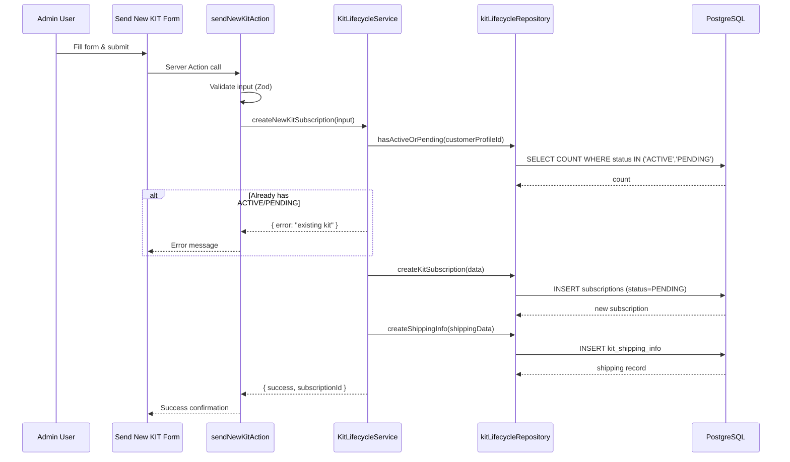
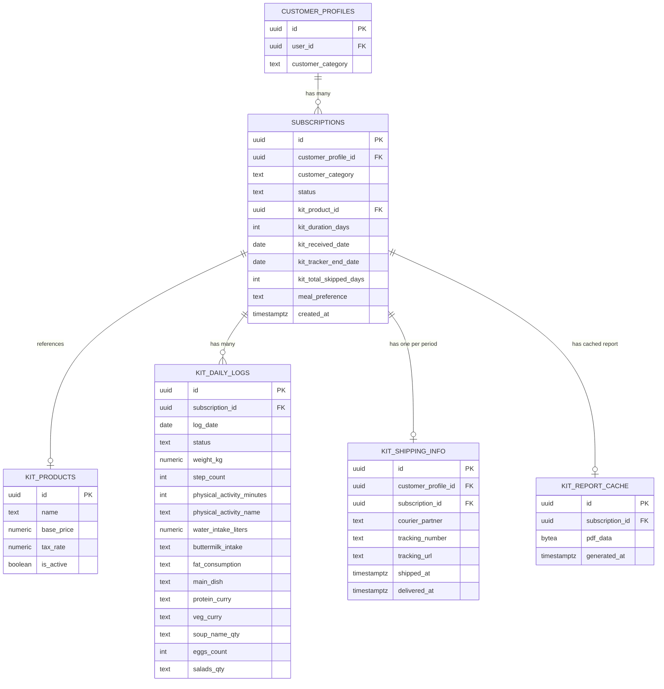

# Design Document: KIT Lifecycle Management

## Overview

This design extends the existing KIT subscription system to support the full recurring lifecycle: automated expiration detection, admin-initiated renewal workflows, customer-facing arrival/start flows, expiration messaging, a KIT History page, and PDF report generation per KIT period.

The system currently supports a single active KIT per customer with daily tracking and onboarding/shipping. This feature adds lifecycle state transitions (ACTIVE → EXPIRED), multi-KIT history, and self-service tooling for both admins and customers.

### Design Decisions

1. **Cron-based expiration over event-driven**: Vercel Cron Jobs already power daily automations (order generation, product linking, dispatch). Adding expiration detection as another cron fits the established pattern and keeps infrastructure simple.
2. **Server-side PDF generation with `@react-pdf/renderer`**: Chosen over Puppeteer (too heavy for serverless) and jsPDF (limited layout control). React-PDF generates PDFs in Node.js with a React-like component API, fitting the project's TypeScript/React ecosystem.
3. **Repository pattern for new data access**: Follows the existing `src/repositories/` convention. A new `kitLifecycleRepository.ts` isolates all lifecycle-specific queries.
4. **Partial unique index for at-most-one constraint**: PostgreSQL partial unique indexes enforce the business rule that at most one PENDING or ACTIVE KIT subscription exists per customer, matching the existing `uq_active_subscription_per_category` pattern.
5. **Cached PDF for expired KITs, dynamic for active**: Expired KIT data is immutable, so caching the generated PDF avoids redundant computation. Active KIT PDFs are generated on-demand to reflect the latest daily log data.

## Architecture

### System Architecture Diagram



### Request Flow — Expiration Cron



### Request Flow — Send New KIT



## Components and Interfaces

### New Files to Create

| Layer | Path | Purpose |
|-------|------|---------|
| API Route | `src/app/api/cron/expire-kits/route.ts` | Expiration cron endpoint |
| API Route | `src/app/api/kit-report/[subscriptionId]/route.ts` | PDF generation & download |
| Service | `src/services/KitLifecycleService.ts` | Expiration logic, new KIT creation, eligibility |
| Service | `src/services/KitReportService.ts` | PDF generation, caching |
| Repository | `src/repositories/kitLifecycleRepository.ts` | All lifecycle data access |
| Action | `src/actions/admin-actions/kitLifecycleActions.ts` | Send New KIT, eligibility checks |
| Action | `src/actions/kitLifecycleActions.ts` | Customer-facing: mark received, start KIT |
| Component | `src/shared/components/admin/customers/SendNewKitForm.tsx` | Multi-section workflow form |
| Component | `src/shared/components/admin/customers/KitEligibilityBadge.tsx` | Eligibility indicator on 360 |
| Component | `src/shared/components/customer/kit-tracker/KitExpirationMessage.tsx` | Expiration messaging |
| Component | `src/shared/components/customer/kit-tracker/StartNewKitFlow.tsx` | Date picker + start button |
| Component | `src/shared/components/customer/kit-tracker/NewKitArrivalBanner.tsx` | Arrival notification banner |
| Page | `src/app/customer/(main)/kit-history/page.tsx` | KIT History server component page |
| Component | `src/shared/components/customer/kit-history/KitHistoryTable.tsx` | History table/cards |
| Component | `src/shared/components/customer/kit-history/KitReportDownloadButton.tsx` | PDF download trigger |
| Type | `src/types/kitLifecycle.ts` | Lifecycle-specific type definitions |
| Validation | `src/validations/kitLifecycleSchema.ts` | Zod schemas for new KIT form |
| Migration | `scripts/add-kit-lifecycle-support.sql` | Partial unique index, cache table |

### Existing Files to Modify

| File | Changes |
|------|---------|
| `vercel.json` | Add expire-kits cron schedule |
| `src/shared/components/layout/customer-sidebar.tsx` | Add "KIT History" nav item |
| `src/shared/components/admin/customers/KitCustomerSection.tsx` | Add "Show Expired" toggle |
| `src/shared/components/admin/customers/Customer360Dashboard.tsx` | Add "Send New KIT" button |
| `src/app/customer/(main)/kit-tracker/page.tsx` | Add expiration/new-kit state handling |
| `src/app/customer/(main)/dashboard/KitDashboard.tsx` | Show new KIT shipping info |
| `package.json` | Add `@react-pdf/renderer` dependency |

### Interface Contracts

```typescript
// src/types/kitLifecycle.ts

export type KitSubscriptionStatus = "ACTIVE" | "EXPIRED" | "PENDING";

export interface KitSubscriptionSummary {
  id: string;
  customer_profile_id: string;
  status: KitSubscriptionStatus;
  kit_product_id: string;
  kit_product_name: string;
  kit_duration_days: number;
  kit_received_date: string | null;
  kit_tracker_end_date: string | null;
  kit_total_skipped_days: number;
  meal_preference: string | null;
  created_at: string;
}

export interface KitHistoryEntry {
  id: string;
  orderDate: string;
  kitProductName: string;
  kitDays: number;
  daysTakenMeal: number;
  daysSkipped: number;
  status: KitSubscriptionStatus;
  shippingStatus: "Not Shipped" | "Shipped" | "Delivered";
  canDownloadReport: boolean;
}

export interface SendNewKitInput {
  customerProfileId: string;
  kitProductId: string;
  kitDurationDays: number;
  mealPreference: "Veg" | "Egg" | "Chicken";
  addressId: string;
  newAddress?: {
    addressLine: string;
    city: string;
    state: string;
    pinCode: string;
  };
  courierPartner: "OTHER" | "APSRTC" | "TGSRTC" | "DTDC";
  trackingNumber: string;
  trackingUrl?: string;
}

export interface KitEligibility {
  eligible: boolean;
  reason?: "expired" | "expiring_soon" | "not_eligible";
  daysRemaining?: number;
}

export interface ExpireCronsResult {
  success: boolean;
  expired: number;
  error?: string;
}
```

### Service Interfaces

```typescript
// src/services/KitLifecycleService.ts

export interface IKitLifecycleService {
  /** Find all ACTIVE KIT subscriptions past their tracker end date */
  findExpirableSubscriptions(currentISTDate: string): Promise<string[]>;
  
  /** Atomically transition subscriptions to EXPIRED */
  expireSubscriptions(subscriptionIds: string[]): Promise<number>;
  
  /** Check if admin can send a new KIT to this customer */
  checkEligibility(customerProfileId: string): Promise<KitEligibility>;
  
  /** Create a new KIT subscription + shipping info */
  createNewKit(input: SendNewKitInput): Promise<{ subscriptionId: string }>;
  
  /** Mark a PENDING KIT as received (delivered_at) */
  markKitReceived(subscriptionId: string, customerId: string): Promise<void>;
  
  /** Start a new KIT (set received_date, compute end_date, activate) */
  startNewKit(subscriptionId: string, startDate: string, customerId: string): Promise<void>;
  
  /** Get all KIT subscriptions for history display */
  getKitHistory(customerProfileId: string): Promise<KitHistoryEntry[]>;
}
```

```typescript
// src/services/KitReportService.ts

export interface IKitReportService {
  /** Generate or retrieve cached PDF for a KIT subscription */
  generateReport(subscriptionId: string, customerProfileId: string): Promise<Buffer>;
  
  /** Check if a cached report exists for an expired KIT */
  hasCachedReport(subscriptionId: string): Promise<boolean>;
}
```

## Data Models

### Existing Tables (Extended)

#### `subscriptions` (existing — no schema changes needed)

The table already has all needed columns from previous migrations:

| Column | Type | Notes |
|--------|------|-------|
| id | UUID | PK |
| customer_profile_id | UUID | FK → customer_profiles |
| customer_category | TEXT | 'KIT', 'MEAL', 'ACCOMMODATION' |
| status | TEXT | 'PENDING', 'ACTIVE', 'EXPIRED', 'CANCELLED' |
| kit_product_id | UUID | FK → kit_products |
| kit_duration_days | INTEGER | Days in the KIT period |
| kit_received_date | DATE | Customer-confirmed receipt date |
| kit_tracker_end_date | DATE | Computed end date |
| kit_total_skipped_days | INTEGER | Maintained by trigger |
| meal_preference | TEXT | 'Veg', 'Egg', 'Chicken' |
| created_at | TIMESTAMPTZ | Record creation |

**Existing Constraint**: `chk_kit_product_required` — KIT subscriptions must have kit_product_id and kit_duration_days.

**Existing Constraint**: `chk_kit_tracker_fields_kit_only` — Non-KIT subscriptions must have tracker fields null/zero.

#### `kit_shipping_info` (existing — no schema changes needed)

| Column | Type | Notes |
|--------|------|-------|
| id | UUID | PK |
| customer_profile_id | UUID | FK → customer_profiles |
| subscription_id | UUID | FK → subscriptions |
| courier_partner | TEXT | 'OTHER', 'APSRTC', 'TGSRTC', 'DTDC' |
| tracking_number | TEXT | Courier tracking ID |
| tracking_url | TEXT | Required when courier = 'OTHER' |
| shipped_at | TIMESTAMPTZ | When admin shipped |
| delivered_at | TIMESTAMPTZ | When customer confirmed receipt |
| created_at | TIMESTAMPTZ | Record creation |

#### `kit_daily_logs` (existing — no schema changes needed)

| Column | Type | Notes |
|--------|------|-------|
| id | UUID | PK |
| subscription_id | UUID | FK → subscriptions |
| log_date | DATE | Day of tracking |
| status | TEXT | 'FOOD_TAKEN', 'FOOD_SKIPPED' |
| weight_kg | NUMERIC | |
| step_count | INTEGER | |
| physical_activity_minutes | INTEGER | |
| physical_activity_name | TEXT | |
| water_intake_liters | NUMERIC | |
| buttermilk_intake | TEXT | |
| fat_consumption | TEXT | |
| main_dish | TEXT | |
| protein_curry | TEXT | |
| veg_curry | TEXT | |
| soup_name_qty | TEXT | |
| eggs_count | INTEGER | |
| salads_qty | TEXT | |

### New Table: `kit_report_cache`

Stores pre-generated PDF reports for EXPIRED KIT subscriptions to avoid regeneration.

```sql
CREATE TABLE IF NOT EXISTS public.kit_report_cache (
  id UUID PRIMARY KEY DEFAULT gen_random_uuid(),
  subscription_id UUID NOT NULL REFERENCES public.subscriptions(id) ON DELETE CASCADE,
  pdf_data BYTEA NOT NULL,
  generated_at TIMESTAMPTZ NOT NULL DEFAULT NOW(),
  CONSTRAINT uq_kit_report_cache_subscription UNIQUE (subscription_id)
);

COMMENT ON TABLE public.kit_report_cache IS
  'Caches generated PDF reports for EXPIRED KIT subscriptions. One report per subscription.';
```

### New Index: Partial Unique for At-Most-One Active/Pending

The existing `uq_active_subscription_per_category` partial unique index already enforces at most one PENDING or ACTIVE subscription per (customer_profile_id, customer_category). This migration verifies it exists and creates if missing:

```sql
-- Verify or create the partial unique constraint
CREATE UNIQUE INDEX IF NOT EXISTS uq_active_subscription_per_category
  ON public.subscriptions (customer_profile_id, customer_category)
  WHERE status IN ('PENDING', 'ACTIVE');
```

### Entity Relationship Diagram




## Correctness Properties

*A property is a characteristic or behavior that should hold true across all valid executions of a system — essentially, a formal statement about what the system should do. Properties serve as the bridge between human-readable specifications and machine-verifiable correctness guarantees.*

### Property 1: Expiration Filter Biconditional

*For any* KIT subscription record with known status, customer_category, kit_received_date, and tracker_end_date relative to a given current IST date, the expiration filter SHALL select it if and only if: status is ACTIVE, customer_category is "KIT", kit_received_date is not null, and current_date > tracker_end_date.

**Validates: Requirements 1.2, 1.7**

### Property 2: Expiration Idempotence

*For any* set of KIT subscriptions where the expiration cron has already executed successfully, executing the cron again on the same day SHALL return a count of 0 and SHALL NOT produce duplicate state transitions or errors.

**Validates: Requirements 1.8**

### Property 3: Atomicity of Batch Expiration

*For any* non-empty set of subscription IDs passed to the batch-expire function, either ALL subscriptions transition to EXPIRED status or NONE do (no partial state changes persist).

**Validates: Requirements 1.3, 1.5**

### Property 4: KIT Customer List Filter Correctness

*For any* set of KIT customers with varying most-recent subscription statuses, the default list SHALL contain only those whose most recent status is ACTIVE or PENDING, the expired-filtered list SHALL contain only those whose most recent status is EXPIRED, and when both "Show Archived" and "Show Expired" are active, the result is the union (each customer appearing at most once).

**Validates: Requirements 2.1, 2.3, 2.6**

### Property 5: Send New KIT Eligibility

*For any* customer with a KIT subscription history, the "Send New KIT" button SHALL be visible if and only if: (a) the most recent subscription is EXPIRED, OR (b) the most recent subscription is ACTIVE with ≤ 5 days remaining to tracker_end_date, AND (c) no subscription with status PENDING exists for that customer, AND (d) at least one KIT subscription exists.

**Validates: Requirements 3.1, 3.2, 3.3, 3.4, 3.5, 3.6**

### Property 6: KIT Duration Validation

*For any* integer value provided as KIT duration, the validation SHALL accept it if and only if it is between 1 and 365 inclusive.

**Validates: Requirements 4.3**

### Property 7: Address Validation

*For any* address input, validation SHALL accept it if and only if: address_line has length ≥ 5 characters after trimming, AND pin_code is exactly 6 digits.

**Validates: Requirements 4.6**

### Property 8: Form Submission Creates Correct Records

*For any* valid Send New KIT form input where the customer has no PENDING/ACTIVE KIT subscription, submission SHALL create a subscription record with status PENDING, the specified kit_product_id, kit_duration_days, and meal_preference, AND a kit_shipping_info record with the specified courier_partner, tracking_number, tracking_url (if applicable), and shipped_at set to current timestamp.

**Validates: Requirements 4.9, 4.10**

### Property 9: KIT Tracker Display State Machine

*For any* customer with KIT subscriptions in various states, the KIT Tracker page SHALL evaluate display states in the following priority order and display the FIRST matching state: (1) if a newer KIT subscription has delivered_at set in kit_shipping_info → show "Start your new KIT" flow; (2) if a newer KIT subscription has shipped_at set but delivered_at null → show "New KIT has been sent" banner with "Mark as Received"; (3) if a newer KIT subscription exists with no shipping info → show "order being processed"; (4) if most recent KIT is EXPIRED with no newer PENDING/ACTIVE → show expiration message.

**Validates: Requirements 5.2, 5.3, 5.4, 7.1, 7.3, 7.4, 7.5**

### Property 10: Mark Received Sets Delivered_At Only

*For any* PENDING KIT subscription with a kit_shipping_info record, marking it as received SHALL set delivered_at to the current timestamp AND SHALL NOT modify kit_received_date (it remains null).

**Validates: Requirements 6.1**

### Property 11: Start Date Validation Bounds

*For any* date selected for starting a new KIT, the date SHALL be accepted if and only if: date ≤ current server date (IST) AND date ≥ kit_shipping_info.delivered_at date.

**Validates: Requirements 6.3**

### Property 12: Start KIT Computes Correct End Date and Activates

*For any* PENDING KIT subscription with kit_duration_days D and kit_total_skipped_days S, when started with a valid date R, the system SHALL set kit_received_date = R, kit_tracker_end_date = R + (D - 1) + S, and status = ACTIVE.

**Validates: Requirements 6.4**

### Property 13: Start KIT Rejected With Existing ACTIVE

*For any* customer who already has a KIT subscription with status ACTIVE, attempting to start a new KIT (transition PENDING → ACTIVE) SHALL be rejected and the PENDING subscription's status SHALL remain unchanged.

**Validates: Requirements 6.5**

### Property 14: Shipping Status Derivation

*For any* kit_shipping_info record, the derived shipping status SHALL be: "Not Shipped" when shipped_at is null, "Shipped" when shipped_at is set and delivered_at is null, "Delivered" when delivered_at is set.

**Validates: Requirements 8.5**

### Property 15: KIT History Ordering

*For any* set of KIT subscriptions for a customer, the history page SHALL display them in descending order of created_at (newest first).

**Validates: Requirements 8.2**

### Property 16: Report Date Range Coverage

*For any* KIT subscription with status ACTIVE and kit_received_date R, the PDF report SHALL contain entries for each calendar day from R through the current date. For any KIT subscription with status EXPIRED, kit_received_date R, and kit_tracker_end_date E, the PDF report SHALL contain entries for each calendar day from R through E.

**Validates: Requirements 9.1, 10.1**

### Property 17: Report Daily Log Formatting

*For any* day within a KIT report's date range: if a daily log exists with status FOOD_TAKEN, the entry SHALL include all activity and nutrition fields; if a daily log exists with status FOOD_SKIPPED, the entry SHALL display only date and status; if no daily log exists, the entry SHALL display "No Data Logged".

**Validates: Requirements 9.2, 9.3, 10.2**

### Property 18: Report Summary Totals Correctness

*For any* EXPIRED KIT subscription, the PDF summary section SHALL contain: total_days_taken_meal equal to the count of FOOD_TAKEN daily logs, total_days_skipped equal to kit_total_skipped_days, and total_duration equal to kit_duration_days + kit_total_skipped_days.

**Validates: Requirements 10.3**

### Property 19: PDF Authorization

*For any* PDF download request with an authenticated customer_profile_id and a target subscription_id, the download SHALL succeed if and only if the subscription's customer_profile_id matches the requesting customer's profile ID.

**Validates: Requirements 9.7**

### Property 20: Expired Report Caching Idempotence

*For any* EXPIRED KIT subscription, generating the PDF report and then requesting it again SHALL return the same cached content without regeneration (the pdf_data from kit_report_cache).

**Validates: Requirements 10.4**

### Property 21: At-Most-One Active/Pending Constraint

*For any* customer_profile_id, there SHALL exist at most one KIT subscription with status IN (PENDING, ACTIVE) at any given time. Attempting to create a second SHALL be rejected.

**Validates: Requirements 11.2, 11.3, 11.4**

### Property 22: Data Isolation Per Subscription Period

*For any* customer with multiple KIT subscriptions, querying kit_daily_logs by subscription_id SHALL return ONLY logs belonging to that specific subscription period, and querying kit_shipping_info by subscription_id SHALL return ONLY shipping records for that specific subscription.

**Validates: Requirements 11.6, 11.7**

### Property 23: Category Isolation

*For any* KIT lifecycle action (expiration, new KIT creation, history query, report generation), the action SHALL only read/modify subscriptions where customer_category = "KIT". If invoked with a subscription_id or customer_profile_id whose relevant subscription has customer_category ≠ "KIT", the action SHALL reject the operation without data modification.

**Validates: Requirements 12.1, 12.2, 12.3, 12.5, 12.6**

## Error Handling

### Cron Endpoint Errors

| Scenario | Response | Behavior |
|----------|----------|----------|
| Invalid CRON_SECRET | HTTP 401 `{ error: "Unauthorized" }` | No database operations performed |
| Database connection failure | HTTP 500 `{ success: false, error: "..." }` | Transaction rolled back, all subscriptions unchanged |
| Partial update failure | HTTP 500 | Entire batch rolled back (atomic) |
| No subscriptions to expire | HTTP 200 `{ success: true, expired: 0 }` | Idempotent success |

### Send New KIT Errors

| Scenario | Response | Behavior |
|----------|----------|----------|
| Existing PENDING subscription | `{ success: false, error: "A pending KIT already exists" }` | Form remains open with values preserved |
| Invalid form data (Zod) | `{ success: false, error: validation messages }` | Per-field error display |
| Database insert failure | `{ success: false, error: "Could not create KIT order" }` | No partial records created, form preserved |
| Customer not found | `{ success: false, error: "Customer not found" }` | Action rejected |
| Category mismatch | `{ success: false, error: "Category mismatch" }` | No modification |

### Start New KIT Errors

| Scenario | Response | Behavior |
|----------|----------|----------|
| Another ACTIVE subscription exists | `{ success: false, error: "Existing KIT must expire first" }` | PENDING status unchanged, date preserved |
| Date in future | `{ success: false, error: "Date cannot be in the future" }` | No modification |
| Date before delivered_at | `{ success: false, error: "Date cannot be before delivery" }` | No modification |
| Database error | `{ success: false, error: "KIT could not be started" }` | PENDING status unchanged |

### PDF Generation Errors

| Scenario | Response | Behavior |
|----------|----------|----------|
| Subscription not found | HTTP 404 | No PDF served |
| Authorization failure | HTTP 403 | No PDF served |
| Category mismatch | HTTP 403 | No PDF served |
| Database error | HTTP 500 `{ error: "Report could not be generated" }` | No partial PDF |
| Generation timeout (>30s) | HTTP 500 `{ error: "Report generation timed out" }` | No partial PDF |
| PENDING subscription | HTTP 400 `{ error: "Report not available for pending subscriptions" }` | Download blocked |

## Testing Strategy

### Property-Based Testing (PBT)

**Library**: `fast-check` (already used in the project for KIT tracker tests)
**Configuration**: Minimum 100 iterations per property test
**Location**: `src/actions/__tests__/kitLifecycle.property.test.ts` and `src/services/__tests__/kitLifecycle.property.test.ts`

Each property test MUST:
- Run minimum 100 iterations (`{ numRuns: 100 }`)
- Reference its design property with a tag comment
- Use generators that produce diverse, edge-case-rich inputs
- Test pure logic functions extracted from service/repository layers

**PBT Coverage:**
- Property 1 (Expiration filter) — Generate random subscription records, verify filter biconditional
- Property 5 (Eligibility) — Generate subscription histories, verify eligibility function
- Property 6 (Duration validation) — Generate random integers, verify acceptance range
- Property 7 (Address validation) — Generate random strings/numbers, verify rules
- Property 9 (Display state machine) — Generate subscription state combinations, verify priority selection
- Property 11 (Start date bounds) — Generate random dates relative to delivered_at and today
- Property 12 (End date computation) — Generate random duration/skipped values, verify formula
- Property 14 (Shipping status) — Generate random shipped_at/delivered_at combinations
- Property 16 (Report date range) — Generate random date ranges, verify coverage
- Property 17 (Log formatting) — Generate daily log variants, verify format rules
- Property 18 (Summary totals) — Generate random log sets, verify computed totals
- Property 21 (Constraint) — Generate insertion attempts, verify single ACTIVE/PENDING
- Property 23 (Category isolation) — Generate mixed categories, verify isolation

**Tag Format**: `Feature: kit-lifecycle-management, Property {N}: {description}`

### Unit Testing (Example-Based)

**Framework**: Vitest (existing)
**Location**: Co-located `__tests__/` directories

- CRON_SECRET validation (valid/invalid)
- Form field completeness → submit button enabled/disabled
- KIT product dropdown renders active products
- Status badge color mapping (ACTIVE=green, PENDING=yellow, EXPIRED=gray)
- WhatsApp support link format
- Responsive card layout at <768px breakpoint
- PDF header content validation
- Error message display on failure scenarios

### Integration Testing

- End-to-end cron execution flow with test database
- Send New KIT → customer sees shipping info
- Full lifecycle: create → ship → receive → start → track → expire → renew
- PDF generation for active and expired subscriptions
- Partial unique index enforcement at database level

### Test File Structure

```
src/
├── actions/__tests__/
│   └── kitLifecycle.property.test.ts    # PBT for action-level logic
├── services/__tests__/
│   ├── KitLifecycleService.test.ts      # Unit tests for service
│   ├── KitLifecycleService.property.test.ts  # PBT for service logic
│   └── KitReportService.test.ts         # Unit tests for PDF service
├── shared/components/admin/customers/__tests__/
│   └── SendNewKitForm.test.tsx          # Component unit tests
└── shared/components/customer/kit-tracker/__tests__/
    └── displayState.property.test.ts    # PBT for display state machine
```
