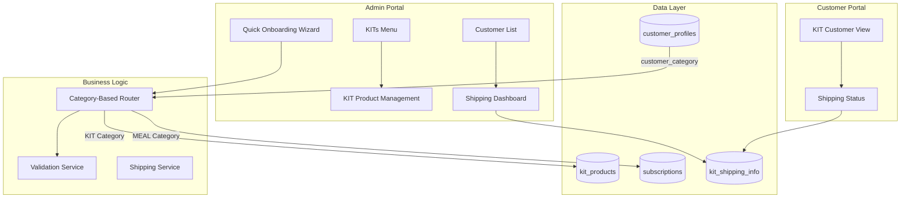
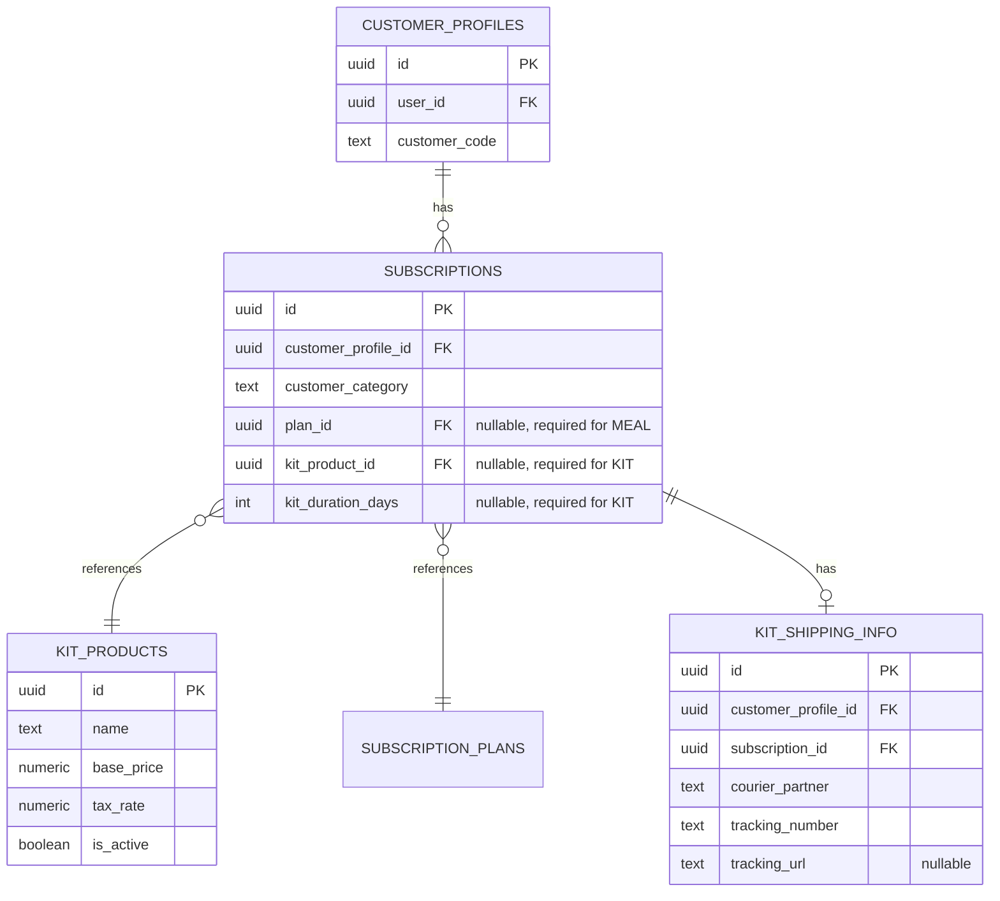

# Design Document: KIT Subscription Management

## Overview

The KIT Subscription Management feature introduces a completely isolated subscription category for one-time purchases of ready-to-eat meal packages (KITs), operating independently from the existing meal subscription system. This design ensures strict separation between KIT and meal subscription business logic while reusing the platform's authentication, payment, and customer management infrastructure.

### Key Design Principles

1. **Complete Isolation**: KIT subscriptions operate independently from meal subscriptions using the `customer_category` discriminator pattern
2. **Validation Bypass**: KIT customers can be onboarded from any location, bypassing the PIN code serviceable area constraints that apply to meal subscriptions
3. **Simplified Fulfillment**: KIT orders use courier-based shipping rather than the rider-based daily delivery system
4. **Shared Infrastructure**: KIT subscriptions reuse existing customer identity, payment processing, and admin portal infrastructure

### Business Context

The platform currently supports recurring meal subscriptions with daily delivery via assigned riders within serviceable PIN code areas. KIT subscriptions differ fundamentally:

- **One-time purchase** vs. recurring subscription
- **Courier delivery** vs. rider delivery
- **National availability** vs. PIN code-constrained service areas
- **Package fulfillment** vs. daily meal preparation and delivery

This design maintains strict boundaries between these two business models to prevent cross-contamination of business rules while maximizing code reuse at the infrastructure level.

## Architecture

### System Components



### Portal Routing Strategy

The system uses middleware-based subdomain routing. The existing admin and customer portals will be extended with KIT-specific sections:

- **Admin Portal** (`admin.domain.com`): Adds KITs menu under Subscriptions navigation, extends Quick Onboarding with category selection, adds Shipping dashboard
- **Customer Portal** (`customer.domain.com`): Category-based view rendering that shows KIT-specific interface for KIT customers

### Category-Based Discrimination

The system uses the existing `subscriptions.customer_category` discriminator field to route business logic:

```typescript
type CustomerCategory = 'MEAL' | 'KIT' | 'ACCOMMODATION';
```

All category-dependent logic branches on this field:
- Onboarding validation rules
- UI component rendering
- Business rule application
- Portal view selection

## Components and Interfaces

### 1. KIT Product Management

**Location**: `src/app/admin/(main)/subscriptions/kits/`

**Components**:
- `page.tsx`: KIT products list page (Server Component)
- `KitProductCard.tsx`: Product display card showing name, price, tax calculation
- `AddKitProductDialog.tsx`: Form for creating new KIT products (Client Component)

**Server Actions**:
- `kitProductActions.ts`:
  - `createKitProductAction(name: string, price: number)`: Creates new KIT product with 5% tax rate
  - `listKitProductsAction()`: Returns all active KIT products for admin views

**Data Types**:
```typescript
interface KitProduct {
  id: string;
  name: string;
  base_price: number;
  tax_rate: number; // Fixed at 0.05
  created_at: Date;
  is_active: boolean;
}
```

### 2. Quick Onboarding Extension

**Location**: Extends existing `src/app/admin/(main)/customers/quick-onboard/`

**Modified Components**:
- `Step2SubscriptionForm.tsx`: Adds category selection, conditionally renders KIT product dropdown vs. subscription plan dropdown, adds Days field for KIT duration

**Modified Validation**:
- `src/validations/onboardingSchema.ts`:
  - Extends `quickOnboardingSchema` with `kitProductId?: string` and `kitDurationDays?: number`
  - Makes `planId` conditional based on `primaryCategory`

**Modified Actions**:
- `src/actions/admin-actions/onboardingActions.ts`:
  - `onboardCustomerAction`: Branches validation logic based on `primaryCategory`
  - For KIT category: Uses `kitProductId` and `kitDurationDays` instead of `planId`
  - For KIT category: Skips PIN code serviceability validation

**Validation Logic**:
```typescript
// Pseudo-code for validation branching
if (input.primaryCategory === 'KIT') {
  // Validate KIT-specific fields
  schema = z.object({
    kitProductId: z.string().uuid(),
    kitDurationDays: z.number().min(1),
    address: addressSchema.omit({ pincodeServiceability: true })
  });
} else if (input.primaryCategory === 'MEAL') {
  // Validate MEAL-specific fields  
  schema = z.object({
    planId: z.string().uuid(),
    address: addressSchema.refine(isPincodeServiceable)
  });
}
```

### 3. Address Validation Service

**Location**: `src/lib/address/validatePincode.ts`

**Modified Functions**:
- `validateAddressForCategory(address: Address, category: CustomerCategory)`: Category-aware validation
  - Returns `{ valid: true }` for KIT category with any valid Indian PIN format
  - Returns `{ valid: boolean, serviceable: boolean }` for MEAL category

**Validation Rules**:
```typescript
function validateAddressForCategory(address: Address, category: CustomerCategory) {
  if (category === 'KIT') {
    // Only validate PIN format (6 digits), skip serviceability
    return { valid: /^\d{6}$/.test(address.pincode) };
  } else if (category === 'MEAL') {
    // Validate format AND serviceability
    return {
      valid: /^\d{6}$/.test(address.pincode),
      serviceable: isInRiderServiceArea(address.pincode)
    };
  }
}
```

### 4. Shipping Dashboard

**Location**: `src/app/admin/(main)/customers/[id]/shipping/`

**Components**:
- `ShippingDashboard.tsx`: Modal/page for managing shipping information (Client Component)
- `CourierForm.tsx`: Form with courier partner dropdown, tracking number input, conditional URL field

**Server Actions**:
- `shippingActions.ts`:
  - `saveShippingInfoAction(customerId: string, shippingData: ShippingInfo)`: Persists courier and tracking details
  - `getShippingInfoAction(customerId: string)`: Retrieves shipping information for display

**Data Types**:
```typescript
type CourierPartner = 'OTHER' | 'APSRTC' | 'TGSRTC' | 'DTDC';

interface ShippingInfo {
  id: string;
  customer_profile_id: string;
  subscription_id: string;
  courier_partner: CourierPartner;
  tracking_number: string;
  tracking_url?: string; // Required only when courier_partner === 'OTHER'
  shipped_at?: Date;
  delivered_at?: Date;
}
```

### 5. Customer List Extension

**Location**: Extends existing `src/app/admin/(main)/customers/page.tsx`

**Modified Components**:
- `CustomerListItem.tsx`: Conditionally renders "Shipping" button based on `customer_category`

**Conditional Rendering**:
```typescript
{customer.customer_category === 'KIT' && (
  <Button onClick={() => openShippingDashboard(customer.id)}>
    <Truck className="h-4 w-4" />
    Shipping
  </Button>
)}
```

### 6. Customer Portal KIT View

**Location**: `src/app/customer/(main)/dashboard/`

**Modified Components**:
- `page.tsx`: Category-based view selection
- `KitDashboard.tsx`: KIT-specific dashboard showing order status, shipping information
- `ShippingTracker.tsx`: Tracking information display with courier partner and tracking link

**View Selection Logic**:
```typescript
// Server Component
export default async function CustomerDashboard() {
  const profile = await getCurrentCustomerProfile();
  const subscriptions = await getCustomerSubscriptions(profile.id);
  
  // Determine primary category from active subscription
  const primaryCategory = subscriptions.find(s => s.status === 'ACTIVE')?.customer_category;
  
  if (primaryCategory === 'KIT') {
    return <KitDashboard subscriptions={subscriptions} />;
  } else {
    return <MealDashboard subscriptions={subscriptions} />;
  }
}
```

## Data Models

### Database Schema Changes

#### New Table: `kit_products`

```sql
CREATE TABLE public.kit_products (
  id UUID PRIMARY KEY DEFAULT gen_random_uuid(),
  name TEXT NOT NULL,
  base_price NUMERIC(10, 2) NOT NULL CHECK (base_price > 0),
  tax_rate NUMERIC(5, 4) NOT NULL DEFAULT 0.05 CHECK (tax_rate >= 0),
  created_at TIMESTAMPTZ NOT NULL DEFAULT now(),
  updated_at TIMESTAMPTZ NOT NULL DEFAULT now(),
  is_active BOOLEAN NOT NULL DEFAULT true
);

-- Index for active products listing
CREATE INDEX idx_kit_products_active ON public.kit_products(is_active) WHERE is_active = true;
```

#### New Table: `kit_shipping_info`

```sql
CREATE TABLE public.kit_shipping_info (
  id UUID PRIMARY KEY DEFAULT gen_random_uuid(),
  customer_profile_id UUID NOT NULL REFERENCES public.customer_profiles(id) ON DELETE CASCADE,
  subscription_id UUID NOT NULL REFERENCES public.subscriptions(id) ON DELETE CASCADE,
  courier_partner TEXT NOT NULL CHECK (courier_partner IN ('OTHER', 'APSRTC', 'TGSRTC', 'DTDC')),
  tracking_number TEXT NOT NULL,
  tracking_url TEXT, -- Required when courier_partner = 'OTHER'
  shipped_at TIMESTAMPTZ,
  delivered_at TIMESTAMPTZ,
  created_at TIMESTAMPTZ NOT NULL DEFAULT now(),
  updated_at TIMESTAMPTZ NOT NULL DEFAULT now(),
  
  -- Ensure tracking_url is provided for 'OTHER' courier
  CONSTRAINT chk_tracking_url_for_other CHECK (
    (courier_partner != 'OTHER') OR (courier_partner = 'OTHER' AND tracking_url IS NOT NULL)
  )
);

-- Index for customer lookups
CREATE INDEX idx_kit_shipping_customer ON public.kit_shipping_info(customer_profile_id);

-- Index for subscription lookups
CREATE INDEX idx_kit_shipping_subscription ON public.kit_shipping_info(subscription_id);
```

#### Modified Table: `subscriptions`

Extends existing table (no schema changes needed - `customer_category` already exists from customer-mobile-onboarding feature):

```sql
-- Existing column from Task 1.2 of customer-mobile-onboarding
-- subscriptions.customer_category TEXT NOT NULL DEFAULT 'MEAL'
-- CHECK (customer_category IN ('MEAL', 'KIT', 'ACCOMMODATION'))

-- Add new nullable foreign key for KIT subscriptions
ALTER TABLE public.subscriptions
  ADD COLUMN IF NOT EXISTS kit_product_id UUID REFERENCES public.kit_products(id);

-- Add KIT duration field
ALTER TABLE public.subscriptions  
  ADD COLUMN IF NOT EXISTS kit_duration_days INTEGER;

-- Add constraint: KIT subscriptions must reference a kit_product
ALTER TABLE public.subscriptions
  ADD CONSTRAINT chk_kit_product_required CHECK (
    (customer_category != 'KIT') OR 
    (customer_category = 'KIT' AND kit_product_id IS NOT NULL AND kit_duration_days IS NOT NULL)
  );

-- Add constraint: MEAL subscriptions must reference a plan
ALTER TABLE public.subscriptions
  ADD CONSTRAINT chk_meal_plan_required CHECK (
    (customer_category != 'MEAL') OR
    (customer_category = 'MEAL' AND plan_id IS NOT NULL)
  );
```

### Data Integrity Rules

1. **Category-Product Binding**: KIT subscriptions MUST have `kit_product_id` and `kit_duration_days`; MEAL subscriptions MUST have `plan_id`
2. **Shipping Requirement**: Every KIT subscription SHOULD have a corresponding `kit_shipping_info` record once shipped
3. **Tracking URL Constraint**: When `courier_partner` is 'OTHER', `tracking_url` is REQUIRED
4. **Single Active Subscription**: The existing partial unique index `uq_active_subscription_per_category` ensures at most one active subscription per customer per category

### Entity Relationships



## Correctness Properties

*A property is a characteristic or behavior that should hold true across all valid executions of a system—essentially, a formal statement about what the system should do. Properties serve as the bridge between human-readable specifications and machine-verifiable correctness guarantees.*

### Property 1: KIT Product Tax Calculation Consistency

*For any* KIT product with a base price, the calculated tax amount SHALL be exactly 5% of the base price, and the total price SHALL equal base price plus tax amount.

**Validates: Requirements 1.5, 10.1**

### Property 2: KIT Product Creation Persistence

*For any* valid KIT product name and price combination, creating a product through the admin portal SHALL result in a persisted product record that can be retrieved with all fields intact (name, price, tax rate).

**Validates: Requirements 1.3, 9.1**

### Property 3: KIT Dropdown Population Completeness

*For any* set of active KIT products in the database, the Kit name dropdown in Quick Onboarding SHALL display all products with their correct names and prices.

**Validates: Requirements 2.2**

### Property 4: PIN Code Validation Bypass for KIT Customers

*For any* valid Indian PIN code format (6 digits), when creating a KIT category subscription, the system SHALL accept the address without enforcing serviceable area validation, while MEAL category subscriptions SHALL continue to enforce serviceability checks.

**Validates: Requirements 3.1, 3.2, 3.3**

### Property 5: Category-Correct Customer Record Creation

*For any* valid KIT onboarding payload that completes successfully, the created customer record SHALL have `customer_category` set to 'KIT', and the associated subscription SHALL reference a valid `kit_product_id`.

**Validates: Requirements 4.4, 9.2**

### Property 6: Shipping Information Persistence and Linkage

*For any* KIT customer with a valid subscription, saving shipping information SHALL create a record correctly linked to both the customer profile and subscription, and the data SHALL be retrievable with all fields intact.

**Validates: Requirements 9.4**

### Property 7: Courier-Specific Tracking URL Enforcement

*For any* shipping information record, when `courier_partner` is set to 'OTHER', the system SHALL require a non-null `tracking_url`, and when set to any other courier option, the `tracking_url` SHALL be optional.

**Validates: Requirements 6.3, 6.4**

### Property 8: Business Rule Isolation for KIT Customers

*For any* customer with `customer_category` = 'KIT', the system SHALL NOT create or apply meal subscription artifacts (subscription_daily_preferences, delivery_orders, delivery_batches, pause credits, rider assignments).

**Validates: Requirements 7.2, 7.5**

### Property 9: Business Rule Isolation for MEAL Customers

*For any* customer with `customer_category` = 'MEAL', the system SHALL NOT create or associate KIT subscription artifacts (kit_shipping_info, kit_product references).

**Validates: Requirements 7.3**

### Property 10: Subscription-Product Binding Integrity

*For any* subscription record, if `customer_category` = 'KIT', then `kit_product_id` and `kit_duration_days` SHALL be non-null and `plan_id` SHALL be null; if `customer_category` = 'MEAL', then `plan_id` SHALL be non-null and `kit_product_id` SHALL be null.

**Validates: Requirements 7.1**

## Error Handling

### Validation Errors

**Category-Specific Validation Failures**:
- **Scenario**: User selects KIT category but product is unavailable
- **Handling**: Display clear error message "Selected KIT product is no longer available. Please refresh and try again."
- **Recovery**: Refresh product list, allow reselection

**Address Validation Errors**:
- **Scenario**: MEAL customer enters non-serviceable PIN
- **Handling**: Display "This PIN code is not in our current service area. Please try a different address."
- **Recovery**: Allow address modification
- **Scenario**: Invalid PIN format (non-6-digit)
- **Handling**: Display "Enter a valid 6-digit PIN code."
- **Recovery**: Inline validation with error message

**Payment Status Errors**:
- **Scenario**: Attempt to complete onboarding with payment status = PENDING
- **Handling**: Disable completion button, display "Payment must be marked as PAID before completing onboarding."
- **Recovery**: Update payment status to PAID

### Data Integrity Errors

**Orphaned KIT Subscriptions**:
- **Scenario**: KIT product deleted while active subscriptions reference it
- **Prevention**: Soft delete pattern - set `is_active = false` instead of hard delete
- **Detection**: Foreign key constraint prevents hard deletion if references exist

**Missing Shipping Information**:
- **Scenario**: KIT subscription has no shipping record
- **Handling**: Display "Shipping information not yet available" in customer portal
- **Recovery**: Admin adds shipping information via Shipping Dashboard

**Tracking URL Constraint Violation**:
- **Scenario**: Save shipping info with courier='OTHER' but no tracking URL
- **Handling**: Database constraint `chk_tracking_url_for_other` prevents insertion
- **User Feedback**: "Tracking URL is required when using 'Other shipping' courier."
- **Recovery**: Display inline validation error on URL field

### Concurrent Modification Errors

**Race Condition on Product Creation**:
- **Scenario**: Two admins create products with same name simultaneously
- **Handling**: No uniqueness constraint on name (business allows duplicate names for different tiers)
- **Impact**: None - multiple products with same name are allowed

**Concurrent Onboarding**:
- **Scenario**: Admin onboards customer while another admin views customer list
- **Handling**: Use optimistic locking or transaction isolation
- **Recovery**: Revalidate customer list cache after onboarding action completes

## Testing Strategy

### Unit Testing

**Focus Areas**:
1. **Category-based validation branching**: Test that validation logic correctly switches between KIT and MEAL rules based on `customer_category`
2. **Tax calculation logic**: Verify 5% tax applied correctly for various price inputs
3. **UI conditional rendering**: Test that KIT-specific and MEAL-specific components render based on category
4. **Form validation schemas**: Verify Zod schemas correctly validate KIT-specific fields

**Example Unit Tests**:
```typescript
describe('validateAddressForCategory', () => {
  it('accepts any valid PIN for KIT category', () => {
    const result = validateAddressForCategory(
      { pincode: '123456', /* other fields */ },
      'KIT'
    );
    expect(result.valid).toBe(true);
  });

  it('enforces serviceability for MEAL category', () => {
    const result = validateAddressForCategory(
      { pincode: '999999', /* other fields */ },
      'MEAL'
    );
    expect(result.valid).toBe(true);
    expect(result.serviceable).toBe(false);
  });
});
```

### Property-Based Testing

The system will use **fast-check** (for TypeScript) to implement property-based tests, with each test running **minimum 100 iterations**.

**Test Configuration**:
```typescript
import fc from 'fast-check';

const PBT_ITERATIONS = 100;

describe('KIT Subscription Properties', () => {
  it('Property 1: Tax calculation consistency', () => {
    fc.assert(
      fc.property(
        fc.float({ min: 1, max: 100000, noNaN: true }),
        (basePrice) => {
          const taxAmount = calculateTax(basePrice, 0.05);
          const total = basePrice + taxAmount;
          
          expect(taxAmount).toBeCloseTo(basePrice * 0.05, 2);
          expect(total).toBeCloseTo(basePrice * 1.05, 2);
        }
      ),
      { numRuns: PBT_ITERATIONS }
    );
  });
  
  // Tag: Feature: kit-subscription-management, Property 1: Tax calculation consistency
});
```

**Property Test Coverage**:

1. **Property 1 (Tax Calculation)**: Generate random product prices (1-100000), verify tax is always 5%
2. **Property 2 (Product Persistence)**: Generate random product names and prices, verify round-trip creation and retrieval
3. **Property 3 (Dropdown Population)**: Generate random sets of products (0-20 products), verify all appear in dropdown
4. **Property 4 (PIN Validation Bypass)**: Generate random valid Indian PINs, verify KIT category accepts all while MEAL enforces serviceability
5. **Property 5 (Category-Correct Records)**: Generate random KIT onboarding data, verify created records have correct category
6. **Property 6 (Shipping Persistence)**: Generate random shipping data combinations, verify persistence and retrieval
7. **Property 7 (Tracking URL Enforcement)**: Generate shipping records with various courier options, verify URL constraint
8. **Property 8 (KIT Business Rule Isolation)**: Generate KIT customer data, verify no meal artifacts created
9. **Property 9 (MEAL Business Rule Isolation)**: Generate MEAL customer data, verify no KIT artifacts created
10. **Property 10 (Subscription-Product Binding)**: Generate subscriptions with different categories, verify correct field nullability

### Integration Testing

**Focus Areas**:
1. **End-to-end KIT onboarding flow**: Test complete wizard flow from category selection through payment and completion
2. **Shipping dashboard workflow**: Test opening dashboard, saving shipping info, viewing in customer portal
3. **Category-based portal rendering**: Test that customer portal displays correct view for KIT vs MEAL customers
4. **Database constraint enforcement**: Test that CHECK constraints and foreign keys prevent invalid data states

**Example Integration Tests**:
- Complete KIT onboarding with various product selections
- Verify shipping information appears in customer portal after admin saves it
- Test that KIT customers cannot trigger meal subscription operations
- Verify invoice generation includes correct KIT product details and tax calculation

### Manual Testing Checklist

**Admin Portal**:
- [ ] KITs menu appears under Subscriptions navigation
- [ ] Three initial KIT products display correctly
- [ ] Add new KIT product flow works
- [ ] Quick Onboarding shows Kit dropdown when KIT category selected
- [ ] Days field appears for KIT category
- [ ] Meal preference field remains visible for KIT
- [ ] PIN code validation does not block non-serviceable areas for KIT
- [ ] Payment & Review shows correct KIT product details
- [ ] Completion disabled until payment marked PAID
- [ ] Customer list shows Shipping button only for KIT customers
- [ ] Shipping Dashboard opens and saves correctly
- [ ] Courier dropdown contains exactly 4 options
- [ ] URL field shows only when "Other shipping" selected

**Customer Portal**:
- [ ] KIT customers see KIT-specific dashboard
- [ ] Shipping status and tracking information visible
- [ ] Meal subscription features not visible to KIT customers
- [ ] Tracking links work correctly for different couriers

**Data Verification**:
- [ ] KIT subscriptions have `customer_category` = 'KIT'
- [ ] KIT subscriptions reference `kit_product_id`
- [ ] Shipping info links correctly to customer and subscription
- [ ] Tracking URL required only for 'OTHER' courier
- [ ] No meal subscription artifacts for KIT customers
- [ ] Invoice shows correct KIT product name, price, 5% tax

## Implementation Notes

### Code Reuse Strategy

**Shared Infrastructure**:
- Authentication and authorization (reuse existing Supabase Auth)
- Payment processing (reuse existing payment recording logic)
- Admin portal navigation and layout (extend existing AdminNavbar)
- Customer identity management (reuse customer_profiles table)

**New Components**:
- KIT product management UI
- KIT-specific onboarding validation
- Shipping dashboard
- Category-based customer portal view selection

### Migration Strategy

1. **Phase 1: Database Schema** (Week 1)
   - Create `kit_products` table
   - Create `kit_shipping_info` table
   - Add `kit_product_id` and `kit_duration_days` to `subscriptions`
   - Add CHECK constraints for category-product binding
   - Seed initial three KIT products

2. **Phase 2: Admin Portal** (Week 2-3)
   - Implement KITs menu and product management
   - Extend Quick Onboarding with category selection
   - Modify validation logic for category-based rules
   - Implement Shipping Dashboard

3. **Phase 3: Customer Portal** (Week 4)
   - Implement category-based view selection
   - Create KIT customer dashboard
   - Implement shipping status display

4. **Phase 4: Testing & Refinement** (Week 5)
   - Property-based tests implementation
   - Integration testing
   - Manual QA
   - Performance testing

### Rollout Plan

**Feature Flag**: Use environment variable `FEATURE_KIT_SUBSCRIPTIONS_ENABLED` to control visibility

**Gradual Rollout**:
1. Enable for internal testing (test email accounts only)
2. Enable for select pilot customers
3. Full rollout to all admins
4. Monitor for 1 week before removing feature flag

### Performance Considerations

**Database Queries**:
- Index on `kit_products.is_active` for fast product listing
- Index on `kit_shipping_info.customer_profile_id` for customer dashboard
- Index on `subscriptions.customer_category` for category-based filtering

**Caching Strategy**:
- Cache active KIT products list (revalidate on product creation)
- Cache customer category for portal view selection
- Invalidate customer list cache after onboarding completion

### Security Considerations

**Access Control**:
- Only admins with "customers" group access can onboard KIT customers
- Only admins can access Shipping Dashboard
- Customers can only view their own shipping information
- Row Level Security (RLS) policies protect `kit_shipping_info` table

**Data Validation**:
- Server-side validation of all KIT product data
- Zod schema validation for onboarding payload
- Database constraints enforce category-product binding
- Tracking URL validation prevents XSS attacks

### Backward Compatibility

**Existing Features**:
- Meal subscription onboarding unchanged
- Existing meal customers unaffected
- Current delivery and rider systems continue operating independently
- No breaking changes to existing APIs or database schema

**Migration Safety**:
- All schema changes are additive (ADD COLUMN IF NOT EXISTS)
- CHECK constraints allow existing MEAL subscriptions to remain valid
- Default value 'MEAL' for `customer_category` ensures existing records compatible
