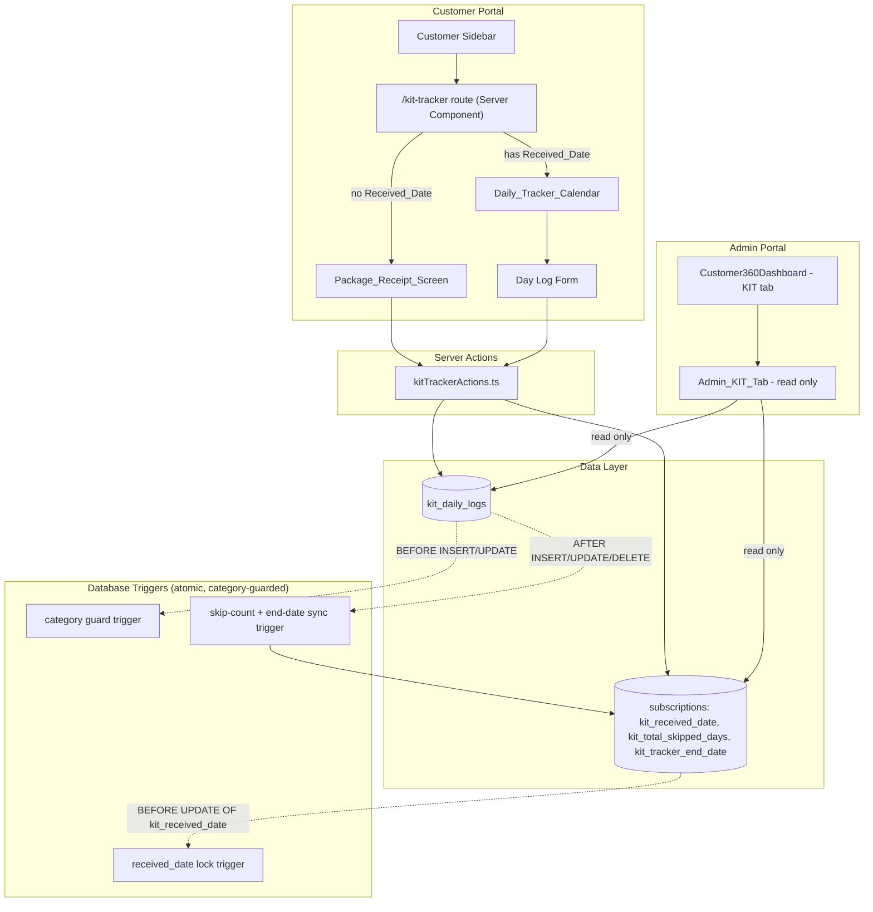
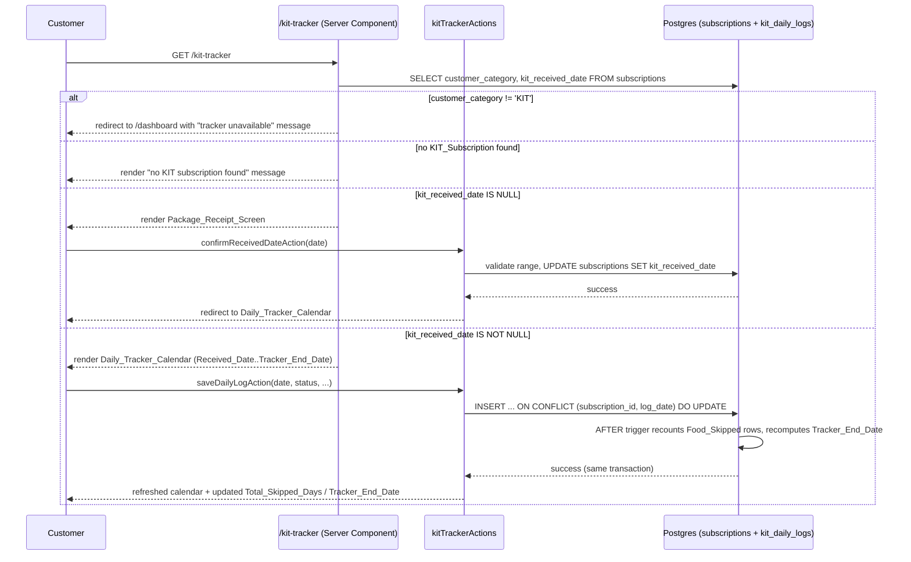
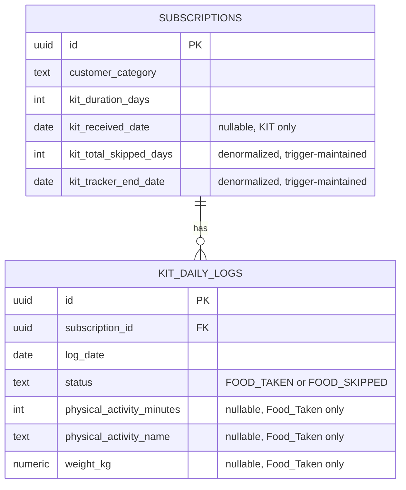

# Design Document: KIT Tracker

## Overview

The KIT Tracker adds a daily interaction facility for KIT customers (`customer_category = 'KIT'`) on top of the existing, purely static "My KIT Order" dashboard delivered by the `kit-subscription-management` feature. Where that dashboard only shows product, timeline, and shipping details, the KIT Tracker lets the customer confirm the date their physical package arrived and then log a daily Food_Taken / Food_Skipped status — optionally with activity and weight — on a calendar running from that receipt date through a dynamically extending end date.

The feature is a new, dedicated navigation section (`KIT Tracker`) in the customer sidebar, a matching read-only tab in the Admin Portal, and a new isolated data model. It reuses the KIT category discriminator and CHECK-constraint pattern already established by `kit-subscription-management`, and reuses the *visual* month-grid pattern of the Meal Planner calendar without sharing any of its components or business logic.

### Key Design Principles

1. **Complete isolation from Meal_Subscription**: a dedicated `kit_daily_logs` table, dedicated KIT-only columns on `subscriptions`, and no code path that touches `subscription_daily_preferences`, `delivery_orders`, or `delivery_batches`.
2. **Category enforcement at the persistence layer**: every write that creates or edits Received_Date or a Daily_Log is guarded by a database trigger that checks `customer_category = 'KIT'` on the referenced subscription, independent of any application-level check.
3. **Definitional consistency for Total_Skipped_Days**: per the requirements glossary, `Total_Skipped_Days` is *defined* as the count of `Food_Skipped` Daily_Log rows for a subscription. The design recomputes it by counting rather than by incrementing/decrementing counters, which trivially guarantees it can never go negative and never drifts from the underlying log data.
4. **Atomicity via same-transaction triggers**: the Total_Skipped_Days recount and Tracker_End_Date recompute happen in an `AFTER` trigger on `kit_daily_logs`, in the same transaction as the Daily_Log write. If the trigger fails, Postgres rolls back the entire statement, including the Daily_Log write — this is what makes the skip-count/status update atomic without any application-level compensating logic.
5. **Reuse without coupling**: the Daily_Tracker_Calendar borrows the month-grid visual structure of `MealPlannerClient` (weekday headers, one card per spanned month) but is an entirely separate component tree with its own server actions and its own data.

### Business Context

KIT customers currently only see the read-only "My KIT Order" dashboard (product, duration, shipping) built by `kit-subscription-management`. That feature intentionally has no daily interaction model — it is a one-time purchase with courier fulfillment. The KIT Tracker introduces the first *recurring, date-based* interaction for KIT customers, structurally similar in shape to the Meal Planner's calendar but with fundamentally different semantics:

- **No delivery**: nothing is dispatched to a rider or a kitchen. The customer already has the physical package.
- **Self-reported adherence**: the customer, not the kitchen or a rider, is the sole source of daily status.
- **Elastic end date**: unlike a meal plan (adjusted via pause credits and `subscription_daily_preferences`), the KIT tracking window stretches by exactly one day for every day skipped, computed directly from the KIT's own log count — no shared pause-credit machinery.

## Architecture

### System Components



### Request Flow: First Visit Through First Log



### Portal Routing Strategy

- **Customer Portal** (`customer.domain.com`): new route `src/app/customer/(main)/kit-tracker/page.tsx`, guarded server-side by `customer_category`. A new `NavItem` is added to `customer-sidebar.tsx`, shown only when `customerCategory === 'KIT'` (the sidebar already resolves and threads `customerCategory` today).
- **Admin Portal** (`admin.domain.com`): no new route. The existing "KIT" tab inside `Customer360Dashboard.tsx` gets its placeholder card replaced with a new read-only `AdminKitTrackerView` component fed by the same `kitSubscription` lookup already performed for that tab.

### Category-Based Discrimination

Reuses the existing discriminator with no changes to its type or allowed values:

```typescript
type CustomerCategory = 'MEAL' | 'KIT' | 'ACCOMMODATION';
```

All KIT Tracker logic branches on `customer_category === 'KIT'` for the *given subscription row* (not just the customer's most recent category), because Requirement 12.3 requires that a KIT_Subscription that later changes category must retain its historical data while losing tracker access — the check must be against the subscription row being acted on, not a cached customer-level flag.

## Components and Interfaces

### 1. Customer Sidebar Extension

**Location**: `src/shared/components/layout/customer-sidebar.tsx` (modified)

**Change**: Add a `KIT Tracker` entry to a KIT-only nav group, rendered only when `isKit` is true (the component already computes `isKit` and filters items for KIT customers today).

```typescript
const kitNavItems: NavItem[] = [
  { name: "KIT Tracker", href: "/kit-tracker", icon: CalendarCheck },
];
// rendered as: {isKit && <NavGroup items={kitNavItems} ... />}
```

### 2. KIT Tracker Route (Customer Portal)

**Location**: `src/app/customer/(main)/kit-tracker/page.tsx` (Server Component)

**Responsibilities**:
- Resolve the customer's KIT_Subscription (the active/pending subscription row with `customer_category = 'KIT'`).
- If the customer's *active* subscription category is not `KIT`, redirect to `/dashboard` with a query flag rendered as a toast/alert ("KIT Tracker is unavailable for your account").
- If no KIT_Subscription row exists at all, render an inline "no KIT subscription found" message (no receipt screen, no calendar).
- Branch on `kit_received_date IS NULL` to render `PackageReceiptScreen` vs `DailyTrackerCalendar`, passing down subscription id, `kit_duration_days`, `kit_received_date`, `kit_tracker_end_date`, `kit_total_skipped_days`, and the current server-clock date (computed server-side, never trusted from the client).
- Fetch all `kit_daily_logs` rows for the subscription in one query and pass them down as the initial calendar data.

### 3. Package_Receipt_Screen

**Location**: `src/shared/components/customer/kit-tracker/PackageReceiptScreen.tsx` (Client Component)

**Props**: `subscriptionId`, `subscriptionStartDate`, `initialReceivedDate` (nullable, for the re-confirm/edit path per Req 2.7), `hasAnyDailyLog` (boolean — when true, this screen is not reachable per Req 2.8, enforced additionally by the route itself refusing to render it).

**Behavior**:
- Date picker defaulting to `new Date()` (server-clock date passed as a prop, not `Date.now()` in the browser).
- Client-side validation mirrors the server: reject dates after today or before `subscriptionStartDate`, keep the previously valid value, show inline error.
- Submits via `confirmReceivedDateAction`; on failure, keeps the user on the screen with the attempted date preserved for retry (Req 2.6).

### 4. Daily_Tracker_Calendar

**Location**: `src/shared/components/customer/kit-tracker/DailyTrackerClient.tsx` (Client Component)

This is a **new, isolated** component — it does not import from `src/shared/components/customer/subscription/manage/meal-planner-client.tsx` and shares no server actions or hooks with it. It reuses only the *visual pattern*: one card per calendar month spanned by the date range, `Su Mo Tu We Th Fr Sa` weekday header row, day cells in a 7-column grid.

**Props**: `subscriptionId`, `receivedDate`, `trackerEndDate`, `totalSkippedDays`, `dailyLogsByDate` (map of `yyyy-MM-dd` → log), `todayServerDate`.

**Behavior**:
- Renders every date from `receivedDate` through `trackerEndDate` inclusive, grouped by month.
- A day cell is editable (clickable to open `DayLogDialog`) only when the date falls within `[receivedDate, todayServerDate]`; dates outside that window render as locked (no future dates, consistent with the Editable_Window definition).
- Each logged day shows a status icon (distinct icon + background color per status) and, for `Food_Taken` with logged values, a small activity-minutes badge and/or weight badge — never the activity name.
- A fixed header area above the grid shows `Total_Skipped_Days` and the current `Tracker_End_Date`, updated optimistically from the server action's return value (no full page reload, satisfying Req 7.7/8.3 at the UI layer even though those are not modeled as PBT properties).

**Sub-component — `DayLogDialog.tsx`**: status toggle (`Food_Taken` / `Food_Skipped`), and when `Food_Taken` is selected, optional numeric fields for `Physical_Activity_Minutes` (0–1440, integer), `Physical_Activity_Name` (≤100 chars), and `Weight_Kg` (0–500, ≤2 decimals). When `Food_Skipped` is selected these three inputs are unmounted entirely (not just disabled), so no stale values can be submitted.

### 5. Server Actions

**Location**: `src/actions/kitTrackerActions.ts`

```typescript
// Confirms or edits the one-time Received_Date. Rejects if a Daily_Log already
// exists for the subscription (Req 2.8) or if the subscription is not KIT (Req 12.2).
async function confirmReceivedDateAction(
  subscriptionId: string,
  receivedDate: string // yyyy-MM-dd
): Promise<{ success: true } | { success: false; error: string }>;

// Creates or updates exactly one Daily_Log for (subscriptionId, logDate).
// Validates Editable_Window and field constraints server-side with Zod before
// the write; the unique constraint and category-guard trigger provide the
// persistence-layer backstop regardless of what the app layer already checked.
async function saveDailyLogAction(
  subscriptionId: string,
  logDate: string, // yyyy-MM-dd
  input:
    | { status: "FOOD_TAKEN"; activityMinutes?: number; activityName?: string; weightKg?: number }
    | { status: "FOOD_SKIPPED" }
): Promise<
  | { success: true; totalSkippedDays: number; trackerEndDate: string }
  | { success: false; error: string }
>;

// Read-only fetch used by both the customer route (initial load) and can be
// reused server-side for the admin view's day-by-day breakdown.
async function getKitTrackerStateAction(
  subscriptionId: string
): Promise<{
  receivedDate: string | null;
  trackerEndDate: string | null;
  totalSkippedDays: number;
  dailyLogs: KitDailyLog[];
}>;
```

**Validation schema** (`src/validations/kitTrackerSchema.ts`):

```typescript
const dailyLogSchema = z.discriminatedUnion("status", [
  z.object({
    status: z.literal("FOOD_TAKEN"),
    activityMinutes: z.number().int().min(0).max(1440).optional(),
    activityName: z.string().max(100).optional(),
    weightKg: z
      .number()
      .min(0)
      .max(500)
      .refine((v) => Math.round(v * 100) === v * 100, "max 2 decimal places")
      .optional(),
  }),
  z.object({ status: z.literal("FOOD_SKIPPED") }),
]);
```

### 6. Admin Portal — Admin_KIT_Tab

**Location**: `src/shared/components/admin/customers/kit-tracker/AdminKitTrackerView.tsx` (Server-fetched data, rendered inside the existing Client Component `Customer360Dashboard.tsx`)

**Change to `Customer360Dashboard.tsx`**: the `{/* Placeholder for future day-wise progress updates */}` card (the "Day-wise progress tracking coming soon" block) is replaced with `<AdminKitTrackerView kitSubscription={kitSubscription} dailyLogs={dailyLogs} />`, using data fetched alongside the existing `kitSubscription` lookup for that tab.

**Behavior** (strictly read-only, no mutation controls anywhere in this component):
- No `kit_received_date` → single message: "Customer has not yet confirmed package receipt."
- `kit_received_date` present, no logs → summary cards (Received_Date, Tracker_End_Date, Total_Skipped_Days) + "No daily entries have been logged yet."
- `kit_received_date` present with ≥1 log → same summary cards + a chronological (ascending date) table/list of every log: status, activity minutes + name if present, weight if present.

## Data Models

### Database Schema Changes

#### Modified Table: `subscriptions`

Adds KIT Tracker-specific columns, additive and nullable so existing MEAL/ACCOMMODATION/KIT rows are unaffected.

```sql
ALTER TABLE public.subscriptions
  ADD COLUMN IF NOT EXISTS kit_received_date DATE;

ALTER TABLE public.subscriptions
  ADD COLUMN IF NOT EXISTS kit_total_skipped_days INTEGER NOT NULL DEFAULT 0;

ALTER TABLE public.subscriptions
  ADD COLUMN IF NOT EXISTS kit_tracker_end_date DATE;

COMMENT ON COLUMN public.subscriptions.kit_received_date IS
  'One-time customer-confirmed package receipt date. Editable only until the first kit_daily_logs row exists for this subscription. NULL for non-KIT subscriptions and for KIT subscriptions that have not yet confirmed receipt.';

COMMENT ON COLUMN public.subscriptions.kit_total_skipped_days IS
  'Denormalized count of Food_Skipped rows in kit_daily_logs for this subscription, maintained exclusively by trg_kit_daily_logs_sync. Never written directly by application code.';

COMMENT ON COLUMN public.subscriptions.kit_tracker_end_date IS
  'Denormalized: kit_received_date + (kit_duration_days - 1) + kit_total_skipped_days. Maintained exclusively by trg_kit_daily_logs_sync.';

-- Non-KIT subscriptions must never carry tracker state (Req 12.1)
ALTER TABLE public.subscriptions
  ADD CONSTRAINT chk_kit_tracker_fields_kit_only CHECK (
    customer_category = 'KIT' OR
    (kit_received_date IS NULL AND kit_total_skipped_days = 0 AND kit_tracker_end_date IS NULL)
  );
```

Note: this constraint only prevents *newly writing* tracker fields onto a non-KIT row. It intentionally does **not** forbid a KIT row that already has tracker data from having its `customer_category` changed away from `'KIT'` afterward — Requirement 12.3 requires the existing `kit_received_date`/log data to be *retained*, not wiped, when category changes. The constraint is therefore paired with a trigger (below) rather than being fully self-sufficient, since a plain CHECK constraint can't distinguish "changing category on a row that already has data" (allowed, data retained) from "creating tracker data on a non-KIT row" (forbidden). See `trg_kit_category_guard` below for the write-path rule that actually enforces Requirement 12.2.

#### New Table: `kit_daily_logs`

```sql
CREATE TABLE public.kit_daily_logs (
  id UUID PRIMARY KEY DEFAULT gen_random_uuid(),
  subscription_id UUID NOT NULL REFERENCES public.subscriptions(id) ON DELETE CASCADE,
  log_date DATE NOT NULL,
  status TEXT NOT NULL CHECK (status IN ('FOOD_TAKEN', 'FOOD_SKIPPED')),
  physical_activity_minutes INTEGER CHECK (physical_activity_minutes IS NULL OR (physical_activity_minutes BETWEEN 0 AND 1440)),
  physical_activity_name TEXT CHECK (physical_activity_name IS NULL OR char_length(physical_activity_name) <= 100),
  weight_kg NUMERIC(5, 2) CHECK (weight_kg IS NULL OR (weight_kg >= 0 AND weight_kg <= 500)),
  created_at TIMESTAMPTZ NOT NULL DEFAULT now(),
  updated_at TIMESTAMPTZ NOT NULL DEFAULT now(),

  -- Req 11.4 / 11.3: exactly one Daily_Log per subscription per calendar date
  CONSTRAINT uq_kit_daily_log_subscription_date UNIQUE (subscription_id, log_date),

  -- Req 6.1/6.2/6.4: Food_Skipped rows must never carry activity/weight data
  CONSTRAINT chk_skipped_has_no_optional_fields CHECK (
    status = 'FOOD_TAKEN' OR
    (physical_activity_minutes IS NULL AND physical_activity_name IS NULL AND weight_kg IS NULL)
  )
);

CREATE INDEX idx_kit_daily_logs_subscription ON public.kit_daily_logs(subscription_id);
CREATE INDEX idx_kit_daily_logs_subscription_date ON public.kit_daily_logs(subscription_id, log_date);
```

The `UNIQUE (subscription_id, log_date)` constraint is what makes Requirement 11.4 hold **under concurrency**: two concurrent inserts for the same `(subscription_id, log_date)` cannot both commit — Postgres serializes on the unique index and the loser gets a constraint-violation error, which the server action surfaces to the caller. Updates (changing an existing day's status) go through `INSERT ... ON CONFLICT (subscription_id, log_date) DO UPDATE SET ...`, so "first write wins the row, subsequent writes update it" rather than racing to insert duplicates.

#### Trigger: Category Guard (Req 12.1, 12.2)

```sql
CREATE OR REPLACE FUNCTION public.kit_tracker_category_guard()
RETURNS TRIGGER AS $$
DECLARE
  v_category TEXT;
BEGIN
  SELECT customer_category INTO v_category
    FROM public.subscriptions
   WHERE id = NEW.subscription_id
   FOR UPDATE;

  IF v_category IS DISTINCT FROM 'KIT' THEN
    RAISE EXCEPTION 'kit_daily_logs rows may only be created for KIT subscriptions (subscription % has category %)',
      NEW.subscription_id, v_category
      USING ERRCODE = '23514'; -- check_violation
  END IF;

  RETURN NEW;
END;
$$ LANGUAGE plpgsql;

CREATE TRIGGER trg_kit_daily_logs_category_guard
  BEFORE INSERT OR UPDATE ON public.kit_daily_logs
  FOR EACH ROW EXECUTE FUNCTION public.kit_tracker_category_guard();

-- Mirrors the same rule for kit_received_date writes on subscriptions itself.
CREATE OR REPLACE FUNCTION public.kit_received_date_category_guard()
RETURNS TRIGGER AS $$
BEGIN
  IF NEW.kit_received_date IS NOT NULL AND NEW.customer_category IS DISTINCT FROM 'KIT' THEN
    RAISE EXCEPTION 'kit_received_date may only be set for KIT subscriptions (subscription % has category %)',
      NEW.id, NEW.customer_category
      USING ERRCODE = '23514';
  END IF;
  RETURN NEW;
END;
$$ LANGUAGE plpgsql;

CREATE TRIGGER trg_subscriptions_kit_received_date_guard
  BEFORE INSERT OR UPDATE OF kit_received_date ON public.subscriptions
  FOR EACH ROW EXECUTE FUNCTION public.kit_received_date_category_guard();
```

The `FOR UPDATE` row lock on the referenced `subscriptions` row inside the guard, combined with running in the same transaction as the `kit_daily_logs` write, closes the "regardless of ... concurrent write timing" clause of Requirement 12.2: a concurrent category change and a concurrent Daily_Log insert cannot interleave past this lock.

#### Trigger: Received_Date Lock (Req 2.7, 2.8)

```sql
CREATE OR REPLACE FUNCTION public.kit_received_date_lock_guard()
RETURNS TRIGGER AS $$
BEGIN
  IF OLD.kit_received_date IS NOT NULL AND NEW.kit_received_date IS DISTINCT FROM OLD.kit_received_date THEN
    IF EXISTS (SELECT 1 FROM public.kit_daily_logs WHERE subscription_id = NEW.id) THEN
      RAISE EXCEPTION 'kit_received_date is locked once a Daily_Log exists for subscription %', NEW.id
        USING ERRCODE = '23514';
    END IF;
  END IF;
  RETURN NEW;
END;
$$ LANGUAGE plpgsql;

CREATE TRIGGER trg_subscriptions_kit_received_date_lock
  BEFORE UPDATE OF kit_received_date ON public.subscriptions
  FOR EACH ROW EXECUTE FUNCTION public.kit_received_date_lock_guard();
```

#### Trigger: Skip-Count and Tracker_End_Date Sync (Req 3.2, 8.1–8.4, 9.1–9.4)

```sql
CREATE OR REPLACE FUNCTION public.kit_tracker_sync_skip_count()
RETURNS TRIGGER AS $$
DECLARE
  v_subscription_id UUID := COALESCE(NEW.subscription_id, OLD.subscription_id);
  v_skipped_count INTEGER;
  v_received_date DATE;
  v_duration_days INTEGER;
BEGIN
  SELECT COUNT(*) INTO v_skipped_count
    FROM public.kit_daily_logs
   WHERE subscription_id = v_subscription_id AND status = 'FOOD_SKIPPED';

  SELECT kit_received_date, kit_duration_days INTO v_received_date, v_duration_days
    FROM public.subscriptions
   WHERE id = v_subscription_id
   FOR UPDATE;

  UPDATE public.subscriptions
     SET kit_total_skipped_days = v_skipped_count,
         kit_tracker_end_date = CASE
           WHEN v_received_date IS NULL THEN NULL
           ELSE v_received_date + (v_duration_days - 1) + v_skipped_count
         END
   WHERE id = v_subscription_id;

  RETURN NULL; -- AFTER trigger, return value ignored
END;
$$ LANGUAGE plpgsql;

CREATE TRIGGER trg_kit_daily_logs_sync
  AFTER INSERT OR UPDATE OR DELETE ON public.kit_daily_logs
  FOR EACH ROW EXECUTE FUNCTION public.kit_tracker_sync_skip_count();
```

Recomputing `kit_total_skipped_days` by `COUNT(*)` rather than incrementing/decrementing a counter is a deliberate simplification: it makes the "increment on skip, decrement on un-skip, floor at zero, no-op on taken→taken" transition table in Requirements 8 and 9 a *consequence* of the count query rather than something the application must get right in five separate branches. It also makes the count self-healing if a row is ever deleted directly. Because this runs in an `AFTER ... FOR EACH ROW` trigger in the same transaction as the triggering `kit_daily_logs` write, any exception raised here (e.g. if a future constraint tightens) rolls back the Daily_Log write too — this is the mechanism that satisfies the atomicity required by Req 8.4/9.1 without any application-level two-phase logic.

### Entity Relationships



### Row Level Security

Following the `kit_shipping_info` pattern established in `kit-subscription-management`:

```sql
ALTER TABLE public.kit_daily_logs ENABLE ROW LEVEL SECURITY;

GRANT SELECT, INSERT, UPDATE ON public.kit_daily_logs TO authenticated;

-- Customers may read/write only their own subscription's logs; admins read/write all.
CREATE POLICY kit_daily_logs_select ON public.kit_daily_logs
  FOR SELECT USING (
    is_global_role()
    OR subscription_id IN (
      SELECT s.id FROM public.subscriptions s
      JOIN public.customer_profiles cp ON cp.id = s.customer_profile_id
      JOIN public.users u ON u.id = cp.user_id
      WHERE u.auth_user_id = auth.uid()
    )
  );

CREATE POLICY kit_daily_logs_insert ON public.kit_daily_logs
  FOR INSERT WITH CHECK (
    is_global_role()
    OR subscription_id IN (
      SELECT s.id FROM public.subscriptions s
      JOIN public.customer_profiles cp ON cp.id = s.customer_profile_id
      JOIN public.users u ON u.id = cp.user_id
      WHERE u.auth_user_id = auth.uid()
    )
  );

CREATE POLICY kit_daily_logs_update ON public.kit_daily_logs
  FOR UPDATE USING (
    is_global_role()
    OR subscription_id IN (
      SELECT s.id FROM public.subscriptions s
      JOIN public.customer_profiles cp ON cp.id = s.customer_profile_id
      JOIN public.users u ON u.id = cp.user_id
      WHERE u.auth_user_id = auth.uid()
    )
  );

-- No DELETE policy is granted to `authenticated` — Daily_Log rows are never
-- deleted through the app (the Admin_KIT_Tab has no delete control, and the
-- customer flow only ever creates or updates a day's status).
```

### Data Integrity Rules

1. **Category gating**: `kit_received_date` on `subscriptions` and every row of `kit_daily_logs` can only be written when the referenced subscription's `customer_category = 'KIT'`, enforced by `BEFORE` triggers, not just application code (Req 12.1, 12.2).
2. **Retention on category change**: nothing in this schema deletes or nulls `kit_received_date` / `kit_daily_logs` rows when `customer_category` is changed away from `'KIT'` later — the guard triggers only fire on writes to the KIT Tracker columns themselves, not on `customer_category` updates (Req 12.3). Tracker *access* (not data) is revoked purely by the application-level routing check re-evaluating the current `customer_category` on every visit.
3. **One log per day**: `UNIQUE (subscription_id, log_date)` is the sole source of truth for this rule; the server action's `ON CONFLICT DO UPDATE` is an ergonomic wrapper, not an independent enforcement mechanism (Req 11.4).
4. **Skipped-day field exclusion**: `chk_skipped_has_no_optional_fields` guarantees at the database level that a `FOOD_SKIPPED` row can never carry activity/weight data, regardless of what the client sends (Req 6.1, 6.2, 6.4).
5. **Received_Date lock**: once any `kit_daily_logs` row exists for a subscription, `kit_received_date` on that subscription becomes immutable (Req 2.8).
6. **Derived consistency**: `kit_total_skipped_days` and `kit_tracker_end_date` are never written by application code — only `trg_kit_daily_logs_sync` writes them, guaranteeing they can never drift from the actual log rows (Req 3.2, 8.1–8.4, 9.1–9.4).

## Correctness Properties

*A property is a characteristic or behavior that should hold true across all valid executions of a system—essentially, a formal statement about what the system should do. Properties serve as the bridge between human-readable specifications and machine-verifiable correctness guarantees.*

### Property 1: KIT-Only Access Control

*For any* subscription with an arbitrary `customer_category` value, the "KIT Tracker" navigation item SHALL be visible, and the `/kit-tracker` route SHALL render the Package_Receipt_Screen/Daily_Tracker_Calendar, if and only if `customer_category` equals `'KIT'`; for every other category value the navigation item SHALL be absent and the route SHALL redirect to the default dashboard with an "unavailable" message.

**Validates: Requirements 1.1, 1.2, 1.3, 12.1**

### Property 2: Receipt-vs-Calendar Screen Routing

*For any* KIT_Subscription state, the KIT_Tracker SHALL render the Package_Receipt_Screen if and only if `kit_received_date` is `NULL`, and SHALL render the Daily_Tracker_Calendar if and only if `kit_received_date` is non-`NULL`.

**Validates: Requirements 1.5, 1.6**

### Property 3: Received_Date Range Validation

*For any* candidate Received_Date, any subscription start date, and any current server-clock date, confirming the candidate SHALL succeed if and only if the candidate falls within `[subscriptionStartDate, currentDate]` inclusive; for any candidate outside that range, the system SHALL reject it, leave the previously persisted valid Received_Date (if any) unchanged, and return an error.

**Validates: Requirements 2.3, 2.4**

### Property 4: Received_Date Editability Lock

*For any* KIT_Subscription, an attempt to set or change `kit_received_date` SHALL succeed if and only if no `kit_daily_logs` row exists for that subscription; once at least one Daily_Log row exists, every subsequent attempt to change `kit_received_date` SHALL be rejected with an error, regardless of how many Daily_Log rows exist or what value is attempted.

**Validates: Requirements 2.7, 2.8**

### Property 5: Received_Date Persistence Round Trip

*For any* valid Received_Date accepted per Property 3, confirming it and then reading the KIT_Tracker state back for that subscription SHALL return exactly the confirmed date.

**Validates: Requirements 2.5**

### Property 6: Calendar Range Completeness and Ordering

*For any* Received_Date and Tracker_End_Date pair with `Tracker_End_Date >= Received_Date`, the set of dates rendered by the Daily_Tracker_Calendar SHALL equal exactly every calendar date from Received_Date through Tracker_End_Date inclusive, with no gaps and no dates outside the range, listed in strictly ascending chronological order.

**Validates: Requirements 3.1**

### Property 7: Tracker_End_Date Computation Correctness Under Skip/Un-Skip Sequences

*For any* KIT_Subscription with a fixed Received_Date and KIT_Duration_Days, and *for any* finite sequence of Daily_Log save operations (each either creating a new log with a status, or changing an existing log's status, for arbitrary dates within the Editable_Window), after every operation in the sequence: `Total_Skipped_Days` SHALL equal exactly the number of Daily_Log rows currently at status `Food_Skipped` for that subscription; `Total_Skipped_Days` SHALL always be `>= 0`; and `Tracker_End_Date` SHALL equal exactly `Received_Date + (KIT_Duration_Days - 1) + Total_Skipped_Days`.

**Validates: Requirements 3.2, 7.6, 8.1, 8.2, 9.1, 9.2, 9.3, 9.4**

### Property 8: Skip-Count Transition Rule

*For any* Daily_Log write that changes a date's status from a previous state (no prior log, `Food_Taken`, or `Food_Skipped`) to a new state (`Food_Taken` or `Food_Skipped`), the resulting change in `Total_Skipped_Days` SHALL be exactly `+1` when the previous state was not `Food_Skipped` and the new state is `Food_Skipped`; exactly `-1` (or `0` if already at the floor of `0`) when the previous state was `Food_Skipped` and the new state is `Food_Taken`; and exactly `0` for every other transition (including creating a fresh `Food_Taken` log with no prior state).

**Validates: Requirements 8.1, 9.1, 9.3, 9.4**

### Property 9: Atomicity of Skip-Count and Status Update

*For any* Daily_Log save operation, if the operation fails at any point after the status portion of the write begins, then neither the Daily_Log's status change nor any change to `Total_Skipped_Days` or `Tracker_End_Date` SHALL be persisted; if the operation succeeds, both the status change and the corresponding `Total_Skipped_Days`/`Tracker_End_Date` update SHALL be persisted together.

**Validates: Requirements 8.4, 9.1**

### Property 10: Editable_Window Boundary Enforcement

*For any* Received_Date, current server-clock date, and candidate log date, creating or modifying a Daily_Log for that candidate date SHALL succeed only if the candidate date falls within `[Received_Date, currentDate]` inclusive; for any candidate date strictly before Received_Date or strictly after the current server-clock date, the system SHALL reject the write and return an error, regardless of the requested status or optional field values.

**Validates: Requirements 4.1, 4.2, 4.3**

### Property 11: Exactly-One-Status Invariant

*For any* persisted Daily_Log record, its `status` field SHALL be exactly one of `Food_Taken` or `Food_Skipped`, never both and never neither, and any save attempt supplying a status outside this set SHALL be rejected.

**Validates: Requirements 4.4**

### Property 12: Optional Field Validation and Persistence for Food_Taken

*For any* Food_Taken save attempt with an arbitrary combination of provided/omitted `Physical_Activity_Minutes`, `Physical_Activity_Name`, and `Weight_Kg` values: if `Physical_Activity_Minutes` is provided, the save SHALL succeed only when it is a whole number in `[0, 1440]`; if `Physical_Activity_Name` is provided, the save SHALL succeed only when its length is `<= 100` characters; if `Weight_Kg` is provided, the save SHALL succeed only when it is numeric, in `[0, 500]`, with at most 2 decimal places. When a field is invalid, the save for that field SHALL be rejected and the previously saved value for that field (if any) SHALL remain unchanged. When all provided fields are valid, reading the Daily_Log back SHALL return exactly the provided values for the fields that were supplied and SHALL return empty (not a substituted default) for every field that was omitted.

**Validates: Requirements 5.2, 5.3, 5.4, 5.5, 5.6, 5.7**

### Property 13: Food_Skipped Clears and Excludes Optional Fields

*For any* Daily_Log save with status `Food_Skipped`, regardless of what `Physical_Activity_Minutes`, `Physical_Activity_Name`, or `Weight_Kg` values (including zero values) are supplied in the request, the persisted record SHALL have all three fields empty; and *for any* existing Daily_Log previously saved as `Food_Taken` with any combination of populated optional fields, changing and saving that log to `Food_Skipped` SHALL clear all three previously saved optional field values.

**Validates: Requirements 6.1, 6.2, 6.4**

### Property 14: Meal_Subscription Business Rule Isolation

*For any* sequence of Daily_Log create, update, or delete operations with arbitrary valid data, none of the Meal_Subscription business rule functions (pause credit recalculation, `subscription_daily_preferences` updates, delivery batch generation, rider assignment) SHALL be invoked as a result.

**Validates: Requirements 11.2**

### Property 15: One-Daily_Log-Per-Date-Per-Subscription Uniqueness Under Concurrency

*For any* KIT_Subscription and calendar date, *for any* number of concurrent attempts to insert a Daily_Log for that exact `(subscription_id, log_date)` pair, at most one row SHALL exist for that pair after all attempts complete; every row that exists in `kit_daily_logs` SHALL be associated with exactly one subscription and exactly one calendar date.

**Validates: Requirements 11.3, 11.4**

### Property 16: Category-Scoping Rejection for Non-KIT Subscriptions

*For any* subscription with `customer_category` in `{'MEAL', 'ACCOMMODATION'}`, *for any* attempt to set `kit_received_date` on that subscription or to insert a `kit_daily_logs` row referencing that subscription — whether performed directly at the persistence layer or through the application's server actions, and regardless of any application-level validation state or concurrent category-change timing — the system SHALL reject the write, SHALL NOT persist the record, and SHALL return an error.

**Validates: Requirements 12.2**

### Property 17: Category-Change Data Retention and Access Revocation

*For any* KIT_Subscription that has an existing `kit_received_date` and/or `kit_daily_logs` rows, changing its `customer_category` to a value other than `'KIT'` SHALL leave all existing `kit_received_date` and `kit_daily_logs` data unchanged and undeleted, while causing the KIT_Tracker access check (Property 1) to subsequently deny KIT_Tracker display and editing for that subscription.

**Validates: Requirements 12.3**

### Property 18: Admin View Data Completeness and Ordering

*For any* KIT_Subscription with a persisted Received_Date and an arbitrary set of Daily_Log records, the Admin_KIT_Tab's rendered summary (Received_Date, Tracker_End_Date, Total_Skipped_Days) SHALL exactly match the underlying stored values, and its day-by-day breakdown SHALL include every Daily_Log record for that subscription exactly once, in strictly ascending date order, each with the correct status, activity fields (if logged), and weight (if logged).

**Validates: Requirements 10.2, 10.3**

## Property Reflection

The prework identified several groups of acceptance criteria that reduce to the same underlying rule and have been consolidated:

- **Access control** (1.1, 1.2, 1.3, 12.1) is one visibility/routing function of `customer_category`, tested once in Property 1 rather than three times.
- **Screen routing** (1.5, 1.6) and the redundant transition criterion (2.9, which merely restates that routing) collapse into Property 2.
- **Received_Date boundary validation** (2.3 future-date rejection, 2.4 before-start-date rejection) are the same range-check function tested with two different boundaries — Property 3 covers both with one generator that produces dates on both sides of each boundary.
- **Received_Date editability** (2.7 allow-while-no-logs, 2.8 lock-once-logged) are two branches of one predicate — Property 4.
- **Tracker_End_Date computation** (3.2 base case, 7.6 count-equals-skip-days, 8.1/8.2 increment path, 9.1/9.2/9.3 decrement-and-floor path) all describe one invariant that must hold after *any* sequence of operations, not five separate single-step facts — Property 7 subsumes all of them by quantifying over arbitrary operation sequences and asserting the closed-form equation after every step, which is strictly stronger than checking each transition in isolation.
- **Skip-count transition arithmetic** is kept as its own property (Property 8) distinct from Property 7, because Property 7 is a state invariant (what must be true after the fact) while Property 8 is a transition rule (what must be true about the *delta* caused by one specific operation) — collapsing them would lose the explicit per-transition guarantee requested for skip/un-skip correctness.
- **Atomicity** (8.4, 9.1's atomicity clause) is a distinct concern — all-or-nothing persistence under failure injection — from the arithmetic correctness in Properties 7 and 8, so it remains its own property (Property 9) rather than being folded in.
- **Editable_Window** (4.1 definition, 4.2 allow-inside, 4.3 reject-outside) is one boundary predicate, tested in Property 10 with dates on both sides of both edges (before Received_Date, after today).
- **Optional field validation** for all three fields (5.2/5.3 minutes, 5.4 name, 5.5/5.6 weight) plus their persistence (5.7) are the same "validate-then-persist-or-preserve" shape applied to three fields — Property 12 covers all three with one comprehensive property rather than three near-duplicate ones, per the reflection guidance example of combining per-field checks.
- **Food_Skipped field clearing** on creation (6.1, 6.2) and on transition from a previously-populated `Food_Taken` log (6.4) are the same invariant checked at two points in a log's lifecycle — Property 13 covers both.
- **Admin view rendering** (10.2 summary fields, 10.3 day-by-day breakdown) are both "render stored data faithfully" — Property 18 covers both in one property rather than splitting summary-fields from breakdown-rows.
- Requirement 11.3 (a Daily_Log has exactly one subscription and one date) is not independently interesting to test — it's a structural fact that is already exercised by the uniqueness property's generator (Property 15), so no separate property was written for it.

No further merges were made beyond these: the remaining properties (1, 5, 6, 9, 11, 14, 15, 16, 17) each test a distinct mechanism (access control, persistence round-trip, calendar range math, atomicity, status-invariant, business-rule isolation, concurrency uniqueness, category-rejection, category-change retention) with no logical overlap between them.

## Error Handling

### Access and Routing Errors

**Non-KIT customer requests `/kit-tracker` directly**:
- **Scenario**: A MEAL or ACCOMMODATION customer bookmarks or types the KIT Tracker URL.
- **Handling**: Server Component checks `customer_category` before rendering anything, redirects to `/dashboard` with a query param consumed by a toast: "KIT Tracker is unavailable for your account."
- **Recovery**: N/A — customer continues on their normal dashboard.

**KIT customer with no KIT_Subscription row**:
- **Scenario**: Category is `KIT` on the user record but no matching `subscriptions` row exists (e.g. data inconsistency, or subscription cancelled and removed).
- **Handling**: Inline message: "No KIT subscription found." Neither Package_Receipt_Screen nor Daily_Tracker_Calendar renders.
- **Recovery**: Admin investigates via Admin Portal; no customer-side self-service recovery.

### Validation Errors

**Received_Date out of range**:
- **Scenario**: Customer picks a future date, or a date before the subscription's start date.
- **Handling**: `confirmReceivedDateAction` returns `{ success: false, error: "..." }` without touching the database; the Zod schema and the client-side date-picker `disabled` matcher both enforce the same bounds so the invalid state is caught before submission in the common case, with the server as the authoritative backstop.
- **Recovery**: Client keeps the last valid selection; customer picks again.

**Received_Date change attempted after first Daily_Log**:
- **Scenario**: Customer somehow reaches the receipt screen (e.g. stale client state) after already logging a day.
- **Handling**: `trg_subscriptions_kit_received_date_lock` raises a `23514` check-violation; the server action catches it and returns "Received date is locked and can no longer be changed."
- **Recovery**: Customer is redirected to the Daily_Tracker_Calendar; no further action possible.

**Daily_Log date outside Editable_Window**:
- **Scenario**: Client-side clock drift, stale calendar render, or direct API manipulation targets a future date or a date before Received_Date.
- **Handling**: Server action validates the window server-side (never trusting a client-supplied "today") before attempting the write; on failure, returns "This date is outside the editable window."
- **Recovery**: Calendar re-renders with the day locked; no partial write occurs.

**Invalid optional field value** (activity minutes, activity name length, weight):
- **Scenario**: Non-integer minutes, out-of-range weight, name over 100 characters, etc.
- **Handling**: Zod validation in `dailyLogSchema` rejects before any database call; the previously saved value for that field is left untouched because the whole request fails validation as a unit (per Req 5.3/5.6, the previous value must not be overwritten).
- **Recovery**: Inline field-level error message; other fields in the same form retain the user's in-progress edits client-side.

### Data Integrity / Persistence Errors

**Duplicate Daily_Log insert race**:
- **Scenario**: Two concurrent requests attempt to create a Daily_Log for the same subscription and date (e.g. double-submit, two tabs).
- **Handling**: `uq_kit_daily_log_subscription_date` rejects the second concurrent INSERT; the server action uses `ON CONFLICT (subscription_id, log_date) DO UPDATE` for the common "edit an existing day" path, so ordinary edits never hit this error — it only surfaces for a true INSERT-vs-INSERT race, which the action retries once as an UPDATE.
- **Recovery**: Transparent to the user in the common case; on the rare unrecoverable race, "Could not save your entry, please try again."

**Category-guard trigger rejection**:
- **Scenario**: Any write path — application bug, direct SQL, future admin tool — attempts to write `kit_received_date` or a `kit_daily_logs` row for a non-KIT subscription.
- **Handling**: `trg_kit_daily_logs_category_guard` / `trg_subscriptions_kit_received_date_guard` raise a `23514` before the row is written; this is a defense-in-depth backstop independent of and in addition to any application-level `customer_category === 'KIT'` check, so it holds even if application code is buggy or bypassed.
- **Recovery**: Server action surfaces a generic "This action is not available for your subscription type" — this path should never be reachable through the normal UI, so no specific customer-facing recovery flow is designed for it.

**Sync trigger failure (Total_Skipped_Days / Tracker_End_Date recompute)**:
- **Scenario**: An unexpected error inside `trg_kit_daily_logs_sync` (e.g. a future constraint violation on the recomputed `kit_tracker_end_date`).
- **Handling**: Because the trigger runs in the same transaction as the triggering `kit_daily_logs` write, any exception here rolls back the entire transaction — the Daily_Log write is undone along with the failed recompute, satisfying the atomicity requirement without any application-level rollback code.
- **Recovery**: Server action catches the transaction failure and reports "Could not save your entry, please try again" — from the customer's point of view, nothing changed.

### Admin Portal Errors

**Admin_KIT_Tab rendered for a subscription with inconsistent tracker state** (e.g. `kit_tracker_end_date` somehow `NULL` while logs exist — should be prevented by the sync trigger, but defensively handled):
- **Handling**: View falls back to computing a display-only end date from `kit_received_date + (kit_duration_days - 1) + count(FOOD_SKIPPED)` rather than trusting a stale denormalized column, and logs a warning server-side for investigation.

## Testing Strategy

### Unit Testing

**Focus Areas**:
1. **Zod schema validation** (`kitTrackerSchema.ts`): boundary values for activity minutes (0, 1440, -1, 1441, 12.5), weight (0, 500, 500.001, 3 decimal places), and activity name length (100 vs 101 chars).
2. **Screen routing logic**: given a subscription state object, the pure function that decides Package_Receipt_Screen vs Daily_Tracker_Calendar vs "no subscription" vs "unavailable" message.
3. **Sidebar nav filtering**: `CustomerSidebar` shows/hides the KIT Tracker item correctly for each category value.
4. **Admin view conditional rendering**: the three Admin_KIT_Tab states (no receipt, receipt-no-logs, receipt-with-logs) render the expected message/summary/breakdown combination, and never render a create/edit/delete control.

**Example Unit Tests**:
```typescript
describe('dailyLogSchema', () => {
  it('rejects activity minutes above 1440', () => {
    const result = dailyLogSchema.safeParse({ status: 'FOOD_TAKEN', activityMinutes: 1441 });
    expect(result.success).toBe(false);
  });

  it('accepts a Food_Taken log with only weight provided', () => {
    const result = dailyLogSchema.safeParse({ status: 'FOOD_TAKEN', weightKg: 62.5 });
    expect(result.success).toBe(true);
  });
});
```

### Property-Based Testing

The system will use **fast-check** (TypeScript) for logic-layer properties and direct SQL-driven tests (via a test database transaction) for persistence-layer properties (triggers, constraints), with each property test running **minimum 100 iterations**. Persistence-layer properties that exercise real concurrency (Property 15) use a bounded, cost-effective number of concurrent connections per iteration (e.g. 5–10) rather than 100 full end-to-end runs, since the property is about the constraint's serialization behavior, not about input variety.

**Test Configuration**:
```typescript
import fc from 'fast-check';

const PBT_ITERATIONS = 100;

describe('KIT Tracker Properties', () => {
  // Feature: kit-subscription, Property 7: Tracker_End_Date computation correctness under skip/un-skip sequences
  it('Property 7: Tracker_End_Date always equals Received_Date + (Duration - 1) + Total_Skipped_Days', () => {
    fc.assert(
      fc.property(
        fc.date({ min: new Date('2024-01-01'), max: new Date('2024-06-01') }),
        fc.integer({ min: 1, max: 60 }),
        fc.array(
          fc.record({
            dateOffset: fc.integer({ min: 0, max: 59 }),
            status: fc.constantFrom('FOOD_TAKEN', 'FOOD_SKIPPED'),
          }),
          { minLength: 0, maxLength: 40 },
        ),
        (receivedDate, durationDays, operations) => {
          const state = applyOperationsToInMemoryModel(receivedDate, durationDays, operations);
          const expectedSkipped = state.logs.filter((l) => l.status === 'FOOD_SKIPPED').length;
          expect(state.totalSkippedDays).toBe(expectedSkipped);
          expect(state.totalSkippedDays).toBeGreaterThanOrEqual(0);
          expect(state.trackerEndDate).toEqual(
            addDays(receivedDate, durationDays - 1 + state.totalSkippedDays),
          );
        },
      ),
      { numRuns: PBT_ITERATIONS },
    );
  });
});
```

**Property Test Coverage**:

1. **Property 1 (KIT-Only Access Control)**: generate random `customer_category` values, verify nav visibility and route behavior match `=== 'KIT'` exactly.
2. **Property 2 (Screen Routing)**: generate random `kit_received_date` presence/absence, verify screen selection.
3. **Property 3 (Received_Date Range Validation)**: generate random `(subscriptionStart, today, candidate)` triples, verify accept/reject matches range membership.
4. **Property 4 (Received_Date Editability Lock)**: generate random subscriptions with 0 or more Daily_Log rows, verify edit succeeds iff zero logs exist.
5. **Property 5 (Received_Date Persistence Round Trip)**: generate random valid dates, confirm then re-fetch, verify equality.
6. **Property 6 (Calendar Range Completeness)**: generate random `(receivedDate, endDate)` pairs, verify rendered date list is the exact inclusive range in order.
7. **Property 7 (Tracker_End_Date Computation)**: generate random operation sequences against an in-memory model mirroring the trigger logic and, in an integration variant, against a real test-database transaction; assert the invariant after every step (see example above). Run the integration variant with mocked/faked I/O to keep iteration cost low.
8. **Property 8 (Skip-Count Transition Rule)**: generate random `(previousStatus, newStatus)` pairs including "no prior log", verify the resulting delta matches the transition table.
9. **Property 9 (Atomicity)**: generate random Daily_Log operations with a fault injected at random points (via a mocked Supabase client / forced constraint violation), verify either full commit or full rollback, never partial state.
10. **Property 10 (Editable_Window Boundary)**: generate random `(receivedDate, today, candidateDate)` triples, verify accept/reject matches window membership.
11. **Property 11 (Exactly-One-Status)**: generate random status values including invalid ones, verify only the two valid enum values are ever persisted.
12. **Property 12 (Optional Field Validation & Persistence)**: generate random combinations of valid/invalid/omitted values for all three optional fields, verify per-field accept/reject and round-trip persistence of provided values with no defaults substituted for omitted ones.
13. **Property 13 (Food_Skipped Field Clearing)**: generate random optional-field payloads (including zeros) submitted alongside `Food_Skipped`, and random Food_Taken→Food_Skipped transitions with previously populated fields, verify all three fields are empty afterward in both cases.
14. **Property 14 (Business Rule Isolation)**: generate random Daily_Log CRUD operations, spy on the meal business-rule functions, verify zero invocations.
15. **Property 15 (Uniqueness Under Concurrency)**: generate random `(subscriptionId, date)` pairs, fire N concurrent inserts, verify exactly one survives and every persisted row has a unique `(subscription_id, log_date)`.
16. **Property 16 (Category-Scoping Rejection)**: generate random non-KIT subscriptions and random Daily_Log/Received_Date write attempts against them (both via server action and via direct SQL), verify rejection in every case.
17. **Property 17 (Category-Change Retention)**: generate random subscriptions with existing tracker data, change category away from `'KIT'`, verify data is untouched and access check now denies.
18. **Property 18 (Admin View Completeness)**: generate random sets of Daily_Log records, verify the admin view's rendered summary and breakdown match the underlying data exactly and in order.

### Integration Testing

**Focus Areas**:
1. **End-to-end tracker flow**: confirm receipt → log several days including a skip and an un-skip → verify calendar, header counts, and Tracker_End_Date all update consistently.
2. **Admin/customer consistency**: data logged by the customer appears correctly, and unmodifiable, in the Admin_KIT_Tab.
3. **Trigger enforcement with a real database**: attempt direct SQL inserts that bypass the application layer entirely, verify the category guard, uniqueness constraint, and Received_Date lock all still hold.
4. **Isolation smoke test**: run a full Daily_Log lifecycle against a test database seeded with meal subscription data, verify no rows in `subscription_daily_preferences`, `delivery_orders`, or `delivery_batches` were touched.

### Manual Testing Checklist

**Customer Portal**:
- [ ] KIT Tracker nav item appears only for KIT customers
- [ ] Direct navigation to `/kit-tracker` as a MEAL customer redirects with a message
- [ ] Package_Receipt_Screen defaults date picker to today, rejects future/pre-start dates
- [ ] After first Daily_Log, receipt screen is no longer reachable
- [ ] Calendar renders one card per spanned month with correct weekday headers
- [ ] Logging a skip immediately extends the visible end date and skip count without reload
- [ ] Reversing a skip to Food_Taken immediately shrinks the end date and skip count
- [ ] Food_Taken shows optional activity/weight inputs; Food_Skipped hides them entirely
- [ ] Switching a Food_Taken day (with activity/weight) to Food_Skipped clears those values on save
- [ ] Days before Received_Date or after today are visibly locked and unclickable

**Admin Portal**:
- [ ] KIT tab's old "coming soon" placeholder is gone
- [ ] No receipt confirmed → single "not confirmed" message only
- [ ] Receipt confirmed, no logs → summary + "no entries yet"
- [ ] Receipt confirmed with logs → summary + chronological breakdown
- [ ] No create/edit/delete control anywhere in the Admin_KIT_Tab

**Data Verification**:
- [ ] `kit_daily_logs` has a unique constraint on `(subscription_id, log_date)`
- [ ] Direct SQL insert of a `kit_daily_logs` row for a MEAL subscription fails
- [ ] Direct SQL update of `kit_received_date` on an ACCOMMODATION subscription fails
- [ ] `kit_total_skipped_days` always equals `COUNT(*) WHERE status = 'FOOD_SKIPPED'` for every subscription
- [ ] Changing a subscription's `customer_category` away from `KIT` leaves `kit_daily_logs` rows intact

## Implementation Notes

### Code Reuse Strategy

**Shared Infrastructure**:
- Authentication and session resolution (`getCustomerSession`, existing Supabase Auth)
- Admin access control and `Customer360Dashboard` tab shell (only the KIT tab's *content* changes)
- `is_global_role()` RLS helper, reused verbatim from `kit-subscription-management`

**New, Isolated Components**:
- `kit_daily_logs` table and its three triggers (category guard ×2, lock guard, sync trigger)
- `kitTrackerActions.ts`, `kitTrackerSchema.ts`
- `PackageReceiptScreen.tsx`, `DailyTrackerClient.tsx`, `DayLogDialog.tsx`, `AdminKitTrackerView.tsx`
- No imports between this feature's components/actions and any Meal_Subscription component/action, matching the "no cross-portal imports, no shared business logic" constraint already established for `kit-subscription-management`.

### Migration Strategy

1. **Phase 1: Database Schema**
   - Add `kit_received_date`, `kit_total_skipped_days`, `kit_tracker_end_date` to `subscriptions`
   - Create `kit_daily_logs` table with its constraints
   - Create and attach all four triggers (category guard ×2, lock guard, sync)
   - Add RLS policies for `kit_daily_logs`

2. **Phase 2: Server Actions & Validation**
   - Implement `kitTrackerSchema.ts`
   - Implement `confirmReceivedDateAction`, `saveDailyLogAction`, `getKitTrackerStateAction`

3. **Phase 3: Customer Portal**
   - Add sidebar nav item and `/kit-tracker` route
   - Build `PackageReceiptScreen` and `DailyTrackerClient` (+ `DayLogDialog`)

4. **Phase 4: Admin Portal**
   - Build `AdminKitTrackerView`, wire into `Customer360Dashboard`'s existing KIT tab, remove the placeholder card

5. **Phase 5: Testing & Refinement**
   - Property-based tests (fast-check for logic-layer properties, test-transaction-based tests for trigger/constraint properties)
   - Integration tests against a real test database
   - Manual QA per the checklist above

### Performance Considerations

- `idx_kit_daily_logs_subscription_date` supports both the calendar's range query and the admin breakdown's chronological listing without a sort-heavy scan.
- `kit_total_skipped_days` and `kit_tracker_end_date` are denormalized specifically so the calendar header and admin summary never need to run a `COUNT(*)` on read — the cost of that count is paid once, in the trigger, at write time.

### Security Considerations

- RLS on `kit_daily_logs` mirrors the `kit_shipping_info` pattern: customers can only read/write rows for their own subscriptions; admins (`is_global_role()`) have full read/write; no role has DELETE.
- The category-guard triggers are a deliberate defense-in-depth layer beneath the Zod/application checks — Requirement 12.2's "regardless of application-level validation state" language is specifically what motivates enforcing this in the database rather than trusting the server action alone.
- No new customer-supplied free text is rendered unescaped anywhere new; `Physical_Activity_Name` is stored and displayed as plain text through the existing React/Shadcn rendering path, which already escapes by default.

### Backward Compatibility

- All schema changes are additive (`ADD COLUMN IF NOT EXISTS`, new table, new triggers); no existing Meal_Subscription or KIT-shipping behavior is modified.
- `chk_kit_tracker_fields_kit_only` only constrains *new writes* of tracker fields on non-KIT rows — it does not retroactively touch any existing row, and it does not prevent a category change on a row that already has tracker data (Req 12.3).
- The existing "My KIT Order" dashboard (`KitDashboard.tsx`) is untouched; the KIT Tracker is purely additive alongside it.
