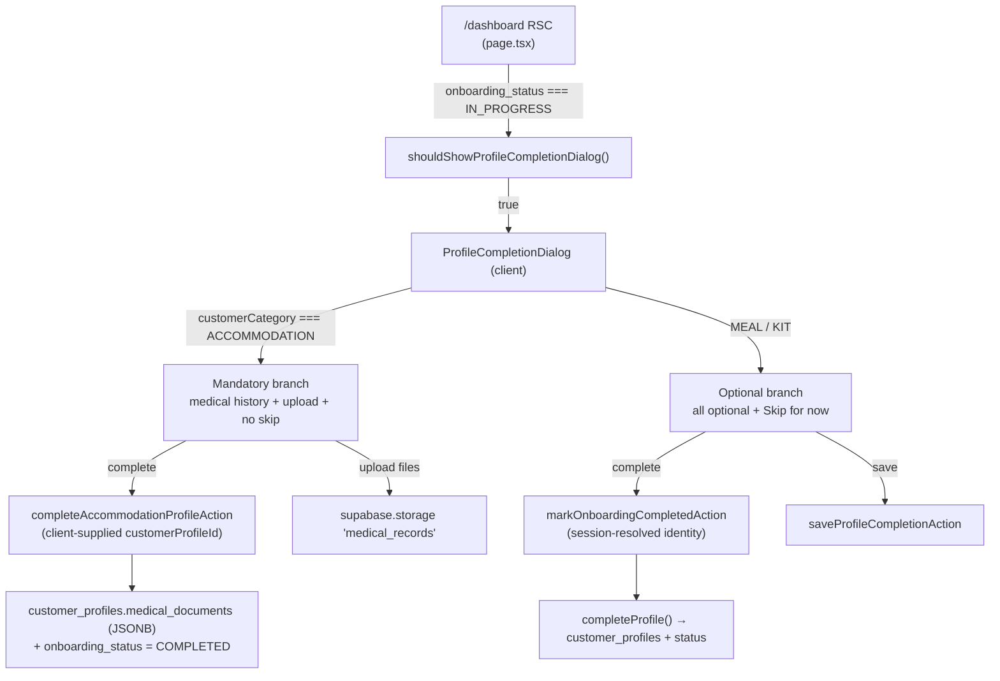
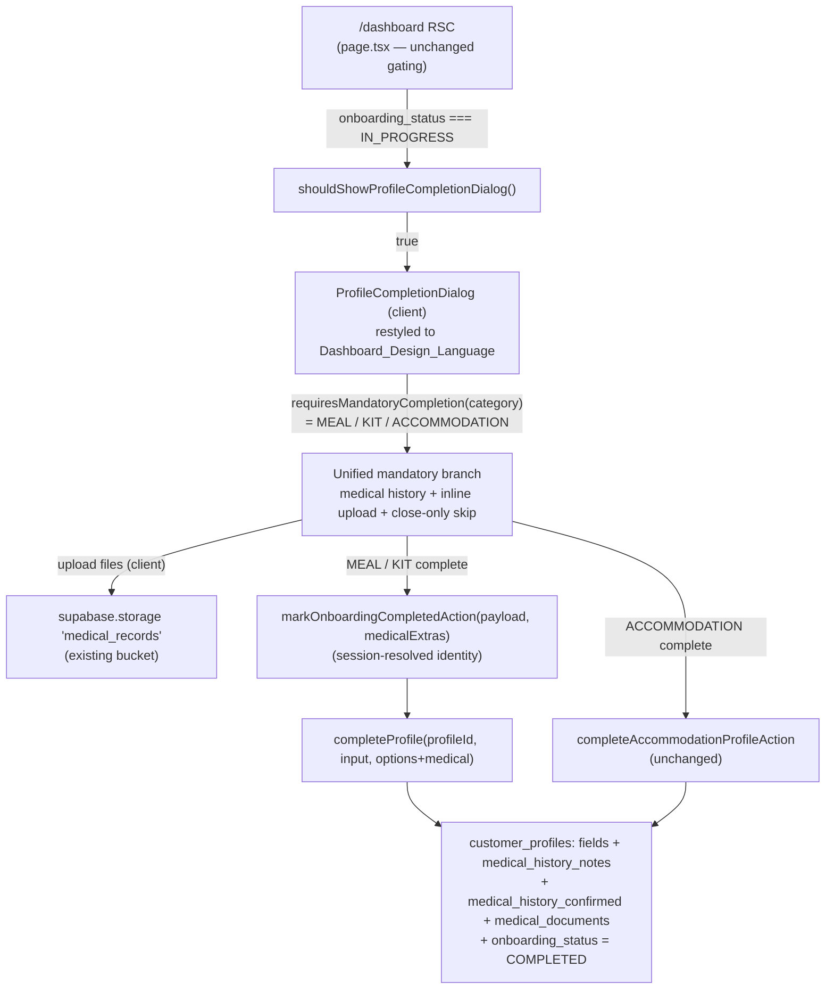

# Design Document

## Overview

Today the shared `ProfileCompletionDialog` gives ACCOMMODATION customers a *mandatory* profile-completion experience (medical history required, inline medical-document upload, no permanent skip, reappears on `/dashboard` until completed) while MEAL and KIT customers get an *optional* experience (all fields optional, a permanent "Skip for now" button, no upload). This feature makes MEAL and KIT customers follow the exact same mandatory behavior ACCOMMODATION already has, adds inline medical-document upload for MEAL/KIT, keeps the pop-up reappearing on `/dashboard` while `onboarding_status = 'IN_PROGRESS'`, and restyles the whole dialog to match the customer dashboard's visual design language (Requirement 7).

The core insight from the code review is that **most of the behavior already exists** — it is gated behind an `isAccommodation` flag inside a single shared component. The bulk of this work is *generalizing that gate* from "accommodation only" to "any mandatory-completion category" rather than building new behavior. The design therefore favors the least-duplication path:

- Keep `ProfileCompletionDialog` as the single shared component for all three categories (Requirement 5.3).
- Reuse the existing client-side `uploadMedicalDocuments` helper and upload UI already in the component (Requirements 3, 5.1).
- Reuse the existing `medical_records` storage bucket and the `customer_profiles.medical_documents` JSONB field (Requirements 4, 5.2) — no schema changes.
- Persist MEAL/KIT completion (including medical history + documents) through the **session-authenticated** `markOnboardingCompletedAction` in `profileCompletionActions.ts`, extended to carry the medical payload, rather than reusing the client-id-trusting accommodation action.

### Goals

1. MEAL and KIT customers get the mandatory-completion behavior currently exclusive to ACCOMMODATION (Requirement 1).
2. "Skip for now" becomes a temporary dismissal (the Dialog's built-in close control), and the pop-up reappears on every `/dashboard` visit while `IN_PROGRESS` (Requirement 2).
3. MEAL/KIT customers can attach medical documents inline, with the same file-type/size/count rules as ACCOMMODATION (Requirement 3).
4. Medical history text and uploaded document references are persisted on completion (Requirement 4).
5. No duplicate upload component or storage location is introduced (Requirement 5).
6. Accessibility of the Radix Dialog is preserved (Requirement 6).
7. The dialog adopts the Dashboard_Design_Language while preserving the functional flow (Requirement 7).

### Non-Goals

- Changing the ACCOMMODATION functional flow (Requirement 1.4 requires it stay unchanged; only its visual styling changes under Requirement 7).
- Changing how the dialog is *gated*/mounted — `shouldShowProfileCompletionDialog` and the dashboard mount logic already satisfy Requirements 2.3, 2.4, 2.7 with no code change.
- Migrating the separate `medical_documents` table used by `medical-document-upload-modal.tsx`. The mandatory pop-up mirrors the *accommodation* persistence model (JSONB on `customer_profiles`), not the standalone modal's table-insert model.

## Architecture

### Current state (as-built)



### Target state (this feature)



### Key architectural decisions

**Decision 1 — Generalize the `isAccommodation` gate into `requiresMandatoryCompletion`.**
The component currently branches on `const isAccommodation = customerCategory === "ACCOMMODATION"`. That single boolean drives four distinct concerns: (a) which subscription/stay block to show, (b) whether medical history is mandatory, (c) whether the upload control renders, (d) whether "Skip for now" is shown. This feature needs (b), (c), (d) to apply to MEAL/KIT too, but (a) must stay accommodation-specific (accommodation shows a stay block, MEAL/KIT show a subscription block).

We therefore split the one boolean into two intent-revealing flags:

- `isAccommodation` — retained, but used **only** for the presentation choice (a): stay block vs subscription block.
- `requiresMandatoryCompletion` — new; true for MEAL, KIT, and ACCOMMODATION (any recognized category). Drives (b) mandatory medical history, (c) inline upload, (d) hide the "Skip for now" button.

This is the least-duplication approach: no new component, no copied markup — the existing mandatory JSX simply keys off `requiresMandatoryCompletion` instead of `isAccommodation`.

**Decision 2 — Persist MEAL/KIT completion through the session-authenticated action, extended with a medical payload.**
Two candidate server paths exist:

| Option | Identity source | Duplication | Security |
| --- | --- | --- | --- |
| Reuse `completeAccommodationProfileAction` | client-supplied `customerProfileId` | none | trusts a client id (weaker) |
| Extend `markOnboardingCompletedAction` + `completeProfile` | session-resolved `profileId`/`userId` | small (add optional medical fields) | server-trusted identity |

We choose the second. `profileCompletionActions.ts` already resolves the caller's own `customer_profiles.id` from the session cookie (`resolveAuthenticatedCustomer`) and never trusts client ids — the established customer-portal security pattern. We extend `markOnboardingCompletedAction` to accept an optional `medicalExtras` argument and thread it through `OnboardingService.completeProfile`, which persists `medical_history_notes`, `medical_history_confirmed`, and `medical_documents` alongside the existing profile-field update and the `IN_PROGRESS → COMPLETED` transition. This keeps the glossary's stated location (`profileCompletionActions.ts`) and mirrors the accommodation flow's *data model* without inheriting its client-id trust hole.

**Decision 3 — Uploads stay client-side to the existing bucket; only references cross to the server.**
The existing accommodation flow uploads files to `medical_records` from the browser (using the user's own Supabase session) via `uploadMedicalDocuments()`, then passes back lightweight `{ name, url, type }` references to the server action, which stores them as JSONB. MEAL/KIT reuse this exact helper and shape unchanged. This satisfies Requirements 3, 5.1, and 5.2 with zero new upload code.

## Components and Interfaces

### 1. `ProfileCompletionDialog` (client component) — modified

Path: `src/shared/components/customer/ProfileCompletionDialog.tsx`

Changes:

- **New derived flag** (replaces broadened use of `isAccommodation`):
  ```ts
  const isAccommodation = customerCategory === "ACCOMMODATION";
  const requiresMandatoryCompletion =
    customerCategory === "MEAL" ||
    customerCategory === "KIT" ||
    customerCategory === "ACCOMMODATION";
  ```
  A `null`/unknown category falls back to the legacy optional behavior (defensive default; the dashboard always supplies a category when a subscription exists).
- **Medical history is always shown and mandatory** when `requiresMandatoryCompletion` (currently `isAccommodation`): the existing block that force-adds `medicalHistoryNotes` to `fieldsToRender` and the confirmation checkbox now key off `requiresMandatoryCompletion`.
- **Complete button enablement**: `disabled={isBusy || (requiresMandatoryCompletion && !mandatoryProfileComplete)}` where `mandatoryProfileComplete` is the renamed `accommodationProfileComplete` (`medicalHistoryConfirmed || notes.trim().length > 0`) — Requirements 1.2, 1.3.
- **Inline upload control** renders when `requiresMandatoryCompletion` (was `isAccommodation`) — Requirement 3.1. Constants `MAX_MEDICAL_DOCUMENT_FILES = 5`, `MAX_MEDICAL_DOCUMENT_SIZE_MB = 10`, and the `handleDocumentSelect`/`removeDocument`/`uploadMedicalDocuments` handlers are reused verbatim (Requirements 3.2–3.7).
- **"Skip for now" button** is hidden whenever `requiresMandatoryCompletion` (was `isAccommodation`), so MEAL/KIT rely on the Dialog's built-in top-right close control as the skip mechanism (Requirements 2.2, 6.1). Nothing is persisted on close, so the pop-up reappears on the next `/dashboard` visit (Requirement 2.1).
- **Completion routing**: `runSubmit("complete")` currently routes ACCOMMODATION to `runAccommodationComplete()`. We generalize so MEAL/KIT completion also uploads documents client-side and calls the extended `markOnboardingCompletedAction`. Introduce `runMandatoryComplete()` that branches on category for the *action* only:
  ```ts
  async function runMandatoryComplete() {
    clearErrors();
    setSubmitting("complete");
    try {
      const uploadedDocuments = await uploadMedicalDocuments(); // reused, may throw → Req 4.4
      const values = getValues();
      if (isAccommodation) {
        // unchanged accommodation path (Req 1.4)
        const result = await completeAccommodationProfileAction({ customerProfileId, ... });
        ...
      } else {
        // MEAL / KIT: session-authenticated action + medical extras
        const result = await markOnboardingCompletedAction(
          buildPayload(values),                       // profile fields incl. medicalHistoryNotes
          {
            medicalHistoryConfirmed: values.medicalHistoryConfirmed,
            medicalDocuments: uploadedDocuments,
          },
        );
        ...
      }
    } catch (err) { toast.error(...); }
    finally { setSubmitting(null); }
  }
  ```
  If `uploadMedicalDocuments()` throws (a storage failure), completion aborts before the server action runs, so `onboarding_status` stays `IN_PROGRESS` and the dialog remains dismissible/re-appearing (Requirement 4.4).
- **"Save" button** (optional persistence, no completion) remains available and unchanged for all categories — it does not require medical history.
- **Restyle** per the "Dashboard Design Language Mapping" section below (Requirement 7). This is a styling-only pass over existing markup; structure, labels, focus behavior, and the Radix primitives are preserved (Requirements 6.2, 6.6).

Props: **unchanged** public interface (`emptyFields`, `isTestEmail`, `defaultOpen`, `subscription`, `customerCategory`, `accommodationStay`, `customerProfileId`). No dashboard prop changes are required, minimizing blast radius.

### 2. `markOnboardingCompletedAction` (server action) — modified

Path: `src/actions/profileCompletionActions.ts`

Extend the signature with an optional medical payload; existing callers passing only the profile input continue to compile:

```ts
export interface MarkCompletedMedicalExtras {
  medicalHistoryConfirmed?: boolean;
  medicalDocuments?: Array<{ name: string; url: string; type: string }>;
}

export async function markOnboardingCompletedAction(
  input: ProfileCompletionInput,
  medical?: MarkCompletedMedicalExtras,
): Promise<ProfileCompletionActionResult> {
  const resolved = await resolveAuthenticatedCustomer();       // session-trusted (unchanged)
  if ("error" in resolved) return { error: resolved.error };

  const result = await completeProfile(resolved.profileId, input, {
    userId: resolved.userId,
    markCompleted: true,
    medicalHistoryConfirmed: medical?.medicalHistoryConfirmed,
    medicalDocuments: medical?.medicalDocuments,
    requireMedicalHistory: true, // enforce Req 1.2 server-side for MEAL/KIT
  });

  if (!result.ok) return toActionError(result);
  revalidatePath("/dashboard");
  return { success: true, completed: result.completed };
}
```

`saveProfileCompletionAction` and `submitRealEmailAction` are unchanged.

### 3. `OnboardingService.completeProfile` — modified

Path: `src/services/OnboardingService.ts`

Extend `CompleteProfileOptions` and the persistence logic:

```ts
export interface CompleteProfileOptions {
  markCompleted?: boolean;
  userId?: string | null;
  // new — mandatory-completion support (MEAL/KIT), mirroring the accommodation data model
  requireMedicalHistory?: boolean;
  medicalHistoryConfirmed?: boolean;
  medicalDocuments?: Array<{ name: string; url: string; type: string }>;
}
```

Behavior additions (kept minimal and ordered before the existing profile-field write so a rejection persists nothing — Requirements 2.6, 4.4):

1. **Server-side mandatory check** (when `requireMedicalHistory`): reject with a `VALIDATION` result and a `medicalHistoryNotes` field error unless `medicalHistoryConfirmed === true` OR `input.medicalHistoryNotes` has non-whitespace content (Requirement 1.2). This backs up the client-side disabled button so the rule holds even against a direct action invocation.
2. **Confirmation clears notes**: when `medicalHistoryConfirmed` is true, persist `medical_history_notes = null` and `medical_history_confirmed = true`; otherwise persist the trimmed notes and `medical_history_confirmed = false`. Mirrors `completeAccommodationProfileAction` exactly.
3. **Documents**: when `medicalDocuments` is provided, include `medical_documents` (JSONB) in the profile patch; an empty/absent array persists an empty field (Requirement 4.5).
4. The existing atomic single-row `updateProfileFields` + `setOnboardingCompleted` sequence is reused, so persistence stays all-or-nothing and only writes `COMPLETED` on success (Requirements 2.5, 2.6, 4.2, 4.3).

`shouldShowProfileCompletionDialog(status)` is **unchanged** — it already returns `status === "IN_PROGRESS"`, satisfying Requirements 2.3, 2.4, and 2.7 with no edit.

### 4. `/dashboard` page (RSC) — unchanged

Path: `src/app/customer/(main)/dashboard/page.tsx`

No changes required. It already:
- mounts `ProfileCompletionDialog` only while `shouldShowProfileCompletionDialog(profile.onboarding_status)` is true (Requirements 2.3, 2.7);
- persists nothing on skip, so the dialog reappears on the next load (Requirement 2.1);
- passes `customerCategory`, `customerProfileId`, `emptyFields`, `subscription`, and (for accommodation) `accommodationStay`.

The `customerProfileId` prop is already supplied for all categories, so no prop wiring is needed for MEAL/KIT.

### Interface summary

| Symbol | File | Change |
| --- | --- | --- |
| `ProfileCompletionDialog` | `ProfileCompletionDialog.tsx` | Generalize gate, restyle, route MEAL/KIT complete through extended action |
| `requiresMandatoryCompletion` (local) | `ProfileCompletionDialog.tsx` | New derived flag |
| `runMandatoryComplete` (local) | `ProfileCompletionDialog.tsx` | Renamed/generalized from `runAccommodationComplete` |
| `markOnboardingCompletedAction` | `profileCompletionActions.ts` | Optional `medical` argument |
| `MarkCompletedMedicalExtras` | `profileCompletionActions.ts` | New exported type |
| `CompleteProfileOptions` | `OnboardingService.ts` | New optional medical fields |
| `completeProfile` | `OnboardingService.ts` | Server-side mandatory check + medical persistence |
| `shouldShowProfileCompletionDialog` | `OnboardingService.ts` | No change |
| `/dashboard` page | `dashboard/page.tsx` | No change |

## Data Models

No schema changes and no migration are required.

### `customer_profiles` (existing columns reused)

| Column | Type | Use |
| --- | --- | --- |
| `onboarding_status` | text (`IN_PROGRESS` \| `COMPLETED`) | Dialog gate; set to `COMPLETED` on successful completion (Requirements 2.5, 2.7) |
| `medical_history_notes` | text (nullable) | Persisted medical history text (Requirement 4.3) |
| `medical_history_confirmed` | boolean | "No medical history" confirmation (Requirement 1.2) |
| `medical_documents` | JSONB | Array of `{ name, url, type }` references (Requirements 4.1, 4.2, 4.5) |

### Medical document reference (client → server payload shape)

```ts
type MedicalDocumentRef = {
  name: string; // original file name
  url: string;  // storage path returned by supabase.storage.upload(...).data.path
  type: string; // MIME type (image/* or application/pdf)
};
```

### Storage

- **Bucket**: `medical_records` (existing, private) — Requirement 5.2. Files are stored under `{auth_user_id}/{random}.{ext}`, matching the current accommodation and `medical-document-upload-modal.tsx` conventions.

### Persistence-model note (deliberate divergence)

Two medical-document persistence models exist in the codebase:

1. `medical-document-upload-modal.tsx` inserts rows into a dedicated `medical_documents` **table** (with `storage_path`, `file_size_bytes`).
2. `completeAccommodationProfileAction` stores an array on the `customer_profiles.medical_documents` **JSONB** column.

Requirement 5 and the glossary direct this feature to *mirror the accommodation flow*, so MEAL/KIT use model (2) — the JSONB column — for consistency with the pop-up's existing behavior. The upload *mechanics* (bucket, path scheme, file validation) are shared with the modal; only the reference-persistence target differs, and it is intentionally the same as accommodation. No migration is needed because the column already exists and is populated for accommodation customers today.

## Correctness Properties

*A property is a characteristic or behavior that should hold true across all valid executions of a system — essentially, a formal statement about what the system should do. Properties serve as the bridge between human-readable specifications and machine-verifiable correctness guarantees.*

### Property 1: Dialog visibility is driven solely by IN_PROGRESS status

*For any* onboarding-status value (the two enum states plus non-enum strings, empty string, `null`, or `undefined`), `shouldShowProfileCompletionDialog(status)` returns `true` if and only if `status === "IN_PROGRESS"`. Prior skip/close actions never change this, since nothing is persisted on skip.

**Validates: Requirements 2.3, 2.4, 2.7**

### Property 2: Mandatory medical history gates completion

*For any* combination of a medical-history notes string (empty, whitespace-only, or non-blank) and a "no medical history" confirmation boolean, a mandatory completion is accepted if and only if the notes contain at least one non-whitespace character OR the confirmation is checked; otherwise it is rejected with a `medicalHistoryNotes` field error and no profile change is persisted and no status transition occurs.

**Validates: Requirements 1.2, 1.3**

### Property 3: Completion persists exactly the provided profile, medical history, and documents

*For any* valid subset of profile fields, any (notes, confirmed) pair satisfying the mandatory rule, and any array of medical-document references (including empty), a successful `markCompleted` completion transitions `onboarding_status` to `COMPLETED` exactly once and persists: the provided profile fields to their matching columns; `medical_history_notes` = trimmed notes when unconfirmed or `null` when confirmed, with `medical_history_confirmed` matching the flag; and `medical_documents` equal to the provided reference array.

**Validates: Requirements 2.5, 4.2, 4.3, 4.5**

### Property 4: Medical document selection enforces type, size, and count limits

*For any* list of selected files with varied MIME types and sizes, the resulting accepted set contains only image or PDF files each no larger than 10 MB, and never exceeds 5 files total; whenever a file is rejected for an unsupported type, for exceeding 10 MB, or for exceeding the 5-file cap, a descriptive error message is produced.

**Validates: Requirements 3.2, 3.3, 3.4, 3.5, 3.6, 3.7**

## Error Handling

| Scenario | Handling | Requirement |
| --- | --- | --- |
| Unsupported file type selected | Client rejects the file, shows "`{name}` must be an image or PDF file." (existing `handleDocumentSelect`) | 3.5 |
| File > 10 MB selected | Client rejects the file, shows "`{name}` exceeds the 10MB limit." | 3.6 |
| More than 5 files attached | Client rejects the extra files, shows "You can upload a maximum of 5 documents." | 3.7 |
| Storage upload failure during completion | `uploadMedicalDocuments()` throws; `runMandatoryComplete` catches, shows a toast, aborts before the server action, leaving status `IN_PROGRESS` | 4.4 |
| Medical history missing (no notes, unchecked) | Complete button disabled (client) **and** `completeProfile` returns `VALIDATION` with a `medicalHistoryNotes` field error (server) | 1.2, 1.3 |
| Profile-field format failure | Existing `profileCompletionSchema` validation returns per-field errors; nothing persists | 4 (all-or-nothing) |
| Server persistence failure | `completeProfile` returns `PERSISTENCE`; `onboarding_status` remains `IN_PROGRESS`; entered values retained | 2.6, 4.4 |
| Unauthenticated / no profile | `resolveAuthenticatedCustomer` returns `{ error }`; action fails closed | Security pattern |

All server failures return the uniform `{ error, fieldErrors? }` result the dialog already consumes via `applyResult`, which surfaces `toast.error` + per-field messages and retains entered values.

## Dashboard Design Language Mapping (Requirement 7)

The restyle is applied to `ProfileCompletionDialog` only, preserving the Radix `Dialog`/`DialogContent`/`DialogHeader`/`DialogTitle`/`DialogDescription` structure, focus trap, focus restore, and every `<FieldLabel>`/input association (Requirements 6.2, 6.6). Reference components: `TodayFocusCard.tsx`, `JourneyHeader`, `MomentumStrip`, `UpcomingDeliveries`, and the dashboard cards in `page.tsx`.

| Design token / pattern | Dashboard reference | Applied to dialog |
| --- | --- | --- |
| Card container | `rounded-2xl`/`rounded-3xl` + `border border-slate-200` + `shadow-sm` on `bg-white` | Section blocks (subscription/stay, medical history, upload) use `rounded-2xl border border-slate-200 bg-white shadow-sm`; `DialogContent` keeps `sm:max-w-md` with rounded corners | 7.2 |
| Color palette | emerald/slate base, coral/amber accents | Primary actions/emerald accents for section badges and the complete button; slate for text/borders; amber/coral reserved for warnings and accents | 7.3 |
| Icon-badged section header | `rounded-full bg-emerald-100 p-1.5` with an icon + title (already present in the stay/subscription block) | Reuse the badge pattern for **every** section header: "Your Subscription"/"Your Stay" (`Utensils`/`BedDouble` in `bg-emerald-100`), "Medical history" (e.g. `HeartPulse`/`FileText` in an emerald/amber badge), "Medical documents" (`UploadCloud`) | 7.4 |
| Typography & spacing | `text-sm font-semibold text-slate-900` headers, `text-slate-500` secondary, consistent `gap`/`space-y` rhythm | Align header/label/body classes and vertical spacing to the dashboard scale | 7.5 |
| Reveal/animation | `reveal-rise` with `--reveal-delay` | Optional subtle entrance on the dialog body sections, consistent with dashboard motion (kept non-blocking for a11y) | 7.1 |
| Upload dropzone | dashed `rounded-lg`/`rounded-xl` slate dropzone (already in component and modal) | Keep the dashed dropzone, align radius/border/hover to slate tokens | 7.2 |
| Footer actions | rounded pill primary buttons (`rounded-full bg-primary ...` in `TodayFocusCard`) | Style the complete/save buttons consistent with dashboard CTAs while keeping `min-h-11` tap targets | 7.5 |

Functional flow from Requirements 1–6 is untouched by the restyle (Requirement 7.7): the same fields, validation, upload rules, mandatory gating, and close-only skip remain; only classes/markup wrappers and iconography change.

## Testing Strategy

### Applicability of property-based testing

This feature is a mix of (a) pure decision logic worth property testing — the completion gate and the mandatory medical-history rule — and (b) UI wiring / styling / storage side-effects best covered by component and example tests. The prework below classifies every acceptance criterion. PBT applies to the gate and the mandatory-validation rule (both pure, input-varying, cheap to run 100×). Upload constraints are covered as edge cases inside a validation property. UI restyle, mounting, and storage I/O are covered by component/integration/example tests, not PBT.

### Existing tests to extend

- `src/services/__tests__/profileCompletion.property.test.ts` — extend with the new mandatory-medical-history property (Property 2) and keep Properties 14/15 (gate + status transition) which already cover Requirements 2.3–2.5 and 2.7. Uses `vitest` + `fast-check`, in-memory repository fakes, min 100 runs.
- `src/shared/components/customer/__tests__/ProfileCompletionDialog.test.tsx` — extend with MEAL/KIT mandatory-behavior component tests: complete button disabled until notes/checkbox (Req 1.2/1.3), upload control present for MEAL/KIT (Req 3.1), no "Skip for now" button (Req 2.2/6.1), and file-validation error messages (Req 3.5–3.7).
- `src/test/a11y/onboarding-a11y.test.tsx` — extend to assert the restyled dialog keeps labeled inputs and conveys the disabled complete-button state (Requirements 6.2, 6.3, 6.6).

### Test types

- **Property tests** (`fast-check`, ≥100 iterations, tagged `Feature: mandatory-profile-completion-popup, Property N: ...`): completion gate (Property 1) and mandatory medical-history validation/persistence (Property 2).
- **Component tests** (`@testing-library/react`): mandatory gating, upload control presence, absence of "Skip for now", file-validation messages, disabled-state a11y for MEAL/KIT.
- **Integration/example tests**: `markOnboardingCompletedAction` threads the medical payload into `completeProfile` and persists `medical_documents`/`medical_history_*`; upload failure aborts and leaves `IN_PROGRESS`.
- **Snapshot/visual check** (manual or snapshot): the Dashboard_Design_Language restyle (Requirement 7) — visual conformance is verified by snapshot/example tests, not PBT.

### Property test configuration

- Library: `fast-check` (already used in the repo). Do not hand-roll PBT.
- Minimum 100 iterations per property (raise the existing `numRuns: 25` to `100` for the new/updated properties per the design standard).
- Each property test references its design property via a `Feature: mandatory-profile-completion-popup, Property {n}: {text}` comment.

## Requirements Traceability

| Requirement | Acceptance criteria | Design coverage | Verification |
| --- | --- | --- | --- |
| 1. Mandatory dialog for MEAL/KIT | 1.1 | `requiresMandatoryCompletion` gate (Component 1) | Component test |
| | 1.2, 1.3 | `mandatoryProfileComplete` disable rule + server-side `requireMedicalHistory` check (Components 1, 3) | Property 2 + component test |
| | 1.4 | Accommodation action/branch unchanged (Decision 2, non-goals) | Existing tests |
| 2. Remove permanent skip / reappear | 2.1, 2.2 | Hide "Skip for now"; close-only skip persists nothing (Component 1); no-change dashboard | Component test |
| | 2.3, 2.4, 2.7 | `shouldShowProfileCompletionDialog` unchanged (Component 3, 4) | Property 1 |
| | 2.5 | `completeProfile` sets `COMPLETED` on success (Component 3) | Property 3 |
| | 2.6 | All-or-nothing persistence; `PERSISTENCE` result keeps `IN_PROGRESS` (Error Handling) | Edge-case test |
| 3. Inline upload for MEAL/KIT | 3.1 | Upload control keyed off `requiresMandatoryCompletion` (Component 1) | Component test |
| | 3.2–3.4 | Reused `handleDocumentSelect` type/size/count logic | Property 4 |
| | 3.5–3.7 | Descriptive error messages in `handleDocumentSelect` | Property 4 + component test |
| 4. Persist completion + documents | 4.1 | Client `uploadMedicalDocuments` → `medical_records` bucket | Integration test |
| | 4.2, 4.3, 4.5 | `completeProfile` medical persistence (Component 3) | Property 3 |
| | 4.4 | Upload throw aborts before status transition (Component 1, Error Handling) | Edge-case test |
| 5. Reuse components/storage | 5.1 | Reused upload helper + UI, single component | Code review / smoke |
| | 5.2 | Existing `medical_records` bucket | Integration test |
| | 5.3 | `ProfileCompletionDialog` remains the single shared component | Code review / smoke |
| 6. Accessibility | 6.1 | Built-in Dialog close control as skip; no extra button (Component 1) | Component test |
| | 6.2, 6.3 | `<FieldLabel>` associations + disabled-state semantics preserved | a11y test |
| 7. Visual/UX consistency | 7.1–7.5 | Dashboard Design Language Mapping section | Snapshot/visual review |
| | 7.6 | Radix Dialog structure/focus/labels preserved | a11y test |
| | 7.7 | Functional flow untouched by restyle | Existing + new functional tests |
