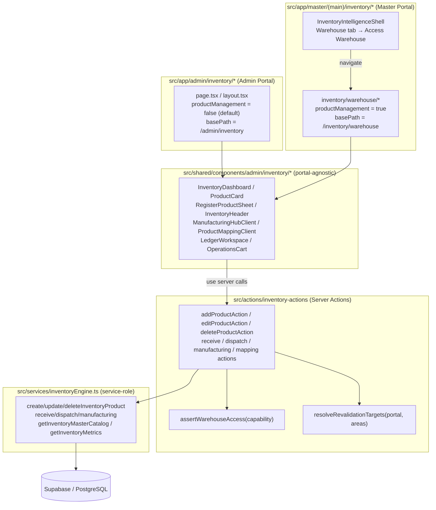
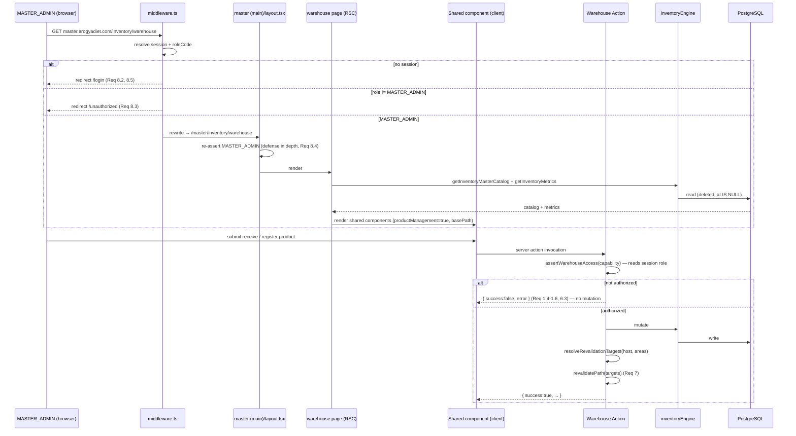
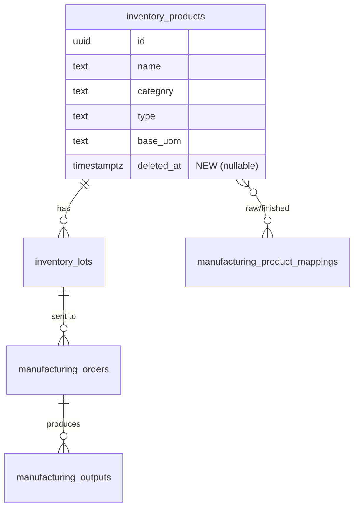

# Design Document

## Overview

This feature relocates **product management** (register / edit / delete warehouse products) from the Admin portal (`admin.arogyadiet.com`) to the Master portal (`master.arogyadiet.com`), and gives the `MASTER_ADMIN` the **complete warehouse inventory experience** — Master Catalog, metrics, Manufacturing Hub, Product Mapping, Audit Ledger, receive/dispatch, and category browsing — from within the Master portal.

The guiding constraint is **reuse, not rewrite** (Requirement 9). The warehouse already exists as a set of portal-agnostic components under `src/shared/components/admin/inventory/*`, a service layer at `src/services/inventoryEngine.ts`, and Server Actions at `src/actions/inventory-actions/index.ts`. Those Admin pages today are reachable only by an `ADMIN` user who passes `canAccess(accessLevel, "inventory")`. This design:

1. **Adds two new orthogonal pieces of behavior to the shared layer** that it does not have today:
   - A **capability flag** (`productManagement`) that gates the register/edit/delete controls in the UI.
   - A **portal-relative base path** prop so the shared header and navigation resolve their link targets from the rendering portal instead of a hardcoded `/admin/inventory`.
2. **Introduces per-action authorization** in the Warehouse Actions. Today the actions perform *no* role check and rely entirely on the middleware + layout route guards. The requirements (1.4–1.6, 6.1–6.3) demand that each action itself authorize the caller — defense in depth and the foundation for serving the same actions to two portals.
3. **Makes cache revalidation context-aware** (Requirement 7). Today every action calls `revalidatePath("/admin/inventory")`. The action must instead revalidate the route family of the portal that initiated it, resolved from the request `host` header, with a both-portals fallback.
4. **Adds a Master warehouse workspace** under `src/app/master/(main)/inventory/warehouse/` that composes the existing shared components with `productManagement` enabled and a master base path, reached from an "Access Warehouse" control on the existing Inventory BI Warehouse tab.
5. **Removes the product CRUD controls from the Admin pages** by leaving the flag at its disabled default.

### Key research findings (existing code)

| Area | Current state | Implication for this design |
| --- | --- | --- |
| Warehouse Actions auth | `src/actions/inventory-actions/index.ts` performs **no** role check | Must add a per-action guard that authorizes `ADMIN`+inventory and `MASTER_ADMIN` |
| Header navigation | `InventoryHeader` hardcodes `/admin/inventory*` links and an "Admin Dashboard" button | Must accept a `basePath` + home/return control via props (Req 5.5, 9.5) |
| Revalidation | Every action calls `revalidatePath("/admin/inventory*")` | Must resolve target paths from portal context (Req 7) |
| Product delete | `deleteInventoryProduct` **hard-deletes** and rejects products that have lot history | Req 4.5 requires **soft-delete** via `deleted_at`; needs a migration + read filtering |
| Product SKU | `inventory_products` has **no `sku` column**; `AddProductForm` collects no SKU | Req 4.3/4.6 reference a "unique SKU" — resolved below as a uniqueness guard on product name (decision recorded) |
| Master role | `MASTER_ADMIN`; middleware already gates the `master.` subdomain to that role | Workspace route inherits the existing middleware + master layout guard (Req 8) |
| Master inventory entry | `InventoryIntelligenceShell` renders a "Warehouse" / "Shop Products" tab toggle | "Access Warehouse" control lives on the Warehouse tab only (Req 2.1, 2.2) |

### Design decision: the "unique SKU" requirement

The warehouse `inventory_products` table has no `sku` column, and the registration form does not collect one (the "SKU" concept lives on the separate *shop products* catalog). To honor Requirements 4.3 and 4.6 without rewriting the product model, **product uniqueness is enforced on the trimmed, case-insensitive product `name`**, which is the de-facto business identifier in the current catalog. The duplicate-detection error path required by 4.6 is implemented against this key. If the business later wants a true SKU field, it can be added as an additive migration without changing the action contracts. This decision is surfaced here so it can be confirmed during review.

---

## Architecture

### Portal / module boundaries

The warehouse logic lives entirely in shared and cross-cutting layers. Both portals are thin composition layers over the same shared components and the same single Server Action module.



**Import-direction guardrail (Req 9.3):** the Master route directory imports only from `src/shared/*`, `src/actions/*`, `src/services/*`, `src/lib/*`, `src/types/*`, `src/validations/*`. It never imports from `src/app/admin/*`. This is enforced by an ESLint `no-restricted-imports` rule (see Components and Interfaces) so a forbidden cross-portal import fails the build.

### Request / authorization flow



### Why authorize inside the action (not only middleware)

The middleware and layout guards protect *route rendering*. Server Actions, however, are independently invocable endpoints — a crafted request can call `addProductAction` directly regardless of which page is loaded. Requirements 1.4–1.6 and 6.3 therefore require the action itself to reject unauthorized callers. This also lets a single action serve both portals: the action authorizes by **role + access level**, not by which portal rendered the button.

### Two distinct capabilities

The design separates warehouse authorization into two capability levels so that the Admin user keeps every non-CRUD operation while losing product CRUD:

- **`inventory_operations`** — receive/dispatch, bulk receive/dispatch, send-to-manufacturing, process output, revert pending, create/update/delete mappings, read metrics/catalog/ledger. Authorized for `MASTER_ADMIN` **or** `ADMIN` with `canAccess(accessLevel, "inventory")`.
- **`product_management`** — register / edit / delete product. Authorized for `MASTER_ADMIN` **only**.

---

## Components and Interfaces

### 1. Pure helpers (new) — `src/lib/inventory/warehouse-access.ts`

These are environment-agnostic pure functions extracted so they are unit/property testable in isolation and reusable by both the action guard and (optionally) the UI.

```ts
export type WarehouseCapability = "inventory_operations" | "product_management";
export type PortalContext = "admin" | "master" | "unknown";

/**
 * Pure authorization decision. No I/O.
 * - product_management  → MASTER_ADMIN only
 * - inventory_operations → MASTER_ADMIN, or ADMIN with inventory access
 */
export function resolveWarehouseAuthorization(
  roleCode: string | null,
  accessLevel: AdminAccessLevel,
  capability: WarehouseCapability,
): boolean;

/** Map a request Host header to the initiating portal. Pure. */
export function resolvePortalFromHost(host: string | null): PortalContext;

/** Inventory route family that a given action touches. */
export type WarehouseArea = "catalog" | "manufacturing" | "mappings";

/**
 * Resolve the set of paths to revalidate for the initiating portal.
 * - "master"  → only master workspace paths for the given areas
 * - "admin"   → only admin paths for the given areas
 * - "unknown" → both portals' paths (fallback, Req 7.4)
 * Returns a de-duplicated array.
 */
export function resolveRevalidationTargets(
  portal: PortalContext,
  areas: WarehouseArea[],
): string[];
```

Path tables used by `resolveRevalidationTargets`:

| Area | Admin path | Master path |
| --- | --- | --- |
| `catalog` | `/admin/inventory` | `/inventory/warehouse` |
| `manufacturing` | `/admin/inventory/manufacturing` | `/inventory/warehouse/manufacturing` |
| `mappings` | `/admin/inventory/mappings` | `/inventory/warehouse/mappings` |

### 2. Server-side guard (new) — `src/lib/auth/adminAccess.ts`

A throw-style and a result-style guard, mirroring the existing `assertAdminAccess` / `checkGroupManage` patterns already in this file. They reuse the existing `getCurrentAdminContext()` (which already returns `roleCode` — including `"MASTER_ADMIN"` — and the resolved `accessLevel`).

```ts
export class WarehouseAccessDeniedError extends Error {
  readonly capability: WarehouseCapability;
}

/** Throws WarehouseAccessDeniedError when the caller may not perform `capability`. */
export async function assertWarehouseAccess(
  capability: WarehouseCapability,
): Promise<void>;

/** Result-style wrapper for actions returning { success: false, error }. */
export async function checkWarehouseAccess(
  capability: WarehouseCapability,
): Promise<{ ok: true } | { ok: false; error: string }>;
```

`checkWarehouseAccess` returns a stable, user-facing error string (e.g. `"You do not have permission to perform this action."`) used by the action result on denial.

### 3. Portal context resolver (new) — inside the actions module

A small server-only helper that the actions call to discover the initiating portal without changing call sites:

```ts
// reads next/headers host, then resolvePortalFromHost
async function currentPortalContext(): Promise<PortalContext>;
```

Because the middleware routes by subdomain, the `host` header is `admin.arogyadiet.com` or `master.arogyadiet.com`, which `resolvePortalFromHost` maps to `"admin"` / `"master"` / `"unknown"`. No action signature changes, satisfying Req 9.2 (no Master-specific mutation path).

### 4. Warehouse Actions changes — `src/actions/inventory-actions/index.ts`

Each action gains two non-functional wrappers around its existing body:

1. **Authorization** at the top:
   - `addProductAction`, `editProductAction`, `deleteProductAction` → `checkWarehouseAccess("product_management")`. On failure: return `{ success: false, error }` and perform no mutation (Req 1.4–1.6, 4 guards).
   - All other operations (receive, dispatch, bulk, manufacturing, mappings) → `checkWarehouseAccess("inventory_operations")` (Req 6.1, 6.3).
2. **Context-aware revalidation** at the end: replace each hardcoded `revalidatePath("/admin/inventory...")` with `revalidatePath` over `resolveRevalidationTargets(await currentPortalContext(), areas)`. On a service failure the action returns before any revalidation (Req 7.5).

The authorization check runs **before input parsing/validation only where it must short-circuit a mutation**; ordering is: authorize → validate input → mutate → revalidate. Validation failures still return descriptive errors and never mutate (Req 4.6, 6.6).

### 5. Shared component prop additions (Req 5, 9.4, 9.5)

All additions are **optional props with disabled/admin defaults** so the Admin pages keep working unchanged (Req 5.4, 5.6).

| Component | New prop(s) | Behavior |
| --- | --- | --- |
| `InventoryDashboard` | `productManagement?: boolean` (default `false`); `basePath?: string` | When `false`, never renders `RegisterProductSheet` (the hero CTA and the two empty-state CTAs). Passes `productManagement` down to each `ProductCard`. |
| `ProductCard` | `productManagement?: boolean` (default `false`) | When `false`, the `MoreVertical` dropdown (Edit / Delete) is not rendered at all (Req 5.3). Receive/Dispatch are always rendered. |
| `RegisterProductSheet` | `basePath?: string` (for `router.refresh` parity; no link change needed) | Rendered only by parents when `productManagement` is enabled. |
| `InventoryHeader` | `basePath?: string` (default `/admin/inventory`); `homeHref?: string`; `endSlot?: ReactNode` | Nav items derived from `basePath`; the right-side button is supplied by the portal (Admin → "Admin Dashboard"; Master → "Back to Inventory BI"). Active-route detection uses `basePath` (Req 5.5, 9.5, 2.5). |

`productManagement` governs **presentation only** and never substitutes for the action-level authorization (Req 5.7). A user who manipulates the DOM to reveal a hidden control still hits the action guard.

### 6. Admin pages (Req 1, 5.4)

The Admin pages change minimally: they simply **omit** `productManagement` (it defaults to `false`) and continue to pass the default `/admin/inventory` base path. The result: no register control on the catalog, no edit/delete on cards, all other operations intact (Req 1.1–1.3).

### 7. Master warehouse workspace (Req 2, 3, 8)

New routes under `src/app/master/(main)/inventory/warehouse/`:

```
inventory/warehouse/
├── layout.tsx          # re-asserts MASTER_ADMIN; renders InventoryHeader (master basePath
│                       #   + "Back to Inventory BI" endSlot) + OperationsCart
├── page.tsx            # Master Catalog: InventoryMetrics + InventoryDashboard(productManagement)
├── manufacturing/page.tsx
├── mappings/page.tsx
└── ledger/page.tsx
```

Each page is a near-mirror of its Admin counterpart, reading through the **same** `inventoryEngine` functions (Req 3.4, 9.2) and rendering the **same** shared components (Req 3.1, 3.2, 9.1). The only differences are passed as props: `productManagement={true}` and `basePath="/inventory/warehouse"`.

The **Access Warehouse control** is added to `InventoryIntelligenceShell` on the Warehouse tab (`tab === "warehouse"`) as a labeled button "Access Warehouse" that links to `/inventory/warehouse`. It is not rendered on the Shop Products tab (Req 2.1, 2.2). Client-side navigation between workspace views uses Next `<Link>` (App Router) so there is no full-page reload (Req 3.5, 5.5).

### 8. Cross-portal import lint rule (Req 9.3)

Add to `eslint.config.mjs` a `no-restricted-imports` (or `no-restricted-paths`) rule scoped to `src/app/master/**` forbidding imports matching `@/app/admin/*` and relative paths into other portal route directories, with a message naming the offending module. ESLint runs in `npm run lint` and in the build pipeline, so a forbidden import fails the build.

---

## Data Models

The feature touches one existing table and introduces no new tables. The only schema change supports the soft-delete requirement (4.5, 4.7).

### `inventory_products` (existing) — add soft-delete column

```sql
-- scripts/add-inventory-product-soft-delete.sql
ALTER TABLE inventory_products
  ADD COLUMN IF NOT EXISTS deleted_at timestamptz;

-- Index to keep catalog reads (deleted_at IS NULL) fast.
CREATE INDEX IF NOT EXISTS idx_inventory_products_active
  ON inventory_products (id)
  WHERE deleted_at IS NULL;
```

Service-layer impacts in `inventoryEngine.ts`:

- `deleteInventoryProduct(id)` — change from hard `DELETE` to `UPDATE ... SET deleted_at = now()`. It must:
  - Return a descriptive error if the product does not exist or already has `deleted_at` set (Req 4.7).
  - No longer block on existing lot history (soft-delete preserves history).
- `getInventoryMasterCatalog`, `getInventoryMetrics`, and any product read used by the workspace — add `deleted_at IS NULL` filter so soft-deleted products disappear from the catalog while their ledger history remains.

### Product uniqueness (decision above)

`createInventoryProduct` adds a pre-insert existence check on `lower(trim(name))` among non-deleted products; on collision the action returns the duplicate error required by Req 4.6. (Implemented in the service so both portals share it.)

### Conceptual types (TypeScript, no DB change)

```ts
type WarehouseCapability = "inventory_operations" | "product_management";
type PortalContext = "admin" | "master" | "unknown";
type WarehouseArea = "catalog" | "manufacturing" | "mappings";
```

### Domain model relationships (unchanged, for context)




---

## Correctness Properties

*A property is a characteristic or behavior that should hold true across all valid executions of a system — essentially, a formal statement about what the system should do. Properties serve as the bridge between human-readable specifications and machine-verifiable correctness guarantees.*

The properties below target the genuinely input-varying, pure-logic surfaces of this feature: the authorization decision, the capability-flag gating, the input-validation rejection contract, the soft-delete semantics, the context-aware revalidation resolver, and the base-path link resolution. UI composition, route-guard redirects, navigation timing, and architectural structure are validated by example, integration, and structural checks (see Testing Strategy), not by property tests.

### Property 1: Product management is authorized for MASTER_ADMIN only

*For any* role code and access level, `resolveWarehouseAuthorization(role, level, "product_management")` returns `true` if and only if the role is `MASTER_ADMIN`; for every other role — including `ADMIN` with inventory access — it returns `false`, so register/edit/delete product actions are rejected without mutating warehouse data.

**Validates: Requirements 1.4, 1.5, 1.6**

### Property 2: Inventory operations are authorized for MASTER_ADMIN or inventory-access ADMIN

*For any* role code and access level, `resolveWarehouseAuthorization(role, level, "inventory_operations")` returns `true` if and only if the role is `MASTER_ADMIN`, or the role is `ADMIN` and `canAccess(level, "inventory")` is true; for every other role it returns `false`, so the action is rejected without mutating warehouse data.

**Validates: Requirements 6.1, 6.3, 6.5**

### Property 3: The capability flag fully gates the product CRUD controls

*For any* catalog of products, when the shared components render with `productManagement` enabled, all three product CRUD controls (register, edit, delete) are present; and when `productManagement` is disabled or omitted entirely, none of those three controls are present or interactable.

**Validates: Requirements 5.2, 5.3, 5.6**

### Property 4: Invalid input is rejected with a descriptive error and no mutation

*For any* warehouse action input that fails validation — a missing required field, a missing product image on registration, a duplicate product key, or any malformed inventory-operation payload — the action returns a descriptive error result and performs no warehouse data mutation.

**Validates: Requirements 4.6, 6.6**

### Property 5: Edit replaces the product image only when a new image is provided

*For any* valid edit-product submission applied to an existing product, the resulting stored image equals the newly supplied image when one is provided and equals the product's previously stored image when none is provided, while every other edited field equals the submitted value.

**Validates: Requirements 4.4**

### Property 6: Delete soft-deletes and removes the product from the catalog while retaining history

*For any* existing, not-already-deleted product, deleting it sets a `deleted_at` timestamp, causes the product to no longer appear in the master catalog read, and leaves the product's lot and ledger history intact.

**Validates: Requirements 4.5**

### Property 7: Deleting a non-existent or already-deleted product errors without mutation

*For any* product identifier that is unknown or refers to an already soft-deleted product, the delete action returns a descriptive error result and leaves all warehouse data unchanged (delete does not "succeed" a second time).

**Validates: Requirements 4.7**

### Property 8: Revalidation targets match the initiating portal context

*For any* set of affected warehouse areas, `resolveRevalidationTargets(portal, areas)` yields only the Master workspace paths for those areas when `portal` is `"master"`, only the Admin paths when `portal` is `"admin"`, and the union of both portals' paths when `portal` is `"unknown"`; the result never contains the other portal's paths in the `"master"` and `"admin"` cases.

**Validates: Requirements 7.1, 7.2, 7.4**

### Property 9: Navigation link targets resolve from the supplied base path

*For any* base path provided to `InventoryHeader`, every navigation link target it renders (Master Catalog, Manufacturing Hub, Product Mapping, Audit Ledger) begins with that base path, and none is the hardcoded `/admin/inventory` family unless the supplied base path is itself `/admin/inventory`.

**Validates: Requirements 9.5**

---

## Error Handling

The feature follows the existing action result convention: every Server Action returns a discriminated union `{ success: true, ... } | { success: false, error: string }`; the UI surfaces `error` via `toast.error` and never advances optimistic state on failure.

| Failure | Where caught | Behavior |
| --- | --- | --- |
| Unauthorized caller (wrong role) | `checkWarehouseAccess` at action top | Return `{ success: false, error: "You do not have permission to perform this action." }`; no service call, no mutation, no revalidation (Req 1.4–1.6, 6.3, 7.5) |
| Input validation failure | Zod parse / image presence / duplicate-name check | Return descriptive `{ success: false, error }`; no mutation (Req 4.6, 6.6) |
| Delete of missing / already-deleted product | `deleteInventoryProduct` service | Throw → action returns descriptive error; no mutation (Req 4.7) |
| Service/DB failure during mutation | `try/catch` in action | Return `{ success: false, error }` **before** any `revalidatePath`; warehouse state unchanged (Req 7.5) |
| Service failure during workspace load/refresh | RSC fetch / client fetch boundary | Render an error indication, retain last successfully rendered view, render no partial/blank warehouse data (Req 3.7) |
| Unauthenticated / expired session at route | middleware (primary) + layout guard (defense in depth) | Redirect to Master login; no workspace render (Req 8.2, 8.5) |
| Non-MASTER_ADMIN at workspace route | middleware (primary) + layout guard | Redirect to `/unauthorized`; no workspace render (Req 8.3, 8.4) |
| Unrecognized portal context on success | `resolvePortalFromHost` → `"unknown"` | Revalidate both portals' affected paths as a safe fallback (Req 7.4) |

Error-handling principles:

- **Authorize before mutate before revalidate.** The fixed ordering guarantees that a denied or failed action never touches data or caches.
- **Soft-delete preserves auditability.** Because delete sets `deleted_at` rather than removing rows, the Audit Ledger and lot history remain complete (Req 4.5).
- **Presentation gating is never a security boundary.** Hidden CRUD controls reduce surface area but the action guard is the authority (Req 5.7).

---

## Testing Strategy

### Dual approach

- **Property-based tests** verify the nine universal properties above across many generated inputs.
- **Unit / example tests** verify concrete UI rendering, wiring, and edge cases.
- **Integration tests** verify route guards, action→service→revalidation flows, and that both portals read from the same service.
- **Structural / lint checks** verify the reuse-without-rewrite constraints (Req 9.1–9.4).

### Property-based testing

PBT **is appropriate** for this feature's pure-logic surfaces (`resolveWarehouseAuthorization`, `resolveRevalidationTargets`, `resolvePortalFromHost`, the capability-flag gating, the input-validation contract, and the soft-delete/edit invariants), which have large input spaces and clear "for all" statements.

- **Library:** `fast-check` with the project's existing test runner (Vitest/Jest as configured). Property-based testing is **not** implemented from scratch.
- **Iterations:** each property test runs a **minimum of 100 iterations**.
- **Tagging:** each property test is tagged with a comment referencing its design property, in the format:
  `// Feature: master-inventory-management, Property {number}: {property_text}`
- **Generators:**
  - Role codes drawn from a set including `MASTER_ADMIN`, `ADMIN`, `RIDER`, `FRANCHISE_ADMIN`, `null`, and arbitrary strings; access levels across the full `AdminAccessLevel` domain (full, inventory-only, operations-only, etc.).
  - `WarehouseArea` subsets (power set of `catalog`/`manufacturing`/`mappings`).
  - Host strings including `admin.arogyadiet.com`, `master.arogyadiet.com`, localhost variants, empty/`null`, and arbitrary hosts.
  - Product payloads with randomized fields, including invalid variants (missing fields, whitespace-only names, missing images, duplicate names) and valid variants.
  - Catalogs of randomized products for the flag-gating render property.
- **Mapping:** Properties 1, 2 → authorization resolver; 3 → component render with flag (using a render harness such as Testing Library); 4 → action input contract with a mocked service asserting zero mutation; 5, 6, 7 → service-layer logic with an in-memory/mocked Supabase client; 8 → revalidation resolver; 9 → header render across base paths.

Each correctness property is implemented by a **single** property-based test.

### Example / unit tests

- Admin Master Catalog renders without the register control; Admin product cards render without edit/delete; non-product controls remain (Req 1.1–1.3).
- Workspace catalog renders register and per-product edit/delete controls (Req 4.1, 4.2); receive/dispatch always present (Req 3.3).
- "Access Warehouse" control present on the Warehouse tab and absent on the Shop Products tab (Req 2.1, 2.2); "Back to Inventory BI" control present and linking to `/inventory` (Req 2.5).
- Admin pages pass the flag false / omit it; Master pages pass it true (Req 5.4, 5.5); the flag prop is accepted (Req 5.1).
- Service-failure-on-load shows an error and retains the last view (Req 3.7); failed action performs no revalidation (Req 7.5).

### Integration tests

- Middleware + layout guard: MASTER_ADMIN renders the workspace (Req 8.1, 6.4); no session → Master login (Req 8.2, 8.5); non-master → `/unauthorized` (Req 8.3, 8.4).
- Action → service → revalidation: a valid receive/dispatch/register/edit/delete from each portal calls the shared service and revalidates the correct portal's routes; updated state appears on the next render (Req 3.6, 6.2, 7.3).
- Both Admin and Master catalog pages return the same data from `getInventoryMasterCatalog`/`getInventoryMetrics` (Req 3.4).
- Flag-on UI does not bypass action authorization for a non-master caller (Req 5.7).

### Structural / lint checks

- The Master workspace imports only shared/service/action/lib modules and contains no component file duplicating a shared component's rendering logic (Req 9.1, 9.4).
- The Master workspace mutates only through `inventory-actions` and reads only through `inventoryEngine` (Req 9.2).
- The ESLint cross-portal rule flags a planted `@/app/admin/*` import from `src/app/master/**`, failing the build with the offending path (Req 9.3).

### Migration verification

- Apply `scripts/add-inventory-product-soft-delete.sql`; confirm `deleted_at` column and partial index exist, existing catalog reads still return active products, and a soft-deleted product is excluded from the catalog while its ledger entries remain.
