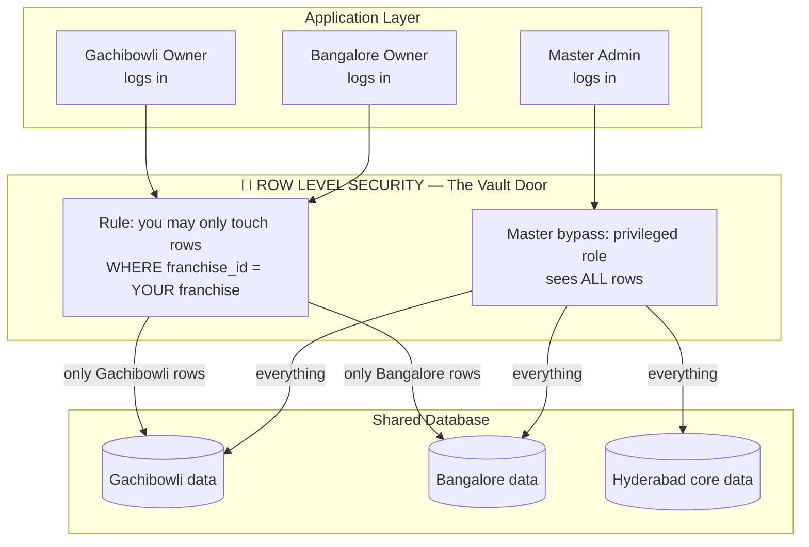
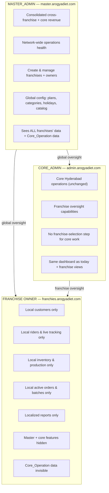
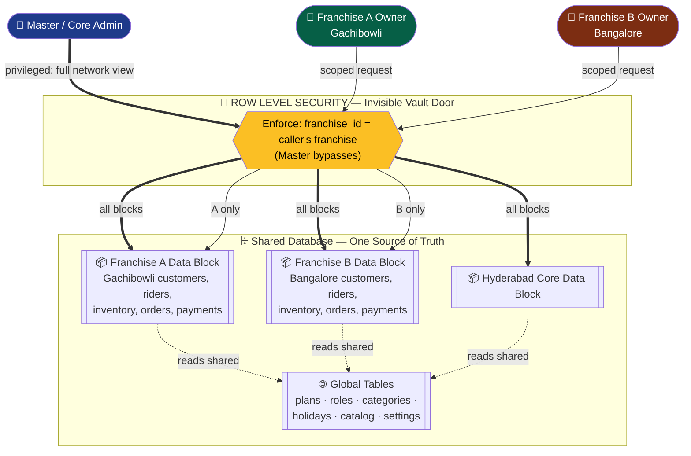
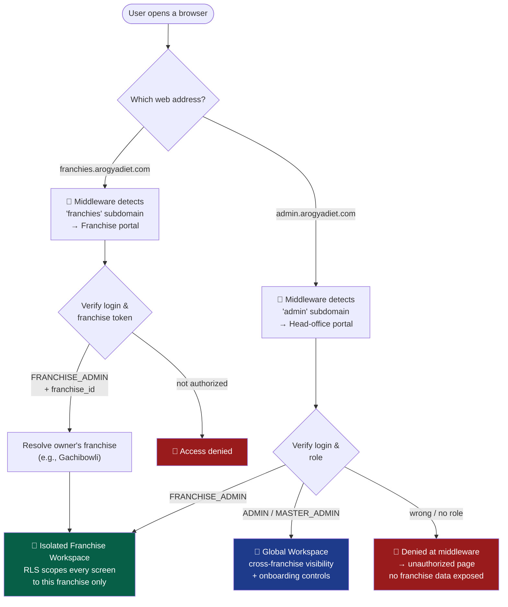
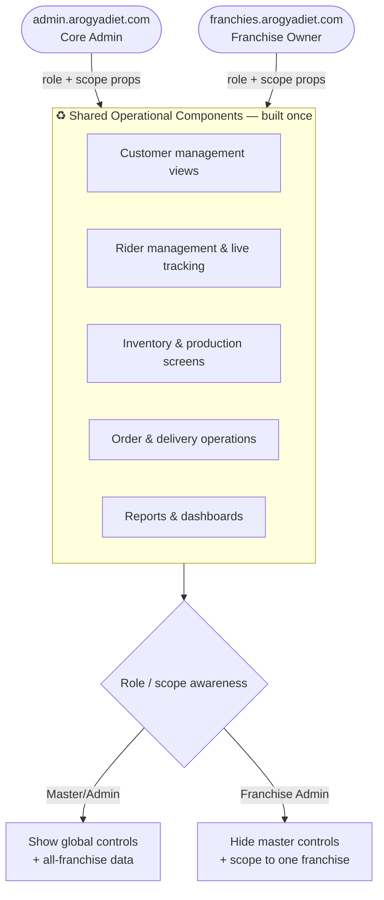

# Design Document: Multi-Tenant Franchise SaaS

> **Strategic Architecture Blueprint** — Transitioning ArogyaDiet from a single-location meal-delivery business in Hyderabad into a scalable, multi-location Franchise SaaS platform.
>
> _Audience: Business ownership & stakeholders. This is a high-level architectural blueprint, not an implementation guide._

---

## Overview

### 1. Executive Architecture Overview

#### The Vision

Today, ArogyaDiet runs as a single business serving Hyderabad through four portals — Customer, Rider, Admin, and Master. The goal is to evolve the platform so that **new franchise locations (Gachibowli, Bangalore, and beyond) can be launched as independent operating businesses on the same platform**, each with their own customers, riders, inventory, and orders — without ArogyaDiet having to build or maintain a separate system for every location.

**Critical architectural principle:** The existing Hyderabad core operation remains the **parent/base** and is NOT converted into a franchise. It continues operating through `admin.arogyadiet.com` exactly as it does today — no migration, no `franchise_id` stamping on existing data, no separate franchise dashboard. Only NEW locations receive franchise identity and isolation. The Core Admin retains oversight of both Hyderabad operations and all franchise operations.

The chosen model is industry-standard for SaaS platforms and can be summarized in three words:

> ### **Single Codebase · Shared Database · Isolated Data**

#### What This Means In Business Terms

| Principle | Plain-language meaning | Business benefit |
|-----------|------------------------|------------------|
| **Single Codebase** | There is only _one_ application to build, test, and maintain. Every franchise runs the exact same software. | A feature or fix built once is instantly available to every franchise. No per-location development cost. |
| **Shared Database** | All franchises store their data in one central, well-managed database rather than dozens of separate systems. | One backup strategy, one security perimeter, one infrastructure bill. No need to provision new servers per franchise. |
| **Isolated Data** | Even though the data lives together, each franchise can _only_ ever see and touch its own slice of it. | A Gachibowli owner can never see Bangalore's customers, revenue, or riders — guaranteed at the deepest level of the system. |

#### Why This Model Wins

**Cost efficiency.** Spinning up a brand-new franchise becomes an administrative action (a few clicks by the Master Admin), not an engineering project. There are no new servers to rent, no new databases to configure, and no new codebase to deploy. The marginal cost of each additional franchise approaches zero.

**Global upgrades, instantly.** When ArogyaDiet improves the delivery-routing engine or launches a new meal-planning feature, **every franchise receives the upgrade the moment it ships.** Improvements compound across the whole network instead of being trapped in one location.

**Operational independence.** Each franchise owner experiences the platform as if it were built exclusively for them. Their dashboard, their numbers, their riders. The shared foundation is invisible to them.

**Central oversight.** The ArogyaDiet head office (Master and Core Admin) retains a bird's-eye view across the entire network — consolidated revenue, network health, and the controls to onboard or offboard franchises.

#### How It Builds On What Already Exists

This is an **evolution, not a rebuild.** The current platform already contains much of the scaffolding required:

- The **role system already recognizes franchise concepts** — `MASTER_ADMIN` and `FRANCHISE_ADMIN` roles are already defined alongside `ADMIN`, `CUSTOMER`, and `RIDER`.
- The platform **already routes different audiences by subdomain** (Admin, Customer, Rider, Master each have their own web address), so adding a Franchise portal follows a proven pattern.
- The business is **already organized around pincodes and kitchen locations**, which map naturally onto the concept of a geographic franchise territory.

The franchise transition therefore introduces a small number of new concepts on top of a system that was, in many ways, already heading in this direction.

---

## Data Models

### 2. The Franchise Data Boundary Map

The single most important design decision is drawing a precise line between data that is **shared by everyone** and data that **belongs to exactly one franchise.** This boundary is what makes the "Isolated Data" promise real.

### The Two Categories of Data

```mermaid
graph TB
    subgraph GLOBAL["🌐 GLOBAL TABLES — Shared Platform Foundation"]
        direction LR
        G1["system_settings<br/><i>singleton config</i>"]
        G2["roles<br/><i>ADMIN, MASTER_ADMIN,<br/>FRANCHISE_ADMIN…</i>"]
        G3["subscription_plans"]
        G4["meal_categories"]
        G5["holidays"]
        G6["products<br/><i>master catalog</i>"]
    end

    subgraph TENANT["🔒 TENANT-ISOLATED TABLES — Scoped by franchise_id"]
        direction LR
        T1["customer_profiles"]
        T2["subscriptions"]
        T3["delivery_orders"]
        T4["rider_profiles"]
        T5["inventory_lots /<br/>inventory_products"]
        T6["addresses · payments ·<br/>addon_orders · …"]
    end

    GLOBAL -. "every franchise<br/>reads the same" .-> TENANT
    TENANT -. "each franchise<br/>sees only its own" .-> TENANT

### Global Tables — The Shared Foundation

These tables define the platform itself and are **identical for every franchise.** They are configured centrally by the head office and read (not owned) by franchises.

| Table | Why it's global |
|-------|-----------------|
| `system_settings` | A single, platform-wide configuration record. There is only ever one. |
| `roles` | The definition of who can do what (`ADMIN`, `CUSTOMER`, `RIDER`, `MASTER_ADMIN`, `FRANCHISE_ADMIN`) is universal across the network. |
| `subscription_plans` | The catalog of meal-plan offerings. Standardized so the brand experience is consistent everywhere. |
| `meal_categories` | The classification of meals (e.g., diabetic-friendly, weight-loss). Brand-level taxonomy. |
| `holidays` | Network-wide non-delivery dates. |
| `products` | The master product catalog — the menu of what ArogyaDiet sells as a brand. |

> **Note on the catalog vs. local stock.** `products` (the brand menu) is global, but the _physical stock_ of those products — `inventory_products`, `inventory_lots`, `inventory_transactions` — is tenant-isolated, because each franchise holds and consumes its own physical inventory.

### Tenant-Isolated Tables — Owned By One Franchise

These tables hold the **living operational data of running a meal-delivery business.** Every record here will carry a `franchise_id` stamp identifying exactly which franchise it belongs to. This is the operational heart of each location.

| Domain | Tables | Why it's isolated |
|--------|--------|-------------------|
| **Customers** | `customer_profiles`, `addresses`, `medical_documents`, `coupons` | A customer belongs to the franchise that services their pincode. |
| **Subscriptions** | `subscriptions`, `subscription_daily_preferences` | A subscription is fulfilled by one franchise's kitchen and riders. |
| **Delivery** | `delivery_orders`, `delivery_batches`, `delivery_status_logs`, `addon_orders`, `addon_order_items` | Orders are dispatched, batched, and tracked locally. |
| **Riders** | `rider_profiles`, `rider_service_areas`, `rider_live_locations`, `rider_monthly_summaries`, `rider_payouts` | Riders work for one franchise and serve its pincodes. |
| **Inventory** | `inventory_products`, `inventory_lots`, `inventory_transactions`, `manufacturing_batches`, `manufacturing_orders`, `manufacturing_outputs`, `manufacturing_product_mappings` | Physical stock and kitchen production are location-specific. |
| **Finance** | `payments`, `razorpay_transactions` | Revenue is attributed to the franchise that earned it. |
| **Engagement** | `notifications` | Messaging is scoped to a franchise's own customers and riders. |

### The New "franchises" Concept

To make all of this work, the design introduces **one new central table: `franchises`.** Conceptually it holds:

- A franchise identity (name, e.g., "Gachibowli", "Bangalore"). Note: the Core_Operation (Hyderabad) is NOT in this table.
- Its operational status (active, onboarding, suspended).
- Its anchor location, linked to the existing **`kitchens`** table (which already carries latitude/longitude) — the franchise's physical base of operations.
- The set of **pincodes** it serves, expressed through the existing pincode-based `rider_service_areas` model.

Every tenant-isolated table then gains a `franchise_id` reference pointing back to this table — the single stamp that says _"this record belongs to Gachibowli."_ **Existing Core_Operation records (Hyderabad) retain NULL `franchise_id`** — they are not migrated, not stamped, and continue to be accessed exactly as they are today.

### How a Customer Is Assigned to a Franchise

ArogyaDiet's business is **already pincode-driven**, and this becomes the natural assignment mechanism:

```mermaid
flowchart LR
    A["Customer signs up<br/>enters delivery pincode"] --> B{"Pincode → Franchise<br/>lookup"}
    B -->|"500032 → Gachibowli"| C["franchise_id assigned:<br/>Gachibowli"]
    B -->|"560001 → Bangalore"| D["franchise_id assigned:<br/>Bangalore"]
    B -->|"no match"| E["Held for head-office<br/>review / waitlist"]
    C --> F["Customer's data now<br/>permanently scoped"]
    D --> F
```

At the moment a customer signs up, the platform resolves their pincode to the servicing franchise and stamps that `franchise_id` onto their profile and every record that follows (subscription, orders, payments). The customer simply enters their address — the assignment happens invisibly.

### Row Level Security — The Invisible Vault Door

A franchise_id stamp on every record is only half the story. The other half is **guaranteeing that no franchise can ever read or write another franchise's records**, even by accident or malice.

ArogyaDiet's database (PostgreSQL via Supabase) provides this guarantee through **Row Level Security (RLS)** — a protection that lives _inside the database itself_, beneath the application.

Think of it as an **unbreachable vault door** that sits between every franchise and the shared data:



**Why this is the strongest possible protection.** Because the rule is enforced by the database and not by the application, it holds true **no matter how data is requested.** Even if a future feature, a bug, or a bad actor tried to ask for another franchise's records, the database itself silently refuses to return anything outside the requester's franchise. The isolation is not a feature that can be forgotten — it is a wall that is always standing.

Conceptually, the policies read like plain business rules:

- **Franchise staff (`FRANCHISE_ADMIN`, and the franchise's riders/customers):** _"You may only see and change rows where `franchise_id` matches the franchise you belong to. Core records (NULL `franchise_id`) are invisible to you."_
- **Master and Core Admin (`MASTER_ADMIN`, `ADMIN`):** _"You operate above the boundary and may see across all franchises AND all core records."_ This is the deliberate **Master bypass** that powers the global head-office view.
- **Core Operation users (existing Hyderabad riders/customers):** _"You continue to see core records (NULL `franchise_id`) exactly as before. Franchise records are invisible to you."_

The link between a staff member and their franchise is attached at the identity level — the existing `users` table (which already connects a person to their `role_id` and to their login via `auth_user_id`) is the natural place to also record _which franchise_ that person belongs to.

> _No raw SQL is prescribed here — these are conceptual policies. The implementation phase will translate them into concrete database security rules._

---

## Components and Interfaces

### 3. The User Experience & Dashboard Scope

The platform serves two distinct kinds of operator after this transition: the **head office** (Master / Core Admin) and the **franchise owner** (Franchise Admin). They use overlapping capabilities but see fundamentally different scopes of data.

### Master Dashboard — The Network View

The Master Dashboard is the **head-office command center.** It sits _above_ the franchise boundary and is concerned with the health of the whole network.

What the Master Admin sees and controls:

- **Consolidated revenue** — total income across the Core_Operation and all franchises, with the ability to drill down per location (Hyderabad core vs. Gachibowli vs. Bangalore).
- **Network operations health** — active subscriptions, delivery performance, and rider activity rolled up across the Core_Operation and every franchise.
- **Franchise onboarding controls** — the ability to **create new franchises and assign their owners**, define the pincodes they serve, and activate or suspend a location.
- **Global configuration** — management of the shared foundation (plans, meal categories, holidays, the master product catalog, system settings).
- **Core business data** — the original Hyderabad operation, which continues to run as the base/parent operation. Core data has no `franchise_id` and is managed through `admin.arogyadiet.com` as it always has been. The Core Admin can also oversee all franchise data from this dashboard.

### Franchise Dashboard — The Local Operating View

The Franchise Dashboard is where a franchise owner runs their day-to-day business. Critically:

> It is **the same operational dashboard the Core Admin uses today** — same layout, same tools, same workflows — but **every screen is silently restricted to that owner's franchise.**

A Gachibowli owner and a Bangalore owner log into the **same web address** (`franchies.arogyadiet.com`) and see an **identical interface**, yet each sees an entirely different, private set of data:

| Capability | What the franchise owner sees |
|------------|-------------------------------|
| **Customers** | Only customers whose pincode is serviced by their franchise. |
| **Riders** | Only their own delivery partners and their live locations. |
| **Inventory** | Only their local stock and kitchen production. |
| **Orders & deliveries** | Only today's active orders and batches for their territory. |
| **Reports** | Localized revenue, payouts, and operations metrics for their franchise only. |
| **Master-level features** | Hidden entirely — no network revenue, no franchise-onboarding tools, no global configuration. |

The franchise owner has **no concept that other franchises exist** within their dashboard. Their experience is that of a dedicated, single-location admin system — which is exactly the experience the Core Admin has today.

### Scope Comparison At A Glance



---

## Architecture

### 4. Visual Presentation Diagrams

### Diagram A — The Global vs. Local Data Vault

This diagram shows the core promise of the platform: the head office sees everything, while each franchise sees only its own data, gated by the Row Level Security "vault door."



### Diagram B — The Dynamic Subdomain Routing Journey

This diagram shows how a single shared web address (`franchies.arogyadiet.com`) routes each owner into their own isolated workspace, contrasted with the head-office admin route. ArogyaDiet **already routes its portals by subdomain**, so this extends a proven pattern.



The journey in plain terms:

1. **Subdomain detection.** The platform's existing middleware reads the web address. `franchies.arogyadiet.com` signals "this is a franchise owner"; `admin.arogyadiet.com` signals "this is head office."
2. **Identity & token verification.** The system confirms the visitor is logged in and checks their role. A franchise owner's identity carries their `franchise_id` — the key that determines which data they are entitled to.
3. **Routing to an isolated workspace.** A verified franchise owner lands in an operational dashboard that looks identical to every other franchise's, but Row Level Security ensures the data behind it is exclusively theirs.
4. **Contrast with head office.** A verified admin instead lands in the global workspace with cross-franchise visibility and the controls to onboard new locations.
5. **Franchise owner cannot reach the global view.** If a franchise owner tries to reach the head-office global workspace, the middleware does not simply error out — it **routes them back to their own franchise-scoped workspace.** The cross-franchise view is structurally unreachable for a Franchise_Admin.
6. **Denial happens in the middleware.** Any user lacking the required role is denied **at the middleware layer**, before any page renders, and sent to the unauthorized page. Because the boundary is enforced upstream of the page itself, no franchise data is exposed regardless of how the requested page is implemented.

> _The shared URL is intentional: it keeps one franchise portal to maintain, while the combination of login identity and RLS makes each owner's experience unique and private. (The client's spelling "franchies" is preserved as the live subdomain.)_

---

## Component Reusability Strategy

### 5. Build Once, Reuse Everywhere

A defining insight of this design is that the **Franchise Dashboard shares roughly 90% of its functionality with the existing Admin Dashboard.** A franchise owner manages customers, riders, inventory, and orders using the same workflows the Core Admin uses today — the _only_ real difference is the scope of data and the visibility of a handful of head-office-only features.

Rebuilding the admin experience a second time for franchises would be wasteful and would create two codebases that drift apart over time. Instead, the strategy is **"build once, reuse everywhere."**

#### The Approach (Conceptual)



- **One shared set of operational components.** The customer, rider, inventory, order, and reporting interfaces live in a common, portal-agnostic component library (the platform already maintains a `shared/components` layer for exactly this purpose).
- **Behavior driven by role & scope "props."** Each shared component is told _who_ is viewing it and _what scope_ applies. A franchise owner viewing the customer screen sees their local customers; the Core Admin viewing the same screen sees the network — same component, different inputs.
- **Show / hide via role-based access control (RBAC).** Master-level capabilities — franchise onboarding, global configuration, cross-franchise revenue — are wrapped so they **simply do not render for a Franchise Admin.** The franchise owner never sees a control they aren't entitled to use.
- **Data scope enforced twice, for safety.** The interface _hides_ what a franchise shouldn't act on, and Row Level Security _guarantees_ they can't access it even if the interface were bypassed. Presentation and security are layered, not relied upon individually.

#### The Payoff

Every improvement to an operational screen — a better customer view, a smarter rider map, a clearer report — is built once and **immediately benefits both the head office and every franchise.** Maintenance cost stays flat as the network grows, and the franchise experience never falls behind the core product.

---

## Error Handling

These are the key boundary scenarios the design must handle gracefully. They are described at a business level; concrete handling is deferred to implementation.

### Scenario: Customer pincode matches no franchise
**Condition**: A new customer enters a delivery pincode not yet covered by any active franchise.
**Response**: The signup is accepted but the customer is held in a head-office "waitlist / unassigned" state rather than being silently dropped or mis-assigned.
**Recovery**: The Master Admin can extend an existing franchise's served pincodes or onboard a new franchise, after which the customer is assigned.

### Scenario: Pincode overlaps two franchises
**Condition**: A pincode is mistakenly mapped to more than one franchise.
**Response**: Assignment must be deterministic — a pincode resolves to exactly one franchise. Overlaps are surfaced to the Master Admin as a configuration conflict at the point of franchise setup, not at customer signup. While the conflict is unresolved, the boundary is partial rather than total: the platform blocks **only** the territory's transition to the **live** state, while still permitting non-live state transitions (such as draft → review) and still allowing the territory's **non-conflicting** pincodes to receive customers (partial activation). Only the conflicting pincodes are held back.
**Recovery**: Head office resolves the overlap so each pincode maps to exactly one franchise; once cleared, the territory is permitted to go live.

### Scenario: Invalid franchise status transition
**Condition**: Head office requests a status change that would be a no-op or otherwise invalid — activating a franchise that is already active, reactivating a franchise that is already active, or suspending a franchise that is already suspended.
**Response**: The platform rejects the request, leaves the franchise status unchanged, and returns an error indicating the invalid status transition. Only meaningful transitions (activate/reactivate a non-active franchise, suspend a non-suspended franchise) are accepted.
**Recovery**: Head office issues a valid transition appropriate to the franchise's current status.

### Scenario: Franchise staff attempts to access another franchise's data
**Condition**: A request (intentional or accidental) is made for records outside the user's franchise.
**Response**: Row Level Security returns nothing — the data is invisible, as though it does not exist. No error leaks the existence of other franchises' data.
**Recovery**: No recovery needed; the boundary holds by default.

### Scenario: Unauthorized portal access
**Condition**: A user without the correct role reaches `franchies.arogyadiet.com` or `admin.arogyadiet.com`.
**Response**: The Routing_Middleware denies access **at the middleware layer** — before any page renders — and routes the user to the standard unauthorized page with an indication that the role is insufficient. Because the denial happens in the middleware, no franchise data is ever exposed regardless of how the requested page is implemented.
**Recovery**: The user authenticates with appropriate credentials.

### Scenario: Franchise admin reaches the head-office workspace
**Condition**: An authenticated Franchise_Admin attempts to reach the head-office global workspace (e.g., `admin.arogyadiet.com`).
**Response**: The Routing_Middleware prevents access to the global workspace entirely and routes the Franchise_Admin back to their own franchise-scoped workspace. The global, cross-franchise view is never reachable by a franchise owner.
**Recovery**: No recovery needed; the franchise owner continues in their scoped workspace.

### Scenario: Suspended franchise
**Condition**: A franchise is suspended by head office.
**Response**: Its owner can no longer operate the dashboard, while its historical data remains intact and visible to Master/Core Admin.
**Recovery**: Head office reactivates the franchise.

## Testing Strategy

Validation focuses on proving the **isolation guarantee** above all else, since data separation is the core promise of the platform.

### Isolation Testing (highest priority)
- Verify that a franchise owner can never read or modify any record belonging to another franchise, across every tenant-isolated table.
- Verify that the Master/Core Admin bypass correctly returns cross-franchise data.
- Verify that global tables (plans, roles, categories, holidays, catalog, settings) are consistently visible to all franchises and editable only by head office.

### Assignment Testing
- Verify that pincode-to-franchise resolution assigns each new customer to exactly one franchise.
- Verify unmatched and overlapping pincode scenarios behave as described in Error Handling.

### Routing & Access Testing
- Verify subdomain routing directs each role to the correct workspace.
- Verify role-based show/hide of master-level features in the shared component layer.

### Regression Testing
- Verify that the existing Hyderabad core operation continues to function unchanged — no migration, no franchise_id filtering, no franchise-selection step required.
- Verify that core operation daily routing runs against core records only (NULL franchise_id) without any franchise scoping.
- Verify that franchise routing is properly scoped per franchise, excluding core records and other franchise records.

> Property-based testing of the isolation invariants (below) is recommended during implementation to exercise the data boundary across randomized franchise/record combinations.

## Correctness Properties

*A property is a characteristic or behavior that should hold true across all valid executions of a system — essentially, a formal statement about what the system should do. Properties serve as the bridge between human-readable specifications and machine-verifiable correctness guarantees.*

### Property 1: Total franchise isolation
*For any* franchise user and *for any* tenant-isolated record, the franchise user can access (read, list, modify, or delete) the record *if and only if* the record's `franchise_id` equals the user's `franchise_id`; requests for any other franchise's record return nothing and never disclose its existence, across every tenant-isolated table and regardless of how the data is requested.

**Validates: Requirements 5.1, 5.2, 5.3, 5.4, 5.5, 5.7, 13.1, 13.2, 13.3, 13.4, 13.5**

### Property 2: Core invisibility to franchises
*For any* franchise user and *for any* query against tenant-isolated tables, all Core_Records (records with NULL `franchise_id` or core marker) are excluded from the results. The Core_Operation's data is completely invisible to franchise users.

**Validates: Requirements 5.8, 10.3, 11.2**

### Property 3: Core and Master completeness
*For any* user holding the `ADMIN` or `MASTER_ADMIN` role, a data read returns both Core_Records (NULL `franchise_id`) AND Tenant_Isolated_Records across all franchises, including retained records of suspended franchises. No operational data — core or franchise — is hidden from head office.

**Validates: Requirements 6.1, 6.2, 2.8**

### Property 4: Single assignment
*For any* served pincode, it resolves to exactly one entity — either the Core_Operation or one active franchise, never both and never multiple franchises. Every customer assigned through pincode resolution, and every operational record derived from that customer, carries the correct `franchise_id` (or NULL for core) matching the resolved entity.

**Validates: Requirements 8.1, 8.2, 8.3, 8.4, 8.8**

### Property 5: No cross-contamination on write
*For any* record created by a franchise user, the record is always stamped with that user's own `franchise_id` regardless of what `franchise_id` value was supplied in the request payload. A franchise user can never create a record under another franchise's `franchise_id` or under the Core_Operation's NULL marker.

**Validates: Requirements 4.1, 4.2, 4.3, 5.5**

### Property 6: Core records untouched
*For any* Core_Operation record (existing Hyderabad data), the `franchise_id` remains NULL (or core marker) and is never mutated to a non-null franchise value. Records created by Core_Admin users are persisted with NULL `franchise_id` consistent with pre-franchise behavior. No migration is applied to existing data.

**Validates: Requirements 4.6, 4.7, 12.1, 12.2, 12.3**

### Property 7: Routing soundness
*For any* user, the portal access granted is determined solely by their role and franchise association: a Franchise_Admin is always routed to their franchise-scoped workspace and is prevented from reaching the Admin or Master dashboards; a Core_Admin is routed to the Admin_Dashboard with core + franchise oversight; a user lacking the required role is denied at the middleware layer before any page renders, exposing no data; and an undefined subdomain exposes no data.

**Validates: Requirements 10.3, 10.4, 10.5, 10.7, 10.9, 11.3**

### Property 8: Global consistency
*For any* Global_Table and *for any* two consumers (whether franchise or Core_Operation), the data returned is byte-for-byte identical. A franchise user's attempt to modify a Global_Table is always rejected and persists no changes.

**Validates: Requirements 7.1, 7.4, 7.5**

### Property 9: Franchise routing scope isolation
*For any* daily routing execution for a franchise, only records matching that franchise's `franchise_id` (delivery orders, rider profiles, customer addresses) are included in the computation. Core_Records and records from other franchises are excluded. Conversely, Core_Operation routing runs against Core_Records only without any `franchise_id` filtering.

**Validates: Requirements 12.5, 12.6, 13.1, 13.2**

### Property 10: Conflict detection prevents live activation
*For any* territory with at least one unresolved pincode overlap conflict (a pincode mapped to multiple franchises or to both a franchise and the Core_Operation), that territory cannot transition to the live state. Once all conflicts are resolved such that each pincode maps to exactly one entity, the territory is permitted to go live.

**Validates: Requirements 9.1, 9.4, 9.5, 9.6**

### Property 11: Core_Operation excluded from Franchise_Registry
*For any* state of the `franchises` table, no record represents the Core_Operation (Hyderabad). The Core_Operation exists outside the franchise registry and is never subject to franchise lifecycle operations (onboarding, suspension, activation).

**Validates: Requirements 1.2, 12.1**


This transition deliberately leverages existing platform investments:

| Existing asset | Role in the franchise model |
|----------------|------------------------------|
| `roles` table with `MASTER_ADMIN` & `FRANCHISE_ADMIN` | RBAC scaffolding already exists — no new role system needed. |
| `users` linked to `roles` and Supabase auth | Natural home for the staff-to-franchise (`franchise_id`) association for franchise users. Core users remain unmodified. |
| Subdomain middleware routing | Proven pattern; the franchise portal extends it. Core admin portal remains unchanged. |
| `kitchens` table with geo-coordinates | Natural physical anchor for a franchise's location. |
| Pincode-based `rider_service_areas` | Foundation for mapping customers and territory to franchises. Core pincodes remain unmodified. |
| `system_settings` singleton | Confirms which configuration is global vs. franchise-local. |
| Supabase Row Level Security | The enforcement mechanism for unbreachable data isolation between franchises, with NULL `franchise_id` preserving core access patterns. |

### New Concepts Introduced

1. A central **`franchises`** registry (identity, status, kitchen anchor, served pincodes) — Core_Operation excluded.
2. A **`franchise_id`** column added across tenant-isolated operational tables (NULL for existing core records, non-null for franchise records).
3. **Pincode → franchise/core resolution** at customer signup.
4. **RLS policies** that scope franchise staff to their own data, hide core from franchises, and let Master/Core Admin operate globally.
5. A **shared, RBAC-aware component layer** powering the Admin, Master, and Franchise dashboards.
6. The **`franchies.arogyadiet.com`** subdomain (client spelling preserved) as the single franchise portal.
7. **Core/franchise coexistence** — the existing `admin.arogyadiet.com` continues unchanged while new franchise portals operate independently alongside it.

> _This document is a strategic blueprint. The next phase will translate these concepts into formal requirements, and a subsequent phase into implementation tasks — including the concrete database schema, security policies, and routing logic deliberately left at the conceptual level here. The Core_Operation (Hyderabad) requires no migration — only additive changes (the `franchise_id` column defaulting to NULL on existing tables, new RLS policies, and the new franchise portal) are needed._
