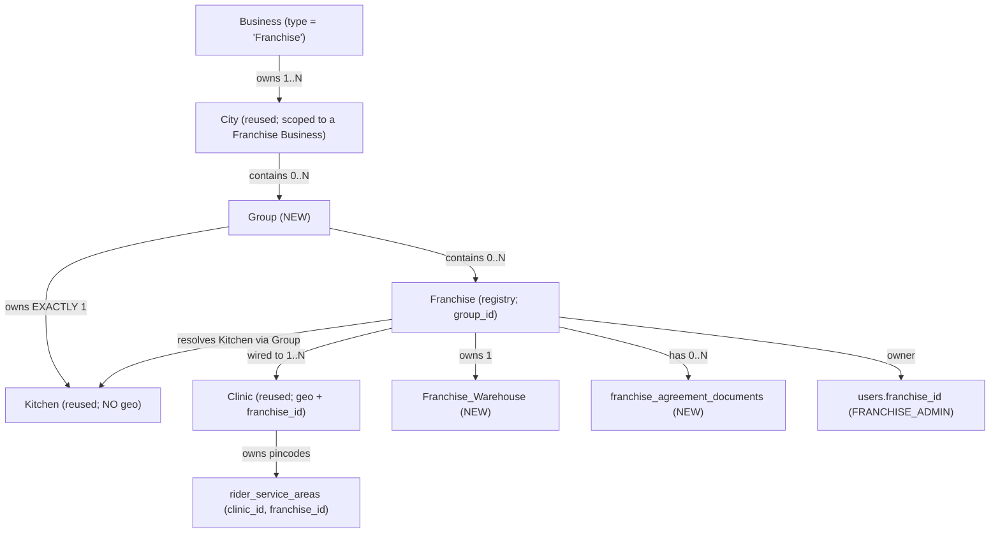
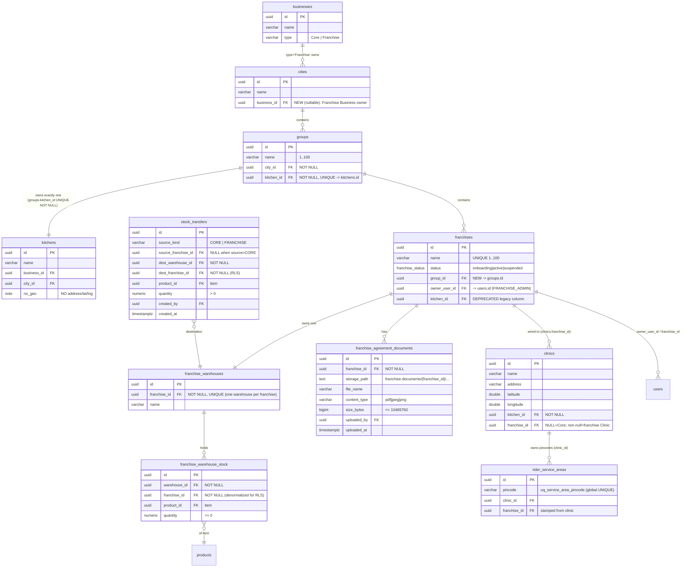

# Design Document

## Overview

This design implements the **franchise side** of the `Business → Kitchen → Clinic` model established by the completed `core-clinic-architecture` spec, expanding it into the full multi-level hierarchy required by the rewritten requirements:

> **Business (type `Franchise`) → City → Group → Kitchen → Franchise → Clinic**

`core-clinic-architecture` already shipped the foundational, franchise-ready primitives (the `businesses`, `cities`, `kitchens` (no geo), `clinics` (geo + nullable `franchise_id`), the `rider_service_areas` one-pincode-one-clinic model, the `move_pincode_and_reassign` atomic RPC, and the Primary_Address-keyed customer→clinic stamping flow). This spec is **strictly additive on top of that work**: it introduces the missing middle levels of the hierarchy (`Group`), formalizes the `franchises` registry against `Group` rather than against a flat kitchen anchor, wires Franchises to Clinics, adds agreement-document storage and a franchise warehouse / stock-transfer model, and turns on tenant isolation (RLS) + a `Scope_Resolver` that is provably consistent with the RLS layer.

The design **replaces the current stale `design.md`** entirely. The stale document described a flat `franchises` table whose single `kitchen_id` anchor carried geo and was written for business stakeholders. That framing is obsolete in three ways and is corrected here:

1. **Geo lives only on the Clinic.** A Kitchen carries no `address`/`latitude`/`longitude`. The routing origin for a Franchise is its wired franchise **Clinic**, exactly as core-clinic mandates.
2. **A Franchise hangs off a `Group`, not a kitchen.** `franchises.kitchen_id` (the legacy anchor column that still physically exists on the live table) is **deprecated**; the Kitchen is resolved through the Group (`Franchise → Group → Kitchen`).
3. **One-pincode-one-entity is owned by the core-clinic service-area model** (`rider_service_areas.clinic_id` + the global `uq_service_area_pincode` unique index), not by the legacy `franchise_pincodes` table, which is deprecated.

Everything franchise-specific stays gated behind the existing `FRANCHISE_FEATURES_ENABLED` flag. The Core (Hyderabad) operation is never migrated, never stamped with a `franchise_id`, and behaves exactly as it does today.

### Alignment with Existing Conventions

- **Stack**: Next.js 16 App Router (Server Components by default), TypeScript strict, Supabase (Postgres + RLS), Shadcn UI, Zustand, React Hook Form + Zod. Mutations are Next.js Server Actions in `src/actions/`.
- **Portal isolation** (`structure.md`): the Master portal (`src/app/master/`) owns all Hierarchy CRUD; the Franchise portal (`src/app/franchise/`, served at `franchies.arogyadiet.com`) and the Admin portal (`src/app/admin/`) consume shared, RBAC-aware components from `src/shared/components`. No cross-portal imports.
- **Layered access**: Server Action → service (`src/lib/clinic/*`, `src/lib/franchise/*`) → repository (`src/repositories/*`) → Supabase. Background/admin mutations use `createAdminClient` (service role) exactly as `routeEngine.ts` and `move_pincode_and_reassign` do today.
- **Additive SQL** (`DATABASE_RULES.md`): every schema change ships as a **new** file in `scripts/` that the user runs manually. New tables and columns are nullable/additive; RLS is created idle and enabled last. Nothing in this spec drops or rewrites Core data.
- **Reuse over reinvention**: this spec reuses `src/lib/clinic/pincode-resolver.ts`, `stamping.ts`, the `assignment-resolver` batch pattern, and the `move_pincode_and_reassign` RPC pattern rather than introducing parallel implementations.

### Non-Goals

- **No migration of Core_Operation data.** Core records keep `NULL` `franchise_id`. No backfill, no column rewrites (Req 20.1, 20.2).
- **No change to `admin.arogyadiet.com` Core behavior.** No franchise-selection step is introduced into the existing Core admin flow (Req 20.4).
- **No franchise inventory stamping of the existing core inventory/manufacturing tables.** Franchise stock is held in a *separate* franchise-warehouse model (the core `inventory_*` / `manufacturing_*` tables remain core-only, as already decided in `add-franchise-id-columns.sql`).
- **No rebuild of the operational dashboards.** The customer/rider/inventory/order/report screens remain the existing shared components, made scope-aware (Req 17) — building those components is out of scope; wiring their scope is in scope.
- **No new auth provider, no role-model change.** Roles (`MASTER_ADMIN`, `ADMIN`, `FRANCHISE_ADMIN`, `RIDER`, `CUSTOMER`) already exist.
- **No removal of the legacy `franchise_pincodes` / `franchises.kitchen_id` columns** in this spec — they are deprecated (stop being read/written) but left physically present for additive safety. Their physical removal is a later cleanup.

### What Already Exists (and is reused, not recreated)

| Artifact | Status | Reused for |
|---|---|---|
| `businesses` (type `Core`/`Franchise`) | live (core-clinic) | The `Franchise_Business` parent of the hierarchy |
| `cities` (`uq_cities_name_lower`) | live (core-clinic) | City level; this spec scopes a City to a `Franchise` business |
| `kitchens` (+`business_id`, +`city_id`, **no geo**) | live (core-clinic) | The single Kitchen owned by each Group |
| `clinics` (geo, nullable `franchise_id`, FK conditional) | live (core-clinic) | Franchise Clinic wiring (`franchise_id` non-null) |
| `rider_service_areas.clinic_id` + `uq_service_area_pincode` | live (core-clinic) | One-pincode-one-entity invariant + overlap detection |
| `move_pincode_and_reassign(text,uuid,uuid)` | live (core-clinic) | Pattern mirrored by the new inter-group-move RPC |
| `src/lib/clinic/pincode-resolver.ts`, `stamping.ts` | live (core-clinic) | Assignment_Resolver (Req 14) |
| `franchises` (name unique, status enum, owner_user_id, **kitchen_id legacy**) | live (`create-franchise-tables.sql`) | Franchise registry — **add `group_id`**, deprecate `kitchen_id` |
| `add-franchise-id-columns.sql` (18 tenant tables stamped) | live | Tenant isolation columns (Req 9, 10) |
| `create-franchise-rls-policies.sql` + `is_global_role()` / `current_franchise_id()` / `set_franchise_context()` | live (idle) | RLS layer (Req 10, 11) + Scope helpers (Req 18) |
| `src/middleware.ts` subdomain routing (`franchies`/`admin`/`master`) | live | Routing_Middleware (Req 16) — additive hardening only |
| `franchise_pincodes` table | live | **Deprecated** — superseded by `rider_service_areas` model |

---

## Architecture

### Hierarchy



Key invariants encoded by the schema:

- A **City** belongs to exactly one `Franchise` Business (Req 1.1).
- A **Group** belongs to exactly one City and **owns exactly one Kitchen**, 1:1 (Req 2.1, 2.2).
- A **Franchise** belongs to exactly one Group (Req 3.1); its City/Kitchen/Business are resolved through the Group (Req 3.4): `Franchise → Group → City → Business` and `Franchise → Group → Kitchen`.
- A **Clinic** is the only entity carrying geo; a franchise Clinic carries a non-null `franchise_id` (Req 6.1, 6.2).
- A served **pincode** maps to exactly one Clinic, hence to exactly one entity (Core or one Franchise) — enforced by `uq_service_area_pincode` (Req 15.1).

### The Group ↔ Kitchen one-to-one constraint (decision)

The 1:1 is modeled as **`groups.kitchen_id UUID NOT NULL UNIQUE`**, not `kitchens.group_id UNIQUE`.

Rationale:

1. **"Exactly one" must be enforceable.** `groups.kitchen_id NOT NULL` guarantees every Group references a Kitchen (at-least-one); `UNIQUE` guarantees no two Groups share a Kitchen (at-most-one). Together they enforce the *exactly one* Group→Kitchen relationship at the database level (Req 2.2).
2. **Core kitchens stay untouched.** The reused `kitchens` table holds Core kitchens (from core-clinic) that belong to **no** Group. If we put `kitchens.group_id UNIQUE` on the kitchen side, that column would have to be nullable (Core kitchens have no group), which makes "a Group has *exactly* one kitchen" unenforceable from the schema and pushes it into fragile application logic. Keeping the FK on the Group side leaves Core kitchens completely unaffected — they are simply never referenced by any `groups.kitchen_id`.
3. **Resolution direction matches the requirements.** Req 3.4 / 6.3 resolve the Kitchen *through* the Group (`Franchise → Group → Kitchen`). `groups.kitchen_id` is exactly that pointer, so reads follow the FK with no reverse lookup.

Group creation therefore creates the Kitchen and the Group atomically in one transaction (Req 2.3): `INSERT kitchen(business_id := city's business, city_id := group's city, no geo)` → `INSERT group(city_id, name, kitchen_id := new kitchen)`. Group deletion (Req 2.7) deletes the Group then its owned Kitchen in one transaction, guarded by "zero Franchises" (Req 2.8).

## Data Models



### New tables to create (additive `scripts/` files)

All created idle (RLS policies created but not enabled), additive, idempotent (`CREATE TABLE IF NOT EXISTS`), mirroring `create-clinic-hierarchy-tables.sql`.

| New table | Key columns / constraints | Requirement |
|---|---|---|
| `groups` | `city_id NOT NULL FK`, `name 1..100`, `kitchen_id NOT NULL UNIQUE FK→kitchens` | Req 2 |
| `franchise_agreement_documents` | `franchise_id NOT NULL FK`, `storage_path`, `file_name`, `content_type CHECK IN ('application/pdf','image/jpeg','image/png')`, `size_bytes CHECK (<= 10485760)`, `uploaded_by`, `uploaded_at` | Req 7 |
| `franchise_warehouses` | `franchise_id NOT NULL UNIQUE FK`, `name` | Req 19.1 |
| `franchise_warehouse_stock` | `warehouse_id NOT NULL FK`, `franchise_id NOT NULL FK`, `product_id FK`, `quantity NUMERIC CHECK (>= 0)`, `UNIQUE(warehouse_id, product_id)` | Req 19.1, 19.2 |
| `stock_transfers` | `source_kind CHECK IN ('CORE','FRANCHISE')`, `source_franchise_id NULL`, `dest_warehouse_id NOT NULL`, `dest_franchise_id NOT NULL`, `product_id`, `quantity CHECK (> 0)`, `created_by`, `created_at` | Req 19.5 |

### Additive column changes to existing tables

| Table | Change | Why | Requirement |
|---|---|---|---|
| `cities` | `ADD COLUMN business_id UUID NULL FK→businesses(id)` | Scope a franchise City to its `Franchise` Business; Core cities keep NULL | Req 1.1 |
| `franchises` | `ADD COLUMN group_id UUID NULL FK→groups(id)` (+ index) | A Franchise belongs to a Group; app enforces NOT NULL on create | Req 3.1 |
| `franchises` | **deprecate** `kitchen_id` (stop reading/writing) | Kitchen now resolved via Group | Req 3.4 |
| `franchise_warehouse_stock`, `stock_transfers` | carry `franchise_id` natively | Tenant isolation for franchise inventory without touching core `inventory_*` | Req 19.6 |

`franchise_id` on the other 18 tenant tables is **already present** (`add-franchise-id-columns.sql`); this spec adds *no* new `franchise_id` columns there. Core `inventory_*` / `manufacturing_*` tables remain unstamped by design (franchise stock is a separate model).

### Why the legacy franchise columns are deprecated, not reused

- `franchises.kitchen_id` directly anchored a Franchise to a Kitchen (the flat model). The new model resolves Kitchen through the Group, so this column is left in place (additive safety) but is no longer read or written. New code resolves `franchise.group_id → groups.kitchen_id`.
- `franchise_pincodes` (with its own `uq_pincode_global`) duplicated the one-pincode-one-entity rule that core-clinic already owns via `rider_service_areas.pincode` + `uq_service_area_pincode`. Two independent uniqueness sources would be impossible to keep consistent. The franchise pincode set is therefore expressed exactly like Core: rows in `rider_service_areas` whose `clinic_id` points at a franchise Clinic (and whose `franchise_id` is stamped from that Clinic). `franchise_pincodes` is deprecated.

---

## Components and Interfaces

All server actions return the same discriminated result shape used across the codebase:

```typescript
export type ActionResult<T = void> =
  | { success: true; data: T }
  | { success: false; error: string; field?: string };
```

Every Master action below is authorized to `MASTER_ADMIN` only (Req 12.6, 16.7) and is gated by `FRANCHISE_FEATURES_ENABLED` (Req 1.6, 20.8). Every action resolves the caller's Scope through the shared `Scope_Resolver` *before* touching data (Req 18.1).

### Server-action surface — `src/actions/master-actions/`

#### `cityActions.ts` (Req 1)

```typescript
export interface FranchiseCityInput { businessId: string; name: string; } // name 1..100

// Validates: business exists AND type='Franchise' (Req 1.1/1.3); name non-empty,
// <=100, unique case-insensitively within that Business (Req 1.2). Reuses
// validateCityName from src/lib/clinic/validation.ts (existingNamesLower scoped
// to the business).
export async function createFranchiseCity(input: FranchiseCityInput): Promise<ActionResult<{ id: string }>>;
export async function updateFranchiseCity(id: string, input: FranchiseCityInput): Promise<ActionResult>;

// Deletes only when the City has zero Groups (Req 1.4); otherwise rejects with
// "city has associated groups" (Req 1.5).
export async function deleteFranchiseCity(id: string): Promise<ActionResult>;
```

#### `groupActions.ts` (Req 2)

```typescript
export interface GroupInput { cityId: string; name: string; } // name 1..100

// Atomically creates the Group AND its single owned Kitchen (no geo) in one tx
// (Req 2.3): INSERT kitchen(business_id := city.business_id, city_id := cityId)
// then INSERT group(city_id, name, kitchen_id := kitchen). Rejects empty/>100
// name or non-existent city (Req 2.6). Runs via createAdminClient.
export async function createGroup(input: GroupInput): Promise<ActionResult<{ id: string; kitchenId: string }>>;

// Renames the Group / its Kitchen label. Never reassigns the kitchen_id (the 1:1
// is immutable post-create); attempting to attach a second Kitchen is rejected
// (Req 2.6).
export async function updateGroup(id: string, input: GroupInput): Promise<ActionResult>;

// Deletes the Group AND its single owned Kitchen in one tx, only when the Group
// has zero Franchises (Req 2.7); otherwise rejects "group has associated
// franchises" (Req 2.8).
export async function deleteGroup(id: string): Promise<ActionResult>;
```

#### `franchiseActions.ts` (Req 3, 4, 5)

```typescript
export type FranchiseStatus = "onboarding" | "active" | "suspended";

export interface FranchiseInput {
  name: string;          // 1..100, unique across all franchises (Req 3.1)
  groupId: string;       // must reference an existing Group (Req 3.1)
  ownerUserId: string;   // exactly one FRANCHISE_ADMIN owner (Req 4.1)
}

// Persists with status 'onboarding' (Req 3.5). Rejects: empty/>100/duplicate
// name, non-existent group, missing owner (Req 3.6, 4.2). Stamps group_id; does
// NOT write the legacy kitchen_id.
export async function createFranchise(input: FranchiseInput): Promise<ActionResult<{ id: string }>>;
export async function updateFranchise(id: string, input: Omit<FranchiseInput, "ownerUserId"> & { status?: FranchiseStatus }): Promise<ActionResult>;

// Lifecycle transitions (Req 4.3/4.4/4.7/4.8). Each validates the transition is
// meaningful (reject no-ops: activate-when-active, suspend-when-suspended → Req 4.8)
// and completes within 5s. activate() additionally refuses while the franchise
// has any unresolved pincode-overlap conflict (Req 15.5/15.6).
export async function activateFranchise(id: string): Promise<ActionResult>;
export async function suspendFranchise(id: string): Promise<ActionResult>;
export async function reactivateFranchise(id: string): Promise<ActionResult>;

// Inter-group move WITHIN the same City (Req 5). Thin wrapper over the atomic RPC
// move_franchise_to_group. Surfaces the re-resolved Kitchen + cascade preview to
// the caller before commit (Req 5.4).
export async function moveFranchiseToGroup(
  franchiseId: string,
  destGroupId: string
): Promise<ActionResult<{ newKitchenId: string; preservedFranchiseId: string }>>;
```

#### `clinicWiringActions.ts` (Req 6)

```typescript
export interface FranchiseClinicInput {
  franchiseId: string;
  name: string;        // non-empty
  address: string;     // non-empty
  latitude: number;    // -90..90 inclusive
  longitude: number;   // -180..180 inclusive
}

// Persists a clinics row with franchise_id set and kitchen_id resolved as the
// Franchise's Group's single Kitchen (Clinic → Franchise → Group → Kitchen,
// Req 6.3). Reuses validateClinicInput from src/lib/clinic/validation.ts; rejects
// missing/out-of-range geo, missing name/address (Req 6.5).
export async function wireClinicToFranchise(input: FranchiseClinicInput): Promise<ActionResult<{ clinicId: string }>>;
export async function updateFranchiseClinic(clinicId: string, input: FranchiseClinicInput): Promise<ActionResult>;

// Assign/move a served pincode to a franchise Clinic. Delegates to the SAME
// core-clinic atomic RPC move_pincode_and_reassign; the franchise_id stamp on
// rider_service_areas is derived from the destination clinic. Surfaces overlap
// conflicts (Req 15.2) when uq_service_area_pincode would be violated.
export async function assignPincodeToFranchiseClinic(pincode: string, clinicId: string): Promise<ActionResult<{ reassignedCount: number }>>;
```

#### `agreementDocActions.ts` (Req 7)

```typescript
export interface AgreementDocMeta {
  id: string; franchiseId: string; fileName: string;
  contentType: string; sizeBytes: number; uploadedAt: string;
}

// Validates content type ∈ {application/pdf,image/jpeg,image/png} and
// size <= 10 MB (10,485,760 bytes) BEFORE upload (Req 7.8/7.9). Stores the file
// in the PRIVATE bucket `franchise-documents` under `{franchise_id}/...` and
// records metadata (Req 7.1/7.2). MASTER_ADMIN only for write.
export async function uploadAgreementDocument(franchiseId: string, file: File): Promise<ActionResult<AgreementDocMeta>>;

// Returns only this franchise's docs (Req 7.3). Replace keeps the franchise_id
// association (Req 7.4).
export async function listAgreementDocuments(franchiseId: string): Promise<ActionResult<AgreementDocMeta[]>>;
export async function replaceAgreementDocument(docId: string, file: File): Promise<ActionResult<AgreementDocMeta>>;

// Returns a short-lived SIGNED URL (no public URL ever — Req 7.7). Access granted
// ONLY to MASTER_ADMIN, ADMIN (Core_Admin), or the owning FRANCHISE_ADMIN whose
// franchise_id matches the doc (Req 7.5). Any other caller → generic
// "not permitted", without revealing the document exists (Req 7.6).
export async function getAgreementDocumentUrl(docId: string): Promise<ActionResult<{ signedUrl: string; expiresIn: number }>>;
```

#### `stockTransferActions.ts` (Req 19)

```typescript
export interface StockTransferInput {
  sourceKind: "CORE" | "FRANCHISE";  // Core→Franchise AND Franchise→Franchise
  sourceFranchiseId?: string;        // required when sourceKind='FRANCHISE'
  destFranchiseId: string;           // destination Franchise (owns dest warehouse)
  productId: string;                 // item
  quantity: number;                  // must be > 0 (Req 19.4)
}

// Executes via the atomic RPC transfer_stock (below). Conserves total quantity
// (Req 19.2); rejects qty > source available (Req 19.3) and qty <= 0 (Req 19.4);
// records a stock_transfers row on success (Req 19.5). Full-network scope only
// (Req 19.7).
export async function initiateStockTransfer(input: StockTransferInput): Promise<ActionResult<{ transferId: string }>>;

// Franchise scope sees only its own warehouse stock (Req 19.6).
export async function listFranchiseWarehouseStock(franchiseId: string): Promise<ActionResult<Array<{ productId: string; quantity: number }>>>;
```

### Scope helper — `src/lib/auth/scope-resolver.ts` (Req 18)

The `Scope_Resolver` is the single application-layer gate and is **defined to mirror the RLS predicate exactly** (see RLS section). Every server action calls `resolveScope()` first and then constrains its query with `applyScope()`.

```typescript
export type Scope =
  | { kind: "full_network" }                  // MASTER_ADMIN or ADMIN (Req 18.3)
  | { kind: "franchise"; franchiseId: string } // FRANCHISE_ADMIN with franchise_id (Req 18.2)
  | { kind: "core" };                          // core users (Req 18.4)

// Resolves exactly one Scope from the authenticated user's role + franchise_id.
// Returns an error result if no Scope can be resolved (Req 18.6) or the
// FRANCHISE_ADMIN has no franchise_id (Req 8.4).
export async function resolveScope(): Promise<{ ok: true; scope: Scope } | { ok: false; reason: "unresolved" | "no_franchise" }>;

// Pure predicate: does this Scope permit acting on a row carrying rowFranchiseId?
// MUST be logically identical to the RLS USING/WITH CHECK clause so no layer
// permits what the other denies (Req 18.7).
export function scopePermits(scope: Scope, rowFranchiseId: string | null): boolean;
//  full_network → true for any rowFranchiseId
//  franchise(f) → rowFranchiseId === f
//  core         → rowFranchiseId === null

// Applies the Scope to a Supabase query builder (adds .eq('franchise_id', f) for
// franchise scope, .is('franchise_id', null) for core scope, nothing for full).
export function applyScope<Q>(query: Q, scope: Scope): Q;

// Sets the DB session context (app.role, app.franchise_id) via the existing
// set_franchise_context RPC, so the same boundary is enforced by RLS for the
// duration of the request (Req 18.7).
export async function bindDbScope(scope: Scope, role: string): Promise<void>;
```

### Reused core-clinic services (no reinvention)

- **`src/lib/clinic/pincode-resolver.ts` / `stamping.ts`** — the `Assignment_Resolver` (Req 14). At signup the customer's **Primary_Address** pincode is resolved to a Clinic; the customer is stamped with that Clinic's `clinic_id` **and** the Clinic's `franchise_id` (NULL for Core, Req 14.1/14.2). Unresolved → Waitlist_State (Req 14.5). Selecting a different Delivery_Address for a day never changes the association (Req 14.8) — this is the existing Clinic_Conflict flow, unchanged.
- **`move_pincode_and_reassign`** — reused verbatim for all pincode (re)assignment, including franchise Clinics; the franchise stamp follows the destination clinic.
- **`assignment-resolver.ts` batch pattern** — reused for waitlist→franchise promotion (Req 14.7): when a franchise Clinic begins serving a waitlisted pincode, the same batch reassignment stamps the franchise's `franchise_id`/`clinic_id` onto matching waitlisted customers.

### Atomic RPCs (mirror `move_pincode_and_reassign`)

New `scripts/` SQL files defining `SECURITY DEFINER` functions invoked by the service-role admin client after the action authorizes the caller — exactly the established pattern.

```sql
-- scripts/create-move-franchise-to-group-rpc.sql  (Req 5)
-- Inter-group move WITHIN the same city, atomically. On success the franchise
-- belongs only to the destination group; on failure it remains only in the
-- source group (Req 5.1). Preserves franchise_id, tenant data, clinic wiring,
-- and served pincodes (Req 5.5) — it only rewrites franchises.group_id.
CREATE OR REPLACE FUNCTION public.move_franchise_to_group(
  p_franchise_id uuid,
  p_dest_group_id uuid
) RETURNS uuid              -- returns the re-resolved kitchen_id (Req 5.4)
LANGUAGE plpgsql SECURITY DEFINER SET search_path = public AS $$
DECLARE
  v_src_city  uuid;
  v_dest_city uuid;
  v_kitchen   uuid;
BEGIN
  SELECT g.city_id INTO v_src_city
    FROM public.franchises f JOIN public.groups g ON g.id = f.group_id
   WHERE f.id = p_franchise_id;

  SELECT g.city_id, g.kitchen_id INTO v_dest_city, v_kitchen
    FROM public.groups g WHERE g.id = p_dest_group_id;

  IF v_dest_city IS NULL THEN
    RAISE EXCEPTION 'destination group not found';        -- Req 5.3
  END IF;
  IF v_src_city IS DISTINCT FROM v_dest_city THEN
    RAISE EXCEPTION 'inter-group move allowed only within the same city'; -- Req 5.2
  END IF;

  UPDATE public.franchises SET group_id = p_dest_group_id WHERE id = p_franchise_id;
  -- clinics.franchise_id, rider_service_areas, and all tenant rows are untouched.
  RETURN v_kitchen;        -- new Group's Kitchen (Franchise → Group → Kitchen)
END; $$;
```

```sql
-- scripts/create-transfer-stock-rpc.sql  (Req 19)
-- Atomically decrement source and increment destination so total is conserved
-- (Req 19.2). Rejects qty<=0 (Req 19.4) and qty>available (Req 19.3). Inserts a
-- stock_transfers ledger row on success (Req 19.5). Source may be CORE or another
-- FRANCHISE warehouse (Req 19.7).
CREATE OR REPLACE FUNCTION public.transfer_stock(
  p_source_kind text, p_source_franchise_id uuid,
  p_dest_franchise_id uuid, p_product_id uuid,
  p_quantity numeric, p_created_by uuid
) RETURNS uuid LANGUAGE plpgsql SECURITY DEFINER SET search_path = public AS $$ ... $$;
```

---

## RLS Policy + Scope_Resolver Strategy (Req 10, 11, 18)

Tenant isolation is enforced in **two layers that share one predicate**, so neither layer can permit what the other denies (Req 18.7).

### The shared predicate

```
permitted(row.franchise_id) :=
     is_global_role()                                          -- MASTER_ADMIN / ADMIN  → all rows
  OR (row.franchise_id = current_franchise_id())               -- FRANCHISE_ADMIN       → own franchise
  OR (row.franchise_id IS NULL AND current_franchise_id() IS NULL) -- core user        → core rows
```

This is **exactly** the clause already shipped (idle) in `create-franchise-rls-policies.sql` for the 18 existing tenant tables, and it is **exactly** what `scopePermits()` computes in the application layer:

| Scope (app) | `scopePermits(scope, fid)` | RLS clause that matches |
|---|---|---|
| `full_network` | `true` | `is_global_role()` |
| `franchise(f)` | `fid === f` | `row.franchise_id = current_franchise_id()` |
| `core` | `fid === null` | `row.franchise_id IS NULL AND current_franchise_id() IS NULL` |

The session variables `app.role` and `app.franchise_id` are set per request via the existing `set_franchise_context(role, franchise_id)` RPC, called from `bindDbScope()`. The middleware already resolves and injects `x-franchise-id`; `bindDbScope` consumes it. Master/Core (`is_global_role`) bypass the franchise filter and see Core + all franchises (Req 11.1). Franchise users with null/empty `franchise_id` match no rows → all tenant access denied (Req 10.6, 8.4).

### New tables get the same policy shape

This spec adds the identical four-policy (SELECT/INSERT/UPDATE/DELETE) set to the **new** franchise-scoped tables, in a new file `scripts/create-franchise-hierarchy-rls-policies.sql` (created idle):

- `franchise_warehouses`, `franchise_warehouse_stock`, `stock_transfers` → full predicate above (`dest_franchise_id`/`franchise_id` is the scoped column; `stock_transfers` SELECT also matches `source_franchise_id` so a source franchise sees outbound transfers).
- `franchise_agreement_documents` → **read** restricted to `is_global_role() OR franchise_id = current_franchise_id()` (Req 7.5); **write** restricted to `is_global_role()` (Master uploads). Storage-object access is additionally guarded by signed URLs + an action-layer role check (defense in depth, Req 7.6/7.7).
- **Hierarchy structure tables** (`cities`, `groups`, `franchises`) are reference/management data: `SELECT USING (true)` (everyone may read structure), write restricted to `is_global_role()` — mirroring how core-clinic treats `businesses`/`cities`/`clinics`.

### INSERT stamping (Req 9)

Tenant writes by a Franchise_User are stamped server-side with the **requester's own** `franchise_id`, ignoring any `franchise_id` in the payload (Req 9.2). The RLS `WITH CHECK` clause rejects any insert whose `franchise_id` is not the requester's own (Req 9.3) or is null/unresolvable for a franchise user (Req 9.4/9.5). Core_Admin/Core users insert with `NULL` `franchise_id` (Req 9.6/9.7) — unchanged from today.

### Enablement is deferred (production safety)

Policies are **created idle**. RLS is **enabled last**, via a new `scripts/enable-franchise-hierarchy-rls.sql` (companion to the existing `enable-franchise-rls.sql`), only after the new tables + application Scope binding are deployed and validated. A matching `disable-franchise-hierarchy-rls.sql` provides rollback. While disabled, behavior is identical to today (Req 20.3/20.8).

---

## Master Dashboard UI (`src/app/master/`) (Req 12)

The Master Dashboard renders the Hierarchy as an interactive tree and **replaces the legacy flat `/franchises` page**. The old flat list (franchise + kitchen anchor) is removed from navigation and superseded by the tree view (Req 12.1).

```
src/app/master/(main)/hierarchy/
  page.tsx                      # Server Component: loads City→Group→Kitchen→Franchise→Clinic tree (MASTER_ADMIN only)
  _components/
    HierarchyTree.tsx           # Client: expandable City > Group (+ its 1 Kitchen) > Franchise > Clinics
    CityFormDialog.tsx          # create/edit City (cityActions)
    GroupFormDialog.tsx         # create/edit Group (groupActions) — creates Group + its Kitchen
    FranchiseFormDialog.tsx     # create/edit Franchise + assign owner (franchiseActions)
    FranchiseStatusControls.tsx # activate / suspend / reactivate (+ overlap-conflict guard)
    InterGroupMoveDialog.tsx    # move Franchise to another Group in the SAME city; shows kitchen re-resolve preview
    ClinicWiringDialog.tsx      # wire/edit franchise Clinic (geo) + assign pincodes (clinicWiringActions)
    AgreementDocsPanel.tsx      # upload / list / replace docs; opens via short-lived signed URL
    PincodeConflictBanner.tsx   # surfaces overlap conflicts within 2s of a conflicting mapping (Req 15.2/15.3)
```

Behavior:

- **Tree rendering** (Req 12.3): expanding a City shows its Groups; each Group shows its single Kitchen (no geo fields) and its Franchises; each Franchise shows its wired Clinics (with geo) and status badge.
- **CRUD** (Req 12.2): create/edit/delete Cities, Groups, Franchises, and franchise Clinics, each enforcing the validation in Req 1–6 via the server actions above.
- **Inter-group move** (Req 12.4, 5): `InterGroupMoveDialog` lists only destination Groups in the **same City**, previews the re-resolved Kitchen and cascade implications (Req 5.4), then calls `moveFranchiseToGroup` (atomic RPC). On success the Franchise's `franchise_id`, tenant data, clinic wiring, and pincodes are visibly unchanged (Req 5.5).
- **Agreement docs** (Req 12.5, 7): `AgreementDocsPanel` enforces type/size client-side for UX and server-side authoritatively; downloads open via signed URL only.
- **Access gating** (Req 12.6): the route is `MASTER_ADMIN`-only at the middleware layer; non-master roles never receive Hierarchy data (no structure leaks to the client).
- **Forms**: React Hook Form + Zod (Zod schemas mirror the action validators); Shadcn dialogs/inputs; Zustand only for transient tree-expansion UI state.

Cross-franchise reporting (Req 11.5/11.7) lives in the existing Master dashboard home; it reads consolidated metrics with `full_network` scope and supports single-franchise drill-down (Req 11.6).

---

## Subdomain Routing (`src/middleware.ts`) (Req 16)

The middleware **already** maps `franchies → /franchise`, `admin → /admin`, `master → /master`, gates each by role, redirects mismatched roles, checks suspended franchises, and injects `x-franchise-id`. The additions here are backward-compatible hardening — no existing behavior changes:

1. **Bind DB scope per request.** After resolving role + `franchise_id`, call `bindDbScope` (→ `set_franchise_context`) so RLS enforces the same boundary the middleware computed (Req 18.7). For Core admin and Master this sets the global role; for a Franchise_Admin it sets their `franchise_id`.
2. **Unauthenticated → login preserving subdomain** (Req 16.9): already redirects to `/login`; ensure the requested subdomain/host is preserved on the redirect.
3. **Unknown subdomain → unauthorized** (Req 16.10): a host that maps to no portal falls through to the unauthorized page and exposes no data (today it resolves `portalPath = ""`; make this explicit by routing unknown *named* subdomains to `/unauthorized`).
4. **Suspended franchise** (Req 4.5): the existing suspended-franchise redirect to `/unauthorized` is retained; the franchise dashboard shows the "suspended" indication.
5. **Franchise_Admin reaching admin/master → bounced back** to `franchies` workspace (Req 16.5): tighten the current `/unauthorized` redirect for `FRANCHISE_ADMIN` on the `admin`/`master` subdomains to instead redirect to the franchise portal root.
6. **500 ms / role checks** remain in the middleware layer so no page renders before the boundary is enforced (Req 16.1–16.3, 16.8).

`FRANCHISE_FEATURES_ENABLED` guards franchise-portal activation: while false, the `franchies` subdomain behaves as today and no franchise runtime path activates (Req 20.8).

---

## Tenant Data Isolation & Core Coexistence (Req 9, 10, 11, 20, 21)

- **Stamping** is server-side and authoritative (Req 9.2): franchise writes get the requester's `franchise_id`; core writes get `NULL` (Req 9.6/9.7).
- **Isolation** for read/list/aggregate/modify/delete is enforced by the shared predicate across every tenant table (Req 10.1–10.8). A cross-franchise read returns rows indistinguishable from non-existent (Req 10.3).
- **Core coexistence** (Req 20): no migration; Core rows keep `NULL` `franchise_id`; Core routing runs over `franchise_id IS NULL` with no franchise filter (Req 20.5); franchise routing scopes to one `franchise_id` using the franchise Clinic as origin (Req 20.6, 21.1/21.2). Franchises operate independently with no ordering dependency (Req 20.7).
- **Franchise daily ops scoping** (Req 21): routing/inventory/rider/report reads for a Franchise_Admin are constrained to that franchise's records via `applyScope` + RLS; the Core_Admin can drive routing for Core or any Franchise from the Admin dashboard (Req 21.6).
- **Global tables** (`system_settings`, `roles`, `subscription_plans`, `meal_categories`, `holidays`, `products`) are read-identical for all tenants and writable only by Core_Admin/Master (Req 13).

---

## Correctness Properties

These are testable properties intended for **property-based testing with `fast-check`**, following the core-clinic design's property style. Each pure helper is exercised over generated inputs; isolation/RPC properties are exercised against a seeded test database. Tag: `@pbt fast-check`.

### Property 1: Tenant isolation soundness `@pbt fast-check`

For all rows `r` and scopes `s`: a Franchise scope `franchise(f)` permits `r` **iff** `r.franchise_id === f`; a `core` scope permits `r` **iff** `r.franchise_id === null`; `full_network` permits every `r`.
`∀ s, r: scopePermits(s, r.franchise_id) === rlsPredicate(s, r.franchise_id)` (app layer ≡ RLS layer, Req 10, 18.7).

**Validates: Requirements 10.1, 10.2, 18.7**

### Property 2: Scope soundness / no leakage `@pbt fast-check`

For all generated multi-franchise datasets and any non-global scope `s`, the set returned by `applyScope(query, s)` contains **no** row whose `franchise_id` violates `scopePermits(s, ·)`. Cross-franchise and core rows are absent for `franchise(f)`; franchise rows are absent for `core` (Req 10.1/10.4/10.8).

**Validates: Requirements 10.1, 10.4, 10.8**

### Property 3: One-pincode-one-entity `@pbt fast-check`

For all sequences of pincode-assignment operations, every served pincode resolves to **at most one** Clinic, hence to at most one entity (Core or a single Franchise). Any second assignment of an already-served pincode is rejected (the `uq_service_area_pincode` invariant holds for every reachable state, Req 15.1).

**Validates: Requirements 15.1**

### Property 4: Group has exactly one Kitchen `@pbt fast-check`

For all sequences of group create/update/delete operations, every persisted `groups` row has a non-null `kitchen_id`, and no Kitchen id appears as `kitchen_id` on two distinct Groups. `∀ g: g.kitchen_id ≠ null ∧ (∀ g1,g2: g1.kitchen_id = g2.kitchen_id ⟹ g1 = g2)` (Req 2.2).

**Validates: Requirements 2.2**

### Property 5: Inter-group move preserves franchise identity `@pbt fast-check`

For all valid same-city moves, after `move_franchise_to_group(f, g)`: `f.group_id === g`, `f.franchise_id` is unchanged, the set of `clinics` with `franchise_id = f` is unchanged, and the set of served pincodes for `f` is unchanged. A cross-city or non-existent-destination move leaves `f.group_id` unchanged (Req 5.1/5.2/5.3/5.5).

**Validates: Requirements 5.1, 5.2, 5.3, 5.5**

### Property 6: Stock conservation on transfer `@pbt fast-check`

For all transfers with `0 < qty ≤ sourceAvailable`: `sourceAfter + destAfter === sourceBefore + destBefore` and `destAfter === destBefore + qty` and `sourceAfter === sourceBefore - qty`. For `qty ≤ 0` or `qty > sourceAvailable`: both balances are unchanged and no `stock_transfers` row is written (Req 19.2/19.3/19.4). On every success exactly one ledger row records source, destination, item, qty, timestamp (Req 19.5).

**Validates: Requirements 19.2, 19.3, 19.4, 19.5**

### Property 7: Document access control `@pbt fast-check`

For all (role, franchise_id, document) triples: `getAgreementDocumentUrl` returns a signed URL **iff** the requester is `MASTER_ADMIN`, `ADMIN`, or a `FRANCHISE_ADMIN` whose `franchise_id` equals the document's `franchise_id`; every other requester gets a generic not-permitted result that does not reveal existence, and no public URL is ever produced (Req 7.5/7.6/7.7).

**Validates: Requirements 7.5, 7.6, 7.7**

### Property 8: Assignment determinism by Primary_Address `@pbt fast-check`

For all customers, the resolved `(clinic_id, franchise_id)` is a pure function of the **Primary_Address** pincode and the pincode→clinic map; selecting any Delivery_Address for a day never changes the stored association (Req 14.1/14.2/14.8). An unresolved Primary_Address yields the Waitlist_State (Req 14.5).

**Validates: Requirements 14.1, 14.2, 14.5, 14.8**

### Property 9: Franchise status transition validity `@pbt fast-check`

For all status transitions: activate/reactivate succeed **iff** current status ≠ `active`; suspend succeeds **iff** current status ≠ `suspended`; every no-op transition is rejected and leaves status unchanged (Req 4.8). Activation is additionally rejected while any unresolved pincode-overlap conflict exists for the franchise (Req 15.6).

**Validates: Requirements 4.8, 15.6**

### Property 10: Core coexistence invariance `@pbt fast-check`

For all operations confined to `core` scope, no franchise table read/write observes or mutates a row with non-null `franchise_id`, and no Core row is ever stamped with a `franchise_id` (Req 9.6, 20.1/20.2/20.5).

**Validates: Requirements 9.6, 20.1, 20.2, 20.5**

---

## Error Handling

| Scenario | Condition | Response | Requirement |
|---|---|---|---|
| Invalid City | empty/>100/dup name, or business missing/not `Franchise` | reject, persist nothing, field-specific error | 1.3 |
| City has Groups | delete attempted with ≥1 Group | reject, retain, "city has associated groups" | 1.5 |
| Second kitchen on a Group | attempt to attach a 2nd Kitchen | reject (UNIQUE + app guard) | 2.6 |
| Group has Franchises | delete attempted with ≥1 Franchise | reject, retain | 2.8 |
| Duplicate franchise name | name collides across `franchises` | reject (DB UNIQUE + app check) | 3.6 |
| Missing owner | create without exactly one Franchise_Admin | reject, persist nothing | 4.2 |
| Invalid status transition | activate-when-active / suspend-when-suspended | reject, status unchanged | 4.8 |
| Cross-city move | dest Group in different City | reject, group_id unchanged | 5.2 |
| Dest group not found | unknown destination | reject, group_id unchanged | 5.3 |
| Bad clinic geo | missing/out-of-range lat/lng, missing name/address | reject, persist nothing, offending field | 6.5 |
| Bad document | type ∉ {pdf,jpeg,png} or size > 10 MB | reject, store nothing, type/size error | 7.9 |
| Unauthorized document read | non-owner requests doc | generic not-permitted, no existence disclosure | 7.6 |
| Pincode overlap | pincode mapped to 2nd entity at setup | conflict surfaced within 2s, naming the pincode + all entities; blocks activation only | 15.2/15.3/15.6 |
| Insufficient stock | transfer qty > source available | reject, balances unchanged, "insufficient source stock" | 19.3 |
| Invalid transfer qty | qty ≤ 0 | reject, balances unchanged | 19.4 |
| Franchise_Admin no franchise | authenticated, no franchise_id | deny dashboard, "missing franchise association" | 8.4 |
| Unresolvable scope | authenticated but scope indeterminate | deny, "scope could not be determined" | 18.6 |
| Waitlisted customer orders | pincode serves no active entity | accept signup, block ordering, show "area not served" | 14.5/14.6 |

---

## Testing Strategy

### Property-based testing
`fast-check` drives the pure helpers (`scopePermits`, `applyScope`, `validateClinicInput`, `validateCityName`, stock-conservation arithmetic, status-transition logic, document-ACL logic) over generated inputs per the Correctness Properties above. DB-level properties (P3, P5, P6) run against a seeded ephemeral Supabase schema with the new tables + RPCs.

### Unit testing
Each server action: happy path + each rejection branch in Error Handling. RPC functions (`move_franchise_to_group`, `transfer_stock`): atomicity (forced mid-transaction failure leaves no partial state).

### Integration / isolation testing (highest priority)
- A `FRANCHISE_ADMIN` can never read/list/aggregate/modify/delete another franchise's rows across every tenant table, with RLS **enabled** (Req 10).
- `MASTER_ADMIN`/`ADMIN` see Core + all franchises (Req 11.1).
- Core users see only `NULL` `franchise_id` rows; franchise rows invisible (Req 10.8).
- Scope_Resolver ≡ RLS: for a sampled matrix of (role, franchise_id, row), no action allowed by one layer is denied by the other (Req 18.7).

### Routing tests
Subdomain → portal mapping, role gating, Franchise_Admin bounce-back, unknown subdomain → unauthorized, suspended-franchise denial (Req 16).

### Regression
With `FRANCHISE_FEATURES_ENABLED` false (and RLS disabled), the Core operation behaves byte-for-byte as today — no franchise filtering, no new steps (Req 20.3/20.4/20.8).

---

## Security Considerations

- **Private bucket + signed URLs**: `franchise-documents` is private; no object is ever public (Req 7.7). Access is gated at the action layer (role + franchise match) and by storage RLS, then served as a short-lived signed URL.
- **Server-side franchise stamping**: clients can never set `franchise_id`; it is derived from the authenticated session (Req 9.2), defeating tenant-spoofing.
- **Defense in depth**: the application Scope_Resolver and the database RLS layer both enforce the same predicate; RLS holds even if an action forgets `applyScope`.
- **Service-role usage**: `createAdminClient` (bypasses RLS) is used only inside authorized, validated server actions and `SECURITY DEFINER` RPCs — never exposed to franchise callers — matching the existing `routeEngine`/`move_pincode_and_reassign` discipline.

---

## Dependencies

- Existing: `core-clinic-architecture` schema (`businesses`, `cities`, `kitchens`, `clinics`, `rider_service_areas`, `workload_snapshots`), `move_pincode_and_reassign`, `src/lib/clinic/*`, the live `franchises`/`franchise_pincodes` tables, `add-franchise-id-columns.sql`, `create-franchise-rls-policies.sql` + helpers, `src/middleware.ts`.
- Supabase Storage bucket `franchise-documents` (private) — provisioned as part of this feature.
- No new third-party libraries; uses the established stack (Next.js 16, Supabase, Zod, React Hook Form, Shadcn, Zustand, `fast-check` for tests).

---

## Production-Safety Phasing

Strictly additive, RLS enabled **last** — mirroring core-clinic's rollout discipline.

1. **Schema (idle).** New `scripts/` files: `create-groups-table.sql`, `add-group-id-to-franchises.sql` (+ `cities.business_id`), `create-franchise-agreement-documents-table.sql`, `create-franchise-warehouse-tables.sql`, `create-stock-transfers-table.sql`. New RPCs: `create-move-franchise-to-group-rpc.sql`, `create-transfer-stock-rpc.sql`. All additive, nullable, idempotent; **RLS policies created but not enabled**.
2. **Application code.** Master-actions surface, `scope-resolver`, middleware `bindDbScope` hardening, Master Hierarchy UI — all behind `FRANCHISE_FEATURES_ENABLED`. Core paths untouched.
3. **Backfill / wiring (manual, controlled).** Master_Admin creates the `Franchise` Business → Cities → Groups (+Kitchens) → Franchises → Clinics and assigns pincodes via the existing atomic move path. No Core data touched.
4. **Enable RLS (last).** Run `enable-franchise-hierarchy-rls.sql` (and confirm `enable-franchise-rls.sql` for the 18 base tenant tables) only after scope binding is verified in staging. Rollback via `disable-franchise-hierarchy-rls.sql`.
5. **Deprecation cleanup (later, out of scope).** Physically drop `franchises.kitchen_id` and `franchise_pincodes` once no code references them.
