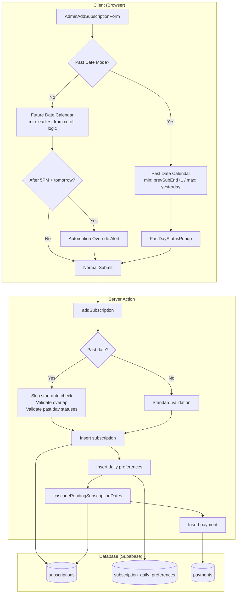

# Design Document: New Plan Past Date Start

## Overview

This feature extends the `AdminAddSubscriptionForm` to support past-date start date selection when an admin adds a new subscription for an existing customer. It mirrors the past-date functionality already implemented in `QuickOnboardingForm` but adds a constraint: the selectable date range must begin after the customer's previous subscription's end date to prevent overlap.

The design introduces three key behavioral additions to the existing form:
1. A **Past Date Mode toggle** that unlocks past-date selection (up to 30 days back) with overlap protection
2. The **Past Day Status Popup** integration for capturing delivery history on past days
3. The **5 PM IST cutoff alert** with automation-override acknowledgment when selecting tomorrow after cutoff

The server action (`addSubscription`) is extended to validate past-date submissions, enforce overlap rules, and persist past day delivery statuses — reusing the existing `skipStartDateCheck` option mechanism and `cascadePendingSubscriptionDates` function.

## Architecture



### Key Design Decisions

1. **Reuse existing `PastDayStatusPopup`**: The popup component is already generic (accepts `startDate`, `endDate`, `onConfirm`, `onCancel`). No changes needed to the popup itself.

2. **Reuse `cutoff.ts` utilities**: The `pastDayStatusBoundary`, `earliestStartDate`, `getPastDateRange`, and `PAST_DATE_MAX_DAYS` functions are already extracted and pure. We import them into `AdminAddSubscriptionForm`.

3. **Extend existing server action with options**: The `addSubscription` action already has an `options` parameter with `skipStartDateCheck` and `skipOverlapCheck`. For past-date submissions, we pass `skipStartDateCheck: true` and implement a new overlap check that accounts for PENDING and EXPIRED subscriptions alongside ACTIVE ones.

4. **Client-side `Date` objects vs. ISO strings**: The existing `AdminAddSubscriptionForm` uses `Date` objects via `date-fns` and `react-day-picker` `Calendar`. The past-date logic (from `cutoff.ts`) uses YYYY-MM-DD strings. We'll bridge by converting between the two at the form boundary using `format()` and `parseISODateString()`.

5. **Props-driven previous subscription end date**: The parent page already fetches `activeSubscription` data. We extend `InitialSubscriptionData` to include `previousSubscriptionEndDate` (the `effective_end_on` of the most recent non-active subscription) so the form can compute the valid past-date range.

## Components and Interfaces

### Modified Components

#### `AdminAddSubscriptionForm` (Client Component)

**New Props** added to `InitialSubscriptionData`:

```typescript
export type InitialSubscriptionData = {
  activeSubscription: { id: string; effective_end_on: string } | null;
  previousSubscriptionEndDate: string | null; // NEW: YYYY-MM-DD of last completed sub's effective_end_on
  subscriptionPlans: SubscriptionPlan[];
  mealCategories: MealCategory[];
  addresses: AddressOption[];
};
```

**New Form Fields** (added to Zod schema):

```typescript
// Added to formSchema
pastDateEnabled: z.boolean().default(false),
pastDayStatuses: z.array(pastDayStatusSchema).optional().default([]),
automationOverrideAcknowledged: z.boolean().default(false),
```

**New UI Elements:**
- Past date toggle (Switch) — visible only when `activeSubscription` is null
- `PastDayStatusPopup` — triggered on submit when a past date is selected
- Automation override alert — shown when after 5 PM IST and start date is tomorrow

#### `addSubscription` Server Action

**Extended payload schema** (new optional fields):

```typescript
const baseSchema = z.object({
  // ... existing fields ...
  pastDateEnabled: z.boolean().optional().default(false),
  pastDayStatuses: z.array(pastDayStatusEntrySchema).optional(),
  skipStartDateCheck: z.boolean().optional().default(false),
});
```

**New validation logic** (when `pastDateEnabled: true`):
1. Skip the standard "start date must be tomorrow or later" check
2. Validate start date is within allowed range (after previous sub end, max 30 days back)
3. Validate no overlap with ACTIVE, PENDING, or EXPIRED subscriptions
4. Validate `pastDayStatuses` array: correct date range, valid entries, complete coverage

### Reused Components (No Changes)

- `PastDayStatusPopup` — used as-is with `startDate` and `endDate` props
- `cutoff.ts` utilities — `pastDayStatusBoundary`, `earliestStartDate`, `getPastDateRange`, `ONBOARDING_CUTOFF_HOUR_IST`
- `cascadePendingSubscriptionDates` — invoked after subscription creation with `effective_end_on` as `baseEndDate`

### New Utilities

#### `getPastDateRangeForAddSub(istToday: string, previousEndDate: string | null): { start: string; end: string }`

Computes the selectable past-date range for the Admin Add Subscription form:

```typescript
function getPastDateRangeForAddSub(
  istToday: string,
  previousEndDate: string | null,
): { start: string; end: string } {
  const thirtyDaysAgo = addDaysToISODate(istToday, -PAST_DATE_MAX_DAYS);
  const yesterday = addDaysToISODate(istToday, -1);

  // Start: max(prevEnd + 1, thirtyDaysAgo)
  let start: string;
  if (previousEndDate) {
    const afterPrevEnd = addDaysToISODate(previousEndDate, 1);
    start = afterPrevEnd > thirtyDaysAgo ? afterPrevEnd : thirtyDaysAgo;
  } else {
    start = thirtyDaysAgo;
  }

  return { start, end: yesterday };
}
```

## Data Models

### Subscription Table (existing — no schema changes)

| Column | Type | Description |
|--------|------|-------------|
| id | uuid | Primary key |
| customer_profile_id | uuid | FK to customer_profiles |
| plan_id | uuid | FK to subscription_plans (nullable for custom) |
| starts_on | date | Subscription start date |
| ends_on | date | Original end date |
| effective_end_on | date | Adjusted end date (pauses extend this) |
| status | enum | ACTIVE, PENDING, EXPIRED, CANCELLED |
| total_days | int | Plan duration in days |
| pause_credits_total | int | Total allowed pauses |
| pause_credits_used | int | Pauses consumed |
| consumed_days | int | Days elapsed |

### subscription_daily_preferences Table (existing — no schema changes)

For past-date subscriptions, the daily preferences for past days are pre-populated based on the `pastDayStatuses` array from the popup. Delivered days get the specified `meal_category_id` and `delivery_address_id`. Skipped days get `is_paused: true` and `pause_credit_used: true`.

### Past Day Status Payload (in-flight, not persisted as separate table)

```typescript
interface PastDayStatus {
  date: string;          // YYYY-MM-DD
  mealStatus: "Delivered" | "Skipped";
  mealType: "VEG" | "EGG" | "CHICKEN" | null;
  deliveryAddress: "Primary" | "Secondary" | null;
}
```

This data is used during subscription creation to populate `subscription_daily_preferences` rows correctly for past days, rather than being stored separately.


## Correctness Properties

*A property is a characteristic or behavior that should hold true across all valid executions of a system — essentially, a formal statement about what the system should do. Properties serve as the bridge between human-readable specifications and machine-verifiable correctness guarantees.*

### Property 1: Past date range computation

*For any* IST today string and any `previousEndDate` (null, a date within the last 30 days, or a date more than 30 days ago), the function `getPastDateRangeForAddSub(istToday, previousEndDate)` SHALL return a range where:
- `start` equals `max(previousEndDate + 1 day, istToday - 30 days)` when previousEndDate exists, or `istToday - 30 days` when null
- `end` always equals `istToday - 1 day` (yesterday)

**Validates: Requirements 1.3, 1.4, 1.5, 2.1, 2.2**

### Property 2: Cutoff-driven earliest future start date

*For any* instant `now`, the function `earliestStartDate(now)` SHALL return `istToday + 2 days` when `istHourOf(now) >= 17`, and `istToday + 1 day` when `istHourOf(now) < 17`, where `istToday = istDateStringOf(now)`.

**Validates: Requirements 1.2**

### Property 3: Past day status boundary

*For any* instant `now`, the function `pastDayStatusBoundary(now)` SHALL return today's IST date when `istHourOf(now) >= 17`, and yesterday's IST date when `istHourOf(now) < 17`.

**Validates: Requirements 3.3, 3.4**

### Property 4: Past day entry validation

*For any* `PastDayStatusEntry`, `isEntryComplete(entry)` SHALL return `true` if and only if: (a) `mealStatus` is "Skipped", OR (b) `mealStatus` is "Delivered" AND `mealType` is non-null AND `deliveryAddress` is non-null.

**Validates: Requirements 3.5**

### Property 5: Automation override controls submit enablement

*For any* combination of `isAfterCutoff` (boolean), `startDate` (string), `tomorrowIST` (string), and `automationOverrideAcknowledged` (boolean): the submit button SHALL be disabled if and only if `isAfterCutoff === true AND startDate === tomorrowIST AND automationOverrideAcknowledged === false`.

**Validates: Requirements 4.1, 4.3, 4.4, 4.5**

### Property 6: Overlap detection

*For any* proposed subscription range `[newStart, newEnd]` and any set of existing subscriptions with ranges `[starts_on, effective_end_on]` having status ACTIVE or PENDING, the overlap predicate SHALL return `true` (conflict) if and only if there exists at least one existing subscription whose range shares one or more calendar days with the proposed range (i.e., `existingStart <= newEnd AND existingEnd >= newStart`).

**Validates: Requirements 2.4, 2.5, 5.2**

### Property 7: Server-side past-date acceptance

*For any* past start date and optional `previousEndDate`: the server validation SHALL accept the start date if and only if (a) it is strictly before today, AND (b) when `previousEndDate` exists, the start date is strictly after `previousEndDate`, AND (c) the start date is within the last 30 days from today.

**Validates: Requirements 5.1**

### Property 8: Past day statuses payload validation

*For any* array of `PastDayStatus` entries, start date, and boundary date: the server validation SHALL accept the payload if and only if (a) entries cover every date from start date through boundary date inclusive, (b) each entry has `mealStatus` of "Delivered" or "Skipped", (c) each "Delivered" entry has a non-null `mealType` in {"VEG", "EGG", "CHICKEN"} and non-null `deliveryAddress` in {"Primary", "Secondary"}, and (d) the entry count is between 1 and 30 inclusive.

**Validates: Requirements 5.4, 5.5**

### Property 9: Subscription status assignment

*For any* new subscription creation: if no ACTIVE subscription exists for the customer, the new subscription's status SHALL be "ACTIVE"; if an ACTIVE subscription exists, the new subscription's status SHALL be "PENDING". This holds regardless of whether the start date is in the past or future.

**Validates: Requirements 6.3, 6.4**

## Error Handling

### Client-Side Errors

| Scenario | Handling |
|----------|----------|
| Past date range is empty (prevEnd >= yesterday) | Disable the Past Date Mode toggle, show "No valid past dates available" message |
| Overlap detected during date selection | Disable conflicting dates in calendar picker |
| Overlap detected on form submit | Toast error: "Selected date range conflicts with existing subscription [dates]" |
| Past Day Status Popup cancelled | Return to form without submitting, preserve form state |
| Automation override not acknowledged | Disable submit button with tooltip explaining requirement |
| Server rejects submission (validation) | Display server error message via toast, scroll to relevant field |
| Network/server error | Generic toast: "Failed to create subscription. Please try again." |

### Server-Side Errors

| Scenario | Response |
|----------|----------|
| Start date before previousEndDate+1 | `{ success: false, error: "Start date must be after previous subscription end date ({date})." }` |
| Start date more than 30 days in past | `{ success: false, error: "Start date cannot be more than 30 days in the past." }` |
| Overlap with existing subscription | `{ success: false, error: "Date range overlaps with existing subscription ({code}: {start} — {end})." }` |
| Missing/incomplete pastDayStatuses | `{ success: false, error: "Delivery status is required for all days from {start} to {boundary}." }` |
| Invalid pastDayStatus entry | `{ success: false, error: "Invalid delivery status entry for {date}: {reason}." }` |
| Database insert failure | `{ success: false, error: "An unexpected error occurred." }` (logged server-side) |
| Cascade error mid-chain | Error thrown, transaction partially committed (existing behavior per Req 6.5) |

### Validation Layers

1. **Client Zod schema** — Prevents submission of structurally invalid data
2. **Calendar disabled-date function** — Prevents selection of invalid dates
3. **Server Zod schema** — Re-validates all fields server-side
4. **Server business logic** — Overlap check, date range check, pastDayStatuses completeness
5. **Database constraints** — Unique subscription_code, FK integrity

## Testing Strategy

### Property-Based Tests (fast-check)

The project will use [fast-check](https://github.com/dubzzz/fast-check) for property-based testing. Each property test runs a minimum of 100 iterations.

**Testable pure functions:**
- `getPastDateRangeForAddSub` — Property 1
- `earliestStartDate` — Property 2 (already exists from onboarding feature, extend for add-sub context)
- `pastDayStatusBoundary` — Property 3 (already exists, reuse)
- `isEntryComplete` — Property 4
- `canSubmit` logic (extracted as pure predicate) — Property 5
- `hasOverlap` (new pure predicate) — Property 6
- `isValidPastStartDate` (server validation logic extracted) — Property 7
- `validatePastDayStatuses` (server validation logic extracted) — Property 8
- Status assignment logic (extracted predicate) — Property 9

**Tag format:** `Feature: new-plan-past-date-start, Property {number}: {title}`

### Unit Tests (Vitest)

- Form renders Past Date toggle only when no active subscription
- Toggle defaults to off
- Calendar min/max dates update correctly when toggle changes
- PastDayStatusPopup opens on submit with past date
- Automation override alert visibility and checkbox behavior
- Server action rejects invalid payloads (specific examples)
- Server action accepts valid past-date submissions
- Edge case: previousEndDate is exactly yesterday (empty range)
- Edge case: previousEndDate is null (30-day range)

### Integration Tests

- Full form submission flow with past date → popup → confirm → server action
- Cascade logic invoked after past-date subscription creation
- Existing future-date subscription flow remains unaffected
- Franchise portal uses same logic via `submitAction` prop injection

### Test Configuration

```typescript
// vitest.config.ts (property test settings)
{
  test: {
    testTimeout: 30000, // Allow time for 100+ iterations
  }
}
```

Each property-based test file:
```typescript
import fc from "fast-check";

describe("Feature: new-plan-past-date-start", () => {
  it("Property 1: Past date range computation", () => {
    fc.assert(
      fc.property(/* arbitraries */, (inputs) => {
        // Property assertion
      }),
      { numRuns: 100 }
    );
  });
});
```
