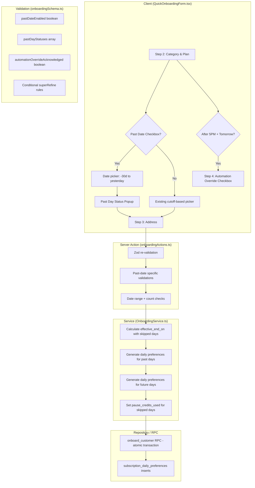

# Design Document: Onboarding Past Date Flexibility

## Overview

This feature extends the existing admin Quick Onboarding 4-step wizard to support past-date subscription starts. Currently, the earliest selectable start date is bound by the 5 PM IST cutoff (tomorrow or day-after-tomorrow). This design introduces:

1. A "Past date start date" toggle on Step 2 that unlocks a 30-day-back date range
2. A Past Day Status Popup modal that captures meal delivery history (Delivered/Skipped) for each past day before advancing to Step 3
3. Relaxed 5 PM cutoff for admin users who can select tomorrow after 5 PM with an explicit automation override acknowledgment
4. Server-side validation and schema extension with Zod to maintain the single-source-of-truth validation pattern

The implementation builds on the existing architecture: the `QuickOnboardingForm` client component, `onboardingSchema.ts` Zod schema, `onboardingActions.ts` server action, `OnboardingService.onboard()` business logic, and the `onboard_customer` RPC for atomic writes.

## Architecture



## Components and Interfaces

### 1. Past Date Checkbox (UI - Step 2)

Added to `QuickOnboardingForm.tsx` within the Step 2 (Category & Plan) section below the start date dropdown.

- Controlled by a `pastDateEnabled` field in the React Hook Form state
- When checked: replaces date picker options with dates from `today - 30` to `yesterday`
- When unchecked: reverts to existing `earliestStartDate()` logic, clears any selected past date and discards captured `pastDayStatuses`

### 2. Past Day Status Popup (New Component)

**File:** `src/shared/components/admin/customers/PastDayStatusPopup.tsx`

A modal dialog (Shadcn Dialog) that opens when the admin attempts to advance from Step 2 to Step 3 with a past start date selected.

```typescript
interface PastDayStatusEntry {
  date: string; // YYYY-MM-DD
  mealStatus: "Delivered" | "Skipped" | null;
  mealType: "VEG" | "EGG" | "CHICKEN" | null;
  deliveryAddress: "Primary" | "Secondary" | null;
}

interface PastDayStatusPopupProps {
  open: boolean;
  onConfirm: (entries: PastDayStatusEntry[]) => void;
  onCancel: () => void;
  startDate: string; // YYYY-MM-DD (past date selected)
  endDate: string;   // YYYY-MM-DD (boundary date based on 5PM cutoff)
}
```

**Behavior:**
- Generates one row per calendar day from `startDate` to `endDate` (inclusive)
- The `endDate` boundary is determined by the 5 PM IST cutoff at popup render time:
  - After 5 PM IST: `endDate` = today (current IST date)
  - Before 5 PM IST: `endDate` = yesterday (current IST date − 1)
- Skipped days disable Meal_Type and Delivery_Address fields
- "Fill same status for all remaining days" button copies from the last fully-completed row to all unfilled rows
- Confirm button enabled only when all rows are valid
- Dismissing discards all entries

### 3. Automation Override Acknowledgment (UI - Step 4)

A conditional checkbox rendered on Step 4 (Payment & Review) when:
- Current IST hour ≥ 17 (evaluated at Step 2 render time, stored in form state)
- Selected start date is tomorrow

The checkbox text: *"I understand automation needs to run again by operation admin. I have received confirmation from process admin to process this onboarding customer."*

While unchecked, the Onboard CTA is disabled.

### 4. Schema Extension (onboardingSchema.ts)

New fields added to both `createQuickOnboardingSchema()` and `quickOnboardingSchema`:

```typescript
// New fields
pastDateEnabled: z.boolean().default(false),
automationOverrideAcknowledged: z.boolean().default(false),
pastDayStatuses: z.array(
  z.object({
    date: z.string().regex(/^\d{4}-\d{2}-\d{2}$/),
    mealStatus: z.enum(["Delivered", "Skipped"]),
    mealType: z.enum(["VEG", "EGG", "CHICKEN"]).nullable(),
    deliveryAddress: z.enum(["Primary", "Secondary"]).nullable(),
  }).superRefine((entry, ctx) => {
    if (entry.mealStatus === "Delivered") {
      if (!entry.mealType) {
        ctx.addIssue({ code: z.ZodIssueCode.custom, path: ["mealType"], message: "Meal type required for delivered days." });
      }
      if (!entry.deliveryAddress) {
        ctx.addIssue({ code: z.ZodIssueCode.custom, path: ["deliveryAddress"], message: "Address required for delivered days." });
      }
    }
  })
).optional().default([]),
```

Conditional `superRefine` rules:
- When `pastDateEnabled === true`: require `pastDayStatuses` length ≥ 1 and ≤ 30, validate `startDate` is within 30 days of today and before today
- When `pastDateEnabled === false`: enforce existing cutoff rules, skip `pastDayStatuses` validation
- When `automationOverrideAcknowledged === true`: allow tomorrow even after 5 PM

### 5. Server Action Extension (onboardingActions.ts)

Additional validations in `onboardCustomerAction`:
- If `pastDateEnabled` is true, bypass the existing `isStartDateAllowed()` check
- Validate past-date-specific rules: date range, entry count, entry completeness, date ordering, no duplicates
- Pass `pastDayStatuses` through to the service layer

### 6. OnboardingService Extension

New logic in `onboard()`:
- Calculate `skippedCount` from `pastDayStatuses`
- Adjust `effective_end_on` = original end date + `skippedCount` days
- Set `pause_credits_used` = `skippedCount` on the subscription
- Generate daily preferences with correct statuses for past days and initial preference for future days
- Validate record count = `total_days` + `skippedCount`
- All within a single transaction (existing RPC pattern)

### 7. Cutoff Logic Extension (cutoff.ts)

New exported function:

```typescript
/**
 * Returns the boundary date (inclusive) for past day status capture.
 * - After 5 PM IST: returns today's IST date (today's delivery outcome is known)
 * - Before 5 PM IST: returns yesterday's IST date (today's delivery is still in progress)
 */
export function pastDayStatusBoundary(now: Date): string;

/**
 * Returns true if the start date is a valid past date for onboarding.
 * Valid means: startDate < today AND startDate >= today - 30 days.
 */
export function isPastStartDateValid(startDate: string, now: Date): boolean;
```

## Data Models

### subscription_daily_preferences (existing table — no schema change)

| Column | Type | Description |
|--------|------|-------------|
| id | uuid | PK |
| subscription_id | uuid | FK to subscriptions |
| customer_profile_id | uuid | FK to customer_profiles |
| preference_date | date | The calendar date |
| meal_category_id | uuid | FK to meal_categories |
| delivery_address_id | uuid | FK to customer_addresses |
| is_paused | boolean | Whether this day is paused/skipped |
| pause_credit_used | boolean | Whether a pause credit was consumed |

### subscriptions (existing — relevant fields)

| Column | Type | Description |
|--------|------|-------------|
| starts_on | date | Subscription start date |
| ends_on | date | Original end date (plan-based) |
| effective_end_on | date | Adjusted end date after pauses |
| total_days | integer | Plan duration in days |
| pause_credits_total | integer | Total pause credits |
| pause_credits_used | integer | Credits consumed (incremented for past skipped days) |

### PastDayStatus (new TypeScript type — client/server shared)

```typescript
interface PastDayStatus {
  date: string;              // YYYY-MM-DD
  mealStatus: "Delivered" | "Skipped";
  mealType: "VEG" | "EGG" | "CHICKEN" | null;
  deliveryAddress: "Primary" | "Secondary" | null;
}
```

No new database tables or columns are required. The feature uses the existing `subscription_daily_preferences` table with `is_paused` and `pause_credit_used` flags, and the existing `subscriptions.pause_credits_used` / `subscriptions.effective_end_on` columns.


## Correctness Properties

*A property is a characteristic or behavior that should hold true across all valid executions of a system — essentially, a formal statement about what the system should do. Properties serve as the bridge between human-readable specifications and machine-verifiable correctness guarantees.*

### Property 1: Past date range computation

*For any* IST date representing "today," the available past-date range SHALL be exactly [today − 30, today − 1] inclusive. That is, `pastDateRangeStart(today) === addDays(today, -30)` and `pastDateRangeEnd(today) === addDays(today, -1)`.

**Validates: Requirements 1.2**

### Property 2: Past day status boundary date

*For any* instant `now`, `pastDayStatusBoundary(now)` SHALL return today's IST date when `istHourOf(now) >= 17`, and yesterday's IST date when `istHourOf(now) < 17`.

**Validates: Requirements 3.1, 3.2**

### Property 3: Entry validity — delivered days require meal type and address

*For any* array of `PastDayStatusEntry` objects, the array is valid if and only if every entry has a non-null `mealStatus`, AND every entry with `mealStatus === "Delivered"` also has non-null `mealType` and non-null `deliveryAddress`. Entries with `mealStatus === "Skipped"` SHALL have `mealType === null` and `deliveryAddress === null`.

**Validates: Requirements 2.2, 2.3, 2.4, 2.5**

### Property 4: Fill operation copies to unfilled entries only

*For any* array of `PastDayStatusEntry` where at least one entry is fully completed (has mealStatus, and if Delivered then mealType + deliveryAddress), applying "fill same status for all remaining days" SHALL copy the source entry's `mealStatus`, `mealType`, and `deliveryAddress` to every entry that currently has `mealStatus === null`, leaving already-filled entries unchanged.

**Validates: Requirements 2.7**

### Property 5: Daily preferences count invariant

*For any* valid past-date onboarding with `planDuration` total days and `skippedCount` past days marked Skipped, the generated `subscription_daily_preferences` record count SHALL equal `planDuration + skippedCount`.

**Validates: Requirements 3.3, 4.5, 6.5**

### Property 6: Effective end date and pause credits extension

*For any* valid past-date onboarding with `skippedCount` past days marked Skipped, the subscription's `effective_end_on` SHALL equal `addDays(starts_on, planDuration - 1 + skippedCount)`, AND `pause_credits_used` SHALL equal `skippedCount`, AND `pause_credits_total` SHALL remain unchanged from the plan's defined value.

**Validates: Requirements 4.1, 4.3, 4.4**

### Property 7: Past-day records faithfully reflect captured statuses

*For any* valid past-date onboarding and *for each* past day entry in `pastDayStatuses`:
- If `mealStatus === "Delivered"`: the corresponding daily preference record SHALL have `is_paused = false`, `pause_credit_used = false`, `meal_category_id` matching the entry's `mealType`, and `delivery_address_id` matching the entry's `deliveryAddress`.
- If `mealStatus === "Skipped"`: the corresponding daily preference record SHALL have `is_paused = true`, `pause_credit_used = true`, `meal_category_id` equal to the subscription's `initial_meal_category_id`, and `delivery_address_id` equal to the primary address.

**Validates: Requirements 6.1, 6.3, 6.4, 4.2**

### Property 8: Future-day records use initial preference and primary address

*For any* valid past-date onboarding, every daily preference record for dates after the boundary date (future days) SHALL have `is_paused = false`, `pause_credit_used = false`, `meal_category_id` equal to the subscription's `initial_meal_category_id`, and `delivery_address_id` equal to the primary address.

**Validates: Requirements 6.2**

### Property 9: Server rejects past date when pastDateEnabled is false

*For any* onboarding payload where `startDate < today` AND `pastDateEnabled === false`, the server action SHALL return `{ success: false }` with an error indicating past-date mode must be enabled.

**Validates: Requirements 7.1**

### Property 10: Server rejects dates beyond 30-day range

*For any* onboarding payload where `startDate < today - 30 days`, the server action SHALL return `{ success: false }` regardless of `pastDateEnabled` value.

**Validates: Requirements 7.2**

### Property 11: Server rejects missing or empty past day statuses

*For any* onboarding payload where `pastDateEnabled === true` AND `startDate < today` AND (`pastDayStatuses` is missing OR has zero entries), the server action SHALL return `{ success: false }`.

**Validates: Requirements 7.3**

### Property 12: Server rejects day count mismatch

*For any* onboarding payload where `pastDateEnabled === true` AND the length of `pastDayStatuses` does not equal the number of calendar days from `startDate` to the boundary date inclusive, the server action SHALL return `{ success: false }`.

**Validates: Requirements 7.4**

### Property 13: Server rejects incomplete delivered entries

*For any* onboarding payload containing a `pastDayStatuses` entry with `mealStatus === "Delivered"` but missing `mealType` or `deliveryAddress`, the server action SHALL return `{ success: false }` with field-level errors identifying the incomplete entry by date.

**Validates: Requirements 7.5**

### Property 14: Server rejects invalid or duplicate dates in past day statuses

*For any* onboarding payload containing `pastDayStatuses` entries with a date outside `[startDate, boundaryDate]` OR containing duplicate dates, the server action SHALL return `{ success: false }`.

**Validates: Requirements 7.6**

### Property 15: Schema conditional validation for past-date mode

*For any* input where `pastDateEnabled === true`, the Zod schema SHALL require `pastDayStatuses` array length between 1 and 30 inclusive, AND SHALL require `startDate` to be earlier than today and within 30 calendar days of today. When `pastDateEnabled === false`, the schema SHALL NOT require `pastDayStatuses`.

**Validates: Requirements 8.3, 8.4, 8.5**

### Property 16: Schema allows tomorrow after 5PM when acknowledged

*For any* instant where `istHourOf(now) >= 17`, the validation logic SHALL accept `startDate === tomorrow` if and only if `automationOverrideAcknowledged === true`.

**Validates: Requirements 8.7, 5.1**

## Error Handling

### Client-Side Errors

| Scenario | Handling |
|----------|----------|
| Past date checkbox toggled off after data entry | Clear startDate, discard pastDayStatuses, show no error |
| Popup dismissed without confirming | Discard entries silently, remain on Step 2 |
| Incomplete popup entries | Confirm button stays disabled; inline validation highlights missing fields |
| Tomorrow selected after 5 PM without acknowledgment | Onboard CTA disabled; no error toast needed |

### Server-Side Validation Errors

| Scenario | Error Response |
|----------|---------------|
| Past date without pastDateEnabled flag | `{ success: false, error: "Past-date mode must be enabled.", fieldErrors: { pastDateEnabled: "..." } }` |
| Start date > 30 days back | `{ success: false, error: "Date exceeds maximum 30-day past range.", fieldErrors: { startDate: "..." } }` |
| Missing pastDayStatuses | `{ success: false, error: "Past day statuses are required.", fieldErrors: { pastDayStatuses: "..." } }` |
| Count mismatch | `{ success: false, error: "Day count mismatch: expected N entries, got M.", fieldErrors: { pastDayStatuses: "..." } }` |
| Incomplete delivered entry | `{ success: false, fieldErrors: { "pastDayStatuses.2.mealType": "Required for delivered days." } }` |
| Invalid/duplicate dates | `{ success: false, error: "Invalid date entry found.", fieldErrors: { "pastDayStatuses.X.date": "..." } }` |
| Transaction failure (DB) | `{ success: false, error: "Onboarding failed. No changes were saved. Please try again." }` — full rollback |

### Transactional Safety

The existing `onboard_customer` RPC pattern already provides all-or-nothing semantics. The extended logic (daily preferences generation with past-date statuses) must execute within the same transaction:
- If daily preferences insertion fails → entire onboarding is rolled back
- If effective_end_on update fails → entire onboarding is rolled back
- Auth user created before RPC is compensated (deleted) on RPC failure, preserving the "no partial Customer_Record" invariant

## Testing Strategy

### Property-Based Tests (fast-check)

The project will use **fast-check** for property-based testing (TypeScript/JavaScript ecosystem, aligns with the existing Vitest test infrastructure).

Configuration:
- Minimum 100 iterations per property test
- Each property test tagged with: `Feature: onboarding-past-date-flexibility, Property N: [description]`

**Properties to implement:**
1. Past date range computation (pure function)
2. Boundary date from cutoff (pure function)
3. Entry validity rules (pure validation logic)
4. Fill operation behavior (pure state transformation)
5. Daily preferences count invariant (service logic with mocked DB)
6. Effective end date extension (pure calculation)
7. Past-day records reflect captured statuses (service logic with mocked DB)
8. Future-day records use defaults (service logic with mocked DB)
9–14. Server-side validation rejection properties (action layer with mocked dependencies)
15. Schema conditional validation (Zod schema, pure)
16. Schema allows tomorrow when acknowledged (Zod schema, pure)

### Unit Tests (Vitest)

Example-based tests for:
- UI rendering: checkbox appears on Step 2, popup opens on step advance
- State transitions: unchecking clears state, changing date hides acknowledgment
- Acknowledgment checkbox text and CTA disable/enable behavior
- Error response format matches existing `OnboardCustomerActionResult` shape
- Schema default values (`pastDateEnabled: false`, `automationOverrideAcknowledged: false`)

### Integration Tests

- Full onboarding submission with past-date payload through the action → service → RPC pipeline
- Transaction rollback verification: simulate DB failure, verify no partial state
- Boundary conditions: exactly 30 days back, exactly 1 day back, all delivered, all skipped
