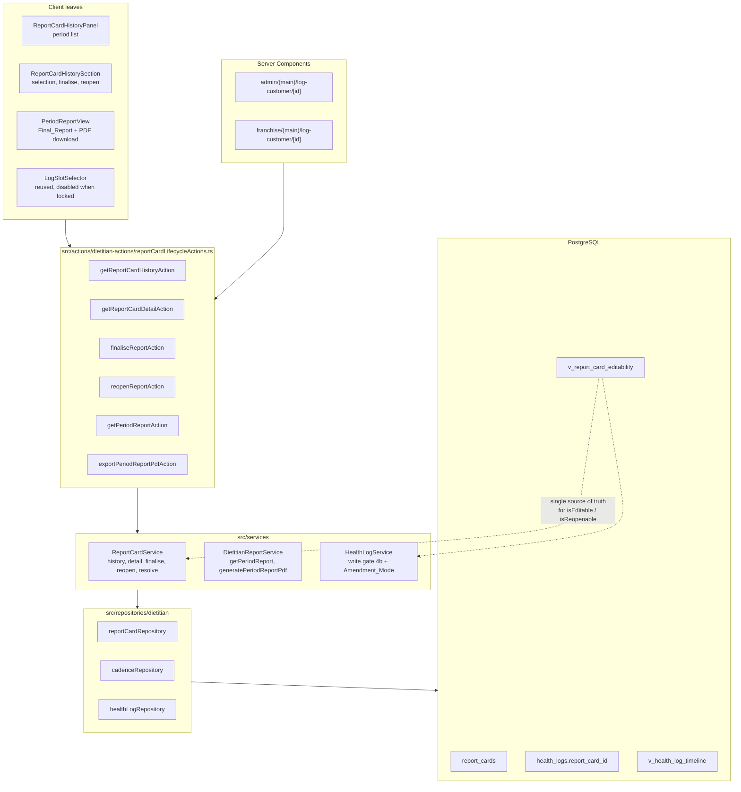
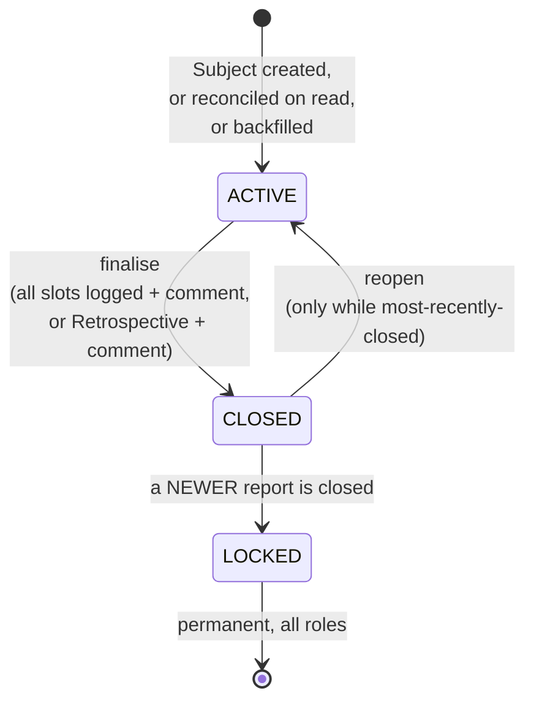

# Design Document

## Overview

This feature promotes the Report_Card from a value computed on every request into a persisted entity with a lifecycle, keyed to the record it actually reports on.

The whole design turns on one decision: **the lock rule is expressed exactly once, as a SQL view, and everything else reads it**. `v_report_card_editability` derives, per Report_Card, whether it may still be written to and whether it may be reopened. The Health_Log write gate, the finalise and reopen paths, the slot renderer and the UI affordances all read those two booleans. None of them re-derives the rule from `status`. That is what makes it impossible for the UI to offer a button the server will refuse, and it is the reason a rule as fiddly as "only the most recently closed report is reopenable, and closing a newer one silently locks the previous one for good" needs no coordinating write at all — it is a consequence of the view's ordering.

The design extends existing primitives rather than adding parallel ones:

- **Cadence** — Log_Slot scheduling is not reimplemented. `slotDates` / `buildLogSlots` from `src/lib/dietitian/logSlots.ts` are called with a Report_Card's window in place of the customer's current window, so a historical period's slot count and slot numbering are computed by the same function that produces the live workspace's. Passing a different `pausedDates` set would renumber the slots, which is why the paused set is threaded through rather than filtered afterwards.
- **Health data** — `health_logs` gains one nullable `report_card_id`. The three legacy tables (`admin_health_logs`, `customer_health_logs`, `kit_daily_logs`) are untouched, and `v_health_log_timeline` keeps working as-is.
- **Authorisation** — `checkDietitianScope(customerProfileId)` remains the only gate. Report lifecycle actions resolve the owning customer from the report id first, then call it.
- **Layering** — pure slot logic in `src/lib/dietitian/`, data access in `src/repositories/dietitian/`, business rules in `src/services/`, `"use server"` wrappers in `src/actions/dietitian-actions/`, Server Components with client leaves for the finalise form and the PDF download.

### Goals

- One closable Report_Card per subscription and per stay, for all three Customer_Categories.
- A single, database-level definition of what is editable and what is reopenable.
- A write lock that binds the server regardless of UI state, and that fails closed when windows overlap.
- Reversibility limited to one step: the most recently closed report, reopenable without limit while it holds that position.
- Per-period reports whose figures are stable — a finished period's report does not shift when a later period gains logs.
- An additive, idempotent, rollback-documented migration.

### Non-Goals

- No change to Self_Log capture in the Customer Portal.
- No migration of the three legacy health tables. They stay authoritative for their existing flows and are read through the existing union view.
- No replacement of the customer-wide Report_Card PDF in `reportCardActions.ts`. It stays, along with its KIT/ACCOMMODATION restriction.
- No deletion path for a Report_Card, ever.
- No new role, no new access level, no middleware change.

### Key design decisions

| Decision | Rationale |
|---|---|
| A `report_card_id` FK on `health_logs`, not date-window attribution | `health_logs_one_dietitian_log_per_day` permits one Dietitian_Log per customer per day. If two windows touched, a log's owning record would be ambiguous and the lock rule could not be evaluated at all. One FK makes the lock a single join. |
| Lock rule as a view (`v_report_card_editability`), not TypeScript | Four consumers need the same answer: the write gate, finalise, reopen, and the UI. A view means they cannot disagree. It also makes "closing report N locks report N-1" require zero writes — the ordering does it. |
| Multiple ACTIVE Report_Cards per customer are legal | Deliberately no unique index on `(customer_profile_id) WHERE status='ACTIVE'`. A Dietitian may leave an old subscription's report unfinished while the next subscription runs. Uniqueness is per Subject, which is the real invariant. |
| Accommodation keys on `stay_entry_id`, not `subscription_id` | A Stay_Extension prolongs the same `stay_entries` row, so extended nights fold into one report with no new row and no window surgery beyond refreshing `window_end`. |
| Window snapshot on the row, refreshed while ACTIVE, frozen at finalisation | A closed report must state the period it actually covered. Recomputing from the subscription would let a later `effective_end_on` change silently restate a closed report. |
| Write-path attribution from the Governing_Record; backfill attribution from a date heuristic | Going forward there is exactly one candidate by construction, so no date math is involved. Only historical rows need a tie-break, and only because backdated creation produced overlapping windows. |
| Overlapping windows fail closed in the write gate | If any Report_Card covering the date is locked, the write is refused. An overlap must not become a route to editing a locked period. |
| `Retrospective_Report` (Requirement 18) derived as `window_end < created_at::date` in IST | Needs no hard-coded migration date and no maintenance. Self-describing: a period that had already elapsed before its report existed could never have been logged on its deadlines. Cannot be reached for a live period. |
| Per-report timeline selected by window, not by `report_card_id` | The three legacy tables in `v_health_log_timeline` have no such column. Filtering on the FK would silently blank every report for an existing Accommodation or KIT customer. |
| Per-period adherence computed fresh, not reused from `CadenceService` | `CadenceService` answers "how overdue is this customer right now". Applying that to a period that ended in May would restate history using today's numbers. |
| Reads via SSR client, writes via service-role after a scope assertion | Same pattern as `dietitian-management`. Routing reads through the anon-key client is what makes the RLS policies load-bearing rather than decorative. |
| No DELETE grant and no DELETE policy on `report_cards` | With RLS on and no matching policy, Postgres denies every DELETE from every non-superuser role. Mirrors `health_logs`. |

## Architecture

### Layering



`ReportCardService` never imports `next/headers` and never reads a session, mirroring `CadenceService`. Scope checks live entirely in the action layer.

### Lifecycle



`LOCKED` is not a stored status. It is `status = 'CLOSED' AND NOT is_reopenable`, derived by the view. Nothing writes it, which is precisely why it cannot drift.

## Components and Interfaces

### Database — `public.report_cards`

Already applied. Shape, with the reasoning for the non-obvious parts:

| Column | Notes |
|---|---|
| `id` | PK |
| `customer_profile_id` | FK, `ON DELETE CASCADE` |
| `subject_type` | `SUBSCRIPTION` \| `STAY` |
| `subscription_id`, `stay_entry_id` | Exactly one set, enforced by `chk_report_card_single_subject` |
| `customer_category` | Denormalised for the UI; the subscription row stays authoritative |
| `window_start`, `window_end` | Snapshot; refreshed while ACTIVE, frozen at finalisation |
| `status` | `ACTIVE` \| `CLOSED` |
| `report_closing_comment` | 1–4000 chars when present |
| `finalised_at`, `finalised_by` | Audit |
| `reopen_count`, `last_reopened_at`, `last_reopened_by` | Audit; no cap on the count |
| `created_at`, `updated_at` | `updated_at` maintained by `trg_report_cards_updated_at` |

Two CHECK constraints carry real weight:

- `chk_report_card_single_subject` — makes `subject_type` and the FK pair agree, so a row can never claim to be a stay report while pointing at a subscription.
- `chk_report_card_closed_shape` — a CLOSED row must have both a comment and a `finalised_at`; an ACTIVE row must have no `finalised_at`. This makes "closed" meaningful at the database level rather than a bare string, and it means Requirement 5.8 holds even against a direct SQL write.

Uniqueness is per Subject via two partial unique indexes, so the unused FK column's NULLs never collide. There is deliberately **no** unique index on active-per-customer.

### Database — `public.v_report_card_editability`

The load-bearing component. Per Report_Card:

- `is_editable` = `status = 'ACTIVE'` OR this row is the customer's latest CLOSED row.
- `is_reopenable` = `status = 'CLOSED'` AND this row is the customer's latest CLOSED row.

"Latest CLOSED" is `ORDER BY finalised_at DESC, id DESC LIMIT 1`. The `id DESC` tie-break is what satisfies Requirement 6.8 — two reports sharing a finalisation timestamp still resolve to one reopenable report deterministically.

`security_invoker = true`, so the view respects the caller's RLS rather than the definer's.

### Repository — `reportCardRepository`

| Function | Purpose |
|---|---|
| `listReportCardsForCustomer` | All reports, newest first, joined to the editability view |
| `getReportCardById` | One report with its lock flags |
| `getReportCardForSubject` | Lookup by subscription or stay |
| `ensureReportCardForSubject` | Get-or-create, keyed on the unique subject indexes |
| `refreshReportCardWindow` | Moves `window_end` for an ACTIVE report (Stay_Extension) |
| `finaliseReportCard` | Guarded UPDATE, `WHERE status = 'ACTIVE'` |
| `reopenReportCard` | Guarded UPDATE, `WHERE status = 'CLOSED' AND reopen_count = $expected` |
| `attachHealthLogToReportCard` | Stamps `report_card_id` |

Both mutators return whether the UPDATE matched a row. That is the whole concurrency story: the guard is inside the statement, so two simultaneous finalises cannot both succeed and the loser is told the report is already closed rather than silently overwriting the winner's comment. `reopenReportCard` additionally guards on the expected `reopen_count`, making the increment a compare-and-swap.

### Service — `ReportCardService`

`getReportCardHistory(customerProfileId, actorUserId)` — reconciles then lists. Reconciliation matters: the Phase 1 backfill covered everything that existed when it ran, and any Subject created afterwards by a path that predates this feature has no report. Creating the missing ones during the read keeps the history complete without requiring the write path to have shipped first, which is what let Phases 1 and 2 deploy independently.

`getReportCardDetail(reportCardId, actorUserId)` — slots plus the window's full timeline. Slot `editable` flags honour the same-day edit window, then the report's own lock overrides: when `isEditable` is false, every slot is forced non-editable. This is the display half of the write gate; the server half is enforced independently in `HealthLogService`.

`finaliseReport` — gate order, each returning rather than throwing so the action layer can surface it as a form error:

1. exists
2. `status = 'ACTIVE'`
3. comment non-empty, ≤ 4000 chars
4. **either** the report is a Retrospective_Report, **or** its window schedules ≥ 1 slot and every slot is logged
5. guarded UPDATE

`reopenReport` — exists, `status = 'CLOSED'`, `isReopenable` read from the view, guarded UPDATE.

`findReportCardForDate(customerProfileId, logDate)` — used by the write gate. Resolves by **date**, not by the Governing_Record, because an edit may target a date inside an older closed period and the Governing_Record would wrongly report the current period as writable. When several windows cover the date, a locked one wins: fail closed. Returns `null` when no window covers the date, which the caller treats as "no report to lock against" rather than as a rejection.

`resolveReportCardForWrite(customerProfileId)` — used for a new log in the current period. Takes the Governing_Record's report, created if absent. Exactly one candidate by construction, no date math.

The two resolvers exist separately on purpose. Collapsing them into one would force either the new-log path to do ambiguous date matching or the edit path to mis-resolve an older period.

### Service — `HealthLogService`

Two additions, both server-side and independent of UI state:

**Gate 4b, the report lock.** After the existing scope and category gates, resolve the Report_Card for the log's date and refuse when `isEditable` is false.

**Amendment_Mode.** The same-day edit window is relaxed only when `status = 'ACTIVE' && reopenCount > 0`. The narrowness is deliberate: a report that has never been closed keeps the ordinary same-day rule, and a report that is closed is not writable at all, so the relaxation applies to exactly the state "deliberately reopened for correction". The authorship rule is **not** relaxed — only the original author may edit, unchanged.

Writes also stamp `report_card_id`, so attribution happens at write time rather than being inferred later.

### Service — `DietitianReportService` (Phase 4)

`getPeriodReport(reportCardId)` returns a `PeriodReportViewModel` extending the existing `ReportCardViewModel` with `reportCardId`, `subjectType`, the window, the status, the finalisation stamp, the reopen count and `hasHealthLogs`.

`computePeriodAdherence` is private and computes the five figures bounded to the window: Dietitian_Log count, outstanding count, Self_Log count, Skipped_Self_Log count, Paused_Day count. It does not call `CadenceService`. That is the point of Requirement 12 — `CadenceService` answers "how overdue is this customer right now", which is a meaningless question to ask of a period that ended in May, and answering it anyway would make a finished report's numbers move whenever the customer's current period changed.

The period's logs come from `getHealthLogTimelineForWindow`, which selects from `v_health_log_timeline` by date range. Selecting by `report_card_id` instead would blank every report for an existing Accommodation or KIT customer, because the three legacy tables in that union have no such column.

`generatePeriodReportPdf(reportCardId)` renders the same view model, returning a `Buffer`.

### Actions — `reportCardLifecycleActions`

Six actions, all following one shape: resolve the report, resolve its customer, `checkDietitianScope`, delegate, `revalidatePath('/log-customer')` on mutation.

Unknown id and out-of-scope id both return the identical `"Report not found."`. A Dietitian must not be able to probe for the existence of another Dietitian's customers by id, and any difference in the two responses — including a difference in wording — would be an oracle.

These actions are **not** restricted to KIT and ACCOMMODATION, unlike the legacy `reportCardActions.ts`. The lifecycle applies to all three categories; a MEAL customer's subscriptions each get a closable report, which is the substance of the feature.

### UI

`ReportCardHistoryPanel` — the period list. Per row: dates, status badge, lock state, slot progress, a marker for the current period and a marker for a Retrospective_Report.

`ReportCardHistorySection` — the stateful wrapper. Owns which report is open, fetches its detail on demand, hosts the finalise form and the reopen button.

For a **CLOSED** report the Final_Report leads and the slot strip collapses below it:

```
┌─ ReportCardHistoryPanel ────────────────┐
│ ▸ 14 Jul – 12 Aug 2026  CLOSED  10/10   │  ← selected
│   19 May – 16 Aug 2026  ACTIVE   3/30   │
└─────────────────────────────────────────┘
┌─ PeriodReportView ──────────────────────┐
│ Final report                    [PDF]   │
│ Dietitian's closing summary             │
│ 5 adherence stat cards                  │
│ Parameter_Table                         │
│ ▸ Daily notes (10)          collapsed   │
└─────────────────────────────────────────┘
▸ Log slots (audit trail)        collapsed   ← LogSlotSelector, disabled
```

For an **ACTIVE** report the slot strip leads and the finalise form sits below it, with `PeriodReportView` available as a preview of what finalising would produce.

The slot strip is the existing `LogSlotSelector` in disabled mode rather than a second slot visual, so a historical period looks identical to the live one and cannot drift from it.

## Data Models

### Attribution, and why the backfill needed a heuristic

Going forward, attribution is unambiguous — the Governing_Record's report, one candidate by construction. The heuristic exists only for the 4 pre-existing logs, and only because backdated creation produced overlapping historical windows.

Preference order, meaning "the record that was actually in force when the Dietitian wrote the log":

1. The Subject that already existed when the log was written (`created_at` in IST ≤ the log's `submission_date_ist`). A Dietitian can only have logged against something that was on screen at the time.
2. Then the ACTIVE Subject.
3. Then the Subject that started most recently while still containing the date.
4. Then the most recently created Subject, purely for determinism.

The worked example from live data is why rule 1 comes first, not rule 2:

| Subscription | Window | Status | Created |
|---|---|---|---|
| `SUB-MNWRH5` | 28 May → 16 Jun 2026 | EXPIRED | 27 May 2026 |
| `SUB-7EUHE2` | 19 May → 16 Aug 2026 | ACTIVE | 3 Jul 2026 (backdated 45 days) |

The windows overlap 28 May – 16 Jun. A log dated 5 June belongs to `SUB-MNWRH5` — it is the only one of the two that existed on 5 June. An ACTIVE-first rule would have chosen `SUB-7EUHE2`, which had not been created yet.

Rules 2–4 currently decide nothing; all 4 logs resolve to exactly one candidate. Anything unresolved keeps NULL and belongs to no report.

### Window formulas

Transcribed from `cadenceRepository.getGoverningRecords` so the backfilled windows match what the application computes:

| Category | Start | End |
|---|---|---|
| MEAL | `starts_on` | `effective_end_on ?? ends_on ?? starts_on` |
| KIT | `kit_received_date ?? starts_on` | `kit_tracker_end_date ?? effective_end_on ?? ends_on ?? window_start` |
| ACCOMMODATION | `stay.start_date` | `start_date + total_nights - 1` |

The KIT branch is the sharp edge. An ACTIVE KIT subscription legitimately carries `starts_on IS NULL` until receipt is confirmed, so filtering the backfill on `starts_on IS NOT NULL` would have silently dropped live KIT plans — and one of the 4 existing logs belongs to exactly such a row.

### Retrospective_Report

`window_end < (created_at AT TIME ZONE 'Asia/Kolkata')::date`

Derived, not stored, so it needs no backfill and no maintenance. For the 236 backfilled rows, `created_at` is the migration timestamp, so every already-elapsed period classifies as retrospective and every still-running one does not. For rows created going forward, `created_at` is at or near `window_start`, so `window_end ≥ created_at` and the relaxation is unreachable — which is the containment property in Requirement 5a.8.

A fully-backdated subscription created after its own period ended also classifies as retrospective. That is correct: its slots could never have been logged on their deadlines either.

The relaxation is confined to the finalise preconditions. A Retrospective_Report's write lock, reopen rule and scoping are unchanged, per Requirement 18.9 — closing one does not make its logs writable, and it enters the Reopen_Window exactly like any other closed report.

## Correctness Properties

These are the properties the test suite must establish. Properties 1–3 are enforced by database constraints, so the test is that a violating write is rejected. Properties 4–6 are properties of the view and are best asserted against a real Postgres rather than a fake.

### Property 1: One Report_Card per Subject

For any subscription and any stay, at most one Report_Card references it.

**Validates: Requirements 1.2**

### Property 2: Subject reference agrees with subject type

For every Report_Card, exactly one Subject foreign key is set, and it is the one its `subject_type` declares.

**Validates: Requirements 1.3**

### Property 3: Closed shape

Every CLOSED Report_Card carries both a Report_Closing_Comment and a finalisation timestamp; every ACTIVE Report_Card carries no finalisation timestamp.

**Validates: Requirements 5.8**

### Property 4: At most one reopenable report per customer

For any customer, the count of Report_Cards where `is_reopenable` is true is at most one — including when two Report_Cards share a finalisation timestamp.

**Validates: Requirements 6.1, 6.8**

### Property 5: Editability derivation

For every Report_Card, `is_editable` is true if and only if it is ACTIVE or it is its customer's most recently closed Report_Card.

**Validates: Requirements 7.2**

### Property 6: Closing shifts the lock window without a write

After finalising a Report_Card, the customer's previously reopenable Report_Card is no longer editable, and no UPDATE was issued against that previously reopenable row.

**Validates: Requirements 6.6**

### Property 7: The write gate binds the server

A Health_Log write targeting a date covered by a non-editable Report_Card is refused, for every input the client can send.

**Validates: Requirements 8.1, 8.6**

### Property 8: Overlapping windows fail closed

Where more than one Report_Card's Logging_Window contains a write's date and at least one of them is not editable, the write is refused.

**Validates: Requirements 8.3**

### Property 9: Amendment_Mode is reachable only after a reopen

The same out-of-window edit is refused on an ACTIVE Report_Card that has never been reopened, and accepted on an ACTIVE Report_Card that has been reopened at least once.

**Validates: Requirements 9.1, 9.3**

### Property 10: Authorship is never relaxed

For every Report_Card state, a Health_Log edit by a user other than the log's original author is refused.

**Validates: Requirements 9.2**

### Property 11: Concurrent finalisation closes once

Two concurrent finalise requests for one Report_Card produce one closure; the losing caller is told the report is already closed and the winner's Report_Closing_Comment is intact.

**Validates: Requirements 5.7**

### Property 12: Concurrent reopen reopens once

Two concurrent reopen requests for one Report_Card produce one reopen and one increment of the reopen count.

**Validates: Requirements 6.7**

### Property 13: A finished period's figures are stable

Adding Health_Logs to a later period does not change any Adherence_Figure of an earlier period's report.

**Validates: Requirements 12.5**

### Property 14: Slot schedules agree with the Cadence_Engine

For the same window and the same paused-day set, a Report_Card's slot count and slot numbering equal those the Cadence_Engine produces.

**Validates: Requirements 12.4**

### Property 15: Migration idempotence

Running the Migration_Script a second time leaves the schema, every Report_Card and every log attribution unchanged.

**Validates: Requirements 4.3**

### Property 16: Retrospective relaxation is exact

A Retrospective_Report finalises with a Report_Closing_Comment alone; a non-retrospective Report_Card with the same unlogged slots does not.

**Validates: Requirements 18.2, 18.3**

### Property 17: Retrospective classification cannot capture a live period

A Report_Card whose Logging_Window is still running or has not yet ended never classifies as a Retrospective_Report.

**Validates: Requirements 18.8**

### Property 18: Identifier probing is impossible

An unknown Report_Card identifier and an identifier belonging to a customer outside the caller's scope produce identical responses.

**Validates: Requirements 15.3**

## Error Handling

Every rejection is a returned value, never a thrown exception, so the action layer can render it as a form error. Messages are pinned constants in `src/lib/dietitian/messages.ts` and registered in `DIETITIAN_MESSAGES`, which is what lets the tests assert on identity rather than on prose.

| Condition | Message constant |
|---|---|
| Report is locked | `REPORT_IS_LOCKED` |
| Edit blocked, reopen needed | `REOPEN_REPORT_TO_EDIT` |
| Finalise with gaps | `REPORT_HAS_UNLOGGED_SLOTS` |
| Finalise a zero-slot window | `REPORT_HAS_NO_SLOTS` |
| Finalise without a comment | `REPORT_CLOSING_COMMENT_REQUIRED` |
| Finalise an already-closed report | `REPORT_ALREADY_CLOSED` |
| Reopen a non-closed report | `REPORT_NOT_CLOSED` |
| Reopen an older closed report | `ONLY_LATEST_REPORT_CAN_REOPEN` |
| Unknown or out-of-scope id | `"Report not found."` |

The last one is intentionally not scope-specific. Anything more informative would let a Dietitian enumerate another Dietitian's customers.

## Testing Strategy

**Property-based**, in `src/services/__tests__/report-card-lock.property.test.ts` and a new sibling for the period report. `fast-check` generates report histories — sequences of periods with statuses, finalisation timestamps and reopen counts — and asserts P4 through P13. P9 is the pair that carries the most weight: the same write refused on a never-reopened report and accepted on a reopened one, which is the only test that can distinguish Amendment_Mode from a blanket relaxation.

**Database-level**, against a real Postgres for P1–P6 and P15. The view's ordering and the partial unique indexes cannot be meaningfully tested against an in-memory fake.

**Existing-fake caution**: three existing property tests use Supabase fakes that throw on any table but `health_logs`. They already stub `findReportCardForDate`, and any new cross-table read in the write path will need the same treatment. This is a known maintenance cost of those fakes, not a defect introduced here.

**Verification per phase**: `npx tsc --noEmit`, `npx eslint` on changed files, `npm run build`, `npx vitest --run`. Pre-existing failures that must not be attributed to this work: `onboardingService.property.test.ts` (8), `read-only-workspace.property.test.tsx` (2), the `QuickOnboardingForm` suites (3), `categoryGuards.test.ts` (fails to load), and `self-log-isolation.property.test.tsx` (flaky in parallel, passes alone).

## Migration and Rollout

`scripts/create-report-card-lifecycle.sql` — **already applied to production on 2026-08-04** and verified: 236 report cards (199 subscription, 37 stay), 0 non-active, 4 logs attached, 0 unattached, 236 editable, 0 reopenable.

Additive only: one table, one view, one nullable column, one backfill of a column that was NULL everywhere beforehand. Nothing dropped, nothing rewritten. Idempotent via `CREATE TABLE / ADD COLUMN / CREATE INDEX IF NOT EXISTS`, DO-guarded `ADD CONSTRAINT`, `CREATE OR REPLACE VIEW`, and a backfill that only fills where the attribution is absent.

Ordering: after `create-dietitian-management.sql`, `create-dietitian-management-rls.sql` and `create-accommodation-tables.sql`.

Rollback is documented in the script header: drop the column, the view, the table and the trigger function.

**No further SQL is required for the remaining work.** Requirement 18's Retrospective_Report is derived from columns that already exist, so Phase 5 is TypeScript only.

## Delivery plan

| Phase | Scope | State |
|---|---|---|
| 1 | Schema, editability view, attribution column, backfill, RLS | Applied and verified |
| 2 | Repositories, `ReportCardService`, history surface in both portals | Built, green |
| 3 | Finalise, reopen, write gate, Amendment_Mode, 7 property tests | Built, green |
| 4 | `getPeriodReport`, PDF, `PeriodReportView` | Written, **unverified and unmounted** |
| 5 | Retrospective close (Req 18), Amendment_Mode UI hint, Property 13 test | Not started |

Phase 4's remaining work is mounting `PeriodReportView` per the CLOSED layout above and running verification over it. Phase 5 closes the three gaps recorded in the requirements.
