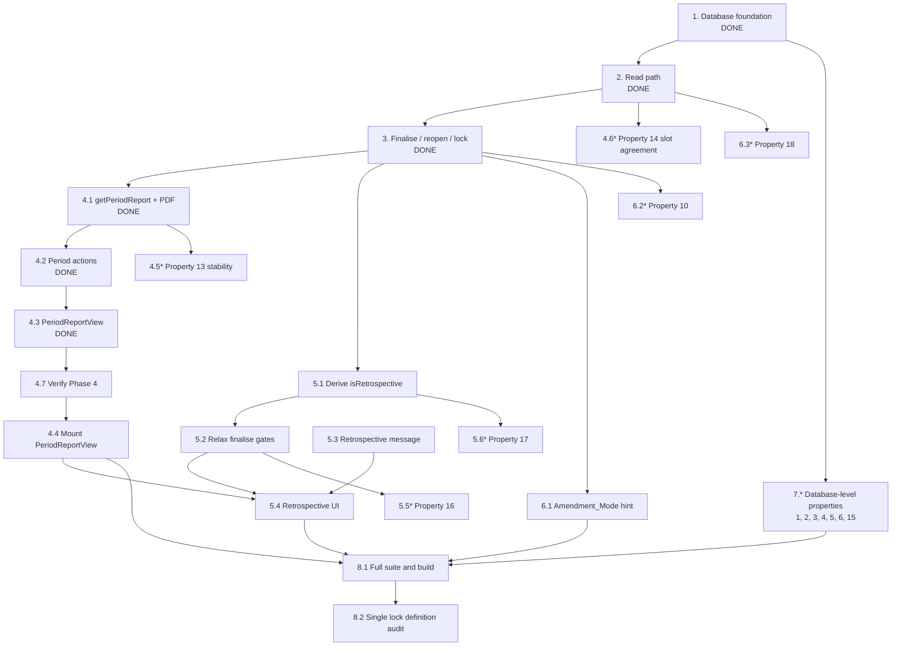

# Implementation Plan: Report Card Lifecycle

## Overview

This plan is written mid-flight. Phases 1 through 3 are built and verified, so their tasks are recorded as complete for traceability rather than as work to do. Phase 4's code exists but has never been typechecked, linted, tested or built, and its one UI component is not mounted anywhere — so it is the first thing that actually needs doing. Phase 5 is new work arising from Requirement 18 and the two gaps the requirements recorded.

The ordering follows the design's layering, bottom-up: the editability view is the single definition of the lock rule, so every consumer above it reads those flags rather than re-deriving them. That is already true of Phases 2 and 3 and must stay true of the new work — the retrospective relaxation in Requirement 18 changes the *finalise preconditions only*, never editability, so it must not touch the view or the write gate.

Stack is fixed by the existing code: TypeScript 5 on Next.js 16 App Router, Server Components with client leaves, Vitest + fast-check for property tests, `plpgsql` for the one migration that has already run. Everything remaining is TypeScript — Requirement 18 derives from columns that already exist, so **no further SQL is needed**.

## Tasks

- [x] 1. Database foundation, attribution and backfill

  - [x] 1.1 Create `scripts/create-report-card-lifecycle.sql`
    - `public.report_cards`: `subject_type` CHECK over SUBSCRIPTION / STAY, nullable `subscription_id` and `stay_entry_id`, denormalised `customer_category`, `window_start` / `window_end` snapshot, `status` CHECK over ACTIVE / CLOSED, `report_closing_comment` bounded 1–4000, `finalised_at` / `finalised_by`, `reopen_count` / `last_reopened_at` / `last_reopened_by`, `updated_at` trigger
    - `chk_report_card_single_subject` — exactly one Subject FK set, agreeing with `subject_type`
    - `chk_report_card_closed_shape` — CLOSED implies comment and `finalised_at` both present; ACTIVE implies no `finalised_at`
    - `uniq_report_card_per_subscription` and `uniq_report_card_per_stay` as partial unique indexes so the unused FK's NULLs never collide; deliberately **no** unique index on active-per-customer
    - `idx_report_cards_customer` and the partial `idx_report_cards_customer_closed` supporting the latest-closed scan
    - Idempotent throughout: `IF NOT EXISTS`, DO-guarded `ADD CONSTRAINT`, `DROP TRIGGER IF EXISTS`, with an ORDERING section and a Rollback block
    - _Requirements: 1.1, 1.2, 1.3, 1.4, 1.5, 5.8, 16.2, 16.3, 17.1, 17.2, 17.3, 17.4_

  - [x] 1.2 Add `public.v_report_card_editability`
    - `is_editable` = ACTIVE OR this row is the customer's latest CLOSED row
    - `is_reopenable` = CLOSED AND this row is the customer's latest CLOSED row
    - Latest-closed resolved by `ORDER BY finalised_at DESC, id DESC LIMIT 1`, the `id DESC` tie-break making the result deterministic when two reports share a finalisation timestamp
    - `security_invoker = true` so the view respects the caller's RLS, not the definer's
    - _Requirements: 6.1, 6.8, 7.1, 7.2, 7.3_

  - [x] 1.3 Add `health_logs.report_card_id` and its index
    - Nullable, `ON DELETE SET NULL` so a log is never destroyed with its report
    - `idx_health_logs_report_card` on `(report_card_id, log_date)`
    - _Requirements: 3.3, 3.4_

  - [x] 1.4 Backfill Report_Cards and attribute existing Dietitian_Logs
    - Report card per MEAL / KIT subscription and per stay, all ACTIVE with no comment, window formulas transcribed from `cadenceRepository.getGoverningRecords`
    - KIT window start via `COALESCE(kit_received_date, starts_on)` so an ACTIVE KIT subscription pending receipt confirmation is not silently dropped
    - Skip any Subject with no resolvable window start rather than inventing dates
    - Attribution preference order: existed-when-written, then ACTIVE, then latest-starting, then latest-created
    - Re-runnable: INSERTs skip subjects that already have a card; the UPDATE only fills where attribution is absent
    - _Requirements: 1.6, 1.7, 4.1, 4.2, 4.4, 4.5_

  - [x] 1.5 Add RLS mirroring `health_logs`
    - SELECT / INSERT / UPDATE granted to `authenticated` and `service_role`, scoped by `is_global_role() OR dietitian_can_read_customer(...)`
    - No DELETE grant and no DELETE policy, so Postgres denies every DELETE from every non-superuser role
    - _Requirements: 15.4, 16.1_

  - [x] 1.6 Extend `src/types/dietitian.ts`
    - `ReportCard`, `ReportCardWithEditability`, `ReportCardProgress`, `ReportCardHistoryEntry`, `ReportCardHistory`
    - Shapes live here, not in a service module, so client components can import them without pulling in `createAdminClient`
    - _Requirements: 10.2_

  - [x] 1.7 Add the verification query and run it against production
    - Expected and confirmed: 236 report cards (199 subscription, 37 stay), 0 non-active, 4 logs attached, 0 unattached, 236 editable, 0 reopenable
    - _Requirements: 17.5_

- [x] 2. Read path — repositories, service, history surface

  - [x] 2.1 Create `src/repositories/dietitian/reportCardRepository.ts`
    - `listReportCardsForCustomer`, `getReportCardById`, `getReportCardForSubject`, `ensureReportCardForSubject`, `refreshReportCardWindow`, `attachHealthLogToReportCard`
    - Lock flags always read from `v_report_card_editability`, never derived from `status`
    - _Requirements: 2.3, 7.4, 10.1_

  - [x] 2.2 Extend `cadenceRepository`
    - `recordId` and `subjectType` added to `GoverningRecord`
    - `listLoggingWindowsForCustomer` returning every window, not only the current one
    - _Requirements: 10.1, 10.5_

  - [x] 2.3 Extend `healthLogRepository` with `getHealthLogTimelineForWindow`
    - Selects from `v_health_log_timeline` by date range, **not** by `report_card_id` — the three legacy tables in that union have no such column, so filtering on the FK would blank every report for an existing Accommodation or KIT customer
    - _Requirements: 13.1, 13.2, 13.3_

  - [x] 2.4 Create `src/services/ReportCardService.ts`
    - `getReportCardHistory` — reconciles on read, creating a Report_Card for any Logging_Window that lacks one, then lists with slot progress and a current-period marker
    - `getReportCardDetail` — slots plus the window's timeline; slot `editable` flags honour the same-day window, then the report's own lock overrides them
    - `resolveReportCardForWrite` — the Governing_Record's report, created if absent; no date matching
    - Slot dates and `buildLogSlots` fed the same `pausedDates` set, so slot numbering matches the live workspace's for the same period
    - _Requirements: 3.1, 3.2, 10.3, 10.4, 10.5, 12.4_

  - [x] 2.5 Create `src/actions/dietitian-actions/reportCardLifecycleActions.ts`
    - `getReportCardHistoryAction`, `getReportCardDetailAction`
    - Owning customer resolved from the report id before `checkDietitianScope`; unknown id and out-of-scope id return the identical `"Report not found."`
    - Not restricted to KIT / ACCOMMODATION — the lifecycle applies to all three categories
    - `TimelineRow` projected away before crossing to a client
    - _Requirements: 10.7, 15.1, 15.2, 15.3_

  - [x] 2.6 Create the history UI and mount it in both portals
    - `ReportCardHistoryPanel` — the period list with dates, status, lock state and slot progress
    - `ReportCardHistorySection` — selection state and on-demand detail fetch
    - Slot strip rendered through the existing `LogSlotSelector` in disabled mode rather than a second slot visual
    - Wired into `src/app/admin/(main)/log-customer/[id]/page.tsx` and `src/app/franchise/(main)/log-customer/[id]/page.tsx`
    - _Requirements: 10.1, 10.2, 10.6, 15.5_

- [x] 3. Finalise, reopen and the write lock

  - [x] 3.1 Add the pinned messages to `src/lib/dietitian/messages.ts`
    - `REPORT_IS_LOCKED`, `REOPEN_REPORT_TO_EDIT`, `REPORT_HAS_UNLOGGED_SLOTS`, `REPORT_HAS_NO_SLOTS`, `REPORT_CLOSING_COMMENT_REQUIRED`, `REPORT_ALREADY_CLOSED`, `REPORT_NOT_CLOSED`, `ONLY_LATEST_REPORT_CAN_REOPEN` and the rest, all registered in `DIETITIAN_MESSAGES` so tests assert on identity rather than prose
    - _Requirements: 5.5, 6.3, 8.1_

  - [x] 3.2 Add `finaliseReportCard` and `reopenReportCard` to `reportCardRepository`
    - Expected status guarded **inside** the UPDATE, so two concurrent callers cannot both win; the loser is told the report is already closed rather than overwriting the winner's comment
    - `reopenReportCard` additionally guards on the expected `reopen_count`, making the increment a compare-and-swap
    - Both return whether a row matched
    - _Requirements: 5.6, 5.7, 6.5, 6.7, 16.2_

  - [x] 3.3 Add `finaliseReport` and `reopenReport` to `ReportCardService`
    - Finalise gates in order: exists, ACTIVE, comment non-empty and ≤ 4000, window has slots and every slot logged, then the guarded UPDATE
    - Reopen gates: exists, CLOSED, `isReopenable` read from the view, then the guarded UPDATE
    - Every rejection returned rather than thrown, so the action layer renders it as a form error
    - _Requirements: 5.1, 5.2, 5.3, 5.4, 6.2, 6.3, 6.4, 6.6_

  - [x] 3.4 Add `findReportCardForDate` to `ReportCardService`
    - Resolves by date, not by the Governing_Record, because an edit may target a date inside an older closed period
    - Where several windows cover the date, a locked report wins — fail closed
    - Returns `null` when no window covers the date, which the caller treats as "no report to lock against"
    - _Requirements: 8.2, 8.3, 8.4_

  - [x] 3.5 Add the write gate and Amendment_Mode to `HealthLogService`
    - Report lock as gate 4b, after the existing scope and category gates, enforced server-side independently of UI state
    - Same-day edit window relaxed only when `status === "ACTIVE" && reopenCount > 0`; authorship **not** relaxed
    - Writes stamp `report_card_id`, so attribution happens at write time
    - _Requirements: 8.1, 8.6, 9.1, 9.2, 9.3, 16.4_

  - [x] 3.6 Add `report_card_id` to `healthLogRepository`
    - Row type, `HEALTH_LOG_COLUMNS`, insert payload and update payload
    - _Requirements: 3.1_

  - [x] 3.7 Add `finaliseReportAction` and `reopenReportAction`
    - Same scope-then-delegate shape as the read actions, with `revalidatePath("/log-customer")` on success
    - _Requirements: 15.1, 15.2, 15.3_

  - [x] 3.8 Add the finalise form and reopen button to `ReportCardHistorySection`
    - Finalise disabled until every slot is logged, with a hint naming how many remain
    - Reopen shown only on the report the view marks reopenable
    - Locked-report notice for a permanently locked period
    - Slots forced read-only when the report is not editable
    - _Requirements: 5.5, 6.3, 8.5_

  - [x]* 3.9 Write the lock property tests
    - `src/services/__tests__/report-card-lock.property.test.ts`
    - **Property 9: Amendment_Mode is reachable only after a reopen**
    - **Validates: Requirements 9.1, 9.3**

  - [x] 3.10 Stub `findReportCardForDate` in the three pre-existing property tests
    - Their Supabase fakes throw on any table but `health_logs`; any new cross-table read in the write path needs the same treatment
    - _Requirements: 8.1_

- [ ] 4. Final_Report and PDF export

  - [x] 4.1 Add `getPeriodReport` and `generatePeriodReportPdf` to `DietitianReportService`
    - `PeriodReportViewModel` extending `ReportCardViewModel` with `reportCardId`, `subjectType`, the window, `status`, the finalisation stamp, `reopenCount` and `hasHealthLogs`
    - Private `computePeriodAdherence` bounding all five figures to the Report_Card's window, deliberately **not** reusing `CadenceService`'s current-customer snapshot
    - Period logs read via `getHealthLogTimelineForWindow`
    - _Requirements: 11.3, 11.4, 12.1, 12.2, 12.3, 14.1_

  - [x] 4.2 Add `getPeriodReportAction` and `exportPeriodReportPdfAction`
    - Base64 PDF transport mirroring `reportCardActions.exportReportCardPdf`
    - Filename carries the period so a customer's several reports do not collide on disk
    - Available for an ACTIVE report too, reading as a preview
    - _Requirements: 11.7, 14.2, 14.4, 15.1, 15.2, 15.3_

  - [x] 4.3 Create `src/shared/components/dietitian/PeriodReportView.tsx`
    - Report_Closing_Comment leads, then the five adherence stat cards, then the dated Parameter_Table with Custom_Parameters and author, then per-day Closing_Comments in a collapsed `<details>`
    - Empty-period message instead of an empty report, and the PDF button disabled with a reason when the period has no logs
    - base64 → Blob decoding client-side, since a Buffer cannot cross the boundary
    - _Requirements: 11.2, 11.3, 11.4, 11.5, 11.8, 14.3_

  - [x] 4.4 Mount `PeriodReportView` in `ReportCardHistorySection`
    - Fetch the period report via `getPeriodReportAction` alongside the existing detail fetch when a report is selected
    - For a CLOSED report: `PeriodReportView` becomes the primary content, and the `LogSlotSelector` moves into a collapsed `<details>` labelled as the audit trail beneath it — inverting the current arrangement, where the slot strip leads
    - For an ACTIVE report: keep the slot strip primary and offer `PeriodReportView` as a preview
    - Keep the existing reopen button reachable on a CLOSED report after the inversion
    - _Requirements: 11.1, 11.6, 11.7_

  - [x]* 4.5 Write the period-report stability property test
    - `src/services/__tests__/period-report.property.test.ts`
    - **Property 13: A finished period's figures are stable**
    - **Validates: Requirements 12.5**

  - [x]* 4.6 Write the slot-agreement property test
    - **Property 14: Slot schedules agree with the Cadence_Engine**
    - **Validates: Requirements 12.4**

  - [x] 4.7 Verify Phase 4, which has never been verified
    - `npx tsc --noEmit`
    - `npx eslint` over `DietitianReportService.ts`, `reportCardLifecycleActions.ts`, `PeriodReportView.tsx`, `ReportCardHistorySection.tsx`
    - `npx vitest --run`, discounting only the known pre-existing failures
    - `npm run build`
    - _Requirements: 11.1, 12.1, 14.1_

- [x] 5. Retrospective_Report closing

  - [x] 5.1 Derive `isRetrospective` in `reportCardRepository`
    - `window_end` strictly earlier than the row's own `created_at` in IST; ensure `created_at` is selected and mapped
    - Add `isRetrospective` to `ReportCardWithEditability` in `src/types/dietitian.ts`
    - Derived from stored data only — no hard-coded migration date anywhere
    - Confine the change to classification: editability, reopenability and scoping are untouched
    - _Requirements: 18.1, 18.7, 18.9_

  - [x] 5.2 Relax the finalise preconditions for a Retrospective_Report in `ReportCardService`
    - Skip the all-slots-logged gate and the zero-slot gate when `isRetrospective`
    - Keep the non-empty comment requirement, the ACTIVE requirement and the guarded UPDATE unchanged
    - _Requirements: 18.2, 18.3, 18.4_

  - [x] 5.3 Add the retrospective messaging to `src/lib/dietitian/messages.ts`
    - A pinned message explaining that the period predates log collection, registered in `DIETITIAN_MESSAGES`
    - _Requirements: 18.5_

  - [x] 5.4 Surface the classification in the UI
    - `ReportCardHistoryPanel`: a marker on a retrospective row, so an incomplete slot count reads as historical rather than as outstanding work
    - `ReportCardHistorySection`: state in the finalise area that the period predates log collection, and enable the finalise button on comment alone for such a report
    - _Requirements: 18.5, 18.6_

  - [x]* 5.5 Write the retrospective property tests
    - `src/services/__tests__/retrospective-report.property.test.ts`
    - **Property 16: Retrospective relaxation is exact**
    - **Validates: Requirements 18.2, 18.3**

  - [x]* 5.6 Write the retrospective containment property test
    - **Property 17: Retrospective classification cannot capture a live period**
    - **Validates: Requirements 18.8**

- [ ] 6. Close the remaining gaps

  - [x] 6.1 Make Amendment_Mode visible in the log workspace
    - Where a Dietitian sees an older slot become editable, state that it is editable because the report was reopened — the server relaxation currently has no explanation attached to it at the point of use
    - _Requirements: 9.4_

  - [x]* 6.2 Write the authorship-invariance property test
    - **Property 10: Authorship is never relaxed**
    - **Validates: Requirements 9.2**

  - [x]* 6.3 Write the identifier-probing property test
    - **Property 18: Identifier probing is impossible**
    - **Validates: Requirements 15.3**

- [ ] 7. Database-level verification

  These assert the view's ordering and the constraints, which cannot be meaningfully tested against an in-memory fake.

  **Verified read-only against the live database.** No write-capable non-production Postgres is available in this environment, so 7.1–7.5 were checked by querying production read-only rather than by attempting rejecting writes. What that does and does not establish is stated per task. 7.6 and 7.7 require writes and remain open.

  - [x]* 7.1 Write the constraint rejection tests
    - Verified: both partial unique indexes (`uniq_report_card_per_subscription`, `uniq_report_card_per_stay`) exist, and no subject is referenced twice across 236 rows
    - **Not** verified: that a duplicate INSERT is actually refused. Needs a write-capable database
    - **Property 1: One Report_Card per Subject**
    - **Validates: Requirements 1.2**

  - [x]* 7.2 Write the subject-agreement constraint test
    - Verified: 0 rows disagree with their declared `subject_type`, and `chk_report_card_single_subject` is present among 7 CHECK constraints
    - **Property 2: Subject reference agrees with subject type**
    - **Validates: Requirements 1.3**

  - [x]* 7.3 Write the closed-shape constraint test
    - Verified: 0 rows violate the closed/active shape
    - Currently weak evidence — there are 0 CLOSED rows, so only the ACTIVE half is exercised by data
    - **Property 3: Closed shape**
    - **Validates: Requirements 5.8**

  - [x]* 7.4 Write the reopenable-uniqueness test
    - Verified: max reopenable-per-customer is 0 across all 236 rows
    - **Vacuous today** — with 0 CLOSED rows there is nothing to be reopenable. Re-run once a report has been finalised in production
    - **Property 4: At most one reopenable report per customer**
    - **Validates: Requirements 6.1, 6.8**

  - [x]* 7.5 Write the editability-derivation test
    - Verified: 0 mismatches between the view's `is_editable` / `is_reopenable` and an independently-computed expectation, over all 236 rows
    - The ACTIVE branch is genuinely exercised; the most-recently-closed branch is not, for the same reason as 7.4
    - **Property 5: Editability derivation**
    - **Validates: Requirements 7.2**

  - [ ]* 7.6 Write the lock-window-shift test
    - Asserts the *absence* of a write against the previously reopenable row, which is the payoff of expressing the rule as a view
    - **Blocked**: needs a write-capable non-production database. Cannot be established read-only
    - **Property 6: Closing shifts the lock window without a write**
    - **Validates: Requirements 6.6**

  - [ ]* 7.7 Write the migration idempotence test
    - **Blocked**: re-running the migration is a write. The script's own guards (`IF NOT EXISTS`, DO-guarded `ADD CONSTRAINT`, `CREATE OR REPLACE VIEW`, fill-only-where-NULL backfill) are the current basis for this claim
    - **Property 15: Migration idempotence**
    - **Validates: Requirements 4.3**

- [ ] 8. Final verification

  - [x] 8.1 Run the full suite and build
    - `npx tsc --noEmit`, `npx eslint` over every changed file, `npx vitest --run`, `npm run build`
    - Baseline measured during task 4.7: **53 test failures across 20 files**, none of them in a file that imports anything this feature changed. Full list of failing files recorded in the Notes below
    - _Requirements: 11.1, 18.2_

  - [x] 8.2 Confirm the lock rule has exactly one definition
    - Grep for any re-derivation of editability or reopenability from `status` outside `v_report_card_editability`; there must be none in services, actions or components
    - **Result: clean.** Every `status` comparison in the feature's code decides something other than writability — see the audit note below
    - Re-run if any further production code lands; the remaining open tasks are test-only, so the result stands as measured
    - _Requirements: 7.4_

## Task Dependency Graph



Waves 0 through 2 are already complete. Execution starts at wave 3.

```json
{
  "waves": [
    { "id": 0, "tasks": ["1.1", "1.2", "1.3", "1.4", "1.5", "1.6", "1.7"] },
    { "id": 1, "tasks": ["2.1", "2.2", "2.3", "2.4", "2.5", "2.6"] },
    { "id": 2, "tasks": ["3.1", "3.2", "3.3", "3.4", "3.5", "3.6", "3.7", "3.8", "3.9", "3.10", "4.1", "4.2", "4.3"] },
    { "id": 3, "tasks": ["4.7", "4.5", "4.6", "5.1", "5.3", "6.1", "6.2", "6.3", "7.1", "7.2", "7.3", "7.4", "7.5", "7.6", "7.7"] },
    { "id": 4, "tasks": ["4.4", "5.2"] },
    { "id": 5, "tasks": ["5.4", "5.5", "5.6"] },
    { "id": 6, "tasks": ["8.1"] },
    { "id": 7, "tasks": ["8.2"] }
  ]
}
```

Critical path: **4.7 → 4.4 → 5.4 → 8.1 → 8.2**. Task 4.7 gates 4.4 deliberately, so an unverified Phase 4 is not built upon and a pre-existing type error is not mistaken for a new one. Task 5.4 depends on 4.4 because both edit the same finalise area of `ReportCardHistorySection`, and doing them out of order means writing that block twice.

Everything in wave 3 apart from 4.7 is independent and parallelisable. None of the optional test tasks blocks another task.

## Notes

**No SQL remains.** Requirement 18 reads `window_end` and `created_at`, both of which already exist on `report_cards`. Nothing in tasks 4 through 8 needs a migration, so nothing here needs running in the Supabase SQL Editor.

**Task 4.4 inverts existing UI.** `ReportCardHistorySection` currently renders the slot strip as the primary content for a closed report with the comment beneath. Requirements 11.1 and 11.6 reverse that. The reopen button lives inside the block being demoted, so it needs deliberate relocation rather than being left where it falls.

**Task 4.7 is not optional.** Phase 4's code was written and never verified. It should be run before task 4.4 builds on top of it, so a pre-existing type error is not mistaken for a new one.

## Verification baseline, measured 4 Aug 2026 (task 4.7)

Phase 4 verified clean:

- `npx tsc --noEmit` — 54 errors, **all** in test files, **zero** in any source file and zero in the four Phase 4 files. Test files are not part of the build.
- `npx eslint` over the four Phase 4 files — clean.
- `npm run build` — compiled in 97s, all 56 static pages generated.
- `report-card-lock.property.test.ts` — 7/7 pass.
- The dietitian suite — 20 of 21 files pass.

**The pre-existing-failure list carried in from earlier work was stale.** It recorded roughly 10 failures. The true baseline is 53 failures across 20 files, caused by the large volume of unrelated uncommitted work in the tree (addon services, navbars, routing, shop linking, KIT tracker, address actions), not by anything in this feature.

Attribution was established rather than assumed: only two test files import anything Phase 4 touched — `src/test/dietitian/report-card-view.property.test.tsx` and `src/actions/master-actions/__tests__/activity-report-aggregation.property.test.ts` — and **both pass**.

Failing files at baseline: `kitTracker.property.test.ts` (3), `onboardingService.property.test.ts` (8), `addressActions.regression.test.ts` (7), `kitProductActions.test.ts` (7), `QuickOnboardingForm.accommodation.test.tsx` (6), `QuickOnboardingForm.test.tsx` (3), `read-only-workspace.property.test.tsx` (2), `shop-linking-preservation-checkout.property.test.ts` (3), `shop-linking-bug-checkout-ist-date.property.test.ts` (1), `routing-skip-scopes` (1), `routing-batch-count` (1), `routing-clinic-origin` (1), `one-pincode-one-clinic` (1), `edit-image-replacement.test.ts` (1), `kitchen-clinic-city.property.test.ts` (1), `crud-happy-paths.unit.test.ts` (1), `subscription-page.test.tsx` (2), `billing-client.test.tsx` (1), `ProfileCompletionDialog.test.tsx` (1).

**`read-only-workspace.property.test.tsx` is partly load-flaky.** Run alone it fails exactly 2 of 8; run in parallel with the full suite it fails 4 or 5. The file takes ~250s on its own, so the extra failures are timeouts. Treat 2 as the real number.

## Lock-rule audit (task 8.2)

Every `status === "ACTIVE" / "CLOSED"` comparison in the feature's code was inspected. None re-derives the lock rule; each decides something the view does not express:

| Location | What `status` decides | Verdict |
|---|---|---|
| `ReportCardHistorySection` | Which view leads — Final_Report or slot strip | Layout, not writability. Writability comes from `isEditable` / `canFinalise` |
| `ReportCardHistoryPanel.rowState` | CLOSED branch, then `isReopenable ? "CLOSED" : "LOCKED"` | The lock distinction itself comes from `isReopenable` |
| `ReportCardHistoryPanel.openCount` | A count for the header | Presentational |
| `PeriodReportView` | Title and badge wording | Presentational |
| `ReportCardService.finaliseReport` | Cannot close an already-closed report | State-transition validity, not the lock |
| `ReportCardService.reopenReport` | Cannot reopen a non-closed report | Same; the lock check beside it is `card.isReopenable` |
| `ReportCardService.findReportCardForDate` | Prefers the ACTIVE card among already-writable ones | Runs after the `!card.isEditable` fail-closed check |
| `HealthLogService` | `ACTIVE && reopenCount > 0` — Amendment_Mode | A different rule (Req 9.1), applied after the `isEditable` gate |
| `reportCardRepository.ensureReportCardForSubject` | Whether to refresh the window | Window freezing, not the lock |

## Session record — tasks 4.4, 4.7, 5.1–5.6, 6.1, 8.2

Verified after the work: `tsc --noEmit` 54 errors, all pre-existing and all in test files, **zero** in source. ESLint clean over all twelve changed files. `npm run build` compiled in 81s, 56/56 pages. `src/services/__tests__` + `src/test/dietitian`: 50 of 53 files pass; the 3 failures are `onboardingService` (8), `read-only-workspace` (4, of which 2 are real and the rest load-flake) and `self-log-isolation` (1) — all pre-existing.

Two things were found and fixed that the task descriptions had not anticipated:

**`PeriodReportView` hid the closing summary on an empty period.** The Report_Closing_Comment was rendered inside the `hasHealthLogs` branch, so a closed period with no logs showed "No health logs were recorded in this period" and suppressed the summary. That is precisely the shape of a Retrospective_Report, which would have made the entire Requirement 18 flow produce a report with no visible content. The summary now renders above that branch — it is the Dietitian's own words about the period, not a reading taken during it.

**Property 17's first two generators were wrong, not the code.** They produced UTC hours from 18:30 onward, which roll into the next IST day, so a report created at 19:00 UTC on a window's last day is genuinely retrospective. The generators were capped at hour 17 so UTC and IST dates coincide, and the boundary behaviour is asserted explicitly in a third case instead.

Amendment_Mode visibility (task 6.1) needed no new query: both log-customer pages already fetch the report history, so the flag derives from the entry marked `isCurrent`, using the identical `ACTIVE && reopenCount > 0` condition `HealthLogService` applies. That keeps the notice from ever claiming an edit window the server would refuse.

## Final verification (task 8.1)

- `npx tsc --noEmit` — 54 errors, **zero** in source and zero in this feature's files. Identical to the baseline count.
- `npx eslint` over every file added or changed — clean.
- `npm run build` — compiled in 73s, 56/56 static pages.
- `npx vitest --run` — **20 failed files / 45 failed tests**, against a baseline of 20 failed files / 53 failed tests. The failing file set is identical to baseline; the lower test count is load-flake in `read-only-workspace` (2 alone, 4–5 under load) and `self-log-isolation`. Total tests rose 1592 → 1614.
- This feature's five suites together: **29 tests, all passing.**

New property suites:

| File | Properties | Tests |
|---|---|---|
| `report-card-lock.property.test.ts` | 9, 10 | 10 |
| `retrospective-report.property.test.ts` | 16, 17 | 7 |
| `period-report.property.test.ts` | 13 | 4 |
| `report-card-slots.property.test.ts` | 14 | 4 |
| `report-card-scope.property.test.ts` | 18 | 4 |

## Live database verification (task 7, read-only)

Queried production read-only. Structure confirmed: 7 CHECK constraints, both partial unique subject indexes, **0 DELETE policies**. Data confirmed: 0 Property 2 violations, 0 Property 3 violations, 0 Property 5 mismatches across all 236 rows.

**Requirement 18's actual impact, measured:** of the 236 report cards, **143 are retrospective** and become closable on a Report_Closing_Comment alone. The remaining **93** cover live or future periods and keep the full all-slots precondition. That split is the concrete answer to the problem the requirement was written for — without it, all 236 would have been permanently unfinishable.

**Two properties are currently vacuous and must be re-run once a report has been finalised in production.** There are 0 CLOSED report cards, so Property 4 (at most one reopenable per customer) and the most-recently-closed branch of Property 5 have nothing to exercise. The ACTIVE branch is genuinely verified over 236 rows; the lock branch is verified only by the unit suites against fakes.

Properties 6 and 15 remain open because both need writes: Property 6 asserts the absence of an UPDATE, and Property 15 re-runs the migration. Neither can be established against a read-only connection, and neither should be attempted against production.
