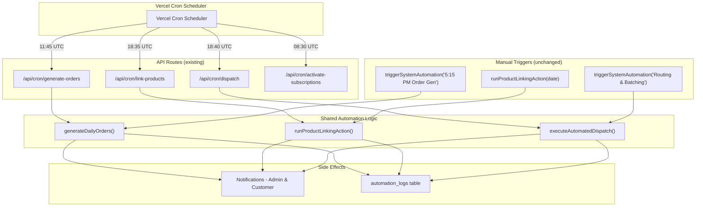
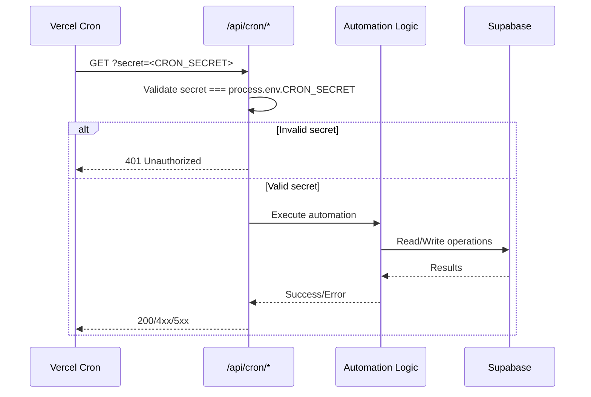

# Design Document: Vercel Cron Automations

## Overview

This feature registers three existing automation scripts (order creation, product linking, routing/batching) as Vercel Cron Jobs by updating `vercel.json` and ensuring the existing API route handlers are properly configured for scheduled invocation. The architecture reuses the existing `GET` route handlers at `/api/cron/generate-orders`, `/api/cron/link-products`, and `/api/cron/dispatch` — which already implement CRON_SECRET authentication, call the shared automation logic, send notifications, and log results. The only infrastructure change is declaring these routes in `vercel.json` so Vercel's cron scheduler invokes them automatically at the specified UTC times.

### Design Rationale

- **Zero duplication**: The cron routes already exist and contain the full automation logic, authentication, notification, and logging. No new route code is needed.
- **Shared logic**: Both manual triggers (server actions) and cron triggers call the same underlying functions (`generateDailyOrders`, `runProductLinkingAction`, `executeAutomatedDispatch`).
- **Configuration-only change**: The primary deliverable is updating `vercel.json` with three new cron entries.
- **Security**: All routes validate `CRON_SECRET` via query parameter before executing any logic — consistent with the existing `activate-subscriptions` pattern.

## Architecture



### Execution Timeline (IST)

| IST Time   | UTC Time  | Cron Expression | Automation                  |
|-----------|-----------|-----------------|------------------------------|
| 2:00 PM   | 08:30 UTC | `30 8 * * *`    | Activate Subscriptions (existing) |
| 5:15 PM   | 11:45 UTC | `45 11 * * *`   | Order Creation               |
| 12:05 AM  | 18:35 UTC | `35 18 * * *`   | Product Linking              |
| 12:10 AM  | 18:40 UTC | `40 18 * * *`   | Routing & Batching           |

### Authentication Flow



## Components and Interfaces

### 1. Vercel Configuration (`vercel.json`)

The single configuration change that enables scheduled execution:

```json
{
  "crons": [
    {
      "path": "/api/cron/activate-subscriptions?secret=<CRON_SECRET>",
      "schedule": "30 8 * * *"
    },
    {
      "path": "/api/cron/generate-orders?secret=<CRON_SECRET>",
      "schedule": "45 11 * * *"
    },
    {
      "path": "/api/cron/link-products?secret=<CRON_SECRET>",
      "schedule": "35 18 * * *"
    },
    {
      "path": "/api/cron/dispatch?secret=<CRON_SECRET>",
      "schedule": "40 18 * * *"
    }
  ]
}
```

### 2. Existing API Route Handlers (No Changes Required)

| Route | File | Shared Function | Auth | Logging |
|-------|------|-----------------|------|---------|
| `/api/cron/generate-orders` | `src/app/api/cron/generate-orders/route.ts` | `generateDailyOrders()` | ✅ CRON_SECRET | ✅ `automation_logs` (ORDER_GEN) |
| `/api/cron/link-products` | `src/app/api/cron/link-products/route.ts` | `runProductLinkingAction()` | ✅ CRON_SECRET | ✅ `automation_logs` (PRODUCT_LINK) |
| `/api/cron/dispatch` | `src/app/api/cron/dispatch/route.ts` | `executeAutomatedDispatch()` | ✅ CRON_SECRET | ✅ `automation_logs` (ROUTING) |

### 3. Security Fix: Remove Default Secret Fallback

The existing routes use `process.env.CRON_SECRET || "arogya-demo-123"` which falls back to a hardcoded value if the env var is missing. Per Requirement 4.4, all routes must reject requests when `CRON_SECRET` is not set rather than accepting a default value.

**Current pattern (all 3 routes + activate-subscriptions):**
```typescript
const expectedSecret = process.env.CRON_SECRET || "arogya-demo-123";
```

**Required pattern:**
```typescript
const expectedSecret = process.env.CRON_SECRET;
if (!expectedSecret || secret !== expectedSecret) {
  return NextResponse.json({ error: "Unauthorized" }, { status: 401 });
}
```

### 4. Notification Enhancement: Dispatch Route

The existing `/api/cron/dispatch/route.ts` does not send admin notifications after successful execution (Requirement 3.5). A `notifyAdmins` call needs to be added after successful dispatch completion.

### 5. Manual Trigger Server Actions (Unchanged)

| Server Action | File | Invokes |
|---------------|------|---------|
| `triggerSystemAutomation("5:15 PM Order Gen")` | `src/actions/admin-actions/systemActions.ts` | `generateDailyOrders()` |
| `runProductLinkingAction(date)` | `src/actions/admin-actions/systemActions.ts` | Direct implementation |
| `triggerSystemAutomation("Routing & Batching")` | `src/actions/admin-actions/systemActions.ts` | `executeAutomatedDispatch()` |

## Data Models

### automation_logs Table (Existing)

| Column | Type | Description |
|--------|------|-------------|
| `id` | uuid (PK) | Auto-generated |
| `automation_type` | text | `ORDER_GEN`, `PRODUCT_LINK`, `ROUTING` |
| `target_date` | date | The delivery date the automation ran for |
| `run_count` | integer | Increments on each execution (cron or manual) |
| `last_run_at` | timestamptz | Timestamp of most recent execution |
| `latest_stats` | jsonb | Automation-specific statistics |

**Unique constraint**: `(automation_type, target_date)` — ensures upsert behavior.

### latest_stats JSON Shapes

**ORDER_GEN:**
```json
{
  "totalPreferencesFound": 142,
  "ordersInserted": 138,
  "skippedExisting": 4
}
```

**PRODUCT_LINK:**
```json
{
  "addonsLinked": 23
}
```

**ROUTING:**
```json
{
  "totalBatches": 5,
  "ordersAssigned": 138,
  "ridersUsed": 5
}
```

### Environment Variables

| Variable | Purpose | Required |
|----------|---------|----------|
| `CRON_SECRET` | Authenticates cron requests | Yes (no fallback) |

## Correctness Properties

*A property is a characteristic or behavior that should hold true across all valid executions of a system — essentially, a formal statement about what the system should do. Properties serve as the bridge between human-readable specifications and machine-verifiable correctness guarantees.*

### Property 1: Authentication rejection for invalid secrets

*For any* cron route endpoint and *for any* string value that does not exactly match `process.env.CRON_SECRET` (including empty string, null, and absent parameter), the route SHALL return HTTP 401 Unauthorized and SHALL NOT execute any automation logic or produce database side-effects.

**Validates: Requirements 1.2, 4.1, 4.4**

### Property 2: Authentication acceptance for valid secret

*For any* cron route endpoint, when the `secret` query parameter exactly matches `process.env.CRON_SECRET` (case-sensitive), the route SHALL authenticate the request and proceed with automation execution (returning a non-401 status code).

**Validates: Requirements 4.2**

### Property 3: Automation log run-count consistency

*For any* automation type and target date, after N successful executions (regardless of whether triggered by cron or manual), the `run_count` in `automation_logs` for that `(automation_type, target_date)` key SHALL equal N, and `last_run_at` SHALL reflect the timestamp of the most recent execution.

**Validates: Requirements 7.1, 7.2**

## Error Handling

### Error Response Matrix

| Scenario | HTTP Status | Behavior |
|----------|-------------|----------|
| Invalid/missing CRON_SECRET | 401 | Reject immediately, no side effects |
| CRON_SECRET env var unset | 401 | Reject all requests |
| Database error during automation | 400 or 500 | Return error, no notifications sent |
| Notification failure after success | 200 | Orders/batches persist, notification error logged |
| Invalid target date parameter | 400 | Reject with descriptive error message |

### Error Isolation Principle

Notification delivery is wrapped in try/catch within each route handler. A notification failure NEVER rolls back successfully persisted automation data. This is already implemented in the existing route handlers.

### Partial Failure Handling

- **Order Creation**: If `generateDailyOrders` fails mid-execution, it returns `{ success: false }` and the route returns 500. No customer notifications are sent.
- **Product Linking**: Individual addon linking errors bubble up immediately, returning 400 with the error.
- **Routing/Batching**: The `executeAutomatedDispatch` function handles transactional integrity internally (resets pending routing state before assigning).

## Testing Strategy

### Unit Tests (Example-Based)

Focus on specific scenarios and edge cases:

1. **Authentication edge cases**: Missing query parameter, empty string secret, unset env var
2. **Vercel config validation**: Correct schedule expressions, paths, secret params, entry count
3. **Error handling**: Database failures return correct HTTP status codes
4. **Notification isolation**: Notification failures don't roll back data operations
5. **Date handling**: Correct IST-to-UTC date calculation for target dates

### Property-Based Tests

Each property test runs minimum 100 iterations with randomized inputs:

- **Property 1 test**: Generate random strings (including edge cases like unicode, empty, whitespace) as the `secret` parameter, verify all non-matching values produce 401
  - Tag: `Feature: vercel-cron-automations, Property 1: Authentication rejection for invalid secrets`
- **Property 2 test**: Use the exact CRON_SECRET value across all route endpoints, verify non-401 response
  - Tag: `Feature: vercel-cron-automations, Property 2: Authentication acceptance for valid secret`
- **Property 3 test**: Generate random sequences of automation executions (varying N from 1–20), verify run_count equals N after each sequence
  - Tag: `Feature: vercel-cron-automations, Property 3: Automation log run-count consistency`

**PBT Library**: `fast-check` (already compatible with the project's TypeScript/Jest ecosystem)

### Integration Tests

1. **End-to-end cron flow**: Seed database → call route with valid secret → verify automation results and logs
2. **Idempotency**: Run the same automation twice for the same date → verify run_count increments and no duplicate data
3. **Scheduling order**: Verify product-linking completes before routing starts (5-minute gap)

### Smoke Tests

1. **vercel.json structure**: Validate file contains exactly 4 cron entries with correct schemas
2. **Environment variable**: Verify CRON_SECRET is configured in Vercel project settings
3. **Route accessibility**: Verify each `/api/cron/*` route responds (even if with 401)
