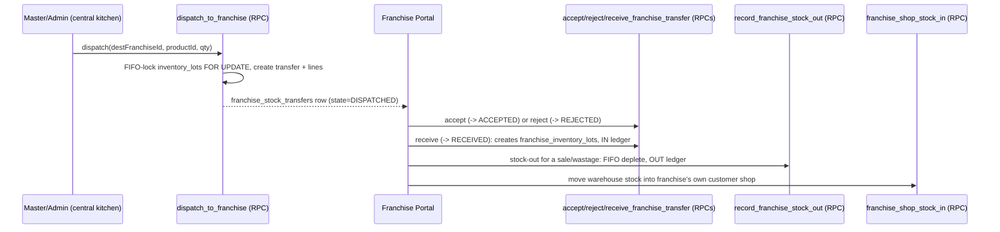
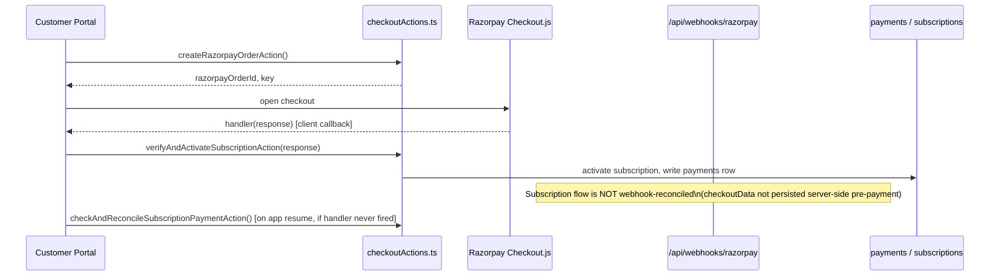

# ArogyaDiet — Dashboards & Features Documentation

> Generated from a direct read of the codebase (`e:\Local Clients\Next.js\arogyadiet`) plus read‑only queries against the live Supabase schema. No source code was modified to produce this document. Every claim below is grounded in a file that was read or a query that was run during this investigation; where something could not be verified, it is marked **Unverified**.

---

## 1. Project Overview

ArogyaDiet is a subscription meal‑delivery and wellness‑stay SaaS platform built on **Next.js 16 (App Router) + React 19 + TypeScript**, with **Supabase (Postgres + RLS + Storage + Auth)** as the backend. It runs five isolated portals behind **subdomain‑based routing** implemented in `src/middleware.ts`:

| Subdomain | Rewritten path | Role required | Portal |
|---|---|---|---|
| `customer.*` | `/customer` | (customer session, no admin role) | Customer |
| `deliverypartner.*` | `/rider` | rider session | Rider |
| `admin.*` | `/admin` | `ADMIN` | Admin (Core Business + Dietitians) |
| `master.*` | `/master` | `MASTER_ADMIN` | Master (BI / super‑admin) |
| `franchies.*` | `/franchise` | `FRANCHISE_ADMIN` | Franchise |

The business model is not one product — it is three, all running through the same subscription/customer/dietitian spine:

1. **Meal Subscription** — daily cooked‑meal delivery, pause credits, per‑day address changes, dietary preferences.
2. **KIT** — a self‑administered diet kit shipped by courier, tracked day‑by‑day by the customer (weight, steps, activity) with dietitian oversight.
3. **Accommodation / Stay** — an in‑clinic wellness stay product with nightly billing, extensions, add‑on services and a health‑report record.

A fourth axis, **Franchise**, lets a `FRANCHISE_ADMIN` operate a franchise‑scoped copy of most of the admin's tools (customers, subscriptions, riders, inventory, shop) against `franchise_id`‑partitioned data, gated end‑to‑end by the `FRANCHISE_FEATURES_ENABLED` flag (confirmed `true` in `.env.local` for this workspace — the franchise portal is **live**, not a stub).

Everything server‑side is Next.js **Server Components** and **Server Actions** (`src/actions/**`), talking to Postgres either through the RLS‑bound session client (`createClient()`) or the service‑role client (`createAdminClient()`, used heavily on admin/master pages with scope re‑enforced in application code). Business logic beyond simple CRUD lives in `src/services/**`, with a thin `src/repositories/**` layer for a few domains (clinic hierarchy, dietitian, franchise, stay/kit lifecycle). A confirmed **74 Postgres functions** exist in `public`, including several `SECURITY DEFINER` RPCs that own atomic multi‑table writes (pincode reassignment, franchise stock transfer, stock‑in, subscription/stay recalculation, onboarding).

---

## 2. Dashboard Overview

| Portal | Primary users | Core purpose | Auth | Scoping | Status |
|---|---|---|---|---|---|
| **Customer** | Subscribers (meal/KIT/stay) | Self‑service: subscribe, track, pay, log health, shop add‑ons | Mobile + PIN (live); OTP (built, unmounted); email/pw recovery only | own `customer_profile_id` via RLS | Live; several dead stub routes noted in §8 |
| **Rider** | Delivery riders | Duty toggle, live‑tracked route, delivery confirmation, payouts | Email + password | own `rider_profile_id` via RLS + ownership checks in actions | Live; native Android tracking layer is a hardened Capacitor fork |
| **Admin** | Core‑business operators, dietitians, clinic‑scoped frontdesk | Customer 360, subscriptions, operations/dispatch, riders, inventory, kitchen shop, finance | Email + password, role `ADMIN`, `admin_access_level` tiers | Clinic scope (`admin_clinic_id`) + franchise‑view selector, service‑role reads with app‑layer re‑scoping | Live; a few empty route directories are dead links (Finance, warehouse Inventory under `/admin`, Test Routing) |
| **Franchise** | Franchise owners/operators | Franchise‑scoped mirror of admin: customers, subscriptions, riders, inventory (warehouse→franchise), shop, disputes | Email + password, role `FRANCHISE_ADMIN` | Hard `franchise_id` filter at DB + ownership assertion in every mutating action | Live (flag on); `/orders` and `/reports` exist but aren't linked in the nav |
| **Master** | Executives / super‑admin | Cross‑network BI (growth, logistics, kitchen ops, inventory, finance), hierarchy provisioning, rate config, disputes resolution, system config | Email + password, role `MASTER_ADMIN` | Full network; explicit re‑checks role before loading franchise‑hierarchy data | Live |

---

## 3. Customer Portal

### 3.1 Route inventory

```
src/app/customer/
├── page.tsx                        STUB → <h1>customer</h1>
├── (auth)/login | signup(stub→/login) | success(orphan) | forgot-password | update-password
├── (main)/
│   ├── layout.tsx / template.tsx   session gate, sidebar, AppReadyBeacon
│   ├── dashboard/                  the 3‑product‑line switch (see 3.2)
│   ├── meals/                      meal history + today's meal (MEAL only)
│   ├── subscription/               plans, checkout, manage/{planner,address,billing}
│   ├── subscription-history/
│   ├── shop/ + shop/checkout + shop/orders     add‑on marketplace
│   ├── kit-tracker/ + kit-history/             KIT self‑logging
│   ├── stay-tracker/ + stay-history/           Accommodation
│   ├── health-report/ + addon-services/        Accommodation only
│   ├── profile/
│   └── tracking/  STUB (real screen is tracking/[orderId])
└── (public)/app/[slug]/            APK download landing page
```

Every `(main)` page is a Server Component starting with `getCustomerSession()` (redirects to `/login` on failure), and nearly all declare `revalidate = 0`.

### 3.2 Dashboard — the product‑line switch

**UI → Action → Service → DB.** `dashboard/page.tsx` (909 lines) is the single entry point that decides which of four dashboards a customer sees:

1. Reads `customer_profiles` (`onboarding_status`, dietary fields) → `shouldShowProfileCompletionDialog()` (`OnboardingService`) gates a `ProfileCompletionDialog` that is rendered on **every** return path while onboarding is `IN_PROGRESS`.
2. Resolves the active subscription and switches:
   - `customer_category === "KIT"` → re‑queries tracker columns (`kit_received_date`, `kit_tracker_end_date`, `kit_total_skipped_days`) + `getShippingInfoAction()` (`admin-actions/shippingActions.ts` → table `kit_shipping_info`) + `kit_daily_logs` → renders **`KitDashboard`**.
   - `customer_category === "ACCOMMODATION"` → `getActiveStayAction()` (`stayActions.ts` → `AccommodationService` → table `stay_entries`) → renders **`AccommodationDashboard`**.
   - No active subscription but an `EXPIRED` KIT with a `PENDING` replacement, or an `EXPIRED` KIT alone → still routed to `KitDashboard` (deliberate: an expired kit can have unlogged days that must remain reachable).
   - No subscription at all → empty state CTA → `/subscription`.
   - Otherwise → **MEAL dashboard** (six "zones": Journey header, Today's Focus, Momentum strip, Transformation video, Upcoming Deliveries, Manage‑plan cards).
3. **Pause‑credit self‑heal**: if paused‑day count in `subscription_daily_preferences` exceeds `pause_credits_total`, the page calls `repairOverLimitPauseCredits(subscriptionId)` (`manageMealActions.ts`) before rendering — a live defensive repair, implying the invariant does drift.

`ShippingTracker.tsx` (kit courier timeline) has a documented rule: if the customer's own `kit_received_date` is set but `delivered_at` isn't, the customer's confirmation **overrides** and completes the delivery step — because admins often never set `delivered_at`.

### 3.3 Meal subscription line

- **`/subscription`** → `SubscriptionPlansGrid` reading active `subscription_plans`, gated by `getOutstandingBalanceForCustomer()` (`SubscriptionPaymentService`) — an `OutstandingBalanceBanner` blocks new purchases until balance clears.
- **`/subscription/checkout`** → `CheckoutWizard` (5 steps) → `checkoutActions.ts`: `validateCouponAction`, `previewDeliveryChargeAction` (`DeliveryChargeService`), `createRazorpayOrderAction`, `verifyAndActivateSubscriptionAction`, `checkAndReconcileSubscriptionPaymentAction`. Hard‑redirects back to `/subscription` if an outstanding balance exists (defends against direct‑URL bypass).
- **`/subscription/manage/planner`** — day‑by‑day meal type + pause editor → `bulkUpdateMealPreferencesAction` / `bulkUpdatePausePreferencesAction` (`manageMealActions.ts`) writing `subscription_daily_preferences`.
- **`/subscription/manage/address`** — per‑day delivery address override → `bulkUpdateAddressPreferencesAction`, same table, `delivery_address_id` column.
- **`/subscription/manage/billing`** — unified `payments` list (subscription + addon invoices), `PARTIALLY_PAID` treated as a real viewable invoice.
- **`/subscription-history`** → `getMealSubscriptionHistoryAction()` + PDF via `/api/meal-health-report/[subscriptionId]`.

### 3.4 KIT line

- **`/kit-tracker`** is an explicit state machine: `start_flow → receipt_flow → processing → expiration → active`, driven by `getKitTrackerStateAction()` (`kitLifecycleActions.ts`). Active state renders `DailyTrackerClient` for logging weight/steps/activity per day (`kit_daily_logs`, validated by `kitTrackerSchema`).
- **`/kit-history`** → `getKitHistoryAction()` + PDF via `/api/kit-report/[subscriptionId]`.
- **Duplicate export name bug**: `getKitTrackerStateAction` is exported from both `kitTrackerActions.ts` and `kitLifecycleActions.ts` — the page imports the lifecycle one.

### 3.5 Accommodation / stay line

- **`/stay-tracker`** → `getActiveStayAction()` — Day X of Y progress, stay details, dates.
- **`/stay-history`** → `getStayHistoryAction()` + `getStayRecordedDayCountsAction()`.
- **`/health-report`** → `getCustomerHealthReportAction()` → day‑by‑day readings + PDF via `/api/stay-health-report/[stayId]`.
- **`/addon-services`** → `getAddonServiceRequestsAction()` / `requestAddonServiceAction()` / `cancelAddonServiceRequestAction()`; **only enabled when the stay status is exactly `ACTIVE`** (not `PENDING`), a stricter gate than the tracker page uses.
- All stay **payment/extension/checkout/invoice** actions (`stayPaymentActions.ts`, `stayInvoiceActions.ts`) exist but are **not called from any customer page** — they are host/admin‑side only (`AccommodationPaymentHostService`). Customer‑side stay data is read‑only.

### 3.6 Shop (add‑ons)

- **`/shop`** — catalog filtered per‑franchise (`franchise_product_settings`) or core; **`/shop/layout.tsx` redirects KIT/ACCOMMODATION customers away** (`?msg=shop-unavailable`) — shop is meal‑customers‑only.
- **`/shop/checkout`** is the **only client‑rendered page** in the whole customer portal. Zustand cart (`useCartStore`) → `createAddonCheckoutOrder()` → Razorpay Checkout.js → `verifyAddonPayment()`. Includes a documented **native UPI‑resume reconciliation**: on Capacitor `appStateChange`, `checkAndReconcileAddonPaymentAction()` re‑checks Razorpay directly in case the `handler` callback never fired after a UPI app‑switch.
- **`/shop/orders`** → delivery‑date change + PDF receipt via `/api/shop-receipt/[orderId]`.

### 3.7 Order tracking

`tracking/page.tsx` is a stub; the real screen is `tracking/[orderId]/page.tsx` + `tracking-client.tsx`: live rider location (Supabase Realtime + Google Maps in `LiveTrackingMap.tsx`), ETA, step timeline, and a mobile‑only Call CTA. `RiderProfileCard`'s message button is `disabled` with `title="Coming soon"` — in‑app messaging is not implemented.

### 3.8 Auth

Three parallel login mechanisms exist in code, but only **one is actually mounted**:
- **Mobile + PIN** (live, on `/login`) — `checkEligibilityAction` → `verifyPinAction` (`pinAuthActions.ts` / `PinService` / `PinThrottleService`, bcrypt cost 10).
- **OTP** — fully built (`MobileOtpLoginForm.tsx`, `mobileAuthActions.ts`, has tests) but **not referenced by `/login`**.
- **Email/password** — only the recovery half (`/forgot-password`, `/update-password`) is customer‑facing; `authActions.LoginAction` exists but customer self‑signup is disabled (`/signup` hard‑redirects to `/login`; accounts are admin‑created only).

### 3.9 Payments, invoices, notifications, support

- **Two independent Razorpay flows** (subscription, shop) with **two independent client‑side reconciliation guards**, but only the **shop** flow is backed by a server‑side webhook (`/api/webhooks/razorpay`) — the file header explicitly documents that subscription checkout data isn't persisted pre‑payment, so it cannot be reconciled from a webhook.
- Push notifications: `OneSignalProvider`, lazy‑loaded, keyed by `profile.id`.
- Support: `FloatingSupportMenu` is two `wa.me` WhatsApp deep links to a **hardcoded number** (`TEMP_SUPPORT_WHATSAPP = "918247533492"`, duplicated in `AccommodationDashboard.tsx`) — there is no in‑app ticketing/dispute system for customers.

---

## 4. Rider Portal

### 4.1 Route inventory

`/rider`, `/rider/subscription`, `/rider/tracking` are one‑line stubs. The real app lives under `(main)`: `/dashboard`, `/route`, `/route/[orderId]`, `/payout`, `/profile`, gated by `(auth)/login|forgot-password|update-password`.

### 4.2 Duty / shift lifecycle (the core mechanism)

`RiderStatusToggle` orchestrates a strict sequence: (1) `setRiderOnlineAction(checked)` writes `rider_profiles.is_online`; only on success does it (2) call `ensureTrackingPermissions()` then `BackgroundGeolocation.addWatcher({ riderId, distanceFilter:10, ... })`; on any failure to start tracking it reverts `is_online` back to `false`. The **native `LocationForegroundService`** (not the WebView JS) owns the actual location upload to Supabase via the RPC `upsert_rider_live_location` — the JS watcher callback is only used to detect fatal errors (GPS off / permission revoked), which surface as a persistent "Location is off" banner with Retry, while the rider **stays On Duty**. The watcher is deliberately never removed on component unmount (owned by the shift, not the UI). Two independent auto‑off‑duty mechanisms exist: a client 10‑minute inactivity timer (only when no active orders) and a server‑side heartbeat sweep (`RIDER_HEARTBEAT_STALE_MINUTES`, default 10) via `/api/cron/auto-off-duty` — the server sweep is authoritative and propagates via Realtime + a data‑only OneSignal push.

### 4.3 Route / delivery

`/route` shows a **kitchen‑pickup manifest** (meals + shop add‑ons aggregated by category) then a **strictly sequential** stop list (`route_sequence`) — only the current stop is clickable, all others are visually locked. `/route/[orderId]` is the delivery‑detail screen: `LiveLocationTracker` (read‑only poll of `rider_live_locations`, explicitly documented to **never** re‑add a JS watcher — a prior bug killed the native service this way), Call/Maps deep‑links (no embedded map, no OTP, no photo proof — delivery proof is a checklist + `delivered_at` timestamp), `markOrderDeliveredAction` / `requestFailedDeliveryAction` (→ `PENDING_FAILURE_APPROVAL`, admin approves/rejects, polled every 5s).

### 4.4 Payout

Formula lives in `src/lib/distance.ts`: Haversine distance × **1.3 road‑factor multiplier** × `payoutPerKm` (property‑tested). **Google Routes API is the primary router**; Haversine is the documented **fallback** only when Google Routes fails. Rate resolved via `RateConfigService.resolveRatesForClinic()` (franchise → core → default ₹16/km, 5‑second timeout). `payout_amount` is frozen per‑order at routing time (`delivery_orders.payout_amount`), never retro‑adjusted. Monthly settlement cron (`/api/cron/generate-rider-payments`) runs on a **27th‑of‑month cycle**, sums `DELIVERED` orders' `payout_amount` into `rider_monthly_summaries.total_earnings` — but the payout UI and leaderboard display `net_payable`, a column the cron **never writes**; it must be filled by a separate admin settlement action. **Security note:** this cron falls back to a hardcoded secret `"arogya-demo-123"` when `CRON_SECRET` is unset — the sibling `auto-off-duty` cron has no such fallback, which is the actual bug.

### 4.5 Route assignment (how orders reach a rider)

`executeAutomatedDispatch()` (`system-actions/routeEngine.ts`): resets re‑routable orders → builds a `fixed_rider_assignments` override map → per clinic/franchise scope, maps `rider_service_areas.pincode → rider_id` (duplicate pincodes silently collapse to one rider per pincode) → resolves coordinates (pincode‑centroid fallback tracked in an audit) → assigns rider = override or pincode match, else the order is silently skipped (`skippedNoRider`) → caps each rider at **`MAX_STOPS_PER_RIDER = 20`**, spillover requires manual assignment → routes via Google Routes (fallback Haversine) → writes `delivery_batches` + stamps `route_sequence`/`payout_amount` on `delivery_orders`.

### 4.6 Native Android layer

A hardened, project‑owned Capacitor fork at `native/plugins/background-geolocation/**`: `LocationForegroundService.java` (71 KB), `LocationQueue.java` (offline queue), `SyncWorker.java`, `BootReceiver.java` (re‑arms tracking after reboot), `SupabaseUploader.java` (dependency‑free `HttpURLConnection` POST straight to the `upsert_rider_live_location` RPC, bypassing the WebView entirely so tracking survives Doze/backgrounding). `RiderTrackingSetup.tsx` walks the rider through background‑location "Allow all the time", notifications, and battery‑optimization exemption, with OEM‑specific instructions and a fail‑open design (old APKs without the new native methods show no setup banner at all).

---

## 5. Admin Portal

### 5.1 Access model

`(main)/layout.tsx` requires role `ADMIN`, then resolves an `admin_access_level` (`operations` / `inventory` / `inventory_operations` / `dietitian`) via `resolveAccessConfiguration()`. Two independent scoping mechanisms recur on nearly every page: **clinic scope** (`admin_clinic_id`, applied at the SQL level — a "frontdesk" admin literally cannot query another clinic's rows) and a client‑side **franchise‑view selector** (`core` / `all` / a specific franchise). **Dietitian is a first‑class admin access level**, not a separate role — it gets its own nav (`Customers`, `Log Customer`, `Profile`) and its own scope‑enforcement helpers (`guardDietitianPage`, `dietitianCanRead`) applied in application code on top of service‑role reads, because service‑role bypasses the DB‑level dietitian RLS policy.

### 5.2 Dashboard

`getExecutiveSummary()` (`dashboardMetrics.ts`) → KPI tiles with trend, revenue‑trend series, customer‑distribution slices, "attention items", delivery counts — each wrapped in a `MetricResult` so one failing metric degrades gracefully instead of blanking the page. `ConflictClinicList` (pincode/clinic conflicts) renders only for `ADMIN`/`MASTER_ADMIN`.

### 5.3 Customers

- **Directory** (`/customers`): one wide `customer_profiles` query with embedded subscriptions/addresses; status priority **Active > Pending > Stopped/Cancelled > Expired > No Plan**; dietitian/clinic scope re‑enforced in JS (service‑role reads bypass RLS, so the app layer fails closed if a dietitian context can't resolve). Tabs: Overview, Meal, Onboarded, KIT, Accommodation, Partial Payment, Active/Pending/Expired Subscriptions.
- **Customer 360** (`/customers/[id]`, 2140‑line dashboard): tabs **Profile & Medical, Subscription, KIT, Shipping, Addresses, Accommodation, Billing, Coupons, History, User Management**. Drives subscription add/stop/date‑change/tenure‑recalc, KIT lifecycle + shipping, accommodation stay CRUD + payments/extensions/recalculation, coupons, PIN reset, clinic/dietitian assignment, and full audit history — each backed by its own admin‑actions file (`customerActions.ts`, `adminSubscriptionActions.ts`, `kitLifecycleActions.ts`, `shippingActions.ts`, `accommodationCustomerActions.ts`, `adminCouponActions.ts`, `adminPinActions.ts`).
- **Onboarding — four distinct entry points**: `quick-onboard` (3178‑line guided wizard, map‑based address capture, serviceability gate), `bulk-import` (XLSX/CSV templates in `public/extra/`), `assisted-order` (in‑person shop order for a customer/walk‑in, clinic‑scoped), and the `?action=create` modal on the directory itself.
- **Shop orders ledger** (`/customers/shop-orders`): all `addon_orders` with clinic/all/unassigned filters, walk‑in support, operator attribution.

### 5.4 Subscriptions

Plan CRUD, Active/Pending/Expired tabs, **Holiday Calendar**, **Global Discount**, and **Subscription Modeling**. Subscription 360 (`/subscriptions/[id]`) adds tabs **Pause Schedule, Meal Planner, Lifecycle & History, Delivery Routing** — note: `subscriptions/[id]/delivery-routing/` on disk is an **empty directory**; Delivery Routing is now a tab, not a route (dead leftover path).

### 5.5 Operations

The dispatch/ops board: **Today's Scheduled, Planned (Tomorrow), Live Routing, Daily Meal Roster, Live Tracking, Automation Logs, Shop Orders, Sandbox** — plus a **Failed Delivery Approvals** queue that appears only when non‑empty. Runs `reconcileDeliveryBatchStatusesAction()` (self‑healing) on every load. Manual routing, fixed rider‑assignment overrides, live GPS map (`AdminLiveTrackingMap`, 90‑second staleness threshold matching the rider side), and a routing sandbox for dry‑run testing. **The only genuine TODO found in the entire admin surface** is an untyped `data: any[]` in `OperationsClientTable.tsx`.

### 5.6 Riders & Finance

Rider directory + Today's Activity + Service Areas (pincode↔clinic↔rider mapping via the RPC `move_pincode_and_reassign`, atomically reassigning in‑flight orders). Finance dashboard (Overview, Subscription Revenue, Rider Payouts, Settings) — its route folder under `/admin/(main)/finance` is an **empty directory**; the components exist but are unmounted here (reachable from Master instead).

### 5.7 Inventory (two systems)

1. **Kitchen Shop (clinic‑scoped)**: `/kitchen-shop/inventory` — per‑clinic stock + visibility + immutable ledger, three intentionally distinct error states (clinic‑list, stock, ledger).
2. **Warehouse (`/admin/inventory/**`, a separate access area)**: master catalog, raw‑materials/finished‑goods, manufacturing (raw → finished conversion mappings), purchase orders, transaction ledger with CSV export, and franchise dispatch. `manufacturing/page.tsx` has an unimplemented intent (`standaloneOrders = pendingOrders` — the "filter batched orders" comment isn't actually applied).

### 5.8 Dietitian workspace (Log Customer)

`/log-customer` + `/log-customer/[id]`: health‑log entry with cadence‑derived slot availability, KIT self‑log tracker panel, and report‑card history with an **amendment mode** (editable only when the current report is `ACTIVE` and has been reopened) mirrored client‑side from the server‑side gate.

---

## 6. Franchise Portal

### 6.1 Tenancy & auth

Middleware sets an httpOnly `x-franchise-id` cookie and rewrites `franchies.*` → `/franchise`; a `FRANCHISE_ADMIN` with no `franchise_id`, or whose franchise is `suspended`, is redirected to `/unauthorized` at **both** middleware and layout (defense in depth). Every mutating action resolves the caller's franchise id from session context (`resolveFranchiseContext()` / `resolveScope()`) — **never from client input** — and asserts ownership of the target record (`assertOrderInFranchise`, `assertCustomerInFranchise`, `assertRiderInFranchise`, batch ownership verified via its orders' `franchise_id` rather than trusting `delivery_batches.franchise_id`).

### 6.2 Reuse pattern

Most franchise functionality is a **thin ownership‑checked wrapper around the admin implementation** — `franchiseOperationsActions.ts`, `franchiseCustomerManagementActions.ts`, and half of `franchiseSubscriptionActions.ts` literally call the same admin functions after an ownership assert. Genuine franchise‑specific rewrites are limited to: `franchiseAddSubscription` (own pricing/outstanding‑balance/PAID‑vs‑PARTIAL logic), `franchiseCreateCustomerAction`, and the rider‑onboarding trio.

### 6.3 Inventory model (the one truly distinct subsystem)

Warehouse (Central Kitchen) → Franchise, via `franchise_stock_transfers` state machine **DISPATCHED → ACCEPTED → RECEIVED** (or `REJECTED`), each transition an atomic `SECURITY DEFINER` RPC: `accept_franchise_transfer`, `reject_franchise_transfer`, `receive_franchise_transfer` (creates lots, increments on‑hand, writes an `IN` ledger row). Franchise‑side outbound is **stock‑out only** — `record_franchise_stock_out` (FIFO depletion across `franchise_inventory_lots`, atomic `IN`/`OUT` ledger write) — there is **no** product create/edit/delete in the franchise portal by design ("stock‑movement‑only permissions", stated in the code comments). `dispatch_to_franchise` (central→franchise) row‑locks `inventory_lots FOR UPDATE` to prevent concurrent over‑depletion. A second lever, `franchise_shop_stock_in`, moves warehouse stock straight into the franchise's own customer‑facing shop.

### 6.4 Other franchise modules

Pincode requests (`franchise_pincode_requests`, status `pending` → admin/master approval → `franchise_pincodes`), Disputes (raise only; `Open → Under_Investigation → Solved` resolved by Master), Global Discount + Holiday Calendar (shared components, franchise‑scoped data), Dietitian Activity + Report Cards (uses the same `CadenceService` as Master so numbers match), Log Customer workspace (identical to admin's).

### 6.5 What a franchise admin cannot do

Cannot create/edit/delete inventory products or the shop catalog; cannot dispatch stock *to* itself (central‑kitchen/master‑only); cannot grant itself pincodes (request‑only); cannot run or configure automations (read‑only `AutomationInfo` panel); cannot resolve disputes; cannot edit its own franchise entity (profile card is explicitly "Read‑only — contact Master Admin"); zero cross‑tenant visibility.

### 6.6 Status signals

`/orders` and `/reports` routes exist and function but are **not linked in `FranchiseNavbar`** (reachable only by direct URL). `_components/StockOutModal.tsx` has no importer — superseded by `FranchiseDispatchModal` + the staging‑cart pattern (dead UI). The whole subsystem correctly goes inert when `FRANCHISE_FEATURES_ENABLED` is unset/false (verified via `resolveFranchiseFeatureFlag`, which resolves to `false` for anything other than the literal string `"true"`); in this workspace the flag is **on**.

---

## 7. Master Portal

### 7.1 Structure

`(main)/layout.tsx` requires role `MASTER_ADMIN`. Nav: **Overview, Growth & Subs, Logistics, Kitchen Ops, Inventory BI, Franchise Hierarchy, System**. All BI screens follow the same shape: a Server page with a Suspense skeleton wrapping a client "Shell" that fetches through `src/actions/master-actions/bi*Actions.ts` and renders Recharts (`BarChart`/`LineChart`/`ComposedChart`/`RadialBarChart`, confirmed present in `GrowthShell`, `LogisticsShell`, `KitchenOpsShell`, `InventoryIntelligenceShell`, `OverviewShell`, `ReportEngineShell`, `FinanceCommandCenter`'s two sub‑views, and the dashboard segment components).

### 7.2 Command Center (`/dashboard`)

`OverviewShell` (KPI ribbon + revenue chart) → **`NetworkReportSection`** (consolidated cross‑franchise report via `loadConsolidatedNetworkReport`) → **`DietitianActivitySection`** (dietitian picker + activity report + `LogAuditTrailViewer`). A header badge links to `/disputes` showing the live **Open** dispute count (queried directly from `franchise_disputes` on every page load).

There is a second, tab‑based dashboard shell (`DashboardShell.tsx`) with a date‑window selector (**Today / WoW / MoM / YoY**) and three segment tabs — **Customer Intelligence, Fleet & Logistics, Operations & Kitchen** — each lazily fetched on first activation via `dashboardActions.ts` (`getKPISummary`, `getCustomerSegmentData`, `getRiderSegmentData`, `getOperationsSegmentData`).

### 7.3 BI modules and what each computes

| Module | Action file | Computes from |
|---|---|---|
| Growth & Subscriptions | `biGrowthActions.ts` | `getDietaryPreferenceSplit`, `getPlanPopularity`, `getPauseCreditUtilization` — from `customer_profiles`, `subscriptions` |
| Logistics & Fleet | `biLogisticsActions.ts` | `getPincodeDensity`, `getWoWDeliveryTrend`, `getLogisticsKPIs`, `getRidersForLogistics`, `getRiderDailyPerformance` — from `delivery_orders`, `delivery_batches`, `rider_profiles`, `rider_service_areas` |
| Kitchen Operations | `biKitchenOpsActions.ts` | `getDailyMealCategoryDistribution`, `getCutoffMetrics` (5 PM cutoff compliance), `getAutomationHealthLog` — from `delivery_orders`, `subscription_daily_preferences`, `automation_logs` |
| Inventory Intelligence | `biInventoryActions.ts` | `getInventoryAnalyticsSnapshot`, `getInventoryMovementSeries`, `getShopProductsAnalytics`, `getShopRevenueMoMSeries` — from `inventory_lots`, `inventory_products`, `inventory_transactions`, `manufacturing_orders`, `products`, `addon_orders` |
| Overview KPIs | `biOverviewActions.ts` | `getOverviewKPIs`, `getRevenueGrowthTrend` — from `subscriptions`, `payments`, `delivery_orders`, `rider_profiles` |
| Report Engine | `biReportActions.ts` | `generateReport` — chronological WoW/MoM trend reports across `customer_profiles`, `subscriptions`, `payments`, `manufacturing_orders` |
| Customer report | `customerReportActions.ts` | `getMasterCustomerKPIs`, `getMasterCustomerList`, `getCustomerReportData` — LTV‑tracking registry |
| Subscription report | `subscriptionReportActions.ts` | `getMasterSubscriptionKPIs`, `getMasterSubscriptionList`, `getSubscriptionReportData` |
| Network report | `networkReportActions.ts` | `loadConsolidatedNetworkReport`, `listNetworkFranchises` — cross‑franchise roll‑up |

### 7.4 Hierarchy & provisioning

The organizational model is **Business (type "Franchise") → City → Group → Kitchen (1:1 with Group) → Franchise → Clinic**, assembled entirely server‑side in `/hierarchy/page.tsx` and rendered as a tree (`HierarchyTree`). Separately, the **Core** side has its own flatter hierarchy managed at `/core-clinics`: **City → Kitchen → Clinic** (no Franchise/Group layer — this is the Core Business path, distinct from the franchise hierarchy). Provisioning actions: `businessActions`, `cityActions` (both core and franchise‑city variants), `groupActions` (`createGroup`/`updateGroup`/`deleteGroup`, with `delete_group_with_kitchen` RPC), `clinicActions`, `clinicWiringActions` (`wireClinicToFranchise`, `assignPincodeToFranchiseClinic`, plus the shared `move_pincode_and_reassign` RPC — the same one‑pincode‑one‑clinic enforcement admin uses), `kitchenActions` (`reassignClinicKitchen`), `franchiseActions` (create/update/activate/suspend/reactivate/**moveFranchiseToGroup**), `franchiseAdminActions` + `franchiseUserActions` (admin user + dietitian provisioning), `agreementDocActions` (upload/replace/signed‑URL for franchise agreement PDFs). The Franchise Detail page (`/franchises/[id]`) composes `FranchiseAdminSection`, `FranchiseKitchenSection`, and `PincodeConflictSection` — pincode‑conflict detection is a first‑class, always‑visible panel on every franchise's detail page.

### 7.5 Rate configuration

`rate_configs` table: `scope_type` (`CORE_BUSINESS` | `FRANCHISE`), `delivery_rate_per_km`, `rider_payout_rate_per_km`. `RateConfigService.resolveRatesForClinic()` resolves each rate **independently** with fallback franchise → core → hardcoded default, validated (≥0, ≤`MAX_RATE_PER_KM`, at most 2 decimals) and change‑audited into `rate_config_audit_logs`. UI: `/rate-config` → `RateConfigCard`.

### 7.6 Finance, disputes, hierarchy of trust

- **Finance** (`/finance` → `FinanceCommandCenter` + `SubscriptionRevenueView` + `RiderPayoutsView`): revenue analytics, rider payout cycles including manual/custom settlements, multi‑channel payment tracking.
- **Disputes** (`/disputes` → `DisputesClient` + `DisputeListTable` + `ResolveDisputeDialog`): reads `getAllDisputes()` / `getFranchisesWithDisputes()` from the shared `disputeRepository`; `updateDisputeStatusAction` is the **only** place a dispute status changes — franchises can raise but never resolve.
- **Dietitian activity**: `listActiveDietitians`, `getDietitianActivityReport`, `listHealthLogAuditEntries`, `getMasterReportCard`, `exportMasterReportCardPdf` (`dietitianActivityActions.ts`) — the master‑level superset of the franchise dietitian‑activity report, using the same `CadenceService`.
- **System** (`/system`) is a link hub to User Management, Core Clinic Management, Finance, Activity Logs, Customer Data (legacy), Report Engine, Rate Configuration, plus an additive `CoreBusinessSection`.
- **User Management** (`/user-management`) → `getAdminUsers`/`createAdminUser`/`updateAdminUser`/`deleteAdminUser`/`toggleAdminActive` — admin account CRUD.
- **Activity Logs** (`/logs`) → `getAdminActivityLogs()` reading `admin_activity_logs` — full audit trail of create/update/delete across the platform.
- **Notification settings** → `getSharedAdminEmail`/`updateSharedAdminEmail`/`sendTestEmailToSharedAdmin` (Resend‑backed shared admin inbox, table `system_settings`).

### 7.7 Legacy note

`MasterNavbar.tsx` carries an explicit in‑code comment: the legacy flat `/franchises` list route files are **intentionally retained but no longer linked from navigation**, superseded by `/hierarchy`.

---

## 8. Cross‑Dashboard Features & End‑to‑End Business Flows

### 8.1 Shared identity & scoping primitives

- `src/lib/auth/adminAccessCore.ts` (pure) + `adminAccess.ts` (server) — the single access‑level/group/clinic‑scope engine used by **both** the admin and franchise layouts (`resolveAccessConfiguration`, `isPortalPathAllowed`, `landingRouteFor`, `isClinicScoped`).
- `src/lib/franchise/scope.ts` / `scope-resolver.ts` — the `Scope` abstraction (`core` / `franchise` / `full_network`) that both admin's franchise‑selector and the franchise portal's own actions resolve against.
- Every portal's mutating actions follow the same rule: **the tenant/owner id used for a write is resolved server‑side from session context, never trusted from client input** — verified explicitly in rider actions, franchise actions, and admin dietitian/clinic scoping.

### 8.2 End‑to‑end flow: Daily order → dispatch → delivery → payout

```mermaid
sequenceDiagram
    participant Cron as Vercel/Supabase Cron
    participant Pipeline as dailyPipeline.ts
    participant OrderGen as generateDailyOrders()
    participant Linker as linkDailyShopPurchases()
    participant Snapshot as finalizeWorkloadSnapshot()
    participant Router as executeAutomatedDispatch()
    participant DB as Postgres (delivery_orders, delivery_batches)
    participant RiderApp as Rider Portal
    participant CustApp as Customer Portal
    participant PayoutCron as generate-rider-payments cron

    Cron->>Pipeline: /api/cron/dispatch (secret)
    Pipeline->>OrderGen: 1. create today's delivery_orders (retry x3)
    Pipeline->>Linker: 2. link shop/addon purchases to orders (retry x3)
    Pipeline->>Snapshot: 3. finalize per-clinic workload snapshot
    Pipeline->>Router: 4. assign riders, build routes
    Router->>DB: write delivery_batches + stamp route_sequence/payout_amount
    RiderApp->>DB: pickup -> OUT_FOR_DELIVERY -> REACHING_TO_LOCATION -> DELIVERED
    RiderApp->>CustApp: delivery_status_logs -> live tracking + push
    Note over Pipeline: Halts on first failing step; prior step outputs preserved
    PayoutCron->>DB: monthly rollup of DELIVERED payout_amount -> rider_monthly_summaries
```

Halt‑on‑failure is explicit: if any of the four pipeline steps fails, the pipeline stops immediately and returns the outputs of every step that already succeeded (`PipelineResult.steps`, `failedStep`) — order‑creation and product‑linking retry up to 3 times before halting; snapshotting and routing do not retry.

### 8.3 End‑to‑end flow: Franchise stock movement



### 8.4 End‑to‑end flow: Customer subscription payment



Contrast with the **shop/addon** flow, which *is* webhook‑backed (`/api/webhooks/razorpay` verifies HMAC signature, idempotent on `razorpay_transactions.razorpay_payment_id`, only acts on `checkout_type === "ADDON"`, and runs stock‑decrement RPCs `decrement_franchise_product_stock` / `clinic_shop_apply_sale`).

### 8.5 Dietitian activity — one engine, three surfaces

`CadenceService` computes "days since last log" / "customers missing self‑log" identically for the **Admin** Log‑Customer workspace, the **Franchise** Dietitian Activity report, and the **Master** Dietitian Activity section — the codebase explicitly notes this shared engine is what keeps franchise numbers consistent with master‑level numbers. Report cards (`report_cards` table, `status` + `reopen_count` + `finalised_by`) follow the same lifecycle (`ACTIVE → finalised`, reopenable) and PDF export path in all three portals.

### 8.6 Rider assignment — pincode is the unit of territory

Both **Core** and **Franchise** routing scopes resolve riders purely via `rider_service_areas.pincode → rider_id`, with `fixed_rider_assignments` (a permanent customer→rider override) taking priority. This is the same mechanism referenced in the product overview's "pincode‑based service areas, not zones" business rule.

---

## 9. Recent / Additional Features

Based on git history (most recent commits) and `.kiro/specs/**` directory names — treat commit‑message‑derived items as **recent work in progress**, not confirmed‑complete features, since messages are terse and some specs have unchecked tasks.

| Area | Evidence | Confidence |
|---|---|---|
| Onboarding discount + partial‑payment acceptance view | commits "discunt while onboard and the partial payment view", "meal subscrption partial payment acceptance"; SQL scripts `add-discount-to-subscriptions-and-payments.sql`, `add-discount-to-onboard-rpc.sql`, `add-discount-clearing-to-recalculation.sql` | High — SQL + code both confirm discount columns on `subscriptions`/`payments` (`discount_amount`) |
| Subscription tenure recalculation | commit "subscription recaculate - not tested"; `RecalculateTenureDialog.tsx`, `recalculate_subscription_tenure` RPC | **Medium — the commit message itself says "not tested"** |
| Accommodation/stay improvements + report‑card history | commits "accomodation improved", "accomodation changes, report cards history", "accomodation view update", "accomodation solved"; spec `accommodation-payment-lifecycle` (open in editor) | High for the core flow; the `.kiro/specs/report-card-lifecycle/tasks.md` file has **unchecked** items (`4. Final_Report and PDF export`, `6. Close the remaining gaps`, `7. Database-level verification`) — **partially incomplete** |
| App-distribution / APK QR flow | commits "QR", "support number changed"; spec `app-apk-distribution` with unchecked tasks `4` (Supabase Storage bucket setup — "operator task"), `5` (Cloudflare Turnstile registration — "operator task"), `9`/`10`/`14` | **Medium‑Low** — the code path (`/api/app-download/grant`, `DownloadControl.tsx`) exists, but the tasks file marks the storage bucket and Turnstile registration as manual **operator** steps not yet checked off, and end‑to‑end verification (task 14) is unchecked |
| Android background GPS tracking hardening | spec `android-background-gps-tracking`; native Java files read directly (§4.6) | High — this is verified working code, not just a plan |
| Franchise customer dashboard, dispute management, inventory | specs `franchise-customer-dashboard*`, `franchise-dispute-management`, `franchise-inventory`; `franchise-dispute-management/tasks.md` has unchecked task `8` (property‑based tests for UI logic) | High for the feature; test coverage for one UI property is incomplete |
| Clinic‑scoped shop inventory | spec `clinic-scoped-shop-inventory`; `verify_clinic_stock_ledger_parity` RPC confirmed in DB | High |
| Dietitian management module | spec `dietitian-management`; `CadenceService`, `report_cards` schema confirmed | High |
| Mandatory profile completion | spec `mandatory-profile-completi...` (truncated name); `ProfileCompletionDialog` confirmed wired into the customer dashboard | High |
| KIT subscription + lifecycle management | specs `kit-subscription`, `kit-subscription-management`, `kit-lifecycle-management`; spec `kit-subscription/tasks.md` has unchecked task `11` (property‑based tests for core correctness — including "KIT‑Only Access Control") | High for the feature; some correctness property tests unchecked |
| Vercel cron automations | spec `vercel-cron-automations`; **however `vercel.json` currently contains `"crons": []`** — Vercel's own cron scheduler is empty; the cron routes under `/api/cron/**` must be invoked by an **external** scheduler (e.g. Supabase pg_cron or a third‑party pinger), not Vercel's native cron | Confirmed discrepancy — flag this to the team |
| Customer mobile onboarding / PIN auth | specs `customer-mobile-onboarding`, `customer-pin-auth`; `PinService`/`PinThrottleService` confirmed live and mounted on `/login` | High |
| Delivery charges management | spec `delivery-charges-management`; `DeliveryChargeService`, `previewDeliveryChargeAction` confirmed | High |
| New-plan past‑date start / onboarding past‑date flexibility | specs `new-plan-past-date-start`, `onboarding-past-date-flexi...`; `new-plan-past-date-start/tasks.md` has an unchecked task `6` (property‑based and unit tests) | Medium — feature present, one test task unchecked |

**Overall pattern**: the `.kiro/specs/**` folder (29 spec directories) is the project's own spec‑driven‑development trail. Nearly every spec's `tasks.md` follows a template where implementation tasks are checked (`[x]`) but a final "Checkpoint" / "Property‑based tests" / "End‑to‑end verification" task near the end is frequently left unchecked (`[ ]`). This is a **project‑wide pattern**, not isolated to one feature — read literally, it means most recently‑built features are functionally complete but their own team‑authored test/verification checklists have not been marked done in‑repo. This does not necessarily mean the tests don't exist (some referenced test files were confirmed present, e.g. `__tests__/kitProductActions.test.ts`), only that the spec's checklist item itself is unticked.

---

## 10. Scope Review: Core vs. Additional/New — Explicit Uncertainty Markers

**Core functionality (present from the original product design, per `AGENTS.md`/steering docs and confirmed live in code):**
- Subscription lifecycle (meal), pause credits, per‑day address/meal preference changes — **Confirmed live.**
- Pincode‑based rider service areas, distance‑based payout (Haversine × 1.3) — **Confirmed live**, exact formula read from source.
- Multi‑portal architecture (customer/rider/admin) with subdomain routing — **Confirmed live.**
- Kitchen operations, inventory, purchase orders — **Confirmed live.**

**Additions layered on top of that core (per spec folders + schema, all confirmed present in code/DB, not merely planned):**
- **KIT product line** — fully separate customer journey, dashboard, dietitian tracker. **Confirmed live**, not a stub.
- **Accommodation/Stay product line** — nightly billing, extensions, add‑on services, health reports. **Confirmed live**; payment/extension actions exist server‑side but are intentionally not customer‑facing (by design, not incompleteness).
- **Franchise multi‑tenancy** — an entire parallel portal + inventory‑transfer subsystem + BI drill‑down. **Confirmed live** (flag on in this environment); this is architecturally the single largest addition on top of the "Core Business" model.
- **Dietitian as an access level** (not a separate app) spanning admin/franchise/master. **Confirmed live.**
- **PIN‑based mobile login** replacing/supplementing email+password for customers. **Confirmed live**; OTP variant built but unmounted (see below).
- **APK distribution flow with Turnstile + signed download URLs.** **Partially confirmed** — the code path exists and was read directly, but the spec's own task list marks the Supabase Storage bucket creation and Cloudflare Turnstile registration as pending **operator** actions, so production readiness of this specific feature is **uncertain** without confirming those two external setup steps were completed outside the repo.

**Items flagged as uncertain or incomplete — do not treat as fully verified:**
1. **OTP login** — code, UI, and tests all exist (`MobileOtpLoginForm.tsx`, `mobileAuthActions.ts`) but it is not wired into the live `/login` page. Uncertain whether this is intentionally shelved or an oversight.
2. **Vercel cron config is empty** (`vercel.json` → `"crons": []`) despite a dedicated `vercel-cron-automations` spec and multiple `/api/cron/**` routes that assume periodic invocation. Something outside this repo must be triggering them (e.g., Supabase pg_cron, an external uptime pinger) — **this could not be verified from the repository alone.**
3. **Rider payout `net_payable` vs `total_earnings` mismatch** — the settlement cron writes `total_earnings`; the payout UI and leaderboard read `net_payable`. Whichever admin action fills `net_payable` was not located during this investigation — **flagged as a genuine gap, not just a naming quirk.**
4. **Subscription tenure recalculation** — explicitly marked "not tested" in the commit history itself.
5. **Report‑card lifecycle** — final PDF export, some gap‑closing tasks, and DB‑level verification tasks are unchecked in the spec; the feature works in the parts that were read, but its own completeness checklist says otherwise for the tail end.
6. **Hardcoded support WhatsApp number** and a **hardcoded cron fallback secret** (`"arogya-demo-123"`) are both flagged as security/config smells in the source itself (variable names admit "TEMP"), not just stylistic observations — worth a deliberate decision rather than silent carry‑forward.
7. **Empty franchise‑detail warehouse linkage**: the franchise portal's `/inventory` never exposes `franchise_warehouses`/`franchise_warehouse_stock` — those tables exist and are used only from the Master portal's `stockTransferActions.ts`. Unclear if this is deliberate (franchise doesn't need warehouse visibility) or an unfinished surface — **not resolved by this investigation.**

---

## 11. Feature Matrix

Legend: ✅ Live and verified · 🟡 Live but with a caveat noted above · ⛔ Not reachable / stub · — Not applicable to this portal

| Feature | Customer | Rider | Admin | Franchise | Master |
|---|---|---|---|---|---|
| Meal subscription lifecycle | ✅ | — | ✅ | ✅ | 🟡 (report‑only) |
| KIT product line | ✅ | — | ✅ | 🟡 (via shared components) | 🟡 (BI only) |
| Accommodation/Stay | ✅ (read‑only stay data) | — | ✅ | 🟡 (via shared) | 🟡 (BI only) |
| Pause credits / per‑day address | ✅ | — | ✅ (bulk override) | ✅ (bulk override) | — |
| Shop / add‑ons | ✅ | — | ✅ (assisted order) | ✅ (assisted order + own catalog) | 🟡 (BI only) |
| Razorpay payments | ✅ (2 flows, 1 webhook‑backed) | — | 🟡 (manual entry) | 🟡 (manual, delivery fee forced 0) | — |
| PDF invoices/receipts/reports | ✅ (4 kinds) | — | ✅ | ✅ | 🟡 (Report Engine) |
| PIN login | ✅ | — | — | — | — |
| OTP login | ⛔ built, unmounted | — | — | — | — |
| Live GPS tracking | ✅ (view only) | ✅ (native background) | ✅ (map view) | 🟡 (via shared admin components) | — |
| Route assignment / dispatch | — | ✅ (consumes) | ✅ (manual override + sandbox) | ✅ (own franchise scope) | — |
| Rider payout calculation | — | ✅ (views) | ✅ (settles) | 🟡 (own riders, via shared) | ✅ (BI + settlement view) |
| Inventory — warehouse | — | — | ✅ | ⛔ (no visibility) | ✅ (BI) |
| Inventory — franchise stock transfer | — | — | ✅ (dispatch side) | ✅ (accept/receive/stock‑out) | ✅ (initiate transfer) |
| Inventory — clinic shop | — | — | ✅ | ✅ (own franchise) | ✅ (BI) |
| Dietitian workspace | — | — | ✅ | ✅ | ✅ (activity report) |
| Report cards | — | — | ✅ | ✅ | ✅ |
| Disputes | — | — | — | ✅ (raise only) | ✅ (resolve) |
| Hierarchy provisioning (Business/City/Group/Franchise/Clinic) | — | — | — | — | ✅ |
| Rate configuration | — | — | — | — | ✅ |
| System/User management/Audit logs | — | — | 🟡 (own profile) | 🟡 (own profile) | ✅ |
| BI dashboards (growth/logistics/kitchen/inventory/finance) | — | — | 🟡 (executive summary only) | — | ✅ |
| APK distribution | ✅ (download landing page) | ✅ (login QR) | — | — | — |
| Native Android background tracking | — | ✅ | — | — | — |

---

## 12. Final Summary

ArogyaDiet is a mature, spec‑driven multi‑portal platform: one Supabase schema (74 confirmed Postgres functions, dozens of tables) serves five distinct front ends, each with its own auth role and scoping rules but sharing the same service/action layer wherever the business logic is identical (customer 360, subscription lifecycle, operations dispatch, dietitian activity). The three product lines — meal subscription, KIT, and accommodation — are genuinely first‑class, each with its own dashboard, tracker, and history, not bolted‑on variants. The franchise layer is a real second tenant model with its own atomic RPC‑backed inventory‑transfer subsystem, not a cosmetic filter.

The codebase is unusually self‑documenting: extensive inline comments reference specific requirement numbers from `.kiro/specs/**`, and the specs themselves track completion at the task level — which is how this document was able to distinguish "built and verified" from "built but the team's own checklist still shows gaps" (§9–10). The handful of concrete issues worth carrying forward from this review are the empty `vercel.json` cron config despite dependent `/api/cron/**` routes, the `net_payable`/`total_earnings` rider‑payout column mismatch, the hardcoded cron‑secret fallback, and the unmounted OTP login path — none of these block current operation, but each is a specific, verifiable point worth a deliberate decision rather than silent carry‑forward.
