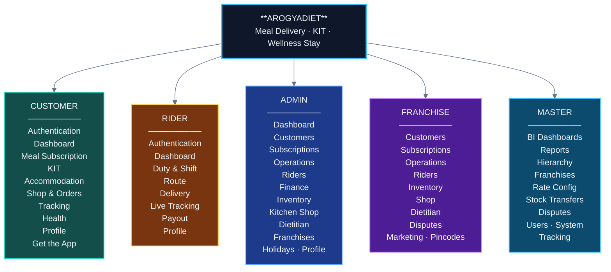

# 01 — ArogyaDiet Master Product Map

> High-level map only — module names per portal. Features and sub-features live in the per-portal maps (`02`–`06`).

## Diagram 1 — Master Product Map

## How to read the product

- **Three product lines, one spine.** Every customer runs through one account/subscription spine with a category: **MEAL** (daily food delivery), **KIT** (shipped self-administered diet kit), **ACCOMMODATION** (in-clinic wellness stay).
- **Two operations portals.** Admin runs the core business; Franchise runs the same capabilities for its own customers/riders/inventory — reusing the same engines, scoped to its franchise.
- **One management portal.** Master is BI-first: network dashboards, hierarchy provisioning, rate configuration, dispute resolution.
- **One field portal.** Rider is a mobile app built around duty → route → delivery, with native background GPS.

## Feature-count snapshot

| Portal | Modules | Status profile |
|---|---|---|
| Customer | 10 | All modules ✅; OTP login ⛔ unmounted; self-signup ⛔ disabled by design |
| Rider | 7 | All core ✅; payout 🟡; 2 legacy routes ⛔ |
| Admin | 11 | All core ✅; tenure recalculation 🟡; duplicate inventory menu 🟡 |
| Franchise | 9 | All core ✅ (feature-flag gated); warehouse view intentionally absent |
| Master | 12 | All ✅; subscriptions view is report-only 🟡 |
