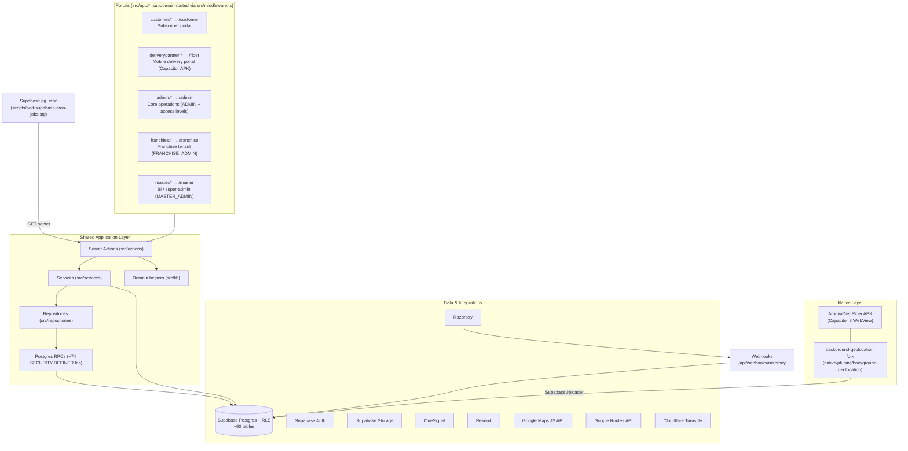
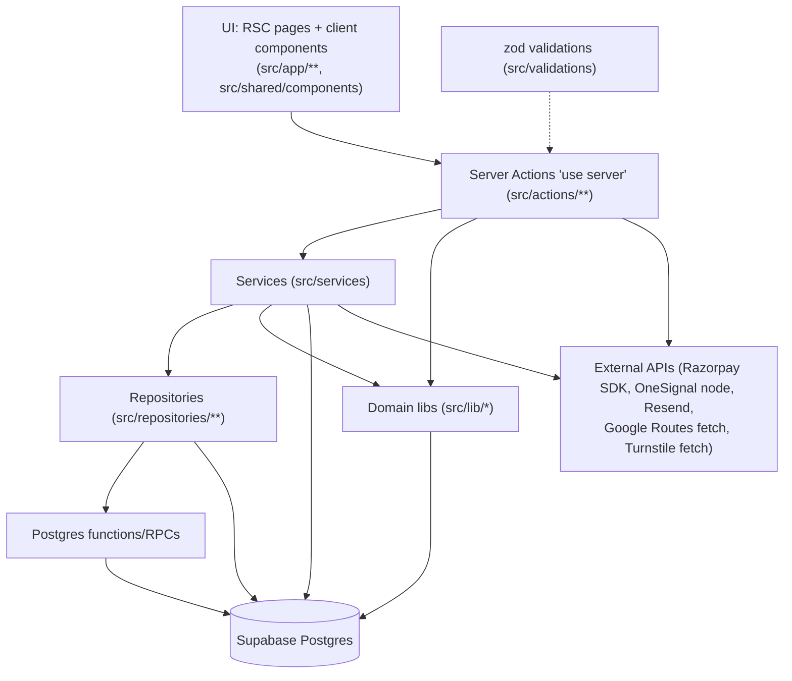

# ArogyaDiet — Platform Architecture (Technical)

> **Level 2 — Technical view.** Diagram B + supporting structure. All layers verified by direct file inspection.

## Diagram A — Platform Overview

## Diagram B — Application Architecture

## Layer inventory (verified)

### Data access clients — `src/lib/supabase/`

| File | Purpose |
|---|---|
| `client.ts` | Browser client |
| `server.ts` | RLS-bound session client (`createClient()`), cookie-based |
| `admin.ts` | `createAdminClient()` — service role, bypasses RLS; used on admin/master pages and in automation where the app re-enforces scope |
| `cached-auth.ts` | Cached auth lookups (perf) |
| `franchise-session.ts` | Sets Postgres session vars (`franchise_id`) so RLS can scope franchise reads |

### Server Actions — `src/actions/` (29 files + 7 subfolders)

- Root: `authActions`, `signupActions`, `mobileAuthActions`, `pinAuthActions`, `pinManagementActions`, `profileActions`, `profileCompletionActions`, `addressActions`, `checkoutActions`, `shop-actions`, `manageMealActions`, `mealSubscriptionHistoryActions`, `kitLifecycleActions`, `kitTrackerActions`, `stayActions`, `stayPaymentActions`, `stayInvoiceActions`, `accommodationOnboardingActions`, `addonServiceActions`, `customerHealthReportActions`, `pincodeActions`
- `admin-actions/` (31 files): onboarding, subscriptions, meals, coupons, delivery charges, operations, routing + sandbox, live tracking, service areas, fixed assignments, workload, kit product/lifecycle/bulk-import/shipping, clinic shop inventory, finance + payouts, partial payments, holidays, package images, conflicts, profile/pin, clinic selector, fallback automation, dietitian assignment
- `franchise-actions/` (15 files): customers, subscriptions, operations, riders, service areas, pincode requests, inventory, disputes, dietitian activity/assignment, assisted orders, shop orders, partial payments, marketing, user management
- `master-actions/` (29 files): hierarchy (business/city/group/kitchen/clinic/franchise), BI (`biOverview`, `biGrowth`, `biLogistics`, `biKitchenOps`, `biInventory`, `biReport`, `subscriptionReport`, `customerReport`, `networkReport`), disputes, rate config, stock transfers, agreement docs, user/notification settings, logs
- `rider-actions/` (3 files): `profileActions`, `routeActions`, `shiftActions`
- `inventory-actions/` (4 files): `dailyPipeline`, `orderGeneration`, `routeEngine`, `index`
- `dietitian-actions/` (4 files): customers, health logs, report cards + lifecycle
- `system-actions/` (1 file): `systemActions`

### Services — `src/services/` (37 files)

Key engines (verified names): `SubscriptionService`, `OnboardingService`, `BillingService`, `SubscriptionPaymentService`, `AccommodationService`, `AccommodationPaymentHostService`, `KitLifecycleService`, `KitReportService`, `HealthLogService`, `HealthReportService`, `ReportCardService`, `CadenceService` (shared dietitian cadence engine for Admin+Franchise+Master), `DietitianAccountService`, `DietitianLogWorkspaceService`, `DietitianReportService`, `AssignmentService`, `AssistedOrderService`, `DeliveryChargeService`, `RateConfigService`, `franchiseInventoryEngine`, `inventoryEngine`, `addonOrderCore`, `customerCouponCore`, `customerManagementCore`, `dashboardMetrics`, `EligibilityChecker`, `emailService`, `FallbackAutomationService`, `AuthService`, `OtpLoginService` (unmounted), `PinService`, `PinThrottleService`, `ShopReceiptService`, `signupService`, PDF templates (`DietitianReportTemplate.tsx`, `HealthReportTemplate.tsx`, `KitReportTemplate.tsx`, `ShopReceiptTemplate.tsx`).

### Repositories — `src/repositories/` (thin layer, verified)

`addonServiceRepository`, `appDownloadThrottleRepository`, `customerOnboardingRepository`, `disputeRepository`, `healthReportRepository`, `kitLifecycleRepository`, `otpThrottleRepository`, `stayExtensionHistoryRepository`, `stayPaymentRepository`, `stayRecalculationHistoryRepository`, `stayRepository`, `subscriptionPaymentRepository`, plus `clinic/`, `dietitian/`, `franchise/` subfolders (clinic hierarchy, dietitian, franchise domain helpers). Most domains skip repositories and query Supabase directly from services/actions.

### API routes — `src/app/api/` (verified listing)

| Route | Type |
|---|---|
| `cron/{dispatch, generate-orders, link-products, activate-subscriptions, generate-rider-payments, expire-kits, transition-stays, auto-off-duty, cleanup-dispatch-images, cleanup-old-po}` | Automation (GET + secret) |
| `webhooks/razorpay` | Payment webhook (HMAC-verified, ADDON-scoped) |
| `auth/{callback, recovery}` | Supabase auth callbacks |
| `app-download/grant` | APK download grant (Turnstile + throttle) |
| `kit-report/[subscriptionId]`, `meal-health-report/[subscriptionId]`, `stay-health-report/[stayId]`, `shop-receipt/[orderId]`, `admin/customer-report/[type]/[id]` | PDF document generation |
| `admin/inventory/purchase-orders/export` | Excel export (xlsx) |
| `migrate/*`, `temp-fix-schema`, `reset-franchise-password` | Ops/migration one-offs ⚠️ exposed as unauthenticated-by-design routes (`UNVERIFIED` whether IP-restricted) |
| `notifications` | Notification helpers |

### Shared/UI/support

- `src/shared/` — components, hooks, stores, utils shared across portals.
- `src/store/useCartStore.ts` — zustand cart.
- `src/emails/` — 5 React email templates (`WelcomeEmail`, `SubscriptionConfirmationEmail`, `RiderPaymentEmail`, `FranchiseWelcomeEmail`, `AccountDeletedEmail`) sent via `emailService` (Resend).
- `src/lib/appDistribution/` — APK QR flow (config, content, manifest, qr, rateLimit, slug, storage, turnstile).
- `src/lib/notifications/` — `orderNotifications`, `lookups`, `popupPreference`, `refresh`; `lib/onesignal/server.ts` wraps the OneSignal node SDK; `lib/notifications.ts` `notifyAdmins`/`sendNotificationToUser` write `notifications` rows + push + optional shared-admin email.
- `src/lib/routing/googleRoutes.ts` — Google Routes `computeRoutes` client (field-masked, waypoint optimization, polyline, leg details) with Haversine fallback (`src/lib/distance.ts`).
- `src/lib/capacitor/` — web-safe stubs for background-geolocation, keep-awake, native back button, splash screen, tracking permissions, OEM battery instructions.
- `src/config/` — empty (`.gitkeep` only).
- Tests: vitest, colocated `__tests__/` + `src/test/**` (property-based via fast-check, a11y via axe-core, db, stubs).

### Next.js / deployment

- `next.config.ts`, `middleware.ts` (edge), `vercel.json` (`"crons": []` — empty; scheduling via Supabase pg_cron, see `10-automation-and-cron.md`).
- `capacitor.config.json` — `com.arogyadiet.rider`, webDir `out`, BackgroundGeolocation + SplashScreen + PushNotifications plugin config; static export (`webDir: out`) implies the rider app is a static build — `UNVERIFIED` whether the full web app or only rider pages are exported.

