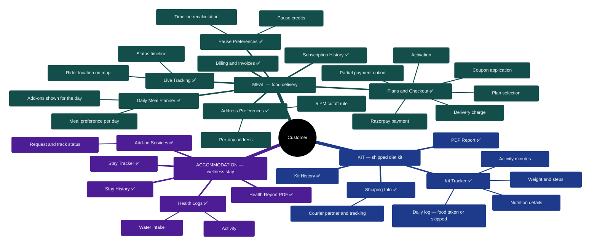
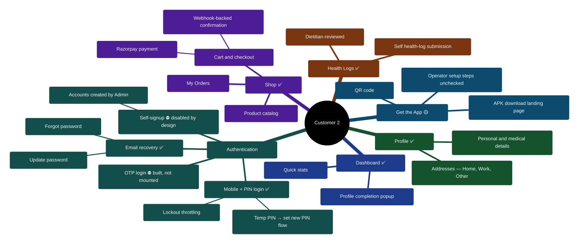

# 02 — Customer Portal Feature Map

> Portal: `customer.*` → `/customer`. The customer portal is organized around **three product lines** — every customer belongs to one (or more) of them — plus shared supporting modules.

## Diagram 2 — Customer Product Lines

## Diagram 2b — Supporting Customer Modules

## Notes for the client conversation

- **One login, deliberately simple:** customers log in with mobile + PIN. A complete OTP login exists in the code but is not connected to the live login page — deliberate product decision or oversight, still to be confirmed.
- **Category-aware navigation:** a MEAL subscriber doesn't see KIT/Stay screens; a KIT customer doesn't see meal-planning screens. Enforced at the routing level, not just hidden menus.
- **Two payment paths:** subscriptions confirm via the payment app's callback (with an in-app recovery if interrupted); shop purchases add a server-side confirmation backstop — robust against mobile payment app-switching.
- **The 5 PM rule:** changes to tomorrow's meals, address, or pauses lock at 5:00 PM IST; afterwards the earliest editable day shifts to the day after tomorrow.

