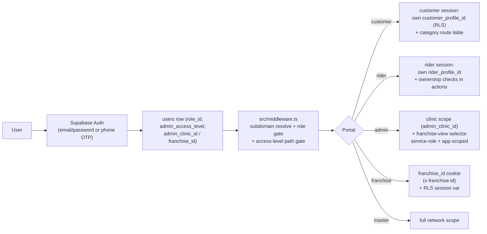

# ArogyaDiet — Portal & Feature Map

> Route trees below are read directly from `src/app/**` directory listings. Status: ✅ verified live · 🟡 caveat · ⚠️ built but unmounted/partial · ⛔ stub/not reachable · 🔍 `UNVERIFIED`.
>
> Route trees are source-of-truth listings; feature statuses derive from the route chains, `.kiro/specs/**` task state, and `AROGYADIET_DASHBOARDS_FEATURES.md` cross-checked against code.
>
> **Evidence quality:** route trees = `DIRECT CODE`; per-feature statuses = `DIRECT CODE` + `TEST` (where `__tests__`/specs exist) + `DOCUMENTATION` (features doc cross-check); legacy/dead-route flags = `INFERENCE` (explicitly labeled in-table).

## Diagram G — Authentication & Authorization (per portal)

---

## 1. Customer Portal — `src/app/customer/**` (`customer.*` → `/customer`)

### Auth

| Route | Mechanism | Status |
|---|---|---|
| `(auth)/login` | Mobile + PIN (`MobilePinLoginForm` → `checkEligibilityAction` → `verifyPinAction`; `pinAuthActions.ts` → `PinService` / `PinThrottleService`, bcrypt cost 10) | ✅ |
| `(auth)/login` — OTP | `MobileOtpLoginForm` + `mobileAuthActions` + `OtpLoginService` (Supabase phone OTP, `otp_login_throttle` table, pure policy in `src/lib/otp`) — fully built + tested, **not referenced by /login** | ⚠️ unmounted |
| `(auth)/signup` | Hard-redirects to `/login`; accounts admin-created only | ⛔ (disabled by design) |
| `(auth)/forgot-password`, `(auth)/update-password`, `(auth)/success` | Email/password recovery halves; `authActions.LoginAction` exists but no customer-facing email login | 🟡 recovery-only |
| `api/auth/callback`, `api/auth/recovery` | Supabase callback routes | ✅ |

### Main app `(main)/**`

| Route | Feature | Sub-features | Status |
|---|---|---|---|
| `dashboard` | Home | ProfileCompletionDialog when `onboarding_status = IN_PROGRESS` | ✅ |
| `subscription` | Plans + checkout | coupon application, delivery charge, Razorpay order + verify, partial payment (`partialPaymentBreakup`), activation | ✅ |
| `subscription/manage/planner` | Daily planner | meal preference per day; cross-references `delivery_orders` + `addon_orders` for the unified planner | ✅ |
| `subscription/manage/pause` | Pause engine | timeline recalculation, pause credits, `effective_end_on` shift | ✅ |
| `subscription/manage/address` | Per-day address | 5 PM IST cutoff → earliest editable day shifts to day-after-tomorrow | ✅ |
| `subscription/manage/billing` (+ `invoice/[id]`) | Billing | subscription invoices, partial-payment acceptance view | ✅ |
| `meals` | Meal view | upcoming deliveries, add-ons scheduled that day | ✅ |
| `kit-tracker`, `kit-history` | KIT line | daily logs (food, weight, steps, activity, nutrition fields), PDF report via `api/kit-report/[id]` | ✅ |
| `stay-tracker`, `stay-history`, `health-report`, `addon-services` | Accommodation line | health logs (customer), add-on service requests, stay health report PDF | ✅ |
| `health-logs` | Health logging | `customerHealthReportActions` | ✅ |
| `shop` (+ `checkout`, `orders`) | Shop/add-ons | Razorpay ADDON flow + webhook backstop | ✅ |
| `tracking/[orderId]` | Live delivery tracking | rider location, status timeline | ✅ |
| `subscription-history`, `profile` | History & profile | | ✅ |
| `(public)/app/[slug]` | APK download landing | QR + Turnstile-granted download (`api/app-download/grant`) | 🟡 spec tasks unchecked (storage bucket + Turnstile registration are operator steps) |

**Customer auth note:** only ONE login mechanism is mounted (PIN). OTP is complete but unmounted (see `00-executive-system-map.md` §5.3). Middleware enforces a customer-category route table: `KIT`-only routes (`kit-tracker`, `kit-history`), `ACCOMMODATION`-only routes (`stay-tracker`, `stay-history`, `health-report`, `addon-services`) — enforced for `MEAL` customers only (middleware `CATEGORY_ENFORCED_FOR`).

## 2. Rider Portal — `src/app/rider/**` (`deliverypartner.*` → `/rider`)

Runs inside the Capacitor APK (`com.arogyadiet.rider`); also usable in a mobile browser. Auth: email + password (rider session via RLS + ownership checks in `src/actions/rider-actions/*`).

| Route | Feature | Status |
|---|---|---|
| `(auth)/login` | Email + password | ✅ |
| `(auth)/forgot-password`, `(auth)/update-password` | Recovery | ✅ |
| `(main)/dashboard` | Duty toggle, today's orders, earnings snapshot | ✅ |
| `(main)/route` (+ `route/[orderId]`) | Ordered route (route_sequence), per-order delivery actions (pickup → OUT_FOR_DELIVERY → REACHING_TO_LOCATION → DELIVERED / FAILED), delivery proof image upload | ✅ |
| `(main)/payout` | Monthly summary + withdrawals (`rider_monthly_summaries`, `rider_payouts`) | 🟡 `net_payable` vs `total_earnings` mismatch |
| `(main)/profile` | Profile, emergency contact | ✅ |
| `subscription` | — | ⚠️ legacy/likely-dead route (not in sidebar flows; purpose unresolved) |
| `tracking` | — | ⚠️ legacy route (dashboard handles tracking) |

**Native layer:** duty toggle starts the native background GPS foreground service (custom Capacitor plugin fork — see `11-native-mobile-architecture.md`). Location writes go to `rider_live_locations` via `create-rider-live-location-upsert-rpc`.

---

## 3. Admin Portal — `src/app/admin/**` (`admin.*` → `/admin`)

Role `ADMIN`; `users.admin_access_level` ∈ {`inventory`, `operations`, `inventory_operations`, `dietitian`} gates path groups via `adminAccessCore` (`resolveAccessConfiguration` / `isPortalPathAllowed` / `landingRouteFor`), enforced in middleware AND re-applied in `(main)/layout.tsx` (defense in depth). `users.admin_clinic_id` provides clinic scope; franchise-view selector for franchise data; heavy `createAdminClient` use with app-level re-scoping.

| Route | Feature | Sub-features | Status |
|---|---|---|---|
| `(auth)/login` | Email + password (role gate) | | ✅ |
| `(main)/dashboard` | Subscription-360 home, executive summary | | ✅ |
| `(main)/customers` | Customer management | `onboarding` (full, RPC `onboard_customer`), `quick-onboard` (shared QuickOnboardingForm), `bulk-import`, `assisted-order` (AssistedOrderService → `place_assisted_addon_order` RPC), `shop-orders` (incl. walk-in), `[id]` customer 360 (billing, shipping, report-card) | ✅ |
| `(main)/customers/[id]/billing` | Invoices | `invoice/[paymentId]`, `stay-receipt/[transactionId]` | ✅ |
| `(main)/subscriptions` (+ `[id]`, `[id]/delivery-routing`, `kits`) | Subscription 360 | pause/address overrides, recalculation dialog, KIT provisioning, per-subscription delivery routing | ✅ (recalculation 🟡 "not tested" per commit message) |
| `(main)/operations` | Daily ops | today's orders, batches, dispatch control, workload snapshots | ✅ |
| `(main)/test-routing` | Routing sandbox | Google Routes trial runs without writes (routingSandboxActions) | 🟡 sandbox utility |
| `(main)/riders` | Rider management | service areas, live map, payouts settlement | ✅ |
| `(main)/finance` | Payments/finance | financePayoutActions, manual payment entry | ✅ |
| `(main)/inventory` | Warehouse inventory | ledger, manufacturing (batches/mappings), shop products | ✅ |
| `(main)/kitchen-shop` (+ `inventory`) | Kitchen shop catalog | clinic product settings/stock | ✅ |
| `(main)/log-customer/[id]` | Dietitian Log-Customer workspace | CadenceService-driven | ✅ |
| `(main)/franchises` | Franchise oversight | onboarding, suspension, agreement docs | ✅ |
| `(main)/profile` | Own profile | | ✅ |
| `inventory/**` (top-level, outside `(main)`) | Warehouse UI | `admin/inventory/{ledger,manufacturing,mappings,shop-products}` | ✅ (two inventory roots exist — `(main)/inventory` and top-level `admin/inventory`; relationship `UNVERIFIED`, likely legacy + regrouped) |
| `admin/inventory/purchase-orders/export` | PO Excel export | | ✅ |

## 4. Franchise Portal — `src/app/franchise/**` (`franchies.*` → `/franchise`)

Role `FRANCHISE_ADMIN`. Gated end-to-end by `FRANCHISE_FEATURES_ENABLED` (exactly `"true"`; middleware + all runtime paths use `isFranchiseRuntimeEnabled()`; when off, the portal is inert). Middleware resolves `users.franchise_id`, blocks suspended franchises (`franchises.status`), injects `x-franchise-id` cookie, and applies the admin's per-Operations-Group RBAC (`admin_operations_access` manage/view via `adminAccessCore`; owner treated as `inventory_operations`) — see `08-security-and-scoping.md` for the full RBAC note.

| Route | Feature | Notes | Status |
|---|---|---|---|
| `(auth)/login` | Email + password | `api/reset-franchise-password` ops route supports resets | ✅ |
| `(main)/customers` (+ management) | Own customers | franchiseCustomerManagementActions | ✅ |
| `(main)/subscriptions` (+ `[id]`) | Own subscriptions | franchiseSubscriptionActions | ✅ |
| `(main)/operations` | Own dispatch/ops | franchiseOperationsActions | ✅ |
| `(main)/riders` | Own riders | franchiseRiderActions | ✅ |
| `(main)/inventory` (+ `ledger`, `__tests__`) | Franchise inventory | accept/reject/receive transfers, stock-out, warehouse — via `franchiseInventoryEngine` + SECURITY DEFINER RPCs | ✅ |
| `(main)/shop-products` (+ `assisted-order`) | Own catalog + assisted orders | franchiseProductActions, franchiseShopOrderActions | ✅ |
| `(main)/log-customer/[id]` | Dietitian workspace | shares Admin components | ✅ |
| `(main)/disputes` | Raise disputes | `franchise_disputes` (Open → Under_Investigation → Solved) | ✅ |
| `(main)/dietitian-activity` | Activity report | CadenceService (shared with Master) | ✅ |
| `(main)/marketing` (franchiseMarketingActions) | Coupons | | ✅ |
| `(main)/profile` | Own profile | | ✅ |

Riders (rider actions), service areas, pincode **requests** (`franchise_pincode_requests` — pending/approved/rejected by Master), partial payments — all franchise-scoped in `src/actions/franchise-actions/` (15 files, verified).

---

## 5. Master Portal — `src/app/master/**` (`master.*` → `/master`)

Role `MASTER_ADMIN`. Full network scope; BI-first.

| Route | Feature | Status |
|---|---|---|
| `(auth)/login` | Email + password | ✅ |
| `(main)/dashboard` (+ `segments`) | Executive BI overview | ✅ |
| `(main)/growth`, `(main)/logistics`, `(main)/kitchen-ops`, `(main)/inventory` (+ `warehouse/{ledger,manufacturing,mappings,shop-products}`), `(main)/finance` | BI suites (biGrowth, biLogistics, biKitchenOps, biInventory, biOverview actions) | ✅ |
| `(main)/reports` | Report Engine (subscription/customer/network report actions) | ✅ |
| `(main)/hierarchy` | Provisioning: Business → City → Group(+kitchen) → Franchise → Clinic; group-with-kitchen & delete-group RPCs, move-franchise-to-group RPC | ✅ |
| `(main)/core-clinics` | Core clinic management | ✅ |
| `(main)/franchises` (+ `[id]`) | Franchise lifecycle, agreement docs, kitchen wiring (clinicWiringActions) | ✅ |
| `(main)/rate-config` | Delivery + rider payout rates (core & franchise scope, audit log) | ✅ |
| `(main)/stock transfers` (master-actions/stockTransferActions) | Central ↔ franchise stock movement (`transfer_stock` RPC) | ✅ |
| `(main)/disputes` | Resolve franchise disputes (master_admin_comment) | ✅ |
| `(main)/dietitian-activity` (+ `[customerId]/report-card`) | Activity + report cards (shared CadenceService) | ✅ |
| `(main)/subscriptions` | BI/report-only subscription view | 🟡 |
| `(main)/user-management`, `(main)/system`, `(main)/logs` | Users, system settings, audit logs | ✅ |
| `(main)/tracking` | Network-wide live tracking | ✅ |
| `(main)/customers` | Global customer view | ✅ |
| `subscription` (top-level, duplicate of `(main)/subscriptions`), `dashboard` (top-level duplicate) | Legacy/duplicate surfaces | ⚠️ duplicates |

## 6. Shared vs portal-specific (summary)

- **Shared services** (used by ≥2 portals): `CadenceService` (Admin Log-Customer + Franchise activity + Master activity), `ReportCardService` + report-card lifecycle (Admin/Franchise/Master), `AssistedOrderService` (Admin/Franchise wrappers), shared customer/subscription components (franchise reuses admin components), `SubscriptionService`, `AssignmentService`/route engine (Admin + Franchise scope), `pincode` resolution.
- **Portal-specific**: admin bulk-import/quick-onboard, master hierarchy + BI actions, rider shift/route actions, franchise dispute + pincode-request actions.
- Detail in `12-shared-vs-portal-specific.md`.

## 7. Cross-portal: `src/app/unauthorized`, `src/app/sandbox`

- `/unauthorized` — shared redirect target. ✅
- `/sandbox` — OneSignal web-push test page (`NEXT_PUBLIC_ONESIGNAL_APP_ID`). ⚠️ dev/test page exposed at root path — remove before public deploy (`UNVERIFIED` whether gated).

