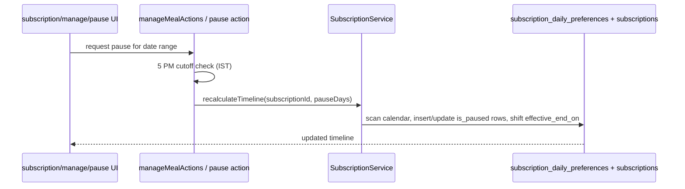

# ArogyaDiet — Application Layer Map

> Frontend→backend relationships per business domain. Every mapping verified from action/service imports and route usage. ✅ = chain verified end-to-end.
>
> **Evidence quality:** layer inventory and domain mappings = `DIRECT CODE` (import tracing + directory listings); RPC/table associations = `SCHEMA` + `DIRECT CODE` (call sites in actions/services); items marked ⚠️/🔍 carry their own inline evidence note.

## Layer rules

1. **UI → Action:** server components and client components invoke Server Actions (`"use server"` in `src/actions/**`).
2. **Action → Validation:** inputs validated with zod schemas in `src/validations/**`.
3. **Action → Service:** business logic lives in `src/services/**` (or `src/lib/**` domain helpers); thin actions delegate.
4. **Service → Repository/DB:** direct Supabase queries or RPC calls; `src/repositories/**` only where a domain needs an abstraction (stay, kit lifecycle, onboarding, disputes, health reports, throttle, payments).
5. **Tenant id resolution:** the id used for any write is resolved server-side from session context, never trusted from client input (verified pattern in rider, franchise, and admin clinic/dietitian actions).
6. **Admin/master pages** may use `createAdminClient` (service role) with application-level scoping re-enforced in code; customer/rider/franchise use the RLS-bound session client.

## Diagram — example chain (customer pause)

## Domain → action → service → tables/RPC map (verified)

| Domain | Actions | Services | Tables / RPCs (principal) |
|---|---|---|---|
| Identity & auth | `authActions`, `signupActions`, `mobileAuthActions`, `pinAuthActions`, `pinManagementActions` | `AuthService`, `signupService`, `PinService`, `PinThrottleService`, `OtpLoginService` ⚠️ | `users`, `roles`, `auth.users`, `otp_login_throttle`, PIN columns on `users` |
| Onboarding | `admin-actions/onboardingActions`, `profileCompletionActions`, `accommodationOnboardingActions` | `OnboardingService`, `signupService` | `customer_profiles`, `addresses`, `onboard_customer` RPC |
| Subscriptions | `checkoutActions`, `manageMealActions`, `mealSubscriptionHistoryActions`, `admin-actions/adminSubscriptionActions`, `subscriptionActions`, `franchise-actions/franchiseSubscriptionActions`, `partialPaymentActions`, `subscriptionPaymentActions` | `SubscriptionService`, `SubscriptionPaymentService`, `BillingService`, `customerCouponCore` | `subscriptions`, `subscription_plans`, `subscription_daily_preferences`, `subscription_payment_transactions`, `subscription_recalculation_history`, `payments`, `coupons`, `recalculate_subscription_tenure` RPC ⚠️ |
| Addresses | `addressActions` | `addressService` | `addresses` (lat/lng geocode via `src/lib/geocoding.ts`) |
| Meal delivery | `admin-actions/adminMealActions`, `workloadActions`, `plannedActions` | `dashboardMetrics` | `delivery_orders`, `subscription_daily_preferences`, `workload_snapshots` |
| Daily automation | `inventory-actions/{dailyPipeline, orderGeneration, routeEngine}` | — (pipeline-internal) | `delivery_orders`, `automation_logs`, `delivery_batches` |
| Dispatch/routing | `admin-actions/routingActions`, `routingSandboxActions`, `liveTrackingActions`, `serviceAreaActions`, `fixedAssignmentActions`, `deliveryChargeActions` | `AssignmentService`, `DeliveryChargeService`, `RateConfigService` | `delivery_batches`, `rider_service_areas`, `fixed_rider_assignments`, `rate_configs`, `rider_live_locations`, `kitchens`, Google Routes API |
| Riders | `rider-actions/*`, `admin-actions/riderActions`, `riderClinicActions`, `financePayoutActions`, `franchise-actions/franchiseRiderActions` | — | `rider_profiles`, `rider_monthly_summaries`, `rider_payouts`, `rider_live_locations` |
| KIT | `kitLifecycleActions`, `kitTrackerActions`, `admin-actions/kitProductActions`, `kitBulkImportActions`, `kitCustomerShippingActions` | `KitLifecycleService`, `KitReportService` | `kit_products`, `kit_daily_logs`, `kit_shipping_info`, `kit_report_cache`, `subscriptions` (KIT columns) |
| Accommodation/Stay | `stayActions`, `stayPaymentActions`, `stayInvoiceActions`, `accommodationOnboardingActions`, `addonServiceActions` | `AccommodationService`, `AccommodationPaymentHostService` | `stay_entries`, `stay_payment_transactions`, `stay_extension_history`, `stay_recalculation_history`, `customer_health_logs`, `admin_health_logs`, `addon_service_requests` |
| Health & reports | `dietitian-actions/*`, `customerHealthReportActions` | `HealthLogService`, `HealthReportService`, `ReportCardService`, `CadenceService`, `Dietitian*` services | `health_logs`, `health_log_audit_entries`, `report_cards`, `report_card` PDF via api routes |

| Domain | Actions | Services | Tables / RPCs (principal) |
|---|---|---|---|
| Shop / add-ons | `shop-actions`, `admin-actions/assistedOrderActions`, `clinicShopInventoryActions`, `franchise-actions/franchiseShopOrderActions`, `franchiseProductActions` | `AssistedOrderService`, `addonOrderCore`, `ShopReceiptService` | `products`, `addon_orders`, `addon_order_items`, `clinic_product_settings`, `clinic_product_ledger`, `franchise_product_settings`, RPCs: `place_assisted_addon_order`, `decrement_franchise_product_stock`, `clinic_shop_apply_sale`, `clinic_shop_stock_in` |
| Payments | `checkoutActions`, `stayPaymentActions`, `subscriptionPaymentActions` | `SubscriptionPaymentService`, `AccommodationPaymentHostService` | `payments`, `razorpay_transactions`, `stay_payment_transactions`, Razorpay SDK + webhook |
| Inventory (central) | `admin-actions/inventoryActions`, `packageImageActions` | `inventoryEngine` | `inventory_products`, `inventory_lots`, `inventory_transactions`, `manufacturing_orders`, `manufacturing_outputs`, `manufacturing_batches`, `manufacturing_product_mappings`, `inventory_product_categories` |
| Franchise inventory | `franchise-actions/franchiseInventoryActions`, `franchiseDispatchActions`, `franchiseKitchenActions`, `master-actions/stockTransferActions` | `franchiseInventoryEngine` | `franchises`, `franchise_warehouses(+stock)`, `franchise_inventories`, `franchise_inventory_lots`, `franchise_inventory_ledger`, `franchise_stock_transfers(+lines)`, RPCs: `dispatch_to_franchise`, `accept/reject_franchise_transfer`, `receive_franchise_transfer`, `record_franchise_stock_out`, `franchise_shop_stock_in`, `provision_franchise_inventory`, `transfer_stock` |
| Franchise tenancy | `franchise-actions/franchiseActions`, `franchiseUserActions`, `franchisePincodeRequestActions`, `franchiseServiceAreaActions`, `franchiseCustomerActions`, `franchiseDisputeActions`, `franchiseDietitian*` | `customerManagementCore`, `CadenceService` | `franchises`, `franchise_pincodes`, `franchise_pincode_requests`, `franchise_disputes`, `franchise_agreement_documents`, `holidays` |
| Hierarchy (Master) | `master-actions/{businessActions, cityActions, groupActions, kitchenActions, clinicActions, franchiseActions, clinicWiringActions}` | repositories/clinic | `businesses`, `cities`, `groups`, `kitchens`, `clinics`, RPCs: `create_group_with_kitchen`, `delete_group_with_kitchen`, `create_move_franchise_to_group` |
| BI / reporting | `master-actions/bi*`, `networkReportActions`, `customerReportActions`, `subscriptionReportActions` | `dashboardMetrics` | read-only aggregates across domains |
| Rate config | `master-actions/rateConfigActions` | `RateConfigService` | `rate_configs`, `rate_config_audit_logs` |
| Notifications | `lib/notifications*`, `master-actions/notificationSettingsActions` | `emailService` | `notifications`, OneSignal, Resend |
| App distribution | `api/app-download/grant` | `src/lib/appDistribution/*` | `app_download_throttle` repo, Supabase Storage, Turnstile |
| Disputes | `franchise-actions/franchiseDisputeActions`, `master-actions/disputeActions` | — | `franchise_disputes` |
| Automation fallback | `admin-actions/fallbackAutomationActions`, `holidayActions` | `FallbackAutomationService` | `holidays`, `automation_logs` (manual-run tracking) |

## Cross-cutting libs

- `src/lib/dates/ist.ts` — all IST day logic (cron targets, cutoffs, `purchaseAttributionDate`).
- `src/lib/distance.ts` — Haversine; `src/lib/routing/googleRoutes.ts` — Google Routes computeRoutes (waypoint optimization, polyline; field-masked).
- `src/lib/clinic/workload.ts` — snapshot compute/finalize/persist.
- `src/lib/auth/adminAccessCore.ts` — pure access-level path gate (edge-safe core; `adminAccess.ts` is the `server-only` counterpart).
- `src/lib/pricing`, `src/lib/coupons`, `src/lib/invoices`, `src/lib/zip`, `src/lib/csv`, `src/lib/perf` (ServerTiming).

## Traceability convention

Every feature trace in `02-portal-feature-map.md` names its action/service/table here. Where a documented feature could not be traced to a live chain, it is marked ⚠️/🔍 in both files.

