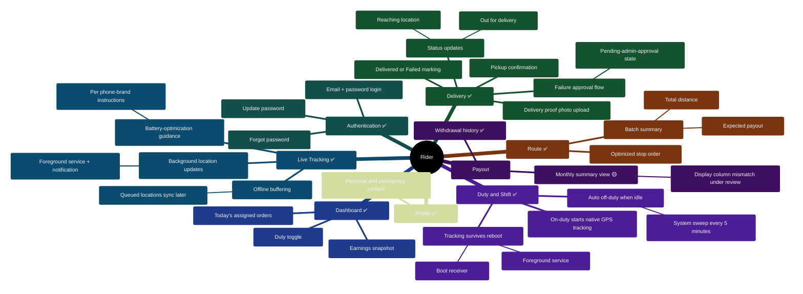

# 03 — Rider Portal Feature Map

> Portal: `deliverypartner.*` → `/rider`. Runs inside the Android app (Capacitor APK); also usable in a mobile browser.

## Diagram 3 — Rider Feature Tree

## Notes for the client conversation

- **The tracking is genuinely native.** Going on duty starts an Android foreground service (with a persistent notification) that records location even in the background, buffers fixes while offline, and syncs when connectivity returns. Tracking restarts after a phone reboot. This is hardened, verified code — the strongest mobile capability in the platform.
- **Route is pre-computed, not rider-decided:** stops arrive in an optimized order with a distance and expected payout for the batch, so riders simply follow the list.
- **One honest caveat:** the payout screen reads a summary column the monthly settlement job doesn't currently populate, so figures need reconciliation until the fix lands (🟡 — the top-priority open item).
- Two legacy route folders exist in the rider app but are not part of any flow (dead surfaces — cleanup candidate).
