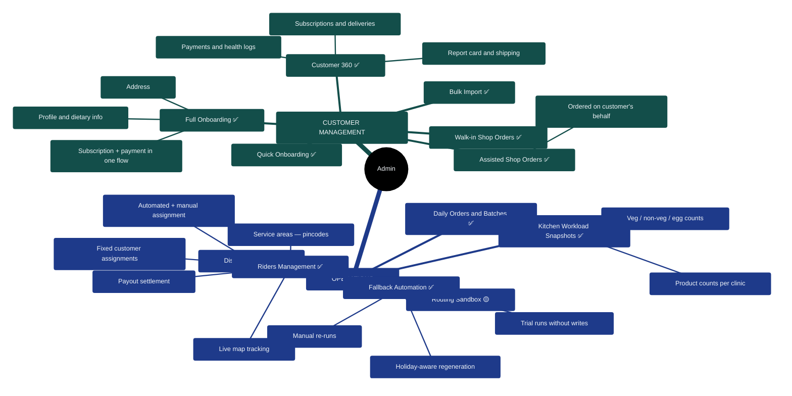
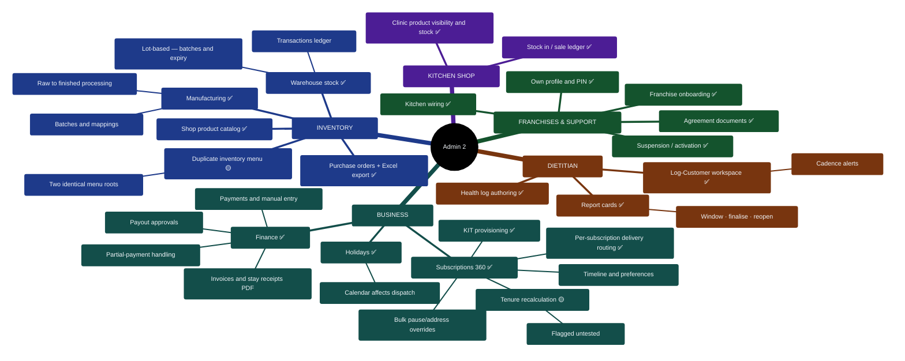

# 04 — Admin Portal Feature Map

> Portal: `admin.*` → `/admin`. Role-gated with access levels (inventory / operations / inventory_operations / dietitian). The 11 modules are grouped below into five business areas for readability — the features themselves are unchanged.

## Diagram 4 — Admin Feature Tree (grouped)

## Notes for the client conversation

- **Access levels are real role separation:** an `inventory`-level admin never sees operations pages and vice versa; the gate is enforced at routing *and* re-checked inside the portal.
- **Customer onboarding is the front door:** accounts are created by admin (self-signup is disabled), with full/quick/bulk variants for different throughput needs.
- **Operations has a safety net:** if the nightly automation misses a step, admins can manually re-run pipeline stages, and holidays automatically pause delivery generation.
- The kitchen-shop module manages clinic-level product stock separately from warehouse inventory.

