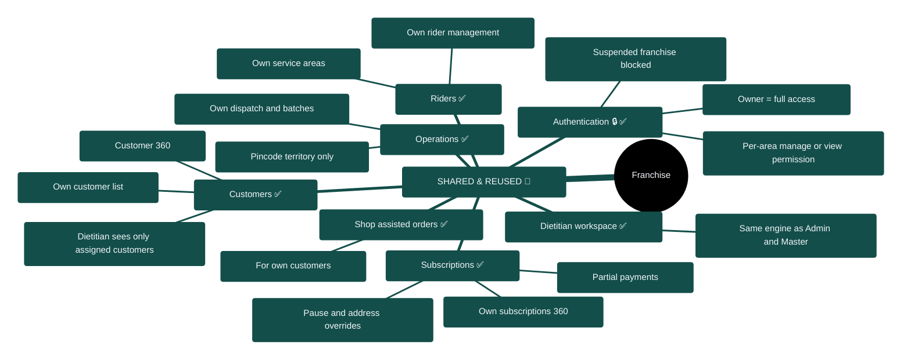
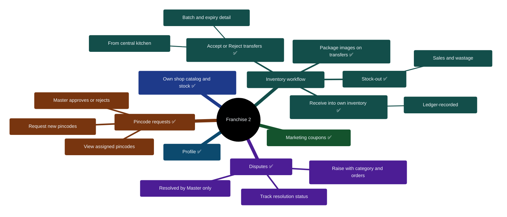

# 05 — Franchise Portal Feature Map

> Portal: `franchies.*` → `/franchise`. A second tenant model: the franchise operator gets a franchise-scoped copy of the operational tools. Entirely gated by the franchise feature flag (off by default; on in this workspace).
>
> Legend: 🔁 = **shared engine reused** (same logic as Admin, scoped to this franchise) · ⭐ = **franchise-specific** · 🔒 = governed by per-group **manage/view permission**.

## Diagram 5 — Franchise Feature Tree

## Notes for the client conversation

- **Reuse, not a copy-paste.** Customers, subscriptions, operations, riders, and the dietitian workspace run on the *same engines* as Admin — the franchise portal just scopes everything to its own franchise. This guarantees, for example, that dietitian activity numbers match what Master reports.
- **The inventory flow is franchise-unique:** central kitchen dispatches stock; the franchise accepts or rejects it, receives it into its own batch-tracked inventory, and consumes it on sales — every movement ledger-recorded. The franchise cannot see the central warehouse; it only sees what was sent to it.
- **Escalation, not independence:** the franchise can raise disputes and request new pincode territories, but only Master resolves/approves them.
- **Permission granularity:** within the franchise team, each user gets manage or view permission per area (customers, subscriptions, riders, operations, shop); the owner always has full access.

