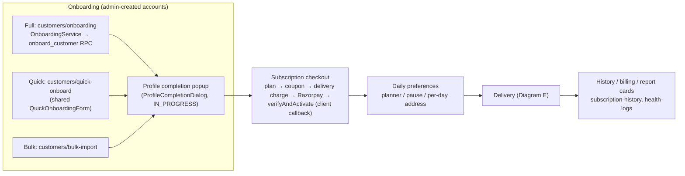
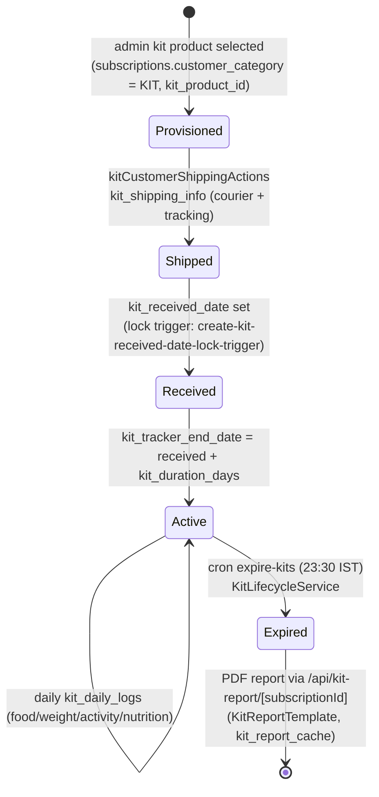
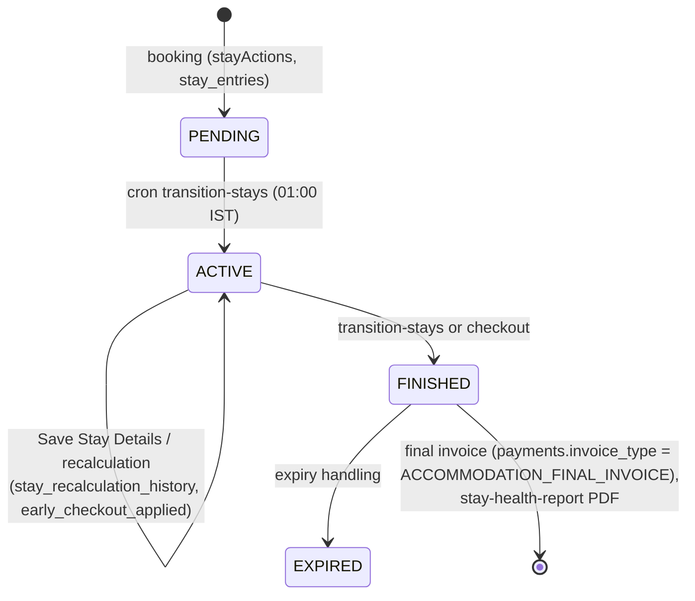
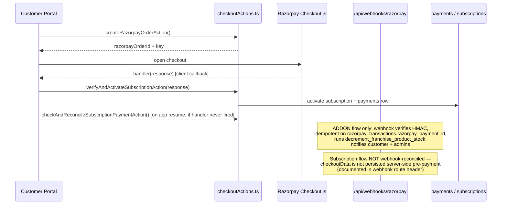
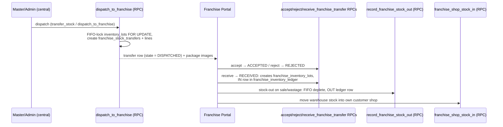
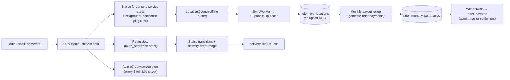

# ArogyaDiet — Business Workflows

> End-to-end flows supported by actual implementation. All steps trace to verified code. Diagram E/F are the required main diagrams.

## 1. Diagram E — Daily Delivery Flow (order → payout)

```mermaid
sequenceDiagram
    participant PG as Supabase pg_cron
    participant Pipe as runDailyPipeline()<br/>(actions/system-actions/dailyPipeline.ts)
    participant OG as generateDailyOrders()
    participant LP as linkDailyShopPurchases()
    participant WS as finalizeWorkloadSnapshot()
    participant AD as executeAutomatedDispatch()
    participant DB as Postgres
    participant Rider as Rider App (APK)
    participant Cust as Customer Portal
    participant Pay as generate-rider-payments cron

    Note over PG: generate-orders 17:15 IST,<br/>link-products 23:55 IST (UTC schedules)
    PG->>Pipe: GET /api/cron/generate-orders?secret=...
    Pipe->>OG: 1. create delivery_orders (retry x3)
    Pipe->>LP: 2. link addon_orders → delivery_orders (retry x3)
    Pipe->>WS: 3. finalize per-clinic workload_snapshots
    Pipe->>AD: 4. assign riders by pincode, build routes
    AD->>DB: delivery_batches + route_sequence + payout_amount (rate_configs / system_settings.rider_payout_per_km)
    Note over Pipe: Halt-on-failure; prior step outputs preserved (PipelineResult.steps, failedStep)
    Rider->>DB: pickup → OUT_FOR_DELIVERY → REACHING_TO_LOCATION → DELIVERED
    Rider->>DB: background GPS → rider_live_locations (SupabaseUploader)
    Cust->>Cust: tracking/[orderId] reads rider location + delivery_status_logs
    Pay->>DB: monthly rollup of DELIVERED payout_amount → rider_monthly_summaries ⚠️ (writes total_earnings; UI reads net_payable)
```

Verification notes: pipeline semantics (4 steps, halt-on-failure, retry policy Req 11.6–11.8) read directly from `dailyPipeline.ts`. The `net_payable` mismatch is flagged in `AROGYADIET_DASHBOARDS_FEATURES.md` §12 and remains `UNVERIFIED` as to whether a fill path exists.

## 2. Customer lifecycle (onboarding → history)



Cutoff rule: modifications for tomorrow lock at 17:00 IST; after cutoff the earliest editable date is the day after tomorrow (enforced in meal/pause/address actions via `src/lib/dates/ist.ts`).

## 3. KIT lifecycle (purchase → expiry → report)



Category-guard triggers (`create-kit-tracker-category-guard-triggers.sql`) prevent KIT logging on non-KIT subscriptions.

## 4. Accommodation / Stay lifecycle



Payments use `stay_payment_transactions` (ADVANCE / PARTIAL_BALANCE_PAYMENT / REFUND) and `AccommodationPaymentHostService` for host-profile payment.

## 5. Subscription payment flow (verified, with webhook asymmetry)



**Documented limitation:** an Android UPI app-switch kill during *subscription* checkout leaves the payment captured on Razorpay without activation; recovery relies on the in-app resume reconcile action. Fix requires persisting `checkoutData` server-side at order-creation time.

## 6. Diagram F — Franchise Inventory Flow



Supporting engine: `src/services/franchiseInventoryEngine.ts`; tables: `franchise_warehouses(+_stock)`, `franchise_inventories`, `franchise_inventory_lots`, `franchise_inventory_ledger`, `franchise_stock_transfers(+lines)`; RLS scripts `scripts/create-franchise-inventory-rls-policies.sql` / `enable|disable-franchise-rls.sql`.

## 7. Rider duty → delivery → payout



Boot persistence: `BootReceiver.java` restarts the tracking service after device reboot; `WakeLockManager` + OEM battery instructions (`src/lib/capacitor/oem-battery-instructions.ts`) mitigate Doze. Details in `11-native-mobile-architecture.md`.

## 8. Dietitian activity — one engine, three surfaces

`CadenceService` computes "days since last log"/"customers missing self-log" identically for Admin Log-Customer workspace, Franchise Dietitian Activity report, and Master Dietitian Activity section. Report cards (`report_cards`: ACTIVE → finalised via `reportCardLifecycleActions`, `reopen_count`, `finalised_by`) share the lifecycle and PDF export path across all three portals. Spec `.kiro/specs/report-card-lifecycle/tasks.md` has unchecked items (final report + PDF export, remaining gaps, DB-level verification) — status 🟡.

## 9. Rider assignment — pincode is the unit of territory

Core and franchise routing both resolve riders via `rider_service_areas.pincode → rider_id` (franchise rows stamped `franchise_id`); `fixed_rider_assignments` overrides take priority; batches use Haversine from kitchen coordinates; payout = distance × `rate_configs.rider_payout_rate_per_km` (fallback `system_settings.rider_payout_per_km`). Pincode reassignment between clinics uses the `create-move-pincode-rpc` (SECURITY DEFINER).


