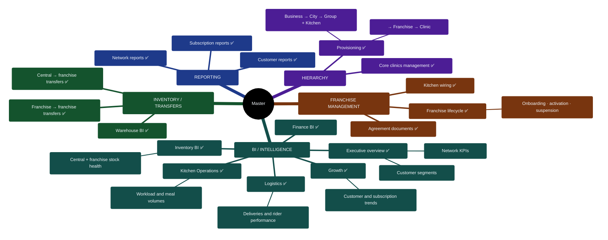
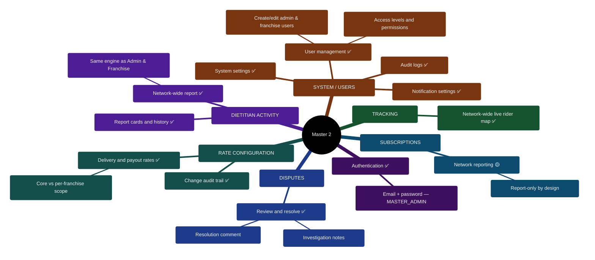

# 06 — Master Portal Feature Map

> Portal: `master.*` → `/master`. Super-admin / BI portal with full-network scope, grouped by business capability.

## Diagram 6 — Master Feature Tree (grouped)

## Notes for the client conversation

- **Master sees everything, touches the structure.** Where Admin runs today's business and Franchise runs its own territory, Master owns the *network*: which businesses/cities/kitchens/franchises/clinics exist, what delivery and payout rates apply, and who gets access to which portal.
- **BI-first design:** growth, logistics, kitchen-ops, inventory and finance each have a dedicated analytics suite, plus a flexible report engine with exportable outputs.
- **Control loops:** Master both provisions franchises *and* is the escalation point for their disputes and pincode requests; rate changes are audit-logged field-by-field.
- Subscriptions here are deliberately read-only reporting — actual subscription management belongs to Admin/Franchise.

