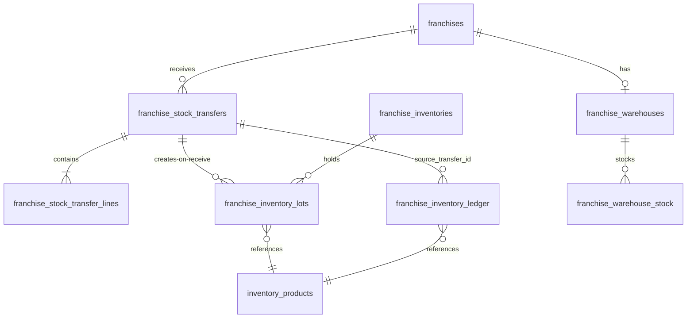

# ArogyaDiet — Database Domain Map

> Tables grouped into ~20 domains (Diagram H), from the supplied SQL schema + `scripts/**` migrations. Not a flat ERD: each domain lists key tables, relationships, actions/services, RPCs, and consuming portals. Schema context: `customer_profiles` gained `franchise_id`, `clinic_id`, `dietitian_id`, `onboarding_status`, `medical_history_confirmed` beyond the base `.clinerules` schema; `subscriptions` gained `customer_category` (MEAL/KIT/ACCOMMODATION) + KIT + charge/discount columns.
>
> **Evidence quality:** table/relationship/RPC columns = `SCHEMA` (supplied SQL + `scripts/*.sql`); actions/services/portals columns = `DIRECT CODE`; where a domain's RPC list is inferred from migration filenames rather than read function bodies, it is `INFERENCE` (e.g., exact RPC signatures).

## Diagram H — Database Domain Architecture

```mermaid
flowchart TB
    subgraph Identity["Identity & Tenancy"]
        roles[roles] --- users[users]
        users --> cp[customer_profiles]
        users --> rp[rider_profiles]
        businesses[businesses] --> cities[cities] --> groups[groups]
        groups -->|kitchen_id unique| kitchens[kitchens]
        franchises[franchises] -->|group_id| groups
        clinics[clinics] -->|kitchen_id, franchise_id| kitchens
    end

    subgraph Subs["Subscriptions"]
        plans[subscription_plans] --> subs[subscriptions]
        subs --> sdp[subscription_daily_preferences]
        subs --> subpay[subscription_payment_transactions]
        subs --> subrec[subscription_recalculation_history]
    end

    subgraph Delivery["Meal Delivery"]
        sdp --> dorders[delivery_orders]
        dorders --> batches[delivery_batches]
        dorders --> dlogs[delivery_status_logs]
        rsa[rider_service_areas] -.->|pincode match| dorders
        frsa[fixed_rider_assignments] -.-> dorders
        wsnap[workload_snapshots] -.-> clinics
    end

    subgraph Money["Payments"]
        pay[payments] --> rzp[razorpay_transactions]
        pay --> subs
        staypay[stay_payment_transactions] --> stay[stay_entries]
    end

    subgraph Shop["Shop & Add-ons"]
        products[products] --> aorders[addon_orders]
        aorders --> aitems[addon_order_items]
        aorders -.->|delivery_order_id| dorders
        cps[clinic_product_settings] --> cpl[clinic_product_ledger]
        fps[franchise_product_settings] --- products
    end

    subgraph Kit["KIT"]
        kprod[kit_products] --> subs
        subs --> klogs[kit_daily_logs]
        subs --> kship[kit_shipping_info]
        subs --> kcache[kit_report_cache]
    end

    subgraph Stay["Accommodation"]
        stay --> chl[customer_health_logs]
        stay --> ahl[admin_health_logs]
        stay --> asr[addon_service_requests]
        stay --> seh[stay_extension_history]
        stay --> srh[stay_recalculation_history]
        pay -.->|stay_entry_id| stay
    end

    subgraph Diet["Dietitian & Health"]
        dlog[health_logs] --> rc[report_cards]
        dlog --> hla[health_log_audit_entries]
        cp -.->|dietitian_id| users
    end

    subgraph Inv["Inventory & Manufacturing"]
        iprod[inventory_products] --> ilots[inventory_lots]
        ilots --> itrans[inventory_transactions]
        morder[manufacturing_orders] --> ilots
        morder --> mout[manufacturing_outputs] --> iprod
        mbatch[manufacturing_batches] --- morder
        mapm[manufacturing_product_mappings] --- mbatch
    end

    subgraph FInv["Franchise Inventory"]
        ftrans[franchise_stock_transfers] --> ftlines[franchise_stock_transfer_lines]
        ftrans --> filots[franchise_inventory_lots]
        filots --> fledger[franchise_inventory_ledger]
        fwh[franchise_warehouses] --> fwhs[franchise_warehouse_stock]
        st[stock_transfers] --> fwh
        fprod[iprod] -.-> products
    end

    subgraph Support["Support & Ops"]
        notif[notifications] --- users
        hols[holidays] --- franchises
        disp[franchise_disputes] --- franchises
        fpreq[franchise_pincode_requests] --- franchises
        fdocs[franchise_agreement_documents] --- franchises
        rate[rate_configs] --> raudit[rate_config_audit_logs]
        settings[system_settings]
        alog[automation_logs]
        meddocs[medical_documents] --- cp
        cpins[customer_profiles medical_documents jsonb]
    end

    subgraph RiderOps["Rider Ops"]
        rp --> rlloc[rider_live_locations]
        rp --> rsum[rider_monthly_summaries]
        rsum --> rpays[rider_payouts]
    end

    subgraph Auth["Auth & App Distribution"]
        ot[otp_login_throttle]
        adt[app_download_throttle]
        al[admin_activity_logs]
    end
```

## Domain detail table

| # | Domain | Key tables | Relationships / notes | Major actions & services | Important RPCs | Consuming portals |
|---|---|---|---|---|---|---|
| 1 | Identity/Auth | `roles`, `users`, `otp_login_throttle`, `admin_activity_logs` | `users.auth_user_id → auth.users`; PIN columns (`pin_hash`, `is_temp_pin`, `pin_set_at`); `admin_access_level`, `admin_clinic_id`, `franchise_id` | auth/pin/mobileAuth actions; `PinService`, `PinThrottleService`, `OtpLoginService` ⚠️ | — | All 5 |
| 2 | Customers | `customer_profiles`, `addresses`, `medical_documents`, `coupons` | `customer_profiles.franchise_id/clinic_id/dietitian_id`; addresses lat/lng | onboarding/quick-onboard/bulk-import; `OnboardingService`; `addressService` | `onboard_customer` (+discount/misc-charge variants per `scripts/add-*to-onboard-rpc.sql`) | All 5 |
| 3 | Subscriptions | `subscription_plans`, `subscriptions`, `subscription_daily_preferences`, `subscription_payment_transactions`, `subscription_recalculation_history` | `customer_category` = MEAL/KIT/ACCOMMODATION; `effective_end_on` shifted by pause engine; discount + charge columns | `checkoutActions`, `manageMealActions`, admin/franchise subscription actions; `SubscriptionService`, `BillingService` | `recalculate_subscription_tenure` ⚠️ untested | Customer, Admin, Franchise, Master(RO) |
| 4 | Meal delivery | `delivery_orders`, `delivery_batches`, `delivery_status_logs`, `meal_categories`, `workload_snapshots` | `route_sequence`, `batch_id`, `franchise_id/clinic_id` stamps; status enum incl. `PENDING_FAILURE_APPROVAL` | orderGeneration/routeEngine, operations actions, workload actions | rider location upsert RPC | Admin, Franchise, Rider, Customer(RO) |
| 5 | Routing/Rates | `rider_service_areas`, `fixed_rider_assignments`, `rate_configs`, `rate_config_audit_logs`, `kitchens` | pincode ↔ rider; core vs franchise scope | routing/serviceArea/fixedAssignment actions; `AssignmentService`, `RateConfigService` | `create-move-pincode-rpc` | Admin, Franchise, Master |
| 6 | Riders | `rider_profiles`, `rider_live_locations`, `rider_monthly_summaries`, `rider_payouts` (+ adjustments table per `create-rider-payout-adjustments-table.sql`) | summary status = GENERATED/PAID ⚠️ (docs said OPEN/LOCKED/SETTLED); `net_payable` vs `total_earnings` mismatch | rider actions, financePayoutActions | payout rollup logic in cron | Rider, Admin, Franchise, Master |
| 7 | Payments | `payments`, `razorpay_transactions` | `invoice_type` enum (SUBSCRIPTION/ADDON/ACCOMMODATION_*); `amount_paid`/`balance_due` split | `checkoutActions`, `stayPaymentActions` | stock-decrement RPCs invoked from webhook | Customer, Admin, Franchise |
| 8 | Shop/Add-ons | `products`, `addon_orders`, `addon_order_items`, `clinic_product_settings`, `clinic_product_ledger`, `franchise_product_settings` | `fulfillment_status` incl. walk-in/clinic-pickup/offline; ledger for stock parity | shop/assisted-order/clinicShop actions; `AssistedOrderService`, `addonOrderCore` | `place_assisted_addon_order`, `clinic_shop_apply_sale`, `clinic_shop_stock_in`, `decrement_franchise_product_stock`, `verify_clinic_stock_ledger_parity` | Customer, Admin, Franchise |
| 9 | KIT | `kit_products`, `kit_daily_logs`, `kit_shipping_info`, `kit_report_cache` | KIT columns on `subscriptions` (duration/received/tracker end/skipped) | kit lifecycle/tracker/shipping actions; `KitLifecycleService`, `KitReportService` | tracker sync + category-guard triggers | Customer, Admin, Franchise(shared), Master(RO) |
| 10 | Accommodation | `stay_entries`, `stay_payment_transactions`, `stay_extension_history`, `stay_recalculation_history`, `customer_health_logs`, `admin_health_logs`, `addon_service_requests` | `stay_type` AC Villa/Village Style Hut; occupancy; early-checkout recalculation | stay/stayInvoice/addonService actions; `AccommodationService` | `create-stay-recalculation.sql` | Customer, Admin, Franchise(shared), Master(RO) |

| # | Domain | Key tables | Relationships / notes | Major actions & services | Important RPCs | Consuming portals |
|---|---|---|---|---|---|---|
| 11 | Dietitian/Health | `health_logs`, `health_log_audit_entries`, `report_cards` | `parameters`/`custom_parameters` jsonb; `submission_date_ist`; report window + finalise/reopen | dietitian-actions; `HealthLogService`, `ReportCardService`, `CadenceService` | — | Admin, Franchise, Master, Customer(logs) |
| 12 | Inventory (central) | `inventory_products`, `inventory_lots`, `inventory_transactions`, `manufacturing_orders/outputs/batches`, `manufacturing_product_mappings`, `inventory_product_categories` | lot-based FIFO; durability/expiry; soft delete | inventory actions; `inventoryEngine` | stock-in/transfer RPCs | Admin, Master |
| 13 | Franchise inventory | `franchises`, `franchise_warehouses(+stock)`, `franchise_inventories`, `franchise_inventory_lots`, `franchise_inventory_ledger`, `franchise_stock_transfers(+lines)`, `stock_transfers` | state machine DISPATCHED→ACCEPTED/REJECTED→RECEIVED | franchise inventory/dispatch actions; `franchiseInventoryEngine` | `dispatch_to_franchise`, `accept/reject_franchise_transfer`, `receive_franchise_transfer`, `record_franchise_stock_out`, `franchise_shop_stock_in`, `provision_franchise_inventory`, `transfer_stock` | Franchise, Master, Admin |
| 14 | Franchise tenancy | `franchises`, `franchise_pincodes`, `franchise_pincode_requests`, `franchise_agreement_documents`, `franchise_disputes`, `holidays` | `franchises.status` (onboarding/active/suspended USER-DEFINED) | franchise actions; disputes | `create_move_franchise_to_group` etc. | Franchise, Master, Admin |
| 15 | Hierarchy | `businesses`, `cities`, `groups`, `kitchens`, `clinics` | Business→City→Group(+kitchen unique)→Franchise/Clinic | master hierarchy actions; repositories/clinic | `create_group_with_kitchen`, `delete_group_with_kitchen` | Master, Admin |
| 16 | Notifications | `notifications` | per-user + `franchise_id`; `notifyAdmins` shared-admin email | `lib/notifications*`, `emailService` (Resend) | — | All |
| 17 | Automation | `automation_logs` | `automation_type` = ORDER_GEN/PRODUCT_LINK/ROUTING; manual-run tracking columns | dailyPipeline, FallbackAutomationService | — | System/Admin |
| 18 | App distribution | `app_download_throttle` | Turnstile + rate limiting | `lib/appDistribution/*`, `api/app-download/grant` | — | Customer(public), Rider |
| 19 | Config | `system_settings` | `rider_payout_per_km` (fallback), `default_dispatch_time`, `shared_admin_email` | master system actions | — | Master, Admin |
| 20 | BI | read-only aggregates over the above | — | `master-actions/bi*` | — | Master, Admin (exec summary) |

## Multi-tenancy columns

`franchise_id` was added via `scripts/add-franchise-id-columns.sql` to: `users`, `customer_profiles`, `rider_profiles`, `addresses`, `subscriptions`, `payments`, `razorpay_transactions`, `coupons`, `delivery_orders`, `delivery_batches`, `rider_service_areas`, `rider_live_locations`, `rider_monthly_summaries`, `rider_payouts`, `products`, `addon_orders`, `addon_order_items`, `notifications`, `holidays` (+ `clinic_id` on a subset). This column-stamping pattern — not RLS alone — is the primary tenant partition for many tables; RLS policies exist for franchise/hierarchy/inventory domains (`create-franchise-rls-policies.sql`, `create-franchise-inventory-rls-policies.sql`, `create-franchise-hierarchy-rls-policies.sql`, `create-dietitian-management-rls.sql`, `create-kit-*-rls-policies.sql`) with enable/disable toggles present for migrations.

## Example per-domain ER (franchise inventory)

