# 07 — Shared Features Across Portals

> Which capabilities are shared, which are reused with different permissions, and which belong to one portal only. Reuse story first, technical detail in audit doc `12-shared-vs-portal-specific.md`.

## Diagram 7 — Shared Capability Relationship Map

```mermaid
%%{init: {"theme":"base","themeVariables":{"primaryColor":"#0f172a","primaryTextColor":"#f1f5f9","primaryBorderColor":"#475569","lineColor":"#64748b","textColor":"#f1f5f9","clusterBkg":"#111827","clusterBorder":"#374151"},"themeCSS":".node text, text{fill:#f1f5f9 !important;}"}}%%
flowchart TB
    subgraph SHARED["🔁 SHARED ENGINES — one implementation, all portals"]
        S1["Subscription lifecycle"]
        S2["Report cards + health review"]
        S3["Dietitian cadence"]
        S4["Dispatch & routing"]
        S5["Rider payouts"]
        S6["Notifications"]
        S7["Inventory engines"]
        S8["Assisted shop orders"]
    end

    C["🧍 CUSTOMER"] -. subscribes .-> S1
    R["🏍️ RIDER"] -. consumes .-> S4
    R -. views .-> S5

    A["🛠️ ADMIN<br/>(full network)"]
    F["🏢 FRANCHISE<br/>(own territory)"]
    M["👑 MASTER<br/>(BI + governance)"]

    A --> S1 & S2 & S3 & S4 & S5 & S6 & S7 & S8
    F --> S1 & S2 & S3 & S4 & S5 & S6 & S7 & S8
    M -. reports on .-> S1
    M --> S2 & S3 & S5 & S6 & S7

    classDef shared fill:#1e3a8a,stroke:#60a5fa,stroke-width:1.5px,color:#f1f5f9;
    classDef customer fill:#134e4a,stroke:#2dd4bf,stroke-width:1.5px,color:#f1f5f9;
    classDef rider fill:#78350f,stroke:#fbbf24,stroke-width:1.5px,color:#f1f5f9;
    classDef admin fill:#1e3a8a,stroke:#60a5fa,stroke-width:2px,color:#f1f5f9;
    classDef franchise fill:#4c1d95,stroke:#c084fc,stroke-width:1.5px,color:#f1f5f9;
    classDef master fill:#0c4a6e,stroke:#38bdf8,stroke-width:1.5px,color:#f1f5f9;

    class S1,S2,S3,S4,S5,S6,S7,S8 shared;
    class C customer;
    class R rider;
    class A admin;
    class F franchise;
    class M master;

    %% Arrow color = source portal (trace a color top-to-bottom)
    linkStyle 0 stroke:#2dd4bf,color:#2dd4bf,stroke-width:2px;
    linkStyle 1,2 stroke:#fbbf24,color:#fbbf24,stroke-width:2px;
    linkStyle 3,4,5,6,7,8,9,10 stroke:#60a5fa,color:#60a5fa,stroke-width:2px;
    linkStyle 11,12,13,14,15,16,17,18 stroke:#c084fc,color:#c084fc,stroke-width:2px;
    linkStyle 19,20,21,22,23,24 stroke:#38bdf8,color:#38bdf8,stroke-width:2px;
```

**Reading the arrows:** color = source portal — 🟢 **teal** Customer · 🟠 **amber** Rider · 🔵 **blue** Admin · 🟣 **violet** Franchise · 🔷 **sky** Master (same colors as the portal boxes). Solid = full operational use · dashed = view/consume/report only. The point: Admin and Franchise run the *same engines* — Franchise is simply scoped to its own territory, which is why numbers always agree across portals.

## 🔁 Shared feature — same capability, same behavior everywhere

| Shared capability | Customer | Rider | Admin | Franchise | Master |
|---|---|---|---|---|---|
| Subscription lifecycle | self-service | — | manage all | manage own | report-only |
| Report cards + health-log review | submits logs | — | full | full | full |
| Dietitian cadence engine | — | — | ✅ | ✅ | ✅ (identical numbers by design) |
| Dispatch & routing (pincode-based) | receives | consumes | all clinics | own territory | views |
| Rider payouts | — | views own | settles all | settles own | settles + BI |
| Inventory engines | — | — | warehouse | franchise side | both |
| Notifications (push/email) | ✅ | ✅ | ✅ | ✅ | ✅ |

## 🔒 Reused with different permissions — same code, narrower reach

| Capability | Admin | Franchise |
|---|---|---|
| Customer 360 | all customers | **own franchise only** |
| Assisted shop orders | any customer | **own customers only** |
| Delivery fees on assisted orders | standard | **forced to zero** (franchise policy) |
| Operations gates | access levels | per-area manage/view (owner = full) |

## ⭐ Portal-specific feature

| Portal | Unique capabilities |
|---|---|
| Customer | PIN login · per-day planner/pause/address · KIT & stay trackers · shop cart |
| Rider | duty/shift · native background GPS · route consumption · proof photos |
| Admin | full/quick/bulk onboarding · warehouse manufacturing · kitchen-shop stock · routing sandbox · holidays |
| Franchise | transfer accept/reject/receive · stock-out · disputes (raise) · pincode requests · own catalog · coupons |
| Master | hierarchy provisioning · rate configuration · dispute resolution · BI suites · user management · audit logs |

## 🟡 Duplicated / legacy surface — cleanup candidates

- Admin: two identical inventory menu roots.
- Master: two subscription/dashboard surfaces (top-level vs `(main)`).
- Rider: two dead route folders.

## Why this matters

Shared engines are why **numbers agree across portals** (a franchise's dietitian-activity report always matches Master's network report) and why a change to subscription logic, routing, or payouts automatically applies everywhere it's used — one implementation instead of five diverging copies.
