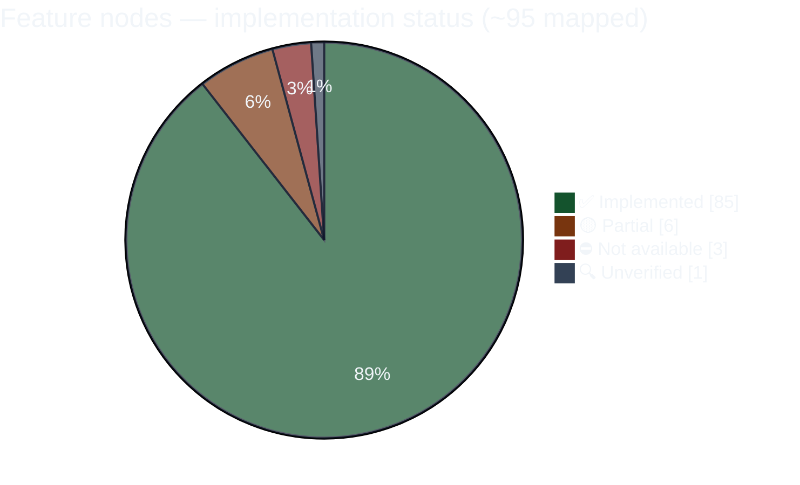

# 08 — Overall Feature Status Map

> Status at a glance, then per-portal tables. Every status traces to code chains, tests, and the features doc (details per portal in `02`–`06`).

## Diagram 8 — Platform Status at a Glance

**How much is built?** Roughly **9 out of 10 mapped feature nodes are fully implemented and connected.** The partial and unavailable items are few and specific — listed below each portal.

## Per-portal status tables

### Customer

| Module | Status | Note |
|---|---|---|
| Dashboard | ✅ | incl. profile-completion popup |
| Authentication | ✅ / ⛔ | PIN live; OTP built but unmounted; self-signup disabled by design |
| Subscription (checkout/manage/billing/history) | ✅ | incl. coupons, partial payments, 5 PM cutoff |
| Meals | ✅ | |
| KIT (tracker/shipping/history/report) | ✅ | |
| Accommodation (tracker/logs/services/history/report) | ✅ | |
| Shop & orders | ✅ | webhook-backed payment |
| Tracking | ✅ | |
| Health logs | ✅ | |
| Profile & addresses | ✅ | |
| Get the App | 🟡 | QR landing live; operator setup steps unchecked |

### Rider

| Module | Status | Note |
|---|---|---|
| Authentication | ✅ | |
| Dashboard & duty | ✅ | auto-off-duty sweep |
| Route & delivery | ✅ | incl. proof photos, failure-approval state |
| Live tracking (native) | ✅ | offline queue, reboot persistence |
| Payout | 🟡 | summary column not filled by settlement job |
| Profile | ✅ | |
| Legacy routes | ⛔ | two dead folders |

### Admin

| Module | Status | Note |
|---|---|---|
| Dashboard | ✅ / 🟡 | executive summary only (full BI is Master's) |
| Customers (onboarding/360/orders) | ✅ | |
| Subscriptions | ✅ / 🟡 | tenure recalculation flagged untested |
| Operations & dispatch | ✅ | |
| Routing sandbox | 🟡 | trial utility |
| Riders & payouts | ✅ | |
| Finance | ✅ | manual payment entry (no gateway in admin) |
| Inventory | ✅ / 🟡 | duplicate menu root |
| Kitchen shop | ✅ | |
| Dietitian & report cards | ✅ | |
| Franchises oversight | ✅ | |
| Holidays, Profile | ✅ | |

### Franchise (all gated by feature flag)

| Module | Status | Note |
|---|---|---|
| Auth + RBAC | ✅ | per-area manage/view |
| Customers / Subscriptions / Operations / Riders | ✅ | shared engines, own scope |
| Inventory (accept/reject/receive/stock-out) | ✅ | ledger-backed |
| Shop & assisted orders | ✅ | |
| Dietitian workspace | ✅ | |
| Disputes (raise) | ✅ | resolution is Master's |
| Marketing coupons, Pincode requests | ✅ | approval is Master's |
| Warehouse visibility | ⛔ | intentional — franchises only see transfers sent to them |

### Master

| Module | Status | Note |
|---|---|---|
| BI suites (growth/logistics/kitchen/inventory/finance) | ✅ | |
| Reports engine | ✅ | |
| Hierarchy provisioning | ✅ | |
| Rate configuration | ✅ | audit-logged |
| Stock transfers | ✅ | |
| Disputes resolution | ✅ | |
| Dietitian activity | ✅ | |
| User management, System, Logs, Tracking | ✅ | |
| Subscriptions | 🟡 | report-only by design |

## What this means

**The platform is substantially built.** Every portal's core loop is implemented and connected — customers can subscribe, pay, and receive; riders can run routes with real background tracking; operations runs on verified automation; the franchise tenant model and the master BI/management layer are complete. The remaining items are a short, specific list: one payout-display mismatch, one unmounted login option, a few duplicate/cleanup surfaces, and operator-side setup steps for app distribution.
