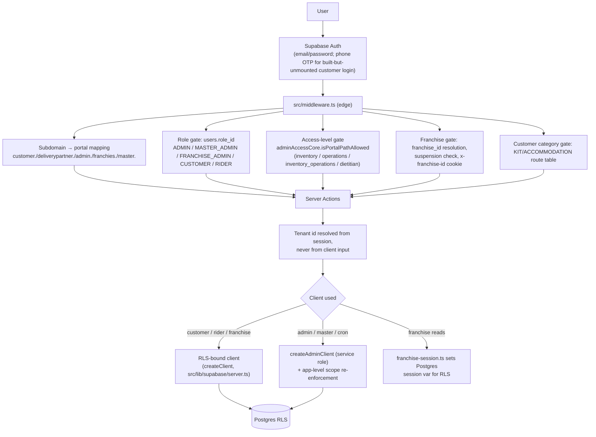

# ArogyaDiet — Security & Data Scoping

> Enforcement map: Middleware → Layout → Server Action → Service → RLS/RPC. Evidence from `src/middleware.ts` (read in full), `src/lib/auth/adminAccessCore.ts`, `src/lib/supabase/*`, RLS scripts in `scripts/`, and schema.

## Diagram — Security flow

## Enforcement by layer (verified)

1. **Middleware (`src/middleware.ts`)** — subdomain resolution and rewrites; role-based portal gate; `adminAccessCore` path gate for admin AND franchise portals (franchise owner treated as `inventory_operations`); customer-category route table (KIT/ACCOMMODATION routes blocked for MEAL customers, enforced for `CATEGORY_ENFORCED_FOR = ["MEAL"]`); suspended-franchise redirect to `/unauthorized`; `x-franchise-id` httpOnly cookie injection; landing-route redirects for logged-in users on auth pages.
2. **Portal layouts** — `(main)/layout.tsx` re-applies the access-level gate as defense in depth (franchise layout propagates `x-portal-pathname` to avoid a second round trip).
3. **Server Actions** — every mutating action resolves the acting tenant/owner id server-side (verified pattern in rider actions, franchise actions, admin dietitian/clinic scoping). zod validation in `src/validations/**`.
4. **Database** — RLS policies per domain (franchise, franchise-inventory, franchise-hierarchy, dietitian, kit tables, OTP throttle); franchise session var enables RLS scoping; `SECURITY DEFINER` RPCs own atomic multi-table writes (stock transfer, pincode move, onboard, recalculation) so partial writes are impossible.
5. **Service-role usage** — `createAdminClient` only on admin/master server paths, cron routes, webhooks, and migration endpoints, where the application itself scopes every query (e.g., franchise stamping writes NULL franchise_id when the feature flag is off).

## Roles & access levels

| Role | Portal | Scope |
|---|---|---|
| `CUSTOMER` | customer | own `customer_profile_id` (RLS) |
| `RIDER` | rider | own `rider_profile_id` (RLS + ownership assertions in actions) |
| `ADMIN` | admin | `admin_access_level` path groups + `admin_clinic_id` clinic scope + franchise-view selector; service-role with app-level scoping |
| `FRANCHISE_ADMIN` | franchise | single `franchise_id` (cookie → session var → RLS); suspended franchise → hard block |
| `MASTER_ADMIN` | master | full network |

`GLOBAL_ACCESS_ROLES = ["ADMIN", "MASTER_ADMIN"]` and `FRANCHISE_SCOPED_ROLE = "FRANCHISE_ADMIN"` are encoded in `src/lib/franchise/constants.ts`.

## Route protection details

| Mechanism | Detail | Status |
|---|---|---|
| Cron auth | Every `/api/cron/*` route requires `?secret=` matching `process.env.CRON_SECRET`, **rejecting when unset** (hardened per `vercel-cron-automations` spec task 1.x — verified in `dispatch/route.ts`; the hardcoded fallback from the spec's "current pattern" is gone) | ✅ |
| Razorpay webhook | HMAC-SHA256 signature check against `RAZORPAY_WEBHOOK_SECRET`; 500 if unset; idempotent via unique `razorpay_payment_id` | ✅ |
| Feature flag | `FRANCHISE_FEATURES_ENABLED` — exactly `"true"`; unset → false → all franchise paths inert | ✅ |
| PIN auth | bcrypt cost 10, `pin_hash` on `users`, `is_temp_pin` forces set-new-pin flow, throttle service with lockout | ✅ |
| OTP auth | Throttle table + pure policy (300s validity, 5 attempts, 900s lockout, 30s resend cooldown, 3 resends/window); `EligibilityChecker` pre-check | ⚠️ built, unmounted |
| APK download | Cloudflare Turnstile verification + `app_download_throttle` rate limiting | 🟡 Turnstile registration marked operator task (unchecked) |
| Audit | `admin_activity_logs` (admin_id FK to auth.users); `rate_config_audit_logs`; `health_log_audit_entries`; `subscription_recalculation_history` / `stay_recalculation_history` / `stay_extension_history` | ✅ |

**Franchise RBAC (verified, supersedes the simple "access-level only" description):** the franchise portal reuses the admin's per-Operations-Group model — `users.admin_operations_access` JSONB maps groups (`customers`, `subscriptions`, `riders`, `operations`, `shop_products`; `franchises` deliberately excluded) to `manage`/`view`. `adminAccessCore` provides the shared pure gate (`hasGroupAccess`, `classifyAdminPath`, `isPortalPathAllowed` with `/franchise/*` → `/admin/*` path aliases); the middleware applies it on the `/franchise` base (owner → `inventory_operations`); `guardFranchiseCustomersWorkspace` re-checks at page level and resolves `franchiseId` from the caller's `users` row (not the cookie); `scopeFranchiseCustomersForDietitian` narrows Dietitians to their assigned customers, failing closed. Evidence: `DIRECT CODE` + `TEST` (`franchiseCustomerScope.test.ts`). Caveat: no `.kiro/specs/` checklist exists for this work; no RLS policies govern the RBAC columns (application-layer model by design).

## Security concerns / recommendations (evidence-based)

1. **Hardcoded secret in repo**: `scripts/add-supabase-cron-jobs.sql` embeds the actual cron secret value in the SQL source. Rotate and parameterize. (Security)
2. **Ops/migration routes exposed**: `/api/migrate/*`, `/api/temp-fix-schema`, `/api/reset-franchise-password` run privileged operations with no visible auth gate in the code read — `UNVERIFIED` whether protected elsewhere (IP allowlist, deployment-level). Recommend an explicit secret/role gate or removal. (Security)
3. **`/sandbox` page** uses the production OneSignal app id and is reachable at root path. `UNVERIFIED` whether gated. (Hygiene)
4. **`admin_activity_logs.admin_id` FK → `auth.users`** while most app tables FK to `public.users` — inconsistent audit identity linkage (minor).
5. **Service-role breadth**: heavy admin/master reliance on service role is intentional (RLS bypass for BI), but every such query must be app-scoped — the codebase does this in the inspected paths, though a systematic audit of all `createAdminClient` call sites is recommended (Testing/verification).
6. **CORS/origins**: `UNVERIFIED` (no Supabase MCP access); confirm allowed origins for production domains.

