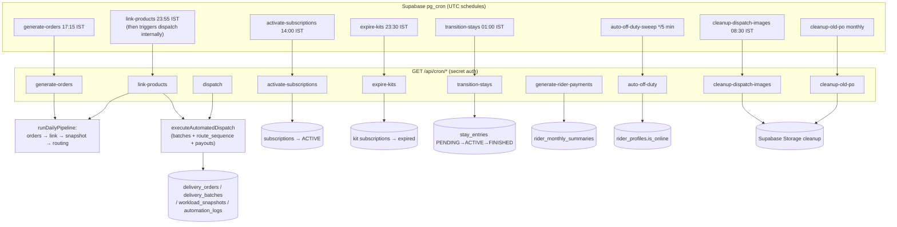

# ArogyaDiet — Automation, Cron & Webhooks

> Scheduler: **Supabase pg_cron** (verified via `scripts/add-supabase-cron-jobs.sql`), not Vercel cron (`vercel.json` = `"crons": []`). All cron routes are GET-only with `?secret=` auth against `CRON_SECRET` (reject when unset — hardened).
>
> **Evidence quality:** schedules = `SCHEMA` (pg_cron script); route behavior/auth = `DIRECT CODE` (route sources); job-route pairing = `DIRECT CODE` for the 8 script jobs, `INFERENCE` for link-products→dispatch chaining (script comment) and `UNVERIFIED` for generate-rider-payments scheduling.

## Diagram — Scheduler → Pipeline → DB

## Job inventory (verified: script + routes)

| Job (pg_cron name) | Schedule (IST) | Route | Work | Status |
|---|---|---|---|---|
| `auto-off-duty-sweep` | every 5 min | `/api/cron/auto-off-duty` | idle riders off-duty (`is_online`); tests exist (`__tests__`) | ✅ |
| `activate-subscriptions` | 14:00 | `/api/cron/activate-subscriptions` | activate due subs, cleanup concluded | ✅ |
| `generate-orders` | 17:15 | `/api/cron/generate-orders` | tomorrow's `delivery_orders` from active subscriptions | ✅ |
| `expire-kits` | 23:30 | `/api/cron/expire-kits` | expire eligible KIT subscriptions | ✅ |
| `link-products` | 23:55 | `/api/cron/link-products` | link paid addon items to delivery orders, then dispatch | ✅ |
| `transition-stays` | 01:00 | `/api/cron/transition-stays` | stay PENDING→ACTIVE, ACTIVE→FINISHED | ✅ |
| `cleanup-dispatch-images` | 08:30 | `/api/cron/cleanup-dispatch-images` | delete expired delivery-proof images | ✅ |
| `cleanup-old-po` | monthly | `/api/cron/cleanup-old-po` | purchase-order files > 3 months | ✅ |
| — (not in script) | — | `/api/cron/dispatch` | direct dispatch trigger (also run from link-products/pipeline); persists workload snapshots + admin email notify | ✅ code; scheduling via link-products |
| — (not in script) | — | `/api/cron/generate-rider-payments` | monthly payout rollup | ⚠️ route exists; **not listed in the pg_cron script** — `UNVERIFIED` how it is scheduled |

**Contradiction resolved:** `AROGYADIET_DASHBOARDS_FEATURES.md` §12 called the empty `vercel.json` crons an unexplained dependency. The pg_cron script shows Supabase-side scheduling calling `https://admin.arogyadiet.com/api/cron/...` — deployment-dependent but no longer mysterious. Remaining caveats: (a) secret value hardcoded in the script (rotate), (b) `net.http_get` 5s default timeout mitigated with 30s timeouts, (c) routes return 200 after the main task and run follow-up work via Next `after()`.

## Webhooks

| Webhook | Trigger | Behavior | Status |
|---|---|---|---|
| `/api/webhooks/razorpay` | Razorpay `payment.captured` / `order.paid` | HMAC verify → ADDON-only reconciliation → stock decrement RPCs → notifications | ✅ (ADDON scope only; subscription flow intentionally not covered) |

## Manual runs & observability

- `automation_logs` tracks each automation type (`ORDER_GEN`, `PRODUCT_LINK`, `ROUTING`) with `run_count`, `last_run_at`, `latest_stats`, **plus** manual-run columns (`manual_run_count`, `last_manual_run_at`, `latest_manual_stats`, `run_date`) — manual triggers from admin operations UI feed the same observability.
- `FallbackAutomationService` + `holidayActions`: holidays pause dispatch; fallback logic covers missed generation.
- Ops pages: Admin `(main)/operations` shows pipeline state; `admin/(main)/test-routing` sandbox trials routing without writes.
- The pg_cron script includes verification queries (`cron.job`, `net._http_response`) to detect silent 405 failures.

## Classification (per task §13)

- **Verified active:** 8 pg_cron jobs + their routes; dispatch pipeline; Razorpay webhook.
- **Code exists, scheduling uncertain:** `/api/cron/generate-rider-payments` (not in pg_cron script) — `UNVERIFIED`.
- **Partially configured:** APK distribution automation (Turnstile/storage operator steps unchecked in spec).
- **Dead/unmounted:** none among cron routes; `/api/migrate/*` and `/api/temp-fix-schema` are one-off ops routes rather than scheduled automations.

