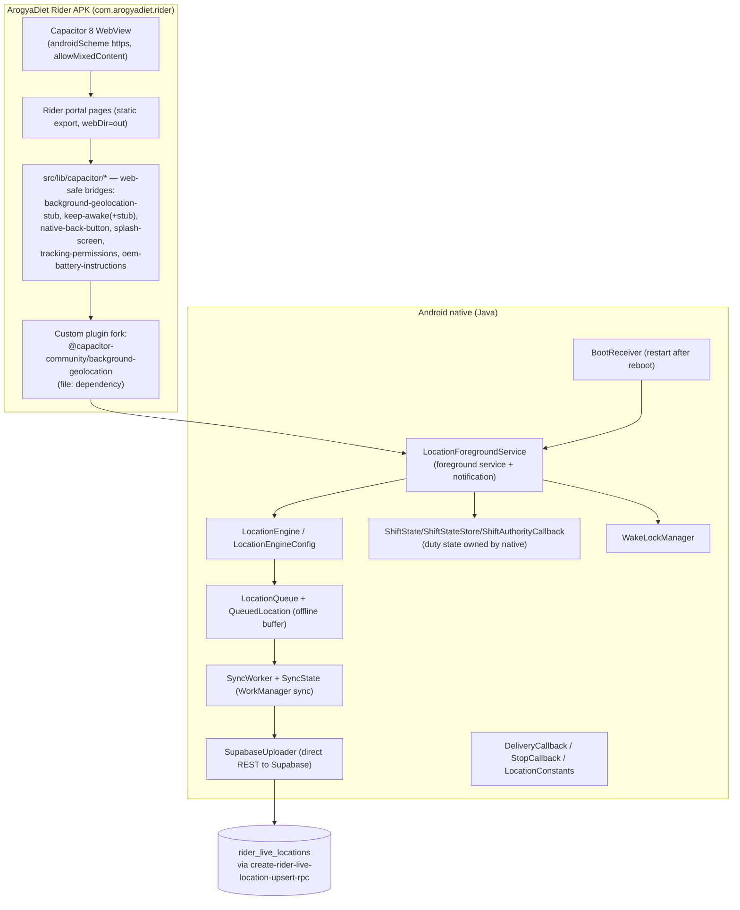

# ArogyaDiet — Native & Mobile Architecture

> Verified from `capacitor.config.json`, `native/plugins/background-geolocation/**` (file tree + Java sources), `src/lib/capacitor/*`, `package.json` (`file:./native/plugins/background-geolocation`), `.kiro/steering/rider-gps-tracking.md`, and `Arogya-rider.apk` at repo root.
>
> **Evidence quality:** plugin composition, class inventory, and bridge = `DIRECT CODE` + `CONFIGURATION`; runtime behaviors (Doze survival, queue flush on reconnect, boot restart in production) = `DOCUMENTATION` (steering doc verification notes) unless re-verified on-device — flagged inline.

## Architecture overview

## Key behaviors (verified from source tree + steering doc)

| Behavior | Implementation | Evidence |
|---|---|---|
| Foreground service tracking | `LocationForegroundService` with notification "ArogyaDiet is tracking your route for delivery updates." / "Active Delivery Route" (capacitor.config.json plugin config) | native plugin + config |
| Offline resilience | `LocationQueue` buffers fixes; `SyncWorker` flushes when connectivity returns | native Java sources |
| Direct-to-DB upload | `SupabaseUploader` writes to `rider_live_locations` (`rider_id, lat, lng, updated_at, tracker_session_id, franchise_id`) | schema + steering doc |
| Reboot persistence | `BootReceiver` restarts tracking after device restart | `BootReceiver.java` |
| Duty authority in native | `ShiftState`/`ShiftStateStore` + `ShiftAuthorityCallback` — service validates the active shift so a killed WebView can't orphan tracking | native Java sources |
| Battery/Doze mitigation | `WakeLockManager` + OEM-specific battery-optimization instructions surfaced in-app (`src/lib/capacitor/oem-battery-instructions.ts`) | steering doc §5 (compile-verified; on-device banner verification was noted as pending at doc time) |
| Permissions | location (fine/background), notifications; `tracking-permissions.ts` flow in JS | plugin manifest + lib |
| Push | Capacitor PushNotifications presentation options (badge/sound/alert) via OneSignal | capacitor.config.json |

## JS ↔ native communication

Standard Capacitor bridge: JS imports the plugin (`@capacitor-community/background-geolocation`, resolved to the local fork via `file:./native/plugins/background-geolocation` in `package.json`); web builds use `src/lib/capacitor/background-geolocation-stub.ts` (same method signatures incl. `BatteryOptimizationStatus`) so the rider portal also runs in a plain browser. Splash screen auto-hide is manual (`launchAutoHide: false` → `splash-screen.ts` hides it), and `native-back-button.ts` maps hardware back to app navigation.

## APK distribution

- Repo root contains `Arogya-rider.apk` (test artifact).
- In-app flow: `customer/(public)/app/[slug]` landing page + `api/app-download/grant` (Turnstile + `app_download_throttle` rate limiting) + `src/lib/appDistribution/{manifest,qr,storage,slug,rateLimit,config,content}` — APK served from Supabase Storage with QR codes.
- `.kiro/specs/app-apk-distribution` marks storage bucket + Turnstile registration as unchecked **operator** tasks and end-to-end verification (task 14) unchecked → 🟡.
- Per steering doc, the native Android build lives in a separate repo (`E:\Local Clients\Next.js\rider-mobile-app`), outside this workspace; `native/plugins/background-geolocation` here is the source of the hardened plugin that repo consumes. Release builds are sideloaded (`rider_alias` signing key; Play Integrity notice expected).

## Status

- ✅ Background GPS tracking chain (service, queue, sync, boot, shift authority) — verified working code; on-device runtime verification documented as done for earlier phases in `.kiro/steering/rider-gps-tracking.md` (later phases noted as pending visual confirmation).
- ✅ WebView app shell + web-safe stubs.
- 🟡 APK distribution end-to-end (operator steps unchecked).
- 🔍 `UNVERIFIED`: exact static-export scope (`webDir: "out"` implies static rider build; how it points at the deployed app/server config is outside this repo), APK signing/provenance policy.
- ⚠️ **Security note:** `SupabaseUploader` implies Supabase credentials (service key or anon+RPC permissions) are embedded in the APK. Confirm it uses an anon key + RLS-scoped RPC (upsert RPC limited to the rider's own `rider_id`) rather than a service-role key. `UNVERIFIED` from this repo — flagged for review.

