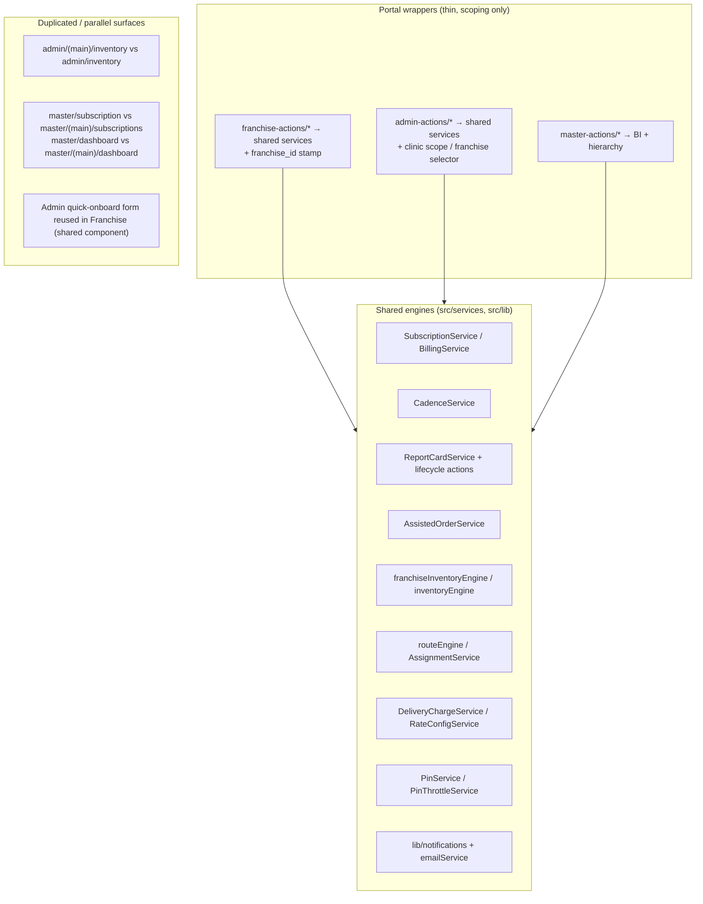

# ArogyaDiet — Shared vs Portal-Specific Logic

> Engineering-quality view: what is reused, what is duplicated, and why it matters. Verified from action/service imports and portal route parity.

## Pattern summary

## Shared (multi-portal) capabilities

| Capability | Shared artifact | Consumers | Notes |
|---|---|---|---|
| Dietitian cadence | `CadenceService` | Admin Log-Customer, Franchise Dietitian Activity, Master Dietitian Activity | Explicitly one engine so franchise numbers match master numbers (code comment noted in features doc §8.5) |
| Report cards | `ReportCardService`, `reportCardActions`, `reportCardLifecycleActions`, PDF path | Admin, Franchise, Master | Same lifecycle (ACTIVE→finalised, reopenable) |
| Assisted orders | `AssistedOrderService`, `place_assisted_addon_order` RPC | Admin `customers/assisted-order`, Franchise `shop-products/assisted-order` | Franchise variant forces delivery fee 0 (features doc) |
| Customer 360 | `customerManagementCore`, shared components | Admin + Franchise | Franchise reuses admin components |
| Subscription lifecycle | `SubscriptionService`, `BillingService`, `SubscriptionPaymentService` | Customer, Admin, Franchise | Portal wrappers add scope |
| Routing/dispatch | `routeEngine`, `AssignmentService`, `lib/routing/googleRoutes.ts`, `lib/distance.ts` | Admin (+sandbox), Franchise operations | Pincode-based; franchise rows stamped |
| Inventory engines | `inventoryEngine` (central), `franchiseInventoryEngine` | Admin/Master (central), Franchise/Master (franchise) | RPC-backed FIFO |
| Rates & charges | `RateConfigService`, `DeliveryChargeService` | Master (config), Admin/Franchise (consumption) | Audit-logged |
| Auth mechanics | `PinService`, `PinThrottleService`, `AuthService`, `OtpLoginService` ⚠️ | Customer (PIN), all (email) | OTP unmounted |
| Notifications | `lib/notifications*`, `emailService`, OneSignal wrapper | All portals + cron | `notifyAdmins` shared-admin email |
| UI kit | `src/shared/components`, shadcn/radix | All portals | |
| Validation | `src/validations/*` zod schemas | All actions | |

## Portal-specific logic

| Portal | Unique logic |
|---|---|
| Customer | PIN login flow, planner/pause/address per-day engine (`manageMealActions`), KIT/stay trackers, shop cart (`useCartStore`) |
| Rider | `shiftActions`, `routeActions` (consume assigned route), native GPS integration |
| Admin | onboarding trio (full/quick/bulk), kitchen-shop catalog, workload snapshots UI, routing sandbox, finance payouts settlement, franchise oversight |
| Franchise | dispute raising, pincode **requests** (vs Master approval), own product settings, franchise marketing (coupons), inventory accept/reject/receive UI |
| Master | hierarchy provisioning (business→clinic), BI suites, rate configuration, dispute resolution, user management, stock-transfer initiation, agreement docs |

## Duplications / parallel implementations (findings)

1. **Two admin inventory roots** — `admin/(main)/inventory` and top-level `admin/inventory` with the same subfolders (ledger/manufacturing/mappings/shop-products). Relationship `UNVERIFIED`; likely regrouping leftover. Consolidate or redirect one.
2. **Master duplicate surfaces** — top-level `master/dashboard`, `master/subscription`, `master/tracking` vs `(main)` equivalents. Same pattern; consolidate.
3. **Rider top-level `subscription`/`tracking` routes** — not part of the rider flow; likely dead.
4. **Franchise "wrappers"** are *not* copy-paste: 15 files under `franchise-actions/` are thin scoping delegations — good reuse discipline.
5. **PDF templates** exist as both server services (`*ReportService`) and React templates (`*Template.tsx`) — complementary (service renders template), not duplication.

## Assessment

The codebase follows a consistent **shared-engine + portal-wrapper** architecture; duplication is concentrated in *route surfaces* (legacy regrouping), not business logic. Cleaning dead/duplicate routes is the main hygiene win; no evidence of divergent business rules between portals was found (franchise differences are intentional scoping: delivery fee 0, own catalog, disputes raise-only).
