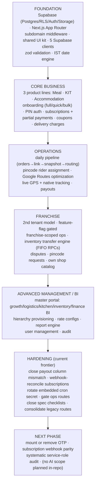

# ArogyaDiet — Completed vs Next

> Evidence-derived status rollup and roadmap. Every item cites its evidence location. Categories: Production blockers · Reliability/hardening · Security/configuration · Testing/verification · UX improvements · Future functionality.

## Status rollup

| Status | Count (approx., discovered artifacts) | Representative items |
|---|---|---|
| ✅ Verified live | majority of features across 5 portals | all portal cores, daily pipeline, dispatch, payments, KIT, stay, franchise inventory, BI, hierarchy, native GPS chain |
| 🟡 Implemented with caveat | ~12 | rider payout column mismatch, subscription webhook gap, recalc "not tested", APK distribution operator steps, report-card PDF spec gaps, manual payments |
| ⚠️ Partial / unmounted | ~6 | OTP login, dead rider/master routes, duplicate inventory roots, `/sandbox`, PO export route placement |
| ⛔ Stub / not implemented | ~1 | customer signup (disabled by design — admin-created accounts only) |
| 🔍 Unverified | several | cron for rider-payments, ops-route protection, APK credentials, static export scope, CORS |

## Production blockers

```text
Gap: rider_monthly_summaries.net_payable never filled by the settlement path
Why it matters: rider payout UI + leaderboard read net_payable; cron writes total_earnings → payouts display wrong
Evidence: AROGYADIET_DASHBOARDS_FEATURES.md §12; schema status GENERATED/PAID vs docs OPEN/LOCKED/SETTLED
Affected feature: Rider payout, Admin/Master settlement
Recommended next step: locate/align the fill path (cron or financePayoutActions), add a parity test
Priority: P1    Status: OPEN
```

## Reliability / hardening

```text
Gap: subscription checkout has no server-side reconciliation
Why: UPI app-switch kill → payment captured, subscription not activated
Evidence: src/app/api/webhooks/razorpay/route.ts header (self-documented)
Step: persist checkoutData server-side at order creation; extend webhook to checkout_type SUBSCRIPTION
Priority: P1    Status: OPEN (design note exists in code)
```

```text
Gap: /api/cron/generate-rider-payments not present in scripts/add-supabase-cron-jobs.sql
Why: monthly payouts may not be rolling up automatically
Evidence: pg_cron script listing vs /api/cron route list
Step: add cron schedule (or document manual trigger owner)
Priority: P1    Status: OPEN / UNVERIFIED scheduling
```

## Security / configuration

```text
Gap: cron secret hardcoded in scripts/add-supabase-cron-jobs.sql (committed to repo)
Step: rotate secret; parameterize script; consider header-based auth
Priority: P1    Status: OPEN
```

```text
Gap: /api/migrate/*, /api/temp-fix-schema, /api/reset-franchise-password, /sandbox lack visible auth gates
Why: privileged one-off operations reachable via HTTP
Evidence: route listing; no secret check in read code paths (dispatch cron, by contrast, is gated)
Step: add secret/admin gate or delete; audit remaining routes
Priority: P2    Status: OPEN / UNVERIFIED external protection
```

```text
Gap: APK embeds Supabase credentials (SupabaseUploader)
Step: confirm anon key + RLS-scoped upsert RPC (own rider_id only)
Priority: P2    Status: OPEN / UNVERIFIED
```

## Testing / verification

```text
Gap: recalculate_subscription_tenure marked "not tested" (commit message)
Step: property tests mirroring accommodation recalculation suite (fast-check, src/test/accommodation)
Priority: P2
```

```text
Gap: unchecked spec items — report-card final PDF export + DB verification (report-card-lifecycle
tasks 4/6/7); app-apk-distribution operator steps + e2e (tasks 4/5/9/10/14)
Step: close checklist items, then flip statuses here
Priority: P2–P3
```

```text
Gap: systematic audit of all createAdminClient call sites for app-level scoping
Step: lint rule or review checklist
Priority: P3
```

## UX improvements

- Consolidate duplicate/legacy route surfaces (admin inventory roots, master duplicates, rider dead routes) to remove user-facing ambiguity. P3.
- Decide OTP vs PIN login; if PIN stays, remove OTP UI from consideration or mount it as an alternative factor. P3.
- `/sandbox` removal before public deploy. P3.

## Future functionality (only where repo evidence shows intent)

- `_` none discovered with in-repo specs beyond the checked/unchecked items above; `.kiro/specs` covers current scope. AI features: none planned in-repo (see `04-ai-model-architecture.md`).

## Recommended next priorities (ordered)

1. Fix rider payout `net_payable` fill path (P1 blocker).
2. Server-side persist + webhook-reconcile subscription checkout (P1 reliability).
3. Schedule or verify `generate-rider-payments` cron (P1).
4. Rotate/parameterize pg_cron secret (P1 security).
5. Gate or remove ops/migration routes + sandbox (P2 security).
6. Close spec checklists (report-card PDF, APK distribution) (P2–P3).
7. Consolidate duplicate routes; decide OTP fate (P3 hygiene).

---

## Client-Ready Roadmap (Part 24)

> **Note:** this is an **architectural grouping of verified capabilities, not a historical development timeline** — the repository does not reliably encode build order; stages are ordered by architectural dependency.



| Stage | Verified capabilities (evidence in `02`, `06`, `07`) |
|---|---|
| Foundation | All 5 portals route correctly through middleware; RLS + service-role split; shared component library (`src/shared`) — `DIRECT CODE` |
| Core business | Meal/KIT/Accommodation lifecycles end-to-end incl. payments and invoices — `DIRECT CODE` + `TEST` |
| Operations | 8 pg_cron jobs + 10 routes; halt-on-failure pipeline; pincode routing — `DIRECT CODE` + `SCHEMA` |
| Franchise | Feature-flag-gated tenant; 7 SECURITY DEFINER transfer RPCs — `DIRECT CODE` + `SCHEMA` |
| BI | 6 BI action suites + report engine — `DIRECT CODE` |
| Hardening | The 7 priorities above — `DIRECT CODE` findings |
| Next phase | Items 3–7 of the priority list — `INFERENCE` from evidence |

